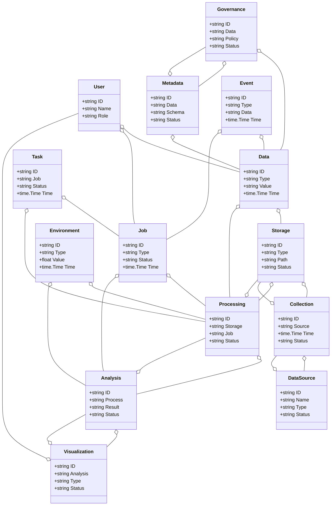
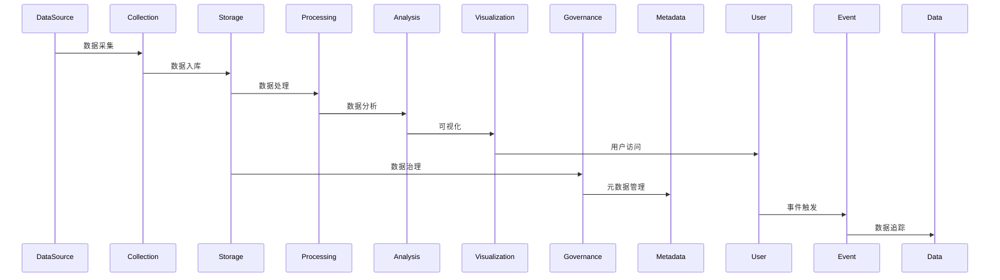
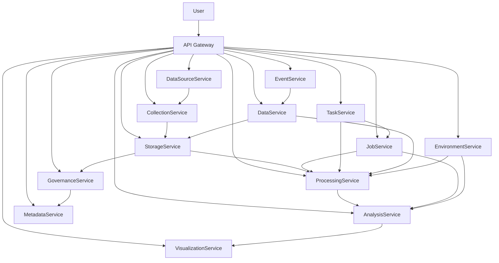

# 大数据分析/智慧大数据架构（Golang国际主流实践）

> **简介**: 大数据分析平台架构设计，涵盖数据采集、存储、计算和可视化

## 目录

- [大数据分析/智慧大数据架构（Golang国际主流实践）](#大数据分析智慧大数据架构golang国际主流实践)
  - [目录](#目录)
  - [2. 大数据分析/智慧大数据架构概述](#2-大数据分析智慧大数据架构概述)
    - [国际标准定义](#国际标准定义)
    - [发展历程与核心思想](#发展历程与核心思想)
    - [典型应用场景](#典型应用场景)
    - [与传统IT对比](#与传统it对比)
  - [3. 信息概念架构](#3-信息概念架构)
    - [领域建模方法](#领域建模方法)
    - [核心实体与关系](#核心实体与关系)
      - [UML 类图（Mermaid）](#uml-类图mermaid)
    - [典型数据流](#典型数据流)
      - [数据流时序图（Mermaid）](#数据流时序图mermaid)
    - [Golang 领域模型代码示例](#golang-领域模型代码示例)
  - [4. 分布式系统挑战](#4-分布式系统挑战)
    - [弹性与实时性](#弹性与实时性)
    - [数据安全与互操作性](#数据安全与互操作性)
    - [可观测性与智能优化](#可观测性与智能优化)
  - [5. 架构设计解决方案](#5-架构设计解决方案)
    - [服务解耦与标准接口](#服务解耦与标准接口)
    - [智能分析与弹性协同](#智能分析与弹性协同)
    - [数据安全与互操作设计](#数据安全与互操作设计)
    - [架构图（Mermaid）](#架构图mermaid)
    - [Golang代码示例](#golang代码示例)
  - [6. Golang实现范例](#6-golang实现范例)
    - [工程结构示例](#工程结构示例)
    - [关键代码片段](#关键代码片段)
    - [CI/CD 配置（GitHub Actions 示例）](#cicd-配置github-actions-示例)
  - [7. 形式化建模与证明](#7-形式化建模与证明)
    - [数据流-作业-分析建模](#数据流-作业-分析建模)
      - [性质1：弹性扩展性](#性质1弹性扩展性)
      - [性质2：数据安全性](#性质2数据安全性)
    - [符号说明](#符号说明)
  - [8. 参考与外部链接](#8-参考与外部链接)

---

## 2. 大数据分析/智慧大数据架构概述

### 国际标准定义

大数据分析/智慧大数据架构是指以数据驱动、弹性扩展、智能分析、实时处理为核心，支持数据采集、存储、处理、分析、可视化、治理、共享等场景的分布式系统架构。

- **国际主流参考**：NIST Big Data Reference Architecture、ISO/IEC 20546、ISO/IEC 20547、OGC Big Data、Apache Hadoop、Apache Spark、Apache Flink、Kafka、Presto、Delta Lake、Parquet、Arrow、OpenLineage、GDPR、ISO/IEC 27001。

### 发展历程与核心思想

- 2000s：Hadoop生态、批处理、数据湖、NoSQL。
- 2010s：实时流处理、Lambda/Kappa架构、云原生大数据、数据治理、数据可视化。
- 2020s：AI驱动分析、智能数据湖、数据中台、数据共享、数据主权、隐私保护。
- 核心思想：数据驱动、弹性扩展、智能分析、标准互操作、数据安全。

### 典型应用场景

- 智能数据湖、实时分析、数据仓库、数据治理、AI建模、数据可视化、数据共享、数据市场等。

### 与传统IT对比

| 维度         | 传统IT系统         | 智慧大数据架构         |
|--------------|-------------------|----------------------|
| 数据规模     | GB-TB             | PB-EB                |
| 处理模式     | 批量、离线         | 实时、流式、批流融合   |
| 扩展性       | 垂直扩展           | 水平弹性扩展          |
| 智能化       | 规则、人工         | AI驱动、自动优化      |
| 数据治理     | 手工、割裂         | 自动、统一、标准化    |
| 适用场景     | 单一业务           | 多业务、跨域、全球协同 |

---

## 3. 信息概念架构

### 领域建模方法

- 采用分层建模（采集层、存储层、计算层、分析层、治理层、应用层）、UML、ER图。
- 核心实体：数据源、采集、存储、处理、分析、可视化、治理、元数据、作业、任务、用户、事件、数据、环境。

### 核心实体与关系

| 实体    | 属性                        | 关系           |
|---------|-----------------------------|----------------|
| 数据源  | ID, Name, Type, Status      | 关联采集/存储   |
| 采集    | ID, Source, Time, Status    | 关联数据源/存储 |
| 存储    | ID, Type, Path, Status      | 关联采集/处理   |
| 处理    | ID, Storage, Job, Status    | 关联存储/分析   |
| 分析    | ID, Process, Result, Status | 关联处理/可视化 |
| 可视化  | ID, Analysis, Type, Status  | 关联分析/用户   |
| 治理    | ID, Data, Policy, Status    | 关联数据/元数据 |
| 元数据  | ID, Data, Schema, Status    | 关联数据/治理   |
| 作业    | ID, Type, Status, Time      | 关联处理/分析   |
| 任务    | ID, Job, Status, Time       | 关联作业/处理   |
| 用户    | ID, Name, Role              | 管理数据/作业   |
| 事件    | ID, Type, Data, Time        | 关联数据/作业   |
| 数据    | ID, Type, Value, Time       | 关联存储/处理   |
| 环境    | ID, Type, Value, Time       | 关联处理/分析   |

#### UML 类图（Mermaid）



### 典型数据流

1. 数据采集→存储→处理→分析→可视化→治理→共享→优化。

#### 数据流时序图（Mermaid）



### Golang 领域模型代码示例

```go
package bigdata

import (
    "context"
    "time"
    "errors"
    "sync"
    "encoding/json"
    "math"
    "github.com/apache/beam/sdks/v2/go/pkg/beam"
    "github.com/apache/beam/sdks/v2/go/pkg/beam/transforms/top"
    "github.com/apache/beam/sdks/v2/go/pkg/beam/transforms/stats"
)

// 数据源实体
type DataSource struct {
    ID            string            `json:"id"`
    Name          string            `json:"name"`
    Type          DataSourceType    `json:"type"`
    Status        DataSourceStatus  `json:"status"`
    Configuration DataSourceConfig  `json:"configuration"`
    Schema        DataSchema        `json:"schema"`
    Metadata      map[string]interface{} `json:"metadata"`
    Statistics    DataSourceStats   `json:"statistics"`
    CreatedAt     time.Time         `json:"created_at"`
    UpdatedAt     time.Time         `json:"updated_at"`
    LastSyncAt    *time.Time        `json:"last_sync_at"`
}

type DataSourceType string

const (
    DataSourceTypeDatabase    DataSourceType = "database"
    DataSourceTypeFile        DataSourceType = "file"
    DataSourceTypeAPI         DataSourceType = "api"
    DataSourceTypeStream      DataSourceType = "stream"
    DataSourceTypeMessageQueue DataSourceType = "message_queue"
    DataSourceTypeWebScraping DataSourceType = "web_scraping"
    DataSourceTypeIoT         DataSourceType = "iot"
    DataSourceTypeSocialMedia DataSourceType = "social_media"
)

type DataSourceStatus string

const (
    DataSourceStatusActive   DataSourceStatus = "active"
    DataSourceStatusInactive DataSourceStatus = "inactive"
    DataSourceStatusError    DataSourceStatus = "error"
    DataSourceStatusSyncing  DataSourceStatus = "syncing"
)

type DataSourceConfig struct {
    ConnectionString string            `json:"connection_string"`
    Credentials      map[string]string `json:"credentials"`
    Options          map[string]interface{} `json:"options"`
    Filters          []DataFilter      `json:"filters"`
    Transformations  []DataTransformation `json:"transformations"`
}

type DataFilter struct {
    Field    string      `json:"field"`
    Operator string      `json:"operator"`
    Value    interface{} `json:"value"`
}

type DataTransformation struct {
    Type       string                 `json:"type"`
    Parameters map[string]interface{} `json:"parameters"`
}

type DataSchema struct {
    Fields    []FieldDefinition `json:"fields"`
    Version   string            `json:"version"`
    Namespace string            `json:"namespace"`
}

type FieldDefinition struct {
    Name        string `json:"name"`
    Type        string `json:"type"`
    Required    bool   `json:"required"`
    Description string `json:"description"`
    Constraints map[string]interface{} `json:"constraints"`
}

type DataSourceStats struct {
    TotalRecords    int64     `json:"total_records"`
    RecordsPerSec   float64   `json:"records_per_sec"`
    DataSize        int64     `json:"data_size"`
    LastRecordTime  time.Time `json:"last_record_time"`
    ErrorCount      int64     `json:"error_count"`
    SuccessRate     float64   `json:"success_rate"`
}

// 数据采集实体
type DataCollection struct {
    ID            string            `json:"id"`
    DataSourceID  string            `json:"data_source_id"`
    Type          CollectionType    `json:"type"`
    Status        CollectionStatus  `json:"status"`
    Configuration CollectionConfig  `json:"configuration"`
    Schedule      CollectionSchedule `json:"schedule"`
    Statistics    CollectionStats   `json:"statistics"`
    CreatedAt     time.Time         `json:"created_at"`
    UpdatedAt     time.Time         `json:"updated_at"`
    LastRunAt     *time.Time        `json:"last_run_at"`
    NextRunAt     *time.Time        `json:"next_run_at"`
}

type CollectionType string

const (
    CollectionTypeBatch    CollectionType = "batch"
    CollectionTypeStream   CollectionType = "stream"
    CollectionTypeRealTime CollectionType = "realtime"
    CollectionTypeScheduled CollectionType = "scheduled"
)

type CollectionStatus string

const (
    CollectionStatusRunning   CollectionStatus = "running"
    CollectionStatusStopped   CollectionStatus = "stopped"
    CollectionStatusError     CollectionStatus = "error"
    CollectionStatusPaused    CollectionStatus = "paused"
)

type CollectionConfig struct {
    BatchSize     int           `json:"batch_size"`
    BufferSize    int           `json:"buffer_size"`
    Timeout       time.Duration `json:"timeout"`
    RetryPolicy   RetryPolicy   `json:"retry_policy"`
    Compression   bool          `json:"compression"`
    Encryption    bool          `json:"encryption"`
    Deduplication bool          `json:"deduplication"`
}

type RetryPolicy struct {
    MaxRetries int           `json:"max_retries"`
    Backoff    time.Duration `json:"backoff"`
    Strategy   string        `json:"strategy"`
}

type CollectionSchedule struct {
    Type     ScheduleType `json:"type"`
    Cron     string       `json:"cron"`
    Interval time.Duration `json:"interval"`
    Timezone string       `json:"timezone"`
}

type ScheduleType string

const (
    ScheduleTypeCron    ScheduleType = "cron"
    ScheduleTypeInterval ScheduleType = "interval"
    ScheduleTypeManual  ScheduleType = "manual"
)

type CollectionStats struct {
    TotalRecords    int64     `json:"total_records"`
    ProcessedRecords int64    `json:"processed_records"`
    FailedRecords   int64     `json:"failed_records"`
    RecordsPerSec   float64   `json:"records_per_sec"`
    AverageLatency  time.Duration `json:"average_latency"`
    LastRecordTime  time.Time `json:"last_record_time"`
}

// 数据存储实体
type DataStorage struct {
    ID            string            `json:"id"`
    Name          string            `json:"name"`
    Type          StorageType       `json:"type"`
    Status        StorageStatus     `json:"status"`
    Configuration StorageConfig     `json:"configuration"`
    Schema        DataSchema        `json:"schema"`
    Partitions    []Partition       `json:"partitions"`
    Statistics    StorageStats      `json:"statistics"`
    CreatedAt     time.Time         `json:"created_at"`
    UpdatedAt     time.Time         `json:"updated_at"`
}

type StorageType string

const (
    StorageTypeHDFS      StorageType = "hdfs"
    StorageTypeS3        StorageType = "s3"
    StorageTypeGCS       StorageType = "gcs"
    StorageTypeAzureBlob StorageType = "azure_blob"
    StorageTypeHBase     StorageType = "hbase"
    StorageTypeCassandra StorageType = "cassandra"
    StorageTypeMongoDB   StorageType = "mongodb"
    StorageTypeElasticsearch StorageType = "elasticsearch"
)

type StorageStatus string

const (
    StorageStatusActive   StorageStatus = "active"
    StorageStatusInactive StorageStatus = "inactive"
    StorageStatusError    StorageStatus = "error"
    StorageStatusMaintenance StorageStatus = "maintenance"
)

type StorageConfig struct {
    ConnectionString string            `json:"connection_string"`
    Credentials      map[string]string `json:"credentials"`
    Options          map[string]interface{} `json:"options"`
    Replication      int               `json:"replication"`
    Compression      string            `json:"compression"`
    Encryption       bool              `json:"encryption"`
    Retention        time.Duration     `json:"retention"`
}

type Partition struct {
    ID       string            `json:"id"`
    Name     string            `json:"name"`
    Type     PartitionType     `json:"type"`
    Value    string            `json:"value"`
    Path     string            `json:"path"`
    Size     int64             `json:"size"`
    Records  int64             `json:"records"`
    CreatedAt time.Time        `json:"created_at"`
    UpdatedAt time.Time        `json:"updated_at"`
}

type PartitionType string

const (
    PartitionTypeTime    PartitionType = "time"
    PartitionTypeHash    PartitionType = "hash"
    PartitionTypeRange   PartitionType = "range"
    PartitionTypeList    PartitionType = "list"
)

type StorageStats struct {
    TotalSize       int64     `json:"total_size"`
    TotalRecords    int64     `json:"total_records"`
    Partitions      int       `json:"partitions"`
    CompressionRatio float64  `json:"compression_ratio"`
    LastUpdated     time.Time `json:"last_updated"`
}

// 数据处理实体
type DataProcessing struct {
    ID            string            `json:"id"`
    Name          string            `json:"name"`
    Type          ProcessingType    `json:"type"`
    Status        ProcessingStatus  `json:"status"`
    Configuration ProcessingConfig  `json:"configuration"`
    Pipeline      ProcessingPipeline `json:"pipeline"`
    Dependencies  []string          `json:"dependencies"`
    Statistics    ProcessingStats   `json:"statistics"`
    CreatedAt     time.Time         `json:"created_at"`
    UpdatedAt     time.Time         `json:"updated_at"`
    LastRunAt     *time.Time        `json:"last_run_at"`
}

type ProcessingType string

const (
    ProcessingTypeBatch    ProcessingType = "batch"
    ProcessingTypeStream   ProcessingType = "stream"
    ProcessingTypeML       ProcessingType = "ml"
    ProcessingTypeETL      ProcessingType = "etl"
    ProcessingTypeELT      ProcessingType = "elt"
    ProcessingTypeRealTime ProcessingType = "realtime"
)

type ProcessingStatus string

const (
    ProcessingStatusRunning   ProcessingStatus = "running"
    ProcessingStatusCompleted ProcessingStatus = "completed"
    ProcessingStatusFailed    ProcessingStatus = "failed"
    ProcessingStatusCancelled ProcessingStatus = "cancelled"
    ProcessingStatusQueued    ProcessingStatus = "queued"
)

type ProcessingConfig struct {
    Engine        ProcessingEngine `json:"engine"`
    Resources     ResourceConfig   `json:"resources"`
    Parallelism   int              `json:"parallelism"`
    Checkpointing bool             `json:"checkpointing"`
    Watermarks    bool             `json:"watermarks"`
    LateData      LateDataConfig   `json:"late_data"`
}

type ProcessingEngine string

const (
    ProcessingEngineSpark     ProcessingEngine = "spark"
    ProcessingEngineFlink     ProcessingEngine = "flink"
    ProcessingEngineBeam      ProcessingEngine = "beam"
    ProcessingEngineKafka     ProcessingEngine = "kafka"
    ProcessingEngineStorm     ProcessingEngine = "storm"
    ProcessingEngineSamza     ProcessingEngine = "samza"
)

type ResourceConfig struct {
    CPU    string `json:"cpu"`
    Memory string `json:"memory"`
    Disk   string `json:"disk"`
    GPU    string `json:"gpu"`
}

type LateDataConfig struct {
    Strategy string        `json:"strategy"`
    Window   time.Duration `json:"window"`
    MaxDelay time.Duration `json:"max_delay"`
}

type ProcessingPipeline struct {
    Steps    []PipelineStep `json:"steps"`
    Version  string         `json:"version"`
    Checksum string         `json:"checksum"`
}

type PipelineStep struct {
    ID          string            `json:"id"`
    Name        string            `json:"name"`
    Type        StepType          `json:"type"`
    Operation   string            `json:"operation"`
    Parameters  map[string]interface{} `json:"parameters"`
    Dependencies []string         `json:"dependencies"`
    Status      StepStatus        `json:"status"`
}

type StepType string

const (
    StepTypeSource     StepType = "source"
    StepTypeTransform  StepType = "transform"
    StepTypeFilter     StepType = "filter"
    StepTypeAggregate  StepType = "aggregate"
    StepTypeJoin       StepType = "join"
    StepTypeWindow     StepType = "window"
    StepTypeSink       StepType = "sink"
)

type StepStatus string

const (
    StepStatusPending   StepStatus = "pending"
    StepStatusRunning   StepStatus = "running"
    StepStatusCompleted StepStatus = "completed"
    StepStatusFailed    StepStatus = "failed"
    StepStatusSkipped   StepStatus = "skipped"
)

type ProcessingStats struct {
    TotalRecords    int64         `json:"total_records"`
    ProcessedRecords int64        `json:"processed_records"`
    FailedRecords   int64         `json:"failed_records"`
    ProcessingTime  time.Duration `json:"processing_time"`
    Throughput      float64       `json:"throughput"`
    LastUpdated     time.Time     `json:"last_updated"`
}

// 数据分析实体
type DataAnalysis struct {
    ID            string            `json:"id"`
    Name          string            `json:"name"`
    Type          AnalysisType      `json:"type"`
    Status        AnalysisStatus    `json:"status"`
    Configuration AnalysisConfig    `json:"configuration"`
    Query         AnalysisQuery     `json:"query"`
    Results       AnalysisResults   `json:"results"`
    Statistics    AnalysisStats     `json:"statistics"`
    CreatedAt     time.Time         `json:"created_at"`
    UpdatedAt     time.Time         `json:"updated_at"`
    CompletedAt   *time.Time        `json:"completed_at"`
}

type AnalysisType string

const (
    AnalysisTypeDescriptive AnalysisType = "descriptive"
    AnalysisTypeDiagnostic  AnalysisType = "diagnostic"
    AnalysisTypePredictive  AnalysisType = "predictive"
    AnalysisTypePrescriptive AnalysisType = "prescriptive"
    AnalysisTypeExploratory AnalysisType = "exploratory"
    AnalysisTypeStatistical AnalysisType = "statistical"
    AnalysisTypeML          AnalysisType = "ml"
    AnalysisTypeDeepLearning AnalysisType = "deep_learning"
)

type AnalysisStatus string

const (
    AnalysisStatusRunning   AnalysisStatus = "running"
    AnalysisStatusCompleted AnalysisStatus = "completed"
    AnalysisStatusFailed    AnalysisStatus = "failed"
    AnalysisStatusCancelled AnalysisStatus = "cancelled"
    AnalysisStatusQueued    AnalysisStatus = "queued"
)

type AnalysisConfig struct {
    Engine        AnalysisEngine `json:"engine"`
    Algorithm     string         `json:"algorithm"`
    Parameters    map[string]interface{} `json:"parameters"`
    Validation    ValidationConfig `json:"validation"`
    CrossValidation bool         `json:"cross_validation"`
}

type AnalysisEngine string

const (
    AnalysisEngineSparkML    AnalysisEngine = "spark_ml"
    AnalysisEngineTensorFlow AnalysisEngine = "tensorflow"
    AnalysisEnginePyTorch    AnalysisEngine = "pytorch"
    AnalysisEngineScikitLearn AnalysisEngine = "scikit_learn"
    AnalysisEngineR          AnalysisEngine = "r"
    AnalysisEnginePython     AnalysisEngine = "python"
    AnalysisEngineSQL        AnalysisEngine = "sql"
)

type ValidationConfig struct {
    Method    string  `json:"method"`
    TestSize  float64 `json:"test_size"`
    RandomState int   `json:"random_state"`
    Metrics   []string `json:"metrics"`
}

type AnalysisQuery struct {
    SQL       string            `json:"sql"`
    Filters   []QueryFilter     `json:"filters"`
    Aggregations []Aggregation  `json:"aggregations"`
    GroupBy   []string          `json:"group_by"`
    OrderBy   []OrderBy         `json:"order_by"`
    Limit     int               `json:"limit"`
}

type QueryFilter struct {
    Field    string      `json:"field"`
    Operator string      `json:"operator"`
    Value    interface{} `json:"value"`
}

type Aggregation struct {
    Field string `json:"field"`
    Function string `json:"function"`
    Alias string `json:"alias"`
}

type OrderBy struct {
    Field string `json:"field"`
    Direction string `json:"direction"`
}

type AnalysisResults struct {
    Data       interface{}       `json:"data"`
    Metrics    map[string]float64 `json:"metrics"`
    Charts     []Chart           `json:"charts"`
    Insights   []Insight         `json:"insights"`
    Recommendations []Recommendation `json:"recommendations"`
}

type Chart struct {
    ID       string            `json:"id"`
    Type     ChartType         `json:"type"`
    Title    string            `json:"title"`
    Data     interface{}       `json:"data"`
    Config   map[string]interface{} `json:"config"`
}

type ChartType string

const (
    ChartTypeLine    ChartType = "line"
    ChartTypeBar     ChartType = "bar"
    ChartTypePie     ChartType = "pie"
    ChartTypeScatter ChartType = "scatter"
    ChartTypeHeatmap ChartType = "heatmap"
    ChartTypeHistogram ChartType = "histogram"
)

type Insight struct {
    ID          string  `json:"id"`
    Type        string  `json:"type"`
    Title       string  `json:"title"`
    Description string  `json:"description"`
    Confidence  float64 `json:"confidence"`
    Impact      string  `json:"impact"`
}

type Recommendation struct {
    ID          string  `json:"id"`
    Type        string  `json:"type"`
    Title       string  `json:"title"`
    Description string  `json:"description"`
    Priority    string  `json:"priority"`
    Action      string  `json:"action"`
}

type AnalysisStats struct {
    TotalRecords    int64         `json:"total_records"`
    ProcessedRecords int64        `json:"processed_records"`
    AnalysisTime    time.Duration `json:"analysis_time"`
    Accuracy        float64       `json:"accuracy"`
    Precision       float64       `json:"precision"`
    Recall          float64       `json:"recall"`
    F1Score         float64       `json:"f1_score"`
    LastUpdated     time.Time     `json:"last_updated"`
}

// 数据可视化实体
type DataVisualization struct {
    ID            string            `json:"id"`
    Name          string            `json:"name"`
    Type          VisualizationType `json:"type"`
    Status        VisualizationStatus `json:"status"`
    Configuration VisualizationConfig `json:"configuration"`
    Dashboard     Dashboard         `json:"dashboard"`
    Charts        []Chart           `json:"charts"`
    Statistics    VisualizationStats `json:"statistics"`
    CreatedAt     time.Time         `json:"created_at"`
    UpdatedAt     time.Time         `json:"updated_at"`
}

type VisualizationType string

const (
    VisualizationTypeDashboard VisualizationType = "dashboard"
    VisualizationTypeReport   VisualizationType = "report"
    VisualizationTypeChart    VisualizationType = "chart"
    VisualizationTypeMap      VisualizationType = "map"
    VisualizationTypeTable    VisualizationType = "table"
)

type VisualizationStatus string

const (
    VisualizationStatusActive   VisualizationStatus = "active"
    VisualizationStatusInactive VisualizationStatus = "inactive"
    VisualizationStatusError    VisualizationStatus = "error"
    VisualizationStatusDraft    VisualizationStatus = "draft"
)

type VisualizationConfig struct {
    Theme        string            `json:"theme"`
    Layout       string            `json:"layout"`
    RefreshRate  time.Duration     `json:"refresh_rate"`
    AutoRefresh  bool              `json:"auto_refresh"`
    Filters      []Filter          `json:"filters"`
    Parameters   map[string]interface{} `json:"parameters"`
}

type Filter struct {
    ID       string      `json:"id"`
    Name     string      `json:"name"`
    Type     string      `json:"type"`
    Field    string      `json:"field"`
    Value    interface{} `json:"value"`
    Options  []string    `json:"options"`
}

type Dashboard struct {
    ID          string            `json:"id"`
    Name        string            `json:"name"`
    Description string            `json:"description"`
    Layout      DashboardLayout   `json:"layout"`
    Widgets     []Widget          `json:"widgets"`
    Permissions DashboardPermissions `json:"permissions"`
}

type DashboardLayout struct {
    Rows    int                    `json:"rows"`
    Columns int                    `json:"columns"`
    Grid    [][]DashboardGridCell  `json:"grid"`
}

type DashboardGridCell struct {
    WidgetID string `json:"widget_id"`
    Row      int    `json:"row"`
    Column   int    `json:"column"`
    Width    int    `json:"width"`
    Height   int    `json:"height"`
}

type Widget struct {
    ID          string            `json:"id"`
    Name        string            `json:"name"`
    Type        WidgetType        `json:"type"`
    Configuration map[string]interface{} `json:"configuration"`
    Data        interface{}       `json:"data"`
    Position    WidgetPosition    `json:"position"`
}

type WidgetType string

const (
    WidgetTypeChart    WidgetType = "chart"
    WidgetTypeTable    WidgetType = "table"
    WidgetTypeMetric   WidgetType = "metric"
    WidgetTypeText     WidgetType = "text"
    WidgetTypeImage    WidgetType = "image"
    WidgetTypeMap      WidgetType = "map"
)

type WidgetPosition struct {
    X      int `json:"x"`
    Y      int `json:"y"`
    Width  int `json:"width"`
    Height int `json:"height"`
}

type DashboardPermissions struct {
    Public    bool     `json:"public"`
    Users     []string `json:"users"`
    Groups    []string `json:"groups"`
    Roles     []string `json:"roles"`
    ReadOnly  bool     `json:"read_only"`
}

type VisualizationStats struct {
    TotalViews    int64     `json:"total_views"`
    UniqueViews   int64     `json:"unique_views"`
    AvgLoadTime   float64   `json:"avg_load_time"`
    LastViewed    time.Time `json:"last_viewed"`
    LastUpdated   time.Time `json:"last_updated"`
}

// 数据治理实体
type DataGovernance struct {
    ID            string            `json:"id"`
    Name          string            `json:"name"`
    Type          GovernanceType    `json:"type"`
    Status        GovernanceStatus  `json:"status"`
    Configuration GovernanceConfig  `json:"configuration"`
    Policies      []GovernancePolicy `json:"policies"`
    Rules         []GovernanceRule  `json:"rules"`
    Statistics    GovernanceStats   `json:"statistics"`
    CreatedAt     time.Time         `json:"created_at"`
    UpdatedAt     time.Time         `json:"updated_at"`
}

type GovernanceType string

const (
    GovernanceTypeQuality    GovernanceType = "quality"
    GovernanceTypeSecurity   GovernanceType = "security"
    GovernanceTypePrivacy    GovernanceType = "privacy"
    GovernanceTypeCompliance GovernanceType = "compliance"
    GovernanceTypeLineage   GovernanceType = "lineage"
    GovernanceTypeCatalog   GovernanceType = "catalog"
)

type GovernanceStatus string

const (
    GovernanceStatusActive   GovernanceStatus = "active"
    GovernanceStatusInactive GovernanceStatus = "inactive"
    GovernanceStatusError    GovernanceStatus = "error"
    GovernanceStatusDraft    GovernanceStatus = "draft"
)

type GovernanceConfig struct {
    QualityThresholds map[string]float64 `json:"quality_thresholds"`
    SecurityRules     []SecurityRule     `json:"security_rules"`
    PrivacyRules      []PrivacyRule      `json:"privacy_rules"`
    ComplianceRules   []ComplianceRule   `json:"compliance_rules"`
    Monitoring        MonitoringConfig   `json:"monitoring"`
}

type SecurityRule struct {
    ID          string `json:"id"`
    Name        string `json:"name"`
    Type        string `json:"type"`
    Pattern     string `json:"pattern"`
    Action      string `json:"action"`
    Severity    string `json:"severity"`
}

type PrivacyRule struct {
    ID          string `json:"id"`
    Name        string `json:"name"`
    Type        string `json:"type"`
    Field       string `json:"field"`
    Action      string `json:"action"`
    Retention   time.Duration `json:"retention"`
}

type ComplianceRule struct {
    ID          string `json:"id"`
    Name        string `json:"name"`
    Standard    string `json:"standard"`
    Requirement string `json:"requirement"`
    Check       string `json:"check"`
    Action      string `json:"action"`
}

type MonitoringConfig struct {
    Enabled     bool          `json:"enabled"`
    Frequency   time.Duration `json:"frequency"`
    Alerts      []Alert       `json:"alerts"`
    Notifications []Notification `json:"notifications"`
}

type Alert struct {
    ID          string  `json:"id"`
    Name        string  `json:"name"`
    Condition   string  `json:"condition"`
    Threshold   float64 `json:"threshold"`
    Severity    string  `json:"severity"`
    Action      string  `json:"action"`
}

type Notification struct {
    ID       string   `json:"id"`
    Type     string   `json:"type"`
    Channels []string `json:"channels"`
    Recipients []string `json:"recipients"`
}

type GovernancePolicy struct {
    ID          string            `json:"id"`
    Name        string            `json:"name"`
    Type        PolicyType        `json:"type"`
    Description string            `json:"description"`
    Rules       []string          `json:"rules"`
    Status      PolicyStatus      `json:"status"`
    CreatedAt   time.Time         `json:"created_at"`
    UpdatedAt   time.Time         `json:"updated_at"`
}

type PolicyType string

const (
    PolicyTypeDataQuality PolicyType = "data_quality"
    PolicyTypeDataSecurity PolicyType = "data_security"
    PolicyTypeDataPrivacy PolicyType = "data_privacy"
    PolicyTypeDataCompliance PolicyType = "data_compliance"
    PolicyTypeDataLineage PolicyType = "data_lineage"
)

type PolicyStatus string

const (
    PolicyStatusActive   PolicyStatus = "active"
    PolicyStatusInactive PolicyStatus = "inactive"
    PolicyStatusDraft    PolicyStatus = "draft"
    PolicyStatusArchived PolicyStatus = "archived"
)

type GovernanceRule struct {
    ID          string            `json:"id"`
    Name        string            `json:"name"`
    Type        RuleType          `json:"type"`
    Condition   string            `json:"condition"`
    Action      string            `json:"action"`
    Parameters  map[string]interface{} `json:"parameters"`
    Status      RuleStatus        `json:"status"`
    CreatedAt   time.Time         `json:"created_at"`
    UpdatedAt   time.Time         `json:"updated_at"`
}

type RuleType string

const (
    RuleTypeValidation RuleType = "validation"
    RuleTypeTransformation RuleType = "transformation"
    RuleTypeEnrichment RuleType = "enrichment"
    RuleTypeFiltering  RuleType = "filtering"
    RuleTypeAggregation RuleType = "aggregation"
)

type RuleStatus string

const (
    RuleStatusActive   RuleStatus = "active"
    RuleStatusInactive RuleStatus = "inactive"
    RuleStatusError    RuleStatus = "error"
    RuleStatusTesting  RuleStatus = "testing"
)

type GovernanceStats struct {
    TotalPolicies    int     `json:"total_policies"`
    ActivePolicies   int     `json:"active_policies"`
    TotalRules       int     `json:"total_rules"`
    ActiveRules      int     `json:"active_rules"`
    Violations       int     `json:"violations"`
    ComplianceScore  float64 `json:"compliance_score"`
    LastUpdated      time.Time `json:"last_updated"`
}

// 大数据平台核心服务实现
type BigDataPlatform struct {
    dataSourceService    DataSourceService
    collectionService    DataCollectionService
    storageService       DataStorageService
    processingService    DataProcessingService
    analysisService      DataAnalysisService
    visualizationService DataVisualizationService
    governanceService    DataGovernanceService
    eventBus             EventBus
    logger               Logger
    metrics              MetricsCollector
}

func (platform *BigDataPlatform) ProcessDataPipeline(ctx context.Context, pipelineID string) error {
    // 获取管道配置
    pipeline, err := platform.processingService.GetPipeline(ctx, pipelineID)
    if err != nil {
        return err
    }
    
    // 创建处理作业
    job := &ProcessingJob{
        ID:        generateID(),
        PipelineID: pipelineID,
        Status:    ProcessingStatusQueued,
        CreatedAt: time.Now(),
    }
    
    if err := platform.processingService.CreateJob(ctx, job); err != nil {
        return err
    }
    
    // 执行管道步骤
    for _, step := range pipeline.Pipeline.Steps {
        if err := platform.executePipelineStep(ctx, job, step); err != nil {
            platform.logger.Error("Pipeline step failed", "step_id", step.ID, "error", err)
            job.Status = ProcessingStatusFailed
            platform.processingService.UpdateJob(ctx, job)
            return err
        }
    }
    
    job.Status = ProcessingStatusCompleted
    job.CompletedAt = &[]time.Time{time.Now()}[0]
    
    if err := platform.processingService.UpdateJob(ctx, job); err != nil {
        return err
    }
    
    // 发布处理完成事件
    platform.eventBus.Publish(&PipelineCompletedEvent{
        JobID:      job.ID,
        PipelineID: pipelineID,
        Status:     ProcessingStatusCompleted,
        Timestamp:  time.Now(),
    })
    
    return nil
}

func (platform *BigDataPlatform) executePipelineStep(ctx context.Context, job *ProcessingJob, step *PipelineStep) error {
    step.Status = StepStatusRunning
    platform.processingService.UpdateStep(ctx, step)
    
    startTime := time.Now()
    
    switch step.Type {
    case StepTypeSource:
        return platform.executeSourceStep(ctx, step)
    case StepTypeTransform:
        return platform.executeTransformStep(ctx, step)
    case StepTypeFilter:
        return platform.executeFilterStep(ctx, step)
    case StepTypeAggregate:
        return platform.executeAggregateStep(ctx, step)
    case StepTypeJoin:
        return platform.executeJoinStep(ctx, step)
    case StepTypeWindow:
        return platform.executeWindowStep(ctx, step)
    case StepTypeSink:
        return platform.executeSinkStep(ctx, step)
    default:
        return errors.New("unknown step type")
    }
    
    step.Status = StepStatusCompleted
    step.Duration = time.Since(startTime)
    platform.processingService.UpdateStep(ctx, step)
    
    return nil
}

func (platform *BigDataPlatform) executeSourceStep(ctx context.Context, step *PipelineStep) error {
    // 实现数据源读取逻辑
    dataSourceID := step.Parameters["data_source_id"].(string)
    
    dataSource, err := platform.dataSourceService.GetDataSource(ctx, dataSourceID)
    if err != nil {
        return err
    }
    
    // 根据数据源类型执行不同的读取逻辑
    switch dataSource.Type {
    case DataSourceTypeDatabase:
        return platform.readFromDatabase(ctx, dataSource, step)
    case DataSourceTypeFile:
        return platform.readFromFile(ctx, dataSource, step)
    case DataSourceTypeAPI:
        return platform.readFromAPI(ctx, dataSource, step)
    case DataSourceTypeStream:
        return platform.readFromStream(ctx, dataSource, step)
    default:
        return errors.New("unsupported data source type")
    }
}

func (platform *BigDataPlatform) executeTransformStep(ctx context.Context, step *PipelineStep) error {
    // 实现数据转换逻辑
    operation := step.Operation
    
    switch operation {
    case "map":
        return platform.executeMapTransform(ctx, step)
    case "filter":
        return platform.executeFilterTransform(ctx, step)
    case "aggregate":
        return platform.executeAggregateTransform(ctx, step)
    case "join":
        return platform.executeJoinTransform(ctx, step)
    case "window":
        return platform.executeWindowTransform(ctx, step)
    default:
        return errors.New("unknown transform operation")
    }
}

func (platform *BigDataPlatform) executeMapTransform(ctx context.Context, step *PipelineStep) error {
    // 实现Map转换
    function := step.Parameters["function"].(string)
    
    // 使用Apache Beam进行Map转换
    p := beam.NewPipeline()
    s := p.Root()
    
    // 读取输入数据
    input := beam.Create(s, step.Parameters["input_data"])
    
    // 应用Map函数
    output := beam.ParDo(s, &MapFn{Function: function}, input)
    
    // 执行管道
    if err := beam.Run(ctx, p); err != nil {
        return err
    }
    
    return nil
}

// Map函数实现
type MapFn struct {
    Function string
}

func (fn *MapFn) ProcessElement(ctx context.Context, element interface{}) (interface{}, error) {
    // 根据函数类型执行不同的映射逻辑
    switch fn.Function {
    case "uppercase":
        return strings.ToUpper(element.(string)), nil
    case "lowercase":
        return strings.ToLower(element.(string)), nil
    case "trim":
        return strings.TrimSpace(element.(string)), nil
    default:
        return element, nil
    }
}

// 辅助类型和函数
type ProcessingJob struct {
    ID          string            `json:"id"`
    PipelineID  string            `json:"pipeline_id"`
    Status      ProcessingStatus  `json:"status"`
    CreatedAt   time.Time         `json:"created_at"`
    StartedAt   *time.Time        `json:"started_at"`
    CompletedAt *time.Time        `json:"completed_at"`
    Duration    time.Duration     `json:"duration"`
}

type PipelineCompletedEvent struct {
    JobID      string            `json:"job_id"`
    PipelineID string            `json:"pipeline_id"`
    Status     ProcessingStatus  `json:"status"`
    Timestamp  time.Time         `json:"timestamp"`
}

// 领域服务接口
type DataSourceService interface {
    CreateDataSource(ctx context.Context, dataSource *DataSource) error
    GetDataSource(ctx context.Context, id string) (*DataSource, error)
    UpdateDataSource(ctx context.Context, dataSource *DataSource) error
    DeleteDataSource(ctx context.Context, id string) error
    ListDataSources(ctx context.Context, filters map[string]interface{}) ([]*DataSource, error)
    TestConnection(ctx context.Context, dataSourceID string) error
    SyncDataSource(ctx context.Context, dataSourceID string) error
}

type DataCollectionService interface {
    CreateCollection(ctx context.Context, collection *DataCollection) error
    GetCollection(ctx context.Context, id string) (*DataCollection, error)
    UpdateCollection(ctx context.Context, collection *DataCollection) error
    DeleteCollection(ctx context.Context, id string) error
    StartCollection(ctx context.Context, id string) error
    StopCollection(ctx context.Context, id string) error
    GetCollectionStatus(ctx context.Context, id string) (CollectionStatus, error)
}

type DataStorageService interface {
    CreateStorage(ctx context.Context, storage *DataStorage) error
    GetStorage(ctx context.Context, id string) (*DataStorage, error)
    UpdateStorage(ctx context.Context, storage *DataStorage) error
    DeleteStorage(ctx context.Context, id string) error
    ListStorages(ctx context.Context, filters map[string]interface{}) ([]*DataStorage, error)
    CreatePartition(ctx context.Context, storageID string, partition *Partition) error
    DeletePartition(ctx context.Context, storageID, partitionID string) error
}

type DataProcessingService interface {
    CreatePipeline(ctx context.Context, pipeline *DataProcessing) error
    GetPipeline(ctx context.Context, id string) (*DataProcessing, error)
    UpdatePipeline(ctx context.Context, pipeline *DataProcessing) error
    DeletePipeline(ctx context.Context, id string) error
    RunPipeline(ctx context.Context, id string) error
    StopPipeline(ctx context.Context, id string) error
    GetPipelineStatus(ctx context.Context, id string) (ProcessingStatus, error)
    CreateJob(ctx context.Context, job *ProcessingJob) error
    UpdateJob(ctx context.Context, job *ProcessingJob) error
    UpdateStep(ctx context.Context, step *PipelineStep) error
}

type DataAnalysisService interface {
    CreateAnalysis(ctx context.Context, analysis *DataAnalysis) error
    GetAnalysis(ctx context.Context, id string) (*DataAnalysis, error)
    UpdateAnalysis(ctx context.Context, analysis *DataAnalysis) error
    DeleteAnalysis(ctx context.Context, id string) error
    RunAnalysis(ctx context.Context, id string) error
    GetAnalysisResults(ctx context.Context, id string) (*AnalysisResults, error)
    GetAnalysisStatus(ctx context.Context, id string) (AnalysisStatus, error)
}

type DataVisualizationService interface {
    CreateVisualization(ctx context.Context, visualization *DataVisualization) error
    GetVisualization(ctx context.Context, id string) (*DataVisualization, error)
    UpdateVisualization(ctx context.Context, visualization *DataVisualization) error
    DeleteVisualization(ctx context.Context, id string) error
    CreateDashboard(ctx context.Context, dashboard *Dashboard) error
    GetDashboard(ctx context.Context, id string) (*Dashboard, error)
    UpdateDashboard(ctx context.Context, dashboard *Dashboard) error
    DeleteDashboard(ctx context.Context, id string) error
}

type DataGovernanceService interface {
    CreateGovernance(ctx context.Context, governance *DataGovernance) error
    GetGovernance(ctx context.Context, id string) (*DataGovernance, error)
    UpdateGovernance(ctx context.Context, governance *DataGovernance) error
    DeleteGovernance(ctx context.Context, id string) error
    CreatePolicy(ctx context.Context, policy *GovernancePolicy) error
    UpdatePolicy(ctx context.Context, policy *GovernancePolicy) error
    DeletePolicy(ctx context.Context, id string) error
    CreateRule(ctx context.Context, rule *GovernanceRule) error
    UpdateRule(ctx context.Context, rule *GovernanceRule) error
    DeleteRule(ctx context.Context, id string) error
    ValidateData(ctx context.Context, dataID string) (*ValidationResult, error)
}

type ValidationResult struct {
    ID          string            `json:"id"`
    DataID      string            `json:"data_id"`
    Status      ValidationStatus  `json:"status"`
    Violations  []Violation       `json:"violations"`
    Score       float64           `json:"score"`
    Timestamp   time.Time         `json:"timestamp"`
}

type ValidationStatus string

const (
    ValidationStatusPassed ValidationStatus = "passed"
    ValidationStatusFailed ValidationStatus = "failed"
    ValidationStatusWarning ValidationStatus = "warning"
)

type Violation struct {
    ID          string  `json:"id"`
    Type        string  `json:"type"`
    Severity    string  `json:"severity"`
    Description string  `json:"description"`
    Field       string  `json:"field"`
    Value       interface{} `json:"value"`
    Expected    interface{} `json:"expected"`
}

// 辅助函数
func generateID() string {
    // 实现ID生成逻辑
    return "id_" + time.Now().Format("20060102150405")
}

// 元数据实体
type Metadata struct {
    ID     string
    Data   string
    Schema string
    Status string
}
// 作业实体
type Job struct {
    ID     string
    Type   string
    Status string
    Time   time.Time
}
// 任务实体
type Task struct {
    ID     string
    Job    string
    Status string
    Time   time.Time
}
// 用户实体
type User struct {
    ID   string
    Name string
    Role string
}
// 事件实体
type Event struct {
    ID   string
    Type string
    Data string
    Time time.Time
}
// 数据实体
type Data struct {
    ID    string
    Type  string
    Value string
    Time  time.Time
}
// 环境实体
type Environment struct {
    ID    string
    Type  string
    Value float64
    Time  time.Time
}

```

---

## 4. 分布式系统挑战

### 弹性与实时性

- 自动扩缩容、毫秒级响应、负载均衡、容灾备份。
- 国际主流：Kubernetes、Prometheus、云服务、CDN、Flink、Spark。

### 数据安全与互操作性

- 数据加密、标准协议、互操作、访问控制、数据主权。
- 国际主流：GDPR、ISO/IEC 27001、OAuth2、OpenID、TLS、OpenLineage。

### 可观测性与智能优化

- 全链路追踪、指标采集、AI优化、异常检测。
- 国际主流：OpenTelemetry、Prometheus、AI分析。

---

## 5. 架构设计解决方案

### 服务解耦与标准接口

- 数据源、采集、存储、处理、分析、可视化、治理、元数据、作业、任务、数据等服务解耦，API网关统一入口。
- 采用REST、gRPC、消息队列等协议，支持异步事件驱动。

### 智能分析与弹性协同

- AI驱动分析、弹性协同、自动扩缩容、智能优化。
- AI推理、Kubernetes、Prometheus、Flink、Spark。

### 数据安全与互操作设计

- TLS、OAuth2、数据加密、标准协议、访问审计、数据主权。

### 架构图（Mermaid）



### Golang代码示例

```go
// 数据处理作业Prometheus监控
var jobCount = prometheus.NewGauge(prometheus.GaugeOpts{Name: "job_total"})
jobCount.Set(1000000)

```

---

## 6. Golang实现范例

### 工程结构示例

```text
bigdata-demo/
├── cmd/
├── internal/
│   ├── datasource/
│   ├── collection/
│   ├── storage/
│   ├── processing/
│   ├── analysis/
│   ├── visualization/
│   ├── governance/
│   ├── metadata/
│   ├── job/
│   ├── task/
│   ├── event/
│   ├── data/
│   ├── environment/
│   ├── user/
├── api/
├── pkg/
├── configs/
├── scripts/
├── build/
└── README.md

```

### 关键代码片段

// 见4.5

### CI/CD 配置（GitHub Actions 示例）

```yaml
name: Go CI
on:
  push:
    branches: [ main ]
jobs:
  build:
    runs-on: ubuntu-latest
    steps:
      - uses: actions/checkout@v3
      - name: Set up Go
        uses: actions/setup-go@v4
        with:
          go-version: '1.21'
      - name: Build
        run: go build ./...
      - name: Test
        run: go test ./...

```

---

## 7. 形式化建模与证明

### 数据流-作业-分析建模

- 数据集合 $D = \{d_1, ..., d_n\}$，作业集合 $J = \{j_1, ..., j_k\}$，分析集合 $A = \{a_1, ..., a_l\}$。
- 处理函数 $f: (d, j) \rightarrow a$，数据采集函数 $g: (d, j) \rightarrow r$。

#### 性质1：弹性扩展性

- 所有数据 $d$ 与作业 $j$，其分析 $a$ 能弹性扩展。

#### 性质2：数据安全性

- 所有数据 $r$ 满足安全策略 $q$，即 $\forall r, \exists q, q(r) = true$。

### 符号说明

- $D$：数据集合
- $J$：作业集合
- $A$：分析集合
- $R$：结果集合
- $Q$：安全策略集合
- $f$：处理函数
- $g$：数据采集函数

---

## 8. 参考与外部链接

- [NIST Big Data Reference Architecture](https://www.nist.gov/programs-projects/nist-big-data-interoperability-framework)
- [ISO/IEC 20546](https://www.iso.org/standard/69019.html)
- [ISO/IEC 20547](https://www.iso.org/standard/72039.html)
- [OGC Big Data](https://www.ogc.org/standards/bigdata/)
- [Apache Hadoop](https://hadoop.apache.org/)
- [Apache Spark](https://spark.apache.org/)
- [Apache Flink](https://flink.apache.org/)
- [Apache Kafka](https://kafka.apache.org/)
- [Presto](https://prestodb.io/)
- [Delta Lake](https://delta.io/)
- [Parquet](https://parquet.apache.org/)
- [Arrow](https://arrow.apache.org/)
- [OpenLineage](https://openlineage.io/)
- [GDPR](https://gdpr.eu/)
- [ISO/IEC 27001](https://www.iso.org/isoiec-27001-information-security.html)
- [Prometheus](https://prometheus.io/)
- [OpenTelemetry](https://opentelemetry.io/)

---

**文档维护者**: Go Documentation Team  
**最后更新**: 2025年10月20日  
**文档状态**: 完成  
**适用版本**: Go 1.25.3+
