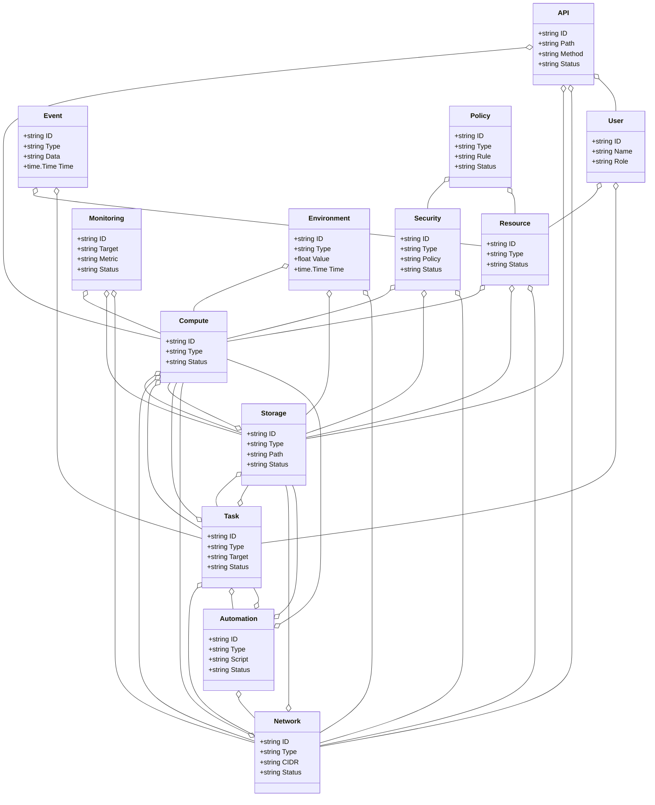
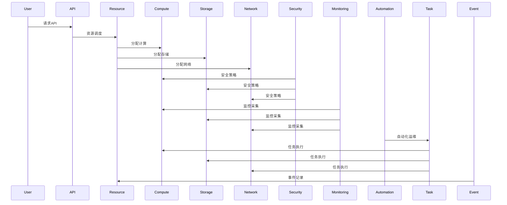
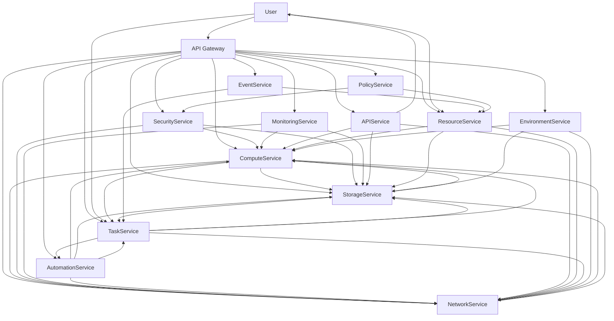

# 云基础设施/智慧云架构（Golang国际主流实践）

## 1. 目录

---

## 2. 云基础设施/智慧云架构概述

### 国际标准定义

云基础设施/智慧云架构是指以弹性计算、自动化运维、资源池化、服务化、智能调度为核心，支持计算、存储、网络、安全、监控、自动化、API等场景的分布式系统架构。

- **国际主流参考**：NIST Cloud Computing Reference Architecture、ISO/IEC 17788、ISO/IEC 17789、CIS Controls、CSA CCM、OpenStack、Kubernetes、Terraform、CloudEvents、OpenAPI、Prometheus、OpenTelemetry、OAuth2、ISO/IEC 27017、ISO/IEC 27018。

### 发展历程与核心思想

- 2000s：虚拟化、IaaS、自动化运维、云管理平台。
- 2010s：PaaS、容器、微服务、DevOps、云原生、API驱动。
- 2020s：Serverless、智能调度、边缘云、全球多云、自动化治理、AI运维。
- 核心思想：弹性、自动化、资源池化、服务化、智能化、标准互操作、安全合规。

### 典型应用场景

- 公有云、私有云、混合云、多云管理、Serverless、边缘云、云原生PaaS、自动化运维、智能监控等。

### 与传统IT对比

| 维度         | 传统IT系统         | 智慧云架构             |
|--------------|-------------------|----------------------|
| 资源管理     | 静态、手工         | 动态、自动化、弹性     |
| 扩展性       | 垂直扩展           | 水平弹性扩展          |
| 运维模式     | 人工、脚本         | 自动化、智能化        |
| 服务交付     | 单点、割裂         | API驱动、服务化       |
| 安全合规     | 被动、补丁         | 主动、内建、标准化    |
| 适用场景     | 单一数据中心       | 多云、全球、边缘      |

---

## 3. 信息概念架构

### 领域建模方法

- 采用分层建模（物理层、虚拟层、服务层、管理层、应用层）、UML、ER图。
- 核心实体：计算、存储、网络、安全、监控、自动化、API、资源、用户、事件、任务、策略、环境。

### 核心实体与关系

| 实体    | 属性                        | 关系           |
|---------|-----------------------------|----------------|
| 计算    | ID, Type, Status            | 关联存储/网络/任务 |
| 存储    | ID, Type, Path, Status      | 关联计算/任务   |
| 网络    | ID, Type, CIDR, Status      | 关联计算/存储   |
| 安全    | ID, Type, Policy, Status    | 关联计算/存储/网络 |
| 监控    | ID, Target, Metric, Status  | 关联计算/存储/网络 |
| 自动化  | ID, Type, Script, Status    | 关联计算/存储/网络/任务 |
| API     | ID, Path, Method, Status    | 关联计算/存储/网络/用户 |
| 资源    | ID, Type, Status            | 关联计算/存储/网络 |
| 用户    | ID, Name, Role              | 管理资源/任务   |
| 事件    | ID, Type, Data, Time        | 关联资源/任务   |
| 任务    | ID, Type, Target, Status    | 关联计算/存储/网络/自动化 |
| 策略    | ID, Type, Rule, Status      | 关联安全/资源   |
| 环境    | ID, Type, Value, Time       | 关联计算/存储/网络 |

#### UML 类图（Mermaid）



### 典型数据流

1. 用户请求→API网关→资源调度→计算/存储/网络分配→安全策略→监控采集→自动化运维→事件记录→智能优化。

#### 数据流时序图（Mermaid）



### Golang 领域模型代码示例

```go
// 计算实体
type Compute struct {
    ID     string
    Type   string
    Status string
}
// 存储实体
type Storage struct {
    ID     string
    Type   string
    Path   string
    Status string
}
// 网络实体
type Network struct {
    ID     string
    Type   string
    CIDR   string
    Status string
}
// 安全实体
type Security struct {
    ID     string
    Type   string
    Policy string
    Status string
}
// 监控实体
type Monitoring struct {
    ID     string
    Target string
    Metric string
    Status string
}
// 自动化实体
type Automation struct {
    ID     string
    Type   string
    Script string
    Status string
}
// API实体
type API struct {
    ID     string
    Path   string
    Method string
    Status string
}
// 资源实体
type Resource struct {
    ID     string
    Type   string
    Status string
}
// 用户实体
type User struct {
    ID   string
    Name string
    Role string
}
// 事件实体
type Event struct {
    ID   string
    Type string
    Data string
    Time time.Time
}
// 任务实体
type Task struct {
    ID     string
    Type   string
    Target string
    Status string
}
// 策略实体
type Policy struct {
    ID     string
    Type   string
    Rule   string
    Status string
}
// 环境实体
type Environment struct {
    ID    string
    Type  string
    Value float64
    Time  time.Time
}

```

---

## 4. 分布式系统挑战

### 弹性与实时性

- 自动扩缩容、毫秒级响应、负载均衡、容灾备份。
- 国际主流：Kubernetes、Prometheus、云服务、CDN、Terraform、OpenStack。

### 数据安全与互操作性

- 数据加密、标准协议、互操作、访问控制、合规治理。
- 国际主流：OAuth2、OpenID、TLS、ISO/IEC 27017、ISO/IEC 27018、CSA CCM、CIS Controls。

### 可观测性与智能优化

- 全链路追踪、指标采集、AI优化、异常检测。
- 国际主流：OpenTelemetry、Prometheus、AI分析。

---

## 5. 架构设计解决方案

### 服务解耦与标准接口

- 计算、存储、网络、安全、监控、自动化、API、资源、任务、策略等服务解耦，API网关统一入口。
- 采用REST、gRPC、消息队列等协议，支持异步事件驱动。

### 智能调度与弹性协同

- AI驱动调度、弹性协同、自动扩缩容、智能优化。
- AI推理、Kubernetes、Prometheus、Terraform、OpenStack。

### 数据安全与互操作设计

- TLS、OAuth2、数据加密、标准协议、访问审计、合规治理。

### 架构图（Mermaid）



### Golang代码示例

```go
// 计算资源Prometheus监控
var computeCount = prometheus.NewGauge(prometheus.GaugeOpts{Name: "compute_total"})
computeCount.Set(1000000)

```

---

## 6. Golang实现范例

### 工程结构示例

```text
cloudinfra-demo/
├── cmd/
├── internal/
│   ├── compute/
│   ├── storage/
│   ├── network/
│   ├── security/
│   ├── monitoring/
│   ├── automation/
│   ├── api/
│   ├── resource/
│   ├── task/
│   ├── policy/
│   ├── event/
│   ├── environment/
│   ├── user/
├── api/
├── pkg/
├── configs/
├── scripts/
├── build/
└── README.md

```

### 关键代码片段

// 见4.5

### CI/CD 配置（GitHub Actions 示例）

```yaml
name: Go CI
on:
  push:
    branches: [ main ]
jobs:
  build:
    runs-on: ubuntu-latest
    steps:
      - uses: actions/checkout@v3
      - name: Set up Go
        uses: actions/setup-go@v4
        with:
          go-version: '1.21'
      - name: Build
        run: go build ./...
      - name: Test
        run: go test ./...

```

---

## 7. 形式化建模与证明

### 资源-任务-策略建模

- 资源集合 $R = \{r_1, ..., r_n\}$，任务集合 $T = \{t_1, ..., t_k\}$，策略集合 $P = \{p_1, ..., p_l\}$。
- 调度函数 $f: (r, t) \rightarrow p$，监控函数 $g: (r, t) \rightarrow m$。

#### 性质1：弹性调度性

- 所有资源 $r$ 与任务 $t$，其策略 $p$ 能弹性调度。

#### 性质2：安全合规性

- 所有监控数据 $m$ 满足安全策略 $q$，即 $\forall m, \exists q, q(m) = true$。

### 符号说明

- $R$：资源集合
- $T$：任务集合
- $P$：策略集合
- $M$：监控数据集合
- $Q$：安全策略集合
- $f$：调度函数
- $g$：监控函数

---

## 8. 参考与外部链接

- [NIST Cloud Computing Reference Architecture](https://www.nist.gov/publications/nist-cloud-computing-reference-architecture)
- [ISO/IEC 17788](https://www.iso.org/standard/60544.html)
- [ISO/IEC 17789](https://www.iso.org/standard/60545.html)
- [CIS Controls](https://www.cisecurity.org/controls/)
- [CSA CCM](https://cloudsecurityalliance.org/research/cloud-controls-matrix/)
- [OpenStack](https://www.openstack.org/)
- [Kubernetes](https://kubernetes.io/)
- [Terraform](https://www.terraform.io/)
- [CloudEvents](https://cloudevents.io/)
- [OpenAPI](https://www.openapis.org/)
- [Prometheus](https://prometheus.io/)
- [OpenTelemetry](https://opentelemetry.io/)
- [OAuth2](https://oauth.net/2/)
- [ISO/IEC 27017](https://www.iso.org/standard/43757.html)
- [ISO/IEC 27018](https://www.iso.org/standard/61498.html)

---

**文档维护者**: Go Documentation Team  
**最后更新**: 2025年10月20日  
**文档状态**: 完成  
**适用版本**: Go 1.25.3+
