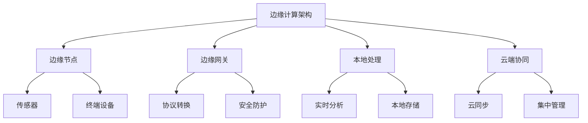
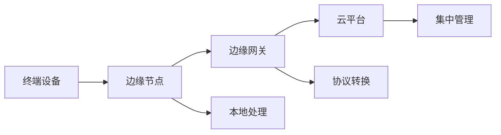
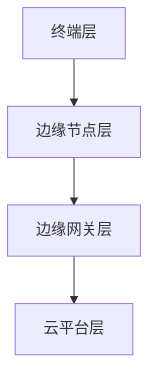

# 边缘计算架构（Golang国际主流实践）

## 1. 目录

---

## 2. 边缘计算架构概述

### 定义与发展历程

边缘计算（Edge Computing）是一种将计算、存储和网络能力下沉到靠近数据源头（如终端设备、传感器、基站等）的位置的分布式计算范式。它旨在降低延迟、节省带宽、提升实时性和数据隐私。

**发展历程：**

- 2010年前后：MEC（移动边缘计算）概念提出
- 2015年：ETSI发布MEC标准
- 2018年：边缘云、雾计算等概念兴起
- 2020年后：5G+AIoT推动边缘计算大规模落地

### 核心特征



## 3. 边缘计算基础

### 边缘节点

- 传感器、摄像头、工业设备、移动终端等
- 具备一定计算、存储、网络能力

### 边缘网关

- 连接边缘节点与云端
- 协议转换、安全防护、数据聚合

### 边缘与云的协同

- 数据分级处理：本地实时、云端深度分析
- 任务动态迁移与负载均衡

### 典型应用场景

- 智能制造、智慧城市、车联网、远程医疗、视频监控等

## 4. 国际标准与主流框架

### 国际标准

- ETSI MEC（欧洲电信标准协会移动边缘计算）
- OpenFog Reference Architecture（雾计算参考架构）
- 3GPP 5G Edge Computing
- IEEE P1934（雾计算参考架构）

### 主流开源框架

- KubeEdge（基于Kubernetes的边缘计算）
- EdgeX Foundry（IoT边缘平台）
- OpenYurt（阿里云原生边缘计算）
- Baetyl（百度开源边缘计算）

### 云厂商方案

- AWS IoT Greengrass
- Azure IoT Edge
- Google Distributed Cloud Edge

## 5. 领域建模

### 核心实体

```go
// 边缘节点
 type EdgeNode struct {
     ID         string
     Location   string
     Resources  ResourceProfile
     Status     NodeStatus
 }

// 边缘网关
 type EdgeGateway struct {
     ID         string
     Protocols  []string
     Security   SecurityProfile
     ConnectedNodes []EdgeNode
 }

// 任务建模
 type EdgeTask struct {
     ID         string
     Type       TaskType
     DataSource string
     TargetNode string
     Priority   int
     Status     TaskStatus
 }

```

### 典型数据流



## 6. 分布式挑战

### 网络异构与不稳定

- 多种接入协议、带宽受限、网络延迟大
- 断网容忍与数据同步

### 资源受限与动态变化

- 节点计算/存储能力有限，资源动态变化
- 任务调度与负载均衡复杂

### 安全与隐私

- 边缘侧攻击面大，数据隐私保护难
- 端到端加密、可信执行环境

### 管理与运维

- 大规模节点自动化管理、监控、升级
- 故障自愈与弹性伸缩

## 7. 设计解决方案

### 分层架构设计



### 任务调度与协同

- 采用分布式调度器（如KubeEdge、OpenYurt）
- 支持任务动态迁移、边云协同

### 安全机制

- 零信任架构、端到端加密、设备认证
- 可信执行环境（TEE）、安全启动

### 资源管理

- 资源感知调度、弹性伸缩、边缘自治

## 8. Golang实现

### 边缘节点与网关建模

```go
// 资源感知
 type ResourceProfile struct {
     CPU    float64
     Memory float64
     Storage float64
     NetworkBandwidth float64
 }

// 节点状态
 type NodeStatus string
 const (
     NodeActive   NodeStatus = "Active"
     NodeInactive NodeStatus = "Inactive"
     NodeError    NodeStatus = "Error"
 )

// 安全配置
 type SecurityProfile struct {
     TLSCert   string
     AuthToken string
     Trusted   bool
 }

```

### 任务调度与执行

```go
// 简单任务调度器
 type TaskScheduler struct {
     Nodes []EdgeNode
 }

 func (ts *TaskScheduler) Schedule(task EdgeTask) (string, error) {
     // 按资源和状态选择合适节点
     for _, node := range ts.Nodes {
         if node.Status == NodeActive && node.Resources.CPU > 1.0 {
             return node.ID, nil
         }
     }
     return "", fmt.Errorf("no available node")
 }

```

### 边云协同通信

```go
// 边缘与云通信接口
 type EdgeCloudInterface struct {
     Gateway EdgeGateway
     CloudAPI string
 }

 func (eci *EdgeCloudInterface) SyncData(data []byte) error {
     // 伪代码：通过安全通道同步数据到云
     return SecureSend(eci.CloudAPI, data)
 }

```

## 9. 形式化建模

### 边缘系统形式化

- 节点集合 N = {n1, n2, ..., nn}
- 任务集合 T = {t1, t2, ..., tm}
- 资源约束 R(n, t)
- 调度函数 S: T → N

### 可靠性与一致性证明

- 分布式一致性协议（如Raft、Paxos）
- 容错性分析：f个节点失效，系统可用性证明

## 10. 最佳实践

### 架构设计

- 分层解耦、接口标准化、模块化
- 充分利用开源边缘平台

### 安全与合规

- 端到端加密、最小权限原则
- 合规标准（如GDPR、ISO/IEC 27001）

### 运维与监控

- 自动化部署、集中监控、日志采集
- 故障自愈与弹性伸缩

## 11. 参考资源

### 标准与规范

- ETSI MEC: <https://www.etsi.org/technologies/multi-access-edge-computing>
- OpenFog RA: <https://www.openfogconsortium.org/ra/>
- 3GPP Edge: <https://www.3gpp.org/>

### 开源项目

- KubeEdge: <https://kubeedge.io/>
- EdgeX Foundry: <https://www.edgexfoundry.org/>
- OpenYurt: <https://openyurt.io/>
- Baetyl: <https://baetyl.io/>

### 书籍与论文

- Edge Computing: A Primer, Research Opportunities, and Future Directions (IEEE)
- Multi-access Edge Computing (MEC); Framework and Reference Architecture (ETSI)

---

- 本文档为边缘计算架构的系统性指南，涵盖理论、设计、实现与最佳实践，适用于Golang开发者与架构师。*

---

**文档维护者**: Go Documentation Team  
**最后更新**: 2025年10月20日  
**文档状态**: 完成  
**适用版本**: Go 1.25.3+
