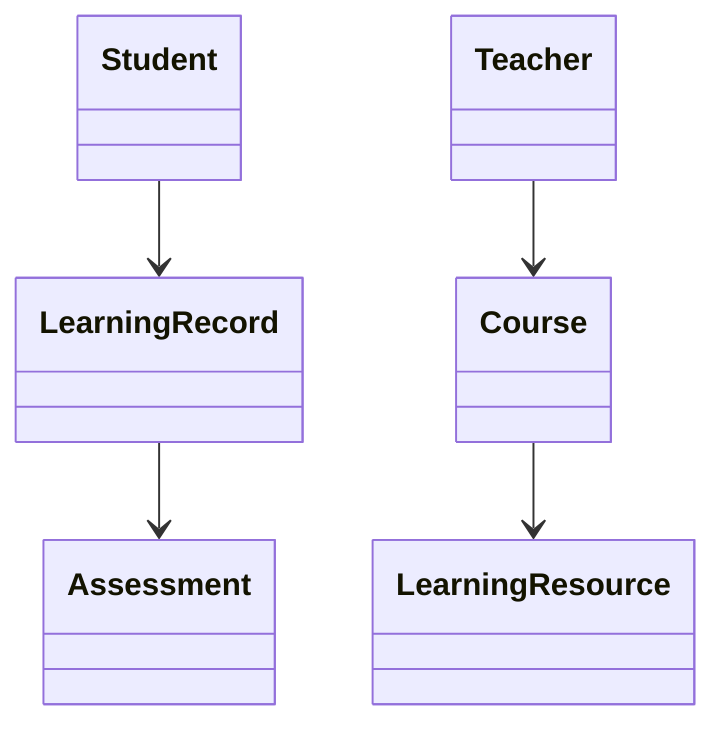
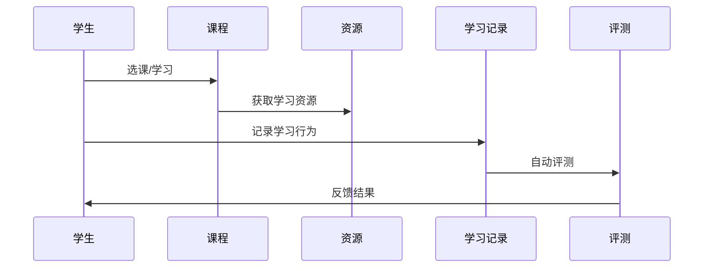
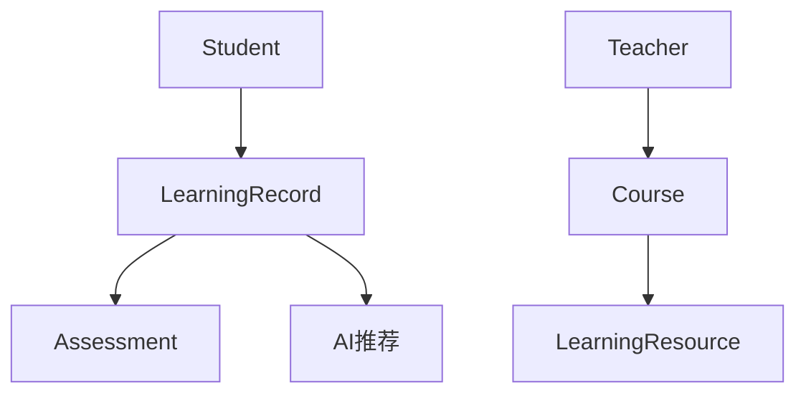

# 教育科技架构（EdTech Architecture）

## 1. 目录

## 1.1 国际标准定义与发展历程

- 定义：教育科技架构指支持在线教育、智能学习、教育资源共享的系统架构，遵循LTI、SCORM、xAPI等国际标准。
- 发展历程：从本地LMS到云端SaaS、AI自适应学习，标准推动全球教育互操作。

## 1.2 核心思想与典型应用场景

- 核心思想：互操作性、个性化、可扩展、智能化。
- 应用场景：在线教育平台、MOOC、智能题库、教育大数据分析、虚拟实验室。

## 1.3 与传统方案对比

| 维度         | 传统教育IT     | 现代教育科技架构     |
|--------------|--------------|---------------------|
| 部署方式     | 本地/单体     | 云端/分布式         |
| 互操作性     | 弱            | 强（LTI/SCORM）     |
| 个性化       | 低            | 高（AI/自适应）     |
| 数据分析     | 基本          | 深度（大数据/AI）   |

## 1.4 领域建模（核心实体、关系、UML类图）

- 核心实体：学生（Student）、教师（Teacher）、课程（Course）、学习资源、学习记录、评测模块。
- UML类图：



## 1.5 典型数据流与时序图

- 在线学习与评测时序：



## 1.6 Golang领域模型代码示例

```go
package edtech

import (
    "context"
    "time"
    "errors"
    "sync"
)

// 学生实体
type Student struct {
    ID          string            `json:"id"`
    Name        string            `json:"name"`
    Email       string            `json:"email"`
    Grade       string            `json:"grade"`
    Courses     []string          `json:"courses"`
    Progress    map[string]float64 `json:"progress"`
    Preferences StudentPreferences `json:"preferences"`
    CreatedAt   time.Time         `json:"created_at"`
    UpdatedAt   time.Time         `json:"updated_at"`
}

type StudentPreferences struct {
    LearningStyle string   `json:"learning_style"`
    Difficulty    string   `json:"difficulty"`
    Topics        []string `json:"topics"`
    Language      string   `json:"language"`
}

// 教师实体
type Teacher struct {
    ID          string        `json:"id"`
    Name        string        `json:"name"`
    Email       string        `json:"email"`
    Subject     string        `json:"subject"`
    Courses     []string      `json:"courses"`
    Credentials TeacherCredentials `json:"credentials"`
    CreatedAt   time.Time     `json:"created_at"`
    UpdatedAt   time.Time     `json:"updated_at"`
}

type TeacherCredentials struct {
    Degree      string `json:"degree"`
    Institution string `json:"institution"`
    Experience  int    `json:"experience"`
    Certifications []string `json:"certifications"`
}

// 课程实体
type Course struct {
    ID          string        `json:"id"`
    Title       string        `json:"title"`
    Description string        `json:"description"`
    TeacherID   string        `json:"teacher_id"`
    Students    []string      `json:"students"`
    Resources   []string      `json:"resources"`
    Assessments []string      `json:"assessments"`
    Schedule    CourseSchedule `json:"schedule"`
    Status      CourseStatus  `json:"status"`
    CreatedAt   time.Time     `json:"created_at"`
    UpdatedAt   time.Time     `json:"updated_at"`
}

type CourseSchedule struct {
    StartDate time.Time `json:"start_date"`
    EndDate   time.Time `json:"end_date"`
    Sessions  []Session `json:"sessions"`
}

type Session struct {
    ID        string    `json:"id"`
    Title     string    `json:"title"`
    StartTime time.Time `json:"start_time"`
    EndTime   time.Time `json:"end_time"`
    Type      string    `json:"type"`
    Resources []string  `json:"resources"`
}

type CourseStatus string

const (
    CourseStatusDraft     CourseStatus = "draft"
    CourseStatusActive    CourseStatus = "active"
    CourseStatusCompleted CourseStatus = "completed"
    CourseStatusArchived  CourseStatus = "archived"
)

// 学习资源实体
type LearningResource struct {
    ID          string            `json:"id"`
    Title       string            `json:"title"`
    Type        ResourceType      `json:"type"`
    Content     string            `json:"content"`
    URL         string            `json:"url"`
    Duration    time.Duration     `json:"duration"`
    Difficulty  string            `json:"difficulty"`
    Tags        []string          `json:"tags"`
    Metadata    map[string]string `json:"metadata"`
    CreatedAt   time.Time         `json:"created_at"`
    UpdatedAt   time.Time         `json:"updated_at"`
}

type ResourceType string

const (
    ResourceTypeVideo     ResourceType = "video"
    ResourceTypeDocument  ResourceType = "document"
    ResourceTypeQuiz      ResourceType = "quiz"
    ResourceTypeExercise  ResourceType = "exercise"
    ResourceTypeSimulation ResourceType = "simulation"
)

// 学习记录实体
type LearningRecord struct {
    ID          string        `json:"id"`
    StudentID   string        `json:"student_id"`
    ResourceID  string        `json:"resource_id"`
    CourseID    string        `json:"course_id"`
    Action      LearningAction `json:"action"`
    Duration    time.Duration `json:"duration"`
    Score       float64       `json:"score"`
    Feedback    string        `json:"feedback"`
    Timestamp   time.Time     `json:"timestamp"`
}

type LearningAction string

const (
    LearningActionView     LearningAction = "view"
    LearningActionComplete LearningAction = "complete"
    LearningActionQuiz     LearningAction = "quiz"
    LearningActionExercise LearningAction = "exercise"
)

// 评测实体
type Assessment struct {
    ID          string           `json:"id"`
    Title       string           `json:"title"`
    Type        AssessmentType   `json:"type"`
    Questions   []Question       `json:"questions"`
    Grading     GradingCriteria  `json:"grading"`
    TimeLimit   time.Duration    `json:"time_limit"`
    Attempts    int              `json:"attempts"`
    CreatedAt   time.Time        `json:"created_at"`
    UpdatedAt   time.Time        `json:"updated_at"`
}

type AssessmentType string

const (
    AssessmentTypeQuiz      AssessmentType = "quiz"
    AssessmentTypeExam      AssessmentType = "exam"
    AssessmentTypeAssignment AssessmentType = "assignment"
    AssessmentTypeProject   AssessmentType = "project"
)

type Question struct {
    ID          string     `json:"id"`
    Type        QuestionType `json:"type"`
    Text        string     `json:"text"`
    Options     []string   `json:"options"`
    CorrectAnswer string   `json:"correct_answer"`
    Explanation string     `json:"explanation"`
    Points      int        `json:"points"`
}

type QuestionType string

const (
    QuestionTypeMultipleChoice QuestionType = "multiple_choice"
    QuestionTypeTrueFalse     QuestionType = "true_false"
    QuestionTypeShortAnswer   QuestionType = "short_answer"
    QuestionTypeEssay         QuestionType = "essay"
)

type GradingCriteria struct {
    PassingScore float64 `json:"passing_score"`
    MaxScore     float64 `json:"max_score"`
    Weight       float64 `json:"weight"`
}

// 领域服务接口
type StudentService interface {
    CreateStudent(ctx context.Context, student *Student) error
    GetStudent(ctx context.Context, id string) (*Student, error)
    UpdateStudent(ctx context.Context, student *Student) error
    DeleteStudent(ctx context.Context, id string) error
    EnrollInCourse(ctx context.Context, studentID, courseID string) error
    GetStudentProgress(ctx context.Context, studentID string) (map[string]float64, error)
}

type CourseService interface {
    CreateCourse(ctx context.Context, course *Course) error
    GetCourse(ctx context.Context, id string) (*Course, error)
    UpdateCourse(ctx context.Context, course *Course) error
    DeleteCourse(ctx context.Context, id string) error
    AddResource(ctx context.Context, courseID, resourceID string) error
    GetCourseStudents(ctx context.Context, courseID string) ([]*Student, error)
}

type AssessmentService interface {
    CreateAssessment(ctx context.Context, assessment *Assessment) error
    GetAssessment(ctx context.Context, id string) (*Assessment, error)
    SubmitAssessment(ctx context.Context, studentID, assessmentID string, answers map[string]string) (*AssessmentResult, error)
    GetAssessmentResults(ctx context.Context, assessmentID string) ([]*AssessmentResult, error)
}

type AssessmentResult struct {
    ID           string    `json:"id"`
    StudentID    string    `json:"student_id"`
    AssessmentID string    `json:"assessment_id"`
    Score        float64   `json:"score"`
    MaxScore     float64   `json:"max_score"`
    Percentage   float64   `json:"percentage"`
    Passed       bool      `json:"passed"`
    SubmittedAt  time.Time `json:"submitted_at"`
    Answers      map[string]string `json:"answers"`
}

// 学习分析服务
type LearningAnalyticsService interface {
    GetStudentLearningPath(ctx context.Context, studentID string) (*LearningPath, error)
    GetCourseAnalytics(ctx context.Context, courseID string) (*CourseAnalytics, error)
    GetResourceEffectiveness(ctx context.Context, resourceID string) (*ResourceEffectiveness, error)
    GenerateRecommendations(ctx context.Context, studentID string) ([]*Recommendation, error)
}

type LearningPath struct {
    StudentID string           `json:"student_id"`
    Steps     []LearningStep   `json:"steps"`
    Progress  float64          `json:"progress"`
    EstimatedCompletion time.Time `json:"estimated_completion"`
}

type LearningStep struct {
    ID          string    `json:"id"`
    Title       string    `json:"title"`
    Type        string    `json:"type"`
    ResourceID  string    `json:"resource_id"`
    Completed   bool      `json:"completed"`
    CompletedAt time.Time `json:"completed_at"`
}

type CourseAnalytics struct {
    CourseID        string  `json:"course_id"`
    TotalStudents   int     `json:"total_students"`
    CompletionRate  float64 `json:"completion_rate"`
    AverageScore    float64 `json:"average_score"`
    EngagementScore float64 `json:"engagement_score"`
}

type ResourceEffectiveness struct {
    ResourceID      string  `json:"resource_id"`
    ViewCount       int     `json:"view_count"`
    CompletionRate  float64 `json:"completion_rate"`
    AverageScore    float64 `json:"average_score"`
    StudentFeedback float64 `json:"student_feedback"`
}

type Recommendation struct {
    ID          string  `json:"id"`
    Type        string  `json:"type"`
    Title       string  `json:"title"`
    Description string  `json:"description"`
    ResourceID  string  `json:"resource_id"`
    Confidence  float64 `json:"confidence"`
    Reason      string  `json:"reason"`
}
```

## 1.7 分布式系统挑战

### 1.7.1 性能与可扩展性挑战

**挑战描述**：

- 支持大规模并发学习（10万+学生同时在线）
- 实时评测系统（毫秒级响应）
- 智能推荐算法（个性化学习路径）
- 多媒体内容分发（视频、音频、文档）

**解决方案**：

```go
// 高性能学习服务实现
type LearningService struct {
    cache        *redis.Client
    db           *gorm.DB
    messageQueue *kafka.Producer
    cdn          CDNService
    analytics    AnalyticsService
}

// 并发学习会话管理
type LearningSessionManager struct {
    sessions map[string]*LearningSession
    mu       sync.RWMutex
    pool     *sync.Pool
}

type LearningSession struct {
    ID        string
    StudentID string
    CourseID  string
    StartTime time.Time
    LastActivity time.Time
    Progress  float64
    Resources []string
    mu        sync.RWMutex
}

func (lsm *LearningSessionManager) CreateSession(studentID, courseID string) (*LearningSession, error) {
    session := &LearningSession{
        ID:          generateID(),
        StudentID:   studentID,
        CourseID:    courseID,
        StartTime:   time.Now(),
        LastActivity: time.Now(),
        Progress:    0.0,
        Resources:   make([]string, 0),
    }
    
    lsm.mu.Lock()
    lsm.sessions[session.ID] = session
    lsm.mu.Unlock()
    
    return session, nil
}

// 实时评测系统
type RealTimeAssessmentService struct {
    evaluator   *AssessmentEvaluator
    cache       *redis.Client
    websocket   *websocket.Upgrader
    sessions    map[string]*AssessmentSession
    mu          sync.RWMutex
}

type AssessmentSession struct {
    ID           string
    StudentID    string
    AssessmentID string
    StartTime    time.Time
    EndTime      time.Time
    Answers      map[string]string
    Score        float64
    Status       AssessmentStatus
    mu           sync.RWMutex
}

func (rtas *RealTimeAssessmentService) SubmitAnswer(sessionID, questionID, answer string) error {
    rtas.mu.RLock()
    session, exists := rtas.sessions[sessionID]
    rtas.mu.RUnlock()
    
    if !exists {
        return errors.New("session not found")
    }
    
    session.mu.Lock()
    session.Answers[questionID] = answer
    session.mu.Unlock()
    
    // 实时评分
    score, err := rtas.evaluator.EvaluateAnswer(questionID, answer)
    if err != nil {
        return err
    }
    
    // 更新缓存
    rtas.cache.HSet(context.Background(), 
        fmt.Sprintf("assessment:%s", sessionID), 
        questionID, score)
    
    return nil
}
```

### 1.7.2 安全与认证授权挑战

**挑战描述**：

- 学生隐私保护（GDPR合规）
- 内容版权保护（DRM）
- 考试防作弊系统
- 数据安全传输

**解决方案**：

```go
// 安全认证服务
type SecurityService struct {
    jwtManager   *JWTManager
    encryption   *EncryptionService
    auditLogger  *AuditLogger
    rateLimiter  *RateLimiter
}

// 学生隐私保护
type PrivacyService struct {
    encryption *EncryptionService
    anonymizer *DataAnonymizer
    consent    *ConsentManager
}

func (ps *PrivacyService) AnonymizeStudentData(studentID string) error {
    // 获取学生数据
    student, err := ps.getStudent(studentID)
    if err != nil {
        return err
    }
    
    // 匿名化处理
    anonymized := &AnonymizedStudent{
        ID:          generateAnonymizedID(),
        OriginalID:  studentID,
        Grade:       student.Grade,
        Progress:    student.Progress,
        AnonymizedAt: time.Now(),
    }
    
    // 加密存储
    encrypted, err := ps.encryption.Encrypt(anonymized)
    if err != nil {
        return err
    }
    
    return ps.storeAnonymizedData(encrypted)
}

// 考试防作弊系统
type AntiCheatingService struct {
    proctoring   *ProctoringService
    behavior     *BehaviorAnalysisService
    screenRecord *ScreenRecordingService
}

type ProctoringSession struct {
    ID           string
    StudentID    string
    AssessmentID string
    StartTime    time.Time
    EndTime      time.Time
    Violations   []CheatingViolation
    Status       ProctoringStatus
}

type CheatingViolation struct {
    Type        ViolationType
    Timestamp   time.Time
    Description string
    Evidence    string
    Severity    ViolationSeverity
}

type ViolationType string

const (
    ViolationTypeMultipleFaces ViolationType = "multiple_faces"
    ViolationTypeNoFace        ViolationType = "no_face"
    ViolationTypePhoneUsage    ViolationType = "phone_usage"
    ViolationTypeTabSwitch     ViolationType = "tab_switch"
    ViolationTypeVoiceDetected ViolationType = "voice_detected"
)
```

### 1.7.3 监控与可观测性挑战

**挑战描述**：

- 学习行为分析（实时数据流）
- 系统性能监控（微服务架构）
- 异常检测与告警
- 学习效果评估

**解决方案**：

```go
// 学习行为分析服务
type LearningAnalyticsService struct {
    eventStream  *EventStream
    processor    *EventProcessor
    aggregator   *DataAggregator
    mlService    *MLService
}

// 学习事件
type LearningEvent struct {
    ID          string                 `json:"id"`
    StudentID   string                 `json:"student_id"`
    CourseID    string                 `json:"course_id"`
    ResourceID  string                 `json:"resource_id"`
    Action      LearningAction         `json:"action"`
    Timestamp   time.Time              `json:"timestamp"`
    Duration    time.Duration          `json:"duration"`
    Metadata    map[string]interface{} `json:"metadata"`
    Context     LearningContext        `json:"context"`
}

type LearningContext struct {
    Device      string `json:"device"`
    Browser     string `json:"browser"`
    IP          string `json:"ip"`
    Location    string `json:"location"`
    TimeOfDay   string `json:"time_of_day"`
    DayOfWeek   string `json:"day_of_week"`
}

// 实时学习行为分析
func (las *LearningAnalyticsService) AnalyzeLearningBehavior(ctx context.Context, event *LearningEvent) error {
    // 实时处理学习事件
    processed, err := las.processor.ProcessEvent(event)
    if err != nil {
        return err
    }
    
    // 更新学习指标
    metrics := &LearningMetrics{
        StudentID:        event.StudentID,
        EngagementScore:  las.calculateEngagementScore(processed),
        LearningVelocity: las.calculateLearningVelocity(processed),
        RetentionRate:    las.calculateRetentionRate(processed),
        Timestamp:        time.Now(),
    }
    
    // 存储指标
    if err := las.storeMetrics(metrics); err != nil {
        return err
    }
    
    // 触发实时推荐
    if metrics.EngagementScore < 0.5 {
        go las.triggerIntervention(event.StudentID, metrics)
    }
    
    return nil
}

// 系统性能监控
type SystemMonitor struct {
    metrics     *prometheus.Registry
    alertManager *AlertManager
    healthCheck *HealthChecker
}

type SystemMetrics struct {
    CPUUsage    float64 `json:"cpu_usage"`
    MemoryUsage float64 `json:"memory_usage"`
    DiskUsage   float64 `json:"disk_usage"`
    NetworkIO   float64 `json:"network_io"`
    ActiveUsers int     `json:"active_users"`
    ResponseTime float64 `json:"response_time"`
    ErrorRate   float64 `json:"error_rate"`
    Timestamp   time.Time `json:"timestamp"`
}

func (sm *SystemMonitor) CollectMetrics() (*SystemMetrics, error) {
    metrics := &SystemMetrics{
        Timestamp: time.Now(),
    }
    
    // 收集系统指标
    if cpu, err := sm.getCPUUsage(); err == nil {
        metrics.CPUUsage = cpu
    }
    
    if memory, err := sm.getMemoryUsage(); err == nil {
        metrics.MemoryUsage = memory
    }
    
    if users, err := sm.getActiveUsers(); err == nil {
        metrics.ActiveUsers = users
    }
    
    // 检查告警条件
    if metrics.CPUUsage > 80.0 {
        sm.alertManager.SendAlert("high_cpu_usage", metrics)
    }
    
    if metrics.ErrorRate > 5.0 {
        sm.alertManager.SendAlert("high_error_rate", metrics)
    }
    
    return metrics, nil
}
```

## 1.8 主流解决方案

- 架构图（LMS为核心，集成资源、评测、AI推荐）：



- 关键代码：Golang实现LTI/xAPI接口、学习行为采集、评测自动化。
- CI/CD：自动化测试、持续集成。
- 监控：学习行为分析、异常检测。

## 1.9 形式化建模与证明

- 数学建模：
  - 学习记录L = {l1, l2, ..., ln}，每条记录li关联学生、课程、评测
  - 互操作性映射：f: L → xAPI
- 性质：数据一致性、个性化推荐、互操作性
- 符号说明：L-学习记录，f-互操作映射

## 1.10 国际权威参考链接

- [IMS Global LTI](https://www.imsglobal.org/activity/learning-tools-interoperability)
- [SCORM](https://scorm.com/)
- [xAPI](https://xapi.com/)
- [EdTech Europe](https://edtecheurope.com/)
