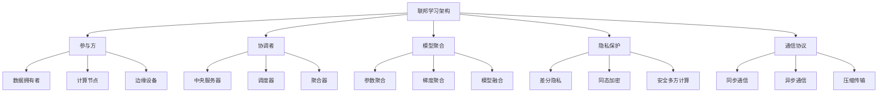
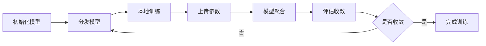
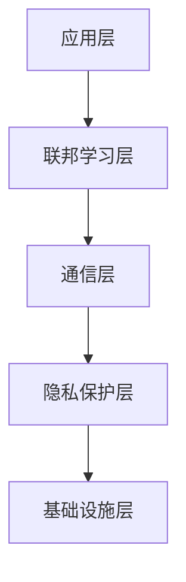

# 联邦学习架构 - Golang实现指南

## 1. 目录

- [联邦学习架构 - Golang实现指南](#联邦学习架构---golang实现指南)
  - [1. 目录](#1-目录)
  - [2. 概述](#2-概述)
    - [2.1 定义与发展历程](#21-定义与发展历程)
    - [2.2 核心特征](#22-核心特征)
  - [3. 联邦学习基础](#3-联邦学习基础)
    - [3.1 核心概念](#31-核心概念)
    - [3.2 联邦学习类型](#32-联邦学习类型)
    - [3.3 典型应用场景](#33-典型应用场景)
  - [4. 国际标准与主流框架](#4-国际标准与主流框架)
    - [4.1 国际标准](#41-国际标准)
    - [4.2 主流开源框架](#42-主流开源框架)
    - [4.3 云服务商方案](#43-云服务商方案)
  - [5. 领域建模](#5-领域建模)
    - [5.1 核心实体](#51-核心实体)
    - [5.2 训练流程](#52-训练流程)
  - [6. 分布式挑战](#6-分布式挑战)
    - [6.1 通信开销](#61-通信开销)
    - [6.2 异构性挑战](#62-异构性挑战)
    - [6.3 隐私安全](#63-隐私安全)
    - [6.4 系统容错](#64-系统容错)
    - [6.5 收敛性保证](#65-收敛性保证)
  - [7. 设计解决方案](#7-设计解决方案)
    - [7.1 分层架构设计](#71-分层架构设计)
    - [7.2 通信优化策略](#72-通信优化策略)
    - [7.3 隐私保护机制](#73-隐私保护机制)
    - [7.4 容错机制](#74-容错机制)
  - [8. Golang实现](#8-golang实现)
    - [8.1 联邦学习协调器](#81-联邦学习协调器)
    - [8.2 模型聚合器](#82-模型聚合器)
    - [8.3 隐私保护机制](#83-隐私保护机制)
    - [8.4 参与方管理](#84-参与方管理)
  - [9. 形式化建模](#9-形式化建模)
    - [9.1 联邦学习形式化](#91-联邦学习形式化)
    - [9.2 收敛性分析](#92-收敛性分析)
    - [9.3 隐私保护分析](#93-隐私保护分析)
  - [10. 最佳实践](#10-最佳实践)
    - [10.1 架构设计原则](#101-架构设计原则)
    - [10.2 性能优化](#102-性能优化)
    - [10.3 隐私保护](#103-隐私保护)
    - [10.4 系统可靠性](#104-系统可靠性)
  - [11. 参考资源](#11-参考资源)
    - [11.1 标准与规范](#111-标准与规范)
    - [11.2 开源项目](#112-开源项目)
    - [11.3 研究机构](#113-研究机构)
    - [11.4 书籍与论文](#114-书籍与论文)

## 2. 概述

### 定义与发展历程

联邦学习（Federated Learning）是一种分布式机器学习范式，允许多个参与方在不共享原始数据的情况下协作训练机器学习模型，通过模型参数的聚合来实现知识共享，同时保护数据隐私。

**发展历程：**

- 2016年：Google首次提出联邦学习概念
- 2017年：联邦平均算法（FedAvg）提出
- 2019年：联邦学习标准化工作开始
- 2020年：隐私保护联邦学习技术成熟
- 2022年后：跨域联邦学习、联邦学习即服务

### 核心特征



## 3. 联邦学习基础

### 核心概念

**参与方（Participants）：**

- 数据拥有者，拥有本地数据
- 参与模型训练的计算节点
- 可以是组织、设备或用户

**协调者（Coordinator）：**

- 中央服务器，负责协调训练过程
- 模型聚合和分发
- 训练进度监控

**模型聚合（Model Aggregation）：**

- 联邦平均（FedAvg）
- 加权平均
- 动态聚合策略

### 联邦学习类型

**按数据分布分类：**

- 水平联邦学习：相同特征，不同样本
- 垂直联邦学习：相同样本，不同特征
- 联邦迁移学习：跨域知识迁移

**按参与方式分类：**

- 同步联邦学习：所有参与方同步更新
- 异步联邦学习：参与方异步更新
- 半同步联邦学习：部分同步更新

**按隐私保护分类：**

- 基础联邦学习：无额外隐私保护
- 差分隐私联邦学习：添加噪声保护
- 加密联邦学习：同态加密保护

### 典型应用场景

**金融行业：**

- 反欺诈模型训练
- 信用评分模型
- 风险控制模型

**医疗健康：**

- 疾病诊断模型
- 药物发现
- 医学影像分析

**物联网：**

- 设备故障预测
- 用户行为分析
- 智能家居优化

**移动设备：**

- 键盘输入预测
- 语音识别
- 推荐系统

## 4. 国际标准与主流框架

### 国际标准

**IEEE标准：**

- IEEE P3652.1：联邦学习标准
- IEEE P2842：隐私保护机器学习

**ISO标准：**

- ISO/IEC 23053：联邦学习框架
- ISO/IEC 27001：信息安全管理

**行业标准：**

- FATE：微众银行联邦学习标准
- OpenMined：开源隐私保护标准
- TensorFlow Federated：Google联邦学习标准

### 主流开源框架

**通用框架：**

- TensorFlow Federated (TFF)：Google开源框架
- PySyft：OpenMined隐私保护框架
- FATE：微众银行联邦学习平台
- FedML：联邦学习生态系统

**隐私保护框架：**

- CrypTen：Facebook加密计算框架
- TenSEAL：同态加密库
- MP-SPDZ：安全多方计算框架

**工业级平台：**

- PaddleFL：百度联邦学习平台
- WeBank Federated Learning：微众银行平台
- Intel OpenFL：英特尔联邦学习框架

### 云服务商方案

**商业平台：**

- AWS SageMaker：联邦学习服务
- Google Cloud AI：联邦学习API
- Microsoft Azure：联邦学习解决方案
- Alibaba Cloud：联邦学习平台

**开源生态：**

- Kubeflow：Kubernetes机器学习平台
- MLflow：机器学习生命周期管理
- Ray：分布式计算框架

## 5. 领域建模

### 核心实体

```go
// 参与方
type Participant struct {
    ID           string
    Name         string
    DataSize     int64
    ComputeCap   ComputeCapability
    NetworkCap   NetworkCapability
    PrivacyLevel PrivacyLevel
    Status       ParticipantStatus
}

// 协调者
type Coordinator struct {
    ID           string
    Aggregator   ModelAggregator
    Scheduler    TrainingScheduler
    Monitor      TrainingMonitor
    Config       FederatedConfig
}

// 联邦学习任务
type FederatedTask struct {
    ID           string
    ModelType    ModelType
    HyperParams  HyperParameters
    Participants []string
    Rounds       int
    Status       TaskStatus
}

// 模型聚合器
type ModelAggregator struct {
    Strategy     AggregationStrategy
    Weights      map[string]float64
    Threshold    float64
    Timeout      time.Duration
}

```

### 训练流程



## 6. 分布式挑战

### 通信开销

- 大量模型参数传输
- 网络带宽限制
- 通信延迟影响

### 异构性挑战

- 参与方能力差异
- 数据分布不均
- 计算资源差异

### 隐私安全

- 模型反演攻击
- 成员推理攻击
- 数据泄露风险

### 系统容错

- 参与方掉线
- 恶意参与方
- 网络故障

### 收敛性保证

- 异步更新影响
- 局部最优问题
- 收敛速度优化

## 7. 设计解决方案

### 分层架构设计



### 通信优化策略

- 模型压缩技术
- 梯度量化
- 选择性通信

### 隐私保护机制

- 差分隐私
- 同态加密
- 安全多方计算

### 容错机制

- 参与方管理
- 故障检测
- 自动恢复

## 8. Golang实现

### 联邦学习协调器

```go
// 联邦学习协调器
type FederatedCoordinator struct {
    participants map[string]*Participant
    tasks        map[string]*FederatedTask
    aggregator   ModelAggregator
    scheduler    TrainingScheduler
    mu           sync.RWMutex
}

// 训练调度器
type TrainingScheduler struct {
    strategy     SchedulingStrategy
    timeout      time.Duration
    maxRetries   int
}

// 启动联邦学习任务
func (fc *FederatedCoordinator) StartTask(task *FederatedTask) error {
    fc.mu.Lock()
    defer fc.mu.Unlock()
    
    // 初始化全局模型
    globalModel := fc.initializeGlobalModel(task.ModelType)
    
    // 开始训练轮次
    for round := 0; round < task.Rounds; round++ {
        if err := fc.executeTrainingRound(task, globalModel, round); err != nil {
            return err
        }
        
        // 检查收敛性
        if fc.checkConvergence(globalModel, round) {
            break
        }
    }
    
    return nil
}

func (fc *FederatedCoordinator) executeTrainingRound(task *FederatedTask, globalModel *Model, round int) error {
    // 1. 分发全局模型
    if err := fc.distributeModel(globalModel, task.Participants); err != nil {
        return err
    }
    
    // 2. 等待本地训练完成
    localUpdates := make(chan *ModelUpdate, len(task.Participants))
    for _, participantID := range task.Participants {
        go fc.waitForLocalTraining(participantID, localUpdates)
    }
    
    // 3. 收集本地更新
    updates := fc.collectUpdates(localUpdates, len(task.Participants))
    
    // 4. 聚合模型
    if err := fc.aggregateModels(globalModel, updates); err != nil {
        return err
    }
    
    return nil
}

```

### 模型聚合器

```go
// 模型聚合器
type ModelAggregator struct {
    strategy AggregationStrategy
    weights  map[string]float64
}

// 聚合策略接口
type AggregationStrategy interface {
    Aggregate(models []*Model, weights []float64) (*Model, error)
}

// 联邦平均策略
type FedAvgStrategy struct{}

func (fas *FedAvgStrategy) Aggregate(models []*Model, weights []float64) (*Model, error) {
    if len(models) == 0 {
        return nil, fmt.Errorf("no models to aggregate")
    }
    
    // 创建聚合模型
    aggregatedModel := models[0].Clone()
    
    // 计算加权平均
    for i, model := range models {
        if i == 0 {
            continue
        }
        
        weight := weights[i]
        aggregatedModel.WeightedAdd(model, weight)
    }
    
    // 归一化权重
    totalWeight := 0.0
    for _, w := range weights {
        totalWeight += w
    }
    
    if totalWeight > 0 {
        aggregatedModel.Scale(1.0 / totalWeight)
    }
    
    return aggregatedModel, nil
}

// 加权聚合策略
type WeightedAggregationStrategy struct {
    baseStrategy AggregationStrategy
    weightCalculator WeightCalculator
}

func (was *WeightedAggregationStrategy) Aggregate(models []*Model, weights []float64) (*Model, error) {
    // 计算动态权重
    dynamicWeights := was.weightCalculator.CalculateWeights(models)
    
    // 使用基础策略聚合
    return was.baseStrategy.Aggregate(models, dynamicWeights)
}

```

### 隐私保护机制

```go
// 差分隐私管理器
type DifferentialPrivacyManager struct {
    epsilon float64
    delta   float64
    sensitivity float64
}

// 添加差分隐私噪声
func (dpm *DifferentialPrivacyManager) AddNoise(gradients []float64) []float64 {
    noisyGradients := make([]float64, len(gradients))
    
    for i, gradient := range gradients {
        // 计算噪声大小
        noiseScale := dpm.calculateNoiseScale()
        
        // 生成拉普拉斯噪声
        noise := dpm.generateLaplaceNoise(noiseScale)
        
        noisyGradients[i] = gradient + noise
    }
    
    return noisyGradients
}

// 同态加密管理器
type HomomorphicEncryptionManager struct {
    publicKey  []byte
    privateKey []byte
    scheme     EncryptionScheme
}

// 加密模型参数
func (hem *HomomorphicEncryptionManager) EncryptModel(model *Model) (*EncryptedModel, error) {
    encryptedParams := make([][]byte, len(model.Parameters))
    
    for i, param := range model.Parameters {
        encrypted, err := hem.scheme.Encrypt(param, hem.publicKey)
        if err != nil {
            return nil, err
        }
        encryptedParams[i] = encrypted
    }
    
    return &EncryptedModel{
        Parameters: encryptedParams,
        Structure:  model.Structure,
    }, nil
}

// 安全聚合
func (hem *HomomorphicEncryptionManager) SecureAggregate(encryptedModels []*EncryptedModel) (*EncryptedModel, error) {
    if len(encryptedModels) == 0 {
        return nil, fmt.Errorf("no models to aggregate")
    }
    
    // 创建聚合加密模型
    aggregatedModel := encryptedModels[0].Clone()
    
    // 同态加法
    for i := 1; i < len(encryptedModels); i++ {
        if err := aggregatedModel.HomomorphicAdd(encryptedModels[i]); err != nil {
            return nil, err
        }
    }
    
    return aggregatedModel, nil
}

```

### 参与方管理

```go
// 参与方管理器
type ParticipantManager struct {
    participants map[string]*Participant
    healthChecker HealthChecker
    mu            sync.RWMutex
}

// 健康检查器
type HealthChecker struct {
    interval time.Duration
    timeout  time.Duration
}

// 监控参与方状态
func (pm *ParticipantManager) MonitorParticipants() {
    ticker := time.NewTicker(pm.healthChecker.interval)
    go func() {
        for range ticker.C {
            pm.checkParticipantHealth()
        }
    }()
}

func (pm *ParticipantManager) checkParticipantHealth() {
    pm.mu.RLock()
    defer pm.mu.RUnlock()
    
    for participantID, participant := range pm.participants {
        // 检查网络连接
        if !pm.isParticipantOnline(participantID) {
            participant.Status = ParticipantOffline
            continue
        }
        
        // 检查计算能力
        if !pm.checkComputeCapability(participant) {
            participant.Status = ParticipantOverloaded
            continue
        }
        
        participant.Status = ParticipantReady
    }
}

// 选择参与方
func (pm *ParticipantManager) SelectParticipants(task *FederatedTask) []string {
    pm.mu.RLock()
    defer pm.mu.RUnlock()
    
    var selected []string
    
    for participantID, participant := range pm.participants {
        if participant.Status == ParticipantReady &&
           pm.meetsRequirements(participant, task) {
            selected = append(selected, participantID)
        }
    }
    
    // 按优先级排序
    sort.Slice(selected, func(i, j int) bool {
        return pm.getParticipantPriority(selected[i]) > pm.getParticipantPriority(selected[j])
    })
    
    // 限制参与方数量
    if len(selected) > task.MaxParticipants {
        selected = selected[:task.MaxParticipants]
    }
    
    return selected
}

```

## 9. 形式化建模

### 联邦学习形式化

- 参与方集合 P = {p1, p2, ..., pn}
- 数据分布 D = {D1, D2, ..., Dn}
- 目标函数 F(w) = Σ|Di|/|D| × Fi(w)
- 聚合函数 A: {w1, w2, ..., wn} → w

### 收敛性分析

- 假设：函数Lipschitz连续
- 收敛条件：η ≤ 1/L
- 收敛速度：O(1/√T)

### 隐私保护分析

- 差分隐私：Pr[M(D) ∈ S] ≤ e^ε × Pr[M(D') ∈ S] + δ
- 隐私预算：Σεi ≤ ε_total
- 噪声大小：σ = √(2log(1.25/δ))/ε

## 10. 最佳实践

### 架构设计原则

- 模块化设计，松耦合架构
- 隐私优先，安全第一
- 可扩展性，支持水平扩展

### 性能优化

- 通信压缩优化
- 异步训练策略
- 智能参与方选择

### 隐私保护

- 差分隐私参数调优
- 同态加密性能优化
- 安全多方计算协议

### 系统可靠性

- 容错机制设计
- 监控告警系统
- 自动恢复策略

## 11. 参考资源

### 标准与规范

- IEEE P3652.1: <https://standards.ieee.org/project/3652_1.html>
- ISO/IEC 23053: <https://www.iso.org/standard/75006.html>
- FATE: <https://fate.fedai.org/>

### 开源项目

- TensorFlow Federated: <https://www.tensorflow.org/federated>
- PySyft: <https://github.com/OpenMined/PySyft>
- FedML: <https://fedml.ai/>

### 研究机构

- OpenMined: <https://www.openmined.org/>
- WeBank: <https://www.webank.com/>
- Google Research: <https://research.google/>

### 书籍与论文

- Federated Learning: Challenges, Methods, and Future Directions (ACM)
- Advances and Open Problems in Federated Learning (Foundations and Trends)

---

- 本文档为联邦学习架构的系统性指南，涵盖理论、设计、实现与最佳实践，适用于Golang开发者与架构师。*

---

**文档维护者**: Go Documentation Team  
**最后更新**: 2025年10月20日  
**文档状态**: 完成  
**适用版本**: Go 1.25.3+
