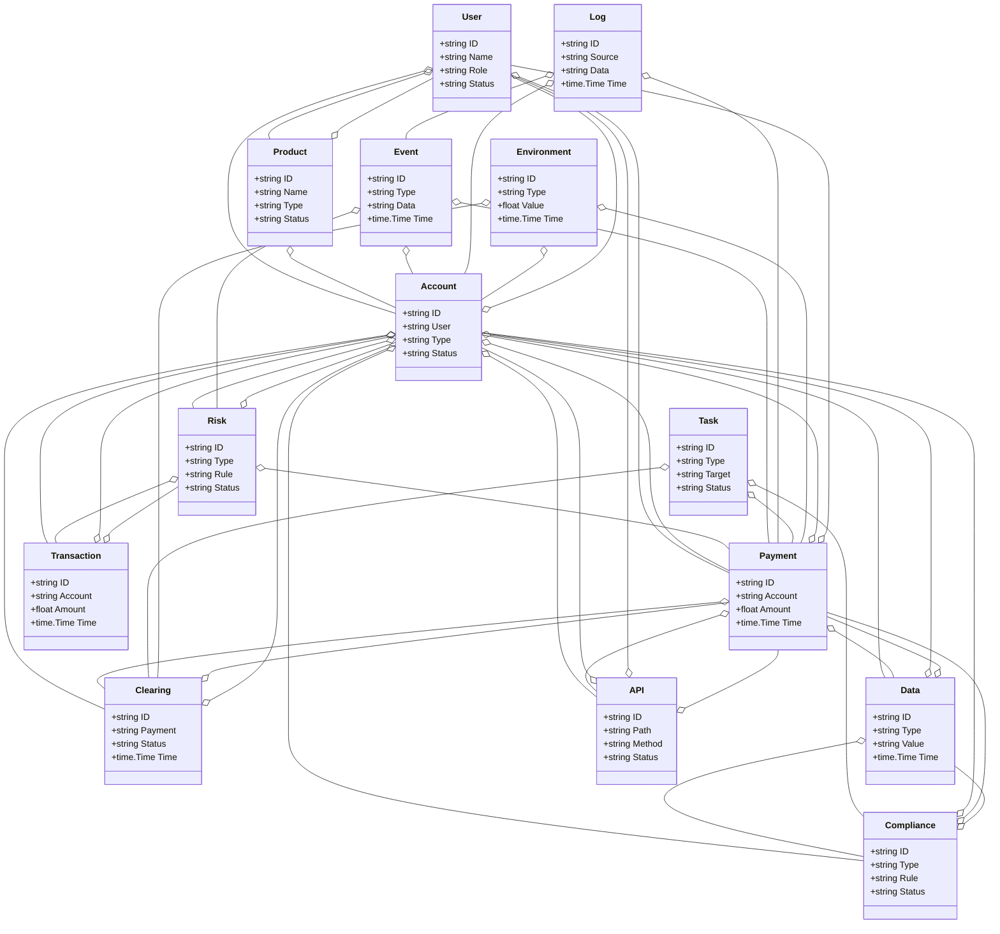
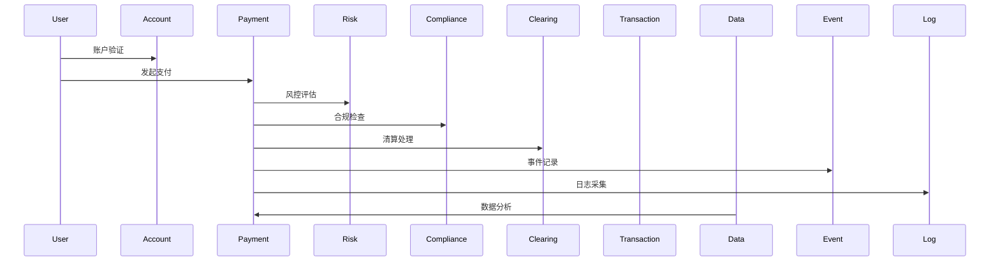
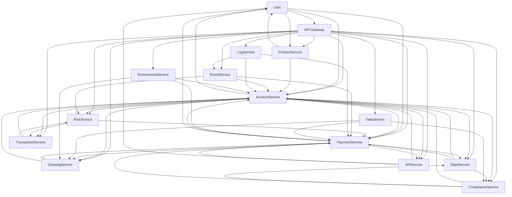

# 金融科技/智慧金融架构（Golang国际主流实践）

## 1. 目录

- [金融科技/智慧金融架构（Golang国际主流实践）](#金融科技智慧金融架构golang国际主流实践)
  - [1. 目录](#1-目录)
  - [2. 金融科技/智慧金融架构概述](#2-金融科技智慧金融架构概述)
    - [2.1 国际标准定义](#21-国际标准定义)
    - [2.2 发展历程与核心思想](#22-发展历程与核心思想)
    - [2.3 典型应用场景](#23-典型应用场景)
    - [2.4 与传统金融IT对比](#24-与传统金融it对比)
  - [3. 信息概念架构](#3-信息概念架构)
    - [3.1 领域建模方法](#31-领域建模方法)
    - [3.2 核心实体与关系](#32-核心实体与关系)
      - [3.2.1 UML 类图（Mermaid）](#321-uml-类图mermaid)
    - [3.3 典型数据流](#33-典型数据流)
      - [3.3.1 数据流时序图（Mermaid）](#331-数据流时序图mermaid)
    - [3.4 Golang 领域模型代码示例](#34-golang-领域模型代码示例)
  - [4. 分布式系统挑战](#4-分布式系统挑战)
    - [4.1 弹性与实时性](#41-弹性与实时性)
    - [4.2 数据安全与互操作性](#42-数据安全与互操作性)
    - [4.3 可观测性与智能优化](#43-可观测性与智能优化)
  - [5. 架构设计解决方案](#5-架构设计解决方案)
    - [5.1 服务解耦与标准接口](#51-服务解耦与标准接口)
    - [5.2 智能风控与弹性协同](#52-智能风控与弹性协同)
    - [5.3 数据安全与互操作设计](#53-数据安全与互操作设计)
    - [5.4 架构图（Mermaid）](#54-架构图mermaid)
    - [5.5 Golang代码示例](#55-golang代码示例)
  - [6. Golang实现范例](#6-golang实现范例)
    - [6.1 工程结构示例](#61-工程结构示例)
    - [6.2 关键代码片段](#62-关键代码片段)
    - [6.3 CI/CD 配置（GitHub Actions 示例）](#63-cicd-配置github-actions-示例)
  - [7. 形式化建模与证明](#7-形式化建模与证明)
    - [7.1 账户-支付-风控建模](#71-账户-支付-风控建模)
      - [7.1.1 性质1：智能风控性](#711-性质1智能风控性)
      - [7.1.2 性质2：合规性](#712-性质2合规性)
    - [7.2 符号说明](#72-符号说明)
  - [8. 参考与外部链接](#8-参考与外部链接)

---
## 2. 金融科技/智慧金融架构概述

### 国际标准定义

金融科技/智慧金融架构是指以合规安全、弹性扩展、智能风控、实时交易、开放互联为核心，支持账户、支付、清算、风控、合规、数据分析、API等场景的分布式系统架构。

- **国际主流参考**：ISO 20022、SWIFT、PCI DSS、PSD2、Open Banking、FIDO2、OAuth2、OpenID、ISO/IEC 27001、NIST Cybersecurity Framework、Basel III、FATF、GDPR、OpenAPI、FIX Protocol、ISO 8583、ISO 22301、SOC 2、OpenTelemetry、Prometheus。

### 发展历程与核心思想

- 2000s：网银、核心银行系统、支付网关、风控系统。
- 2010s：移动支付、区块链、API银行、云金融、智能投顾、合规自动化。
- 2020s：开放银行、实时支付、AI风控、全球协同、数字货币、数据主权。
- 核心思想：合规安全、弹性扩展、智能风控、实时交易、开放互联、标准合规。

### 典型应用场景

- 数字银行、移动支付、智能投顾、区块链金融、开放银行、实时清算、合规风控、金融大数据、API金融等。

### 与传统金融IT对比

| 维度         | 传统金融IT         | 智慧金融架构           |
|--------------|-------------------|----------------------|
| 交易模式     | 批量、人工         | 实时、自动化、智能     |
| 风控         | 静态、规则         | AI驱动、动态、弹性     |
| 合规         | 手工、被动         | 自动、标准、持续       |
| 扩展性       | 垂直扩展           | 水平弹性扩展          |
| 互操作性     | 封闭、专有         | 开放API、标准协议      |
| 适用场景     | 单一银行           | 多机构、全球协同      |

---

## 3. 信息概念架构

### 领域建模方法

- 采用分层建模（账户层、支付层、清算层、风控层、合规层、数据层、API层）、UML、ER图。
- 核心实体：账户、用户、支付、清算、风控、合规、交易、产品、数据、API、事件、日志、任务、环境。

### 核心实体与关系

| 实体    | 属性                        | 关系           |
|---------|-----------------------------|----------------|
| 账户    | ID, User, Type, Status      | 关联用户/支付/清算 |
| 用户    | ID, Name, Role, Status      | 关联账户/支付   |
| 支付    | ID, Account, Amount, Time   | 关联账户/用户/清算 |
| 清算    | ID, Payment, Status, Time   | 关联支付/账户   |
| 风控    | ID, Type, Rule, Status      | 关联账户/支付/交易 |
| 合规    | ID, Type, Rule, Status      | 关联账户/支付/数据 |
| 交易    | ID, Account, Amount, Time   | 关联账户/风控   |
| 产品    | ID, Name, Type, Status      | 关联账户/用户   |
| 数据    | ID, Type, Value, Time       | 关联账户/支付/合规 |
| API     | ID, Path, Method, Status    | 关联账户/用户/支付 |
| 事件    | ID, Type, Data, Time        | 关联账户/支付/风控 |
| 日志    | ID, Source, Data, Time      | 关联账户/支付/事件 |
| 任务    | ID, Type, Target, Status    | 关联支付/清算/合规 |
| 环境    | ID, Type, Value, Time       | 关联账户/支付/清算 |

#### UML 类图（Mermaid）



### 典型数据流

1. 用户发起支付→账户验证→风控评估→合规检查→支付执行→清算处理→事件记录→日志采集→数据分析→智能优化。

#### 数据流时序图（Mermaid）



### Golang 领域模型代码示例

```go
package fintech

import (
    "context"
    "time"
    "errors"
    "sync"
    "math/big"
    "crypto/rand"
)

// 用户实体
type User struct {
    ID          string            `json:"id"`
    Name        string            `json:"name"`
    Email       string            `json:"email"`
    Phone       string            `json:"phone"`
    Role        UserRole          `json:"role"`
    Status      UserStatus        `json:"status"`
    KYCStatus   KYCStatus         `json:"kyc_status"`
    Accounts    []string          `json:"accounts"`
    CreatedAt   time.Time         `json:"created_at"`
    UpdatedAt   time.Time         `json:"updated_at"`
    LastLoginAt time.Time         `json:"last_login_at"`
}

type UserRole string

const (
    UserRoleCustomer UserRole = "customer"
    UserRoleMerchant UserRole = "merchant"
    UserRoleAdmin    UserRole = "admin"
    UserRoleSupport  UserRole = "support"
)

type UserStatus string

const (
    UserStatusActive   UserStatus = "active"
    UserStatusInactive UserStatus = "inactive"
    UserStatusSuspended UserStatus = "suspended"
    UserStatusBlocked  UserStatus = "blocked"
)

type KYCStatus string

const (
    KYCStatusPending   KYCStatus = "pending"
    KYCStatusVerified  KYCStatus = "verified"
    KYCStatusRejected  KYCStatus = "rejected"
    KYCStatusExpired   KYCStatus = "expired"
)

// 账户实体
type Account struct {
    ID            string        `json:"id"`
    UserID        string        `json:"user_id"`
    Type          AccountType   `json:"type"`
    Currency      string        `json:"currency"`
    Balance       *big.Float    `json:"balance"`
    AvailableBalance *big.Float `json:"available_balance"`
    FrozenBalance *big.Float    `json:"frozen_balance"`
    Status        AccountStatus `json:"status"`
    CreatedAt     time.Time     `json:"created_at"`
    UpdatedAt     time.Time     `json:"updated_at"`
}

type AccountType string

const (
    AccountTypeSavings    AccountType = "savings"
    AccountTypeCurrent    AccountType = "current"
    AccountTypeInvestment AccountType = "investment"
    AccountTypeCredit     AccountType = "credit"
)

type AccountStatus string

const (
    AccountStatusActive   AccountStatus = "active"
    AccountStatusInactive AccountStatus = "inactive"
    AccountStatusFrozen   AccountStatus = "frozen"
    AccountStatusClosed   AccountStatus = "closed"
)

// 支付实体
type Payment struct {
    ID            string        `json:"id"`
    AccountID     string        `json:"account_id"`
    UserID        string        `json:"user_id"`
    Amount        *big.Float    `json:"amount"`
    Currency      string        `json:"currency"`
    Type          PaymentType   `json:"type"`
    Status        PaymentStatus `json:"status"`
    Method        PaymentMethod `json:"method"`
    Reference     string        `json:"reference"`
    Description   string        `json:"description"`
    Metadata      map[string]interface{} `json:"metadata"`
    CreatedAt     time.Time     `json:"created_at"`
    UpdatedAt     time.Time     `json:"updated_at"`
    ProcessedAt   *time.Time    `json:"processed_at"`
    FailedAt      *time.Time    `json:"failed_at"`
}

type PaymentType string

const (
    PaymentTypeTransfer   PaymentType = "transfer"
    PaymentTypeDeposit    PaymentType = "deposit"
    PaymentTypeWithdrawal PaymentType = "withdrawal"
    PaymentTypeRefund     PaymentType = "refund"
    PaymentTypeFee        PaymentType = "fee"
)

type PaymentStatus string

const (
    PaymentStatusPending   PaymentStatus = "pending"
    PaymentStatusProcessing PaymentStatus = "processing"
    PaymentStatusCompleted PaymentStatus = "completed"
    PaymentStatusFailed    PaymentStatus = "failed"
    PaymentStatusCancelled PaymentStatus = "cancelled"
    PaymentStatusRefunded  PaymentStatus = "refunded"
)

type PaymentMethod string

const (
    PaymentMethodCard     PaymentMethod = "card"
    PaymentMethodBank     PaymentMethod = "bank"
    PaymentMethodWallet   PaymentMethod = "wallet"
    PaymentMethodCrypto   PaymentMethod = "crypto"
    PaymentMethodCash     PaymentMethod = "cash"
)

// 交易实体
type Transaction struct {
    ID              string            `json:"id"`
    PaymentID       string            `json:"payment_id"`
    AccountID       string            `json:"account_id"`
    UserID          string            `json:"user_id"`
    Amount          *big.Float        `json:"amount"`
    Currency        string            `json:"currency"`
    Type            TransactionType   `json:"type"`
    Status          TransactionStatus `json:"status"`
    Reference       string            `json:"reference"`
    Description     string            `json:"description"`
    Fee             *big.Float        `json:"fee"`
    ExchangeRate    *big.Float        `json:"exchange_rate"`
    Metadata        map[string]interface{} `json:"metadata"`
    CreatedAt       time.Time         `json:"created_at"`
    UpdatedAt       time.Time         `json:"updated_at"`
    ProcessedAt     *time.Time        `json:"processed_at"`
}

type TransactionType string

const (
    TransactionTypeDebit  TransactionType = "debit"
    TransactionTypeCredit TransactionType = "credit"
)

type TransactionStatus string

const (
    TransactionStatusPending   TransactionStatus = "pending"
    TransactionStatusCompleted TransactionStatus = "completed"
    TransactionStatusFailed    TransactionStatus = "failed"
    TransactionStatusReversed  TransactionStatus = "reversed"
)

// 风控实体
type RiskAssessment struct {
    ID              string            `json:"id"`
    UserID          string            `json:"user_id"`
    PaymentID       string            `json:"payment_id"`
    RiskScore       float64           `json:"risk_score"`
    RiskLevel       RiskLevel         `json:"risk_level"`
    Factors         []RiskFactor      `json:"factors"`
    Decision        RiskDecision      `json:"decision"`
    Reason          string            `json:"reason"`
    CreatedAt       time.Time         `json:"created_at"`
    UpdatedAt       time.Time         `json:"updated_at"`
}

type RiskLevel string

const (
    RiskLevelLow      RiskLevel = "low"
    RiskLevelMedium   RiskLevel = "medium"
    RiskLevelHigh     RiskLevel = "high"
    RiskLevelCritical RiskLevel = "critical"
)

type RiskFactor struct {
    Type        string  `json:"type"`
    Score       float64 `json:"score"`
    Weight      float64 `json:"weight"`
    Description string  `json:"description"`
}

type RiskDecision string

const (
    RiskDecisionApprove  RiskDecision = "approve"
    RiskDecisionReview   RiskDecision = "review"
    RiskDecisionReject   RiskDecision = "reject"
    RiskDecisionBlock    RiskDecision = "block"
)

// 合规实体
type Compliance struct {
    ID            string              `json:"id"`
    UserID        string              `json:"user_id"`
    PaymentID     string              `json:"payment_id"`
    Type          ComplianceType      `json:"type"`
    Status        ComplianceStatus    `json:"status"`
    Rules         []ComplianceRule    `json:"rules"`
    Violations    []ComplianceViolation `json:"violations"`
    CreatedAt     time.Time           `json:"created_at"`
    UpdatedAt     time.Time           `json:"updated_at"`
}

type ComplianceType string

const (
    ComplianceTypeAML      ComplianceType = "aml"
    ComplianceTypeKYC      ComplianceType = "kyc"
    ComplianceTypeSanctions ComplianceType = "sanctions"
    ComplianceTypeFraud    ComplianceType = "fraud"
)

type ComplianceStatus string

const (
    ComplianceStatusPassed   ComplianceStatus = "passed"
    ComplianceStatusFailed   ComplianceStatus = "failed"
    ComplianceStatusPending  ComplianceStatus = "pending"
    ComplianceStatusReview   ComplianceStatus = "review"
)

type ComplianceRule struct {
    ID          string `json:"id"`
    Name        string `json:"name"`
    Description string `json:"description"`
    Status      string `json:"status"`
}

type ComplianceViolation struct {
    RuleID      string `json:"rule_id"`
    Description string `json:"description"`
    Severity    string `json:"severity"`
}

// 清算实体
type Clearing struct {
    ID            string          `json:"id"`
    PaymentID     string          `json:"payment_id"`
    TransactionID string          `json:"transaction_id"`
    Status        ClearingStatus  `json:"status"`
    Amount        *big.Float      `json:"amount"`
    Currency      string          `json:"currency"`
    ExchangeRate  *big.Float      `json:"exchange_rate"`
    Fee           *big.Float      `json:"fee"`
    SettlementDate *time.Time     `json:"settlement_date"`
    CreatedAt     time.Time       `json:"created_at"`
    UpdatedAt     time.Time       `json:"updated_at"`
}

type ClearingStatus string

const (
    ClearingStatusPending   ClearingStatus = "pending"
    ClearingStatusProcessing ClearingStatus = "processing"
    ClearingStatusCompleted ClearingStatus = "completed"
    ClearingStatusFailed    ClearingStatus = "failed"
    ClearingStatusReversed  ClearingStatus = "reversed"
)

// 领域服务接口
type PaymentService interface {
    CreatePayment(ctx context.Context, payment *Payment) error
    ProcessPayment(ctx context.Context, paymentID string) error
    GetPayment(ctx context.Context, id string) (*Payment, error)
    UpdatePaymentStatus(ctx context.Context, id string, status PaymentStatus) error
    RefundPayment(ctx context.Context, paymentID string, amount *big.Float) error
}

type AccountService interface {
    CreateAccount(ctx context.Context, account *Account) error
    GetAccount(ctx context.Context, id string) (*Account, error)
    UpdateBalance(ctx context.Context, accountID string, amount *big.Float, transactionType TransactionType) error
    FreezeAccount(ctx context.Context, accountID string) error
    UnfreezeAccount(ctx context.Context, accountID string) error
}

type RiskService interface {
    AssessRisk(ctx context.Context, userID string, payment *Payment) (*RiskAssessment, error)
    GetRiskScore(ctx context.Context, userID string) (float64, error)
    UpdateRiskRules(ctx context.Context, rules []RiskRule) error
    GetRiskHistory(ctx context.Context, userID string) ([]*RiskAssessment, error)
}

type ComplianceService interface {
    CheckCompliance(ctx context.Context, userID string, payment *Payment) (*Compliance, error)
    VerifyKYC(ctx context.Context, userID string, documents []KYCDocument) error
    CheckSanctions(ctx context.Context, userID string) (bool, error)
    GetComplianceStatus(ctx context.Context, userID string) (*Compliance, error)
}

type ClearingService interface {
    ProcessClearing(ctx context.Context, paymentID string) error
    SettlePayment(ctx context.Context, clearingID string) error
    GetClearingStatus(ctx context.Context, paymentID string) (*Clearing, error)
    ReverseClearing(ctx context.Context, clearingID string) error
}

// 支付处理服务实现
type PaymentProcessor struct {
    accountService  AccountService
    riskService     RiskService
    complianceService ComplianceService
    clearingService ClearingService
    eventBus        EventBus
    logger          Logger
}

func (pp *PaymentProcessor) ProcessPayment(ctx context.Context, paymentID string) error {
    // 获取支付信息
    payment, err := pp.getPayment(ctx, paymentID)
    if err != nil {
        return err
    }
    
    // 更新状态为处理中
    payment.Status = PaymentStatusProcessing
    if err := pp.updatePayment(ctx, payment); err != nil {
        return err
    }
    
    // 风控评估
    riskAssessment, err := pp.riskService.AssessRisk(ctx, payment.UserID, payment)
    if err != nil {
        return err
    }
    
    if riskAssessment.Decision == RiskDecisionReject || riskAssessment.Decision == RiskDecisionBlock {
        payment.Status = PaymentStatusFailed
        pp.updatePayment(ctx, payment)
        return errors.New("payment rejected by risk assessment")
    }
    
    // 合规检查
    compliance, err := pp.complianceService.CheckCompliance(ctx, payment.UserID, payment)
    if err != nil {
        return err
    }
    
    if compliance.Status == ComplianceStatusFailed {
        payment.Status = PaymentStatusFailed
        pp.updatePayment(ctx, payment)
        return errors.New("payment failed compliance check")
    }
    
    // 账户余额检查
    account, err := pp.accountService.GetAccount(ctx, payment.AccountID)
    if err != nil {
        return err
    }
    
    if account.AvailableBalance.Cmp(payment.Amount) < 0 {
        payment.Status = PaymentStatusFailed
        pp.updatePayment(ctx, payment)
        return errors.New("insufficient balance")
    }
    
    // 执行支付
    if err := pp.executePayment(ctx, payment); err != nil {
        payment.Status = PaymentStatusFailed
        pp.updatePayment(ctx, payment)
        return err
    }
    
    // 更新状态为完成
    payment.Status = PaymentStatusCompleted
    now := time.Now()
    payment.ProcessedAt = &now
    if err := pp.updatePayment(ctx, payment); err != nil {
        return err
    }
    
    // 触发清算
    go pp.clearingService.ProcessClearing(context.Background(), paymentID)
    
    // 发布事件
    pp.eventBus.Publish(&PaymentCompletedEvent{
        PaymentID: paymentID,
        UserID:    payment.UserID,
        Amount:    payment.Amount,
        Timestamp: time.Now(),
    })
    
    return nil
}

func (pp *PaymentProcessor) executePayment(ctx context.Context, payment *Payment) error {
    // 扣除账户余额
    if err := pp.accountService.UpdateBalance(ctx, payment.AccountID, payment.Amount, TransactionTypeDebit); err != nil {
        return err
    }
    
    // 创建交易记录
    transaction := &Transaction{
        ID:          generateID(),
        PaymentID:   payment.ID,
        AccountID:   payment.AccountID,
        UserID:      payment.UserID,
        Amount:      payment.Amount,
        Currency:    payment.Currency,
        Type:        TransactionTypeDebit,
        Status:      TransactionStatusCompleted,
        Reference:   payment.Reference,
        Description: payment.Description,
        CreatedAt:   time.Now(),
        UpdatedAt:   time.Now(),
    }
    
    now := time.Now()
    transaction.ProcessedAt = &now
    
    return pp.createTransaction(ctx, transaction)
}

// 交易实体
type Transaction struct {
    ID      string
    Account string
    Amount  float64
    Time    time.Time
}
// 产品实体
type Product struct {
    ID     string
    Name   string
    Type   string
    Status string
}
// 数据实体
type Data struct {
    ID    string
    Type  string
    Value string
    Time  time.Time
}
// API实体
type API struct {
    ID     string
    Path   string
    Method string
    Status string
}
// 事件实体
type Event struct {
    ID   string
    Type string
    Data string
    Time time.Time
}
// 日志实体
type Log struct {
    ID     string
    Source string
    Data   string
    Time   time.Time
}
// 任务实体
type Task struct {
    ID     string
    Type   string
    Target string
    Status string
}
// 环境实体
type Environment struct {
    ID    string
    Type  string
    Value float64
    Time  time.Time
}

```

---

## 4. 分布式系统挑战

### 弹性与实时性

- 自动扩缩容、毫秒级响应、负载均衡、容灾备份、实时清算。
- 国际主流：Kubernetes、Prometheus、云服务、CDN、Kafka、Flink、OpenAPI。

### 数据安全与互操作性

- 数据加密、标准协议、互操作、访问控制、合规治理。
- 国际主流：OAuth2、OpenID、TLS、ISO/IEC 27001、PCI DSS、Open Banking、FIDO2。

### 可观测性与智能优化

- 全链路追踪、指标采集、AI优化、异常检测、风控分析。
- 国际主流：OpenTelemetry、Prometheus、AI分析。

---

## 5. 架构设计解决方案

### 服务解耦与标准接口

- 账户、用户、支付、清算、风控、合规、交易、产品、数据、API、事件、日志、任务等服务解耦，API网关统一入口。
- 采用REST、gRPC、消息队列等协议，支持异步事件驱动。

### 智能风控与弹性协同

- AI驱动风控、弹性协同、自动扩缩容、智能优化。
- AI推理、Kubernetes、Prometheus、Flink、Kafka。

### 数据安全与互操作设计

- TLS、OAuth2、数据加密、标准协议、访问审计、合规治理。

### 架构图（Mermaid）



### Golang代码示例

```go
// 支付交易Prometheus监控
var paymentCount = prometheus.NewGauge(prometheus.GaugeOpts{Name: "payment_total"})
paymentCount.Set(1000000)

```

---

## 6. Golang实现范例

### 工程结构示例

```text
fintech-demo/
├── cmd/
├── internal/
│   ├── account/
│   ├── user/
│   ├── payment/
│   ├── clearing/
│   ├── risk/
│   ├── compliance/
│   ├── transaction/
│   ├── product/
│   ├── data/
│   ├── api/
│   ├── event/
│   ├── log/
│   ├── task/
│   ├── environment/
├── api/
├── pkg/
├── configs/
├── scripts/
├── build/
└── README.md

```

### 关键代码片段

// 见4.5

### CI/CD 配置（GitHub Actions 示例）

```yaml
name: Go CI
on:
  push:
    branches: [ main ]
jobs:
  build:
    runs-on: ubuntu-latest
    steps:
      - uses: actions/checkout@v3
      - name: Set up Go
        uses: actions/setup-go@v4
        with:
          go-version: '1.21'
      - name: Build
        run: go build ./...
      - name: Test
        run: go test ./...

```

---

## 7. 形式化建模与证明

### 账户-支付-风控建模

- 账户集合 $A = \{a_1, ..., a_n\}$，支付集合 $P = \{p_1, ..., p_k\}$，风控集合 $R = \{r_1, ..., r_l\}$。
- 支付函数 $f: (a, p) \rightarrow r$，合规函数 $g: (a, p) \rightarrow c$。

#### 性质1：智能风控性

- 所有账户 $a$ 与支付 $p$，其风控 $r$ 能智能评估。

#### 性质2：合规性

- 所有合规 $c$ 满足合规策略 $q$，即 $\forall c, \exists q, q(c) = true$。

### 符号说明

- $A$：账户集合
- $P$：支付集合
- $R$：风控集合
- $C$：合规集合
- $Q$：合规策略集合
- $f$：支付函数
- $g$：合规函数

---

## 8. 参考与外部链接

- [ISO 20022](https://www.iso20022.org/)
- [SWIFT](https://www.swift.com/)
- [PCI DSS](https://www.pcisecuritystandards.org/)
- [PSD2](https://www.ecb.europa.eu/paym/intro/mip-online/2018/html/1803_psd2.en.html)
- [Open Banking](https://www.openbanking.org.uk/)
- [FIDO2](https://fidoalliance.org/fido2/)
- [OAuth2](https://oauth.net/2/)
- [OpenID](https://openid.net/)
- [ISO/IEC 27001](https://www.iso.org/isoiec-27001-information-security.html)
- [NIST Cybersecurity Framework](https://www.nist.gov/cyberframework)
- [Basel III](https://www.bis.org/basel_framework/)
- [FATF](https://www.fatf-gafi.org/)
- [GDPR](https://gdpr.eu/)
- [OpenAPI](https://www.openapis.org/)
- [FIX Protocol](https://www.fixtrading.org/)
- [ISO 8583](https://www.iso.org/standard/31628.html)
- [ISO 22301](https://www.iso.org/standard/75106.html)
- [SOC 2](https://www.aicpa.org/resources/article/soc-2-report)
- [OpenTelemetry](https://opentelemetry.io/)
- [Prometheus](https://prometheus.io/)

---

**文档维护者**: Go Documentation Team  
**最后更新**: 2025年10月20日  
**文档状态**: 完成  
**适用版本**: Go 1.21+
