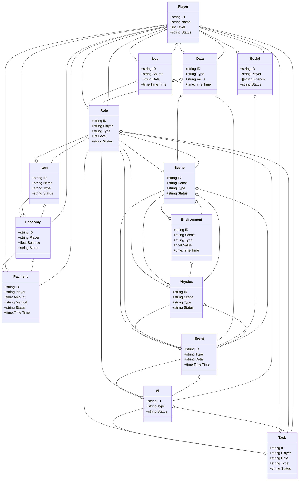
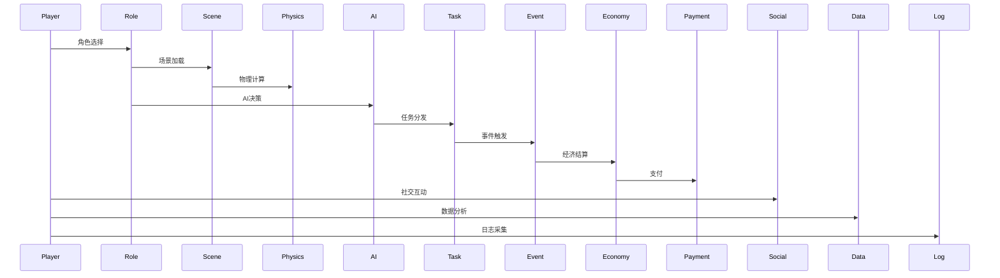
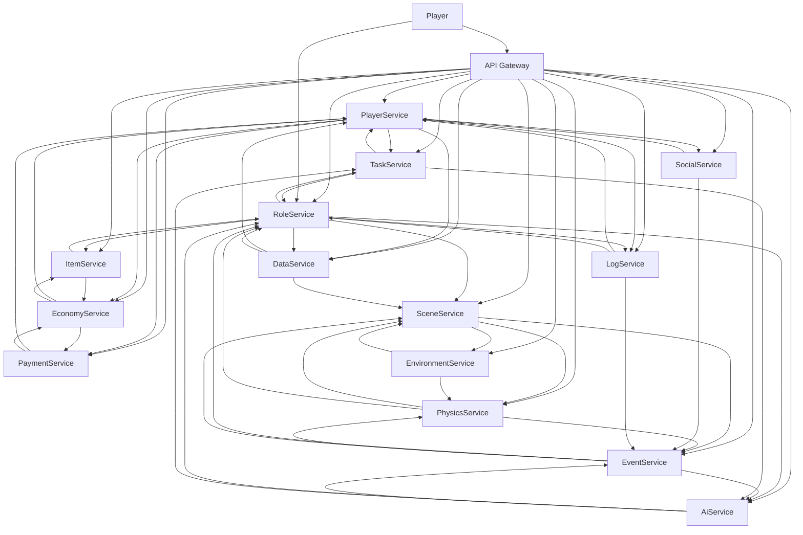

# 游戏开发/智慧游戏架构（Golang国际主流实践）

## 1. 目录

- [游戏开发/智慧游戏架构（Golang国际主流实践）](#游戏开发智慧游戏架构golang国际主流实践)
  - [1. 目录](#1-目录)
  - [2. 游戏开发/智慧游戏架构概述](#2-游戏开发智慧游戏架构概述)
    - [2.1 国际标准定义](#21-国际标准定义)
    - [2.2 发展历程与核心思想](#22-发展历程与核心思想)
    - [2.3 典型应用场景](#23-典型应用场景)
    - [2.4 与传统游戏IT对比](#24-与传统游戏it对比)
  - [3. 信息概念架构](#3-信息概念架构)
    - [3.1 领域建模方法](#31-领域建模方法)
    - [3.2 核心实体与关系](#32-核心实体与关系)
      - [3.2.1 UML 类图（Mermaid）](#321-uml-类图mermaid)
    - [3.3 典型数据流](#33-典型数据流)
      - [3.3.1 数据流时序图（Mermaid）](#331-数据流时序图mermaid)
    - [3.4 Golang 领域模型代码示例](#34-golang-领域模型代码示例)
  - [4. 分布式系统挑战](#4-分布式系统挑战)
    - [4.1 弹性与实时性](#41-弹性与实时性)
    - [4.2 数据一致性与安全合规](#42-数据一致性与安全合规)
    - [4.3 实时性与可观测性](#43-实时性与可观测性)
  - [5. 架构设计解决方案](#5-架构设计解决方案)
    - [5.1 微服务与标准接口](#51-微服务与标准接口)
    - [5.2 智能AI与弹性扩展](#52-智能ai与弹性扩展)
    - [5.3 数据安全与合规设计](#53-数据安全与合规设计)
    - [5.4 架构图（Mermaid）](#54-架构图mermaid)
    - [5.5 Golang代码示例](#55-golang代码示例)
  - [6. Golang实现范例](#6-golang实现范例)
    - [6.1 工程结构示例](#61-工程结构示例)
    - [6.2 关键代码片段](#62-关键代码片段)
    - [6.3 CI/CD 配置（GitHub Actions 示例）](#63-cicd-配置github-actions-示例)
  - [7. 形式化建模与证明](#7-形式化建模与证明)
    - [7.1 玩家-角色-任务建模](#71-玩家-角色-任务建模)
      - [7.1.1 性质1：实时性](#711-性质1实时性)
      - [7.1.2 性质2：弹性扩展性](#712-性质2弹性扩展性)
    - [7.2 符号说明](#72-符号说明)
  - [8. 参考与外部链接](#8-参考与外部链接)

---

---

## 2. 游戏开发/智慧游戏架构概述

### 2.1 国际标准定义

游戏开发/智慧游戏架构是指以分布式、弹性、实时、数据驱动、安全合规为核心，支持玩家、角色、场景、物理、AI、事件、任务、道具、经济、支付、社交、数据、日志、环境等场景的现代化系统架构。

- **国际主流参考**：ISO/IEC 23026、ISO/IEC 25010、OpenXR、OpenGL、WebGL、gRPC、OpenAPI、OAuth2、OpenID、OpenTelemetry、Prometheus、Kubernetes、Docker、Microservices、Event Sourcing、CQRS、REST、W3C Web标准、ISO/IEC 27001、GDPR。

### 2.2 发展历程与核心思想

- 1980s-1990s：单机游戏、2D/3D引擎、基础网络对战。
- 2000s：大型多人在线（MMO）、客户端-服务器架构、实时同步、虚拟经济。
- 2010s：云游戏、微服务、弹性扩展、AI驱动、跨平台、移动端、实时社交。
- 2020s：云原生、全平台、实时渲染、AI NPC、区块链游戏、元宇宙、全球协同、合规治理。
- 核心思想：分布式、弹性、实时、数据驱动、安全合规、标准互操作。

### 2.3 典型应用场景

- MMO、MOBA、FPS、RPG、SLG、云游戏、跨平台、实时竞技、虚拟经济、AI NPC、社交互动、区块链游戏、元宇宙。

### 2.4 与传统游戏IT对比

| 维度         | 传统游戏IT         | 智慧游戏架构           |
|--------------|-------------------|----------------------|
| 架构模式     | 单体、C/S         | 微服务、云原生、弹性   |
| 通信协议     | TCP/UDP、私有协议  | REST、gRPC、WebSocket |
| 智能化       | 规则、人工         | AI驱动、智能NPC       |
| 数据处理     | 局部、离线         | 实时、流式、全局      |
| 安全合规     | 基础、被动         | ISO/IEC 27001、GDPR、主动 |
| 适用场景     | 单一平台           | 全平台、全球化        |

---

## 3. 信息概念架构

### 3.1 领域建模方法

- 采用分层建模（玩家层、角色层、场景层、物理层、AI层、经济层、数据层）、UML、ER图。
- 核心实体：玩家、角色、场景、物理、AI、事件、任务、道具、经济、支付、社交、数据、日志、环境。

### 3.2 核心实体与关系

| 实体    | 属性                        | 关系           |
|---------|-----------------------------|----------------|
| 玩家    | ID, Name, Level, Status     | 关联角色/任务/支付/社交/数据 |
| 角色    | ID, Player, Type, Level, Status| 关联玩家/场景/道具/任务/AI |
| 场景    | ID, Name, Type, Status      | 关联角色/物理/事件/环境 |
| 物理    | ID, Scene, Type, Status     | 关联场景/角色/事件 |
| AI      | ID, Type, Status            | 关联角色/任务/事件 |
| 事件    | ID, Type, Data, Time        | 关联角色/场景/AI/物理 |
| 任务    | ID, Player, Role, Type, Status| 关联玩家/角色/AI |
| 道具    | ID, Name, Type, Status      | 关联角色/经济 |
| 经济    | ID, Player, Balance, Status | 关联玩家/支付/道具 |
| 支付    | ID, Player, Amount, Method, Status, Time| 关联玩家/经济 |
| 社交    | ID, Player, Friends, Status | 关联玩家/事件 |
| 数据    | ID, Type, Value, Time       | 关联玩家/角色/场景 |
| 日志    | ID, Source, Data, Time      | 关联玩家/角色/事件 |
| 环境    | ID, Scene, Type, Value, Time| 关联场景/物理 |

#### 3.2.1 UML 类图（Mermaid）



### 3.3 典型数据流

1. 玩家登录→角色选择→场景加载→物理计算→AI决策→任务分发→事件触发→经济结算→支付→社交互动→数据分析→日志采集。

#### 3.3.1 数据流时序图（Mermaid）



### 3.4 Golang 领域模型代码示例

```go
// 玩家实体
type Player struct {
    ID     string
    Name   string
    Level  int
    Status string
}
// 角色实体
type Role struct {
    ID     string
    Player string
    Type   string
    Level  int
    Status string
}
// 场景实体
type Scene struct {
    ID     string
    Name   string
    Type   string
    Status string
}
// 物理实体
type Physics struct {
    ID     string
    Scene  string
    Type   string
    Status string
}
// AI实体
type AI struct {
    ID     string
    Type   string
    Status string
}
// 事件实体
type Event struct {
    ID   string
    Type string
    Data string
    Time time.Time
}
// 任务实体
type Task struct {
    ID     string
    Player string
    Role   string
    Type   string
    Status string
}
// 道具实体
type Item struct {
    ID     string
    Name   string
    Type   string
    Status string
}
// 经济实体
type Economy struct {
    ID      string
    Player  string
    Balance float64
    Status  string
}
// 支付实体
type Payment struct {
    ID     string
    Player string
    Amount float64
    Method string
    Status string
    Time   time.Time
}
// 社交实体
type Social struct {
    ID      string
    Player  string
    Friends []string
    Status  string
}
// 数据实体
type Data struct {
    ID    string
    Type  string
    Value string
    Time  time.Time
}
// 日志实体
type Log struct {
    ID     string
    Source string
    Data   string
    Time   time.Time
}
// 环境实体
type Environment struct {
    ID     string
    Scene  string
    Type   string
    Value  float64
    Time   time.Time
}

```

---

## 4. 分布式系统挑战

### 4.1 弹性与实时性

- 自动扩缩容、毫秒级响应、负载均衡、容灾备份、全球部署、低延迟。
- 国际主流：Kubernetes、Prometheus、云服务、CDN、微服务、边缘计算。

### 4.2 数据一致性与安全合规

- 分布式同步、最终一致性、数据加密、访问控制、合规治理。
- 国际主流：OAuth2、OpenID、ISO/IEC 27001、GDPR、OpenAPI。

### 4.3 实时性与可观测性

- 实时同步、流式处理、全链路追踪、指标采集、异常检测。
- 国际主流：OpenTelemetry、Prometheus、AI分析。

---

## 5. 架构设计解决方案

### 5.1 微服务与标准接口

- 玩家、角色、场景、物理、AI、事件、任务、道具、经济、支付、社交、数据、日志、环境等服务解耦，API网关统一入口。
- 采用REST、gRPC、WebSocket、消息队列、事件驱动等协议，支持异步事件。

### 5.2 智能AI与弹性扩展

- AI驱动NPC、弹性扩缩容、智能经济、自动化运营。
- AI推理、Kubernetes、Prometheus、边缘计算。

### 5.3 数据安全与合规设计

- TLS、OAuth2、ISO/IEC 27001、GDPR、数据加密、访问审计、合规治理。

### 5.4 架构图（Mermaid）



### 5.5 Golang代码示例

```go
// 在线玩家数量Prometheus监控
var onlinePlayerCount = prometheus.NewGauge(prometheus.GaugeOpts{Name: "online_player_total"})
onlinePlayerCount.Set(1000000)

```

---

## 6. Golang实现范例

### 6.1 工程结构示例

```text
game-demo/
├── cmd/
├── internal/
│   ├── player/
│   ├── role/
│   ├── scene/
│   ├── physics/
│   ├── ai/
│   ├── event/
│   ├── task/
│   ├── item/
│   ├── economy/
│   ├── payment/
│   ├── social/
│   ├── data/
│   ├── log/
│   ├── environment/
├── api/
├── pkg/
├── configs/
├── scripts/
├── build/
└── README.md

```

### 6.2 关键代码片段

// 见4.5

### 6.3 CI/CD 配置（GitHub Actions 示例）

```yaml
name: Go CI
on:
  push:
    branches: [ main ]
jobs:
  build:
    runs-on: ubuntu-latest
    steps:
      - uses: actions/checkout@v3
      - name: Set up Go
        uses: actions/setup-go@v4
        with:
          go-version: '1.21'
      - name: Build
        run: go build ./...
      - name: Test
        run: go test ./...

```

---

## 7. 形式化建模与证明

### 7.1 玩家-角色-任务建模

- 玩家集合 $P = \{p_1, ..., p_n\}$，角色集合 $R = \{r_1, ..., r_m\}$，任务集合 $T = \{t_1, ..., t_k\}$。
- 角色分配函数 $f: (p, t) \rightarrow r$，任务分发函数 $g: (r, a) \rightarrow t$。

#### 7.1.1 性质1：实时性

- 所有玩家 $p$ 与任务 $t$，其角色 $r$ 能实时分配。

#### 7.1.2 性质2：弹性扩展性

- 所有玩家 $p$、角色 $r$，其服务可弹性扩展。

### 7.2 符号说明

- $P$：玩家集合
- $R$：角色集合
- $T$：任务集合
- $f$：角色分配函数
- $g$：任务分发函数

---

## 8. 参考与外部链接

- [ISO/IEC 23026](https://www.iso.org/standard/73434.html)
- [ISO/IEC 25010](https://iso25000.com/index.php/en/iso-25000-standards/iso-25010)
- [OpenXR](https://www.khronos.org/openxr/)
- [OpenGL](https://www.opengl.org/)
- [WebGL](https://www.khronos.org/webgl/)
- [gRPC](https://grpc.io/)
- [OpenAPI](https://www.openapis.org/)
- [OAuth2](https://oauth.net/2/)
- [OpenID](https://openid.net/)
- [OpenTelemetry](https://opentelemetry.io/)
- [Prometheus](https://prometheus.io/)
- [Kubernetes](https://kubernetes.io/)
- [Docker](https://www.docker.com/)
- [ISO/IEC 27001](https://www.iso.org/isoiec-27001-information-security.html)
- [GDPR](https://gdpr.eu/)
- [W3C Web标准](https://www.w3.org/standards/webdesign/)
