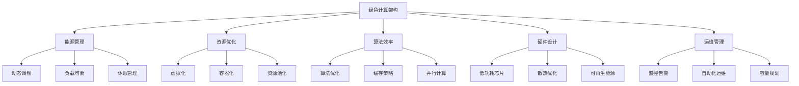
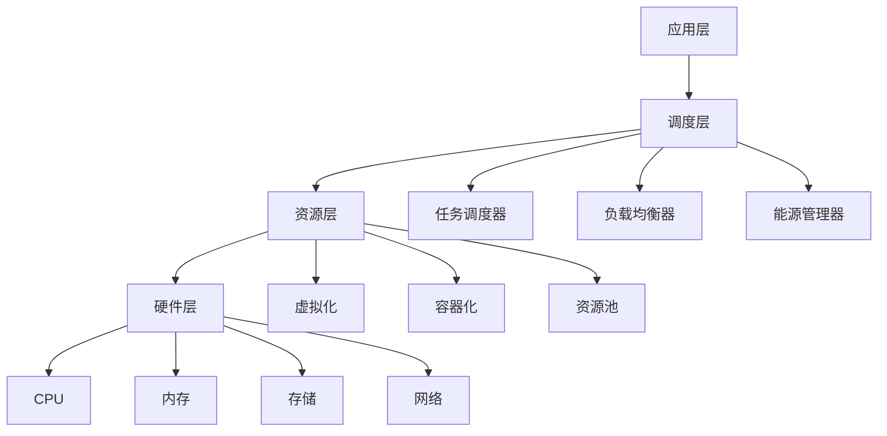
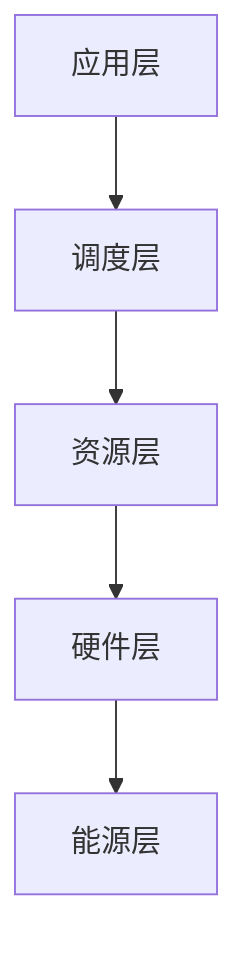

# 绿色计算架构 - Golang实现指南

## 1. 目录

## 2. 概述

### 定义与发展历程

绿色计算（Green Computing）是一种以减少环境影响为目标的计算范式，通过优化硬件设计、软件算法、系统架构和运维管理，实现计算资源的高效利用和能源消耗的最小化。

**发展历程：**

- 1992年：EPA推出Energy Star计划
- 2007年：Google提出数据中心能效优化
- 2010年：云计算推动绿色IT发展
- 2015年：可再生能源在数据中心应用
- 2020年后：碳中和目标推动绿色计算普及

### 核心特征



## 3. 绿色计算基础

### 核心指标

**能效指标：**

- PUE（Power Usage Effectiveness）：数据中心能效比
- DCIE（Data Center Infrastructure Efficiency）：数据中心基础设施效率
- CUE（Carbon Usage Effectiveness）：碳使用效率
- WUE（Water Usage Effectiveness）：水使用效率

**性能指标：**

- 每瓦特性能（Performance per Watt）
- 每焦耳计算量（Computations per Joule）
- 能源效率比（Energy Efficiency Ratio）

### 技术领域

**硬件层面：**

- 低功耗处理器设计
- 高效散热系统
- 可再生能源供电
- 硬件虚拟化

**软件层面：**

- 算法优化
- 代码效率提升
- 资源调度优化
- 动态功耗管理

**系统层面：**

- 负载均衡
- 资源池化
- 自动化运维
- 智能监控

### 应用场景

**数据中心：**

- 服务器能效优化
- 存储系统节能
- 网络设备管理
- 制冷系统优化

**边缘计算：**

- 移动设备优化
- IoT设备节能
- 边缘节点管理
- 本地计算优化

**云计算：**

- 虚拟机调度
- 容器编排
- 弹性伸缩
- 多租户隔离

## 4. 国际标准与主流框架

### 国际标准

**能效标准：**

- ENERGY STAR：设备能效认证
- 80 PLUS：电源能效认证
- TCO Certified：可持续IT认证
- EPEAT：电子产品环境影响评估

**数据中心标准：**

- ASHRAE TC 9.9：数据中心环境标准
- TIA-942：数据中心基础设施标准
- ISO/IEC 30134：数据中心能效指标
- LEED：绿色建筑认证

**软件标准：**

- Green Software Foundation：绿色软件标准
- Carbon Aware Computing：碳感知计算
- Sustainable Software Engineering：可持续软件工程

### 主流开源框架

**监控工具：**

- Prometheus：监控系统
- Grafana：可视化平台
- InfluxDB：时序数据库
- Telegraf：数据收集器

**调度框架：**

- Kubernetes：容器编排
- Apache Mesos：资源管理
- Docker Swarm：容器集群
- Nomad：工作负载调度

**优化工具：**

- PowerTOP：功耗分析
- Intel PCM：性能监控
- RAPL：运行时平均功耗限制
- PAPI：性能API

### 商业解决方案

**云服务商：**

- AWS：碳足迹工具
- Google Cloud：碳智能计算
- Microsoft Azure：可持续发展计算
- Alibaba Cloud：绿色数据中心

**硬件厂商：**

- Intel：低功耗处理器
- AMD：能效优化
- ARM：节能架构
- NVIDIA：绿色GPU

## 5. 领域建模

### 核心实体

```go
// 能源监控
type EnergyMonitor struct {
    ID          string
    Location    string
    PowerUsage  float64
    Temperature float64
    Humidity    float64
    Timestamp   time.Time
}

// 资源节点
type ResourceNode struct {
    ID           string
    Type         NodeType
    CPU          CPUInfo
    Memory       MemoryInfo
    Storage      StorageInfo
    PowerState   PowerState
    Utilization  float64
}

// 任务调度
type Task struct {
    ID           string
    Priority     int
    ResourceReq  ResourceRequirements
    EnergyBudget float64
    Deadline     time.Time
    Status       TaskStatus
}

// 能效策略
type EnergyPolicy struct {
    ID           string
    Name         string
    Thresholds   map[string]float64
    Actions      []EnergyAction
    Schedule     SchedulePolicy
}

```

### 系统架构



## 6. 分布式挑战

### 能源管理复杂性

- 多节点能源消耗监控
- 动态负载分布优化
- 可再生能源集成管理

### 性能与能效平衡

- 服务质量保证
- 能效优化策略
- 资源利用率最大化

### 异构环境适配

- 不同硬件架构
- 多样化能源来源
- 环境条件变化

### 实时性要求

- 能源监控实时性
- 负载调整响应时间
- 故障检测与恢复

## 7. 设计解决方案

### 分层能源管理



### 智能调度策略

- 基于负载的调度
- 能源感知调度
- 预测性调度

### 动态功耗管理

- CPU频率调节
- 内存功耗控制
- 存储节能策略

### 可再生能源集成

- 太阳能、风能接入
- 能源存储管理
- 混合能源调度

## 8. Golang实现

### 能源监控系统

```go
// 能源监控器
type EnergyMonitor struct {
    nodes    map[string]*ResourceNode
    metrics  map[string]*EnergyMetrics
    policies []EnergyPolicy
    mu       sync.RWMutex
}

// 能源指标
type EnergyMetrics struct {
    PowerConsumption float64
    Temperature      float64
    Utilization      float64
    Efficiency       float64
    Timestamp        time.Time
}

// 监控数据收集
func (em *EnergyMonitor) CollectMetrics() {
    ticker := time.NewTicker(30 * time.Second)
    go func() {
        for range ticker.C {
            em.updateMetrics()
        }
    }()
}

func (em *EnergyMonitor) updateMetrics() {
    em.mu.Lock()
    defer em.mu.Unlock()
    
    for nodeID, node := range em.nodes {
        metrics := &EnergyMetrics{
            PowerConsumption: em.measurePower(node),
            Temperature:      em.measureTemperature(node),
            Utilization:      em.calculateUtilization(node),
            Efficiency:       em.calculateEfficiency(node),
            Timestamp:        time.Now(),
        }
        
        em.metrics[nodeID] = metrics
        
        // 检查能源策略
        em.checkEnergyPolicies(nodeID, metrics)
    }
}

```

### 绿色调度器

```go
// 绿色调度器
type GreenScheduler struct {
    nodes       map[string]*ResourceNode
    tasks       map[string]*Task
    policies    []SchedulingPolicy
    mu          sync.RWMutex
}

// 调度策略
type SchedulingPolicy struct {
    Name        string
    Priority    int
    Conditions  []Condition
    Actions     []Action
}

// 任务调度
func (gs *GreenScheduler) ScheduleTask(task *Task) (string, error) {
    gs.mu.RLock()
    defer gs.mu.RUnlock()
    
    // 找到最适合的节点
    bestNode := gs.findOptimalNode(task)
    if bestNode == nil {
        return "", fmt.Errorf("no suitable node found")
    }
    
    // 应用调度策略
    if err := gs.applySchedulingPolicies(task, bestNode); err != nil {
        return "", err
    }
    
    return bestNode.ID, nil
}

func (gs *GreenScheduler) findOptimalNode(task *Task) *ResourceNode {
    var bestNode *ResourceNode
    bestScore := -1.0
    
    for _, node := range gs.nodes {
        if !gs.canSchedule(task, node) {
            continue
        }
        
        score := gs.calculateNodeScore(task, node)
        if score > bestScore {
            bestScore = score
            bestNode = node
        }
    }
    
    return bestNode
}

func (gs *GreenScheduler) calculateNodeScore(task *Task, node *ResourceNode) float64 {
    // 综合考虑性能、能效、负载等因素
    performanceScore := gs.calculatePerformanceScore(task, node)
    energyScore := gs.calculateEnergyScore(node)
    loadScore := gs.calculateLoadScore(node)
    
    // 加权计算总分
    return 0.4*performanceScore + 0.4*energyScore + 0.2*loadScore
}

```

### 动态功耗管理

```go
// 功耗管理器
type PowerManager struct {
    nodes       map[string]*ResourceNode
    policies    map[string]*PowerPolicy
    mu          sync.RWMutex
}

// 功耗策略
type PowerPolicy struct {
    ID           string
    Name         string
    Thresholds   map[string]float64
    Actions      []PowerAction
}

// 功耗动作
type PowerAction struct {
    Type     ActionType
    Target   string
    Value    float64
    Duration time.Duration
}

// 应用功耗策略
func (pm *PowerManager) ApplyPowerPolicy(nodeID string, policyID string) error {
    pm.mu.Lock()
    defer pm.mu.Unlock()
    
    node, exists := pm.nodes[nodeID]
    if !exists {
        return fmt.Errorf("node %s not found", nodeID)
    }
    
    policy, exists := pm.policies[policyID]
    if !exists {
        return fmt.Errorf("policy %s not found", policyID)
    }
    
    // 检查阈值条件
    if !pm.checkThresholds(node, policy.Thresholds) {
        return nil
    }
    
    // 执行功耗动作
    for _, action := range policy.Actions {
        if err := pm.executePowerAction(node, action); err != nil {
            return err
        }
    }
    
    return nil
}

func (pm *PowerManager) executePowerAction(node *ResourceNode, action PowerAction) error {
    switch action.Type {
    case ActionTypeCPUFrequency:
        return pm.adjustCPUFrequency(node, action.Value)
    case ActionTypeMemoryPower:
        return pm.adjustMemoryPower(node, action.Value)
    case ActionTypeStoragePower:
        return pm.adjustStoragePower(node, action.Value)
    case ActionTypeSleep:
        return pm.putNodeToSleep(node, action.Duration)
    default:
        return fmt.Errorf("unknown action type: %s", action.Type)
    }
}

```

### 可再生能源管理

```go
// 可再生能源管理器
type RenewableEnergyManager struct {
    sources     map[string]*EnergySource
    storage     *EnergyStorage
    grid        *PowerGrid
    mu          sync.RWMutex
}

// 能源源
type EnergySource struct {
    ID       string
    Type     SourceType
    Capacity float64
    Current  float64
    Status   SourceStatus
}

// 能源存储
type EnergyStorage struct {
    Capacity    float64
    Current     float64
    Efficiency  float64
    Status      StorageStatus
}

// 能源调度
func (rem *RenewableEnergyManager) OptimizeEnergyDistribution() error {
    rem.mu.Lock()
    defer rem.mu.Unlock()
    
    // 计算总可用能源
    totalAvailable := rem.calculateTotalAvailable()
    
    // 计算负载需求
    totalDemand := rem.calculateTotalDemand()
    
    // 优化分配策略
    if totalAvailable >= totalDemand {
        return rem.distributeExcessEnergy(totalAvailable - totalDemand)
    } else {
        return rem.manageEnergyShortage(totalDemand - totalAvailable)
    }
}

func (rem *RenewableEnergyManager) distributeExcessEnergy(excess float64) error {
    // 优先存储到电池
    storageCapacity := rem.storage.Capacity - rem.storage.Current
    if storageCapacity > 0 {
        storeAmount := math.Min(excess, storageCapacity)
        rem.storage.Current += storeAmount * rem.storage.Efficiency
        excess -= storeAmount
    }
    
    // 剩余能源卖给电网
    if excess > 0 {
        return rem.grid.SellEnergy(excess)
    }
    
    return nil
}

```

## 9. 形式化建模

### 能源系统形式化

- 节点集合 N = {n1, n2, ..., nn}
- 任务集合 T = {t1, t2, ..., tm}
- 能源约束 E(n, t)
- 调度函数 S: T → N

### 能效优化模型

- 目标函数：min Σ E(n) × P(n)
- 约束条件：C(n) ≥ R(t)
- 能效比：η = P(n) / E(n)

### 可再生能源集成

- 能源平衡：Σ E_renewable + Σ E_storage = Σ E_demand
- 存储效率：E_stored = η × E_input
- 调度策略：S = f(E_available, E_demand, η)

## 10. 最佳实践

### 架构设计原则

- 能源感知设计
- 分层优化策略
- 自适应调整机制

### 监控与优化

- 实时能源监控
- 预测性维护
- 自动化优化

### 可持续发展

- 可再生能源使用
- 碳足迹跟踪
- 循环经济原则

### 性能保证

- 服务质量保证
- 故障恢复机制
- 容量规划

## 11. 参考资源

### 标准与规范

- ENERGY STAR: <https://www.energystar.gov/>
- 80 PLUS: <https://80plus.org/>
- ASHRAE TC 9.9: <https://tc0909.ashraetcs.org/>

### 开源项目

- Prometheus: <https://prometheus.io/>
- Grafana: <https://grafana.com/>
- Kubernetes: <https://kubernetes.io/>

### 研究机构

- Green Software Foundation: <https://greensoftware.foundation/>
- Carbon Aware Computing: <https://carbon-aware-computing.com/>
- Sustainable Software Engineering: <https://sustainable-software-engineering.com/>

### 书籍与论文

- Green Computing: A Comprehensive Guide (Springer)
- Energy-Efficient Computing and Networking (IEEE)

---

- 本文档为绿色计算架构的系统性指南，涵盖理论、设计、实现与最佳实践，适用于Golang开发者与架构师。*

---

**文档维护者**: Go Documentation Team  
**最后更新**: 2025年10月20日  
**文档状态**: 完成  
**适用版本**: Go 1.25.3+
