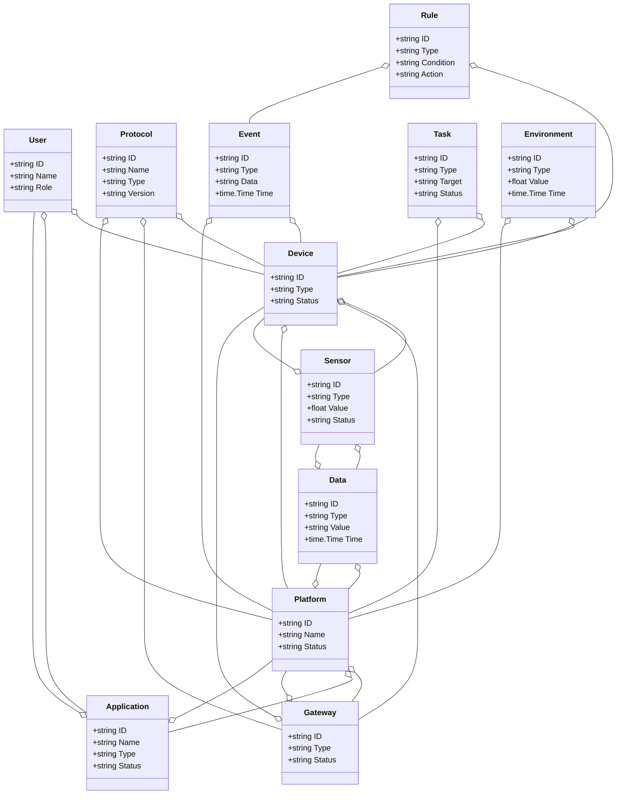
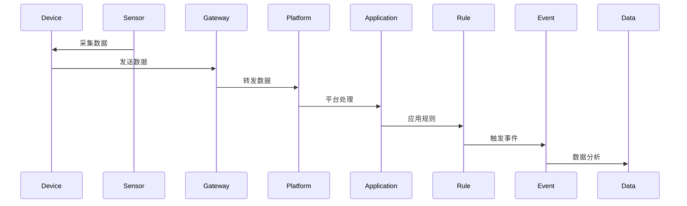
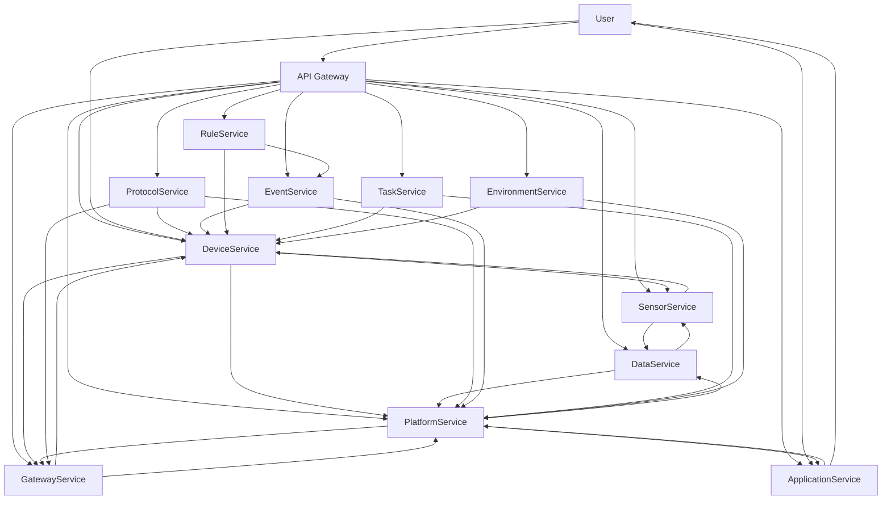

# 物联网/智慧物联架构（Golang国际主流实践）

## 1. 目录

---
## 2. 物联网/智慧物联架构概述

### 国际标准定义

物联网/智慧物联架构是指以设备互联、数据驱动、智能感知、弹性协同、安全可信为核心，支持设备、网关、平台、应用、数据、协议、管理、分析等场景的分布式系统架构。

- **国际主流参考**：ISO/IEC 30141、oneM2M、IETF CoAP/MQTT、OASIS MQTT、LwM2M、IEEE P2413、OGC SensorThings、W3C WoT、Open Connectivity Foundation、GSMA IoT、ISO/IEC 20924、ISO/IEC 21823、ISO/IEC 30161、ISO/IEC 27001、NIST IoT。

### 发展历程与核心思想

- 2000s：M2M、传感器网络、嵌入式系统、早期物联网平台。
- 2010s：云平台、边缘计算、协议标准化、设备管理、数据分析。
- 2020s：AIoT、数字孪生、全球协同、智能边缘、无接触服务、数据主权。
- 核心思想：设备互联、数据驱动、智能感知、弹性协同、安全可信、标准互操作。

### 典型应用场景

- 智慧城市、智能制造、智能家居、车联网、智慧农业、智慧医疗、能源管理、环境监测等。

### 与传统IT对比

| 维度         | 传统IT系统         | 智慧物联架构           |
|--------------|-------------------|----------------------|
| 连接对象     | 人、服务器         | 设备、传感器、边缘、云 |
| 协议         | TCP/IP、HTTP      | MQTT、CoAP、LwM2M等   |
| 数据采集     | 手工、离线         | 实时、自动化          |
| 协同         | 单点、割裂         | 多方、弹性、协同      |
| 智能化       | 规则、人工         | AI驱动、智能分析      |
| 适用场景     | 企业、数据中心     | 全域、全球、物理世界  |

---

## 3. 信息概念架构

### 领域建模方法

- 采用分层建模（感知层、网络层、平台层、应用层）、UML、ER图。
- 核心实体：设备、传感器、网关、平台、应用、数据、协议、用户、事件、规则、任务、环境。

### 核心实体与关系

| 实体    | 属性                        | 关系           |
|---------|-----------------------------|----------------|
| 设备    | ID, Type, Status            | 关联传感器/网关/平台 |
| 传感器  | ID, Type, Value, Status     | 关联设备/数据   |
| 网关    | ID, Type, Status            | 关联设备/平台   |
| 平台    | ID, Name, Status            | 关联网关/应用   |
| 应用    | ID, Name, Type, Status      | 关联平台/用户   |
| 数据    | ID, Type, Value, Time       | 关联传感器/平台 |
| 协议    | ID, Name, Type, Version     | 关联设备/网关/平台 |
| 用户    | ID, Name, Role              | 管理设备/应用   |
| 事件    | ID, Type, Data, Time        | 关联设备/平台   |
| 规则    | ID, Type, Condition, Action | 关联设备/事件   |
| 任务    | ID, Type, Target, Status    | 关联设备/平台   |
| 环境    | ID, Type, Value, Time       | 关联设备/平台   |

#### UML 类图（Mermaid）



### 典型数据流

1. 设备数据采集→网关转发→平台处理→应用消费→规则触发→事件记录→数据分析→智能优化。

#### 数据流时序图（Mermaid）



### Golang 领域模型代码示例

```go
package iot

import (
    "context"
    "time"
    "errors"
    "sync"
    "encoding/json"
    "math"
)

// 设备实体
type Device struct {
    ID            string            `json:"id"`
    Name          string            `json:"name"`
    Type          DeviceType        `json:"type"`
    Model         string            `json:"model"`
    Manufacturer  string            `json:"manufacturer"`
    Firmware      string            `json:"firmware"`
    Status        DeviceStatus      `json:"status"`
    Location      Location          `json:"location"`
    Sensors       []string          `json:"sensors"`
    Actuators     []string          `json:"actuators"`
    Capabilities  []DeviceCapability `json:"capabilities"`
    Metadata      map[string]interface{} `json:"metadata"`
    LastSeen      time.Time         `json:"last_seen"`
    CreatedAt     time.Time         `json:"created_at"`
    UpdatedAt     time.Time         `json:"updated_at"`
}

type DeviceType string

const (
    DeviceTypeSensor     DeviceType = "sensor"
    DeviceTypeActuator   DeviceType = "actuator"
    DeviceTypeGateway    DeviceType = "gateway"
    DeviceTypeController DeviceType = "controller"
    DeviceTypeCamera     DeviceType = "camera"
    DeviceTypeDisplay    DeviceType = "display"
)

type DeviceStatus string

const (
    DeviceStatusOnline    DeviceStatus = "online"
    DeviceStatusOffline   DeviceStatus = "offline"
    DeviceStatusError     DeviceStatus = "error"
    DeviceStatusMaintenance DeviceStatus = "maintenance"
    DeviceStatusSleeping  DeviceStatus = "sleeping"
)

type Location struct {
    Latitude  float64 `json:"latitude"`
    Longitude float64 `json:"longitude"`
    Altitude  float64 `json:"altitude"`
    Address   string  `json:"address"`
    Zone      string  `json:"zone"`
    Building  string  `json:"building"`
    Floor     int     `json:"floor"`
    Room      string  `json:"room"`
}

type DeviceCapability struct {
    Name        string                 `json:"name"`
    Type        CapabilityType         `json:"type"`
    Parameters  map[string]interface{} `json:"parameters"`
    Constraints map[string]interface{} `json:"constraints"`
}

type CapabilityType string

const (
    CapabilityTypeRead    CapabilityType = "read"
    CapabilityTypeWrite   CapabilityType = "write"
    CapabilityTypeExecute CapabilityType = "execute"
    CapabilityTypeStream  CapabilityType = "stream"
)

// 传感器实体
type Sensor struct {
    ID            string            `json:"id"`
    DeviceID      string            `json:"device_id"`
    Name          string            `json:"name"`
    Type          SensorType        `json:"type"`
    Unit          string            `json:"unit"`
    MinValue      float64           `json:"min_value"`
    MaxValue      float64           `json:"max_value"`
    Precision     int               `json:"precision"`
    SamplingRate  time.Duration     `json:"sampling_rate"`
    Status        SensorStatus      `json:"status"`
    Calibration   CalibrationData   `json:"calibration"`
    Metadata      map[string]interface{} `json:"metadata"`
    LastReading   *SensorReading    `json:"last_reading"`
    CreatedAt     time.Time         `json:"created_at"`
    UpdatedAt     time.Time         `json:"updated_at"`
}

type SensorType string

const (
    SensorTypeTemperature SensorType = "temperature"
    SensorTypeHumidity    SensorType = "humidity"
    SensorTypePressure    SensorType = "pressure"
    SensorTypeLight       SensorType = "light"
    SensorTypeMotion      SensorType = "motion"
    SensorTypeSound       SensorType = "sound"
    SensorTypeGas         SensorType = "gas"
    SensorTypeVibration   SensorType = "vibration"
    SensorTypeProximity   SensorType = "proximity"
    SensorTypeGPS         SensorType = "gps"
)

type SensorStatus string

const (
    SensorStatusActive   SensorStatus = "active"
    SensorStatusInactive SensorStatus = "inactive"
    SensorStatusError    SensorStatus = "error"
    SensorStatusCalibrating SensorStatus = "calibrating"
)

type CalibrationData struct {
    Offset      float64 `json:"offset"`
    Scale       float64 `json:"scale"`
    CalibratedAt time.Time `json:"calibrated_at"`
    ValidUntil  time.Time `json:"valid_until"`
}

type SensorReading struct {
    ID        string                 `json:"id"`
    SensorID  string                 `json:"sensor_id"`
    Value     float64                `json:"value"`
    Quality   DataQuality            `json:"quality"`
    Timestamp time.Time              `json:"timestamp"`
    Metadata  map[string]interface{} `json:"metadata"`
}

type DataQuality string

const (
    DataQualityGood    DataQuality = "good"
    DataQualityFair    DataQuality = "fair"
    DataQualityPoor    DataQuality = "poor"
    DataQualityInvalid DataQuality = "invalid"
)

// 网关实体
type Gateway struct {
    ID            string            `json:"id"`
    Name          string            `json:"name"`
    Type          GatewayType       `json:"type"`
    Protocol      Protocol          `json:"protocol"`
    Status        GatewayStatus     `json:"status"`
    Location      Location          `json:"location"`
    Devices       []string          `json:"devices"`
    Configuration GatewayConfig     `json:"configuration"`
    Security      SecurityConfig    `json:"security"`
    Performance   PerformanceMetrics `json:"performance"`
    LastHeartbeat time.Time         `json:"last_heartbeat"`
    CreatedAt     time.Time         `json:"created_at"`
    UpdatedAt     time.Time         `json:"updated_at"`
}

type GatewayType string

const (
    GatewayTypeEdge     GatewayType = "edge"
    GatewayTypeCloud    GatewayType = "cloud"
    GatewayTypeHybrid   GatewayType = "hybrid"
    GatewayTypeMobile   GatewayType = "mobile"
)

type Protocol string

const (
    ProtocolMQTT     Protocol = "mqtt"
    ProtocolCoAP     Protocol = "coap"
    ProtocolHTTP     Protocol = "http"
    ProtocolWebSocket Protocol = "websocket"
    ProtocolLoRaWAN  Protocol = "lorawan"
    ProtocolZigbee   Protocol = "zigbee"
    ProtocolBluetooth Protocol = "bluetooth"
)

type GatewayStatus string

const (
    GatewayStatusOnline    GatewayStatus = "online"
    GatewayStatusOffline   GatewayStatus = "offline"
    GatewayStatusError     GatewayStatus = "error"
    GatewayStatusUpdating  GatewayStatus = "updating"
)

type GatewayConfig struct {
    MaxConnections int                    `json:"max_connections"`
    BufferSize     int                    `json:"buffer_size"`
    Timeout        time.Duration          `json:"timeout"`
    RetryPolicy    RetryPolicy            `json:"retry_policy"`
    Filters        []DataFilter           `json:"filters"`
    Transformations []DataTransformation  `json:"transformations"`
}

type RetryPolicy struct {
    MaxRetries int           `json:"max_retries"`
    Backoff    time.Duration `json:"backoff"`
    Strategy   string        `json:"strategy"`
}

type DataFilter struct {
    Type     string                 `json:"type"`
    Criteria map[string]interface{} `json:"criteria"`
    Action   string                 `json:"action"`
}

type DataTransformation struct {
    Type       string                 `json:"type"`
    Parameters map[string]interface{} `json:"parameters"`
}

type SecurityConfig struct {
    Encryption   EncryptionConfig `json:"encryption"`
    Authentication AuthConfig     `json:"authentication"`
    Authorization AuthzConfig     `json:"authorization"`
    Certificates []Certificate    `json:"certificates"`
}

type EncryptionConfig struct {
    Algorithm string `json:"algorithm"`
    KeySize   int    `json:"key_size"`
    Mode      string `json:"mode"`
}

type AuthConfig struct {
    Method string            `json:"method"`
    Credentials map[string]string `json:"credentials"`
}

type AuthzConfig struct {
    Policy string `json:"policy"`
    Rules  []Rule `json:"rules"`
}

type Certificate struct {
    ID       string    `json:"id"`
    Type     string    `json:"type"`
    Content  string    `json:"content"`
    ExpiresAt time.Time `json:"expires_at"`
}

type Rule struct {
    ID       string `json:"id"`
    Subject  string `json:"subject"`
    Action   string `json:"action"`
    Resource string `json:"resource"`
    Effect   string `json:"effect"`
}

type PerformanceMetrics struct {
    Throughput    float64 `json:"throughput"`
    Latency       float64 `json:"latency"`
    ErrorRate     float64 `json:"error_rate"`
    CPUUsage      float64 `json:"cpu_usage"`
    MemoryUsage   float64 `json:"memory_usage"`
    NetworkUsage  float64 `json:"network_usage"`
    LastUpdated   time.Time `json:"last_updated"`
}

// 数据流实体
type DataStream struct {
    ID            string            `json:"id"`
    DeviceID      string            `json:"device_id"`
    SensorID      string            `json:"sensor_id"`
    Name          string            `json:"name"`
    Type          StreamType        `json:"type"`
    Format        DataFormat        `json:"format"`
    Schema        DataSchema        `json:"schema"`
    Status        StreamStatus      `json:"status"`
    Configuration StreamConfig      `json:"configuration"`
    Statistics    StreamStatistics  `json:"statistics"`
    CreatedAt     time.Time         `json:"created_at"`
    UpdatedAt     time.Time         `json:"updated_at"`
}

type StreamType string

const (
    StreamTypeRealTime  StreamType = "realtime"
    StreamTypeBatch     StreamType = "batch"
    StreamTypeEvent     StreamType = "event"
    StreamTypeLog       StreamType = "log"
)

type DataFormat string

const (
    DataFormatJSON    DataFormat = "json"
    DataFormatXML     DataFormat = "xml"
    DataFormatCSV     DataFormat = "csv"
    DataFormatBinary  DataFormat = "binary"
    DataFormatProtobuf DataFormat = "protobuf"
)

type DataSchema struct {
    Fields    []FieldDefinition `json:"fields"`
    Version   string            `json:"version"`
    Namespace string            `json:"namespace"`
}

type FieldDefinition struct {
    Name        string `json:"name"`
    Type        string `json:"type"`
    Required    bool   `json:"required"`
    Description string `json:"description"`
    Constraints map[string]interface{} `json:"constraints"`
}

type StreamStatus string

const (
    StreamStatusActive   StreamStatus = "active"
    StreamStatusInactive StreamStatus = "inactive"
    StreamStatusError    StreamStatus = "error"
    StreamStatusPaused   StreamStatus = "paused"
)

type StreamConfig struct {
    BufferSize     int           `json:"buffer_size"`
    BatchSize      int           `json:"batch_size"`
    FlushInterval  time.Duration `json:"flush_interval"`
    Compression    bool          `json:"compression"`
    Encryption     bool          `json:"encryption"`
    Retention      time.Duration `json:"retention"`
}

type StreamStatistics struct {
    TotalMessages   int64     `json:"total_messages"`
    MessagesPerSec  float64   `json:"messages_per_sec"`
    AverageLatency  float64   `json:"average_latency"`
    ErrorCount      int64     `json:"error_count"`
    LastMessageAt   time.Time `json:"last_message_at"`
    LastUpdated     time.Time `json:"last_updated"`
}

// 规则引擎实体
type Rule struct {
    ID            string            `json:"id"`
    Name          string            `json:"name"`
    Description   string            `json:"description"`
    Type          RuleType          `json:"type"`
    Conditions    []Condition       `json:"conditions"`
    Actions       []Action          `json:"actions"`
    Status        RuleStatus        `json:"status"`
    Priority      int               `json:"priority"`
    Scope         RuleScope         `json:"scope"`
    Schedule      *Schedule         `json:"schedule"`
    Statistics    RuleStatistics    `json:"statistics"`
    CreatedAt     time.Time         `json:"created_at"`
    UpdatedAt     time.Time         `json:"updated_at"`
}

type RuleType string

const (
    RuleTypeThreshold RuleType = "threshold"
    RuleTypePattern   RuleType = "pattern"
    RuleTypeTime      RuleType = "time"
    RuleTypeLocation  RuleType = "location"
    RuleTypeComposite RuleType = "composite"
)

type Condition struct {
    ID          string                 `json:"id"`
    Type        ConditionType          `json:"type"`
    Field       string                 `json:"field"`
    Operator    Operator               `json:"operator"`
    Value       interface{}            `json:"value"`
    Parameters  map[string]interface{} `json:"parameters"`
}

type ConditionType string

const (
    ConditionTypeSensor    ConditionType = "sensor"
    ConditionTypeTime      ConditionType = "time"
    ConditionTypeLocation  ConditionType = "location"
    ConditionTypeDevice    ConditionType = "device"
    ConditionTypeExternal  ConditionType = "external"
)

type Operator string

const (
    OperatorEquals        Operator = "equals"
    OperatorNotEquals     Operator = "not_equals"
    OperatorGreaterThan   Operator = "greater_than"
    OperatorLessThan      Operator = "less_than"
    OperatorGreaterEqual  Operator = "greater_equal"
    OperatorLessEqual     Operator = "less_equal"
    OperatorContains      Operator = "contains"
    OperatorNotContains   Operator = "not_contains"
    OperatorIn            Operator = "in"
    OperatorNotIn         Operator = "not_in"
    OperatorBetween       Operator = "between"
    OperatorRegex         Operator = "regex"
)

type Action struct {
    ID          string                 `json:"id"`
    Type        ActionType             `json:"type"`
    Target      string                 `json:"target"`
    Parameters  map[string]interface{} `json:"parameters"`
    Delay       time.Duration          `json:"delay"`
    RetryPolicy *RetryPolicy           `json:"retry_policy"`
}

type ActionType string

const (
    ActionTypeNotification ActionType = "notification"
    ActionTypeCommand      ActionType = "command"
    ActionTypeDataStore    ActionType = "data_store"
    ActionTypeAPI          ActionType = "api"
    ActionTypeScript       ActionType = "script"
    ActionTypeWorkflow     ActionType = "workflow"
)

type RuleStatus string

const (
    RuleStatusActive   RuleStatus = "active"
    RuleStatusInactive RuleStatus = "inactive"
    RuleStatusError    RuleStatus = "error"
    RuleStatusTesting  RuleStatus = "testing"
)

type RuleScope struct {
    Devices  []string `json:"devices"`
    Sensors  []string `json:"sensors"`
    Zones    []string `json:"zones"`
    Global   bool     `json:"global"`
}

type Schedule struct {
    Type     ScheduleType `json:"type"`
    Cron     string       `json:"cron"`
    Timezone string       `json:"timezone"`
    Start    *time.Time   `json:"start"`
    End      *time.Time   `json:"end"`
}

type ScheduleType string

const (
    ScheduleTypeCron    ScheduleType = "cron"
    ScheduleTypeInterval ScheduleType = "interval"
    ScheduleTypeOneTime ScheduleType = "one_time"
)

type RuleStatistics struct {
    Executions    int64     `json:"executions"`
    Triggers      int64     `json:"triggers"`
    SuccessRate   float64   `json:"success_rate"`
    AverageTime   float64   `json:"average_time"`
    LastExecuted  time.Time `json:"last_executed"`
    LastTriggered time.Time `json:"last_triggered"`
}

// 领域服务接口
type DeviceService interface {
    RegisterDevice(ctx context.Context, device *Device) error
    GetDevice(ctx context.Context, id string) (*Device, error)
    UpdateDevice(ctx context.Context, device *Device) error
    DeleteDevice(ctx context.Context, id string) error
    GetDevicesByLocation(ctx context.Context, location Location) ([]*Device, error)
    UpdateDeviceStatus(ctx context.Context, id string, status DeviceStatus) error
}

type SensorService interface {
    RegisterSensor(ctx context.Context, sensor *Sensor) error
    GetSensor(ctx context.Context, id string) (*Sensor, error)
    UpdateSensor(ctx context.Context, sensor *Sensor) error
    DeleteSensor(ctx context.Context, id string) error
    GetSensorsByDevice(ctx context.Context, deviceID string) ([]*Sensor, error)
    RecordReading(ctx context.Context, reading *SensorReading) error
    GetReadings(ctx context.Context, sensorID string, from, to time.Time) ([]*SensorReading, error)
}

type GatewayService interface {
    RegisterGateway(ctx context.Context, gateway *Gateway) error
    GetGateway(ctx context.Context, id string) (*Gateway, error)
    UpdateGateway(ctx context.Context, gateway *Gateway) error
    DeleteGateway(ctx context.Context, id string) error
    GetGatewaysByLocation(ctx context.Context, location Location) ([]*Gateway, error)
    UpdateGatewayStatus(ctx context.Context, id string, status GatewayStatus) error
    ProcessMessage(ctx context.Context, message *Message) error
}

type DataStreamService interface {
    CreateStream(ctx context.Context, stream *DataStream) error
    GetStream(ctx context.Context, id string) (*DataStream, error)
    UpdateStream(ctx context.Context, stream *DataStream) error
    DeleteStream(ctx context.Context, id string) error
    PublishData(ctx context.Context, streamID string, data interface{}) error
    SubscribeToStream(ctx context.Context, streamID string, handler DataHandler) error
    GetStreamStatistics(ctx context.Context, streamID string) (*StreamStatistics, error)
}

type RuleEngineService interface {
    CreateRule(ctx context.Context, rule *Rule) error
    GetRule(ctx context.Context, id string) (*Rule, error)
    UpdateRule(ctx context.Context, rule *Rule) error
    DeleteRule(ctx context.Context, id string) error
    EvaluateRule(ctx context.Context, ruleID string, context map[string]interface{}) (*RuleResult, error)
    GetActiveRules(ctx context.Context) ([]*Rule, error)
    GetRuleStatistics(ctx context.Context, ruleID string) (*RuleStatistics, error)
}

// 消息实体
type Message struct {
    ID          string                 `json:"id"`
    DeviceID    string                 `json:"device_id"`
    GatewayID   string                 `json:"gateway_id"`
    Type        MessageType            `json:"type"`
    Payload     interface{}            `json:"payload"`
    Metadata    map[string]interface{} `json:"metadata"`
    Timestamp   time.Time              `json:"timestamp"`
    QoS         int                    `json:"qos"`
    Retained    bool                   `json:"retained"`
}

type MessageType string

const (
    MessageTypeData      MessageType = "data"
    MessageTypeCommand   MessageType = "command"
    MessageTypeStatus    MessageType = "status"
    MessageTypeAlert     MessageType = "alert"
    MessageTypeHeartbeat MessageType = "heartbeat"
)

type DataHandler func(ctx context.Context, data interface{}) error

type RuleResult struct {
    RuleID      string                 `json:"rule_id"`
    Triggered   bool                   `json:"triggered"`
    Conditions  []ConditionResult      `json:"conditions"`
    Actions     []ActionResult         `json:"actions"`
    Context     map[string]interface{} `json:"context"`
    Timestamp   time.Time              `json:"timestamp"`
}

type ConditionResult struct {
    ConditionID string `json:"condition_id"`
    Evaluated   bool   `json:"evaluated"`
    Result      bool   `json:"result"`
    Error       string `json:"error"`
}

type ActionResult struct {
    ActionID string `json:"action_id"`
    Executed bool   `json:"executed"`
    Success  bool   `json:"success"`
    Error    string `json:"error"`
    Result   interface{} `json:"result"`
}

// IoT平台核心服务实现
type IoTPlatform struct {
    deviceService    DeviceService
    sensorService    SensorService
    gatewayService   GatewayService
    streamService    DataStreamService
    ruleEngine       RuleEngineService
    messageBus       MessageBus
    eventStore       EventStore
    logger           Logger
}

func (platform *IoTPlatform) ProcessDeviceMessage(ctx context.Context, message *Message) error {
    // 更新设备最后在线时间
    if err := platform.deviceService.UpdateDeviceStatus(ctx, message.DeviceID, DeviceStatusOnline); err != nil {
        platform.logger.Error("Failed to update device status", "error", err)
    }
    
    // 处理不同类型的消息
    switch message.Type {
    case MessageTypeData:
        return platform.processDataMessage(ctx, message)
    case MessageTypeStatus:
        return platform.processStatusMessage(ctx, message)
    case MessageTypeAlert:
        return platform.processAlertMessage(ctx, message)
    case MessageTypeHeartbeat:
        return platform.processHeartbeatMessage(ctx, message)
    default:
        return errors.New("unknown message type")
    }
}

func (platform *IoTPlatform) processDataMessage(ctx context.Context, message *Message) error {
    // 解析传感器数据
    data, ok := message.Payload.(map[string]interface{})
    if !ok {
        return errors.New("invalid data payload")
    }
    
    // 处理每个传感器的读数
    for sensorID, value := range data {
        reading := &SensorReading{
            ID:        generateID(),
            SensorID:  sensorID,
            Value:     value.(float64),
            Quality:   DataQualityGood,
            Timestamp: message.Timestamp,
            Metadata:  message.Metadata,
        }
        
        // 记录传感器读数
        if err := platform.sensorService.RecordReading(ctx, reading); err != nil {
            platform.logger.Error("Failed to record sensor reading", "error", err)
            continue
        }
        
        // 发布到数据流
        if err := platform.streamService.PublishData(ctx, sensorID, reading); err != nil {
            platform.logger.Error("Failed to publish data to stream", "error", err)
        }
        
        // 触发规则评估
        go platform.evaluateRulesForSensor(ctx, sensorID, reading)
    }
    
    return nil
}

func (platform *IoTPlatform) evaluateRulesForSensor(ctx context.Context, sensorID string, reading *SensorReading) {
    // 获取相关规则
    rules, err := platform.ruleEngine.GetActiveRules(ctx)
    if err != nil {
        platform.logger.Error("Failed to get active rules", "error", err)
        return
    }
    
    // 评估每个规则
    for _, rule := range rules {
        if platform.isRuleApplicable(rule, sensorID) {
            context := map[string]interface{}{
                "sensor_id": sensorID,
                "value":     reading.Value,
                "timestamp": reading.Timestamp,
            }
            
            result, err := platform.ruleEngine.EvaluateRule(ctx, rule.ID, context)
            if err != nil {
                platform.logger.Error("Failed to evaluate rule", "rule_id", rule.ID, "error", err)
                continue
            }
            
            if result.Triggered {
                platform.logger.Info("Rule triggered", "rule_id", rule.ID, "sensor_id", sensorID)
                
                // 执行规则动作
                for _, action := range result.Actions {
                    if action.Success {
                        platform.logger.Info("Action executed successfully", "action_id", action.ActionID)
                    } else {
                        platform.logger.Error("Action execution failed", "action_id", action.ActionID, "error", action.Error)
                    }
                }
            }
        }
    }
}

func (platform *IoTPlatform) isRuleApplicable(rule *Rule, sensorID string) bool {
    // 检查规则是否适用于指定的传感器
    if rule.Scope.Global {
        return true
    }
    
    for _, sensor := range rule.Scope.Sensors {
        if sensor == sensorID {
            return true
        }
    }
    
    return false
}

// 平台实体
type Platform struct {
    ID     string
    Name   string
    Status string
}
// 应用实体
type Application struct {
    ID     string
    Name   string
    Type   string
    Status string
}
// 数据实体
type Data struct {
    ID    string
    Type  string
    Value string
    Time  time.Time
}
// 协议实体
type Protocol struct {
    ID      string
    Name    string
    Type    string
    Version string
}
// 用户实体
type User struct {
    ID   string
    Name string
    Role string
}
// 事件实体
type Event struct {
    ID   string
    Type string
    Data string
    Time time.Time
}
// 规则实体
type Rule struct {
    ID        string
    Type      string
    Condition string
    Action    string
}
// 任务实体
type Task struct {
    ID     string
    Type   string
    Target string
    Status string
}
// 环境实体
type Environment struct {
    ID    string
    Type  string
    Value float64
    Time  time.Time
}

```

---

## 4. 分布式系统挑战

### 弹性与实时性

- 自动扩缩容、毫秒级响应、负载均衡、容灾备份、边缘协同。
- 国际主流：Kubernetes、Prometheus、云服务、CDN、边缘计算、MQTT、CoAP。

### 数据安全与互操作性

- 数据加密、标准协议、互操作、访问控制、设备认证。
- 国际主流：OAuth2、OpenID、TLS、ISO/IEC 27001、oneM2M、LwM2M、W3C WoT。

### 可观测性与智能优化

- 全链路追踪、指标采集、AI优化、异常检测。
- 国际主流：OpenTelemetry、Prometheus、AI分析。

---

## 5. 架构设计解决方案

### 服务解耦与标准接口

- 设备、传感器、网关、平台、应用、数据、协议、规则、任务等服务解耦，API网关统一入口。
- 采用REST、MQTT、CoAP、gRPC、消息队列等协议，支持异步事件驱动。

### 智能感知与弹性协同

- AI驱动感知、弹性协同、自动扩缩容、智能优化。
- AI推理、Kubernetes、Prometheus、边缘计算。

### 数据安全与互操作设计

- TLS、OAuth2、数据加密、标准协议、访问审计、设备认证。

### 架构图（Mermaid）



### Golang代码示例

```go
// 设备数量Prometheus监控
var deviceCount = prometheus.NewGauge(prometheus.GaugeOpts{Name: "device_total"})
deviceCount.Set(1000000)

```

---

## 6. Golang实现范例

### 工程结构示例

```text
iot-demo/
├── cmd/
├── internal/
│   ├── device/
│   ├── sensor/
│   ├── gateway/
│   ├── platform/
│   ├── application/
│   ├── data/
│   ├── protocol/
│   ├── rule/
│   ├── task/
│   ├── event/
│   ├── environment/
│   ├── user/
├── api/
├── pkg/
├── configs/
├── scripts/
├── build/
└── README.md

```

### 关键代码片段

// 见4.5

### CI/CD 配置（GitHub Actions 示例）

```yaml
name: Go CI
on:
  push:
    branches: [ main ]
jobs:
  build:
    runs-on: ubuntu-latest
    steps:
      - uses: actions/checkout@v3
      - name: Set up Go
        uses: actions/setup-go@v4
        with:
          go-version: '1.21'
      - name: Build
        run: go build ./...
      - name: Test
        run: go test ./...

```

---

## 7. 形式化建模与证明

### 设备-数据-规则建模

- 设备集合 $D = \{d_1, ..., d_n\}$，数据集合 $A = \{a_1, ..., a_k\}$，规则集合 $R = \{r_1, ..., r_l\}$。
- 感知函数 $f: (d, t) \rightarrow a$，规则触发函数 $g: (a, r) \rightarrow e$。

#### 性质1：智能感知性

- 所有设备 $d$ 与时间 $t$，其数据 $a$ 能智能感知。

#### 性质2：安全可信性

- 所有事件 $e$ 满足安全策略 $q$，即 $\forall e, \exists q, q(e) = true$。

### 符号说明

- $D$：设备集合
- $A$：数据集合
- $R$：规则集合
- $E$：事件集合
- $Q$：安全策略集合
- $f$：感知函数
- $g$：规则触发函数

---

## 8. 参考与外部链接

- [ISO/IEC 30141](https://www.iso.org/standard/65694.html)
- [oneM2M](https://www.onem2m.org/)
- [IETF CoAP](https://datatracker.ietf.org/wg/core/documents/)
- [OASIS MQTT](https://mqtt.org/)
- [LwM2M](https://www.openmobilealliance.org/release/LWM2M/)
- [IEEE P2413](https://standards.ieee.org/ieee/2413/6210/)
- [OGC SensorThings](https://www.ogc.org/standards/sensorthings/)
- [W3C WoT](https://www.w3.org/WoT/)
- [Open Connectivity Foundation](https://openconnectivity.org/)
- [GSMA IoT](https://www.gsma.com/iot/)
- [ISO/IEC 20924](https://www.iso.org/standard/69470.html)
- [ISO/IEC 21823](https://www.iso.org/standard/74773.html)
- [ISO/IEC 30161](https://www.iso.org/standard/77532.html)
- [ISO/IEC 27001](https://www.iso.org/isoiec-27001-information-security.html)
- [NIST IoT](https://csrc.nist.gov/publications/detail/sp/800-183/final)
- [Prometheus](https://prometheus.io/)
- [OpenTelemetry](https://opentelemetry.io/)

---

**文档维护者**: Go Documentation Team  
**最后更新**: 2025年10月20日  
**文档状态**: 完成  
**适用版本**: Go 1.21+
