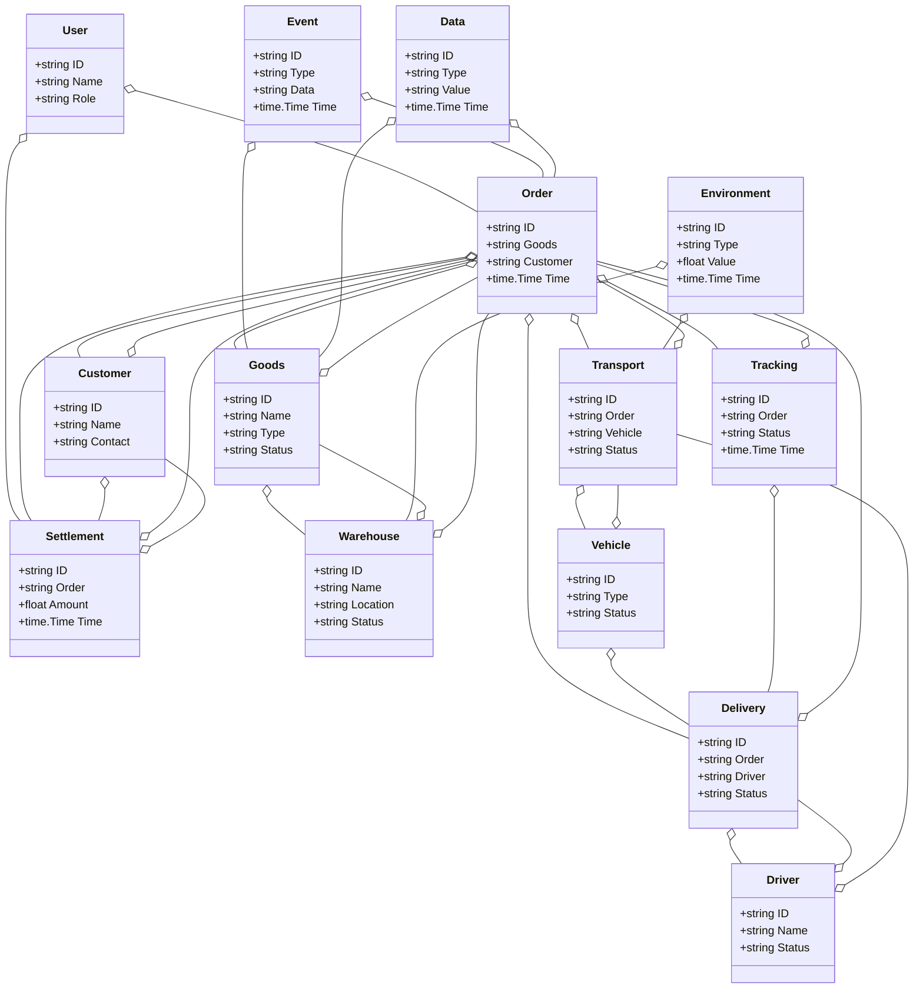
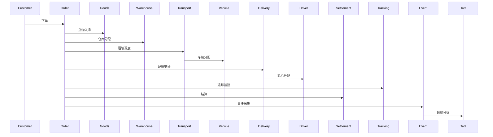
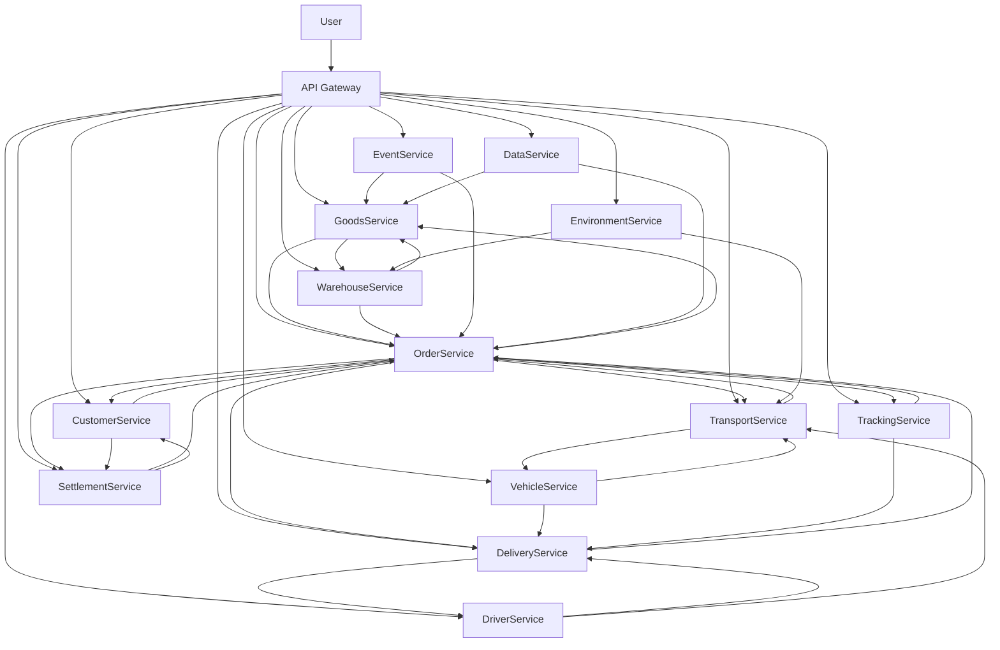

# 物流/智慧物流架构（Golang国际主流实践）

## 1. 目录

- [物流/智慧物流架构（Golang国际主流实践）](#物流智慧物流架构golang国际主流实践)
  - [1. 目录](#1-目录)
  - [2. 物流/智慧物流架构概述](#2-物流智慧物流架构概述)
    - [2.1 国际标准定义](#21-国际标准定义)
    - [2.2 发展历程与核心思想](#22-发展历程与核心思想)
    - [2.3 典型应用场景](#23-典型应用场景)
    - [2.4 与传统物流IT对比](#24-与传统物流it对比)
  - [3. 信息概念架构](#3-信息概念架构)
    - [3.1 领域建模方法](#31-领域建模方法)
    - [3.2 核心实体与关系](#32-核心实体与关系)
      - [3.2.1 UML 类图（Mermaid）](#321-uml-类图mermaid)
    - [3.3 典型数据流](#33-典型数据流)
      - [3.3.1 数据流时序图（Mermaid）](#331-数据流时序图mermaid)
    - [3.4 Golang 领域模型代码示例](#34-golang-领域模型代码示例)
  - [4. 分布式系统挑战](#4-分布式系统挑战)
    - [4.1 弹性与实时性](#41-弹性与实时性)
    - [4.2 数据安全与互操作性](#42-数据安全与互操作性)
    - [4.3 可观测性与智能优化](#43-可观测性与智能优化)
  - [5. 架构设计解决方案](#5-架构设计解决方案)
    - [5.1 服务解耦与标准接口](#51-服务解耦与标准接口)
    - [5.2 智能调度与全链路可视化](#52-智能调度与全链路可视化)
    - [5.3 数据安全与互操作设计](#53-数据安全与互操作设计)
    - [5.4 架构图（Mermaid）](#54-架构图mermaid)
    - [5.5 Golang代码示例](#55-golang代码示例)
  - [6. Golang实现范例](#6-golang实现范例)
    - [6.1 工程结构示例](#61-工程结构示例)
    - [6.2 关键代码片段](#62-关键代码片段)
    - [6.3 CI/CD 配置（GitHub Actions 示例）](#63-cicd-配置github-actions-示例)
  - [7. 形式化建模与证明](#7-形式化建模与证明)
    - [7.1 订单-货物-仓库建模](#71-订单-货物-仓库建模)
      - [7.1.1 性质1：智能调度性](#711-性质1智能调度性)
      - [7.1.2 性质2：数据安全性](#712-性质2数据安全性)
    - [7.2 符号说明](#72-符号说明)
  - [8. 参考与外部链接](#8-参考与外部链接)

---

## 2. 物流/智慧物流架构概述

### 国际标准定义

物流/智慧物流架构是指以全链路可视化、智能调度、弹性协同、数据驱动为核心，支持仓储、运输、配送、订单、追踪、结算等场景的分布式系统架构。

- **国际主流参考**：GS1、ISO 28000、ISO 9001、WCO、UN/CEFACT、FIATA、IATA、Open Logistics Foundation、ISO 19845。

### 发展历程与核心思想

- 2000s：信息化仓储、条码、ERP、TMS、WMS。
- 2010s：电商物流、智能分拣、RFID、全链路追踪、API集成。
- 2020s：AI调度、智慧仓储、全球协同、物流大数据、自动驾驶配送。
- 核心思想：全链路可视化、智能驱动、弹性协同、开放标准、数据赋能。

### 典型应用场景

- 智慧仓储、智能运输、订单追踪、自动分拣、智能配送、物流大数据、全球协同等。

### 与传统物流IT对比

| 维度         | 传统物流IT         | 智慧物流架构           |
|--------------|-------------------|----------------------|
| 服务模式     | 人工、线下         | 智能、自动化          |
| 数据采集     | 手工、离线         | 实时、自动化          |
| 协同         | 单点、割裂         | 多方、弹性、协同      |
| 智能化       | 规则、人工         | AI驱动、智能分析      |
| 适用场景     | 仓储、单一环节     | 全链路、全球协同      |

---

## 3. 信息概念架构

### 领域建模方法

- 采用分层建模（感知层、服务层、平台层、应用层）、UML、ER图。
- 核心实体：货物、订单、仓库、运输、配送、车辆、司机、客户、结算、追踪、事件、用户、数据、环境。

### 核心实体与关系

| 实体    | 属性                        | 关系           |
|---------|-----------------------------|----------------|
| 货物    | ID, Name, Type, Status      | 属于订单/仓库   |
| 订单    | ID, Goods, Customer, Time   | 关联货物/客户   |
| 仓库    | ID, Name, Location, Status  | 关联货物/订单   |
| 运输    | ID, Order, Vehicle, Status  | 关联订单/车辆   |
| 配送    | ID, Order, Driver, Status   | 关联订单/司机   |
| 车辆    | ID, Type, Status            | 关联运输/配送   |
| 司机    | ID, Name, Status            | 关联配送/运输   |
| 客户    | ID, Name, Contact           | 关联订单/结算   |
| 结算    | ID, Order, Amount, Time     | 关联订单/客户   |
| 追踪    | ID, Order, Status, Time     | 关联订单/配送   |
| 事件    | ID, Type, Data, Time        | 关联订单/货物   |
| 用户    | ID, Name, Role              | 管理订单/结算   |
| 数据    | ID, Type, Value, Time       | 关联订单/货物   |
| 环境    | ID, Type, Value, Time       | 关联仓库/运输   |

#### UML 类图（Mermaid）



### 典型数据流

1. 客户下单→货物入库→订单生成→运输调度→配送安排→追踪监控→结算→事件采集→数据分析→智能优化。

#### 数据流时序图（Mermaid）



### Golang 领域模型代码示例

```go
// 货物实体
type Goods struct {
    ID     string
    Name   string
    Type   string
    Status string
}
// 订单实体
type Order struct {
    ID       string
    Goods    string
    Customer string
    Time     time.Time
}
// 仓库实体
type Warehouse struct {
    ID       string
    Name     string
    Location string
    Status   string
}
// 运输实体
type Transport struct {
    ID      string
    Order   string
    Vehicle string
    Status  string
}
// 配送实体
type Delivery struct {
    ID     string
    Order  string
    Driver string
    Status string
}
// 车辆实体
type Vehicle struct {
    ID     string
    Type   string
    Status string
}
// 司机实体
type Driver struct {
    ID     string
    Name   string
    Status string
}
// 客户实体
type Customer struct {
    ID      string
    Name    string
    Contact string
}
// 结算实体
type Settlement struct {
    ID     string
    Order  string
    Amount float64
    Time   time.Time
}
// 追踪实体
type Tracking struct {
    ID     string
    Order  string
    Status string
    Time   time.Time
}
// 用户实体
type User struct {
    ID   string
    Name string
    Role string
}
// 事件实体
type Event struct {
    ID   string
    Type string
    Data string
    Time time.Time
}
// 数据实体
type Data struct {
    ID    string
    Type  string
    Value string
    Time  time.Time
}
// 环境实体
type Environment struct {
    ID    string
    Type  string
    Value float64
    Time  time.Time
}

```

---

## 4. 分布式系统挑战

### 弹性与实时性

- 自动扩缩容、毫秒级响应、负载均衡、容灾备份。
- 国际主流：Kubernetes、Prometheus、云服务、CDN。

### 数据安全与互操作性

- 数据加密、标准协议、互操作、访问控制。
- 国际主流：GS1、OAuth2、OpenID、TLS、UN/CEFACT。

### 可观测性与智能优化

- 全链路追踪、指标采集、AI优化、异常检测。
- 国际主流：OpenTelemetry、Prometheus、AI分析。

---

## 5. 架构设计解决方案

### 服务解耦与标准接口

- 货物、订单、仓库、运输、配送、车辆、司机、客户、结算、追踪、数据等服务解耦，API网关统一入口。
- 采用REST、gRPC、消息队列等协议，支持异步事件驱动。

### 智能调度与全链路可视化

- AI调度、全链路可视化、自动扩缩容、智能分析。
- AI推理、Kubernetes、Prometheus。

### 数据安全与互操作设计

- TLS、OAuth2、数据加密、标准协议、访问审计。

### 架构图（Mermaid）



### Golang代码示例

```go
// 订单数量Prometheus监控
var orderCount = prometheus.NewGauge(prometheus.GaugeOpts{Name: "order_total"})
orderCount.Set(1000000)

```

---

## 6. Golang实现范例

### 工程结构示例

```text
logistics-demo/
├── cmd/
├── internal/
│   ├── goods/
│   ├── order/
│   ├── warehouse/
│   ├── transport/
│   ├── delivery/
│   ├── vehicle/
│   ├── driver/
│   ├── customer/
│   ├── settlement/
│   ├── tracking/
│   ├── event/
│   ├── data/
│   ├── environment/
│   ├── user/
├── api/
├── pkg/
├── configs/
├── scripts/
├── build/
└── README.md

```

### 关键代码片段

// 见4.5

### CI/CD 配置（GitHub Actions 示例）

```yaml
name: Go CI
on:
  push:
    branches: [ main ]
jobs:
  build:
    runs-on: ubuntu-latest
    steps:
      - uses: actions/checkout@v3
      - name: Set up Go
        uses: actions/setup-go@v4
        with:
          go-version: '1.21'
      - name: Build
        run: go build ./...
      - name: Test
        run: go test ./...

```

---

## 7. 形式化建模与证明

### 订单-货物-仓库建模

- 订单集合 $O = \{o_1, ..., o_n\}$，货物集合 $G = \{g_1, ..., g_m\}$，仓库集合 $W = \{w_1, ..., w_l\}$。
- 调度函数 $f: (o, g, w) \rightarrow s$，追踪函数 $t: (o, d) \rightarrow tr$。

#### 性质1：智能调度性

- 所有订单 $o$ 与货物 $g$，其仓库 $w$ 能智能调度。

#### 性质2：数据安全性

- 所有数据 $a$ 满足安全策略 $p$，即 $\forall a, \exists p, p(a) = true$。

### 符号说明

- $O$：订单集合
- $G$：货物集合
- $W$：仓库集合
- $A$：数据集合
- $P$：安全策略集合
- $f$：调度函数
- $t$：追踪函数

---

## 8. 参考与外部链接

- [GS1](https://www.gs1.org/)
- [ISO 28000](https://www.iso.org/standard/44641.html)
- [ISO 9001](https://www.iso.org/iso-9001-quality-management.html)
- [WCO](https://www.wcoomd.org/)
- [UN/CEFACT](https://unece.org/uncefact)
- [FIATA](https://fiata.org/)
- [IATA](https://www.iata.org/)
- [Open Logistics Foundation](https://openlogisticsfoundation.org/)
- [ISO 19845](https://www.iso.org/standard/66370.html)
- [Prometheus](https://prometheus.io/)
- [OpenTelemetry](https://opentelemetry.io/)

---

**文档维护者**: Go Documentation Team  
**最后更新**: 2025年10月20日  
**文档状态**: 完成  
**适用版本**: Go 1.21+
