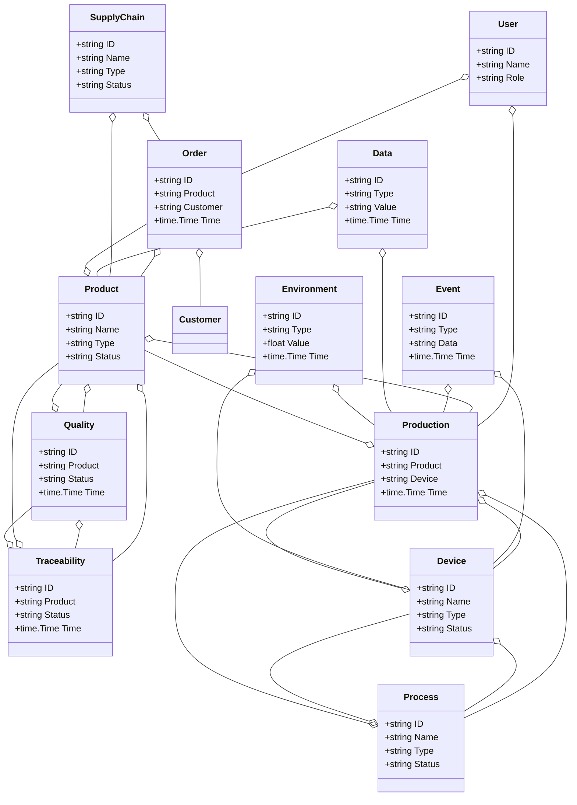
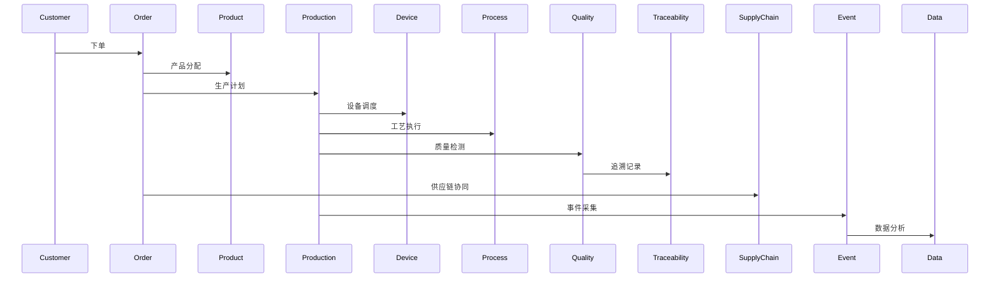
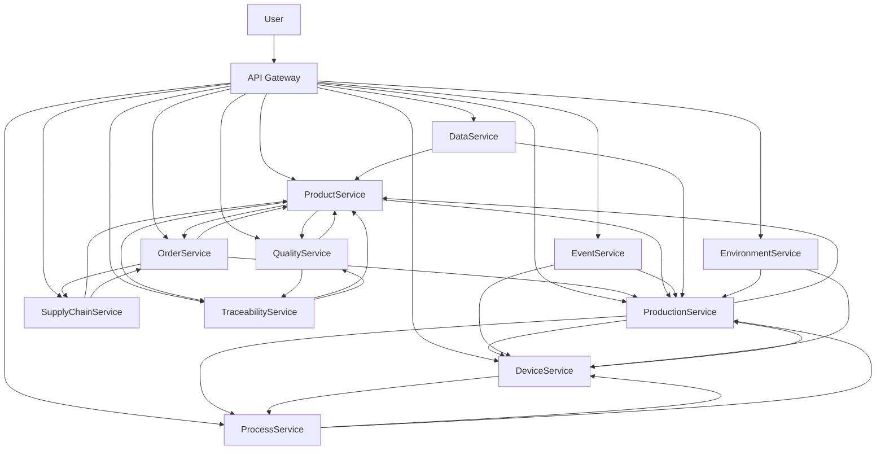

# 制造业/智能制造架构（Golang国际主流实践）

## 1. 目录

---

## 2. 制造业/智能制造架构概述

### 国际标准定义

制造业/智能制造架构是指以智能工厂、弹性生产、数据驱动、全流程协同为核心，支持生产、设备、订单、供应链、质量、追溯等场景的分布式系统架构。

- **国际主流参考**：ISO 22400、IEC 62264、ISA-95、RAMI 4.0、IIC、OPC UA、ISO 9001、ISO 14001、ISO 10303、MTConnect。

### 发展历程与核心思想

- 2000s：ERP、MES、自动化、信息化工厂。
- 2010s：智能制造、工业物联网、数据集成、柔性生产。
- 2020s：工业4.0、数字孪生、AI优化、全球协同、智能工厂。
- 核心思想：智能工厂、弹性生产、数据驱动、全流程协同、开放标准。

### 典型应用场景

- 智能工厂、柔性生产、设备互联、供应链协同、质量追溯、工业大数据、数字孪生等。

### 与传统制造IT对比

| 维度         | 传统制造IT         | 智能制造架构           |
|--------------|-------------------|----------------------|
| 服务模式     | 人工、线下         | 智能、自动化          |
| 数据采集     | 手工、离线         | 实时、自动化          |
| 协同         | 单点、割裂         | 多方、弹性、协同      |
| 智能化       | 规则、人工         | AI驱动、智能分析      |
| 适用场景     | 生产、单一环节     | 全流程、全球协同      |

---

## 3. 信息概念架构

### 领域建模方法

- 采用分层建模（感知层、服务层、平台层、应用层）、UML、ER图。
- 核心实体：产品、订单、设备、工艺、生产、供应链、质量、追溯、事件、用户、数据、环境。

### 核心实体与关系

| 实体    | 属性                        | 关系           |
|---------|-----------------------------|----------------|
| 产品    | ID, Name, Type, Status      | 属于订单/生产   |
| 订单    | ID, Product, Customer, Time | 关联产品/客户   |
| 设备    | ID, Name, Type, Status      | 关联生产/工艺   |
| 工艺    | ID, Name, Type, Status      | 关联设备/生产   |
| 生产    | ID, Product, Device, Time   | 关联产品/设备   |
| 供应链  | ID, Name, Type, Status      | 关联产品/订单   |
| 质量    | ID, Product, Status, Time   | 关联产品/追溯   |
| 追溯    | ID, Product, Status, Time   | 关联产品/质量   |
| 事件    | ID, Type, Data, Time        | 关联生产/设备   |
| 用户    | ID, Name, Role              | 管理订单/生产   |
| 数据    | ID, Type, Value, Time       | 关联产品/生产   |
| 环境    | ID, Type, Value, Time       | 关联设备/生产   |

#### UML 类图（Mermaid）



### 典型数据流

1. 客户下单→产品生产→设备调度→工艺执行→质量检测→追溯记录→供应链协同→事件采集→数据分析→智能优化。

#### 数据流时序图（Mermaid）



### Golang 领域模型代码示例

```go
// 产品实体
type Product struct {
    ID     string
    Name   string
    Type   string
    Status string
}
// 订单实体
type Order struct {
    ID       string
    Product  string
    Customer string
    Time     time.Time
}
// 设备实体
type Device struct {
    ID     string
    Name   string
    Type   string
    Status string
}
// 工艺实体
type Process struct {
    ID     string
    Name   string
    Type   string
    Status string
}
// 生产实体
type Production struct {
    ID      string
    Product string
    Device  string
    Time    time.Time
}
// 供应链实体
type SupplyChain struct {
    ID     string
    Name   string
    Type   string
    Status string
}
// 质量实体
type Quality struct {
    ID      string
    Product string
    Status  string
    Time    time.Time
}
// 追溯实体
type Traceability struct {
    ID      string
    Product string
    Status  string
    Time    time.Time
}
// 用户实体
type User struct {
    ID   string
    Name string
    Role string
}
// 事件实体
type Event struct {
    ID   string
    Type string
    Data string
    Time time.Time
}
// 数据实体
type Data struct {
    ID    string
    Type  string
    Value string
    Time  time.Time
}
// 环境实体
type Environment struct {
    ID    string
    Type  string
    Value float64
    Time  time.Time
}

```

---

## 4. 分布式系统挑战

### 弹性与实时性

- 自动扩缩容、毫秒级响应、负载均衡、容灾备份。
- 国际主流：Kubernetes、Prometheus、云服务、CDN。

### 数据安全与互操作性

- 数据加密、标准协议、互操作、访问控制。
- 国际主流：OPC UA、OAuth2、OpenID、TLS、ISA-95。

### 可观测性与智能优化

- 全链路追踪、指标采集、AI优化、异常检测。
- 国际主流：OpenTelemetry、Prometheus、AI分析。

### 数据安全与合规

- 数据加密、访问控制、合规审计、匿名化。
- 国际主流：TLS、OAuth2、IEC 62443。

---

## 5. 架构设计解决方案

### 服务解耦与标准接口

- 产品、订单、设备、工艺、生产、供应链、质量、追溯、数据等服务解耦，API网关统一入口。
- 采用REST、gRPC、消息队列等协议，支持异步事件驱动。

### 智能工厂与全流程协同

- AI调度、全流程协同、自动扩缩容、智能分析。
- AI推理、Kubernetes、Prometheus。

### 数据安全与互操作设计

- TLS、OAuth2、数据加密、标准协议、访问审计。

### 架构图（Mermaid）



### Golang代码示例

```go
// 产品数量Prometheus监控
var productCount = prometheus.NewGauge(prometheus.GaugeOpts{Name: "product_total"})
productCount.Set(1000000)

```

---

## 6. Golang实现范例

### 工程结构示例

```text
manufacturing-demo/
├── cmd/
├── internal/
│   ├── product/
│   ├── order/
│   ├── device/
│   ├── process/
│   ├── production/
│   ├── supplychain/
│   ├── quality/
│   ├── traceability/
│   ├── event/
│   ├── data/
│   ├── environment/
│   ├── user/
├── api/
├── pkg/
├── configs/
├── scripts/
├── build/
└── README.md

```

### 关键代码片段

// 见4.5

### CI/CD 配置（GitHub Actions 示例）

```yaml
name: Go CI
on:
  push:
    branches: [ main ]
jobs:
  build:
    runs-on: ubuntu-latest
    steps:
      - uses: actions/checkout@v3
      - name: Set up Go
        uses: actions/setup-go@v4
        with:
          go-version: '1.21'
      - name: Build
        run: go build ./...
      - name: Test
        run: go test ./...

```

---

## 7. 形式化建模与证明

### 产品-订单-生产建模

- 产品集合 $P = \{p_1, ..., p_n\}$，订单集合 $O = \{o_1, ..., o_k\}$，生产集合 $PR = \{pr_1, ..., pr_l\}$。
- 调度函数 $f: (p, o, pr) \rightarrow s$，追溯函数 $t: (p, q) \rightarrow tr$。

#### 性质1：智能调度性

- 所有产品 $p$ 与订单 $o$，其生产 $pr$ 能智能调度。

#### 性质2：数据安全性

- 所有数据 $a$ 满足安全策略 $p$，即 $\forall a, \exists p, p(a) = true$。

### 符号说明

- $P$：产品集合
- $O$：订单集合
- $PR$：生产集合
- $A$：数据集合
- $P$：安全策略集合
- $f$：调度函数
- $t$：追溯函数

---

## 8. 参考与外部链接

- [ISO 22400](https://www.iso.org/standard/62264.html)
- [IEC 62264](https://webstore.iec.ch/publication/2649)
- [ISA-95](https://www.isa.org/standards-and-publications/isa-standards/isa-95)
- [RAMI 4.0](https://www.plattform-i40.de/PI40/Navigation/EN/Industrie40/rami40.html)
- [IIC](https://www.iiconsortium.org/)
- [OPC UA](https://opcfoundation.org/)
- [ISO 9001](https://www.iso.org/iso-9001-quality-management.html)
- [ISO 14001](https://www.iso.org/iso-14001-environmental-management.html)
- [ISO 10303](https://www.iso.org/standard/63141.html)
- [MTConnect](https://www.mtconnect.org/)
- [Prometheus](https://prometheus.io/)
- [OpenTelemetry](https://opentelemetry.io/)

---

**文档维护者**: Go Documentation Team  
**最后更新**: 2025年10月20日  
**文档状态**: 完成  
**适用版本**: Go 1.25.3+
