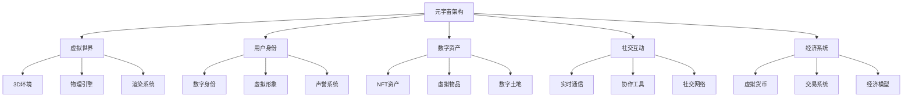
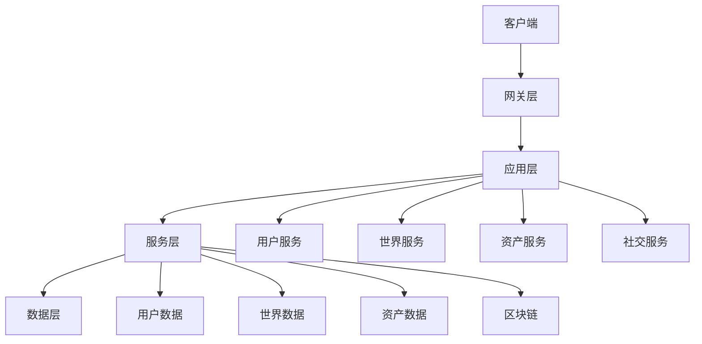
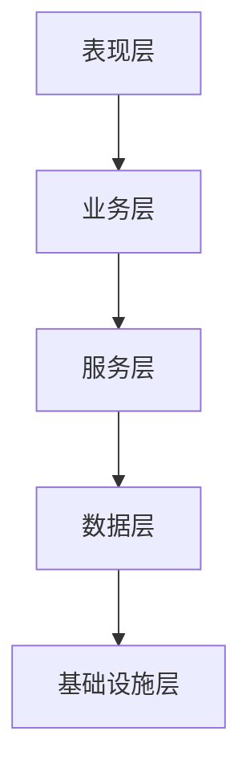

# 元宇宙架构 - Golang实现指南

## 1. 目录

## 2. 概述

### 定义与发展历程

元宇宙（Metaverse）是一个由虚拟现实（VR）、增强现实（AR）、混合现实（MR）等技术构建的数字化虚拟世界，用户可以在其中进行社交、工作、娱乐、学习等活动，实现现实世界与虚拟世界的深度融合。

**发展历程：**

- 1992年：Neal Stephenson在《雪崩》中首次提出"Metaverse"概念
- 2003年：Second Life开创虚拟世界先河
- 2014年：Facebook收购Oculus，VR技术快速发展
- 2021年：Facebook更名为Meta，元宇宙概念爆发
- 2022年后：Web3、区块链、AI技术融合，元宇宙生态逐步完善

### 核心特征



## 3. 元宇宙基础

### 核心技术栈

**显示技术：**

- VR（虚拟现实）：完全沉浸式体验
- AR（增强现实）：叠加虚拟信息到现实世界
- MR（混合现实）：虚拟与现实深度融合
- XR（扩展现实）：统称所有扩展现实技术

**交互技术：**

- 手势识别、眼动追踪、语音识别
- 触觉反馈、力反馈、脑机接口
- 空间定位、动作捕捉、表情识别

**网络技术：**

- 5G/6G低延迟通信
- 边缘计算、CDN加速
- WebRTC实时音视频

### 核心组件

**虚拟世界引擎：**

- Unity3D、Unreal Engine
- 物理引擎、渲染引擎、AI引擎

**用户系统：**

- 身份认证、权限管理
- 虚拟形象、个性化定制

**内容系统：**

- 3D模型、纹理、动画
- 音视频、交互脚本

**经济系统：**

- 虚拟货币、NFT、智能合约
- 交易平台、支付系统

### 典型应用场景

**娱乐游戏：**

- 虚拟游戏世界
- 社交娱乐平台
- 虚拟演唱会、展览

**工作协作：**

- 虚拟办公空间
- 远程会议、培训
- 3D设计协作

**教育学习：**

- 虚拟课堂
- 沉浸式学习体验
- 技能培训模拟

**商业应用：**

- 虚拟购物体验
- 数字营销、广告
- 虚拟房地产

## 4. 国际标准与主流框架

### 国际标准

**Khronos Group标准：**

- OpenXR：跨平台XR标准
- glTF：3D资产传输格式
- Vulkan：图形API标准

**W3C标准：**

- WebXR Device API：Web端XR标准
- WebAssembly：高性能Web执行环境

**IEEE标准：**

- IEEE 2888：数字孪生标准
- IEEE 1858：元宇宙标准工作组

### 主流开源框架

**3D引擎：**

- Unity3D：跨平台游戏引擎
- Unreal Engine：高质量3D渲染引擎
- Godot：开源游戏引擎
- Three.js：Web端3D库

**XR框架：**

- OpenXR：跨平台XR API
- WebXR：Web端XR标准
- ARCore：Android AR框架
- ARKit：iOS AR框架

**区块链平台：**

- Ethereum：智能合约平台
- Polygon：Layer2扩展方案
- Solana：高性能区块链
- Flow：NFT专用区块链

### 商业平台

**VR/AR平台：**

- Meta Quest：VR头显平台
- Microsoft HoloLens：AR头显
- Apple Vision Pro：混合现实设备

**元宇宙平台：**

- Decentraland：去中心化虚拟世界
- The Sandbox：游戏化虚拟世界
- Roblox：用户生成内容平台
- VRChat：社交VR平台

---

- 后续将补充领域建模、分布式挑战、设计方案、Golang实现、形式化建模等内容。*

## 5. 领域建模

### 核心实体

```go
// 虚拟世界
type VirtualWorld struct {
    ID          string
    Name        string
    Environment Environment3D
    Physics     PhysicsEngine
    Renderer    RenderEngine
    Users       map[string]*User
    Assets      map[string]*DigitalAsset
}

// 用户身份
type User struct {
    ID           string
    Username     string
    Avatar       VirtualAvatar
    Identity     DigitalIdentity
    Wallet       DigitalWallet
    Reputation   ReputationSystem
    Location     Location3D
}

// 数字资产
type DigitalAsset struct {
    ID          string
    Type        AssetType
    Owner       string
    Metadata    map[string]interface{}
    NFT         *NFTToken
    Properties  AssetProperties
}

// 虚拟形象
type VirtualAvatar struct {
    ID          string
    Model       AvatarModel
    Animations  []Animation
    Customization map[string]interface{}
    Equipment   []Equipment
}

```

### 系统架构



## 6. 分布式挑战

### 实时性要求

- 低延迟交互（<20ms）
- 高并发用户支持
- 实时同步与状态一致性

### 大规模数据处理

- 3D模型、纹理、音视频数据
- 用户行为数据、交易数据
- 分布式存储与CDN加速

### 跨平台兼容性

- VR/AR设备多样性
- 不同操作系统支持
- Web、移动、桌面端统一

### 安全与隐私

- 用户身份安全
- 数字资产保护
- 隐私数据保护

### 经济系统

- 虚拟货币稳定性
- 智能合约安全性
- 交易系统可靠性

## 7. 设计解决方案

### 分层架构设计



### 实时通信架构

- WebRTC点对点通信
- WebSocket长连接
- 消息队列异步处理

### 分布式渲染

- 客户端渲染为主
- 服务端辅助渲染
- 边缘节点渲染加速

### 区块链集成

- 数字资产上链
- 智能合约管理
- 跨链互操作性

## 8. Golang实现

### 用户系统

```go
// 用户管理器
type UserManager struct {
    users    map[string]*User
    sessions map[string]*Session
    mu       sync.RWMutex
}

// 用户会话
type Session struct {
    ID        string
    UserID    string
    StartTime time.Time
    Location  Location3D
    Status    SessionStatus
}

// 用户认证
func (um *UserManager) AuthenticateUser(credentials UserCredentials) (*User, error) {
    // 验证用户凭据
    user, err := um.validateCredentials(credentials)
    if err != nil {
        return nil, err
    }
    
    // 创建会话
    session := &Session{
        ID:        generateSessionID(),
        UserID:    user.ID,
        StartTime: time.Now(),
        Status:    SessionActive,
    }
    
    um.mu.Lock()
    um.sessions[session.ID] = session
    um.mu.Unlock()
    
    return user, nil
}

// 用户位置更新
func (um *UserManager) UpdateUserLocation(userID string, location Location3D) error {
    um.mu.Lock()
    defer um.mu.Unlock()
    
    if user, exists := um.users[userID]; exists {
        user.Location = location
        return nil
    }
    
    return fmt.Errorf("user %s not found", userID)
}

```

### 虚拟世界管理

```go
// 世界管理器
type WorldManager struct {
    worlds map[string]*VirtualWorld
    physics PhysicsEngine
    renderer RenderEngine
    mu      sync.RWMutex
}

// 物理引擎接口
type PhysicsEngine interface {
    Update(deltaTime float64)
    AddObject(obj PhysicsObject)
    RemoveObject(objID string)
    GetCollisions() []Collision
}

// 渲染引擎接口
type RenderEngine interface {
    Render(scene Scene)
    AddObject(obj RenderObject)
    RemoveObject(objID string)
    SetCamera(camera Camera)
}

// 世界更新
func (wm *WorldManager) UpdateWorld(worldID string, deltaTime float64) error {
    wm.mu.RLock()
    world, exists := wm.worlds[worldID]
    wm.mu.RUnlock()
    
    if !exists {
        return fmt.Errorf("world %s not found", worldID)
    }
    
    // 更新物理
    wm.physics.Update(deltaTime)
    
    // 更新渲染
    scene := wm.buildScene(world)
    wm.renderer.Render(scene)
    
    return nil
}

```

### 数字资产管理

```go
// 资产管理器
type AssetManager struct {
    assets map[string]*DigitalAsset
    nft    NFTService
    storage AssetStorage
    mu     sync.RWMutex
}

// NFT服务接口
type NFTService interface {
    MintNFT(asset *DigitalAsset) (*NFTToken, error)
    TransferNFT(tokenID string, from, to string) error
    GetNFTMetadata(tokenID string) (*NFTMetadata, error)
}

// 资产存储接口
type AssetStorage interface {
    StoreAsset(asset *DigitalAsset) error
    RetrieveAsset(assetID string) (*DigitalAsset, error)
    DeleteAsset(assetID string) error
}

// 创建数字资产
func (am *AssetManager) CreateAsset(assetType AssetType, owner string, metadata map[string]interface{}) (*DigitalAsset, error) {
    asset := &DigitalAsset{
        ID:       generateAssetID(),
        Type:     assetType,
        Owner:    owner,
        Metadata: metadata,
        Properties: AssetProperties{},
    }
    
    // 存储资产
    if err := am.storage.StoreAsset(asset); err != nil {
        return nil, err
    }
    
    // 铸造NFT
    nft, err := am.nft.MintNFT(asset)
    if err != nil {
        return nil, err
    }
    
    asset.NFT = nft
    
    am.mu.Lock()
    am.assets[asset.ID] = asset
    am.mu.Unlock()
    
    return asset, nil
}

```

### 实时通信系统

```go
// 通信管理器
type CommunicationManager struct {
    connections map[string]*Connection
    rooms       map[string]*Room
    webrtc      WebRTCService
    mu          sync.RWMutex
}

// WebRTC服务接口
type WebRTCService interface {
    CreateConnection(userID string) (*Connection, error)
    SendMessage(connID string, message []byte) error
    CloseConnection(connID string) error
}

// 房间管理
type Room struct {
    ID       string
    Users    map[string]*User
    Messages []Message
    Type     RoomType
}

// 加入房间
func (cm *CommunicationManager) JoinRoom(userID, roomID string) error {
    cm.mu.Lock()
    defer cm.mu.Unlock()
    
    room, exists := cm.rooms[roomID]
    if !exists {
        room = &Room{
            ID:    roomID,
            Users: make(map[string]*User),
            Type:  RoomTypePublic,
        }
        cm.rooms[roomID] = room
    }
    
    if user, exists := cm.connections[userID]; exists {
        room.Users[userID] = user.User
        return nil
    }
    
    return fmt.Errorf("user %s not connected", userID)
}

```

## 9. 形式化建模

### 元宇宙系统形式化

- 用户集合 U = {u1, u2, ..., un}
- 虚拟世界集合 W = {w1, w2, ..., wm}
- 数字资产集合 A = {a1, a2, ..., ak}
- 交互关系 I: U × W × A → R

### 实时性保证

- 延迟约束：L ≤ 20ms
- 吞吐量约束：T ≥ 1000 req/s
- 一致性约束：最终一致性

### 经济系统建模

- 货币供应：M = f(P, V, T)
- 价格模型：P = D/S
- 交易验证：V = H(Tx) mod N

## 10. 最佳实践

### 架构设计原则

- 模块化设计，松耦合架构
- 实时优先，延迟敏感
- 可扩展性，支持水平扩展

### 性能优化

- 客户端渲染为主
- 服务端辅助计算
- CDN加速静态资源

### 安全设计

- 端到端加密
- 身份验证与授权
- 数字资产保护

### 用户体验

- 低延迟交互
- 流畅的动画效果
- 直观的操作界面

## 11. 参考资源

### 标准与规范

- OpenXR: <https://www.khronos.org/openxr/>
- WebXR: <https://www.w3.org/TR/webxr/>
- glTF: <https://www.khronos.org/gltf/>

### 开源项目

- Unity3D: <https://unity.com/>
- Unreal Engine: <https://www.unrealengine.com/>
- Three.js: <https://threejs.org/>

### 区块链平台

- Ethereum: <https://ethereum.org/>
- Polygon: <https://polygon.technology/>
- Solana: <https://solana.com/>

### 商业平台

- Meta Quest: <https://www.meta.com/quest/>
- Decentraland: <https://decentraland.org/>
- The Sandbox: <https://www.sandbox.game/>

### 书籍与论文

- The Metaverse: And How It Will Revolutionize Everything (Matthew Ball)
- Virtual Reality and Augmented Reality: From Entertainment to Enterprise (IEEE)

---

- 本文档为元宇宙架构的系统性指南，涵盖理论、设计、实现与最佳实践，适用于Golang开发者与架构师。*

---

**文档维护者**: Go Documentation Team  
**最后更新**: 2025年10月20日  
**文档状态**: 完成  
**适用版本**: Go 1.21+
