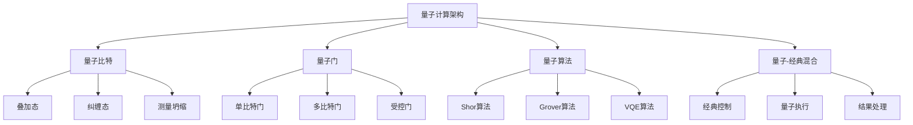
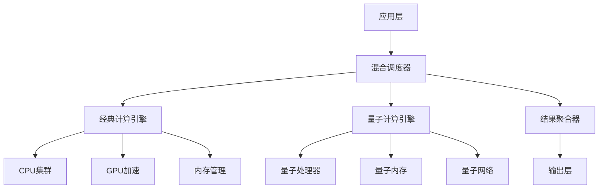

# 量子计算架构 - Golang实现指南

## 1. 目录

## 2. 概述

### 定义与发展历程

量子计算是一种利用量子力学原理进行信息处理的计算范式，具有超越经典计算的潜力。

**发展历程：**

- 1980年代：量子计算理论提出
- 1994年：Shor算法发现
- 2000年代：量子纠错理论发展
- 2010年代：NISQ设备出现
- 2020年代：量子优势实现

### 核心特征



## 3. 量子计算基础

### 量子比特 (Qubit)

量子比特是量子计算的基本单位，可以表示为：

```text
|ψ⟩ = α|0⟩ + β|1⟩

```

其中 |α|² + |β|² = 1

### 量子门操作

**基本量子门：**

- Hadamard门 (H)
- Pauli门 (X, Y, Z)
- CNOT门
- Toffoli门

### 量子算法

**经典量子算法：**

- Shor算法：大数分解
- Grover算法：非结构化搜索
- VQE：变分量子本征求解器

## 4. 国际标准与框架

### 量子编程框架

**主流框架：**

- Qiskit (IBM)
- Cirq (Google)
- Q# (Microsoft)
- PennyLane (Xanadu)

### 量子网络标准

**标准组织：**

- IEEE Quantum Computing Standards
- ITU-T Quantum Information Technology
- ETSI Quantum Key Distribution

### 量子云服务

**云平台：**

- IBM Quantum Experience
- Amazon Braket
- Azure Quantum
- Google Quantum AI

## 5. 领域建模

### 核心实体

```go
// 量子比特
type Qubit struct {
    ID        string
    State     QuantumState
    Position  Position3D
    ErrorRate float64
}

// 量子门
type QuantumGate struct {
    Type      GateType
    Matrix    [][]complex128
    Duration  time.Duration
    ErrorRate float64
}

// 量子电路
type QuantumCircuit struct {
    Qubits    []Qubit
    Gates     []GateOperation
    Depth     int
    Width     int
}

// 量子算法
type QuantumAlgorithm struct {
    Name      string
    Circuit   QuantumCircuit
    Parameters map[string]interface{}
    ClassicalPostProcessor func([]float64) interface{}
}

```

### 量子-经典混合系统

```go
// 混合计算任务
type HybridTask struct {
    ID           string
    QuantumPart  QuantumCircuit
    ClassicalPart ClassicalAlgorithm
    DataFlow     DataFlowGraph
    Orchestrator HybridOrchestrator
}

// 量子-经典接口
type QuantumClassicalInterface struct {
    QuantumBackend  QuantumBackend
    ClassicalBackend ClassicalBackend
    DataConverter   DataConverter
    ResultAggregator ResultAggregator
}

```

## 6. 分布式挑战

### 量子网络挑战

**技术挑战：**

- 量子态传输损耗
- 量子纠缠分发
- 量子中继器技术
- 量子存储同步

**解决方案：**

```go
// 量子网络节点
type QuantumNode struct {
    ID              string
    QuantumMemory   QuantumMemory
    ClassicalMemory ClassicalMemory
    NetworkInterface QuantumNetworkInterface
    RoutingTable    QuantumRoutingTable
}

// 量子中继器
type QuantumRepeater struct {
    ID              string
    EntanglementSource EntanglementSource
    BellStateMeasurement BellStateMeasurement
    ErrorCorrection  QuantumErrorCorrection
}

```

### 量子纠错

**错误类型：**

- 比特翻转错误
- 相位翻转错误
- 退相干错误

**纠错码：**

- 表面码 (Surface Code)
- 稳定子码 (Stabilizer Codes)
- 拓扑码 (Topological Codes)

### 量子资源管理

**资源约束：**

- 量子比特数量限制
- 相干时间限制
- 门操作精度限制

## 7. 设计解决方案

### 量子-经典混合架构



### 量子算法优化

**优化策略：**

- 电路深度优化
- 门数量最小化
- 错误率降低
- 资源利用最大化

### 量子-经典接口设计

```go
// 量子-经典接口实现
type QuantumClassicalBridge struct {
    quantumBackend  QuantumBackend
    classicalBackend ClassicalBackend
    dataConverter   DataConverter
    resultAggregator ResultAggregator
    errorHandler    ErrorHandler
}

func (qcb *QuantumClassicalBridge) ExecuteHybridTask(task HybridTask) (interface{}, error) {
    // 1. 准备量子电路
    quantumCircuit := qcb.prepareQuantumCircuit(task.QuantumPart)
    
    // 2. 执行量子计算
    quantumResult, err := qcb.quantumBackend.Execute(quantumCircuit)
    if err != nil {
        return nil, fmt.Errorf("quantum execution failed: %w", err)
    }
    
    // 3. 经典后处理
    classicalResult, err := qcb.classicalBackend.Process(quantumResult)
    if err != nil {
        return nil, fmt.Errorf("classical processing failed: %w", err)
    }
    
    // 4. 结果聚合
    finalResult := qcb.resultAggregator.Aggregate(quantumResult, classicalResult)
    
    return finalResult, nil
}

```

## 8. Golang实现

### 量子模拟器

```go
package quantum

import (
    "math/cmplx"
    "sync"
)

// 量子态表示
type QuantumState struct {
    Amplitudes []complex128
    NumQubits  int
    mu         sync.RWMutex
}

// 创建量子态
func NewQuantumState(numQubits int) *QuantumState {
    size := 1 << numQubits
    return &QuantumState{
        Amplitudes: make([]complex128, size),
        NumQubits:  numQubits,
    }
}

// 初始化量子态
func (qs *QuantumState) Initialize(state int) {
    qs.mu.Lock()
    defer qs.mu.Unlock()
    
    for i := range qs.Amplitudes {
        if i == state {
            qs.Amplitudes[i] = 1.0
        } else {
            qs.Amplitudes[i] = 0.0
        }
    }
}

// 应用量子门
func (qs *QuantumState) ApplyGate(gate QuantumGate, targetQubits []int) error {
    qs.mu.Lock()
    defer qs.mu.Unlock()
    
    // 实现量子门操作
    newAmplitudes := make([]complex128, len(qs.Amplitudes))
    
    for i := range qs.Amplitudes {
        newAmplitudes[i] = 0.0
        for j := range qs.Amplitudes {
            matrixElement := qs.getMatrixElement(gate, i, j, targetQubits)
            newAmplitudes[i] += matrixElement * qs.Amplitudes[j]
        }
    }
    
    qs.Amplitudes = newAmplitudes
    return nil
}

// 测量量子态
func (qs *QuantumState) Measure() (int, float64) {
    qs.mu.RLock()
    defer qs.mu.RUnlock()
    
    // 计算测量概率
    probabilities := make([]float64, len(qs.Amplitudes))
    for i, amp := range qs.Amplitudes {
        probabilities[i] = cmplx.Abs(amp) * cmplx.Abs(amp)
    }
    
    // 模拟测量过程
    measuredState := qs.simulateMeasurement(probabilities)
    return measuredState, probabilities[measuredState]
}

```

### 量子算法实现

```go
// Grover算法实现
type GroverAlgorithm struct {
    numQubits int
    oracle    OracleFunction
    iterations int
}

func NewGroverAlgorithm(numQubits int, oracle OracleFunction) *GroverAlgorithm {
    return &GroverAlgorithm{
        numQubits:  numQubits,
        oracle:     oracle,
        iterations: int(math.Sqrt(float64(1 << numQubits))),
    }
}

func (ga *GroverAlgorithm) Execute() (int, error) {
    // 1. 初始化叠加态
    state := NewQuantumState(ga.numQubits)
    state.InitializeSuperposition()
    
    // 2. 应用Grover迭代
    for i := 0; i < ga.iterations; i++ {
        // Oracle操作
        if err := ga.applyOracle(state); err != nil {
            return 0, err
        }
        
        // 扩散操作
        if err := ga.applyDiffusion(state); err != nil {
            return 0, err
        }
    }
    
    // 3. 测量结果
    result, _ := state.Measure()
    return result, nil
}

// VQE算法实现
type VQEAlgorithm struct {
    hamiltonian QuantumHamiltonian
    ansatz      QuantumCircuit
    optimizer   ClassicalOptimizer
}

func (vqe *VQEAlgorithm) Execute() (float64, []float64, error) {
    // 1. 初始化参数
    params := vqe.optimizer.Initialize()
    
    // 2. 优化循环
    for iteration := 0; iteration < vqe.optimizer.MaxIterations(); iteration++ {
        // 计算期望值
        expectation, err := vqe.computeExpectation(params)
        if err != nil {
            return 0, nil, err
        }
        
        // 更新参数
        params, err = vqe.optimizer.Update(params, expectation)
        if err != nil {
            return 0, nil, err
        }
    }
    
    finalEnergy, _ := vqe.computeExpectation(params)
    return finalEnergy, params, nil
}

```

### 量子-经典混合系统

```go
// 混合计算引擎
type HybridComputingEngine struct {
    quantumSimulator  QuantumSimulator
    classicalEngine   ClassicalEngine
    taskScheduler     TaskScheduler
    resultAggregator  ResultAggregator
}

func (hce *HybridComputingEngine) ExecuteHybridTask(task HybridTask) (interface{}, error) {
    // 1. 任务分解
    quantumTasks, classicalTasks := hce.taskScheduler.Decompose(task)
    
    // 2. 并行执行
    var wg sync.WaitGroup
    quantumResults := make(chan interface{}, len(quantumTasks))
    classicalResults := make(chan interface{}, len(classicalTasks))
    
    // 执行量子任务
    for _, qt := range quantumTasks {
        wg.Add(1)
        go func(qt QuantumTask) {
            defer wg.Done()
            result, _ := hce.quantumSimulator.Execute(qt)
            quantumResults <- result
        }(qt)
    }
    
    // 执行经典任务
    for _, ct := range classicalTasks {
        wg.Add(1)
        go func(ct ClassicalTask) {
            defer wg.Done()
            result, _ := hce.classicalEngine.Execute(ct)
            classicalResults <- result
        }(ct)
    }
    
    wg.Wait()
    close(quantumResults)
    close(classicalResults)
    
    // 3. 结果聚合
    finalResult := hce.resultAggregator.Aggregate(quantumResults, classicalResults)
    
    return finalResult, nil
}

```

## 9. 形式化建模

### 量子系统形式化

**量子态空间：**

```text
H = C^2 ⊗ C^2 ⊗ ... ⊗ C^2 (n个量子比特)

```

**量子门操作：**

```text
U: H → H, U†U = UU† = I

```

**测量操作：**

```text
M: H → {0,1}^n × R

```

### 量子算法复杂度

**Grover算法：**

- 时间复杂度：O(√N)
- 空间复杂度：O(log N)
- 查询复杂度：O(√N)

**Shor算法：**

- 时间复杂度：O((log N)³)
- 空间复杂度：O(log N)
- 量子比特数：O(log N)

### 量子纠错理论

**表面码：**

- 逻辑错误率：p_L = O(p²)
- 码距：d
- 物理量子比特数：O(d²)

## 10. 最佳实践

### 量子算法设计

**设计原则：**

- 最小化电路深度
- 优化量子比特使用
- 考虑噪声影响
- 实现错误缓解

### 量子-经典混合优化

**优化策略：**

- 任务分解优化
- 资源分配优化
- 通信开销最小化
- 错误处理机制

### 量子软件开发

**开发实践：**

- 模块化设计
- 单元测试
- 性能基准测试
- 文档完善

## 11. 参考资源

### 学术资源

- Nielsen, M. A., & Chuang, I. L. (2010). Quantum Computation and Quantum Information
- Preskill, J. (2018). Quantum Computing in the NISQ era and beyond
- Arute, F., et al. (2019). Quantum supremacy using a programmable superconducting processor

### 技术标准

- IEEE Quantum Computing Standards
- ITU-T Quantum Information Technology
- ETSI Quantum Key Distribution

### 开源项目

- Qiskit: <https://qiskit.org/>
- Cirq: <https://quantumai.google/cirq>
- PennyLane: <https://pennylane.ai/>

### 云平台

- IBM Quantum Experience
- Amazon Braket
- Azure Quantum
- Google Quantum AI

---

- 本文档提供了量子计算架构的全面指南，包括理论基础、实现方法和最佳实践。通过Golang实现，展示了量子-经典混合系统的构建方法。*

---

**文档维护者**: Go Documentation Team  
**最后更新**: 2025年10月20日  
**文档状态**: 完成  
**适用版本**: Go 1.25.3+
