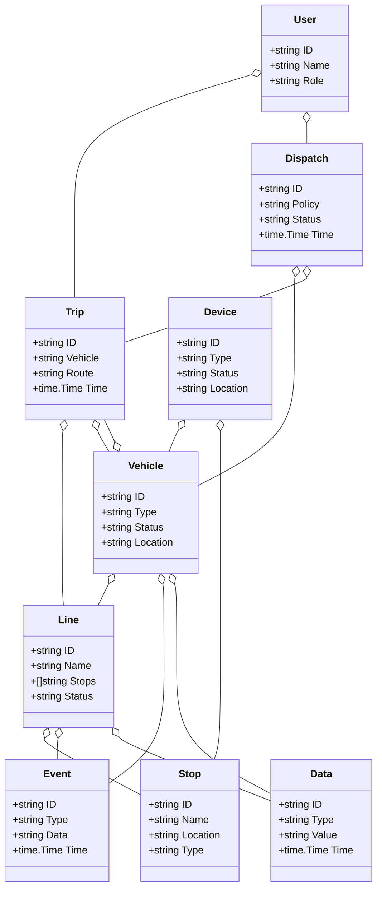
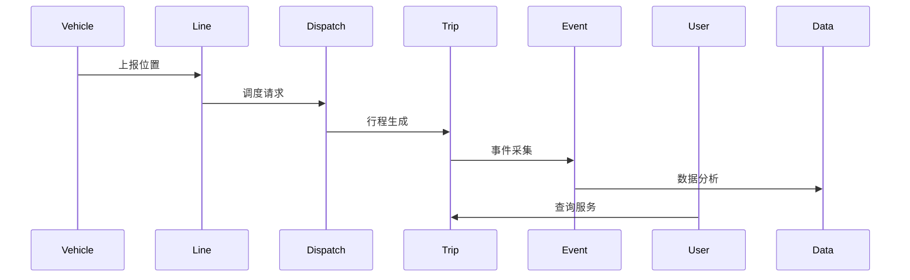
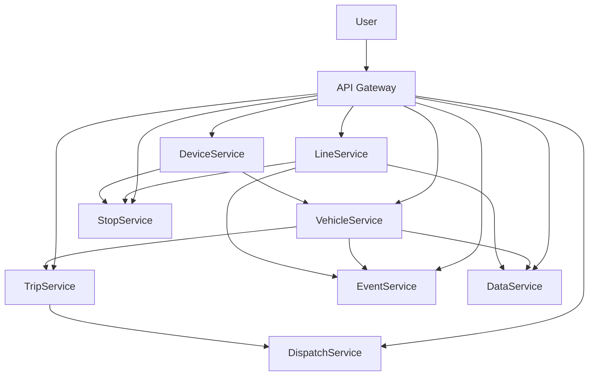

# 交通/智慧出行架构（Golang国际主流实践）

## 1. 目录

---

## 2. 交通/智慧出行架构概述

### 国际标准定义

交通/智慧出行架构是指以多模式交通、实时调度、智能感知、弹性协同为核心，支持交通流优化、智能出行、数据互通的分布式系统架构。

- **国际主流参考**：ITS（Intelligent Transportation Systems）、ISO 14813、MaaS、GTFS、C-ITS、Open Mobility Foundation、TOMP-API、NGTP。

### 发展历程与核心思想

- 2000s：交通信号控制、公交IC卡、GPS定位、TMC。
- 2010s：智能交通、车联网、移动出行、数据开放。
- 2020s：MaaS、自动驾驶、智慧交通云、AI调度、绿色出行。
- 核心思想：多模式协同、实时优化、智能感知、开放标准、数据驱动。

### 典型应用场景

- 智慧公交、共享出行、交通信号优化、自动驾驶、交通仿真、绿色出行、交通大数据等。

### 与传统交通IT对比

| 维度         | 传统交通IT         | 智慧交通架构           |
|--------------|-------------------|----------------------|
| 协同能力     | 单一、静态         | 多模式、弹性协同      |
| 实时性       | 分钟级/人工         | 毫秒级、自动调度      |
| 智能化       | 规则、人工         | AI驱动、智能优化      |
| 数据互通     | 孤岛、专有         | 标准化、互联互通      |
| 适用场景     | 公交、地铁         | 多模式、自动驾驶      |

---

## 3. 信息概念架构

### 领域建模方法

- 采用分层建模（感知层、控制层、平台层、应用层）、UML、ER图。
- 核心实体：车辆、线路、站点、行程、调度、事件、用户、数据、设备。

### 核心实体与关系

| 实体    | 属性                        | 关系           |
|---------|-----------------------------|----------------|
| 车辆    | ID, Type, Status, Location  | 关联线路/行程   |
| 线路    | ID, Name, Stops, Status     | 包含站点/车辆   |
| 站点    | ID, Name, Location, Type    | 属于线路       |
| 行程    | ID, Vehicle, Route, Time    | 关联车辆/线路   |
| 调度    | ID, Policy, Status, Time    | 管理车辆/行程   |
| 事件    | ID, Type, Data, Time        | 关联车辆/线路   |
| 用户    | ID, Name, Role              | 管理行程/调度   |
| 数据    | ID, Type, Value, Time       | 关联车辆/线路   |
| 设备    | ID, Type, Status, Location  | 关联车辆/站点   |

#### UML 类图（Mermaid）



### 典型数据流

1. 车辆定位→线路调度→行程生成→事件采集→数据分析→用户服务。

#### 数据流时序图（Mermaid）



### Golang 领域模型代码示例

```go
// 车辆实体
type Vehicle struct {
    ID       string
    Type     string
    Status   string
    Location string
}
// 线路实体
type Line struct {
    ID      string
    Name    string
    Stops   []string
    Status  string
}
// 站点实体
type Stop struct {
    ID       string
    Name     string
    Location string
    Type     string
}
// 行程实体
type Trip struct {
    ID      string
    Vehicle string
    Route   string
    Time    time.Time
}
// 调度实体
type Dispatch struct {
    ID     string
    Policy string
    Status string
    Time   time.Time
}
// 事件实体
type Event struct {
    ID   string
    Type string
    Data string
    Time time.Time
}
// 用户实体
type User struct {
    ID   string
    Name string
    Role string
}
// 数据实体
type Data struct {
    ID    string
    Type  string
    Value string
    Time  time.Time
}
// 设备实体
type Device struct {
    ID       string
    Type     string
    Status   string
    Location string
}

```

---

## 4. 分布式系统挑战

### 实时性与弹性

- 毫秒级响应、自动扩缩容、负载均衡、容灾备份。
- 国际主流：ITS、Kubernetes、Prometheus、云服务。

### 互操作性与多模式协同

- 多协议集成、标准接口、数据互通、设备兼容。
- 国际主流：GTFS、TOMP-API、REST、Open Mobility Foundation。

### 可观测性与智能优化

- 全链路追踪、指标采集、AI调度、异常检测。
- 国际主流：OpenTelemetry、Prometheus、AI分析。

### 数据安全与合规

- 数据加密、访问控制、合规审计、匿名化。
- 国际主流：TLS、OAuth2、ISO 27001。

---

## 5. 架构设计解决方案

### 服务解耦与标准接口

- 车辆、线路、行程、调度、事件、数据等服务解耦，API网关统一入口。
- 采用REST、gRPC、消息队列等协议，支持异步事件驱动。

### 智能调度与多模式协同

- AI调度、多模式出行、自动扩缩容、实时优化。
- AI推理、Kubernetes、Prometheus。

### 数据安全与互操作设计

- TLS、OAuth2、数据加密、标准协议、访问审计。

### 架构图（Mermaid）



### Golang代码示例

```go
// 车辆位置上报示例
// ...
// Prometheus 监控
var vehicleCount = prometheus.NewGauge(prometheus.GaugeOpts{Name: "vehicle_online_total"})
vehicleCount.Set(500)

```

---

## 6. Golang实现范例

### 工程结构示例

```text
transportation-demo/
├── cmd/
├── internal/
│   ├── vehicle/
│   ├── line/
│   ├── stop/
│   ├── trip/
│   ├── dispatch/
│   ├── event/
│   ├── data/
│   ├── device/
├── api/
├── pkg/
├── configs/
├── scripts/
├── build/
└── README.md

```

### 关键代码片段

// 见4.5

### CI/CD 配置（GitHub Actions 示例）

```yaml
name: Go CI
on:
  push:
    branches: [ main ]
jobs:
  build:
    runs-on: ubuntu-latest
    steps:
      - uses: actions/checkout@v3
      - name: Set up Go
        uses: actions/setup-go@v4
        with:
          go-version: '1.21'
      - name: Build
        run: go build ./...
      - name: Test
        run: go test ./...

```

---

## 7. 形式化建模与证明

### 车辆-线路-行程建模

- 车辆集合 $V = \{v_1, ..., v_n\}$，线路集合 $L = \{l_1, ..., l_m\}$，行程集合 $T = \{t_1, ..., t_k\}$。
- 调度函数 $f: (v, l, t) \rightarrow d$，数据采集函数 $g: (v, t) \rightarrow a$。

#### 性质1：弹性调度性

- 所有车辆 $v$ 与线路 $l$，其行程 $t$ 能弹性调度。

#### 性质2：数据安全性

- 所有数据 $a$ 满足安全策略 $p$，即 $\forall a, \exists p, p(a) = true$。

### 符号说明

- $V$：车辆集合
- $L$：线路集合
- $T$：行程集合
- $D$：调度集合
- $A$：数据集合
- $P$：安全策略集合
- $f$：调度函数
- $g$：数据采集函数

---

## 8. 参考与外部链接

- [ITS](https://www.its.dot.gov/)
- [ISO 14813](https://www.iso.org/standard/62944.html)
- [MaaS](https://maas-alliance.eu/)
- [GTFS](https://gtfs.org/)
- [C-ITS](https://www.car-2-car.org/)
- [Open Mobility Foundation](https://www.openmobilityfoundation.org/)
- [TOMP-API](https://github.com/TOMP-WG/TOMP-API)
- [NGTP](https://www.ngtp.org/)
- [Prometheus](https://prometheus.io/)
- [OpenTelemetry](https://opentelemetry.io/)

---

**文档维护者**: Go Documentation Team  
**最后更新**: 2025年10月20日  
**文档状态**: 完成  
**适用版本**: Go 1.21+
