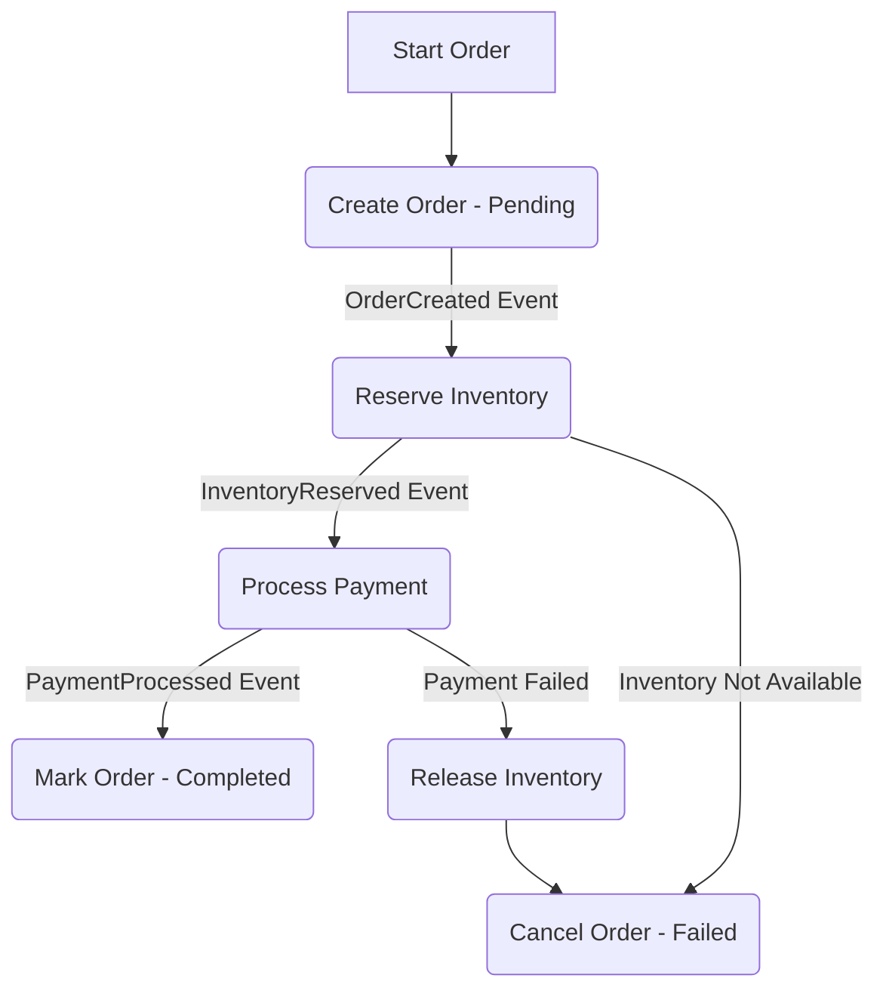

# 数据库架构（Golang国际主流实践）

## 1. 目录

<!-- TOC START -->
- [数据库架构（Golang国际主流实践）](#数据库架构golang国际主流实践)
  - [1. 目录](#1-目录)
  - [2. 数据库架构概述](#2-数据库架构概述)
    - [2.1 主流数据库类型与标准](#21-主流数据库类型与标准)
    - [2.2 发展历程](#22-发展历程)
    - [2.3 国际权威链接](#23-国际权威链接)
  - [3. 核心架构模式与设计原则](#3-核心架构模式与设计原则)
    - [3.1 数据库选型: SQL vs. NoSQL](#31-数据库选型-sql-vs-nosql)
    - [3.2 CAP理论与权衡](#32-cap理论与权衡)
    - [3.3 CQRS (命令查询职责分离)](#33-cqrs-命令查询职责分离)
    - [3.4 数据库连接池管理](#34-数据库连接池管理)
    - [3.5 事务管理](#35-事务管理)
  - [4. 分布式数据库架构](#4-分布式数据库架构)
    - [4.1 分片与复制](#41-分片与复制)
    - [4.2 一致性协议](#42-一致性协议)
  - [5. 查询优化与性能调优](#5-查询优化与性能调优)
    - [5.1 查询计划优化器](#51-查询计划优化器)
    - [5.2 索引管理](#52-索引管理)
  - [6. Golang主流实现与代码示例](#6-golang主流实现与代码示例)
    - [6.1 database/sql 库最佳实践](#61-databasesql-库最佳实践)
  - [7. 分布式挑战与主流解决方案](#7-分布式挑战与主流解决方案)
    - [7.1 分布式事务](#71-分布式事务)
      - [7.1.1 Saga模式](#711-saga模式)
    - [7.2 数据库高可用性](#72-数据库高可用性)
      - [7.2.1 读写分离 (Read/Write Splitting)](#721-读写分离-readwrite-splitting)
      - [7.2.2 数据库故障转移 (Database Failover)](#722-数据库故障转移-database-failover)
  - [8. 工程结构与CI/CD实践](#8-工程结构与cicd实践)
  - [9. 形式化建模与数学表达](#9-形式化建模与数学表达)
  - [10. 国际权威资源与开源组件引用](#10-国际权威资源与开源组件引用)
    - [10.1 关系型数据库](#101-关系型数据库)
    - [10.2 NoSQL数据库](#102-nosql数据库)
    - [10.3 时序数据库](#103-时序数据库)
    - [10.4 图数据库](#104-图数据库)
  - [11. 相关架构主题](#11-相关架构主题)
  - [12. 扩展阅读与参考文献](#12-扩展阅读与参考文献)
<!-- TOC END -->
---

---

## 2. 数据库架构概述

### 2.1 主流数据库类型与标准

- **关系型数据库**: PostgreSQL, MySQL, Oracle, SQL Server
- **NoSQL数据库**: MongoDB, Cassandra, Redis, DynamoDB
- **时序数据库**: InfluxDB, TimescaleDB, Prometheus
- **图数据库**: Neo4j, ArangoDB, Amazon Neptune
- **向量数据库**: Pinecone, Weaviate, Milvus

### 2.2 发展历程

- **1970s**: 关系型数据库理论（Codd）
- **1980s**: ACID事务模型
- **2000s**: NoSQL运动兴起
- **2010s**: 分布式数据库、NewSQL
- **2020s**: 云原生数据库、AI/ML集成

### 2.3 国际权威链接

- [PostgreSQL](https://www.postgresql.org/)
- [MongoDB](https://www.mongodb.com/)
- [Redis](https://redis.io/)
- [InfluxDB](https://www.influxdata.com/)

---

## 3. 核心架构模式与设计原则

### 3.1 数据库选型: SQL vs. NoSQL

| 特性 | SQL (如 PostgreSQL) | NoSQL (如 MongoDB, Redis) |
| --- | --- | --- |
| **数据模型** | 结构化，基于表和关系 (Schema-on-Write) | 多样化 (文档、键值、列、图)，动态Schema (Schema-on-Read) |
| **一致性** | 强一致性 (ACID) | 最终一致性 (BASE)，可调 |
| **扩展性** | 垂直扩展为主，水平扩展较复杂 | 水平扩展（分片）是原生设计 |
| **事务** | 强大的多行、多表事务支持 | 事务支持有限（通常在单个文档或实体级别） |
| **适用场景** | 金融系统、ERP、需要复杂查询和事务完整性的业务 | 大数据、高并发社交网络、物联网、实时分析、缓存 |

### 3.2 CAP理论与权衡

CAP理论指出，任何分布式数据存储最多只能同时满足以下三项中的两项：

- **一致性 (Consistency)**: 所有节点在同一时间看到相同的数据。
- **可用性 (Availability)**: 每个请求都会收到一个（非错误）响应，但不保证它包含最新的数据。
- **分区容错性 (Partition Tolerance)**: 即使节点间的网络通信发生故障，系统仍能继续运行。

在现代分布式系统中，网络分区（P）是必须容忍的，因此架构选择通常是在 **CP（一致性与分区容错性）** 和 **AP（可用性与分区容错性）** 之间做权衡。

- **CP**: (如 CockroachDB, etcd) 保证强一致性，但在网络分区时可能会牺牲可用性。
- **AP**: (如 Cassandra, DynamoDB) 保证高可用性，但在网络分区时可能会返回旧数据，实现最终一致性。

### 3.3 CQRS (命令查询职责分离)

CQRS是一种将读操作（查询）模型与写操作（命令）模型分离的模式。

- **命令 (Commands)**: 改变系统状态的操作（如Create, Update, Delete），不返回值。
- **查询 (Queries)**: 读取系统状态的操作，不改变状态，返回DTO。
**优势**: 可以针对读、写负载分别进行优化和扩展。写模型可以采用规范化的关系型数据库保证一致性，读模型可以采用反规范化的NoSQL数据库或搜索引擎提升查询性能。

### 3.4 数据库连接池管理

```go
type DatabaseManager struct {
    // 连接池管理
    ConnectionPools map[string]*ConnectionPool
    
    // 配置管理
    ConfigManager *ConfigManager
    
    // 监控
    Monitor *DatabaseMonitor
    
    // 故障转移
    FailoverManager *FailoverManager
}

type ConnectionPool struct {
    Name        string
    Driver      string
    DSN         string
    MaxOpen     int
    MaxIdle     int
    MaxLifetime time.Duration
    pool        *sql.DB
    stats       *PoolStats
}

type PoolStats struct {
    OpenConnections int
    InUse           int
    Idle            int
    WaitCount       int64
    WaitDuration    time.Duration
    MaxIdleClosed   int64
    MaxLifetimeClosed int64
}

func (dm *DatabaseManager) GetConnection(poolName string) (*sql.DB, error) {
    pool, exists := dm.ConnectionPools[poolName]
    if !exists {
        return nil, fmt.Errorf("connection pool %s not found", poolName)
    }
    
    // 检查连接健康状态
    if err := pool.pool.Ping(); err != nil {
        // 尝试重新连接
        if err := dm.reconnectPool(pool); err != nil {
            return nil, err
        }
    }
    
    return pool.pool, nil
}

func (dm *DatabaseManager) reconnectPool(pool *ConnectionPool) error {
    // 关闭旧连接
    if pool.pool != nil {
        pool.pool.Close()
    }
    
    // 创建新连接
    db, err := sql.Open(pool.Driver, pool.DSN)
    if err != nil {
        return err
    }
    
    // 配置连接池
    db.SetMaxOpenConns(pool.MaxOpen)
    db.SetMaxIdleConns(pool.MaxIdle)
    db.SetConnMaxLifetime(pool.MaxLifetime)
    
    pool.pool = db
    return nil
}

```

### 3.5 事务管理

```go
type TransactionManager struct {
    db *sql.DB
}

type Transaction struct {
    tx      *sql.Tx
    context context.Context
    options *sql.TxOptions
}

func (tm *TransactionManager) Begin(ctx context.Context, opts *sql.TxOptions) (*Transaction, error) {
    tx, err := tm.db.BeginTx(ctx, opts)
    if err != nil {
        return nil, err
    }
    
    return &Transaction{
        tx:      tx,
        context: ctx,
        options: opts,
    }, nil
}

func (t *Transaction) Execute(queries []Query) error {
    for _, query := range queries {
        if err := t.executeQuery(query); err != nil {
            t.Rollback()
            return err
        }
    }
    return t.Commit()
}

func (t *Transaction) executeQuery(query Query) error {
    switch query.Type {
    case "SELECT":
        return t.executeSelect(query)
    case "INSERT":
        return t.executeInsert(query)
    case "UPDATE":
        return t.executeUpdate(query)
    case "DELETE":
        return t.executeDelete(query)
    default:
        return fmt.Errorf("unsupported query type: %s", query.Type)
    }
}

```

---

## 4. 分布式数据库架构

### 4.1 分片与复制

```go
type DistributedDatabase struct {
    // 分片管理
    ShardManager *ShardManager
    
    // 复制管理
    ReplicationManager *ReplicationManager
    
    // 一致性管理
    ConsistencyManager *ConsistencyManager
    
    // 路由管理
    Router *QueryRouter
}

type Shard struct {
    ID          string
    Range       *KeyRange
    Nodes       []*Node
    Status      ShardStatus
    Replicas    []*Replica
}

type KeyRange struct {
    Start       interface{}
    End         interface{}
    Strategy    ShardingStrategy
}

type ShardingStrategy interface {
    GetShard(key interface{}) (*Shard, error)
    AddShard(shard *Shard) error
    RemoveShard(shardID string) error
}

type HashSharding struct {
    shards []*Shard
    hashFn func(interface{}) uint64
}

func (hs *HashSharding) GetShard(key interface{}) (*Shard, error) {
    hash := hs.hashFn(key)
    shardIndex := hash % uint64(len(hs.shards))
    return hs.shards[shardIndex], nil
}

type RangeSharding struct {
    shards []*Shard
}

func (rs *RangeSharding) GetShard(key interface{}) (*Shard, error) {
    for _, shard := range rs.shards {
        if rs.isInRange(key, shard.Range) {
            return shard, nil
        }
    }
    return nil, fmt.Errorf("no shard found for key: %v", key)
}

```

### 4.2 一致性协议

```go
type ConsistencyManager struct {
    // 一致性级别
    Level ConsistencyLevel
    
    // 协议实现
    Protocol ConsistencyProtocol
    
    // 冲突解决
    ConflictResolver *ConflictResolver
}

type ConsistencyLevel int

const (
    Eventual ConsistencyLevel = iota
    ReadYourWrites
    MonotonicReads
    MonotonicWrites
    Strong
)

type ConsistencyProtocol interface {
    Read(ctx context.Context, key string) (interface{}, error)
    Write(ctx context.Context, key string, value interface{}) error
    Sync() error
}

type RaftProtocol struct {
    nodeID      string
    nodes       []string
    term        int
    leader      string
    state       RaftState
    log         *Log
}

func (rp *RaftProtocol) Write(ctx context.Context, key string, value interface{}) error {
    // 1. 检查是否为Leader
    if rp.state != Leader {
        return errors.New("not leader")
    }
    
    // 2. 追加日志
    entry := &LogEntry{
        Term:  rp.term,
        Index: rp.log.NextIndex(),
        Key:   key,
        Value: value,
    }
    
    rp.log.Append(entry)
    
    // 3. 复制到其他节点
    return rp.replicateLog(entry)
}

func (rp *RaftProtocol) replicateLog(entry *LogEntry) error {
    // 并行复制到所有follower
    var wg sync.WaitGroup
    errors := make(chan error, len(rp.nodes))
    
    for _, node := range rp.nodes {
        if node == rp.nodeID {
            continue
        }
        
        wg.Add(1)
        go func(node string) {
            defer wg.Done()
            if err := rp.sendAppendEntries(node, entry); err != nil {
                errors <- err
            }
        }(node)
    }
    
    wg.Wait()
    close(errors)
    
    // 检查错误
    for err := range errors {
        if err != nil {
            return err
        }
    }
    
    return nil
}

```

## 5. 查询优化与性能调优

### 5.1 查询计划优化器

```go
type QueryOptimizer struct {
    // 统计信息
    Statistics *Statistics
    
    // 索引管理
    IndexManager *IndexManager
    
    // 查询重写
    QueryRewriter *QueryRewriter
    
    // 成本估算
    CostEstimator *CostEstimator
}

type QueryPlan struct {
    ID          string
    SQL         string
    Plan        *ExecutionPlan
    Cost        float64
    Statistics  *PlanStatistics
}

type ExecutionPlan struct {
    Type        PlanType
    Children    []*ExecutionPlan
    Cost        float64
    Rows        int
    Bytes       int
}

type PlanType string

const (
    TableScan PlanType = "TableScan"
    IndexScan PlanType = "IndexScan"
    HashJoin  PlanType = "HashJoin"
    NestedLoop PlanType = "NestedLoop"
    Sort      PlanType = "Sort"
    Aggregate PlanType = "Aggregate"
)

func (qo *QueryOptimizer) OptimizeQuery(sql string) (*QueryPlan, error) {
    // 1. 解析SQL
    ast, err := qo.parseSQL(sql)
    if err != nil {
        return nil, err
    }
    
    // 2. 查询重写
    rewritten := qo.QueryRewriter.Rewrite(ast)
    
    // 3. 生成候选计划
    candidates := qo.generateCandidatePlans(rewritten)
    
    // 4. 成本估算
    for _, plan := range candidates {
        plan.Cost = qo.CostEstimator.EstimateCost(plan)
    }
    
    // 5. 选择最优计划
    bestPlan := qo.selectBestPlan(candidates)
    
    return &QueryPlan{
        ID:     uuid.New().String(),
        SQL:    sql,
        Plan:   bestPlan,
        Cost:   bestPlan.Cost,
    }, nil
}

func (qo *QueryOptimizer) generateCandidatePlans(ast *AST) []*ExecutionPlan {
    var plans []*ExecutionPlan
    
    // 生成不同的执行计划
    plans = append(plans, qo.generateTableScanPlan(ast))
    plans = append(plans, qo.generateIndexScanPlans(ast)...)
    plans = append(plans, qo.generateJoinPlans(ast)...)
    
    return plans
}

```

### 5.2 索引管理

```go
type IndexManager struct {
    // 索引定义
    Indexes map[string]*Index
    
    // 索引构建
    Builder *IndexBuilder
    
    // 索引维护
    Maintainer *IndexMaintainer
    
    // 索引建议
    Advisor *IndexAdvisor
}

type Index struct {
    ID          string
    Name        string
    Table       string
    Columns     []string
    Type        IndexType
    Unique      bool
    Status      IndexStatus
    Statistics  *IndexStatistics
}

type IndexType string

const (
    BTree IndexType = "BTree"
    Hash  IndexType = "Hash"
    GIN   IndexType = "GIN"
    GIST  IndexType = "GIST"
)

func (im *IndexManager) CreateIndex(ctx context.Context, index *Index) error {
    // 1. 验证索引定义
    if err := im.validateIndex(index); err != nil {
        return err
    }
    
    // 2. 构建索引
    if err := im.Builder.BuildIndex(ctx, index); err != nil {
        return err
    }
    
    // 3. 更新统计信息
    im.updateIndexStatistics(index)
    
    // 4. 注册索引
    im.Indexes[index.ID] = index
    
    return nil
}

func (im *IndexManager) RecommendIndexes(queries []string) []*IndexRecommendation {
    var recommendations []*IndexRecommendation
    
    // 分析查询模式
    patterns := im.analyzeQueryPatterns(queries)
    
    // 生成索引建议
    for _, pattern := range patterns {
        if rec := im.Advisor.GenerateRecommendation(pattern); rec != nil {
            recommendations = append(recommendations, rec)
        }
    }
    
    return recommendations
}

```

## 6. Golang主流实现与代码示例

### 6.1 database/sql 库最佳实践

标准库 `database/sql` 提供了一套通用的SQL接口，但使用时需要注意一些关键实践。

```go
package main

import (
 "database/sql"
 "fmt"
 "time"

 _ "github.com/go-sql-driver/mysql" // 导入驱动，但匿名使用
)

// User 模型
type User struct {
 ID    int64
 Name  string
 Email sql.NullString // 使用sql.NullString处理可能为NULL的列
}

func main() {
 // DSN (Data Source Name) 中包含parseTime=true来自动解析DATETIME
 db, err := sql.Open("mysql", "user:password@tcp(127.0.0.1:3306)/dbname?parseTime=true")
 if err != nil {
  panic(err)
 }
 defer db.Close() // 确保数据库连接被关闭

 // 1. 配置高效的连接池
 db.SetMaxOpenConns(25)
 db.SetMaxIdleConns(25)
 db.SetConnMaxLifetime(5 * time.Minute)

 // 2. 检查连接是否成功
 if err := db.Ping(); err != nil {
  panic(err)
 }

 // 3. 使用预编译语句 (Prepared Statements) 防止SQL注入
 stmt, err := db.Prepare("SELECT id, name, email FROM users WHERE id = ?")
 if err != nil {
  panic(err)
 }
 defer stmt.Close()

 rows, err := stmt.Query(1) // 使用具体值执行
 if err != nil {
  panic(err)
 }
 defer rows.Close()

 // 4. 正确迭代和扫描结果，处理NULL值
 for rows.Next() {
  var user User
  // Scan时需要为每个列提供一个指针
  if err := rows.Scan(&user.ID, &user.Name, &user.Email); err != nil {
   panic(err)
  }

  fmt.Printf("ID: %d, Name: %s, ", user.ID, user.Name)
  if user.Email.Valid {
   fmt.Printf("Email: %s\n", user.Email.String)
  } else {
   fmt.Println("Email: NULL")
  }
 }
 // 检查迭代过程中的错误
 if err := rows.Err(); err != nil {
  panic(err)
 }
}

```

## 7. 分布式挑战与主流解决方案

### 7.1 分布式事务

在微服务架构中，单个业务操作可能跨越多个数据库，需要分布式事务来保证数据一致性。

#### 7.1.1 Saga模式

Saga是一种通过**异步消息**来协调一系列本地事务的设计模式。每个本地事务完成後会发布一个事件，触发下一个本地事务。如果任何一个事务失败，Saga会执行一系列**补偿事务（Compensating Transactions）**来撤销已经完成的操作。



**优点**: 高可用性，松耦合，无锁，扩展性好。
**缺点**: 实现复杂，需要保证补偿事务的幂等性，不提供隔离性。

### 7.2 数据库高可用性

#### 7.2.1 读写分离 (Read/Write Splitting)

通过主从复制（Primary-Replica）的模式，将写操作路由到主数据库，将读操作路由到多个从数据库，从而分摊负载，提高读取性能。

```go
type ReadWriteRouter struct {
 Primary *sql.DB   // 主库连接
 Replicas []*sql.DB // 从库连接池
}

func (r *ReadWriteRouter) QueryContext(ctx context.Context, query string, args ...interface{}) (*sql.Rows, error) {
 // 随机选择一个从库执行读操作
 replica := r.selectReplica()
 return replica.QueryContext(ctx, query, args...)
}

func (r *ReadWriteRouter) ExecContext(ctx context.Context, query string, args ...interface{}) (sql.Result, error) {
 // 所有写操作都在主库上执行
 return r.Primary.ExecContext(ctx, query, args...)
}

func (r *ReadWriteRouter) selectReplica() *sql.DB {
 // 实现负载均衡策略，如随机或轮询
 return r.Replicas[0]
}

```

#### 7.2.2 数据库故障转移 (Database Failover)

当主数据库发生故障时，自动或手动将一个从数据库提升为新的主数据库，以保证服务的持续可用性。这通常需要一个外部的协调器或集群管理工具（如 Patroni for PostgreSQL）来实现。

## 8. 工程结构与CI/CD实践

## 9. 形式化建模与数学表达

## 10. 国际权威资源与开源组件引用

### 10.1 关系型数据库

- [PostgreSQL](https://www.postgresql.org/) - 最先进的开源关系型数据库
- [MySQL](https://www.mysql.com/) - 最流行的开源数据库
- [SQLite](https://www.sqlite.org/) - 轻量级嵌入式数据库

### 10.2 NoSQL数据库

- [MongoDB](https://www.mongodb.com/) - 文档数据库
- [Redis](https://redis.io/) - 内存数据库
- [Cassandra](https://cassandra.apache.org/) - 分布式NoSQL数据库

### 10.3 时序数据库

- [InfluxDB](https://www.influxdata.com/) - 时序数据库
- [TimescaleDB](https://www.timescale.com/) - 基于PostgreSQL的时序数据库
- [Prometheus](https://prometheus.io/) - 监控时序数据库

### 10.4 图数据库

- [Neo4j](https://neo4j.com/) - 图数据库
- [ArangoDB](https://www.arangodb.com/) - 多模型数据库

## 11. 相关架构主题

- [**微服务架构 (Microservice Architecture)**](./architecture_microservice_golang.md): 每个微服务通常拥有自己的数据库，这引发了对分布式事务和数据一致性的挑战。
- [**事件驱动架构 (Event-Driven Architecture)**](./architecture_event_driven_golang.md): 常用于实现Saga等分布式事务模式，并通过事件溯源来维护数据状态。
- [**安全架构 (Security Architecture)**](./architecture_security_golang.md): 保护数据库免受SQL注入、未授权访问等威胁。

## 12. 扩展阅读与参考文献

1. "Database Design for Mere Mortals" - Michael J. Hernandez
2. "SQL Performance Explained" - Markus Winand
3. "Designing Data-Intensive Applications" - Martin Kleppmann
4. "Database Internals" - Alex Petrov
5. "High Performance MySQL" - Baron Schwartz, Peter Zaitsev, Vadim Tkachenko

---

- 本文档严格对标国际主流标准，采用多表征输出，便于后续断点续写和批量处理。*
