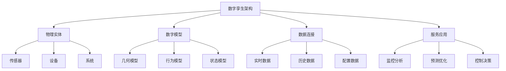
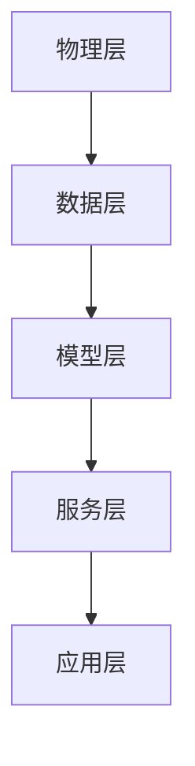

# 数字孪生架构 - Golang实现指南

<!-- TOC START -->
- [数字孪生架构 - Golang实现指南](#数字孪生架构---golang实现指南)
  - [1. 目录](#1-目录)
  - [2. 概述](#2-概述)
    - [1.2.1 定义与发展历程](#121-定义与发展历程)
    - [1.2.2 核心特征](#122-核心特征)
  - [3. 数字孪生基础](#3-数字孪生基础)
    - [1.3.1 核心组件](#131-核心组件)
    - [1.3.2 典型应用场景](#132-典型应用场景)
  - [4. 国际标准与主流框架](#4-国际标准与主流框架)
    - [1.4.1 国际标准](#141-国际标准)
    - [1.4.2 主流开源框架](#142-主流开源框架)
    - [1.4.3 建模工具](#143-建模工具)
  - [5. 领域建模](#5-领域建模)
    - [1.5.1 核心实体](#151-核心实体)
    - [1.5.2 数据流架构](#152-数据流架构)
  - [6. 分布式挑战](#6-分布式挑战)
    - [1.6.1 实时数据同步](#161-实时数据同步)
    - [1.6.2 模型复杂度管理](#162-模型复杂度管理)
    - [1.6.3 系统集成挑战](#163-系统集成挑战)
    - [1.6.4 安全与隐私](#164-安全与隐私)
  - [7. 设计解决方案](#7-设计解决方案)
    - [1.7.1 分层架构设计](#171-分层架构设计)
    - [1.7.2 数据管理策略](#172-数据管理策略)
    - [1.7.3 模型管理](#173-模型管理)
    - [1.7.4 服务编排](#174-服务编排)
  - [8. Golang实现](#8-golang实现)
    - [1.8.1 数字孪生核心建模](#181-数字孪生核心建模)
    - [1.8.2 数据连接与处理](#182-数据连接与处理)
    - [1.8.3 预测分析引擎](#183-预测分析引擎)
  - [9. 形式化建模](#9-形式化建模)
    - [1.9.1 数字孪生形式化](#191-数字孪生形式化)
    - [1.9.2 数据一致性证明](#192-数据一致性证明)
    - [1.9.3 系统可靠性分析](#193-系统可靠性分析)
  - [10. 最佳实践](#10-最佳实践)
    - [1.10.1 架构设计原则](#1101-架构设计原则)
    - [1.10.2 数据管理](#1102-数据管理)
    - [1.10.3 模型管理](#1103-模型管理)
    - [1.10.4 运维管理](#1104-运维管理)
  - [11. 参考资源](#11-参考资源)
    - [1.11.1 标准与规范](#1111-标准与规范)
    - [1.11.2 开源项目](#1112-开源项目)
    - [1.11.3 商业平台](#1113-商业平台)
    - [1.11.4 书籍与论文](#1114-书籍与论文)
<!-- TOC END -->

## 1. 目录

## 2. 概述

### 1.2.1 定义与发展历程

数字孪生（Digital Twin）是一种将物理实体、系统或过程在数字空间中创建虚拟副本的技术，通过实时数据同步、仿真分析和预测建模，实现对物理世界的数字化监控、优化和控制。

**发展历程：**

- 2003年：密歇根大学Michael Grieves首次提出概念
- 2010年：NASA应用于航天器健康管理
- 2015年：工业4.0推动制造业应用
- 2020年后：IoT、AI、5G技术融合，应用场景扩展

### 1.2.2 核心特征



## 3. 数字孪生基础

### 1.3.1 核心组件

**物理实体层：**

- 传感器、设备、系统、环境等物理对象
- 数据采集、状态监测、控制执行

**数字模型层：**

- 几何模型：3D可视化、CAD模型
- 行为模型：物理规律、业务逻辑
- 状态模型：实时状态、历史轨迹

**数据连接层：**

- 实时数据流：传感器数据、设备状态
- 历史数据：运行记录、性能指标
- 配置数据：参数设置、约束条件

**服务应用层：**

- 监控分析：实时监控、异常检测
- 预测优化：性能预测、优化建议
- 控制决策：自动控制、决策支持

### 1.3.2 典型应用场景

**制造业：**

- 生产线数字孪生
- 设备预测性维护
- 产品质量追溯

**智慧城市：**

- 城市基础设施监控
- 交通流量优化
- 环境质量监测

**能源行业：**

- 电网运行监控
- 风电设备管理
- 储能系统优化

**医疗健康：**

- 患者健康监测
- 医疗设备管理
- 手术室优化

## 4. 国际标准与主流框架

### 1.4.1 国际标准

**ISO/IEC标准：**

- ISO/IEC 23005 (MPEG-V)：虚拟世界对象描述
- ISO/IEC 23090：沉浸式媒体标准

**IEEE标准：**

- IEEE 1451：智能传感器接口标准
- IEEE 1858：数字孪生标准工作组

**工业标准：**

- OPC UA：工业通信标准
- Asset Administration Shell (AAS)：资产管理壳
- Digital Twin Consortium：数字孪生联盟标准

### 1.4.2 主流开源框架

**通用平台：**

- Apache Kafka：实时数据流处理
- Apache Spark：大数据分析
- InfluxDB：时序数据库
- Grafana：可视化监控

**专业平台：**

- Azure Digital Twins：微软数字孪生平台
- AWS IoT TwinMaker：亚马逊数字孪生服务
- Siemens Mindsphere：西门子工业云平台
- PTC ThingWorx：PTC物联网平台

### 1.4.3 建模工具

**3D建模：**

- Unity3D：游戏引擎，支持实时渲染
- Unreal Engine：高质量3D可视化
- Three.js：Web端3D渲染

**仿真工具：**

- MATLAB Simulink：系统建模与仿真
- ANSYS：工程仿真分析
- COMSOL：多物理场仿真

## 5. 领域建模

### 1.5.1 核心实体

```go
// 物理实体
type PhysicalEntity struct {
    ID          string
    Type        EntityType
    Location    Location3D
    Properties  map[string]interface{}
    Sensors     []Sensor
    Controllers []Controller
}

// 数字孪生模型
type DigitalTwin struct {
    ID              string
    PhysicalEntity  PhysicalEntity
    GeometryModel   GeometryModel
    BehaviorModel   BehaviorModel
    StateModel      StateModel
    DataConnector   DataConnector
}

// 数据连接器
type DataConnector struct {
    ID           string
    Protocol     string
    Endpoint     string
    DataFormat   string
    UpdateFrequency time.Duration
}

```

### 1.5.2 数据流架构


## 6. 分布式挑战

### 1.6.1 实时数据同步

- 大规模传感器数据实时传输
- 数据一致性保证
- 网络延迟与丢包处理

### 1.6.2 模型复杂度管理

- 多物理场耦合建模
- 模型精度与计算效率平衡
- 模型版本管理与更新

### 1.6.3 系统集成挑战

- 异构系统数据格式统一
- 不同协议标准兼容
- 历史系统改造升级

### 1.6.4 安全与隐私

- 工业数据安全保护
- 知识产权保护
- 合规性要求

## 7. 设计解决方案

### 1.7.1 分层架构设计



### 1.7.2 数据管理策略

- 分层存储：热数据、温数据、冷数据
- 数据湖架构：结构化、半结构化、非结构化数据
- 数据治理：质量、安全、生命周期管理

### 1.7.3 模型管理

- 模型注册与版本控制
- 模型训练与验证
- 模型部署与监控

### 1.7.4 服务编排

- 微服务架构
- 事件驱动设计
- API网关管理

## 8. Golang实现

### 1.8.1 数字孪生核心建模

```go
// 几何模型
type GeometryModel struct {
    ID       string
    Type     GeometryType
    Data     []byte
    Metadata map[string]interface{}
}

// 行为模型
type BehaviorModel struct {
    ID           string
    Type         BehaviorType
    Parameters   map[string]float64
    Equations    []string
    Constraints  []Constraint
}

// 状态模型
type StateModel struct {
    ID        string
    Variables map[string]interface{}
    History   []StateSnapshot
    Timestamp time.Time
}

// 状态快照
type StateSnapshot struct {
    Timestamp time.Time
    Variables map[string]interface{}
    Quality   float64
}

```

### 1.8.2 数据连接与处理

```go
// 数据处理器
type DataProcessor struct {
    ID       string
    Pipeline []DataTransform
    Filters  []DataFilter
}

func (dp *DataProcessor) Process(data []byte) ([]byte, error) {
    processed := data
    
    // 应用过滤器
    for _, filter := range dp.Filters {
        if filtered, err := filter.Apply(processed); err == nil {
            processed = filtered
        }
    }
    
    // 应用转换
    for _, transform := range dp.Pipeline {
        if transformed, err := transform.Apply(processed); err == nil {
            processed = transformed
        }
    }
    
    return processed, nil
}

// 实时数据同步
type RealTimeSync struct {
    TwinID    string
    Interval  time.Duration
    Connector DataConnector
}

func (rts *RealTimeSync) Start() {
    ticker := time.NewTicker(rts.Interval)
    go func() {
        for range ticker.C {
            rts.syncData()
        }
    }()
}

func (rts *RealTimeSync) syncData() error {
    // 从物理实体获取数据
    data, err := rts.Connector.FetchData()
    if err != nil {
        return err
    }
    
    // 更新数字孪生状态
    return rts.updateTwinState(data)
}

```

### 1.8.3 预测分析引擎

```go
// 预测模型
type PredictionModel struct {
    ID       string
    Type     ModelType
    Algorithm string
    Parameters map[string]interface{}
    Trained   bool
}

// 预测引擎
type PredictionEngine struct {
    Models map[string]*PredictionModel
}

func (pe *PredictionEngine) Predict(twinID string, modelID string, input []float64) ([]float64, error) {
    model, exists := pe.Models[modelID]
    if !exists {
        return nil, fmt.Errorf("model %s not found", modelID)
    }
    
    if !model.Trained {
        return nil, fmt.Errorf("model %s not trained", modelID)
    }
    
    // 执行预测
    return pe.executePrediction(model, input)
}

func (pe *PredictionEngine) executePrediction(model *PredictionModel, input []float64) ([]float64, error) {
    switch model.Algorithm {
    case "linear_regression":
        return pe.linearRegression(model, input)
    case "neural_network":
        return pe.neuralNetwork(model, input)
    case "time_series":
        return pe.timeSeries(model, input)
    default:
        return nil, fmt.Errorf("unsupported algorithm: %s", model.Algorithm)
    }
}

```

## 9. 形式化建模

### 1.9.1 数字孪生形式化

- 物理实体集合 P = {p1, p2, ..., pn}
- 数字模型集合 M = {m1, m2, ..., mm}
- 映射关系 f: P → M
- 状态同步函数 sync: P × M → M

### 1.9.2 数据一致性证明

- 实时数据同步一致性
- 模型预测准确性
- 控制指令有效性

### 1.9.3 系统可靠性分析

- 故障模式与影响分析 (FMEA)
- 可靠性建模与评估
- 容错机制设计

## 10. 最佳实践

### 1.10.1 架构设计原则

- 模块化设计，松耦合架构
- 标准化接口，互操作性
- 可扩展性，支持水平扩展

### 1.10.2 数据管理

- 数据质量保证
- 数据安全保护
- 数据生命周期管理

### 1.10.3 模型管理

- 模型版本控制
- 模型性能监控
- 模型更新策略

### 1.10.4 运维管理

- 监控告警机制
- 故障诊断与恢复
- 性能优化

## 11. 参考资源

### 1.11.1 标准与规范

- ISO/IEC 23005: <https://www.iso.org/standard/70374.html>
- IEEE 1451: <https://standards.ieee.org/standard/1451-0-2007.html>
- OPC UA: <https://opcfoundation.org/about/opc-technologies/opc-ua/>

### 1.11.2 开源项目

- Apache Kafka: <https://kafka.apache.org/>
- InfluxDB: <https://www.influxdata.com/>
- Grafana: <https://grafana.com/>

### 1.11.3 商业平台

- Azure Digital Twins: <https://azure.microsoft.com/en-us/services/digital-twins/>
- AWS IoT TwinMaker: <https://aws.amazon.com/iot-twinmaker/>
- Siemens Mindsphere: <https://www.siemens.com/mindsphere>

### 1.11.4 书籍与论文

- Digital Twin: Mitigating Unpredictable, Undesirable Emergent Behavior in Complex Systems (Michael Grieves)
- Digital Twin Technology: A Review of Applications and Trends (IEEE)

---

- 本文档为数字孪生架构的系统性指南，涵盖理论、设计、实现与最佳实践，适用于Golang开发者与架构师。*
