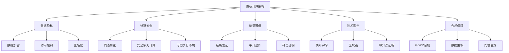
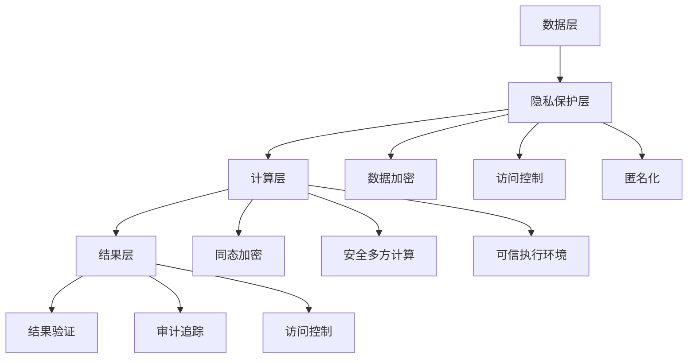
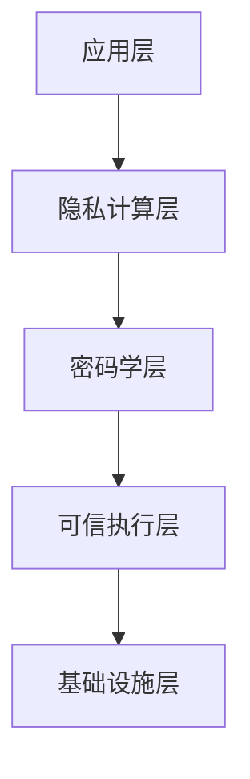

# 隐私计算架构 - Golang实现指南

<!-- TOC START -->
- [隐私计算架构 - Golang实现指南](#隐私计算架构---golang实现指南)
  - [1. 目录](#1-目录)
  - [2. 概述](#2-概述)
    - [1.2.1 定义与发展历程](#121-定义与发展历程)
    - [1.2.2 核心特征](#122-核心特征)
  - [3. 隐私计算基础](#3-隐私计算基础)
    - [1.3.1 核心技术](#131-核心技术)
    - [1.3.2 隐私保护级别](#132-隐私保护级别)
    - [1.3.3 典型应用场景](#133-典型应用场景)
  - [4. 国际标准与主流框架](#4-国际标准与主流框架)
    - [1.4.1 国际标准](#141-国际标准)
    - [1.4.2 主流开源框架](#142-主流开源框架)
    - [1.4.3 商业解决方案](#143-商业解决方案)
  - [5. 领域建模](#5-领域建模)
    - [1.5.1 核心实体](#151-核心实体)
    - [1.5.2 系统架构](#152-系统架构)
  - [6. 分布式挑战](#6-分布式挑战)
    - [1.6.1 性能挑战](#161-性能挑战)
    - [1.6.2 安全性挑战](#162-安全性挑战)
    - [1.6.3 可用性挑战](#163-可用性挑战)
    - [1.6.4 合规性挑战](#164-合规性挑战)
    - [1.6.5 互操作性挑战](#165-互操作性挑战)
  - [7. 设计解决方案](#7-设计解决方案)
    - [1.7.1 分层隐私保护](#171-分层隐私保护)
    - [1.7.2 混合隐私保护](#172-混合隐私保护)
    - [1.7.3 性能优化](#173-性能优化)
    - [1.7.4 合规保障](#174-合规保障)
  - [8. Golang实现](#8-golang实现)
    - [1.8.1 隐私计算引擎](#181-隐私计算引擎)
    - [1.8.2 同态加密实现](#182-同态加密实现)
    - [1.8.3 安全多方计算](#183-安全多方计算)
  - [9. 形式化建模](#9-形式化建模)
    - [1.9.1 隐私计算形式化](#191-隐私计算形式化)
    - [1.9.2 隐私保护分析](#192-隐私保护分析)
    - [1.9.3 性能分析](#193-性能分析)
  - [10. 最佳实践](#10-最佳实践)
    - [1.10.1 架构设计原则](#1101-架构设计原则)
    - [1.10.2 性能优化](#1102-性能优化)
    - [1.10.3 安全加固](#1103-安全加固)
    - [1.10.4 合规保障](#1104-合规保障)
  - [11. 参考资源](#11-参考资源)
    - [1.11.1 标准与规范](#1111-标准与规范)
    - [1.11.2 开源项目](#1112-开源项目)
    - [1.11.3 研究机构](#1113-研究机构)
    - [1.11.4 书籍与论文](#1114-书籍与论文)
<!-- TOC END -->

## 1. 目录

## 2. 概述

### 1.2.1 定义与发展历程

隐私计算（Privacy Computing）是一种在保护数据隐私的前提下实现数据价值挖掘的技术体系，通过密码学、可信执行环境、联邦学习等技术，实现"数据可用不可见"的计算范式。

**发展历程：**

- 1970年代：密码学基础理论发展
- 2000年代：同态加密理论突破
- 2010年代：可信执行环境技术成熟
- 2015年：安全多方计算应用
- 2020年后：隐私计算产业化发展

### 1.2.2 核心特征



## 3. 隐私计算基础

### 1.3.1 核心技术

**密码学技术：**

- 同态加密：支持密文计算
- 安全多方计算：多方协作计算
- 零知识证明：证明而不泄露
- 差分隐私：添加噪声保护

**可信执行环境：**

- Intel SGX：软件防护扩展
- ARM TrustZone：可信执行环境
- AMD SEV：安全加密虚拟化

**联邦学习：**

- 水平联邦学习
- 垂直联邦学习
- 联邦迁移学习

### 1.3.2 隐私保护级别

**数据级别：**

- 原始数据加密
- 数据脱敏处理
- 数据匿名化

**计算级别：**

- 密文计算
- 安全多方计算
- 可信执行环境

**结果级别：**

- 结果差分隐私
- 结果访问控制
- 结果审计追踪

### 1.3.3 典型应用场景

**金融行业：**

- 反欺诈风控
- 联合建模
- 黑名单共享

**医疗健康：**

- 医疗数据共享
- 药物研发
- 疾病预测

**政务领域：**

- 数据开放共享
- 跨部门协作
- 智慧城市建设

**企业应用：**

- 数据合作营销
- 供应链优化
- 客户画像分析

## 4. 国际标准与主流框架

### 1.4.1 国际标准

**隐私保护标准：**

- GDPR：欧盟通用数据保护条例
- CCPA：加州消费者隐私法案
- ISO/IEC 27001：信息安全管理
- ISO/IEC 29100：隐私保护框架

**技术标准：**

- IEEE P2842：隐私保护机器学习
- ISO/IEC 23053：联邦学习框架
- W3C PROV：数据溯源标准

**行业标准：**

- FATE：微众银行隐私计算标准
- OpenMined：开源隐私保护标准
- MPC Alliance：安全多方计算联盟

### 1.4.2 主流开源框架

**密码学框架：**

- SEAL：微软同态加密库
- TenSEAL：同态加密Python库
- MP-SPDZ：安全多方计算框架
- CrypTen：Facebook加密计算

**联邦学习框架：**

- TensorFlow Federated：Google联邦学习
- PySyft：OpenMined隐私保护
- FATE：微众银行联邦学习平台

**可信执行环境：**

- Gramine：Intel SGX运行时
- Open Enclave：微软可信执行环境
- Asylo：Google可信执行环境

### 1.4.3 商业解决方案

**云服务商：**

- AWS Nitro Enclaves：可信执行环境
- Google Cloud Confidential Computing：机密计算
- Microsoft Azure Confidential Computing：机密计算
- Alibaba Cloud：隐私计算平台

**专业厂商：**

- 蚂蚁集团：蚂蚁链隐私计算
- 腾讯云：腾讯云隐私计算
- 百度智能云：百度隐私计算
- 华为云：华为云隐私计算

## 5. 领域建模

### 1.5.1 核心实体

```go
// 数据提供方
type DataProvider struct {
    ID           string
    Name         string
    DataType     DataType
    PrivacyLevel PrivacyLevel
    AccessPolicy AccessPolicy
    Status       ProviderStatus
}

// 计算节点
type ComputeNode struct {
    ID           string
    Type         NodeType
    TEE          TrustedExecutionEnvironment
    CryptoEngine CryptoEngine
    Status       NodeStatus
}

// 隐私计算任务
type PrivacyTask struct {
    ID           string
    Type         TaskType
    Participants []string
    Algorithm    PrivacyAlgorithm
    Config       PrivacyConfig
    Status       TaskStatus
}

```

### 1.5.2 系统架构



## 6. 分布式挑战

### 1.6.1 性能挑战

- 加密计算性能开销
- 网络通信延迟
- 计算资源消耗

### 1.6.2 安全性挑战

- 侧信道攻击防护
- 恶意参与方检测
- 数据泄露风险

### 1.6.3 可用性挑战

- 系统复杂性管理
- 用户体验优化
- 错误处理机制

### 1.6.4 合规性挑战

- 跨境数据合规
- 审计要求满足
- 数据主权保护

### 1.6.5 互操作性挑战

- 不同技术栈集成
- 标准协议兼容
- 跨平台支持

---

- 后续将补充设计方案、Golang实现、形式化建模等内容。*

## 7. 设计解决方案

### 1.7.1 分层隐私保护



### 1.7.2 混合隐私保护

- 多层次隐私保护
- 动态隐私策略
- 自适应安全机制

### 1.7.3 性能优化

- 硬件加速支持
- 并行计算优化
- 缓存策略优化

### 1.7.4 合规保障

- 审计日志记录
- 数据溯源追踪
- 合规性检查

## 8. Golang实现

### 1.8.1 隐私计算引擎

```go
// 隐私计算引擎
type PrivacyComputingEngine struct {
    providers   map[string]*DataProvider
    nodes       map[string]*ComputeNode
    tasks       map[string]*PrivacyTask
    cryptoEngine CryptoEngine
    teeManager  TEEManager
    mu          sync.RWMutex
}

// 密码学引擎
type CryptoEngine struct {
    homomorphicEncryption HomomorphicEncryption
    secureMultiParty      SecureMultiParty
    zeroKnowledgeProof    ZeroKnowledgeProof
    differentialPrivacy   DifferentialPrivacy
}

// 执行隐私计算任务
func (pce *PrivacyComputingEngine) ExecuteTask(task *PrivacyTask) (*PrivacyResult, error) {
    pce.mu.Lock()
    defer pce.mu.Unlock()
    
    // 1. 验证任务配置
    if err := pce.validateTask(task); err != nil {
        return nil, err
    }
    
    // 2. 准备计算环境
    computeEnv, err := pce.prepareComputeEnvironment(task)
    if err != nil {
        return nil, err
    }
    
    // 3. 执行隐私计算
    result, err := pce.executePrivacyComputation(task, computeEnv)
    if err != nil {
        return nil, err
    }
    
    // 4. 验证结果
    if err := pce.verifyResult(result); err != nil {
        return nil, err
    }
    
    return result, nil
}

```

### 1.8.2 同态加密实现

```go
// 同态加密管理器
type HomomorphicEncryptionManager struct {
    scheme     HomomorphicScheme
    publicKey  []byte
    privateKey []byte
}

// 同态加密方案接口
type HomomorphicScheme interface {
    GenerateKeyPair() ([]byte, []byte, error)
    Encrypt(data []float64, publicKey []byte) ([][]byte, error)
    Decrypt(encryptedData [][]byte, privateKey []byte) ([]float64, error)
    Add(encryptedA, encryptedB [][]byte) ([][]byte, error)
    Multiply(encryptedA, encryptedB [][]byte) ([][]byte, error)
}

// 执行同态加密计算
func (hem *HomomorphicEncryptionManager) ExecuteComputation(task *PrivacyTask, data map[string][]float64) (*PrivacyResult, error) {
    // 1. 加密输入数据
    encryptedData := make(map[string][][]byte)
    for providerID, rawData := range data {
        encrypted, err := hem.scheme.Encrypt(rawData, hem.publicKey)
        if err != nil {
            return nil, err
        }
        encryptedData[providerID] = encrypted
    }
    
    // 2. 执行密文计算
    result, err := hem.computeOnEncryptedData(task, encryptedData)
    if err != nil {
        return nil, err
    }
    
    // 3. 解密结果
    decryptedResult, err := hem.scheme.Decrypt(result, hem.privateKey)
    if err != nil {
        return nil, err
    }
    
    return &PrivacyResult{
        Data:      decryptedResult,
        Metadata:  task.Config,
        Timestamp: time.Now(),
    }, nil
}

```

### 1.8.3 安全多方计算

```go
// 安全多方计算管理器
type SecureMultiPartyManager struct {
    parties    map[string]*MPCParty
    protocol   MPCProtocol
    network    NetworkManager
}

// MPC参与方
type MPCParty struct {
    ID       string
    Data     []float64
    Shares   map[string][]float64
    Status   PartyStatus
}

// 执行安全多方计算
func (mpcm *SecureMultiPartyManager) ExecuteComputation(task *PrivacyTask, data map[string][]float64) (*PrivacyResult, error) {
    // 1. 设置MPC协议
    partyIDs := make([]string, 0, len(data))
    for partyID := range data {
        partyIDs = append(partyIDs, partyID)
    }
    
    if err := mpcm.protocol.Setup(partyIDs); err != nil {
        return nil, err
    }
    
    // 2. 数据分片
    allShares := make(map[string]map[string][]float64)
    for partyID, rawData := range data {
        shares, err := mpcm.protocol.Share(rawData, partyID)
        if err != nil {
            return nil, err
        }
        allShares[partyID] = shares
    }
    
    // 3. 执行计算
    resultShares, err := mpcm.protocol.Compute(task, allShares)
    if err != nil {
        return nil, err
    }
    
    // 4. 重构结果
    result, err := mpcm.protocol.Reconstruct(resultShares)
    if err != nil {
        return nil, err
    }
    
    return &PrivacyResult{
        Data:      result,
        Metadata:  task.Config,
        Timestamp: time.Now(),
    }, nil
}

```

## 9. 形式化建模

### 1.9.1 隐私计算形式化

- 数据集合 D = {d1, d2, ..., dn}
- 计算函数 f: D → R
- 隐私保护函数 P: D → D'
- 安全参数 λ

### 1.9.2 隐私保护分析

- 差分隐私：Pr[M(D) ∈ S] ≤ e^ε × Pr[M(D') ∈ S] + δ
- 语义安全：|Pr[A(Enc(m0)) = 1] - Pr[A(Enc(m1)) = 1]| ≤ negl(λ)
- 零知识：Completeness, Soundness, Zero-Knowledge

### 1.9.3 性能分析

- 计算复杂度：O(f(n))
- 通信复杂度：O(g(n))
- 存储复杂度：O(h(n))

## 10. 最佳实践

### 1.10.1 架构设计原则

- 隐私优先设计
- 分层安全防护
- 最小权限原则

### 1.10.2 性能优化

- 硬件加速利用
- 并行计算优化
- 缓存策略优化

### 1.10.3 安全加固

- 侧信道攻击防护
- 恶意代码检测
- 安全审计机制

### 1.10.4 合规保障

- 数据主权保护
- 跨境合规处理
- 审计追踪机制

## 11. 参考资源

### 1.11.1 标准与规范

- GDPR: <https://gdpr.eu/>
- ISO/IEC 27001: <https://www.iso.org/isoiec-27001-information-security.html>
- IEEE P2842: <https://standards.ieee.org/project/2842.html>

### 1.11.2 开源项目

- SEAL: <https://github.com/microsoft/SEAL>
- MP-SPDZ: <https://github.com/data61/MP-SPDZ>
- Open Enclave: <https://github.com/openenclave/openenclave>

### 1.11.3 研究机构

- OpenMined: <https://www.openmined.org/>
- MPC Alliance: <https://mpcalliance.org/>
- Privacy Enhancing Technologies Symposium: <https://petsymposium.org/>

### 1.11.4 书籍与论文

- Applied Cryptography: Protocols, Algorithms, and Source Code in C (Bruce Schneier)
- The Algorithmic Foundations of Differential Privacy (Cynthia Dwork)

---

- 本文档为隐私计算架构的系统性指南，涵盖理论、设计、实现与最佳实践，适用于Golang开发者与架构师。*
