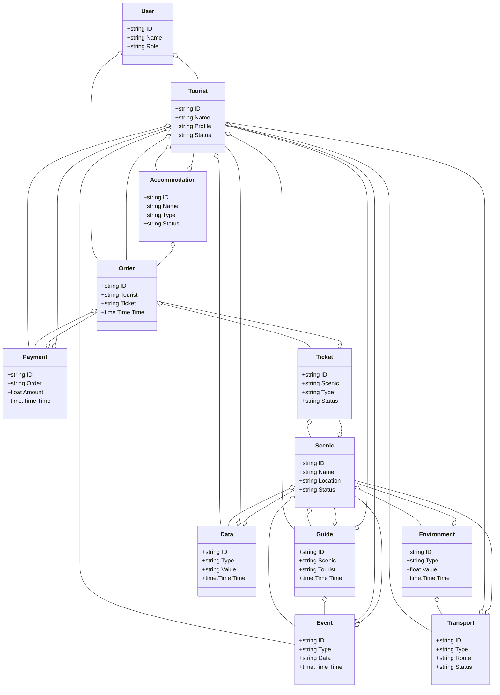
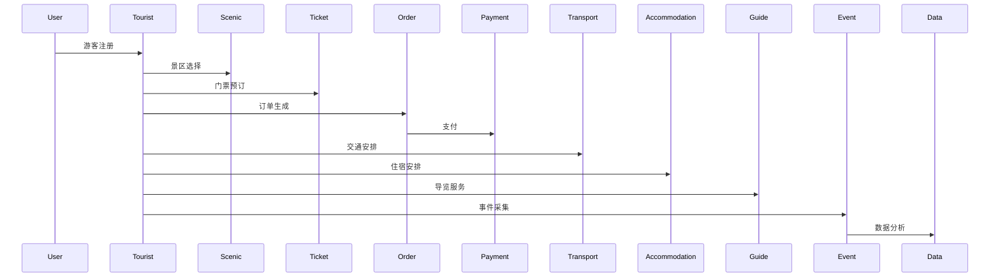
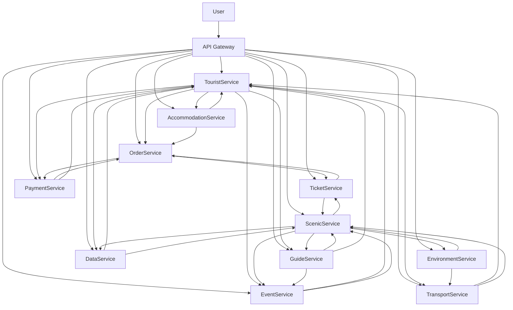

# 旅游/智慧旅游架构（Golang国际主流实践）

## 1. 目录

---

## 2. 旅游/智慧旅游架构概述

### 2.1 国际标准定义

旅游/智慧旅游架构是指以游客体验、智能推荐、弹性协同、数据驱动为核心，支持景区、交通、住宿、票务、导览、支付等场景的分布式系统架构。

- **国际主流参考**：UNWTO、ISO 18513、OpenTravel Alliance、OTA、IATA、WTTC、TIC、IFITT、ISO 21101、ISO 20410。

### 2.2 发展历程与核心思想

- 2000s：在线旅游、电子票务、信息化管理。
- 2010s：移动旅游、智能导览、OTA平台、数据集成。
- 2020s：AI推荐、智慧景区、全球协同、旅游大数据、无接触服务。
- 核心思想：游客为中心、智能驱动、弹性协同、开放标准、数据赋能。

### 2.3 典型应用场景

- 智慧景区、智能导览、在线预订、票务管理、旅游大数据、个性化推荐、无接触服务等。

### 2.4 与传统旅游IT对比

| 维度         | 传统旅游IT         | 智慧旅游架构           |
|--------------|-------------------|----------------------|
| 服务模式     | 人工、线下         | 智能、自动化          |
| 数据采集     | 手工、离线         | 实时、自动化          |
| 协同         | 单点、割裂         | 多方、弹性、协同      |
| 智能化       | 规则、人工         | AI驱动、智能分析      |
| 适用场景     | 景区、单一服务     | 全域、全球协同        |

---

## 3. 信息概念架构

### 3.1 领域建模方法

- 采用分层建模（感知层、服务层、平台层、应用层）、UML、ER图。
- 核心实体：游客、景区、门票、订单、交通、住宿、导览、支付、事件、用户、数据、环境。

### 3.2 核心实体与关系

| 实体    | 属性                        | 关系           |
|---------|-----------------------------|----------------|
| 游客    | ID, Name, Profile, Status   | 关联订单/导览   |
| 景区    | ID, Name, Location, Status  | 关联门票/导览   |
| 门票    | ID, Scenic, Type, Status    | 属于景区/订单   |
| 订单    | ID, Tourist, Ticket, Time   | 关联游客/门票   |
| 交通    | ID, Type, Route, Status     | 关联游客/景区   |
| 住宿    | ID, Name, Type, Status      | 关联游客/订单   |
| 导览    | ID, Scenic, Tourist, Time   | 关联景区/游客   |
| 支付    | ID, Order, Amount, Time     | 关联订单/游客   |
| 事件    | ID, Type, Data, Time        | 关联游客/景区   |
| 用户    | ID, Name, Role              | 管理游客/订单   |
| 数据    | ID, Type, Value, Time       | 关联游客/景区   |
| 环境    | ID, Type, Value, Time       | 关联景区/交通   |

#### 3.2.1 UML 类图（Mermaid）



### 3.3 典型数据流

1. 游客注册→景区选择→门票预订→订单支付→交通/住宿安排→导览服务→事件采集→数据分析→智能推荐。

#### 3.3.1 数据流时序图（Mermaid）



### 3.4 Golang 领域模型代码示例

```go
// 游客实体
type Tourist struct {
    ID      string
    Name    string
    Profile string
    Status  string
}
// 景区实体
type Scenic struct {
    ID       string
    Name     string
    Location string
    Status   string
}
// 门票实体
type Ticket struct {
    ID     string
    Scenic string
    Type   string
    Status string
}
// 订单实体
type Order struct {
    ID      string
    Tourist string
    Ticket  string
    Time    time.Time
}
// 交通实体
type Transport struct {
    ID     string
    Type   string
    Route  string
    Status string
}
// 住宿实体
type Accommodation struct {
    ID     string
    Name   string
    Type   string
    Status string
}
// 导览实体
type Guide struct {
    ID      string
    Scenic  string
    Tourist string
    Time    time.Time
}
// 支付实体
type Payment struct {
    ID     string
    Order  string
    Amount float64
    Time   time.Time
}
// 事件实体
type Event struct {
    ID   string
    Type string
    Data string
    Time time.Time
}
// 用户实体
type User struct {
    ID   string
    Name string
    Role string
}
// 数据实体
type Data struct {
    ID    string
    Type  string
    Value string
    Time  time.Time
}
// 环境实体
type Environment struct {
    ID    string
    Type  string
    Value float64
    Time  time.Time
}

```

---

## 4. 分布式系统挑战

### 4.1 弹性与实时性

- 自动扩缩容、毫秒级响应、负载均衡、容灾备份。
- 国际主流：Kubernetes、Prometheus、云服务、CDN。

### 4.2 数据安全与互操作性

- 数据加密、标准协议、互操作、访问控制。
- 国际主流：OTA、OAuth2、OpenID、TLS、OpenTravel。

### 4.3 可观测性与智能优化

- 全链路追踪、指标采集、AI优化、异常检测。
- 国际主流：OpenTelemetry、Prometheus、AI分析。

---

## 5. 架构设计解决方案

### 5.1 服务解耦与标准接口

- 游客、景区、门票、订单、交通、住宿、导览、支付、数据等服务解耦，API网关统一入口。
- 采用REST、gRPC、消息队列等协议，支持异步事件驱动。

### 5.2 智能推荐与个性化服务

- AI推荐、个性化服务、自动扩缩容、智能分析。
- AI推理、Kubernetes、Prometheus。

### 5.3 数据安全与互操作设计

- TLS、OAuth2、数据加密、标准协议、访问审计。

### 5.4 架构图（Mermaid）



### 5.5 Golang代码示例

```go
// 游客数量Prometheus监控
var touristCount = prometheus.NewGauge(prometheus.GaugeOpts{Name: "tourist_total"})
touristCount.Set(1000000)

```

---

## 6. Golang实现范例

### 6.1 工程结构示例

```text
tourism-demo/
├── cmd/
├── internal/
│   ├── tourist/
│   ├── scenic/
│   ├── ticket/
│   ├── order/
│   ├── payment/
│   ├── transport/
│   ├── accommodation/
│   ├── guide/
│   ├── event/
│   ├── data/
│   ├── environment/
│   ├── user/
├── api/
├── pkg/
├── configs/
├── scripts/
├── build/
└── README.md

```

### 6.2 关键代码片段

// 见4.5

### 6.3 CI/CD 配置（GitHub Actions 示例）

```yaml
name: Go CI
on:
  push:
    branches: [ main ]
jobs:
  build:
    runs-on: ubuntu-latest
    steps:
      - uses: actions/checkout@v3
      - name: Set up Go
        uses: actions/setup-go@v4
        with:
          go-version: '1.21'
      - name: Build
        run: go build ./...
      - name: Test
        run: go test ./...

```

---

## 7. 形式化建模与证明

### 7.1 游客-订单-景区建模

- 游客集合 $T = \{t_1, ..., t_n\}$，订单集合 $O = \{o_1, ..., o_k\}$，景区集合 $S = \{s_1, ..., s_l\}$。
- 推荐函数 $f: (t, o, s) \rightarrow r$，数据采集函数 $g: (t, t') \rightarrow a$。

#### 7.1.1 性质1：个性化推荐性

- 所有游客 $t$ 与订单 $o$，其景区 $s$ 能个性化推荐。

#### 7.1.2 性质2：数据安全性

- 所有数据 $a$ 满足安全策略 $p$，即 $\forall a, \exists p, p(a) = true$。

### 7.2 符号说明

- $T$：游客集合
- $O$：订单集合
- $S$：景区集合
- $A$：数据集合
- $P$：安全策略集合
- $f$：推荐函数
- $g$：数据采集函数

---

## 8. 参考与外部链接

- [UNWTO](https://www.unwto.org/)
- [ISO 18513](https://www.iso.org/standard/31804.html)
- [OpenTravel Alliance](https://opentravel.org/)
- [OTA](https://www.ota.com/)
- [IATA](https://www.iata.org/)
- [WTTC](https://wttc.org/)
- [TIC](https://www.tic.org/)
- [IFITT](https://www.ifitt.org/)
- [ISO 21101](https://www.iso.org/standard/46516.html)
- [ISO 20410](https://www.iso.org/standard/68182.html)
- [Prometheus](https://prometheus.io/)
- [OpenTelemetry](https://opentelemetry.io/)
