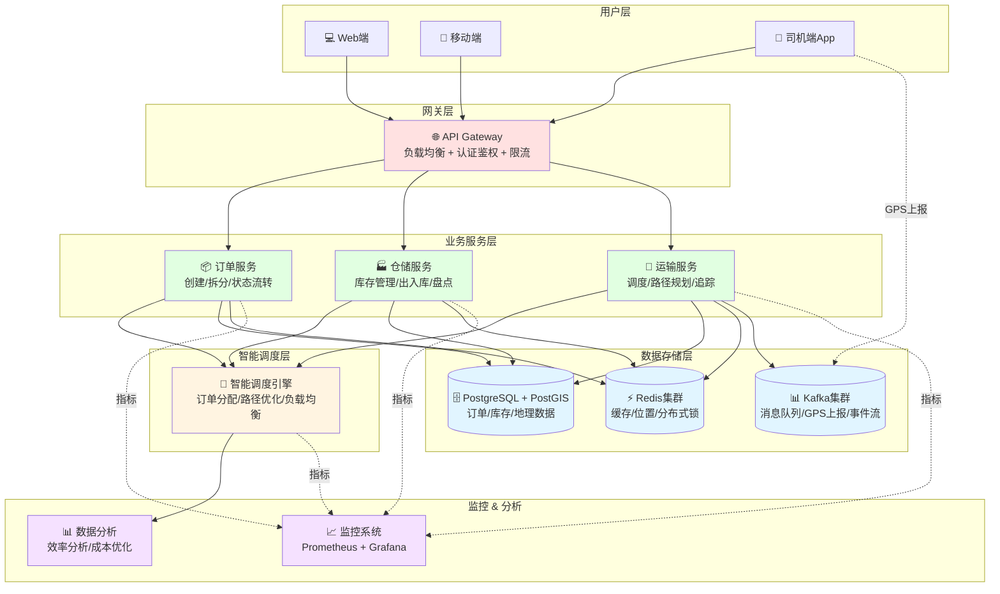
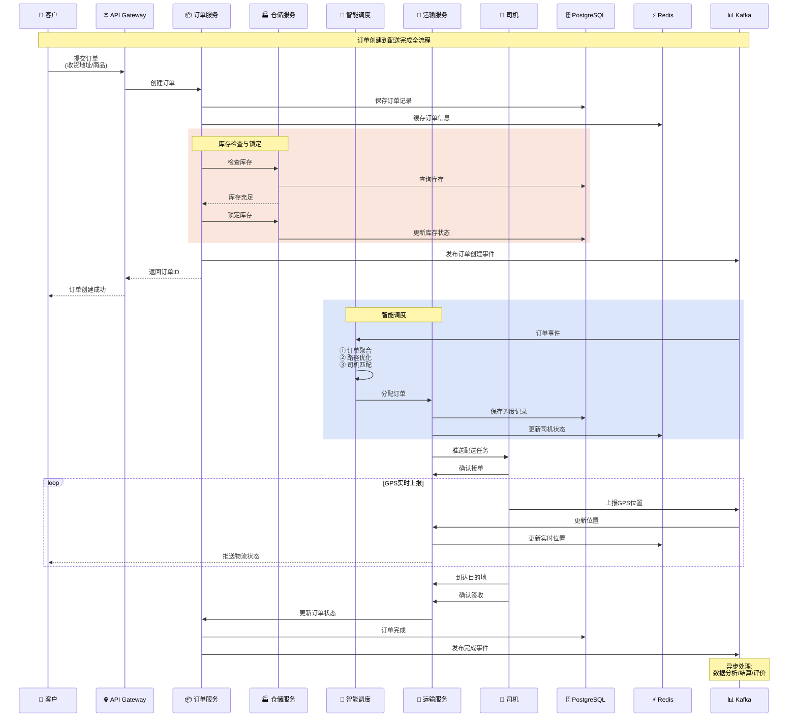
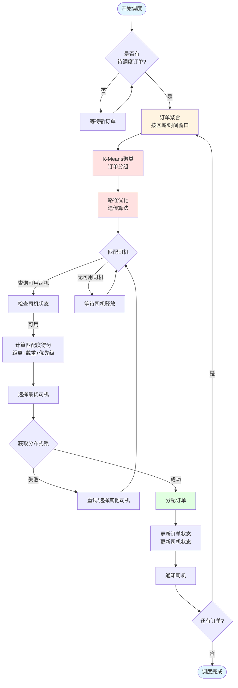

# 物流系统 - Go 语言实战

> 使用 Go 语言构建高效、智能的现代物流管理系统

---

## 📋 目录

- [物流系统 - Go 语言实战](#物流系统---go-语言实战)
  - [📋 目录](#-目录)
  - [系统概述](#系统概述)
    - [业务场景](#业务场景)
    - [Go 语言优势](#go-语言优势)
  - [核心业务模块](#核心业务模块)
    - [系统架构图](#系统架构图)
      - [物流系统架构可视化](#物流系统架构可视化)
      - [订单处理与配送流程时序图](#订单处理与配送流程时序图)
      - [智能调度算法流程图](#智能调度算法流程图)
  - [订单管理系统](#订单管理系统)
    - [订单数据模型](#订单数据模型)
    - [订单服务实现](#订单服务实现)
  - [仓储管理系统](#仓储管理系统)
    - [库存模型](#库存模型)
    - [库存服务](#库存服务)
  - [运输管理系统](#运输管理系统)
    - [司机和车辆模型](#司机和车辆模型)
    - [调度服务](#调度服务)
  - [路径规划系统](#路径规划系统)
    - [多点路径优化](#多点路径优化)
  - [实时追踪系统](#实时追踪系统)
    - [GPS数据上报](#gps数据上报)
  - [智能调度系统](#智能调度系统)
    - [订单批量调度](#订单批量调度)
  - [数据分析与优化](#数据分析与优化)
    - [配送效率分析](#配送效率分析)
  - [性能优化](#性能优化)
    - [数据库优化](#数据库优化)
    - [Redis 缓存策略](#redis-缓存策略)
  - [最佳实践](#最佳实践)
    - [1. 分布式锁防止重复调度](#1-分布式锁防止重复调度)
    - [2. 幂等性设计](#2-幂等性设计)
    - [3. 降级策略](#3-降级策略)
  - [总结](#总结)

---

## 系统概述

### 业务场景

现代物流系统涉及多个环节的协同管理：

- **订单管理**: 订单接收、处理、分配
- **仓储管理**: 入库、出库、库存管理、盘点
- **运输管理**: 配送计划、司机调度、车辆管理
- **路径规划**: 最优路径计算、多点配送优化
- **实时追踪**: GPS定位、电子围栏、异常告警
- **数据分析**: 配送效率、成本分析、预测

### Go 语言优势

```text
✅ 高并发处理能力 (处理海量订单)
✅ 优秀的网络编程能力 (GPS数据上报)
✅ 高效的内存管理 (实时数据处理)
✅ 跨平台支持 (服务器、边缘设备)
✅ 丰富的第三方库 (GIS、算法等)
```

---

## 核心业务模块

### 系统架构图

```text
┌─────────────────────────────────────────────────────────┐
│                 Web/Mobile Client (客户端)               │
│            下单 | 查询 | 追踪 | 评价                      │
└─────────────────────────────────────────────────────────┘
                            │
                            ↓
┌─────────────────────────────────────────────────────────┐
│                    API Gateway (网关层)                  │
│         负载均衡 | 认证鉴权 | 限流 | 日志                 │
└─────────────────────────────────────────────────────────┘
                            │
          ┌─────────────────┼─────────────────┐
          ↓                 ↓                 ↓
┌──────────────────┐ ┌──────────────┐ ┌──────────────┐
│   订单服务        │ │  仓储服务     │ │  运输服务     │
│  - 订单创建      │ │  - 库存管理   │ │  - 调度司机   │
│  - 订单拆分      │ │  - 出入库     │ │  - 路径规划   │
│  - 状态流转      │ │  - 盘点       │ │  - 实时追踪   │
└──────────────────┘ └──────────────┘ └──────────────┘
          │                 │                 │
          └─────────────────┼─────────────────┘
                            ↓
                   ┌─────────────────┐
                   │  智能调度引擎    │
                   │  - 订单分配     │
                   │  - 路径优化     │
                   │  - 负载均衡     │
                   └─────────────────┘
                            │
          ┌─────────────────┼─────────────────┐
          ↓                 ↓                 ↓
┌──────────────────┐ ┌──────────────┐ ┌──────────────┐
│   PostgreSQL     │ │  Redis 集群   │ │  Kafka 集群   │
│  - 订单数据      │ │  - 缓存       │ │  - 消息队列   │
│  - 库存数据      │ │  - 位置数据   │ │  - GPS上报    │
│  - PostGIS 扩展  │ │  - 分布式锁   │ │  - 事件流     │
└──────────────────┘ └──────────────┘ └──────────────┘
```

#### 物流系统架构可视化



#### 订单处理与配送流程时序图



#### 智能调度算法流程图



---

## 订单管理系统

### 订单数据模型

```go
package order

import (
    "time"
)

// Order 订单实体
type Order struct {
    ID            int64       `json:"id" db:"id"`
    OrderNo       string      `json:"order_no" db:"order_no"`
    CustomerID    int64       `json:"customer_id" db:"customer_id"`
    PickupAddr    *Address    `json:"pickup_addr"`     // 取件地址
    DeliveryAddr  *Address    `json:"delivery_addr"`   // 配送地址
    GoodsType     GoodsType   `json:"goods_type" db:"goods_type"`
    Weight        float64     `json:"weight" db:"weight"`      // 重量(kg)
    Volume        float64     `json:"volume" db:"volume"`      // 体积(m³)
    DeclaredValue float64     `json:"declared_value" db:"declared_value"` // 声明价值
    ServiceType   ServiceType `json:"service_type" db:"service_type"`
    Status        OrderStatus `json:"status" db:"status"`
    WarehouseID   *int64      `json:"warehouse_id" db:"warehouse_id"`   // 分配仓库
    DriverID      *int64      `json:"driver_id" db:"driver_id"`         // 分配司机
    ExpectedTime  time.Time   `json:"expected_time" db:"expected_time"` // 预计送达
    ActualTime    *time.Time  `json:"actual_time" db:"actual_time"`     // 实际送达
    CreatedAt     time.Time   `json:"created_at" db:"created_at"`
    UpdatedAt     time.Time   `json:"updated_at" db:"updated_at"`
}

// Address 地址
type Address struct {
    Province   string  `json:"province"`
    City       string  `json:"city"`
    District   string  `json:"district"`
    Street     string  `json:"street"`
    Detail     string  `json:"detail"`
    Contact    string  `json:"contact"`      // 联系人
    Phone      string  `json:"phone"`        // 电话
    Longitude  float64 `json:"longitude"`    // 经度
    Latitude   float64 `json:"latitude"`     // 纬度
}

// GoodsType 货物类型
type GoodsType int

const (
    GoodsTypeDocument  GoodsType = 1 // 文件
    GoodsTypePackage   GoodsType = 2 // 包裹
    GoodsTypeBulky     GoodsType = 3 // 大件
    GoodsTypePerishable GoodsType = 4 // 生鲜
    GoodsTypeFragile   GoodsType = 5 // 易碎品
)

// ServiceType 服务类型
type ServiceType int

const (
    ServiceTypeStandard ServiceType = 1 // 标准快递
    ServiceTypeExpress  ServiceType = 2 // 特快专递
    ServiceTypeSameDay  ServiceType = 3 // 当日达
    ServiceTypeNextDay  ServiceType = 4 // 次日达
)

// OrderStatus 订单状态
type OrderStatus int

const (
    OrderStatusPending    OrderStatus = 1  // 待接单
    OrderStatusAccepted   OrderStatus = 2  // 已接单
    OrderStatusPicked     OrderStatus = 3  // 已揽件
    OrderStatusInWarehouse OrderStatus = 4 // 在库
    OrderStatusOutWarehouse OrderStatus = 5 // 已出库
    OrderStatusInTransit  OrderStatus = 6  // 运输中
    OrderStatusDelivering OrderStatus = 7  // 配送中
    OrderStatusDelivered  OrderStatus = 8  // 已送达
    OrderStatusCancelled  OrderStatus = 9  // 已取消
)

// StatusHistory 状态历史
type StatusHistory struct {
    ID        int64       `json:"id" db:"id"`
    OrderID   int64       `json:"order_id" db:"order_id"`
    Status    OrderStatus `json:"status" db:"status"`
    Location  string      `json:"location" db:"location"`
    Remark    string      `json:"remark" db:"remark"`
    CreatedAt time.Time   `json:"created_at" db:"created_at"`
}
```

### 订单服务实现

```go
package order

import (
    "context"
    "database/sql"
    "errors"
    "fmt"
    "time"
)

var (
    ErrOrderNotFound = errors.New("订单不存在")
    ErrInvalidStatus = errors.New("订单状态不正确")
)

// Service 订单服务
type Service struct {
    db *sql.DB
}

// NewService 创建订单服务
func NewService(db *sql.DB) *Service {
    return &Service{db: db}
}

// CreateOrder 创建订单
func (s *Service) CreateOrder(ctx context.Context, req *CreateOrderRequest) (*Order, error) {
    order := &Order{
        OrderNo:       generateOrderNo(),
        CustomerID:    req.CustomerID,
        PickupAddr:    req.PickupAddr,
        DeliveryAddr:  req.DeliveryAddr,
        GoodsType:     req.GoodsType,
        Weight:        req.Weight,
        Volume:        req.Volume,
        DeclaredValue: req.DeclaredValue,
        ServiceType:   req.ServiceType,
        Status:        OrderStatusPending,
        ExpectedTime:  calculateExpectedTime(req.ServiceType),
    }
    
    // 开启事务
    tx, err := s.db.BeginTx(ctx, nil)
    if err != nil {
        return nil, err
    }
    defer tx.Rollback()
    
    // 插入订单
    query := `
        INSERT INTO orders (order_no, customer_id, pickup_addr, delivery_addr, goods_type, weight, volume, declared_value, service_type, status, expected_time, created_at, updated_at)
        VALUES (?, ?, ?, ?, ?, ?, ?, ?, ?, ?, ?, NOW(), NOW())
    `
    
    pickupAddrJSON, _ := json.Marshal(order.PickupAddr)
    deliveryAddrJSON, _ := json.Marshal(order.DeliveryAddr)
    
    result, err := tx.ExecContext(ctx, query,
        order.OrderNo, order.CustomerID, pickupAddrJSON, deliveryAddrJSON,
        order.GoodsType, order.Weight, order.Volume, order.DeclaredValue,
        order.ServiceType, order.Status, order.ExpectedTime,
    )
    if err != nil {
        return nil, err
    }
    
    id, _ := result.LastInsertId()
    order.ID = id
    
    // 记录状态历史
    err = s.addStatusHistory(ctx, tx, order.ID, OrderStatusPending, "订单创建", "")
    if err != nil {
        return nil, err
    }
    
    // 触发订单分配
    go s.dispatchOrder(order.ID)
    
    if err := tx.Commit(); err != nil {
        return nil, err
    }
    
    return order, nil
}

// UpdateOrderStatus 更新订单状态
func (s *Service) UpdateOrderStatus(ctx context.Context, orderID int64, newStatus OrderStatus, location, remark string) error {
    tx, err := s.db.BeginTx(ctx, nil)
    if err != nil {
        return err
    }
    defer tx.Rollback()
    
    // 锁定订单
    var currentStatus OrderStatus
    query := `SELECT status FROM orders WHERE id = ? FOR UPDATE`
    err = tx.QueryRowContext(ctx, query, orderID).Scan(&currentStatus)
    if err == sql.ErrNoRows {
        return ErrOrderNotFound
    }
    if err != nil {
        return err
    }
    
    // 验证状态流转合法性
    if !isValidStatusTransition(currentStatus, newStatus) {
        return ErrInvalidStatus
    }
    
    // 更新订单状态
    updateQuery := `UPDATE orders SET status = ?, updated_at = NOW() WHERE id = ?`
    _, err = tx.ExecContext(ctx, updateQuery, newStatus, orderID)
    if err != nil {
        return err
    }
    
    // 记录状态历史
    err = s.addStatusHistory(ctx, tx, orderID, newStatus, location, remark)
    if err != nil {
        return err
    }
    
    // 如果是已送达状态，记录实际送达时间
    if newStatus == OrderStatusDelivered {
        now := time.Now()
        _, err = tx.ExecContext(ctx, `UPDATE orders SET actual_time = ? WHERE id = ?`, now, orderID)
        if err != nil {
            return err
        }
    }
    
    return tx.Commit()
}

// GetOrderTrace 获取订单轨迹
func (s *Service) GetOrderTrace(ctx context.Context, orderNo string) ([]StatusHistory, error) {
    query := `
        SELECT h.id, h.order_id, h.status, h.location, h.remark, h.created_at
        FROM status_history h
        INNER JOIN orders o ON h.order_id = o.id
        WHERE o.order_no = ?
        ORDER BY h.created_at ASC
    `
    
    rows, err := s.db.QueryContext(ctx, query, orderNo)
    if err != nil {
        return nil, err
    }
    defer rows.Close()
    
    var history []StatusHistory
    for rows.Next() {
        var h StatusHistory
        err := rows.Scan(&h.ID, &h.OrderID, &h.Status, &h.Location, &h.Remark, &h.CreatedAt)
        if err != nil {
            return nil, err
        }
        history = append(history, h)
    }
    
    return history, nil
}

// addStatusHistory 添加状态历史记录
func (s *Service) addStatusHistory(ctx context.Context, tx *sql.Tx, orderID int64, status OrderStatus, location, remark string) error {
    query := `
        INSERT INTO status_history (order_id, status, location, remark, created_at)
        VALUES (?, ?, ?, ?, NOW())
    `
    _, err := tx.ExecContext(ctx, query, orderID, status, location, remark)
    return err
}

// isValidStatusTransition 验证状态流转是否合法
func isValidStatusTransition(from, to OrderStatus) bool {
    validTransitions := map[OrderStatus][]OrderStatus{
        OrderStatusPending:      {OrderStatusAccepted, OrderStatusCancelled},
        OrderStatusAccepted:     {OrderStatusPicked, OrderStatusCancelled},
        OrderStatusPicked:       {OrderStatusInWarehouse},
        OrderStatusInWarehouse:  {OrderStatusOutWarehouse},
        OrderStatusOutWarehouse: {OrderStatusInTransit},
        OrderStatusInTransit:    {OrderStatusDelivering, OrderStatusInWarehouse},
        OrderStatusDelivering:   {OrderStatusDelivered},
    }
    
    allowed, exists := validTransitions[from]
    if !exists {
        return false
    }
    
    for _, status := range allowed {
        if status == to {
            return true
        }
    }
    return false
}

// calculateExpectedTime 计算预计送达时间
func calculateExpectedTime(serviceType ServiceType) time.Time {
    now := time.Now()
    switch serviceType {
    case ServiceTypeSameDay:
        return now.Add(8 * time.Hour)
    case ServiceTypeNextDay:
        return now.Add(24 * time.Hour)
    case ServiceTypeExpress:
        return now.Add(48 * time.Hour)
    default:
        return now.Add(72 * time.Hour)
    }
}

// generateOrderNo 生成订单号
func generateOrderNo() string {
    // 格式: LO + 日期(8位) + 时间戳后6位 + 随机数(4位)
    return fmt.Sprintf("LO%s%06d%04d",
        time.Now().Format("20060102"),
        time.Now().Unix()%1000000,
        rand.Intn(10000),
    )
}

// dispatchOrder 订单分配（异步）
func (s *Service) dispatchOrder(orderID int64) {
    // 调用智能调度服务分配仓库和司机
    // 实现略
}

// CreateOrderRequest 创建订单请求
type CreateOrderRequest struct {
    CustomerID    int64
    PickupAddr    *Address
    DeliveryAddr  *Address
    GoodsType     GoodsType
    Weight        float64
    Volume        float64
    DeclaredValue float64
    ServiceType   ServiceType
}
```

---

## 仓储管理系统

### 库存模型

```go
package warehouse

import (
    "time"
)

// Warehouse 仓库
type Warehouse struct {
    ID        int64     `json:"id" db:"id"`
    Name      string    `json:"name" db:"name"`
    Code      string    `json:"code" db:"code"`
    Address   string    `json:"address" db:"address"`
    Longitude float64   `json:"longitude" db:"longitude"`
    Latitude  float64   `json:"latitude" db:"latitude"`
    Capacity  int       `json:"capacity" db:"capacity"`    // 容量
    Current   int       `json:"current" db:"current"`      // 当前存量
    Status    WHStatus  `json:"status" db:"status"`
    CreatedAt time.Time `json:"created_at" db:"created_at"`
}

// WHStatus 仓库状态
type WHStatus int

const (
    WHStatusActive   WHStatus = 1 // 正常
    WHStatusFull     WHStatus = 2 // 已满
    WHStatusMaintain WHStatus = 3 // 维护中
)

// Inventory 库存记录
type Inventory struct {
    ID          int64          `json:"id" db:"id"`
    WarehouseID int64          `json:"warehouse_id" db:"warehouse_id"`
    OrderID     int64          `json:"order_id" db:"order_id"`
    Location    string         `json:"location" db:"location"` // 库位
    Operation   OperationType  `json:"operation" db:"operation"`
    Quantity    int            `json:"quantity" db:"quantity"`
    OperatorID  int64          `json:"operator_id" db:"operator_id"`
    Remark      string         `json:"remark" db:"remark"`
    CreatedAt   time.Time      `json:"created_at" db:"created_at"`
}

// OperationType 操作类型
type OperationType int

const (
    OperationTypeInbound  OperationType = 1 // 入库
    OperationTypeOutbound OperationType = 2 // 出库
    OperationTypeAdjust   OperationType = 3 // 调整
)
```

### 库存服务

```go
package warehouse

import (
    "context"
    "database/sql"
    "errors"
)

var (
    ErrWarehouseFull    = errors.New("仓库已满")
    ErrInsufficientStock = errors.New("库存不足")
)

// Service 仓储服务
type Service struct {
    db *sql.DB
}

// Inbound 入库
func (s *Service) Inbound(ctx context.Context, warehouseID, orderID int64, location string, operatorID int64) error {
    tx, err := s.db.BeginTx(ctx, nil)
    if err != nil {
        return err
    }
    defer tx.Rollback()
    
    // 锁定仓库
    var warehouse Warehouse
    query := `SELECT id, capacity, current, status FROM warehouses WHERE id = ? FOR UPDATE`
    err = tx.QueryRowContext(ctx, query, warehouseID).Scan(&warehouse.ID, &warehouse.Capacity, &warehouse.Current, &warehouse.Status)
    if err != nil {
        return err
    }
    
    // 检查仓库状态
    if warehouse.Status != WHStatusActive {
        return errors.New("仓库不可用")
    }
    
    // 检查容量
    if warehouse.Current >= warehouse.Capacity {
        return ErrWarehouseFull
    }
    
    // 更新仓库存量
    _, err = tx.ExecContext(ctx, `UPDATE warehouses SET current = current + 1, updated_at = NOW() WHERE id = ?`, warehouseID)
    if err != nil {
        return err
    }
    
    // 记录库存操作
    invQuery := `
        INSERT INTO inventory (warehouse_id, order_id, location, operation, quantity, operator_id, created_at)
        VALUES (?, ?, ?, ?, ?, ?, NOW())
    `
    _, err = tx.ExecContext(ctx, invQuery, warehouseID, orderID, location, OperationTypeInbound, 1, operatorID)
    if err != nil {
        return err
    }
    
    // 更新订单状态
    _, err = tx.ExecContext(ctx, `UPDATE orders SET warehouse_id = ?, status = ?, updated_at = NOW() WHERE id = ?`,
        warehouseID, order.OrderStatusInWarehouse, orderID)
    if err != nil {
        return err
    }
    
    return tx.Commit()
}

// Outbound 出库
func (s *Service) Outbound(ctx context.Context, orderID int64, operatorID int64) error {
    tx, err := s.db.BeginTx(ctx, nil)
    if err != nil {
        return err
    }
    defer tx.Rollback()
    
    // 查询订单所在仓库
    var warehouseID int64
    var status order.OrderStatus
    query := `SELECT warehouse_id, status FROM orders WHERE id = ?`
    err = tx.QueryRowContext(ctx, query, orderID).Scan(&warehouseID, &status)
    if err != nil {
        return err
    }
    
    if status != order.OrderStatusInWarehouse {
        return errors.New("订单状态不正确")
    }
    
    // 锁定仓库并减少存量
    _, err = tx.ExecContext(ctx, `UPDATE warehouses SET current = current - 1, updated_at = NOW() WHERE id = ? AND current > 0`, warehouseID)
    if err != nil {
        return err
    }
    
    // 记录库存操作
    invQuery := `
        INSERT INTO inventory (warehouse_id, order_id, operation, quantity, operator_id, created_at)
        VALUES (?, ?, ?, ?, ?, NOW())
    `
    _, err = tx.ExecContext(ctx, invQuery, warehouseID, orderID, OperationTypeOutbound, 1, operatorID)
    if err != nil {
        return err
    }
    
    // 更新订单状态
    _, err = tx.ExecContext(ctx, `UPDATE orders SET status = ?, updated_at = NOW() WHERE id = ?`,
        order.OrderStatusOutWarehouse, orderID)
    if err != nil {
        return err
    }
    
    return tx.Commit()
}

// GetNearestWarehouse 获取最近的仓库
func (s *Service) GetNearestWarehouse(ctx context.Context, longitude, latitude float64) (*Warehouse, error) {
    // 使用 PostGIS 计算距离
    query := `
        SELECT id, name, code, address, longitude, latitude, capacity, current, status,
               ST_Distance(
                   ST_MakePoint(longitude, latitude)::geography,
                   ST_MakePoint(?, ?)::geography
               ) as distance
        FROM warehouses
        WHERE status = ?
        ORDER BY distance ASC
        LIMIT 1
    `
    
    var warehouse Warehouse
    var distance float64
    err := s.db.QueryRowContext(ctx, query, longitude, latitude, WHStatusActive).Scan(
        &warehouse.ID, &warehouse.Name, &warehouse.Code, &warehouse.Address,
        &warehouse.Longitude, &warehouse.Latitude, &warehouse.Capacity, &warehouse.Current,
        &warehouse.Status, &distance,
    )
    if err != nil {
        return nil, err
    }
    
    return &warehouse, nil
}
```

---

## 运输管理系统

### 司机和车辆模型

```go
package transport

import (
    "time"
)

// Driver 司机
type Driver struct {
    ID           int64        `json:"id" db:"id"`
    Name         string       `json:"name" db:"name"`
    Phone        string       `json:"phone" db:"phone"`
    LicenseNo    string       `json:"license_no" db:"license_no"`      // 驾照号
    VehicleID    int64        `json:"vehicle_id" db:"vehicle_id"`
    Status       DriverStatus `json:"status" db:"status"`
    CurrentLat   float64      `json:"current_lat" db:"current_lat"`    // 当前纬度
    CurrentLng   float64      `json:"current_lng" db:"current_lng"`    // 当前经度
    LastReportAt time.Time    `json:"last_report_at" db:"last_report_at"`
    CreatedAt    time.Time    `json:"created_at" db:"created_at"`
}

// DriverStatus 司机状态
type DriverStatus int

const (
    DriverStatusIdle      DriverStatus = 1 // 空闲
    DriverStatusBusy      DriverStatus = 2 // 忙碌
    DriverStatusOffline   DriverStatus = 3 // 离线
)

// Vehicle 车辆
type Vehicle struct {
    ID          int64         `json:"id" db:"id"`
    PlateNo     string        `json:"plate_no" db:"plate_no"`       // 车牌号
    VehicleType VehicleType   `json:"vehicle_type" db:"vehicle_type"`
    LoadCapacity float64      `json:"load_capacity" db:"load_capacity"` // 载重(kg)
    VolumeCapacity float64    `json:"volume_capacity" db:"volume_capacity"` // 容积(m³)
    Status      VehicleStatus `json:"status" db:"status"`
    CreatedAt   time.Time     `json:"created_at" db:"created_at"`
}

// VehicleType 车辆类型
type VehicleType int

const (
    VehicleTypeTricycle VehicleType = 1 // 三轮车
    VehicleTypeVan      VehicleType = 2 // 面包车
    VehicleTypeTruck    VehicleType = 3 // 货车
)

// VehicleStatus 车辆状态
type VehicleStatus int

const (
    VehicleStatusAvailable VehicleStatus = 1 // 可用
    VehicleStatusInUse     VehicleStatus = 2 // 使用中
    VehicleStatusMaintain  VehicleStatus = 3 // 维护中
)

// DeliveryTask 配送任务
type DeliveryTask struct {
    ID          int64      `json:"id" db:"id"`
    DriverID    int64      `json:"driver_id" db:"driver_id"`
    VehicleID   int64      `json:"vehicle_id" db:"vehicle_id"`
    Orders      []int64    `json:"orders"`               // 订单列表
    Route       []Location `json:"route"`                // 路径
    TotalDistance float64  `json:"total_distance" db:"total_distance"` // 总距离(km)
    EstimatedTime int      `json:"estimated_time" db:"estimated_time"` // 预计耗时(分钟)
    Status      TaskStatus `json:"status" db:"status"`
    StartedAt   *time.Time `json:"started_at" db:"started_at"`
    CompletedAt *time.Time `json:"completed_at" db:"completed_at"`
    CreatedAt   time.Time  `json:"created_at" db:"created_at"`
}

// Location 位置
type Location struct {
    Longitude float64 `json:"longitude"`
    Latitude  float64 `json:"latitude"`
    Address   string  `json:"address"`
}

// TaskStatus 任务状态
type TaskStatus int

const (
    TaskStatusPending   TaskStatus = 1 // 待执行
    TaskStatusInProgress TaskStatus = 2 // 进行中
    TaskStatusCompleted TaskStatus = 3 // 已完成
    TaskStatusCancelled TaskStatus = 4 // 已取消
)
```

### 调度服务

```go
package transport

import (
    "context"
    "database/sql"
    "errors"
    "math"
)

// DispatchService 调度服务
type DispatchService struct {
    db *sql.DB
}

// AssignDriver 分配司机
func (s *DispatchService) AssignDriver(ctx context.Context, orderIDs []int64) (*DeliveryTask, error) {
    // 1. 获取订单配送地址
    orders, err := s.getOrders(ctx, orderIDs)
    if err != nil {
        return nil, err
    }
    
    // 2. 查找最优司机（距离最近 + 空闲）
    driver, err := s.findOptimalDriver(ctx, orders[0].DeliveryAddr.Latitude, orders[0].DeliveryAddr.Longitude)
    if err != nil {
        return nil, err
    }
    
    // 3. 计算最优配送路径
    route, totalDistance := s.calculateOptimalRoute(orders)
    
    // 4. 创建配送任务
    task := &DeliveryTask{
        DriverID:      driver.ID,
        VehicleID:     driver.VehicleID,
        Orders:        orderIDs,
        Route:         route,
        TotalDistance: totalDistance,
        EstimatedTime: int(totalDistance / 40 * 60), // 假设平均速度40km/h
        Status:        TaskStatusPending,
    }
    
    // 5. 保存任务
    tx, err := s.db.BeginTx(ctx, nil)
    if err != nil {
        return nil, err
    }
    defer tx.Rollback()
    
    routeJSON, _ := json.Marshal(task.Route)
    ordersJSON, _ := json.Marshal(task.Orders)
    
    query := `
        INSERT INTO delivery_tasks (driver_id, vehicle_id, orders, route, total_distance, estimated_time, status, created_at)
        VALUES (?, ?, ?, ?, ?, ?, ?, NOW())
    `
    result, err := tx.ExecContext(ctx, query,
        task.DriverID, task.VehicleID, ordersJSON, routeJSON, task.TotalDistance, task.EstimatedTime, task.Status,
    )
    if err != nil {
        return nil, err
    }
    
    taskID, _ := result.LastInsertId()
    task.ID = taskID
    
    // 6. 更新司机状态
    _, err = tx.ExecContext(ctx, `UPDATE drivers SET status = ? WHERE id = ?`, DriverStatusBusy, driver.ID)
    if err != nil {
        return nil, err
    }
    
    // 7. 更新订单状态和司机信息
    for _, orderID := range orderIDs {
        _, err = tx.ExecContext(ctx, `UPDATE orders SET driver_id = ?, status = ? WHERE id = ?`,
            driver.ID, order.OrderStatusDelivering, orderID)
        if err != nil {
            return nil, err
        }
    }
    
    if err := tx.Commit(); err != nil {
        return nil, err
    }
    
    // 8. 通知司机
    go s.notifyDriver(driver.ID, task)
    
    return task, nil
}

// findOptimalDriver 查找最优司机
func (s *DispatchService) findOptimalDriver(ctx context.Context, lat, lng float64) (*Driver, error) {
    query := `
        SELECT id, name, phone, vehicle_id, status, current_lat, current_lng,
               ST_Distance(
                   ST_MakePoint(current_lng, current_lat)::geography,
                   ST_MakePoint(?, ?)::geography
               ) as distance
        FROM drivers
        WHERE status = ?
        ORDER BY distance ASC
        LIMIT 1
    `
    
    var driver Driver
    var distance float64
    err := s.db.QueryRowContext(ctx, query, lng, lat, DriverStatusIdle).Scan(
        &driver.ID, &driver.Name, &driver.Phone, &driver.VehicleID, &driver.Status,
        &driver.CurrentLat, &driver.CurrentLng, &distance,
    )
    if err == sql.ErrNoRows {
        return nil, errors.New("无可用司机")
    }
    if err != nil {
        return nil, err
    }
    
    return &driver, nil
}

// calculateOptimalRoute 计算最优配送路径（TSP问题）
func (s *DispatchService) calculateOptimalRoute(orders []*order.Order) ([]Location, float64) {
    // 简化实现：使用贪心算法（最近邻）
    // 实际应用中可以使用：
    // 1. 遗传算法
    // 2. 模拟退火
    // 3. 蚁群算法
    // 4. 调用高德/百度等地图API
    
    if len(orders) == 0 {
        return nil, 0
    }
    
    route := make([]Location, 0, len(orders))
    visited := make(map[int]bool)
    totalDistance := 0.0
    
    // 从第一个订单开始
    current := 0
    route = append(route, Location{
        Longitude: orders[current].DeliveryAddr.Longitude,
        Latitude:  orders[current].DeliveryAddr.Latitude,
        Address:   orders[current].DeliveryAddr.Detail,
    })
    visited[current] = true
    
    // 贪心选择最近的下一个点
    for len(visited) < len(orders) {
        minDist := math.MaxFloat64
        nextIdx := -1
        
        for i, order := range orders {
            if visited[i] {
                continue
            }
            
            dist := calculateDistance(
                route[len(route)-1].Latitude, route[len(route)-1].Longitude,
                order.DeliveryAddr.Latitude, order.DeliveryAddr.Longitude,
            )
            
            if dist < minDist {
                minDist = dist
                nextIdx = i
            }
        }
        
        if nextIdx != -1 {
            route = append(route, Location{
                Longitude: orders[nextIdx].DeliveryAddr.Longitude,
                Latitude:  orders[nextIdx].DeliveryAddr.Latitude,
                Address:   orders[nextIdx].DeliveryAddr.Detail,
            })
            totalDistance += minDist
            visited[nextIdx] = true
        }
    }
    
    return route, totalDistance
}

// calculateDistance 计算两点间距离（Haversine公式）
func calculateDistance(lat1, lng1, lat2, lng2 float64) float64 {
    const R = 6371 // 地球半径(km)
    
    dLat := (lat2 - lat1) * math.Pi / 180
    dLng := (lng2 - lng1) * math.Pi / 180
    
    lat1Rad := lat1 * math.Pi / 180
    lat2Rad := lat2 * math.Pi / 180
    
    a := math.Sin(dLat/2)*math.Sin(dLat/2) +
        math.Cos(lat1Rad)*math.Cos(lat2Rad)*
            math.Sin(dLng/2)*math.Sin(dLng/2)
    
    c := 2 * math.Atan2(math.Sqrt(a), math.Sqrt(1-a))
    
    return R * c
}

// notifyDriver 通知司机
func (s *DispatchService) notifyDriver(driverID int64, task *DeliveryTask) {
    // 通过推送、短信等方式通知司机
    // 实现略
}
```

---

## 路径规划系统

### 多点路径优化

```go
package routing

import (
    "math"
    "math/rand"
)

// GeneticAlgorithm 遗传算法求解TSP
type GeneticAlgorithm struct {
    PopulationSize int     // 种群大小
    Generations    int     // 迭代次数
    MutationRate   float64 // 变异率
    CrossoverRate  float64 // 交叉率
}

// NewGeneticAlgorithm 创建遗传算法
func NewGeneticAlgorithm() *GeneticAlgorithm {
    return &GeneticAlgorithm{
        PopulationSize: 100,
        Generations:    1000,
        MutationRate:   0.01,
        CrossoverRate:  0.7,
    }
}

// Solve 求解最优路径
func (ga *GeneticAlgorithm) Solve(locations []Location) ([]int, float64) {
    n := len(locations)
    if n <= 2 {
        return []int{0, 1}, calculateDistance(
            locations[0].Latitude, locations[0].Longitude,
            locations[1].Latitude, locations[1].Longitude,
        )
    }
    
    // 计算距离矩阵
    distMatrix := make([][]float64, n)
    for i := range distMatrix {
        distMatrix[i] = make([]float64, n)
        for j := range distMatrix[i] {
            if i != j {
                distMatrix[i][j] = calculateDistance(
                    locations[i].Latitude, locations[i].Longitude,
                    locations[j].Latitude, locations[j].Longitude,
                )
            }
        }
    }
    
    // 初始化种群
    population := ga.initPopulation(n)
    
    // 迭代进化
    for gen := 0; gen < ga.Generations; gen++ {
        // 评估适应度
        fitness := ga.evaluateFitness(population, distMatrix)
        
        // 选择
        selected := ga.selection(population, fitness)
        
        // 交叉
        offspring := ga.crossover(selected)
        
        // 变异
        ga.mutation(offspring)
        
        population = offspring
    }
    
    // 返回最优解
    fitness := ga.evaluateFitness(population, distMatrix)
    bestIdx := 0
    bestFitness := fitness[0]
    for i, f := range fitness {
        if f < bestFitness {
            bestFitness = f
            bestIdx = i
        }
    }
    
    return population[bestIdx], bestFitness
}

// initPopulation 初始化种群
func (ga *GeneticAlgorithm) initPopulation(n int) [][]int {
    population := make([][]int, ga.PopulationSize)
    for i := range population {
        population[i] = randomPermutation(n)
    }
    return population
}

// evaluateFitness 评估适应度（总距离）
func (ga *GeneticAlgorithm) evaluateFitness(population [][]int, distMatrix [][]float64) []float64 {
    fitness := make([]float64, len(population))
    for i, individual := range population {
        distance := 0.0
        for j := 0; j < len(individual)-1; j++ {
            distance += distMatrix[individual[j]][individual[j+1]]
        }
        fitness[i] = distance
    }
    return fitness
}

// selection 轮盘赌选择
func (ga *GeneticAlgorithm) selection(population [][]int, fitness []float64) [][]int {
    // 转换为适应度值（距离越小越好）
    maxFitness := 0.0
    for _, f := range fitness {
        if f > maxFitness {
            maxFitness = f
        }
    }
    
    probabilities := make([]float64, len(fitness))
    totalProb := 0.0
    for i, f := range fitness {
        probabilities[i] = maxFitness - f + 1
        totalProb += probabilities[i]
    }
    
    selected := make([][]int, ga.PopulationSize)
    for i := range selected {
        r := rand.Float64() * totalProb
        sum := 0.0
        for j, prob := range probabilities {
            sum += prob
            if sum >= r {
                selected[i] = make([]int, len(population[j]))
                copy(selected[i], population[j])
                break
            }
        }
    }
    
    return selected
}

// crossover 顺序交叉
func (ga *GeneticAlgorithm) crossover(population [][]int) [][]int {
    offspring := make([][]int, len(population))
    for i := 0; i < len(population); i += 2 {
        if rand.Float64() < ga.CrossoverRate && i+1 < len(population) {
            parent1 := population[i]
            parent2 := population[i+1]
            
            child1, child2 := ga.orderCrossover(parent1, parent2)
            offspring[i] = child1
            offspring[i+1] = child2
        } else {
            offspring[i] = make([]int, len(population[i]))
            copy(offspring[i], population[i])
            if i+1 < len(population) {
                offspring[i+1] = make([]int, len(population[i+1]))
                copy(offspring[i+1], population[i+1])
            }
        }
    }
    return offspring
}

// orderCrossover 顺序交叉操作
func (ga *GeneticAlgorithm) orderCrossover(parent1, parent2 []int) ([]int, []int) {
    n := len(parent1)
    child1 := make([]int, n)
    child2 := make([]int, n)
    
    // 随机选择交叉点
    point1 := rand.Intn(n)
    point2 := rand.Intn(n)
    if point1 > point2 {
        point1, point2 = point2, point1
    }
    
    // 复制中间段
    for i := point1; i <= point2; i++ {
        child1[i] = parent1[i]
        child2[i] = parent2[i]
    }
    
    // 填充剩余部分
    ga.fillChild(child1, parent2, point1, point2)
    ga.fillChild(child2, parent1, point1, point2)
    
    return child1, child2
}

// fillChild 填充子代
func (ga *GeneticAlgorithm) fillChild(child, parent []int, start, end int) {
    pos := (end + 1) % len(child)
    for _, gene := range parent {
        if !contains(child[start:end+1], gene) {
            child[pos] = gene
            pos = (pos + 1) % len(child)
            if pos == start {
                return
            }
        }
    }
}

// mutation 变异操作（交换两个位置）
func (ga *GeneticAlgorithm) mutation(population [][]int) {
    for i := range population {
        if rand.Float64() < ga.MutationRate {
            pos1 := rand.Intn(len(population[i]))
            pos2 := rand.Intn(len(population[i]))
            population[i][pos1], population[i][pos2] = population[i][pos2], population[i][pos1]
        }
    }
}

// randomPermutation 生成随机排列
func randomPermutation(n int) []int {
    perm := make([]int, n)
    for i := range perm {
        perm[i] = i
    }
    rand.Shuffle(n, func(i, j int) {
        perm[i], perm[j] = perm[j], perm[i]
    })
    return perm
}

// contains 检查切片是否包含元素
func contains(slice []int, val int) bool {
    for _, v := range slice {
        if v == val {
            return true
        }
    }
    return false
}
```

---

## 实时追踪系统

### GPS数据上报

```go
package tracking

import (
    "context"
    "encoding/json"
    "time"
    "github.com/redis/go-redis/v9"
)

// GPSData GPS数据
type GPSData struct {
    DriverID  int64     `json:"driver_id"`
    Longitude float64   `json:"longitude"`
    Latitude  float64   `json:"latitude"`
    Speed     float64   `json:"speed"`      // 速度(km/h)
    Direction float64   `json:"direction"`  // 方向(度)
    Altitude  float64   `json:"altitude"`   // 海拔(m)
    Accuracy  float64   `json:"accuracy"`   // 精度(m)
    Timestamp time.Time `json:"timestamp"`
}

// TrackingService 追踪服务
type TrackingService struct {
    rdb *redis.Client
}

// NewTrackingService 创建追踪服务
func NewTrackingService(rdb *redis.Client) *TrackingService {
    return &TrackingService{rdb: rdb}
}

// ReportLocation 上报位置
func (s *TrackingService) ReportLocation(ctx context.Context, data *GPSData) error {
    // 1. 存储到Redis（实时位置）
    key := fmt.Sprintf("driver:location:%d", data.DriverID)
    jsonData, _ := json.Marshal(data)
    
    err := s.rdb.Set(ctx, key, jsonData, 5*time.Minute).Err()
    if err != nil {
        return err
    }
    
    // 2. 存储到GEO索引（用于范围查询）
    geoKey := "drivers:geo"
    err = s.rdb.GeoAdd(ctx, geoKey, &redis.GeoLocation{
        Name:      fmt.Sprintf("%d", data.DriverID),
        Longitude: data.Longitude,
        Latitude:  data.Latitude,
    }).Err()
    if err != nil {
        return err
    }
    
    // 3. 添加到轨迹流（用于历史回放）
    trackKey := fmt.Sprintf("driver:track:%d:%s", data.DriverID, time.Now().Format("20060102"))
    s.rdb.XAdd(ctx, &redis.XAddArgs{
        Stream: trackKey,
        Values: map[string]interface{}{
            "longitude": data.Longitude,
            "latitude":  data.Latitude,
            "speed":     data.Speed,
            "timestamp": data.Timestamp.Unix(),
        },
    })
    
    // 4. 检查是否偏离路线
    go s.checkRouteDeviation(data.DriverID, data.Longitude, data.Latitude)
    
    return nil
}

// GetDriverLocation 获取司机位置
func (s *TrackingService) GetDriverLocation(ctx context.Context, driverID int64) (*GPSData, error) {
    key := fmt.Sprintf("driver:location:%d", driverID)
    
    val, err := s.rdb.Get(ctx, key).Result()
    if err != nil {
        return nil, err
    }
    
    var data GPSData
    err = json.Unmarshal([]byte(val), &data)
    if err != nil {
        return nil, err
    }
    
    return &data, nil
}

// GetNearbyDrivers 获取附近司机
func (s *TrackingService) GetNearbyDrivers(ctx context.Context, longitude, latitude, radiusKm float64) ([]int64, error) {
    geoKey := "drivers:geo"
    
    results, err := s.rdb.GeoRadius(ctx, geoKey, longitude, latitude, &redis.GeoRadiusQuery{
        Radius:      radiusKm,
        Unit:        "km",
        WithCoord:   true,
        WithDist:    true,
        Sort:        "ASC",
    }).Result()
    
    if err != nil {
        return nil, err
    }
    
    driverIDs := make([]int64, 0, len(results))
    for _, result := range results {
        driverID, _ := strconv.ParseInt(result.Name, 10, 64)
        driverIDs = append(driverIDs, driverID)
    }
    
    return driverIDs, nil
}

// GetDriverTrack 获取司机轨迹
func (s *TrackingService) GetDriverTrack(ctx context.Context, driverID int64, date time.Time) ([]GPSData, error) {
    trackKey := fmt.Sprintf("driver:track:%d:%s", driverID, date.Format("20060102"))
    
    results, err := s.rdb.XRange(ctx, trackKey, "-", "+").Result()
    if err != nil {
        return nil, err
    }
    
    tracks := make([]GPSData, 0, len(results))
    for _, result := range results {
        lng, _ := strconv.ParseFloat(result.Values["longitude"].(string), 64)
        lat, _ := strconv.ParseFloat(result.Values["latitude"].(string), 64)
        speed, _ := strconv.ParseFloat(result.Values["speed"].(string), 64)
        timestamp, _ := strconv.ParseInt(result.Values["timestamp"].(string), 10, 64)
        
        tracks = append(tracks, GPSData{
            DriverID:  driverID,
            Longitude: lng,
            Latitude:  lat,
            Speed:     speed,
            Timestamp: time.Unix(timestamp, 0),
        })
    }
    
    return tracks, nil
}

// checkRouteDeviation 检查路线偏离
func (s *TrackingService) checkRouteDeviation(driverID int64, currentLng, currentLat float64) {
    // 获取司机当前任务的规划路线
    // 计算当前位置到路线的最短距离
    // 如果超过阈值（如500米），发送告警
    // 实现略
}
```

---

## 智能调度系统

### 订单批量调度

```go
package scheduler

import (
    "context"
    "sort"
    "sync"
    "time"
)

// Scheduler 智能调度器
type Scheduler struct {
    orderQueue  chan int64
    workerPool  *WorkerPool
    mu          sync.RWMutex
}

// NewScheduler 创建调度器
func NewScheduler(workerCount int) *Scheduler {
    return &Scheduler{
        orderQueue: make(chan int64, 1000),
        workerPool: NewWorkerPool(workerCount),
    }
}

// Start 启动调度器
func (s *Scheduler) Start() {
    // 启动工作池
    s.workerPool.Start()
    
    // 启动批量调度协程
    go s.batchDispatch()
}

// AddOrder 添加订单到调度队列
func (s *Scheduler) AddOrder(orderID int64) {
    s.orderQueue <- orderID
}

// batchDispatch 批量调度
func (s *Scheduler) batchDispatch() {
    ticker := time.NewTicker(30 * time.Second) // 每30秒批量处理一次
    defer ticker.Stop()
    
    buffer := make([]int64, 0, 100)
    
    for {
        select {
        case orderID := <-s.orderQueue:
            buffer = append(buffer, orderID)
            
            // 缓冲区满了，立即处理
            if len(buffer) >= 100 {
                s.dispatch(buffer)
                buffer = buffer[:0]
            }
            
        case <-ticker.C:
            // 定时处理缓冲区中的订单
            if len(buffer) > 0 {
                s.dispatch(buffer)
                buffer = buffer[:0]
            }
        }
    }
}

// dispatch 调度订单
func (s *Scheduler) dispatch(orderIDs []int64) {
    ctx := context.Background()
    
    // 1. 获取所有订单信息
    orders, err := orderService.GetOrdersByIDs(ctx, orderIDs)
    if err != nil {
        return
    }
    
    // 2. 按配送地址聚类（同一区域的订单尽量合并）
    clusters := s.clusterOrders(orders)
    
    // 3. 为每个簇分配司机
    for _, cluster := range clusters {
        s.workerPool.Submit(func() {
            orderIDs := make([]int64, len(cluster))
            for i, order := range cluster {
                orderIDs[i] = order.ID
            }
            
            _, err := dispatchService.AssignDriver(ctx, orderIDs)
            if err != nil {
                // 记录失败，稍后重试
                logger.Error("分配司机失败", "error", err, "orders", orderIDs)
            }
        })
    }
}

// clusterOrders 订单聚类（使用K-Means）
func (s *Scheduler) clusterOrders(orders []*order.Order) [][]*order.Order {
    if len(orders) <= 5 {
        return [][]*order.Order{orders}
    }
    
    // 简化实现：按距离聚类
    // 实际应用中可使用更复杂的聚类算法
    
    k := (len(orders) + 4) / 5 // 每个簇最多5个订单
    clusters := make([][]*order.Order, k)
    
    // 随机选择k个中心点
    centers := make([]*order.Order, k)
    perm := rand.Perm(len(orders))
    for i := 0; i < k && i < len(orders); i++ {
        centers[i] = orders[perm[i]]
    }
    
    // 迭代聚类
    for iter := 0; iter < 10; iter++ {
        // 清空簇
        for i := range clusters {
            clusters[i] = make([]*order.Order, 0)
        }
        
        // 分配订单到最近的簇
        for _, order := range orders {
            minDist := math.MaxFloat64
            clusterIdx := 0
            
            for i, center := range centers {
                dist := calculateDistance(
                    order.DeliveryAddr.Latitude, order.DeliveryAddr.Longitude,
                    center.DeliveryAddr.Latitude, center.DeliveryAddr.Longitude,
                )
                if dist < minDist {
                    minDist = dist
                    clusterIdx = i
                }
            }
            
            clusters[clusterIdx] = append(clusters[clusterIdx], order)
        }
        
        // 更新中心点
        for i, cluster := range clusters {
            if len(cluster) > 0 {
                avgLat := 0.0
                avgLng := 0.0
                for _, order := range cluster {
                    avgLat += order.DeliveryAddr.Latitude
                    avgLng += order.DeliveryAddr.Longitude
                }
                avgLat /= float64(len(cluster))
                avgLng /= float64(len(cluster))
                
                // 找到最接近平均位置的订单作为新中心
                minDist := math.MaxFloat64
                for _, order := range cluster {
                    dist := calculateDistance(
                        order.DeliveryAddr.Latitude, order.DeliveryAddr.Longitude,
                        avgLat, avgLng,
                    )
                    if dist < minDist {
                        minDist = dist
                        centers[i] = order
                    }
                }
            }
        }
    }
    
    return clusters
}

// WorkerPool 工作池
type WorkerPool struct {
    workerCount int
    taskQueue   chan func()
    wg          sync.WaitGroup
}

// NewWorkerPool 创建工作池
func NewWorkerPool(workerCount int) *WorkerPool {
    return &WorkerPool{
        workerCount: workerCount,
        taskQueue:   make(chan func(), 100),
    }
}

// Start 启动工作池
func (wp *WorkerPool) Start() {
    for i := 0; i < wp.workerCount; i++ {
        wp.wg.Add(1)
        go wp.worker()
    }
}

// worker 工作协程
func (wp *WorkerPool) worker() {
    defer wp.wg.Done()
    
    for task := range wp.taskQueue {
        task()
    }
}

// Submit 提交任务
func (wp *WorkerPool) Submit(task func()) {
    wp.taskQueue <- task
}

// Stop 停止工作池
func (wp *WorkerPool) Stop() {
    close(wp.taskQueue)
    wp.wg.Wait()
}
```

---

## 数据分析与优化

### 配送效率分析

```go
package analytics

import (
    "context"
    "database/sql"
    "time"
)

// DeliveryMetrics 配送指标
type DeliveryMetrics struct {
    Date              time.Time
    TotalOrders       int     // 总订单数
    CompletedOrders   int     // 完成订单数
    CancelledOrders   int     // 取消订单数
    AvgDeliveryTime   float64 // 平均配送时间(分钟)
    OnTimeRate        float64 // 准时率
    AvgDistance       float64 // 平均配送距离(km)
    AvgOrdersPerDriver int    // 司机平均订单数
    DriverUtilization float64 // 司机利用率
}

// AnalyticsService 分析服务
type AnalyticsService struct {
    db *sql.DB
}

// GetDailyMetrics 获取每日指标
func (s *AnalyticsService) GetDailyMetrics(ctx context.Context, date time.Time) (*DeliveryMetrics, error) {
    query := `
        SELECT 
            DATE(created_at) as date,
            COUNT(*) as total_orders,
            SUM(CASE WHEN status = ? THEN 1 ELSE 0 END) as completed_orders,
            SUM(CASE WHEN status = ? THEN 1 ELSE 0 END) as cancelled_orders,
            AVG(CASE WHEN actual_time IS NOT NULL 
                THEN TIMESTAMPDIFF(MINUTE, created_at, actual_time) 
                ELSE NULL END) as avg_delivery_time,
            SUM(CASE WHEN actual_time <= expected_time THEN 1 ELSE 0 END) * 100.0 / 
                SUM(CASE WHEN actual_time IS NOT NULL THEN 1 ELSE 0 END) as on_time_rate
        FROM orders
        WHERE DATE(created_at) = DATE(?)
        GROUP BY DATE(created_at)
    `
    
    var metrics DeliveryMetrics
    err := s.db.QueryRowContext(ctx, query,
        order.OrderStatusDelivered,
        order.OrderStatusCancelled,
        date,
    ).Scan(
        &metrics.Date,
        &metrics.TotalOrders,
        &metrics.CompletedOrders,
        &metrics.CancelledOrders,
        &metrics.AvgDeliveryTime,
        &metrics.OnTimeRate,
    )
    
    if err != nil {
        return nil, err
    }
    
    // 查询平均配送距离
    distQuery := `
        SELECT AVG(total_distance)
        FROM delivery_tasks
        WHERE DATE(created_at) = DATE(?) AND status = ?
    `
    s.db.QueryRowContext(ctx, distQuery, date, transport.TaskStatusCompleted).Scan(&metrics.AvgDistance)
    
    // 查询司机指标
    driverQuery := `
        SELECT 
            COUNT(DISTINCT driver_id) as active_drivers,
            COUNT(*) * 1.0 / COUNT(DISTINCT driver_id) as avg_orders_per_driver
        FROM delivery_tasks
        WHERE DATE(created_at) = DATE(?) AND status = ?
    `
    var activeDrivers int
    s.db.QueryRowContext(ctx, driverQuery, date, transport.TaskStatusCompleted).Scan(
        &activeDrivers,
        &metrics.AvgOrdersPerDriver,
    )
    
    // 计算司机利用率（工作时间/总在线时间）
    // 简化实现
    metrics.DriverUtilization = float64(metrics.CompletedOrders) / float64(activeDrivers) / 10.0 * 100
    if metrics.DriverUtilization > 100 {
        metrics.DriverUtilization = 100
    }
    
    return &metrics, nil
}

// GetDriverPerformance 获取司机绩效
func (s *AnalyticsService) GetDriverPerformance(ctx context.Context, driverID int64, startDate, endDate time.Time) (*DriverPerformance, error) {
    query := `
        SELECT 
            driver_id,
            COUNT(*) as total_tasks,
            SUM(CASE WHEN status = ? THEN 1 ELSE 0 END) as completed_tasks,
            AVG(total_distance) as avg_distance,
            AVG(TIMESTAMPDIFF(MINUTE, started_at, completed_at)) as avg_time
        FROM delivery_tasks
        WHERE driver_id = ? AND DATE(created_at) BETWEEN DATE(?) AND DATE(?)
        GROUP BY driver_id
    `
    
    var perf DriverPerformance
    err := s.db.QueryRowContext(ctx, query,
        transport.TaskStatusCompleted,
        driverID,
        startDate,
        endDate,
    ).Scan(
        &perf.DriverID,
        &perf.TotalTasks,
        &perf.CompletedTasks,
        &perf.AvgDistance,
        &perf.AvgTime,
    )
    
    if err != nil {
        return nil, err
    }
    
    perf.CompletionRate = float64(perf.CompletedTasks) / float64(perf.TotalTasks) * 100
    
    return &perf, nil
}

// DriverPerformance 司机绩效
type DriverPerformance struct {
    DriverID       int64
    TotalTasks     int
    CompletedTasks int
    CompletionRate float64
    AvgDistance    float64
    AvgTime        float64
}
```

---

## 性能优化

### 数据库优化

```sql
-- 订单表索引
CREATE INDEX idx_orders_customer_id ON orders(customer_id);
CREATE INDEX idx_orders_status ON orders(status);
CREATE INDEX idx_orders_created_at ON orders(created_at);
CREATE INDEX idx_orders_driver_id ON orders(driver_id);

-- 位置索引（使用PostGIS）
CREATE INDEX idx_drivers_location ON drivers USING GIST(ST_MakePoint(current_lng, current_lat));
CREATE INDEX idx_warehouses_location ON warehouses USING GIST(ST_MakePoint(longitude, latitude));

-- 分区表（按月分区）
CREATE TABLE orders_202501 PARTITION OF orders
    FOR VALUES FROM ('2025-01-01') TO ('2025-02-01');

-- 物化视图（每日统计）
CREATE MATERIALIZED VIEW daily_metrics AS
SELECT 
    DATE(created_at) as date,
    COUNT(*) as total_orders,
    SUM(CASE WHEN status = 8 THEN 1 ELSE 0 END) as completed_orders,
    AVG(CASE WHEN actual_time IS NOT NULL 
        THEN EXTRACT(EPOCH FROM (actual_time - created_at))/60 
        ELSE NULL END) as avg_delivery_time
FROM orders
GROUP BY DATE(created_at);

-- 定时刷新物化视图
REFRESH MATERIALIZED VIEW CONCURRENTLY daily_metrics;
```

### Redis 缓存策略

```go
// 缓存司机位置（5分钟过期）
func (s *TrackingService) cacheDriverLocation(ctx context.Context, driverID int64, location *GPSData) {
    key := fmt.Sprintf("driver:loc:%d", driverID)
    data, _ := json.Marshal(location)
    s.rdb.Set(ctx, key, data, 5*time.Minute)
}

// 缓存热门路线（1小时过期）
func cachePopularRoute(ctx context.Context, fromLat, fromLng, toLat, toLng float64, route []Location) {
    key := fmt.Sprintf("route:%f,%f-%f,%f", fromLat, fromLng, toLat, toLng)
    data, _ := json.Marshal(route)
    rdb.Set(ctx, key, data, 1*time.Hour)
}
```

---

## 最佳实践

### 1. 分布式锁防止重复调度

```go
func (s *Scheduler) dispatchWithLock(ctx context.Context, orderID int64) error {
    lockKey := fmt.Sprintf("lock:dispatch:%d", orderID)
    
    // 获取分布式锁
    ok, err := s.rdb.SetNX(ctx, lockKey, "1", 30*time.Second).Result()
    if err != nil || !ok {
        return errors.New("订单正在调度中")
    }
    defer s.rdb.Del(ctx, lockKey)
    
    // 执行调度逻辑
    return s.dispatch(orderID)
}
```

### 2. 幂等性设计

```go
// 使用订单号作为幂等键
func (s *Service) CreateOrderIdempotent(ctx context.Context, req *CreateOrderRequest) (*Order, error) {
    // 检查是否已创建
    existingOrder, _ := s.GetOrderByNo(ctx, req.OrderNo)
    if existingOrder != nil {
        return existingOrder, nil
    }
    
    // 创建新订单
    return s.CreateOrder(ctx, req)
}
```

### 3. 降级策略

```go
// 当路径规划服务不可用时，使用简单的最近邻算法
func (s *DispatchService) calculateRouteWithFallback(orders []*order.Order) []Location {
    defer func() {
        if r := recover(); r != nil {
            logger.Error("路径规划失败，使用降级策略", "error", r)
            return s.calculateOptimalRoute(orders) // 降级到简单算法
        }
    }()
    
    // 尝试调用高级路径规划服务
    return s.advancedRoutePlanning(orders)
}
```

---

## 总结

物流系统开发的核心要点：

1. **实时性**: GPS数据实时上报和处理，使用 WebSocket/MQTT
2. **准确性**: 位置计算使用 PostGIS，路径规划使用专业算法
3. **高并发**: 大量订单和GPS数据，需要消息队列和缓存
4. **智能调度**: 使用AI算法优化配送路线和司机分配
5. **可视化**: 提供实时地图追踪和数据大屏
6. **容错性**: 服务降级、熔断保护、重试机制

---

**维护者**: Documentation Team  
**创建日期**: 2025-10-22  
**最后更新**: 2025-10-22  
**文档状态**: ✅ 完成
