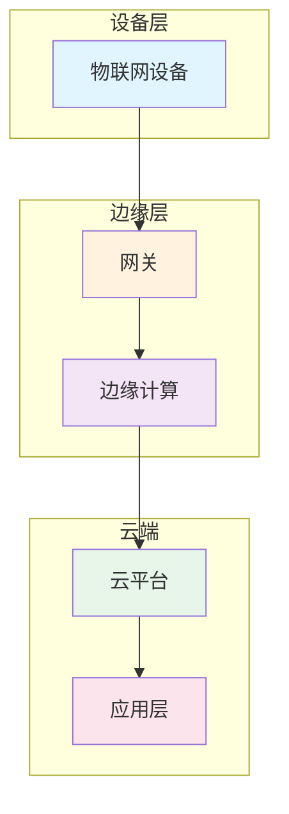
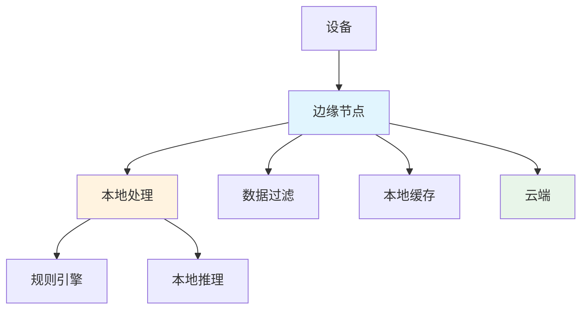
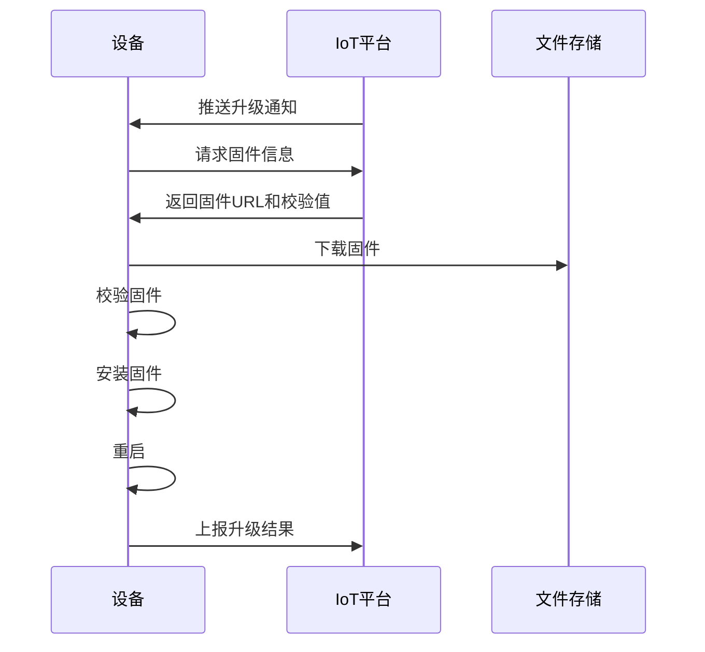

# Go物联网（IoT）开发完全指南

> **简介**: Go语言在物联网领域的完整实践，涵盖设备管理、数据采集、边缘计算、协议适配等核心场景

---

## 📚 目录

- [Go物联网（IoT）开发完全指南](#go物联网iot开发完全指南)
  - [📚 目录](#-目录)
  - [1. 物联网架构概述](#1-物联网架构概述)
    - [典型物联网架构](#典型物联网架构)
    - [Go在IoT中的优势](#go在iot中的优势)
  - [2. 设备接入与管理](#2-设备接入与管理)
    - [设备注册与认证](#设备注册与认证)
    - [设备生命周期管理](#设备生命周期管理)
  - [3. 通信协议实现](#3-通信协议实现)
    - [MQTT协议](#mqtt协议)
    - [CoAP协议](#coap协议)
    - [LoRaWAN协议](#lorawan协议)
  - [4. 数据采集与处理](#4-数据采集与处理)
    - [实时数据采集](#实时数据采集)
    - [数据聚合与清洗](#数据聚合与清洗)
    - [时序数据存储](#时序数据存储)
  - [5. 边缘计算](#5-边缘计算)
    - [边缘节点架构](#边缘节点架构)
    - [边缘计算实现](#边缘计算实现)
  - [6. 设备影子（Device Shadow）](#6-设备影子device-shadow)
    - [设备影子概念](#设备影子概念)
    - [设备影子实现](#设备影子实现)
  - [7. OTA升级](#7-ota升级)
    - [OTA升级流程](#ota升级流程)
    - [实现示例](#实现示例)
  - [8. 安全与权限](#8-安全与权限)
    - [设备身份认证](#设备身份认证)
    - [通信加密](#通信加密)
  - [9. 监控与运维](#9-监控与运维)
    - [设备监控](#设备监控)
    - [告警管理](#告警管理)
  - [10. 实战项目：智能家居网关](#10-实战项目智能家居网关)
    - [项目架构](#项目架构)
    - [核心实现](#核心实现)
  - [11. 最佳实践](#11-最佳实践)
  - [12. 开源项目推荐](#12-开源项目推荐)

---

## 1. 物联网架构概述

### 典型物联网架构



### Go在IoT中的优势

- ✅ **轻量级**: 单一二进制文件，适合嵌入式部署
- ✅ **高性能**: 原生并发支持，高效处理海量设备连接
- ✅ **跨平台**: 支持ARM、MIPS等嵌入式架构
- ✅ **内存安全**: 自动垃圾回收，减少内存泄漏
- ✅ **网络库丰富**: 完善的网络协议支持

---

## 2. 设备接入与管理

### 设备注册与认证

```go
package device

import (
    "crypto/rand"
    "crypto/sha256"
    "encoding/hex"
    "time"
)

// Device 设备模型
type Device struct {
    ID           string    `json:"id"`
    Name         string    `json:"name"`
    Type         string    `json:"type"`
    Secret       string    `json:"secret"`
    Status       string    `json:"status"`
    LastSeen     time.Time `json:"last_seen"`
    Attributes   map[string]interface{} `json:"attributes"`
}

// DeviceRegistry 设备注册管理
type DeviceRegistry struct {
    devices map[string]*Device
}

func NewDeviceRegistry() *DeviceRegistry {
    return &DeviceRegistry{
        devices: make(map[string]*Device),
    }
}

// Register 注册新设备
func (r *DeviceRegistry) Register(name, deviceType string) (*Device, error) {
    deviceID := generateDeviceID()
    secret := generateSecret()
    
    device := &Device{
        ID:         deviceID,
        Name:       name,
        Type:       deviceType,
        Secret:     secret,
        Status:     "inactive",
        Attributes: make(map[string]interface{}),
    }
    
    r.devices[deviceID] = device
    return device, nil
}

// Authenticate 设备认证
func (r *DeviceRegistry) Authenticate(deviceID, secret string) bool {
    device, exists := r.devices[deviceID]
    if !exists {
        return false
    }
    
    return device.Secret == secret
}

// UpdateStatus 更新设备状态
func (r *DeviceRegistry) UpdateStatus(deviceID, status string) error {
    device, exists := r.devices[deviceID]
    if !exists {
        return ErrDeviceNotFound
    }
    
    device.Status = status
    device.LastSeen = time.Now()
    return nil
}

func generateDeviceID() string {
    b := make([]byte, 16)
    rand.Read(b)
    return hex.EncodeToString(b)
}

func generateSecret() string {
    b := make([]byte, 32)
    rand.Read(b)
    hash := sha256.Sum256(b)
    return hex.EncodeToString(hash[:])
}
```

### 设备生命周期管理

```go
// DeviceLifecycleManager 设备生命周期管理
type DeviceLifecycleManager struct {
    registry *DeviceRegistry
    events   chan DeviceEvent
}

type DeviceEvent struct {
    DeviceID string
    Type     string // "online", "offline", "error"
    Time     time.Time
    Data     map[string]interface{}
}

func NewDeviceLifecycleManager(registry *DeviceRegistry) *DeviceLifecycleManager {
    return &DeviceLifecycleManager{
        registry: registry,
        events:   make(chan DeviceEvent, 1000),
    }
}

// Start 启动生命周期管理
func (m *DeviceLifecycleManager) Start() {
    go m.processEvents()
    go m.healthCheck()
}

func (m *DeviceLifecycleManager) processEvents() {
    for event := range m.events {
        switch event.Type {
        case "online":
            m.handleDeviceOnline(event)
        case "offline":
            m.handleDeviceOffline(event)
        case "error":
            m.handleDeviceError(event)
        }
    }
}

func (m *DeviceLifecycleManager) healthCheck() {
    ticker := time.NewTicker(30 * time.Second)
    defer ticker.Stop()
    
    for range ticker.C {
        for _, device := range m.registry.devices {
            if time.Since(device.LastSeen) > 5*time.Minute {
                m.events <- DeviceEvent{
                    DeviceID: device.ID,
                    Type:     "offline",
                    Time:     time.Now(),
                }
            }
        }
    }
}

func (m *DeviceLifecycleManager) handleDeviceOnline(event DeviceEvent) {
    m.registry.UpdateStatus(event.DeviceID, "online")
    log.Printf("Device %s is online", event.DeviceID)
}

func (m *DeviceLifecycleManager) handleDeviceOffline(event DeviceEvent) {
    m.registry.UpdateStatus(event.DeviceID, "offline")
    log.Printf("Device %s is offline", event.DeviceID)
}

func (m *DeviceLifecycleManager) handleDeviceError(event DeviceEvent) {
    m.registry.UpdateStatus(event.DeviceID, "error")
    log.Printf("Device %s has error: %v", event.DeviceID, event.Data)
}
```

---

## 3. 通信协议实现

### MQTT协议

```go
package mqtt

import (
    "fmt"
    "time"
    
    mqtt "github.com/eclipse/paho.mqtt.golang"
)

// MQTTClient MQTT客户端封装
type MQTTClient struct {
    client  mqtt.Client
    options *mqtt.ClientOptions
}

// NewMQTTClient 创建MQTT客户端
func NewMQTTClient(broker, clientID string) *MQTTClient {
    opts := mqtt.NewClientOptions()
    opts.AddBroker(broker)
    opts.SetClientID(clientID)
    opts.SetKeepAlive(60 * time.Second)
    opts.SetPingTimeout(1 * time.Second)
    opts.SetAutoReconnect(true)
    
    // 连接回调
    opts.SetOnConnectHandler(func(client mqtt.Client) {
        log.Println("MQTT Connected")
    })
    
    // 连接丢失回调
    opts.SetConnectionLostHandler(func(client mqtt.Client, err error) {
        log.Printf("MQTT Connection Lost: %v", err)
    })
    
    client := mqtt.NewClient(opts)
    
    return &MQTTClient{
        client:  client,
        options: opts,
    }
}

// Connect 连接到MQTT Broker
func (c *MQTTClient) Connect() error {
    token := c.client.Connect()
    token.Wait()
    return token.Error()
}

// Publish 发布消息
func (c *MQTTClient) Publish(topic string, qos byte, payload interface{}) error {
    token := c.client.Publish(topic, qos, false, payload)
    token.Wait()
    return token.Error()
}

// Subscribe 订阅主题
func (c *MQTTClient) Subscribe(topic string, qos byte, callback mqtt.MessageHandler) error {
    token := c.client.Subscribe(topic, qos, callback)
    token.Wait()
    return token.Error()
}

// 设备消息处理示例
type DeviceMQTTHandler struct {
    client *MQTTClient
}

func NewDeviceMQTTHandler(broker, clientID string) *DeviceMQTTHandler {
    return &DeviceMQTTHandler{
        client: NewMQTTClient(broker, clientID),
    }
}

func (h *DeviceMQTTHandler) Start() error {
    if err := h.client.Connect(); err != nil {
        return err
    }
    
    // 订阅设备数据上报主题
    h.client.Subscribe("device/+/data", 1, h.handleDeviceData)
    
    // 订阅设备状态主题
    h.client.Subscribe("device/+/status", 1, h.handleDeviceStatus)
    
    return nil
}

func (h *DeviceMQTTHandler) handleDeviceData(client mqtt.Client, msg mqtt.Message) {
    log.Printf("Received data from %s: %s", msg.Topic(), msg.Payload())
    
    // 解析设备数据
    var data map[string]interface{}
    if err := json.Unmarshal(msg.Payload(), &data); err != nil {
        log.Printf("Failed to parse device data: %v", err)
        return
    }
    
    // 处理设备数据
    // ...
}

func (h *DeviceMQTTHandler) handleDeviceStatus(client mqtt.Client, msg mqtt.Message) {
    log.Printf("Device status update: %s", msg.Payload())
}

// SendCommand 向设备发送命令
func (h *DeviceMQTTHandler) SendCommand(deviceID string, command map[string]interface{}) error {
    topic := fmt.Sprintf("device/%s/command", deviceID)
    payload, _ := json.Marshal(command)
    return h.client.Publish(topic, 1, payload)
}
```

### CoAP协议

```go
package coap

import (
    "github.com/plgd-dev/go-coap/v2/udp"
    "github.com/plgd-dev/go-coap/v2/message"
)

// CoAPServer CoAP服务器
type CoAPServer struct {
    address string
}

func NewCoAPServer(address string) *CoAPServer {
    return &CoAPServer{address: address}
}

func (s *CoAPServer) Start() error {
    return udp.ListenAndServe("udp", s.address, s.handleRequest)
}

func (s *CoAPServer) handleRequest(w udp.ResponseWriter, r *udp.Message) {
    path, _ := r.Options.Path()
    
    switch path {
    case "/temperature":
        s.handleTemperature(w, r)
    case "/humidity":
        s.handleHumidity(w, r)
    default:
        w.SetResponse(message.NotFound, message.TextPlain, nil)
    }
}

func (s *CoAPServer) handleTemperature(w udp.ResponseWriter, r *udp.Message) {
    // 处理温度数据上报
    log.Printf("Temperature data: %s", r.Body)
    
    w.SetResponse(message.Changed, message.TextPlain, []byte("OK"))
}

func (s *CoAPServer) handleHumidity(w udp.ResponseWriter, r *udp.Message) {
    // 处理湿度数据上报
    log.Printf("Humidity data: %s", r.Body)
    
    w.SetResponse(message.Changed, message.TextPlain, []byte("OK"))
}
```

### LoRaWAN协议

```go
package lorawan

import (
    "github.com/brocaar/chirpstack-api/go/v3/as"
    "github.com/brocaar/lorawan"
)

// LoRaWANHandler LoRaWAN消息处理器
type LoRaWANHandler struct {
    appKey lorawan.AES128Key
}

func NewLoRaWANHandler(appKey string) *LoRaWANHandler {
    var key lorawan.AES128Key
    copy(key[:], appKey)
    
    return &LoRaWANHandler{appKey: key}
}

// HandleUplink 处理上行消息
func (h *LoRaWANHandler) HandleUplink(req *as.HandleUplinkDataRequest) error {
    // 解密消息
    payload := req.GetData()
    
    log.Printf("Received uplink from device %s: %x", 
        req.DevEUI, payload)
    
    // 处理设备数据
    // ...
    
    return nil
}

// SendDownlink 发送下行消息
func (h *LoRaWANHandler) SendDownlink(devEUI string, data []byte) error {
    // 构造下行消息
    // ...
    
    return nil
}
```

---

## 4. 数据采集与处理

### 实时数据采集

```go
package collector

import (
    "context"
    "sync"
    "time"
)

// DataPoint 数据点
type DataPoint struct {
    DeviceID  string                 `json:"device_id"`
    Timestamp time.Time              `json:"timestamp"`
    Metrics   map[string]interface{} `json:"metrics"`
}

// DataCollector 数据采集器
type DataCollector struct {
    buffer   chan DataPoint
    handlers []DataHandler
    mu       sync.RWMutex
}

type DataHandler interface {
    Handle(ctx context.Context, data DataPoint) error
}

func NewDataCollector(bufferSize int) *DataCollector {
    return &DataCollector{
        buffer:   make(chan DataPoint, bufferSize),
        handlers: make([]DataHandler, 0),
    }
}

// AddHandler 添加数据处理器
func (c *DataCollector) AddHandler(handler DataHandler) {
    c.mu.Lock()
    defer c.mu.Unlock()
    c.handlers = append(c.handlers, handler)
}

// Collect 采集数据
func (c *DataCollector) Collect(data DataPoint) {
    select {
    case c.buffer <- data:
    default:
        log.Println("Buffer full, dropping data point")
    }
}

// Start 启动数据处理
func (c *DataCollector) Start(ctx context.Context) {
    for i := 0; i < 10; i++ {
        go c.worker(ctx)
    }
}

func (c *DataCollector) worker(ctx context.Context) {
    for {
        select {
        case <-ctx.Done():
            return
        case data := <-c.buffer:
            c.processData(ctx, data)
        }
    }
}

func (c *DataCollector) processData(ctx context.Context, data DataPoint) {
    c.mu.RLock()
    handlers := c.handlers
    c.mu.RUnlock()
    
    for _, handler := range handlers {
        if err := handler.Handle(ctx, data); err != nil {
            log.Printf("Handler error: %v", err)
        }
    }
}
```

### 数据聚合与清洗

```go
// DataAggregator 数据聚合器
type DataAggregator struct {
    window    time.Duration
    data      map[string][]DataPoint
    mu        sync.Mutex
}

func NewDataAggregator(window time.Duration) *DataAggregator {
    agg := &DataAggregator{
        window: window,
        data:   make(map[string][]DataPoint),
    }
    
    go agg.periodicFlush()
    return agg
}

func (a *DataAggregator) Handle(ctx context.Context, data DataPoint) error {
    a.mu.Lock()
    defer a.mu.Unlock()
    
    a.data[data.DeviceID] = append(a.data[data.DeviceID], data)
    return nil
}

func (a *DataAggregator) periodicFlush() {
    ticker := time.NewTicker(a.window)
    defer ticker.Stop()
    
    for range ticker.C {
        a.flush()
    }
}

func (a *DataAggregator) flush() {
    a.mu.Lock()
    data := a.data
    a.data = make(map[string][]DataPoint)
    a.mu.Unlock()
    
    for deviceID, points := range data {
        aggregated := a.aggregate(points)
        log.Printf("Aggregated data for device %s: %v", deviceID, aggregated)
    }
}

func (a *DataAggregator) aggregate(points []DataPoint) map[string]interface{} {
    result := make(map[string]interface{})
    
    if len(points) == 0 {
        return result
    }
    
    // 计算平均值
    for key := range points[0].Metrics {
        sum := 0.0
        count := 0
        
        for _, point := range points {
            if val, ok := point.Metrics[key].(float64); ok {
                sum += val
                count++
            }
        }
        
        if count > 0 {
            result[key+"_avg"] = sum / float64(count)
        }
    }
    
    return result
}
```

### 时序数据存储

```go
package storage

import (
    "context"
    "time"
    
    influxdb2 "github.com/influxdata/influxdb-client-go/v2"
)

// TimeSeriesDB 时序数据库封装
type TimeSeriesDB struct {
    client influxdb2.Client
    org    string
    bucket string
}

func NewTimeSeriesDB(url, token, org, bucket string) *TimeSeriesDB {
    client := influxdb2.NewClient(url, token)
    
    return &TimeSeriesDB{
        client: client,
        org:    org,
        bucket: bucket,
    }
}

// Write 写入数据
func (db *TimeSeriesDB) Write(ctx context.Context, data DataPoint) error {
    writeAPI := db.client.WriteAPIBlocking(db.org, db.bucket)
    
    p := influxdb2.NewPoint(
        "device_metrics",
        map[string]string{
            "device_id": data.DeviceID,
        },
        data.Metrics,
        data.Timestamp,
    )
    
    return writeAPI.WritePoint(ctx, p)
}

// Query 查询数据
func (db *TimeSeriesDB) Query(ctx context.Context, deviceID string, start, end time.Time) ([]DataPoint, error) {
    queryAPI := db.client.QueryAPI(db.org)
    
    query := fmt.Sprintf(`
        from(bucket: "%s")
        |> range(start: %s, stop: %s)
        |> filter(fn: (r) => r["device_id"] == "%s")
    `, db.bucket, start.Format(time.RFC3339), end.Format(time.RFC3339), deviceID)
    
    result, err := queryAPI.Query(ctx, query)
    if err != nil {
        return nil, err
    }
    
    var points []DataPoint
    for result.Next() {
        // 解析结果
        // ...
    }
    
    return points, nil
}

func (db *TimeSeriesDB) Close() {
    db.client.Close()
}
```

---

## 5. 边缘计算

### 边缘节点架构



### 边缘计算实现

```go
package edge

import (
    "context"
    "sync"
)

// EdgeNode 边缘计算节点
type EdgeNode struct {
    id            string
    ruleEngine    *RuleEngine
    localCache    *LocalCache
    cloudUploader *CloudUploader
    mu            sync.RWMutex
}

func NewEdgeNode(id string) *EdgeNode {
    return &EdgeNode{
        id:            id,
        ruleEngine:    NewRuleEngine(),
        localCache:    NewLocalCache(),
        cloudUploader: NewCloudUploader(),
    }
}

// ProcessData 处理设备数据
func (n *EdgeNode) ProcessData(ctx context.Context, data DataPoint) error {
    // 1. 本地规则处理
    actions := n.ruleEngine.Evaluate(data)
    for _, action := range actions {
        if err := action.Execute(ctx); err != nil {
            log.Printf("Action execution failed: %v", err)
        }
    }
    
    // 2. 数据过滤和聚合
    if n.shouldUpload(data) {
        n.cloudUploader.Upload(ctx, data)
    }
    
    // 3. 本地缓存
    n.localCache.Store(data)
    
    return nil
}

func (n *EdgeNode) shouldUpload(data DataPoint) bool {
    // 根据规则判断是否需要上传到云端
    return true
}

// RuleEngine 规则引擎
type RuleEngine struct {
    rules []Rule
    mu    sync.RWMutex
}

type Rule interface {
    Match(data DataPoint) bool
    GetActions() []Action
}

type Action interface {
    Execute(ctx context.Context) error
}

func NewRuleEngine() *RuleEngine {
    return &RuleEngine{
        rules: make([]Rule, 0),
    }
}

func (e *RuleEngine) AddRule(rule Rule) {
    e.mu.Lock()
    defer e.mu.Unlock()
    e.rules = append(e.rules, rule)
}

func (e *RuleEngine) Evaluate(data DataPoint) []Action {
    e.mu.RLock()
    defer e.mu.RUnlock()
    
    var actions []Action
    for _, rule := range e.rules {
        if rule.Match(data) {
            actions = append(actions, rule.GetActions()...)
        }
    }
    
    return actions
}

// 温度告警规则示例
type TemperatureAlertRule struct {
    threshold float64
}

func (r *TemperatureAlertRule) Match(data DataPoint) bool {
    if temp, ok := data.Metrics["temperature"].(float64); ok {
        return temp > r.threshold
    }
    return false
}

func (r *TemperatureAlertRule) GetActions() []Action {
    return []Action{
        &SendAlertAction{message: "Temperature too high!"},
    }
}

type SendAlertAction struct {
    message string
}

func (a *SendAlertAction) Execute(ctx context.Context) error {
    log.Printf("ALERT: %s", a.message)
    // 发送告警通知
    return nil
}
```

---

## 6. 设备影子（Device Shadow）

### 设备影子概念

设备影子是设备在云端的虚拟表示，用于：

- 保存设备最新状态
- 处理设备离线时的命令
- 同步设备期望状态和实际状态

### 设备影子实现

```go
package shadow

import (
    "encoding/json"
    "sync"
    "time"
)

// DeviceShadow 设备影子
type DeviceShadow struct {
    DeviceID  string                 `json:"device_id"`
    State     ShadowState            `json:"state"`
    Metadata  map[string]interface{} `json:"metadata"`
    Version   int64                  `json:"version"`
    Timestamp time.Time              `json:"timestamp"`
}

type ShadowState struct {
    Reported map[string]interface{} `json:"reported"` // 设备上报的状态
    Desired  map[string]interface{} `json:"desired"`  // 期望的状态
    Delta    map[string]interface{} `json:"delta"`    // 差异
}

// ShadowManager 设备影子管理器
type ShadowManager struct {
    shadows map[string]*DeviceShadow
    mu      sync.RWMutex
}

func NewShadowManager() *ShadowManager {
    return &ShadowManager{
        shadows: make(map[string]*DeviceShadow),
    }
}

// UpdateReported 更新设备上报状态
func (m *ShadowManager) UpdateReported(deviceID string, reported map[string]interface{}) error {
    m.mu.Lock()
    defer m.mu.Unlock()
    
    shadow, exists := m.shadows[deviceID]
    if !exists {
        shadow = &DeviceShadow{
            DeviceID: deviceID,
            State: ShadowState{
                Reported: make(map[string]interface{}),
                Desired:  make(map[string]interface{}),
                Delta:    make(map[string]interface{}),
            },
            Metadata: make(map[string]interface{}),
        }
        m.shadows[deviceID] = shadow
    }
    
    // 更新上报状态
    for key, value := range reported {
        shadow.State.Reported[key] = value
    }
    
    // 计算差异
    shadow.State.Delta = m.calculateDelta(shadow.State.Desired, shadow.State.Reported)
    
    shadow.Version++
    shadow.Timestamp = time.Now()
    
    return nil
}

// UpdateDesired 更新期望状态
func (m *ShadowManager) UpdateDesired(deviceID string, desired map[string]interface{}) error {
    m.mu.Lock()
    defer m.mu.Unlock()
    
    shadow, exists := m.shadows[deviceID]
    if !exists {
        shadow = &DeviceShadow{
            DeviceID: deviceID,
            State: ShadowState{
                Reported: make(map[string]interface{}),
                Desired:  make(map[string]interface{}),
                Delta:    make(map[string]interface{}),
            },
            Metadata: make(map[string]interface{}),
        }
        m.shadows[deviceID] = shadow
    }
    
    // 更新期望状态
    for key, value := range desired {
        shadow.State.Desired[key] = value
    }
    
    // 计算差异
    shadow.State.Delta = m.calculateDelta(shadow.State.Desired, shadow.State.Reported)
    
    shadow.Version++
    shadow.Timestamp = time.Now()
    
    return nil
}

// GetShadow 获取设备影子
func (m *ShadowManager) GetShadow(deviceID string) (*DeviceShadow, error) {
    m.mu.RLock()
    defer m.mu.RUnlock()
    
    shadow, exists := m.shadows[deviceID]
    if !exists {
        return nil, ErrShadowNotFound
    }
    
    return shadow, nil
}

func (m *ShadowManager) calculateDelta(desired, reported map[string]interface{}) map[string]interface{} {
    delta := make(map[string]interface{})
    
    for key, desiredValue := range desired {
        if reportedValue, exists := reported[key]; !exists || !equal(desiredValue, reportedValue) {
            delta[key] = desiredValue
        }
    }
    
    return delta
}

func equal(a, b interface{}) bool {
    aJSON, _ := json.Marshal(a)
    bJSON, _ := json.Marshal(b)
    return string(aJSON) == string(bJSON)
}
```

---

## 7. OTA升级

### OTA升级流程



### 实现示例

```go
package ota

import (
    "crypto/sha256"
    "encoding/hex"
    "io"
    "net/http"
    "os"
)

// OTAManager OTA升级管理器
type OTAManager struct {
    storage FirmwareStorage
}

type FirmwareStorage interface {
    GetFirmwareURL(version string) (string, error)
    GetChecksum(version string) (string, error)
}

func NewOTAManager(storage FirmwareStorage) *OTAManager {
    return &OTAManager{storage: storage}
}

// PushUpgrade 推送升级
func (m *OTAManager) PushUpgrade(deviceID, version string) error {
    url, err := m.storage.GetFirmwareURL(version)
    if err != nil {
        return err
    }
    
    checksum, err := m.storage.GetChecksum(version)
    if err != nil {
        return err
    }
    
    // 通过MQTT发送升级通知
    notification := map[string]interface{}{
        "type":     "ota_upgrade",
        "version":  version,
        "url":      url,
        "checksum": checksum,
    }
    
    // 发送到设备
    // ...
    
    return nil
}

// DeviceOTAClient 设备端OTA客户端
type DeviceOTAClient struct {
    currentVersion string
}

func NewDeviceOTAClient(version string) *DeviceOTAClient {
    return &DeviceOTAClient{
        currentVersion: version,
    }
}

// HandleUpgradeNotification 处理升级通知
func (c *DeviceOTAClient) HandleUpgradeNotification(notification map[string]interface{}) error {
    version := notification["version"].(string)
    url := notification["url"].(string)
    expectedChecksum := notification["checksum"].(string)
    
    log.Printf("Received OTA upgrade notification: version=%s", version)
    
    // 1. 下载固件
    firmwareFile := "/tmp/firmware.bin"
    if err := c.downloadFirmware(url, firmwareFile); err != nil {
        return fmt.Errorf("download failed: %w", err)
    }
    
    // 2. 校验固件
    actualChecksum, err := c.calculateChecksum(firmwareFile)
    if err != nil {
        return fmt.Errorf("checksum calculation failed: %w", err)
    }
    
    if actualChecksum != expectedChecksum {
        return fmt.Errorf("checksum mismatch")
    }
    
    // 3. 安装固件
    if err := c.installFirmware(firmwareFile); err != nil {
        return fmt.Errorf("installation failed: %w", err)
    }
    
    // 4. 重启设备
    log.Println("Rebooting device...")
    return c.reboot()
}

func (c *DeviceOTAClient) downloadFirmware(url, dest string) error {
    resp, err := http.Get(url)
    if err != nil {
        return err
    }
    defer resp.Body.Close()
    
    out, err := os.Create(dest)
    if err != nil {
        return err
    }
    defer out.Close()
    
    _, err = io.Copy(out, resp.Body)
    return err
}

func (c *DeviceOTAClient) calculateChecksum(file string) (string, error) {
    f, err := os.Open(file)
    if err != nil {
        return "", err
    }
    defer f.Close()
    
    hash := sha256.New()
    if _, err := io.Copy(hash, f); err != nil {
        return "", err
    }
    
    return hex.EncodeToString(hash.Sum(nil)), nil
}

func (c *DeviceOTAClient) installFirmware(file string) error {
    // 安装固件的具体实现
    // ...
    return nil
}

func (c *DeviceOTAClient) reboot() error {
    // 重启设备的具体实现
    // ...
    return nil
}
```

---

## 8. 安全与权限

### 设备身份认证

```go
package security

import (
    "crypto/tls"
    "crypto/x509"
    "io/ioutil"
)

// TLSConfig TLS配置
func CreateTLSConfig(caCert, clientCert, clientKey string) (*tls.Config, error) {
    // 加载CA证书
    caCertPool := x509.NewCertPool()
    caCertBytes, err := ioutil.ReadFile(caCert)
    if err != nil {
        return nil, err
    }
    caCertPool.AppendCertsFromPEM(caCertBytes)
    
    // 加载客户端证书
    cert, err := tls.LoadX509KeyPair(clientCert, clientKey)
    if err != nil {
        return nil, err
    }
    
    return &tls.Config{
        RootCAs:      caCertPool,
        Certificates: []tls.Certificate{cert},
        MinVersion:   tls.VersionTLS12,
    }, nil
}

// TokenAuth Token认证
type TokenAuth struct {
    tokens map[string]string // deviceID -> token
}

func NewTokenAuth() *TokenAuth {
    return &TokenAuth{
        tokens: make(map[string]string),
    }
}

func (a *TokenAuth) Authenticate(deviceID, token string) bool {
    expectedToken, exists := a.tokens[deviceID]
    return exists && expectedToken == token
}
```

### 通信加密

```go
// DataEncryption 数据加密
type DataEncryption struct {
    key []byte
}

func NewDataEncryption(key []byte) *DataEncryption {
    return &DataEncryption{key: key}
}

func (e *DataEncryption) Encrypt(data []byte) ([]byte, error) {
    block, err := aes.NewCipher(e.key)
    if err != nil {
        return nil, err
    }
    
    gcm, err := cipher.NewGCM(block)
    if err != nil {
        return nil, err
    }
    
    nonce := make([]byte, gcm.NonceSize())
    if _, err := io.ReadFull(rand.Reader, nonce); err != nil {
        return nil, err
    }
    
    return gcm.Seal(nonce, nonce, data, nil), nil
}

func (e *DataEncryption) Decrypt(data []byte) ([]byte, error) {
    block, err := aes.NewCipher(e.key)
    if err != nil {
        return nil, err
    }
    
    gcm, err := cipher.NewGCM(block)
    if err != nil {
        return nil, err
    }
    
    nonceSize := gcm.NonceSize()
    if len(data) < nonceSize {
        return nil, errors.New("ciphertext too short")
    }
    
    nonce, ciphertext := data[:nonceSize], data[nonceSize:]
    return gcm.Open(nil, nonce, ciphertext, nil)
}
```

---

## 9. 监控与运维

### 设备监控

```go
package monitoring

import (
    "time"
    
    "github.com/prometheus/client_golang/prometheus"
)

// DeviceMetrics 设备监控指标
type DeviceMetrics struct {
    deviceCount   prometheus.Gauge
    messageCount  *prometheus.CounterVec
    messageLatency *prometheus.HistogramVec
}

func NewDeviceMetrics() *DeviceMetrics {
    metrics := &DeviceMetrics{
        deviceCount: prometheus.NewGauge(prometheus.GaugeOpts{
            Name: "iot_device_count",
            Help: "Number of connected devices",
        }),
        messageCount: prometheus.NewCounterVec(
            prometheus.CounterOpts{
                Name: "iot_message_count",
                Help: "Number of messages processed",
            },
            []string{"device_type", "status"},
        ),
        messageLatency: prometheus.NewHistogramVec(
            prometheus.HistogramOpts{
                Name:    "iot_message_latency_seconds",
                Help:    "Message processing latency",
                Buckets: prometheus.DefBuckets,
            },
            []string{"device_type"},
        ),
    }
    
    prometheus.MustRegister(
        metrics.deviceCount,
        metrics.messageCount,
        metrics.messageLatency,
    )
    
    return metrics
}

func (m *DeviceMetrics) RecordDeviceCount(count int) {
    m.deviceCount.Set(float64(count))
}

func (m *DeviceMetrics) RecordMessage(deviceType, status string, latency time.Duration) {
    m.messageCount.WithLabelValues(deviceType, status).Inc()
    m.messageLatency.WithLabelValues(deviceType).Observe(latency.Seconds())
}
```

### 告警管理

```go
// AlertManager 告警管理器
type AlertManager struct {
    rules   []AlertRule
    actions []AlertAction
}

type AlertRule interface {
    Check(metrics map[string]float64) bool
    GetMessage() string
}

type AlertAction interface {
    Send(message string) error
}

func NewAlertManager() *AlertManager {
    return &AlertManager{
        rules:   make([]AlertRule, 0),
        actions: make([]AlertAction, 0),
    }
}

func (m *AlertManager) AddRule(rule AlertRule) {
    m.rules = append(m.rules, rule)
}

func (m *AlertManager) AddAction(action AlertAction) {
    m.actions = append(m.actions, action)
}

func (m *AlertManager) Check(metrics map[string]float64) {
    for _, rule := range m.rules {
        if rule.Check(metrics) {
            m.sendAlert(rule.GetMessage())
        }
    }
}

func (m *AlertManager) sendAlert(message string) {
    for _, action := range m.actions {
        if err := action.Send(message); err != nil {
            log.Printf("Failed to send alert: %v", err)
        }
    }
}
```

---

## 10. 实战项目：智能家居网关

### 项目架构

```text
smart-home-gateway/
├── cmd/
│   └── gateway/
│       └── main.go
├── internal/
│   ├── device/
│   │   ├── registry.go
│   │   └── manager.go
│   ├── protocol/
│   │   ├── mqtt.go
│   │   ├── coap.go
│   │   └── zigbee.go
│   ├── rule/
│   │   └── engine.go
│   └── cloud/
│       └── uploader.go
├── pkg/
│   ├── storage/
│   └── security/
└── configs/
    └── config.yaml
```

### 核心实现

```go
// cmd/gateway/main.go
package main

import (
    "context"
    "log"
    "os"
    "os/signal"
    "syscall"
    
    "smart-home-gateway/internal/device"
    "smart-home-gateway/internal/protocol"
    "smart-home-gateway/internal/rule"
)

func main() {
    ctx, cancel := context.WithCancel(context.Background())
    defer cancel()
    
    // 初始化设备注册表
    registry := device.NewDeviceRegistry()
    
    // 初始化协议处理器
    mqttHandler := protocol.NewMQTTHandler("tcp://localhost:1883", "gateway-001")
    if err := mqttHandler.Start(); err != nil {
        log.Fatal(err)
    }
    
    // 初始化规则引擎
    ruleEngine := rule.NewRuleEngine()
    
    // 添加规则
    ruleEngine.AddRule(&rule.TemperatureAlertRule{
        Threshold: 30.0,
    })
    
    // 启动设备管理器
    manager := device.NewDeviceLifecycleManager(registry)
    manager.Start()
    
    log.Println("Smart Home Gateway started")
    
    // 等待中断信号
    sigCh := make(chan os.Signal, 1)
    signal.Notify(sigCh, syscall.SIGINT, syscall.SIGTERM)
    <-sigCh
    
    log.Println("Shutting down...")
}
```

---

## 11. 最佳实践

1. **设备管理**
   - ✅ 实现完整的设备生命周期管理
   - ✅ 使用设备影子处理离线场景
   - ✅ 定期健康检查，及时发现异常

2. **数据处理**
   - ✅ 边缘计算减少云端压力
   - ✅ 数据聚合降低网络开销
   - ✅ 使用时序数据库存储历史数据

3. **安全性**
   - ✅ 设备认证和授权
   - ✅ 数据传输加密
   - ✅ 定期更新证书

4. **可靠性**
   - ✅ 消息队列保证数据不丢失
   - ✅ 实现重试和错误恢复机制
   - ✅ 监控告警及时发现问题

5. **性能**
   - ✅ 使用连接池和协程池
   - ✅ 数据批量处理
   - ✅ 合理设置缓冲区大小

---

## 12. 开源项目推荐

1. **EdgeX Foundry**
   - 地址: <https://github.com/edgexfoundry>
   - 说明: 边缘计算物联网平台

2. **ThingsBoard**
   - 地址: <https://github.com/thingsboard/thingsboard>
   - 说明: 开源物联网平台

3. **Mainflux**
   - 地址: <https://github.com/mainflux/mainflux>
   - 说明: Go实现的工业物联网平台

4. **EMQX**
   - 地址: <https://github.com/emqx/emqx>
   - 说明: 高性能MQTT Broker

5. **Shifu**
   - 地址: <https://github.com/Edgenesis/shifu>
   - 说明: Kubernetes原生物联网开发框架

---

**文档维护者**: Go Documentation Team  
**最后更新**: 2025年10月24日  
**文档状态**: ✅ 完成  
**适用版本**: Go 1.21+
