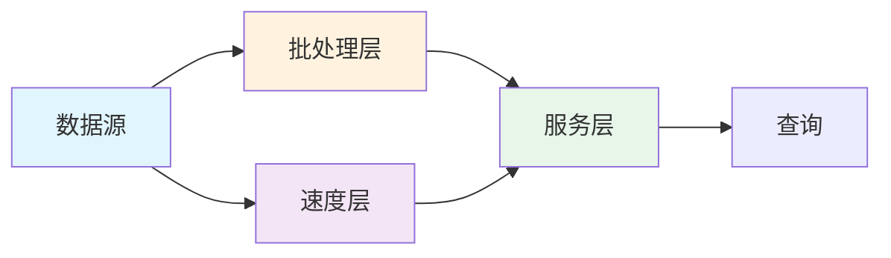
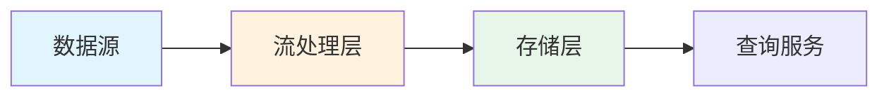
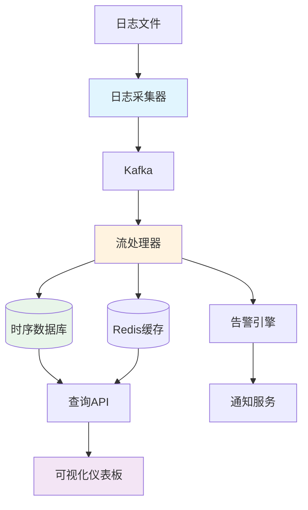

# Go大数据与分析完全指南

> **简介**: Go语言在大数据处理和分析领域的完整实践，涵盖数据管道、流处理、ETL、实时分析等核心场景

---

## 📚 目录

- [Go大数据与分析完全指南](#go大数据与分析完全指南)
  - [📚 目录](#-目录)
  - [1. 大数据架构概述](#1-大数据架构概述)
    - [Lambda架构](#lambda架构)
    - [Kappa架构](#kappa架构)
    - [Go在大数据中的优势](#go在大数据中的优势)
  - [2. 数据采集](#2-数据采集)
    - [日志采集](#日志采集)
    - [消息队列集成](#消息队列集成)
  - [3. 数据管道](#3-数据管道)
    - [ETL Pipeline](#etl-pipeline)
    - [数据转换](#数据转换)
  - [4. 流处理](#4-流处理)
    - [实时流处理框架](#实时流处理框架)
    - [窗口计算](#窗口计算)
  - [5. 批处理](#5-批处理)
    - [MapReduce实现](#mapreduce实现)
    - [批量数据处理](#批量数据处理)
  - [6. 数据存储](#6-数据存储)
    - [列式存储](#列式存储)
    - [时序数据库](#时序数据库)
    - [数据湖集成](#数据湖集成)
  - [7. 数据查询与分析](#7-数据查询与分析)
    - [SQL查询引擎](#sql查询引擎)
    - [聚合分析](#聚合分析)
  - [8. 实时计算](#8-实时计算)
    - [实时指标计算](#实时指标计算)
    - [实时告警](#实时告警)
  - [9. 数据可视化](#9-数据可视化)
    - [数据API](#数据api)
    - [图表生成](#图表生成)
  - [10. 实战项目：实时日志分析系统](#10-实战项目实时日志分析系统)
    - [系统架构](#系统架构)
    - [核心实现](#核心实现)
  - [11. 性能优化](#11-性能优化)
  - [12. 最佳实践](#12-最佳实践)
  - [13. 开源项目推荐](#13-开源项目推荐)

---

## 1. 大数据架构概述

### Lambda架构



### Kappa架构



### Go在大数据中的优势

- ✅ **高并发处理**: Goroutine轻松处理海量并发任务
- ✅ **低内存占用**: 相比Java/Scala更节省资源
- ✅ **快速启动**: 无需JVM预热，适合动态扩缩容
- ✅ **简单部署**: 单一二进制文件，易于容器化
- ✅ **优秀性能**: 接近C++的执行效率

---

## 2. 数据采集

### 日志采集

```go
package collector

import (
    "bufio"
    "context"
    "io"
    "os"
    "path/filepath"
    "sync"
    "time"
)

// LogCollector 日志采集器
type LogCollector struct {
    paths    []string
    output   chan<- LogEntry
    watchers map[string]*FileWatcher
    mu       sync.Mutex
}

type LogEntry struct {
    Timestamp time.Time         `json:"timestamp"`
    Source    string            `json:"source"`
    Level     string            `json:"level"`
    Message   string            `json:"message"`
    Fields    map[string]string `json:"fields"`
}

func NewLogCollector(paths []string, output chan<- LogEntry) *LogCollector {
    return &LogCollector{
        paths:    paths,
        output:   output,
        watchers: make(map[string]*FileWatcher),
    }
}

// Start 启动日志采集
func (c *LogCollector) Start(ctx context.Context) error {
    for _, path := range c.paths {
        matches, err := filepath.Glob(path)
        if err != nil {
            return err
        }
        
        for _, file := range matches {
            watcher := NewFileWatcher(file, c.output)
            c.watchers[file] = watcher
            go watcher.Watch(ctx)
        }
    }
    
    // 监控新文件
    go c.watchNewFiles(ctx)
    
    return nil
}

func (c *LogCollector) watchNewFiles(ctx context.Context) {
    ticker := time.NewTicker(10 * time.Second)
    defer ticker.Stop()
    
    for {
        select {
        case <-ctx.Done():
            return
        case <-ticker.C:
            c.checkNewFiles()
        }
    }
}

func (c *LogCollector) checkNewFiles() {
    c.mu.Lock()
    defer c.mu.Unlock()
    
    for _, pattern := range c.paths {
        matches, _ := filepath.Glob(pattern)
        for _, file := range matches {
            if _, exists := c.watchers[file]; !exists {
                watcher := NewFileWatcher(file, c.output)
                c.watchers[file] = watcher
                go watcher.Watch(context.Background())
            }
        }
    }
}

// FileWatcher 文件监控器
type FileWatcher struct {
    path   string
    output chan<- LogEntry
    offset int64
}

func NewFileWatcher(path string, output chan<- LogEntry) *FileWatcher {
    return &FileWatcher{
        path:   path,
        output: output,
        offset: 0,
    }
}

func (w *FileWatcher) Watch(ctx context.Context) {
    ticker := time.NewTicker(1 * time.Second)
    defer ticker.Stop()
    
    for {
        select {
        case <-ctx.Done():
            return
        case <-ticker.C:
            w.readNewLines()
        }
    }
}

func (w *FileWatcher) readNewLines() error {
    file, err := os.Open(w.path)
    if err != nil {
        return err
    }
    defer file.Close()
    
    // 获取文件大小
    info, err := file.Stat()
    if err != nil {
        return err
    }
    
    // 文件被截断或轮转
    if info.Size() < w.offset {
        w.offset = 0
    }
    
    // 跳转到上次读取位置
    file.Seek(w.offset, io.SeekStart)
    
    scanner := bufio.NewScanner(file)
    for scanner.Scan() {
        line := scanner.Text()
        entry := w.parseLine(line)
        
        select {
        case w.output <- entry:
            w.offset, _ = file.Seek(0, io.SeekCurrent)
        default:
            // 缓冲区满，等待
        }
    }
    
    return scanner.Err()
}

func (w *FileWatcher) parseLine(line string) LogEntry {
    // 简化的日志解析
    return LogEntry{
        Timestamp: time.Now(),
        Source:    w.path,
        Message:   line,
        Fields:    make(map[string]string),
    }
}
```

### 消息队列集成

```go
package mq

import (
    "context"
    "encoding/json"
    
    "github.com/Shopify/sarama"
)

// KafkaProducer Kafka生产者
type KafkaProducer struct {
    producer sarama.SyncProducer
    topic    string
}

func NewKafkaProducer(brokers []string, topic string) (*KafkaProducer, error) {
    config := sarama.NewConfig()
    config.Producer.RequiredAcks = sarama.WaitForAll
    config.Producer.Retry.Max = 5
    config.Producer.Return.Successes = true
    
    producer, err := sarama.NewSyncProducer(brokers, config)
    if err != nil {
        return nil, err
    }
    
    return &KafkaProducer{
        producer: producer,
        topic:    topic,
    }, nil
}

// Send 发送消息
func (p *KafkaProducer) Send(ctx context.Context, data interface{}) error {
    payload, err := json.Marshal(data)
    if err != nil {
        return err
    }
    
    msg := &sarama.ProducerMessage{
        Topic: p.topic,
        Value: sarama.ByteEncoder(payload),
    }
    
    _, _, err = p.producer.SendMessage(msg)
    return err
}

func (p *KafkaProducer) Close() error {
    return p.producer.Close()
}

// KafkaConsumer Kafka消费者
type KafkaConsumer struct {
    consumer sarama.ConsumerGroup
    topics   []string
    handler  ConsumerHandler
}

type ConsumerHandler interface {
    Handle(ctx context.Context, message []byte) error
}

func NewKafkaConsumer(brokers []string, groupID string, topics []string, handler ConsumerHandler) (*KafkaConsumer, error) {
    config := sarama.NewConfig()
    config.Consumer.Group.Rebalance.Strategy = sarama.BalanceStrategyRoundRobin
    config.Consumer.Offsets.Initial = sarama.OffsetOldest
    
    consumer, err := sarama.NewConsumerGroup(brokers, groupID, config)
    if err != nil {
        return nil, err
    }
    
    return &KafkaConsumer{
        consumer: consumer,
        topics:   topics,
        handler:  handler,
    }, nil
}

// Start 启动消费
func (c *KafkaConsumer) Start(ctx context.Context) error {
    for {
        if err := c.consumer.Consume(ctx, c.topics, c); err != nil {
            return err
        }
        
        if ctx.Err() != nil {
            return ctx.Err()
        }
    }
}

// Setup 实现sarama.ConsumerGroupHandler接口
func (c *KafkaConsumer) Setup(sarama.ConsumerGroupSession) error {
    return nil
}

func (c *KafkaConsumer) Cleanup(sarama.ConsumerGroupSession) error {
    return nil
}

func (c *KafkaConsumer) ConsumeClaim(session sarama.ConsumerGroupSession, claim sarama.ConsumerGroupClaim) error {
    for {
        select {
        case message := <-claim.Messages():
            if message == nil {
                return nil
            }
            
            if err := c.handler.Handle(session.Context(), message.Value); err != nil {
                log.Printf("Handler error: %v", err)
            }
            
            session.MarkMessage(message, "")
            
        case <-session.Context().Done():
            return nil
        }
    }
}
```

---

## 3. 数据管道

### ETL Pipeline

```go
package pipeline

import (
    "context"
    "sync"
)

// Pipeline 数据管道
type Pipeline struct {
    stages []Stage
}

type Stage interface {
    Process(ctx context.Context, input <-chan interface{}) <-chan interface{}
}

func NewPipeline(stages ...Stage) *Pipeline {
    return &Pipeline{stages: stages}
}

// Run 运行管道
func (p *Pipeline) Run(ctx context.Context, input <-chan interface{}) <-chan interface{} {
    output := input
    for _, stage := range p.stages {
        output = stage.Process(ctx, output)
    }
    return output
}

// ExtractStage 提取阶段
type ExtractStage struct {
    extractor Extractor
}

type Extractor interface {
    Extract(ctx context.Context) (<-chan interface{}, error)
}

func NewExtractStage(extractor Extractor) *ExtractStage {
    return &ExtractStage{extractor: extractor}
}

func (s *ExtractStage) Process(ctx context.Context, input <-chan interface{}) <-chan interface{} {
    output, _ := s.extractor.Extract(ctx)
    return output
}

// TransformStage 转换阶段
type TransformStage struct {
    transformer Transformer
    workers     int
}

type Transformer interface {
    Transform(ctx context.Context, data interface{}) (interface{}, error)
}

func NewTransformStage(transformer Transformer, workers int) *TransformStage {
    return &TransformStage{
        transformer: transformer,
        workers:     workers,
    }
}

func (s *TransformStage) Process(ctx context.Context, input <-chan interface{}) <-chan interface{} {
    output := make(chan interface{}, 100)
    
    var wg sync.WaitGroup
    for i := 0; i < s.workers; i++ {
        wg.Add(1)
        go func() {
            defer wg.Done()
            for data := range input {
                transformed, err := s.transformer.Transform(ctx, data)
                if err != nil {
                    log.Printf("Transform error: %v", err)
                    continue
                }
                
                select {
                case output <- transformed:
                case <-ctx.Done():
                    return
                }
            }
        }()
    }
    
    go func() {
        wg.Wait()
        close(output)
    }()
    
    return output
}

// LoadStage 加载阶段
type LoadStage struct {
    loader  Loader
    workers int
}

type Loader interface {
    Load(ctx context.Context, data interface{}) error
}

func NewLoadStage(loader Loader, workers int) *LoadStage {
    return &LoadStage{
        loader:  loader,
        workers: workers,
    }
}

func (s *LoadStage) Process(ctx context.Context, input <-chan interface{}) <-chan interface{} {
    output := make(chan interface{}, 100)
    
    var wg sync.WaitGroup
    for i := 0; i < s.workers; i++ {
        wg.Add(1)
        go func() {
            defer wg.Done()
            for data := range input {
                if err := s.loader.Load(ctx, data); err != nil {
                    log.Printf("Load error: %v", err)
                }
                
                select {
                case output <- data:
                case <-ctx.Done():
                    return
                }
            }
        }()
    }
    
    go func() {
        wg.Wait()
        close(output)
    }()
    
    return output
}
```

### 数据转换

```go
// JSONTransformer JSON数据转换器
type JSONTransformer struct {
    mapping map[string]string
}

func NewJSONTransformer(mapping map[string]string) *JSONTransformer {
    return &JSONTransformer{mapping: mapping}
}

func (t *JSONTransformer) Transform(ctx context.Context, data interface{}) (interface{}, error) {
    input, ok := data.(map[string]interface{})
    if !ok {
        return nil, errors.New("invalid input type")
    }
    
    output := make(map[string]interface{})
    for oldKey, newKey := range t.mapping {
        if value, exists := input[oldKey]; exists {
            output[newKey] = value
        }
    }
    
    return output, nil
}

// FilterTransformer 过滤转换器
type FilterTransformer struct {
    predicate func(interface{}) bool
}

func NewFilterTransformer(predicate func(interface{}) bool) *FilterTransformer {
    return &FilterTransformer{predicate: predicate}
}

func (t *FilterTransformer) Transform(ctx context.Context, data interface{}) (interface{}, error) {
    if t.predicate(data) {
        return data, nil
    }
    return nil, errors.New("filtered out")
}

// EnrichTransformer 数据增强转换器
type EnrichTransformer struct {
    enricher func(interface{}) (interface{}, error)
}

func NewEnrichTransformer(enricher func(interface{}) (interface{}, error)) *EnrichTransformer {
    return &EnrichTransformer{enricher: enricher}
}

func (t *EnrichTransformer) Transform(ctx context.Context, data interface{}) (interface{}, error) {
    return t.enricher(data)
}
```

---

## 4. 流处理

### 实时流处理框架

```go
package stream

import (
    "context"
    "sync"
    "time"
)

// Stream 数据流
type Stream struct {
    source <-chan Event
    ops    []Operator
}

type Event struct {
    Timestamp time.Time
    Data      interface{}
    Key       string
}

type Operator interface {
    Apply(ctx context.Context, input <-chan Event) <-chan Event
}

func NewStream(source <-chan Event) *Stream {
    return &Stream{
        source: source,
        ops:    make([]Operator, 0),
    }
}

// Map 映射操作
func (s *Stream) Map(fn func(Event) Event) *Stream {
    s.ops = append(s.ops, &MapOperator{fn: fn})
    return s
}

// Filter 过滤操作
func (s *Stream) Filter(fn func(Event) bool) *Stream {
    s.ops = append(s.ops, &FilterOperator{fn: fn})
    return s
}

// Window 窗口操作
func (s *Stream) Window(size time.Duration) *Stream {
    s.ops = append(s.ops, NewWindowOperator(size))
    return s
}

// Reduce 聚合操作
func (s *Stream) Reduce(fn func([]Event) Event) *Stream {
    s.ops = append(s.ops, &ReduceOperator{fn: fn})
    return s
}

// Execute 执行流处理
func (s *Stream) Execute(ctx context.Context) <-chan Event {
    output := s.source
    for _, op := range s.ops {
        output = op.Apply(ctx, output)
    }
    return output
}

// MapOperator 映射操作符
type MapOperator struct {
    fn func(Event) Event
}

func (o *MapOperator) Apply(ctx context.Context, input <-chan Event) <-chan Event {
    output := make(chan Event, 100)
    
    go func() {
        defer close(output)
        for {
            select {
            case <-ctx.Done():
                return
            case event, ok := <-input:
                if !ok {
                    return
                }
                
                result := o.fn(event)
                select {
                case output <- result:
                case <-ctx.Done():
                    return
                }
            }
        }
    }()
    
    return output
}

// FilterOperator 过滤操作符
type FilterOperator struct {
    fn func(Event) bool
}

func (o *FilterOperator) Apply(ctx context.Context, input <-chan Event) <-chan Event {
    output := make(chan Event, 100)
    
    go func() {
        defer close(output)
        for {
            select {
            case <-ctx.Done():
                return
            case event, ok := <-input:
                if !ok {
                    return
                }
                
                if o.fn(event) {
                    select {
                    case output <- event:
                    case <-ctx.Done():
                        return
                    }
                }
            }
        }
    }()
    
    return output
}
```

### 窗口计算

```go
// WindowOperator 窗口操作符
type WindowOperator struct {
    size   time.Duration
    buffer map[string][]Event
    mu     sync.Mutex
}

func NewWindowOperator(size time.Duration) *WindowOperator {
    op := &WindowOperator{
        size:   size,
        buffer: make(map[string][]Event),
    }
    
    go op.periodicFlush()
    return op
}

func (o *WindowOperator) Apply(ctx context.Context, input <-chan Event) <-chan Event {
    output := make(chan Event, 100)
    
    go func() {
        defer close(output)
        for {
            select {
            case <-ctx.Done():
                return
            case event, ok := <-input:
                if !ok {
                    return
                }
                
                o.addToWindow(event)
            }
        }
    }()
    
    return output
}

func (o *WindowOperator) addToWindow(event Event) {
    o.mu.Lock()
    defer o.mu.Unlock()
    
    key := event.Key
    o.buffer[key] = append(o.buffer[key], event)
}

func (o *WindowOperator) periodicFlush() {
    ticker := time.NewTicker(o.size)
    defer ticker.Stop()
    
    for range ticker.C {
        o.flush()
    }
}

func (o *WindowOperator) flush() {
    o.mu.Lock()
    buffer := o.buffer
    o.buffer = make(map[string][]Event)
    o.mu.Unlock()
    
    for key, events := range buffer {
        log.Printf("Window flush for key %s: %d events", key, len(events))
    }
}

// ReduceOperator 聚合操作符
type ReduceOperator struct {
    fn func([]Event) Event
}

func (o *ReduceOperator) Apply(ctx context.Context, input <-chan Event) <-chan Event {
    output := make(chan Event, 100)
    
    go func() {
        defer close(output)
        
        batch := make([]Event, 0, 100)
        for {
            select {
            case <-ctx.Done():
                if len(batch) > 0 {
                    result := o.fn(batch)
                    output <- result
                }
                return
                
            case event, ok := <-input:
                if !ok {
                    if len(batch) > 0 {
                        result := o.fn(batch)
                        output <- result
                    }
                    return
                }
                
                batch = append(batch, event)
                if len(batch) >= 100 {
                    result := o.fn(batch)
                    select {
                    case output <- result:
                        batch = batch[:0]
                    case <-ctx.Done():
                        return
                    }
                }
            }
        }
    }()
    
    return output
}
```

---

## 5. 批处理

### MapReduce实现

```go
package mapreduce

import (
    "context"
    "sync"
)

// MapReduce MapReduce框架
type MapReduce struct {
    mappers  int
    reducers int
}

func NewMapReduce(mappers, reducers int) *MapReduce {
    return &MapReduce{
        mappers:  mappers,
        reducers: reducers,
    }
}

type MapFunc func(key, value interface{}) []KeyValue
type ReduceFunc func(key interface{}, values []interface{}) interface{}

type KeyValue struct {
    Key   interface{}
    Value interface{}
}

// Run 运行MapReduce作业
func (mr *MapReduce) Run(ctx context.Context, input []KeyValue, mapFn MapFunc, reduceFn ReduceFunc) []KeyValue {
    // Map阶段
    intermediate := mr.mapPhase(ctx, input, mapFn)
    
    // Shuffle阶段
    partitions := mr.shufflePhase(intermediate)
    
    // Reduce阶段
    result := mr.reducePhase(ctx, partitions, reduceFn)
    
    return result
}

func (mr *MapReduce) mapPhase(ctx context.Context, input []KeyValue, mapFn MapFunc) []KeyValue {
    var mu sync.Mutex
    var wg sync.WaitGroup
    intermediate := make([]KeyValue, 0)
    
    // 将输入分片
    chunkSize := (len(input) + mr.mappers - 1) / mr.mappers
    
    for i := 0; i < mr.mappers; i++ {
        start := i * chunkSize
        end := start + chunkSize
        if end > len(input) {
            end = len(input)
        }
        
        if start >= len(input) {
            break
        }
        
        wg.Add(1)
        go func(chunk []KeyValue) {
            defer wg.Done()
            
            local := make([]KeyValue, 0)
            for _, kv := range chunk {
                results := mapFn(kv.Key, kv.Value)
                local = append(local, results...)
            }
            
            mu.Lock()
            intermediate = append(intermediate, local...)
            mu.Unlock()
        }(input[start:end])
    }
    
    wg.Wait()
    return intermediate
}

func (mr *MapReduce) shufflePhase(intermediate []KeyValue) []map[interface{}][]interface{} {
    // 按key分区
    partitions := make([]map[interface{}][]interface{}, mr.reducers)
    for i := range partitions {
        partitions[i] = make(map[interface{}][]interface{})
    }
    
    for _, kv := range intermediate {
        partition := hash(kv.Key) % mr.reducers
        partitions[partition][kv.Key] = append(partitions[partition][kv.Key], kv.Value)
    }
    
    return partitions
}

func (mr *MapReduce) reducePhase(ctx context.Context, partitions []map[interface{}][]interface{}, reduceFn ReduceFunc) []KeyValue {
    var mu sync.Mutex
    var wg sync.WaitGroup
    result := make([]KeyValue, 0)
    
    for _, partition := range partitions {
        wg.Add(1)
        go func(part map[interface{}][]interface{}) {
            defer wg.Done()
            
            local := make([]KeyValue, 0)
            for key, values := range part {
                reduced := reduceFn(key, values)
                local = append(local, KeyValue{Key: key, Value: reduced})
            }
            
            mu.Lock()
            result = append(result, local...)
            mu.Unlock()
        }(partition)
    }
    
    wg.Wait()
    return result
}

func hash(key interface{}) int {
    // 简化的hash函数
    return len(fmt.Sprint(key))
}

// WordCount示例
func WordCountExample() {
    mr := NewMapReduce(4, 2)
    
    input := []KeyValue{
        {Key: "doc1", Value: "hello world"},
        {Key: "doc2", Value: "hello go"},
        {Key: "doc3", Value: "world go"},
    }
    
    // Map函数: 将文档拆分为单词
    mapFn := func(key, value interface{}) []KeyValue {
        text := value.(string)
        words := strings.Fields(text)
        
        result := make([]KeyValue, 0)
        for _, word := range words {
            result = append(result, KeyValue{Key: word, Value: 1})
        }
        return result
    }
    
    // Reduce函数: 统计单词出现次数
    reduceFn := func(key interface{}, values []interface{}) interface{} {
        count := 0
        for _ = range values {
            count++
        }
        return count
    }
    
    result := mr.Run(context.Background(), input, mapFn, reduceFn)
    
    for _, kv := range result {
        fmt.Printf("%s: %d\n", kv.Key, kv.Value)
    }
}
```

### 批量数据处理

```go
package batch

import (
    "context"
    "sync"
)

// BatchProcessor 批处理器
type BatchProcessor struct {
    batchSize int
    workers   int
    processor func([]interface{}) error
}

func NewBatchProcessor(batchSize, workers int, processor func([]interface{}) error) *BatchProcessor {
    return &BatchProcessor{
        batchSize: batchSize,
        workers:   workers,
        processor: processor,
    }
}

// Process 处理数据
func (p *BatchProcessor) Process(ctx context.Context, input <-chan interface{}) error {
    batches := p.batchData(ctx, input)
    return p.processBatches(ctx, batches)
}

func (p *BatchProcessor) batchData(ctx context.Context, input <-chan interface{}) <-chan []interface{} {
    output := make(chan []interface{}, 10)
    
    go func() {
        defer close(output)
        
        batch := make([]interface{}, 0, p.batchSize)
        for {
            select {
            case <-ctx.Done():
                if len(batch) > 0 {
                    output <- batch
                }
                return
                
            case item, ok := <-input:
                if !ok {
                    if len(batch) > 0 {
                        output <- batch
                    }
                    return
                }
                
                batch = append(batch, item)
                if len(batch) >= p.batchSize {
                    select {
                    case output <- batch:
                        batch = make([]interface{}, 0, p.batchSize)
                    case <-ctx.Done():
                        return
                    }
                }
            }
        }
    }()
    
    return output
}

func (p *BatchProcessor) processBatches(ctx context.Context, batches <-chan []interface{}) error {
    var wg sync.WaitGroup
    errCh := make(chan error, p.workers)
    
    for i := 0; i < p.workers; i++ {
        wg.Add(1)
        go func() {
            defer wg.Done()
            
            for {
                select {
                case <-ctx.Done():
                    return
                case batch, ok := <-batches:
                    if !ok {
                        return
                    }
                    
                    if err := p.processor(batch); err != nil {
                        select {
                        case errCh <- err:
                        default:
                        }
                    }
                }
            }
        }()
    }
    
    wg.Wait()
    close(errCh)
    
    // 返回第一个错误
    return <-errCh
}
```

---

## 6. 数据存储

### 列式存储

```go
package storage

import (
    "database/sql"
    
    _ "github.com/ClickHouse/clickhouse-go"
)

// ClickHouseStore ClickHouse存储
type ClickHouseStore struct {
    db *sql.DB
}

func NewClickHouseStore(dsn string) (*ClickHouseStore, error) {
    db, err := sql.Open("clickhouse", dsn)
    if err != nil {
        return nil, err
    }
    
    return &ClickHouseStore{db: db}, nil
}

// CreateTable 创建表
func (s *ClickHouseStore) CreateTable() error {
    query := `
        CREATE TABLE IF NOT EXISTS events (
            timestamp DateTime,
            event_type String,
            user_id UInt64,
            properties String
        ) ENGINE = MergeTree()
        PARTITION BY toYYYYMM(timestamp)
        ORDER BY (event_type, timestamp)
    `
    
    _, err := s.db.Exec(query)
    return err
}

// BatchInsert 批量插入
func (s *ClickHouseStore) BatchInsert(events []Event) error {
    tx, err := s.db.Begin()
    if err != nil {
        return err
    }
    defer tx.Rollback()
    
    stmt, err := tx.Prepare(`
        INSERT INTO events (timestamp, event_type, user_id, properties) 
        VALUES (?, ?, ?, ?)
    `)
    if err != nil {
        return err
    }
    defer stmt.Close()
    
    for _, event := range events {
        _, err = stmt.Exec(
            event.Timestamp,
            event.Type,
            event.UserID,
            event.Properties,
        )
        if err != nil {
            return err
        }
    }
    
    return tx.Commit()
}

// Query 查询数据
func (s *ClickHouseStore) Query(query string, args ...interface{}) (*sql.Rows, error) {
    return s.db.Query(query, args...)
}
```

### 时序数据库

```go
// InfluxDBStore InfluxDB存储
type InfluxDBStore struct {
    client influxdb2.Client
    org    string
    bucket string
}

func NewInfluxDBStore(url, token, org, bucket string) *InfluxDBStore {
    client := influxdb2.NewClient(url, token)
    
    return &InfluxDBStore{
        client: client,
        org:    org,
        bucket: bucket,
    }
}

// Write 写入数据点
func (s *InfluxDBStore) Write(ctx context.Context, measurement string, tags map[string]string, fields map[string]interface{}, timestamp time.Time) error {
    writeAPI := s.client.WriteAPIBlocking(s.org, s.bucket)
    
    p := influxdb2.NewPoint(measurement, tags, fields, timestamp)
    
    return writeAPI.WritePoint(ctx, p)
}

// BatchWrite 批量写入
func (s *InfluxDBStore) BatchWrite(ctx context.Context, points []*influxdb2.Point) error {
    writeAPI := s.client.WriteAPIBlocking(s.org, s.bucket)
    return writeAPI.WritePoints(ctx, points)
}

// Query 查询数据
func (s *InfluxDBStore) Query(ctx context.Context, query string) ([]map[string]interface{}, error) {
    queryAPI := s.client.QueryAPI(s.org)
    
    result, err := queryAPI.Query(ctx, query)
    if err != nil {
        return nil, err
    }
    
    var results []map[string]interface{}
    for result.Next() {
        record := result.Record()
        data := map[string]interface{}{
            "time":   record.Time(),
            "value":  record.Value(),
            "field":  record.Field(),
            "measurement": record.Measurement(),
        }
        
        for key, value := range record.Values() {
            data[key] = value
        }
        
        results = append(results, data)
    }
    
    return results, result.Err()
}

func (s *InfluxDBStore) Close() {
    s.client.Close()
}
```

### 数据湖集成

```go
package datalake

import (
    "context"
    "io"
    
    "github.com/aws/aws-sdk-go/aws"
    "github.com/aws/aws-sdk-go/aws/session"
    "github.com/aws/aws-sdk-go/service/s3"
)

// S3DataLake S3数据湖
type S3DataLake struct {
    client *s3.S3
    bucket string
}

func NewS3DataLake(region, bucket string) (*S3DataLake, error) {
    sess, err := session.NewSession(&aws.Config{
        Region: aws.String(region),
    })
    if err != nil {
        return nil, err
    }
    
    return &S3DataLake{
        client: s3.New(sess),
        bucket: bucket,
    }, nil
}

// Write 写入数据
func (dl *S3DataLake) Write(ctx context.Context, key string, data io.Reader) error {
    _, err := dl.client.PutObjectWithContext(ctx, &s3.PutObjectInput{
        Bucket: aws.String(dl.bucket),
        Key:    aws.String(key),
        Body:   data,
    })
    return err
}

// Read 读取数据
func (dl *S3DataLake) Read(ctx context.Context, key string) (io.ReadCloser, error) {
    result, err := dl.client.GetObjectWithContext(ctx, &s3.GetObjectInput{
        Bucket: aws.String(dl.bucket),
        Key:    aws.String(key),
    })
    if err != nil {
        return nil, err
    }
    
    return result.Body, nil
}

// List 列出文件
func (dl *S3DataLake) List(ctx context.Context, prefix string) ([]string, error) {
    result, err := dl.client.ListObjectsV2WithContext(ctx, &s3.ListObjectsV2Input{
        Bucket: aws.String(dl.bucket),
        Prefix: aws.String(prefix),
    })
    if err != nil {
        return nil, err
    }
    
    keys := make([]string, 0, len(result.Contents))
    for _, obj := range result.Contents {
        keys = append(keys, *obj.Key)
    }
    
    return keys, nil
}
```

---

## 7. 数据查询与分析

### SQL查询引擎

```go
package query

import (
    "context"
    "database/sql"
)

// QueryEngine 查询引擎
type QueryEngine struct {
    store DataStore
}

type DataStore interface {
    Query(ctx context.Context, query string, args ...interface{}) (*sql.Rows, error)
}

func NewQueryEngine(store DataStore) *QueryEngine {
    return &QueryEngine{store: store}
}

// ExecuteQuery 执行查询
func (e *QueryEngine) ExecuteQuery(ctx context.Context, query string, args ...interface{}) ([]map[string]interface{}, error) {
    rows, err := e.store.Query(ctx, query, args...)
    if err != nil {
        return nil, err
    }
    defer rows.Close()
    
    return scanRows(rows)
}

func scanRows(rows *sql.Rows) ([]map[string]interface{}, error) {
    columns, err := rows.Columns()
    if err != nil {
        return nil, err
    }
    
    var results []map[string]interface{}
    for rows.Next() {
        values := make([]interface{}, len(columns))
        valuePtrs := make([]interface{}, len(columns))
        
        for i := range values {
            valuePtrs[i] = &values[i]
        }
        
        if err := rows.Scan(valuePtrs...); err != nil {
            return nil, err
        }
        
        row := make(map[string]interface{})
        for i, col := range columns {
            row[col] = values[i]
        }
        
        results = append(results, row)
    }
    
    return results, rows.Err()
}
```

### 聚合分析

```go
// Aggregator 聚合器
type Aggregator struct {
    engine *QueryEngine
}

func NewAggregator(engine *QueryEngine) *Aggregator {
    return &Aggregator{engine: engine}
}

// Count 计数
func (a *Aggregator) Count(ctx context.Context, table, condition string) (int64, error) {
    query := fmt.Sprintf("SELECT COUNT(*) as count FROM %s WHERE %s", table, condition)
    
    results, err := a.engine.ExecuteQuery(ctx, query)
    if err != nil {
        return 0, err
    }
    
    if len(results) == 0 {
        return 0, nil
    }
    
    return results[0]["count"].(int64), nil
}

// Sum 求和
func (a *Aggregator) Sum(ctx context.Context, table, field, condition string) (float64, error) {
    query := fmt.Sprintf("SELECT SUM(%s) as sum FROM %s WHERE %s", field, table, condition)
    
    results, err := a.engine.ExecuteQuery(ctx, query)
    if err != nil {
        return 0, err
    }
    
    if len(results) == 0 {
        return 0, nil
    }
    
    return results[0]["sum"].(float64), nil
}

// Average 平均值
func (a *Aggregator) Average(ctx context.Context, table, field, condition string) (float64, error) {
    query := fmt.Sprintf("SELECT AVG(%s) as avg FROM %s WHERE %s", field, table, condition)
    
    results, err := a.engine.ExecuteQuery(ctx, query)
    if err != nil {
        return 0, err
    }
    
    if len(results) == 0 {
        return 0, nil
    }
    
    return results[0]["avg"].(float64), nil
}

// GroupBy 分组聚合
func (a *Aggregator) GroupBy(ctx context.Context, table, groupField, aggField, aggFunc, condition string) ([]map[string]interface{}, error) {
    query := fmt.Sprintf(
        "SELECT %s, %s(%s) as value FROM %s WHERE %s GROUP BY %s",
        groupField, aggFunc, aggField, table, condition, groupField,
    )
    
    return a.engine.ExecuteQuery(ctx, query)
}
```

---

## 8. 实时计算

### 实时指标计算

```go
package realtime

import (
    "context"
    "sync"
    "time"
)

// MetricsCalculator 实时指标计算器
type MetricsCalculator struct {
    metrics map[string]*Metric
    mu      sync.RWMutex
}

type Metric struct {
    Name      string
    Value     float64
    Timestamp time.Time
    Tags      map[string]string
}

func NewMetricsCalculator() *MetricsCalculator {
    return &MetricsCalculator{
        metrics: make(map[string]*Metric),
    }
}

// Update 更新指标
func (c *MetricsCalculator) Update(name string, value float64, tags map[string]string) {
    c.mu.Lock()
    defer c.mu.Unlock()
    
    key := c.metricKey(name, tags)
    c.metrics[key] = &Metric{
        Name:      name,
        Value:     value,
        Timestamp: time.Now(),
        Tags:      tags,
    }
}

// Increment 递增计数
func (c *MetricsCalculator) Increment(name string, delta float64, tags map[string]string) {
    c.mu.Lock()
    defer c.mu.Unlock()
    
    key := c.metricKey(name, tags)
    if metric, exists := c.metrics[key]; exists {
        metric.Value += delta
        metric.Timestamp = time.Now()
    } else {
        c.metrics[key] = &Metric{
            Name:      name,
            Value:     delta,
            Timestamp: time.Now(),
            Tags:      tags,
        }
    }
}

// Get 获取指标
func (c *MetricsCalculator) Get(name string, tags map[string]string) (*Metric, bool) {
    c.mu.RLock()
    defer c.mu.RUnlock()
    
    key := c.metricKey(name, tags)
    metric, exists := c.metrics[key]
    return metric, exists
}

// GetAll 获取所有指标
func (c *MetricsCalculator) GetAll() []*Metric {
    c.mu.RLock()
    defer c.mu.RUnlock()
    
    metrics := make([]*Metric, 0, len(c.metrics))
    for _, metric := range c.metrics {
        metrics = append(metrics, metric)
    }
    
    return metrics
}

func (c *MetricsCalculator) metricKey(name string, tags map[string]string) string {
    // 简化的key生成
    key := name
    for k, v := range tags {
        key += fmt.Sprintf(",%s=%s", k, v)
    }
    return key
}

// RollingWindow 滚动窗口计算
type RollingWindow struct {
    size    time.Duration
    buckets []float64
    times   []time.Time
    mu      sync.Mutex
}

func NewRollingWindow(size time.Duration) *RollingWindow {
    return &RollingWindow{
        size:    size,
        buckets: make([]float64, 0),
        times:   make([]time.Time, 0),
    }
}

// Add 添加数据点
func (w *RollingWindow) Add(value float64) {
    w.mu.Lock()
    defer w.mu.Unlock()
    
    now := time.Now()
    cutoff := now.Add(-w.size)
    
    // 清除过期数据
    i := 0
    for i < len(w.times) && w.times[i].Before(cutoff) {
        i++
    }
    w.buckets = w.buckets[i:]
    w.times = w.times[i:]
    
    // 添加新数据
    w.buckets = append(w.buckets, value)
    w.times = append(w.times, now)
}

// Average 计算平均值
func (w *RollingWindow) Average() float64 {
    w.mu.Lock()
    defer w.mu.Unlock()
    
    if len(w.buckets) == 0 {
        return 0
    }
    
    sum := 0.0
    for _, v := range w.buckets {
        sum += v
    }
    
    return sum / float64(len(w.buckets))
}

// Sum 求和
func (w *RollingWindow) Sum() float64 {
    w.mu.Lock()
    defer w.mu.Unlock()
    
    sum := 0.0
    for _, v := range w.buckets {
        sum += v
    }
    
    return sum
}
```

### 实时告警

```go
// AlertEngine 实时告警引擎
type AlertEngine struct {
    rules   []AlertRule
    actions []AlertAction
    mu      sync.RWMutex
}

type AlertRule struct {
    Name      string
    Condition func(*Metric) bool
    Message   string
}

type AlertAction interface {
    Execute(rule *AlertRule, metric *Metric) error
}

func NewAlertEngine() *AlertEngine {
    return &AlertEngine{
        rules:   make([]AlertRule, 0),
        actions: make([]AlertAction, 0),
    }
}

// AddRule 添加告警规则
func (e *AlertEngine) AddRule(rule AlertRule) {
    e.mu.Lock()
    defer e.mu.Unlock()
    e.rules = append(e.rules, rule)
}

// AddAction 添加告警动作
func (e *AlertEngine) AddAction(action AlertAction) {
    e.mu.Lock()
    defer e.mu.Unlock()
    e.actions = append(e.actions, action)
}

// Check 检查指标并触发告警
func (e *AlertEngine) Check(metric *Metric) {
    e.mu.RLock()
    rules := e.rules
    actions := e.actions
    e.mu.RUnlock()
    
    for _, rule := range rules {
        if rule.Condition(metric) {
            for _, action := range actions {
                if err := action.Execute(&rule, metric); err != nil {
                    log.Printf("Alert action failed: %v", err)
                }
            }
        }
    }
}

// EmailAlertAction 邮件告警
type EmailAlertAction struct {
    smtpServer string
    from       string
    to         []string
}

func (a *EmailAlertAction) Execute(rule *AlertRule, metric *Metric) error {
    subject := fmt.Sprintf("Alert: %s", rule.Name)
    body := fmt.Sprintf(
        "Rule: %s\nMessage: %s\nMetric: %s = %f\nTags: %v\nTimestamp: %s",
        rule.Name, rule.Message, metric.Name, metric.Value, metric.Tags, metric.Timestamp,
    )
    
    // 发送邮件
    log.Printf("Sending email alert: %s", subject)
    
    return nil
}
```

---

## 9. 数据可视化

### 数据API

```go
package api

import (
    "encoding/json"
    "net/http"
    
    "github.com/gorilla/mux"
)

// DataAPI 数据API服务
type DataAPI struct {
    engine     *QueryEngine
    aggregator *Aggregator
    calculator *MetricsCalculator
}

func NewDataAPI(engine *QueryEngine, aggregator *Aggregator, calculator *MetricsCalculator) *DataAPI {
    return &DataAPI{
        engine:     engine,
        aggregator: aggregator,
        calculator: calculator,
    }
}

// SetupRoutes 设置路由
func (api *DataAPI) SetupRoutes(router *mux.Router) {
    router.HandleFunc("/api/query", api.handleQuery).Methods("POST")
    router.HandleFunc("/api/aggregate", api.handleAggregate).Methods("POST")
    router.HandleFunc("/api/metrics", api.handleMetrics).Methods("GET")
}

func (api *DataAPI) handleQuery(w http.ResponseWriter, r *http.Request) {
    var req struct {
        Query string        `json:"query"`
        Args  []interface{} `json:"args"`
    }
    
    if err := json.NewDecoder(r.Body).Decode(&req); err != nil {
        http.Error(w, err.Error(), http.StatusBadRequest)
        return
    }
    
    results, err := api.engine.ExecuteQuery(r.Context(), req.Query, req.Args...)
    if err != nil {
        http.Error(w, err.Error(), http.StatusInternalServerError)
        return
    }
    
    w.Header().Set("Content-Type", "application/json")
    json.NewEncoder(w).Encode(results)
}

func (api *DataAPI) handleAggregate(w http.ResponseWriter, r *http.Request) {
    var req struct {
        Table      string `json:"table"`
        GroupField string `json:"group_field"`
        AggField   string `json:"agg_field"`
        AggFunc    string `json:"agg_func"`
        Condition  string `json:"condition"`
    }
    
    if err := json.NewDecoder(r.Body).Decode(&req); err != nil {
        http.Error(w, err.Error(), http.StatusBadRequest)
        return
    }
    
    results, err := api.aggregator.GroupBy(
        r.Context(),
        req.Table,
        req.GroupField,
        req.AggField,
        req.AggFunc,
        req.Condition,
    )
    if err != nil {
        http.Error(w, err.Error(), http.StatusInternalServerError)
        return
    }
    
    w.Header().Set("Content-Type", "application/json")
    json.NewEncoder(w).Encode(results)
}

func (api *DataAPI) handleMetrics(w http.ResponseWriter, r *http.Request) {
    metrics := api.calculator.GetAll()
    
    w.Header().Set("Content-Type", "application/json")
    json.NewEncoder(w).Encode(metrics)
}
```

### 图表生成

```go
package charts

import (
    "github.com/go-echarts/go-echarts/v2/charts"
    "github.com/go-echarts/go-echarts/v2/opts"
)

// ChartGenerator 图表生成器
type ChartGenerator struct{}

func NewChartGenerator() *ChartGenerator {
    return &ChartGenerator{}
}

// GenerateLineChart 生成折线图
func (g *ChartGenerator) GenerateLineChart(title string, xAxis []string, series map[string][]float64) *charts.Line {
    line := charts.NewLine()
    
    line.SetGlobalOptions(
        charts.WithTitleOpts(opts.Title{
            Title: title,
        }),
    )
    
    line.SetXAxis(xAxis)
    
    for name, data := range series {
        items := make([]opts.LineData, 0)
        for _, value := range data {
            items = append(items, opts.LineData{Value: value})
        }
        
        line.AddSeries(name, items)
    }
    
    return line
}

// GenerateBarChart 生成柱状图
func (g *ChartGenerator) GenerateBarChart(title string, xAxis []string, series map[string][]float64) *charts.Bar {
    bar := charts.NewBar()
    
    bar.SetGlobalOptions(
        charts.WithTitleOpts(opts.Title{
            Title: title,
        }),
    )
    
    bar.SetXAxis(xAxis)
    
    for name, data := range series {
        items := make([]opts.BarData, 0)
        for _, value := range data {
            items = append(items, opts.BarData{Value: value})
        }
        
        bar.AddSeries(name, items)
    }
    
    return bar
}

// GeneratePieChart 生成饼图
func (g *ChartGenerator) GeneratePieChart(title string, data map[string]float64) *charts.Pie {
    pie := charts.NewPie()
    
    pie.SetGlobalOptions(
        charts.WithTitleOpts(opts.Title{
            Title: title,
        }),
    )
    
    items := make([]opts.PieData, 0)
    for name, value := range data {
        items = append(items, opts.PieData{
            Name:  name,
            Value: value,
        })
    }
    
    pie.AddSeries("pie", items)
    
    return pie
}
```

---

## 10. 实战项目：实时日志分析系统

### 系统架构



### 核心实现

```go
// cmd/analyzer/main.go
package main

import (
    "context"
    "log"
    "os"
    "os/signal"
    "syscall"
    
    "log-analyzer/internal/collector"
    "log-analyzer/internal/processor"
    "log-analyzer/internal/storage"
)

func main() {
    ctx, cancel := context.WithCancel(context.Background())
    defer cancel()
    
    // 初始化Kafka生产者
    kafkaProducer, err := mq.NewKafkaProducer(
        []string{"localhost:9092"},
        "logs",
    )
    if err != nil {
        log.Fatal(err)
    }
    defer kafkaProducer.Close()
    
    // 初始化日志采集器
    logChan := make(chan collector.LogEntry, 1000)
    logCollector := collector.NewLogCollector(
        []string{"/var/log/app/*.log"},
        logChan,
    )
    
    // 启动采集
    if err := logCollector.Start(ctx); err != nil {
        log.Fatal(err)
    }
    
    // 转发到Kafka
    go func() {
        for entry := range logChan {
            if err := kafkaProducer.Send(ctx, entry); err != nil {
                log.Printf("Failed to send to Kafka: %v", err)
            }
        }
    }()
    
    // 初始化存储
    store, err := storage.NewInfluxDBStore(
        "http://localhost:8086",
        "token",
        "org",
        "logs",
    )
    if err != nil {
        log.Fatal(err)
    }
    defer store.Close()
    
    // 初始化流处理器
    streamProcessor := processor.NewStreamProcessor(store)
    
    // 启动Kafka消费者
    consumer, err := mq.NewKafkaConsumer(
        []string{"localhost:9092"},
        "log-analyzer",
        []string{"logs"},
        streamProcessor,
    )
    if err != nil {
        log.Fatal(err)
    }
    
    go consumer.Start(ctx)
    
    log.Println("Log Analyzer started")
    
    // 等待中断信号
    sigCh := make(chan os.Signal, 1)
    signal.Notify(sigCh, syscall.SIGINT, syscall.SIGTERM)
    <-sigCh
    
    log.Println("Shutting down...")
}
```

---

## 11. 性能优化

1. **并发处理**
   - 使用Goroutine池控制并发数
   - 合理设置缓冲区大小
   - 避免不必要的context切换

2. **内存优化**
   - 使用对象池减少GC压力
   - 批量处理降低内存分配
   - 及时释放不用的资源

3. **I/O优化**
   - 批量读写减少系统调用
   - 使用缓冲I/O
   - 异步处理I/O操作

4. **网络优化**
   - 连接池复用连接
   - 压缩数据减少传输量
   - 批量发送数据

---

## 12. 最佳实践

1. **数据管道设计**
   - ✅ 模块化设计，易于扩展
   - ✅ 错误处理和重试机制
   - ✅ 监控和可观测性

2. **流处理**
   - ✅ 处理乱序数据
   - ✅ 精确一次语义（Exactly-Once）
   - ✅ 状态管理和容错

3. **数据存储**
   - ✅ 选择合适的存储方案
   - ✅ 数据分区和索引优化
   - ✅ 数据备份和恢复

4. **性能**
   - ✅ 合理使用并发
   - ✅ 批量处理
   - ✅ 缓存热点数据

---

## 13. 开源项目推荐

1. **Apache Kafka Go客户端**
   - 地址: <https://github.com/Shopify/sarama>
   - 说明: 高性能Kafka客户端

2. **Benthos**
   - 地址: <https://github.com/benthosdev/benthos>
   - 说明: 流处理瑞士军刀

3. **Vector**
   - 地址: <https://github.com/vectordotdev/vector>
   - 说明: 高性能可观测性数据管道

4. **Watermill**
   - 地址: <https://github.com/ThreeDotsLabs/watermill>
   - 说明: Go事件驱动应用库

5. **Pachyderm**
   - 地址: <https://github.com/pachyderm/pachyderm>
   - 说明: 容器化数据管道

---

**文档维护者**: Go Documentation Team  
**最后更新**: 2025年10月24日  
**文档状态**: ✅ 完成  
**适用版本**: Go 1.21+
