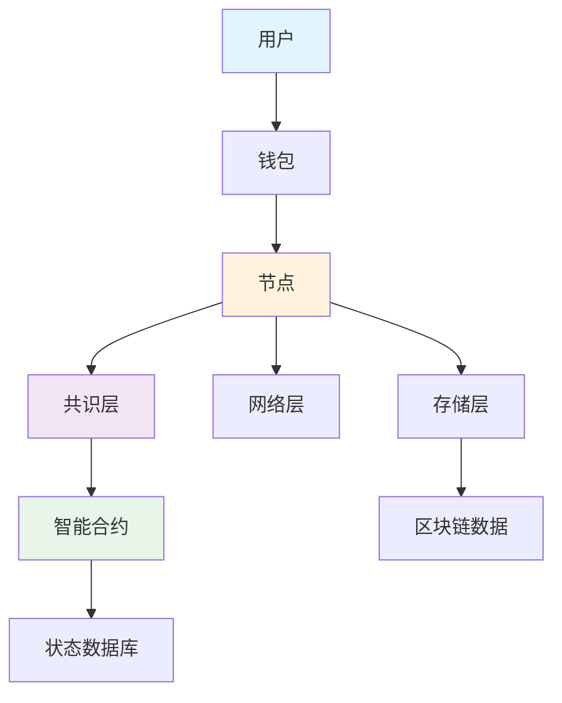
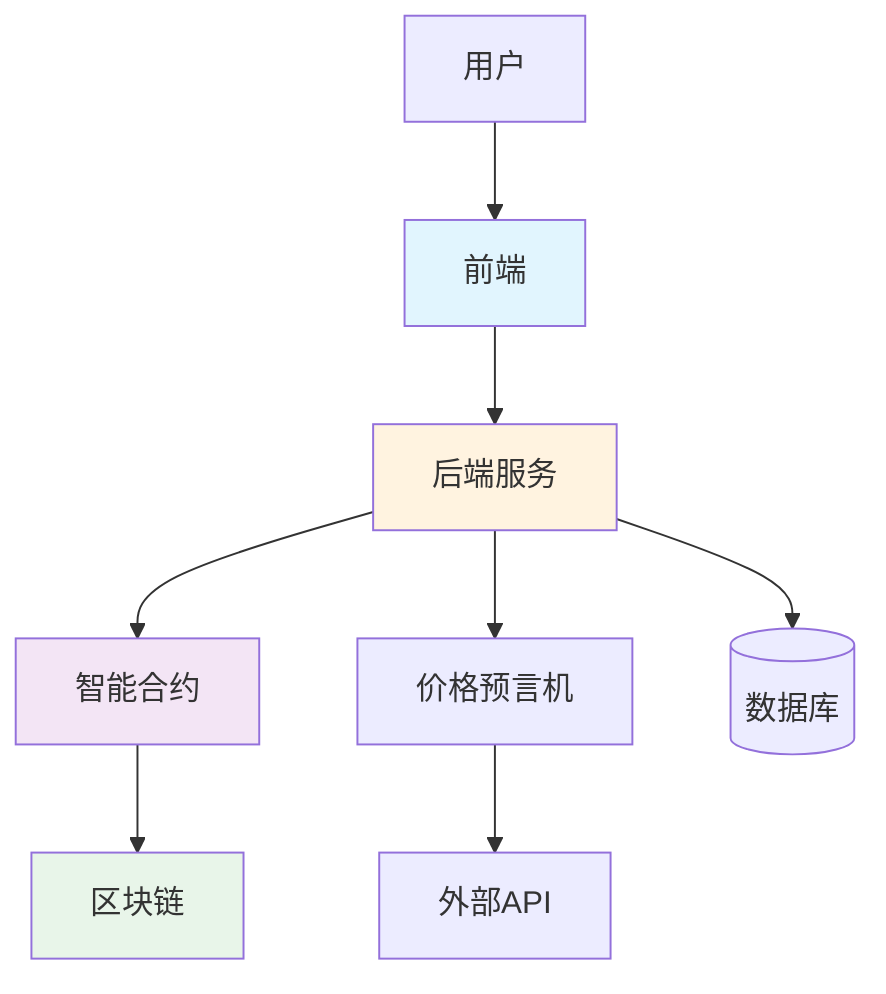

# Go区块链与Web3开发完全指南

> **简介**: Go语言在区块链和Web3领域的完整实践，涵盖智能合约、分布式存储、共识机制等核心场景

---

## 📚 目录

- [Go区块链与Web3开发完全指南](#go区块链与web3开发完全指南)
  - [📚 目录](#-目录)
  - [1. 区块链基础](#1-区块链基础)
    - [区块链架构](#区块链架构)
    - [核心概念](#核心概念)
    - [Go在区块链中的应用](#go在区块链中的应用)
  - [2. 区块链基础实现](#2-区块链基础实现)
    - [区块结构](#区块结构)
    - [区块链实现](#区块链实现)
  - [3. 共识机制](#3-共识机制)
    - [工作量证明（PoW）](#工作量证明pow)
    - [权益证明（PoS）](#权益证明pos)
  - [4. P2P网络](#4-p2p网络)
    - [节点发现](#节点发现)
    - [消息传播](#消息传播)
  - [5. 以太坊集成](#5-以太坊集成)
    - [连接以太坊节点](#连接以太坊节点)
    - [智能合约交互](#智能合约交互)
  - [6. 智能合约开发](#6-智能合约开发)
    - [Solidity合约示例](#solidity合约示例)
    - [合约部署](#合约部署)
  - [7. DApp开发](#7-dapp开发)
    - [Web3后端](#web3后端)
    - [钱包集成](#钱包集成)
  - [8. IPFS分布式存储](#8-ipfs分布式存储)
    - [IPFS客户端](#ipfs客户端)
    - [NFT元数据存储](#nft元数据存储)
  - [9. DeFi应用](#9-defi应用)
    - [价格预言机](#价格预言机)
    - [流动性池监控](#流动性池监控)
  - [10. NFT开发](#10-nft开发)
    - [NFT合约交互](#nft合约交互)
    - [NFT市场](#nft市场)
  - [11. 实战项目：去中心化交易所(DEX)](#11-实战项目去中心化交易所dex)
    - [系统架构](#系统架构)
    - [核心实现](#核心实现)
  - [12. 安全与最佳实践](#12-安全与最佳实践)
  - [13. 开源项目推荐](#13-开源项目推荐)

---

## 1. 区块链基础

### 区块链架构



### 核心概念

- **区块（Block）**: 包含交易数据的数据结构
- **链（Chain）**: 区块通过哈希值链接形成的链式结构
- **共识（Consensus）**: 网络节点达成一致的机制
- **智能合约（Smart Contract）**: 自动执行的代码
- **Gas**: 执行操作所需的计算费用
- **挖矿（Mining）**: 创建新区块的过程
- **节点（Node）**: 网络中的参与者

### Go在区块链中的应用

- ✅ **高性能**: 适合处理大量并发交易
- ✅ **简洁性**: 代码简单易于审计
- ✅ **跨平台**: 支持多种操作系统
- ✅ **并发支持**: Goroutine适合P2P网络编程
- ✅ **标准库**: 完善的加密和网络库

---

## 2. 区块链基础实现

### 区块结构

```go
package blockchain

import (
    "crypto/sha256"
    "encoding/hex"
    "encoding/json"
    "time"
)

// Block 区块结构
type Block struct {
    Index        int64         `json:"index"`
    Timestamp    int64         `json:"timestamp"`
    Transactions []Transaction `json:"transactions"`
    PrevHash     string        `json:"prev_hash"`
    Hash         string        `json:"hash"`
    Nonce        int64         `json:"nonce"`
    Difficulty   int           `json:"difficulty"`
}

// Transaction 交易结构
type Transaction struct {
    From      string  `json:"from"`
    To        string  `json:"to"`
    Amount    float64 `json:"amount"`
    Timestamp int64   `json:"timestamp"`
    Signature string  `json:"signature"`
}

// NewBlock 创建新区块
func NewBlock(index int64, transactions []Transaction, prevHash string, difficulty int) *Block {
    block := &Block{
        Index:        index,
        Timestamp:    time.Now().Unix(),
        Transactions: transactions,
        PrevHash:     prevHash,
        Difficulty:   difficulty,
        Nonce:        0,
    }
    
    return block
}

// CalculateHash 计算区块哈希
func (b *Block) CalculateHash() string {
    data, _ := json.Marshal(struct {
        Index        int64
        Timestamp    int64
        Transactions []Transaction
        PrevHash     string
        Nonce        int64
    }{
        Index:        b.Index,
        Timestamp:    b.Timestamp,
        Transactions: b.Transactions,
        PrevHash:     b.PrevHash,
        Nonce:        b.Nonce,
    })
    
    hash := sha256.Sum256(data)
    return hex.EncodeToString(hash[:])
}

// Mine 挖矿（工作量证明）
func (b *Block) Mine() {
    target := strings.Repeat("0", b.Difficulty)
    
    for {
        b.Hash = b.CalculateHash()
        if strings.HasPrefix(b.Hash, target) {
            break
        }
        b.Nonce++
    }
    
    log.Printf("Block mined! Hash: %s, Nonce: %d", b.Hash, b.Nonce)
}

// Validate 验证区块
func (b *Block) Validate() bool {
    // 验证哈希
    if b.Hash != b.CalculateHash() {
        return false
    }
    
    // 验证难度
    target := strings.Repeat("0", b.Difficulty)
    if !strings.HasPrefix(b.Hash, target) {
        return false
    }
    
    return true
}
```

### 区块链实现

```go
// Blockchain 区块链
type Blockchain struct {
    Blocks     []*Block
    Difficulty int
    mu         sync.RWMutex
}

// NewBlockchain 创建区块链
func NewBlockchain(difficulty int) *Blockchain {
    // 创建创世区块
    genesisBlock := NewBlock(0, []Transaction{}, "", difficulty)
    genesisBlock.Mine()
    
    return &Blockchain{
        Blocks:     []*Block{genesisBlock},
        Difficulty: difficulty,
    }
}

// AddBlock 添加区块
func (bc *Blockchain) AddBlock(transactions []Transaction) error {
    bc.mu.Lock()
    defer bc.mu.Unlock()
    
    prevBlock := bc.Blocks[len(bc.Blocks)-1]
    
    newBlock := NewBlock(
        prevBlock.Index+1,
        transactions,
        prevBlock.Hash,
        bc.Difficulty,
    )
    
    newBlock.Mine()
    
    if !bc.isValidNewBlock(newBlock, prevBlock) {
        return errors.New("invalid block")
    }
    
    bc.Blocks = append(bc.Blocks, newBlock)
    return nil
}

// isValidNewBlock 验证新区块
func (bc *Blockchain) isValidNewBlock(newBlock, prevBlock *Block) bool {
    if prevBlock.Index+1 != newBlock.Index {
        return false
    }
    
    if prevBlock.Hash != newBlock.PrevHash {
        return false
    }
    
    if !newBlock.Validate() {
        return false
    }
    
    return true
}

// Validate 验证整个区块链
func (bc *Blockchain) Validate() bool {
    bc.mu.RLock()
    defer bc.mu.RUnlock()
    
    for i := 1; i < len(bc.Blocks); i++ {
        if !bc.isValidNewBlock(bc.Blocks[i], bc.Blocks[i-1]) {
            return false
        }
    }
    
    return true
}

// GetLatestBlock 获取最新区块
func (bc *Blockchain) GetLatestBlock() *Block {
    bc.mu.RLock()
    defer bc.mu.RUnlock()
    
    return bc.Blocks[len(bc.Blocks)-1]
}
```

---

## 3. 共识机制

### 工作量证明（PoW）

```go
package consensus

import (
    "crypto/sha256"
    "encoding/hex"
    "math/big"
)

// ProofOfWork 工作量证明
type ProofOfWork struct {
    target *big.Int
}

func NewProofOfWork(difficulty int) *ProofOfWork {
    target := big.NewInt(1)
    target.Lsh(target, uint(256-difficulty))
    
    return &ProofOfWork{target: target}
}

// Run 执行工作量证明
func (pow *ProofOfWork) Run(data []byte, nonce int64) (int64, string) {
    var hashInt big.Int
    var hash [32]byte
    
    for nonce < math.MaxInt64 {
        dataWithNonce := append(data, []byte(fmt.Sprint(nonce))...)
        hash = sha256.Sum256(dataWithNonce)
        
        hashInt.SetBytes(hash[:])
        
        if hashInt.Cmp(pow.target) == -1 {
            break
        }
        
        nonce++
    }
    
    return nonce, hex.EncodeToString(hash[:])
}

// Validate 验证工作量证明
func (pow *ProofOfWork) Validate(data []byte, nonce int64, hash string) bool {
    var hashInt big.Int
    
    dataWithNonce := append(data, []byte(fmt.Sprint(nonce))...)
    calculatedHash := sha256.Sum256(dataWithNonce)
    
    if hex.EncodeToString(calculatedHash[:]) != hash {
        return false
    }
    
    hashInt.SetBytes(calculatedHash[:])
    return hashInt.Cmp(pow.target) == -1
}
```

### 权益证明（PoS）

```go
// ProofOfStake 权益证明
type ProofOfStake struct {
    validators map[string]int64 // address -> stake
    mu         sync.RWMutex
}

func NewProofOfStake() *ProofOfStake {
    return &ProofOfStake{
        validators: make(map[string]int64),
    }
}

// AddValidator 添加验证者
func (pos *ProofOfStake) AddValidator(address string, stake int64) {
    pos.mu.Lock()
    defer pos.mu.Unlock()
    
    pos.validators[address] = stake
}

// SelectValidator 选择验证者（基于权益）
func (pos *ProofOfStake) SelectValidator() string {
    pos.mu.RLock()
    defer pos.mu.RUnlock()
    
    // 计算总权益
    totalStake := int64(0)
    for _, stake := range pos.validators {
        totalStake += stake
    }
    
    // 随机选择（权重基于权益）
    rand.Seed(time.Now().UnixNano())
    randomPoint := rand.Int63n(totalStake)
    
    currentSum := int64(0)
    for address, stake := range pos.validators {
        currentSum += stake
        if currentSum > randomPoint {
            return address
        }
    }
    
    return ""
}

// Slash 惩罚恶意验证者
func (pos *ProofOfStake) Slash(address string, amount int64) {
    pos.mu.Lock()
    defer pos.mu.Unlock()
    
    if stake, exists := pos.validators[address]; exists {
        pos.validators[address] = stake - amount
        if pos.validators[address] <= 0 {
            delete(pos.validators, address)
        }
    }
}
```

---

## 4. P2P网络

### 节点发现

```go
package p2p

import (
    "context"
    "sync"
    
    "github.com/libp2p/go-libp2p"
    "github.com/libp2p/go-libp2p-core/host"
    "github.com/libp2p/go-libp2p-core/peer"
)

// P2PNode P2P节点
type P2PNode struct {
    host  host.Host
    peers map[peer.ID]*Peer
    mu    sync.RWMutex
}

type Peer struct {
    ID       peer.ID
    Address  string
    LastSeen time.Time
}

func NewP2PNode(ctx context.Context, port int) (*P2PNode, error) {
    h, err := libp2p.New(
        libp2p.ListenAddrStrings(
            fmt.Sprintf("/ip4/0.0.0.0/tcp/%d", port),
        ),
    )
    if err != nil {
        return nil, err
    }
    
    return &P2PNode{
        host:  h,
        peers: make(map[peer.ID]*Peer),
    }, nil
}

// Connect 连接到其他节点
func (n *P2PNode) Connect(ctx context.Context, peerAddr string) error {
    maddr, err := multiaddr.NewMultiaddr(peerAddr)
    if err != nil {
        return err
    }
    
    peerInfo, err := peer.AddrInfoFromP2pAddr(maddr)
    if err != nil {
        return err
    }
    
    if err := n.host.Connect(ctx, *peerInfo); err != nil {
        return err
    }
    
    n.mu.Lock()
    n.peers[peerInfo.ID] = &Peer{
        ID:       peerInfo.ID,
        Address:  peerAddr,
        LastSeen: time.Now(),
    }
    n.mu.Unlock()
    
    return nil
}

// GetPeers 获取所有节点
func (n *P2PNode) GetPeers() []*Peer {
    n.mu.RLock()
    defer n.mu.RUnlock()
    
    peers := make([]*Peer, 0, len(n.peers))
    for _, peer := range n.peers {
        peers = append(peers, peer)
    }
    
    return peers
}

// Broadcast 广播消息
func (n *P2PNode) Broadcast(ctx context.Context, msg []byte) error {
    n.mu.RLock()
    peers := make([]peer.ID, 0, len(n.peers))
    for id := range n.peers {
        peers = append(peers, id)
    }
    n.mu.RUnlock()
    
    for _, peerID := range peers {
        stream, err := n.host.NewStream(ctx, peerID, "/blockchain/1.0.0")
        if err != nil {
            log.Printf("Failed to open stream to %s: %v", peerID, err)
            continue
        }
        
        if _, err := stream.Write(msg); err != nil {
            log.Printf("Failed to send message to %s: %v", peerID, err)
        }
        
        stream.Close()
    }
    
    return nil
}
```

### 消息传播

```go
// MessageHandler 消息处理器
type MessageHandler struct {
    blockchain *Blockchain
    node       *P2PNode
}

func NewMessageHandler(blockchain *Blockchain, node *P2PNode) *MessageHandler {
    return &MessageHandler{
        blockchain: blockchain,
        node:       node,
    }
}

// HandleNewBlock 处理新区块
func (h *MessageHandler) HandleNewBlock(block *Block) error {
    // 验证区块
    latestBlock := h.blockchain.GetLatestBlock()
    if !h.blockchain.isValidNewBlock(block, latestBlock) {
        return errors.New("invalid block")
    }
    
    // 添加到区块链
    h.blockchain.mu.Lock()
    h.blockchain.Blocks = append(h.blockchain.Blocks, block)
    h.blockchain.mu.Unlock()
    
    // 广播给其他节点
    data, _ := json.Marshal(block)
    h.node.Broadcast(context.Background(), data)
    
    return nil
}

// HandleNewTransaction 处理新交易
func (h *MessageHandler) HandleNewTransaction(tx Transaction) error {
    // 验证交易
    if !h.validateTransaction(tx) {
        return errors.New("invalid transaction")
    }
    
    // 广播交易
    data, _ := json.Marshal(tx)
    h.node.Broadcast(context.Background(), data)
    
    return nil
}

func (h *MessageHandler) validateTransaction(tx Transaction) bool {
    // 简化的交易验证
    if tx.Amount <= 0 {
        return false
    }
    
    if tx.From == "" || tx.To == "" {
        return false
    }
    
    return true
}
```

---

## 5. 以太坊集成

### 连接以太坊节点

```go
package ethereum

import (
    "context"
    "math/big"
    
    "github.com/ethereum/go-ethereum/ethclient"
    "github.com/ethereum/go-ethereum/common"
)

// EthereumClient 以太坊客户端
type EthereumClient struct {
    client *ethclient.Client
}

func NewEthereumClient(nodeURL string) (*EthereumClient, error) {
    client, err := ethclient.Dial(nodeURL)
    if err != nil {
        return nil, err
    }
    
    return &EthereumClient{client: client}, nil
}

// GetBalance 获取余额
func (ec *EthereumClient) GetBalance(ctx context.Context, address string) (*big.Int, error) {
    account := common.HexToAddress(address)
    balance, err := ec.client.BalanceAt(ctx, account, nil)
    if err != nil {
        return nil, err
    }
    
    return balance, nil
}

// GetBlockNumber 获取最新区块号
func (ec *EthereumClient) GetBlockNumber(ctx context.Context) (uint64, error) {
    return ec.client.BlockNumber(ctx)
}

// GetBlock 获取区块信息
func (ec *EthereumClient) GetBlock(ctx context.Context, blockNumber *big.Int) (*types.Block, error) {
    return ec.client.BlockByNumber(ctx, blockNumber)
}

// SendTransaction 发送交易
func (ec *EthereumClient) SendTransaction(ctx context.Context, tx *types.Transaction) error {
    return ec.client.SendTransaction(ctx, tx)
}

func (ec *EthereumClient) Close() {
    ec.client.Close()
}
```

### 智能合约交互

```go
// ContractClient 合约客户端
type ContractClient struct {
    client   *ethclient.Client
    contract *bind.BoundContract
}

func NewContractClient(nodeURL, contractAddress string, abi string) (*ContractClient, error) {
    client, err := ethclient.Dial(nodeURL)
    if err != nil {
        return nil, err
    }
    
    parsedABI, err := abi.JSON(strings.NewReader(abi))
    if err != nil {
        return nil, err
    }
    
    address := common.HexToAddress(contractAddress)
    contract := bind.NewBoundContract(address, parsedABI, client, client, client)
    
    return &ContractClient{
        client:   client,
        contract: contract,
    }, nil
}

// Call 调用只读方法
func (cc *ContractClient) Call(ctx context.Context, result interface{}, method string, args ...interface{}) error {
    return cc.contract.Call(&bind.CallOpts{Context: ctx}, result, method, args...)
}

// Transact 调用写入方法
func (cc *ContractClient) Transact(ctx context.Context, key *ecdsa.PrivateKey, method string, args ...interface{}) (*types.Transaction, error) {
    auth, err := bind.NewKeyedTransactorWithChainID(key, big.NewInt(1)) // Mainnet
    if err != nil {
        return nil, err
    }
    
    auth.Context = ctx
    
    return cc.contract.Transact(auth, method, args...)
}

// WatchLogs 监听事件
func (cc *ContractClient) WatchLogs(ctx context.Context, eventName string, handler func(log types.Log)) error {
    query := ethereum.FilterQuery{
        Addresses: []common.Address{cc.contract.Address()},
    }
    
    logs := make(chan types.Log)
    sub, err := cc.client.SubscribeFilterLogs(ctx, query, logs)
    if err != nil {
        return err
    }
    
    go func() {
        for {
            select {
            case err := <-sub.Err():
                log.Printf("Subscription error: %v", err)
                return
            case vLog := <-logs:
                handler(vLog)
            }
        }
    }()
    
    return nil
}
```

---

## 6. 智能合约开发

### Solidity合约示例

```solidity
// SPDX-License-Identifier: MIT
pragma solidity ^0.8.0;

contract SimpleToken {
    string public name = "SimpleToken";
    string public symbol = "STK";
    uint8 public decimals = 18;
    uint256 public totalSupply;
    
    mapping(address => uint256) public balanceOf;
    mapping(address => mapping(address => uint256)) public allowance;
    
    event Transfer(address indexed from, address indexed to, uint256 value);
    event Approval(address indexed owner, address indexed spender, uint256 value);
    
    constructor(uint256 _initialSupply) {
        totalSupply = _initialSupply * 10 ** uint256(decimals);
        balanceOf[msg.sender] = totalSupply;
    }
    
    function transfer(address _to, uint256 _value) public returns (bool success) {
        require(balanceOf[msg.sender] >= _value, "Insufficient balance");
        balanceOf[msg.sender] -= _value;
        balanceOf[_to] += _value;
        emit Transfer(msg.sender, _to, _value);
        return true;
    }
    
    function approve(address _spender, uint256 _value) public returns (bool success) {
        allowance[msg.sender][_spender] = _value;
        emit Approval(msg.sender, _spender, _value);
        return true;
    }
    
    function transferFrom(address _from, address _to, uint256 _value) public returns (bool success) {
        require(_value <= balanceOf[_from], "Insufficient balance");
        require(_value <= allowance[_from][msg.sender], "Allowance exceeded");
        
        balanceOf[_from] -= _value;
        balanceOf[_to] += _value;
        allowance[_from][msg.sender] -= _value;
        
        emit Transfer(_from, _to, _value);
        return true;
    }
}
```

### 合约部署

```go
package deploy

import (
    "context"
    "crypto/ecdsa"
    "math/big"
    
    "github.com/ethereum/go-ethereum/accounts/abi/bind"
    "github.com/ethereum/go-ethereum/crypto"
    "github.com/ethereum/go-ethereum/ethclient"
)

// DeployContract 部署合约
func DeployContract(ctx context.Context, nodeURL, privateKeyHex string) (common.Address, *types.Transaction, error) {
    client, err := ethclient.Dial(nodeURL)
    if err != nil {
        return common.Address{}, nil, err
    }
    defer client.Close()
    
    // 加载私钥
    privateKey, err := crypto.HexToECDSA(privateKeyHex)
    if err != nil {
        return common.Address{}, nil, err
    }
    
    publicKey := privateKey.Public()
    publicKeyECDSA, ok := publicKey.(*ecdsa.PublicKey)
    if !ok {
        return common.Address{}, nil, errors.New("invalid public key")
    }
    
    fromAddress := crypto.PubkeyToAddress(*publicKeyECDSA)
    
    // 获取nonce
    nonce, err := client.PendingNonceAt(ctx, fromAddress)
    if err != nil {
        return common.Address{}, nil, err
    }
    
    // 获取gas价格
    gasPrice, err := client.SuggestGasPrice(ctx)
    if err != nil {
        return common.Address{}, nil, err
    }
    
    // 创建交易选项
    auth, err := bind.NewKeyedTransactorWithChainID(privateKey, big.NewInt(1))
    if err != nil {
        return common.Address{}, nil, err
    }
    
    auth.Nonce = big.NewInt(int64(nonce))
    auth.Value = big.NewInt(0)
    auth.GasLimit = uint64(3000000)
    auth.GasPrice = gasPrice
    auth.Context = ctx
    
    // 部署合约（这里需要生成的Go合约绑定代码）
    address, tx, _, err := DeploySimpleToken(auth, client, big.NewInt(1000000))
    if err != nil {
        return common.Address{}, nil, err
    }
    
    log.Printf("Contract deployed at: %s", address.Hex())
    log.Printf("Transaction hash: %s", tx.Hash().Hex())
    
    return address, tx, nil
}
```

---

## 7. DApp开发

### Web3后端

```go
package dapp

import (
    "encoding/json"
    "net/http"
    
    "github.com/gorilla/mux"
)

// DAppBackend DApp后端
type DAppBackend struct {
    ethClient      *EthereumClient
    contractClient *ContractClient
}

func NewDAppBackend(nodeURL, contractAddress, abi string) (*DAppBackend, error) {
    ethClient, err := NewEthereumClient(nodeURL)
    if err != nil {
        return nil, err
    }
    
    contractClient, err := NewContractClient(nodeURL, contractAddress, abi)
    if err != nil {
        return nil, err
    }
    
    return &DAppBackend{
        ethClient:      ethClient,
        contractClient: contractClient,
    }, nil
}

// SetupRoutes 设置路由
func (b *DAppBackend) SetupRoutes(router *mux.Router) {
    router.HandleFunc("/api/balance/{address}", b.handleGetBalance).Methods("GET")
    router.HandleFunc("/api/transfer", b.handleTransfer).Methods("POST")
    router.HandleFunc("/api/transactions/{address}", b.handleGetTransactions).Methods("GET")
}

func (b *DAppBackend) handleGetBalance(w http.ResponseWriter, r *http.Request) {
    vars := mux.Vars(r)
    address := vars["address"]
    
    balance, err := b.ethClient.GetBalance(r.Context(), address)
    if err != nil {
        http.Error(w, err.Error(), http.StatusInternalServerError)
        return
    }
    
    response := map[string]interface{}{
        "address": address,
        "balance": balance.String(),
    }
    
    w.Header().Set("Content-Type", "application/json")
    json.NewEncoder(w).Encode(response)
}

func (b *DAppBackend) handleTransfer(w http.ResponseWriter, r *http.Request) {
    var req struct {
        From       string `json:"from"`
        To         string `json:"to"`
        Amount     string `json:"amount"`
        PrivateKey string `json:"private_key"`
    }
    
    if err := json.NewDecoder(r.Body).Decode(&req); err != nil {
        http.Error(w, err.Error(), http.StatusBadRequest)
        return
    }
    
    // 执行转账（需要实现）
    // ...
    
    w.Header().Set("Content-Type", "application/json")
    json.NewEncoder(w).Encode(map[string]string{
        "status": "success",
    })
}

func (b *DAppBackend) handleGetTransactions(w http.ResponseWriter, r *http.Request) {
    vars := mux.Vars(r)
    address := vars["address"]
    
    // 获取交易历史（需要实现）
    // ...
    
    transactions := []map[string]interface{}{
        {
            "hash":      "0x...",
            "from":      "0x...",
            "to":        address,
            "value":     "1000000000000000000",
            "timestamp": time.Now().Unix(),
        },
    }
    
    w.Header().Set("Content-Type", "application/json")
    json.NewEncoder(w).Encode(transactions)
}
```

### 钱包集成

```go
// Wallet 钱包
type Wallet struct {
    privateKey *ecdsa.PrivateKey
    publicKey  *ecdsa.PublicKey
    address    common.Address
}

func NewWallet() (*Wallet, error) {
    privateKey, err := crypto.GenerateKey()
    if err != nil {
        return nil, err
    }
    
    publicKey := privateKey.Public()
    publicKeyECDSA, ok := publicKey.(*ecdsa.PublicKey)
    if !ok {
        return nil, errors.New("failed to cast public key")
    }
    
    address := crypto.PubkeyToAddress(*publicKeyECDSA)
    
    return &Wallet{
        privateKey: privateKey,
        publicKey:  publicKeyECDSA,
        address:    address,
    }, nil
}

// LoadWallet 从私钥加载钱包
func LoadWallet(privateKeyHex string) (*Wallet, error) {
    privateKey, err := crypto.HexToECDSA(privateKeyHex)
    if err != nil {
        return nil, err
    }
    
    publicKey := privateKey.Public()
    publicKeyECDSA, ok := publicKey.(*ecdsa.PublicKey)
    if !ok {
        return nil, errors.New("failed to cast public key")
    }
    
    address := crypto.PubkeyToAddress(*publicKeyECDSA)
    
    return &Wallet{
        privateKey: privateKey,
        publicKey:  publicKeyECDSA,
        address:    address,
    }, nil
}

// GetAddress 获取地址
func (w *Wallet) GetAddress() string {
    return w.address.Hex()
}

// GetPrivateKey 获取私钥（16进制）
func (w *Wallet) GetPrivateKey() string {
    return hex.EncodeToString(crypto.FromECDSA(w.privateKey))
}

// SignMessage 签名消息
func (w *Wallet) SignMessage(message []byte) ([]byte, error) {
    hash := crypto.Keccak256Hash(message)
    signature, err := crypto.Sign(hash.Bytes(), w.privateKey)
    if err != nil {
        return nil, err
    }
    
    return signature, nil
}
```

---

## 8. IPFS分布式存储

### IPFS客户端

```go
package ipfs

import (
    "bytes"
    "io"
    
    shell "github.com/ipfs/go-ipfs-api"
)

// IPFSClient IPFS客户端
type IPFSClient struct {
    shell *shell.Shell
}

func NewIPFSClient(url string) *IPFSClient {
    return &IPFSClient{
        shell: shell.NewShell(url),
    }
}

// Add 添加文件
func (c *IPFSClient) Add(data []byte) (string, error) {
    return c.shell.Add(bytes.NewReader(data))
}

// Get 获取文件
func (c *IPFSClient) Get(hash string) ([]byte, error) {
    reader, err := c.shell.Cat(hash)
    if err != nil {
        return nil, err
    }
    defer reader.Close()
    
    return io.ReadAll(reader)
}

// AddFile 添加文件
func (c *IPFSClient) AddFile(path string) (string, error) {
    return c.shell.AddDir(path)
}

// Pin 固定内容
func (c *IPFSClient) Pin(hash string) error {
    return c.shell.Pin(hash)
}

// Unpin 取消固定
func (c *IPFSClient) Unpin(hash string) error {
    return c.shell.Unpin(hash)
}
```

### NFT元数据存储

```go
// NFTMetadata NFT元数据
type NFTMetadata struct {
    Name        string            `json:"name"`
    Description string            `json:"description"`
    Image       string            `json:"image"`
    Attributes  []NFTAttribute    `json:"attributes"`
    ExternalURL string            `json:"external_url,omitempty"`
}

type NFTAttribute struct {
    TraitType string      `json:"trait_type"`
    Value     interface{} `json:"value"`
}

// NFTStorage NFT存储
type NFTStorage struct {
    ipfs *IPFSClient
}

func NewNFTStorage(ipfsURL string) *NFTStorage {
    return &NFTStorage{
        ipfs: NewIPFSClient(ipfsURL),
    }
}

// UploadImage 上传图片
func (s *NFTStorage) UploadImage(imageData []byte) (string, error) {
    hash, err := s.ipfs.Add(imageData)
    if err != nil {
        return "", err
    }
    
    // 固定内容
    if err := s.ipfs.Pin(hash); err != nil {
        return "", err
    }
    
    return fmt.Sprintf("ipfs://%s", hash), nil
}

// UploadMetadata 上传元数据
func (s *NFTStorage) UploadMetadata(metadata *NFTMetadata) (string, error) {
    data, err := json.Marshal(metadata)
    if err != nil {
        return "", err
    }
    
    hash, err := s.ipfs.Add(data)
    if err != nil {
        return "", err
    }
    
    // 固定内容
    if err := s.ipfs.Pin(hash); err != nil {
        return "", err
    }
    
    return fmt.Sprintf("ipfs://%s", hash), nil
}

// GetMetadata 获取元数据
func (s *NFTStorage) GetMetadata(uri string) (*NFTMetadata, error) {
    // 移除 ipfs:// 前缀
    hash := strings.TrimPrefix(uri, "ipfs://")
    
    data, err := s.ipfs.Get(hash)
    if err != nil {
        return nil, err
    }
    
    var metadata NFTMetadata
    if err := json.Unmarshal(data, &metadata); err != nil {
        return nil, err
    }
    
    return &metadata, nil
}
```

---

## 9. DeFi应用

### 价格预言机

```go
package defi

import (
    "encoding/json"
    "net/http"
    "time"
)

// PriceOracle 价格预言机
type PriceOracle struct {
    prices map[string]float64
    mu     sync.RWMutex
}

func NewPriceOracle() *PriceOracle {
    oracle := &PriceOracle{
        prices: make(map[string]float64),
    }
    
    go oracle.updatePrices()
    return oracle
}

// GetPrice 获取价格
func (o *PriceOracle) GetPrice(symbol string) (float64, error) {
    o.mu.RLock()
    defer o.mu.RUnlock()
    
    price, exists := o.prices[symbol]
    if !exists {
        return 0, errors.New("price not found")
    }
    
    return price, nil
}

func (o *PriceOracle) updatePrices() {
    ticker := time.NewTicker(1 * time.Minute)
    defer ticker.Stop()
    
    for range ticker.C {
        o.fetchPrices()
    }
}

func (o *PriceOracle) fetchPrices() {
    // 从API获取价格
    resp, err := http.Get("https://api.coingecko.com/api/v3/simple/price?ids=ethereum,bitcoin&vs_currencies=usd")
    if err != nil {
        log.Printf("Failed to fetch prices: %v", err)
        return
    }
    defer resp.Body.Close()
    
    var data map[string]map[string]float64
    if err := json.NewDecoder(resp.Body).Decode(&data); err != nil {
        log.Printf("Failed to decode prices: %v", err)
        return
    }
    
    o.mu.Lock()
    defer o.mu.Unlock()
    
    if eth, ok := data["ethereum"]; ok {
        o.prices["ETH"] = eth["usd"]
    }
    
    if btc, ok := data["bitcoin"]; ok {
        o.prices["BTC"] = btc["usd"]
    }
    
    log.Printf("Prices updated: ETH=$%.2f, BTC=$%.2f", o.prices["ETH"], o.prices["BTC"])
}
```

### 流动性池监控

```go
// LiquidityPoolMonitor 流动性池监控
type LiquidityPoolMonitor struct {
    client         *ContractClient
    poolAddress    string
    updateInterval time.Duration
}

func NewLiquidityPoolMonitor(nodeURL, poolAddress, abi string, updateInterval time.Duration) (*LiquidityPoolMonitor, error) {
    client, err := NewContractClient(nodeURL, poolAddress, abi)
    if err != nil {
        return nil, err
    }
    
    return &LiquidityPoolMonitor{
        client:         client,
        poolAddress:    poolAddress,
        updateInterval: updateInterval,
    }, nil
}

// Start 启动监控
func (m *LiquidityPoolMonitor) Start(ctx context.Context) {
    ticker := time.NewTicker(m.updateInterval)
    defer ticker.Stop()
    
    for {
        select {
        case <-ctx.Done():
            return
        case <-ticker.C:
            m.update(ctx)
        }
    }
}

func (m *LiquidityPoolMonitor) update(ctx context.Context) {
    // 获取池子储备
    var reserves struct {
        Reserve0 *big.Int
        Reserve1 *big.Int
    }
    
    if err := m.client.Call(ctx, &reserves, "getReserves"); err != nil {
        log.Printf("Failed to get reserves: %v", err)
        return
    }
    
    log.Printf("Pool %s - Reserve0: %s, Reserve1: %s", 
        m.poolAddress, reserves.Reserve0.String(), reserves.Reserve1.String())
    
    // 计算价格
    price := new(big.Float).Quo(
        new(big.Float).SetInt(reserves.Reserve1),
        new(big.Float).SetInt(reserves.Reserve0),
    )
    
    priceFloat, _ := price.Float64()
    log.Printf("Current price: %.6f", priceFloat)
}
```

---

## 10. NFT开发

### NFT合约交互

```go
package nft

import (
    "context"
    "math/big"
)

// NFTClient NFT客户端
type NFTClient struct {
    contract *ContractClient
}

func NewNFTClient(nodeURL, contractAddress, abi string) (*NFTClient, error) {
    contract, err := NewContractClient(nodeURL, contractAddress, abi)
    if err != nil {
        return nil, err
    }
    
    return &NFTClient{contract: contract}, nil
}

// Mint 铸造NFT
func (c *NFTClient) Mint(ctx context.Context, key *ecdsa.PrivateKey, to string, tokenURI string) (*types.Transaction, error) {
    return c.contract.Transact(ctx, key, "mint", common.HexToAddress(to), tokenURI)
}

// OwnerOf 获取NFT所有者
func (c *NFTClient) OwnerOf(ctx context.Context, tokenID *big.Int) (string, error) {
    var owner common.Address
    if err := c.contract.Call(ctx, &owner, "ownerOf", tokenID); err != nil {
        return "", err
    }
    
    return owner.Hex(), nil
}

// TokenURI 获取NFT元数据URI
func (c *NFTClient) TokenURI(ctx context.Context, tokenID *big.Int) (string, error) {
    var uri string
    if err := c.contract.Call(ctx, &uri, "tokenURI", tokenID); err != nil {
        return "", err
    }
    
    return uri, nil
}

// Transfer 转移NFT
func (c *NFTClient) Transfer(ctx context.Context, key *ecdsa.PrivateKey, from, to string, tokenID *big.Int) (*types.Transaction, error) {
    return c.contract.Transact(ctx, key, "transferFrom", 
        common.HexToAddress(from),
        common.HexToAddress(to),
        tokenID,
    )
}

// Approve 授权NFT
func (c *NFTClient) Approve(ctx context.Context, key *ecdsa.PrivateKey, to string, tokenID *big.Int) (*types.Transaction, error) {
    return c.contract.Transact(ctx, key, "approve", common.HexToAddress(to), tokenID)
}
```

### NFT市场

```go
// NFTMarketplace NFT市场
type NFTMarketplace struct {
    nftClient      *NFTClient
    listings       map[string]*Listing
    mu             sync.RWMutex
}

type Listing struct {
    TokenID   *big.Int
    Seller    string
    Price     *big.Int
    Timestamp time.Time
}

func NewNFTMarketplace(nftClient *NFTClient) *NFTMarketplace {
    return &NFTMarketplace{
        nftClient: nftClient,
        listings:  make(map[string]*Listing),
    }
}

// List 挂单
func (m *NFTMarketplace) List(tokenID *big.Int, seller string, price *big.Int) error {
    m.mu.Lock()
    defer m.mu.Unlock()
    
    key := tokenID.String()
    m.listings[key] = &Listing{
        TokenID:   tokenID,
        Seller:    seller,
        Price:     price,
        Timestamp: time.Now(),
    }
    
    return nil
}

// Buy 购买
func (m *NFTMarketplace) Buy(ctx context.Context, buyerKey *ecdsa.PrivateKey, tokenID *big.Int) error {
    m.mu.Lock()
    listing, exists := m.listings[tokenID.String()]
    if !exists {
        m.mu.Unlock()
        return errors.New("listing not found")
    }
    
    delete(m.listings, tokenID.String())
    m.mu.Unlock()
    
    // 执行NFT转移
    buyer := crypto.PubkeyToAddress(buyerKey.Public().(*ecdsa.PublicKey))
    _, err := m.nftClient.Transfer(ctx, buyerKey, listing.Seller, buyer.Hex(), tokenID)
    
    return err
}

// GetListings 获取所有挂单
func (m *NFTMarketplace) GetListings() []*Listing {
    m.mu.RLock()
    defer m.mu.RUnlock()
    
    listings := make([]*Listing, 0, len(m.listings))
    for _, listing := range m.listings {
        listings = append(listings, listing)
    }
    
    return listings
}
```

---

## 11. 实战项目：去中心化交易所(DEX)

### 系统架构



### 核心实现

```go
// cmd/dex/main.go
package main

import (
    "context"
    "log"
    "net/http"
    
    "dex/internal/api"
    "dex/internal/blockchain"
    "dex/internal/oracle"
    
    "github.com/gorilla/mux"
)

func main() {
    ctx := context.Background()
    
    // 初始化区块链客户端
    ethClient, err := blockchain.NewEthereumClient("https://mainnet.infura.io/v3/YOUR-PROJECT-ID")
    if err != nil {
        log.Fatal(err)
    }
    
    // 初始化价格预言机
    priceOracle := oracle.NewPriceOracle()
    
    // 初始化API服务
    dexAPI := api.NewDEXAPI(ethClient, priceOracle)
    
    // 设置路由
    router := mux.NewRouter()
    dexAPI.SetupRoutes(router)
    
    // 启动服务器
    log.Println("DEX server starting on :8080")
    if err := http.ListenAndServe(":8080", router); err != nil {
        log.Fatal(err)
    }
}
```

---

## 12. 安全与最佳实践

1. **私钥管理**
   - ✅ 使用硬件钱包存储私钥
   - ✅ 不要在代码中硬编码私钥
   - ✅ 使用环境变量或密钥管理服务

2. **智能合约安全**
   - ✅ 进行安全审计
   - ✅ 使用OpenZeppelin等经过审计的库
   - ✅ 实现紧急暂停机制
   - ✅ 限制权限和访问控制

3. **交易安全**
   - ✅ 验证交易参数
   - ✅ 使用nonce防止重放攻击
   - ✅ 设置合理的gas限制
   - ✅ 实现交易确认机制

4. **错误处理**
   - ✅ 完整的错误处理
   - ✅ 交易失败重试机制
   - ✅ 日志记录和监控

5. **性能优化**
   - ✅ 批量处理交易
   - ✅ 使用WebSocket监听事件
   - ✅ 实现缓存机制
   - ✅ 合理设置Gas价格

---

## 13. 开源项目推荐

1. **go-ethereum (Geth)**
   - 地址: <https://github.com/ethereum/go-ethereum>
   - 说明: 官方Go实现的以太坊客户端

2. **cosmos-sdk**
   - 地址: <https://github.com/cosmos/cosmos-sdk>
   - 说明: Cosmos区块链框架

3. **Tendermint**
   - 地址: <https://github.com/tendermint/tendermint>
   - 说明: 拜占庭容错共识引擎

4. **go-ipfs**
   - 地址: <https://github.com/ipfs/go-ipfs>
   - 说明: IPFS的Go实现

5. **Prysm**
   - 地址: <https://github.com/prysmaticlabs/prysm>
   - 说明: 以太坊2.0客户端

---

**文档维护者**: Go Documentation Team  
**最后更新**: 2025年10月24日  
**文档状态**: ✅ 完成  
**适用版本**: Go 1.21+
