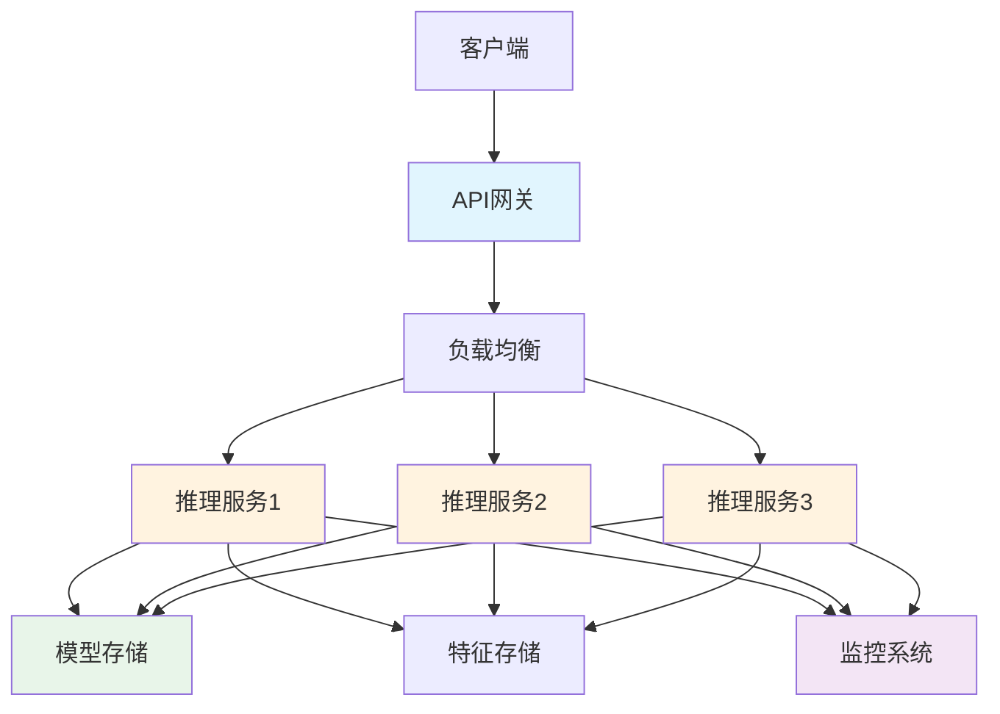
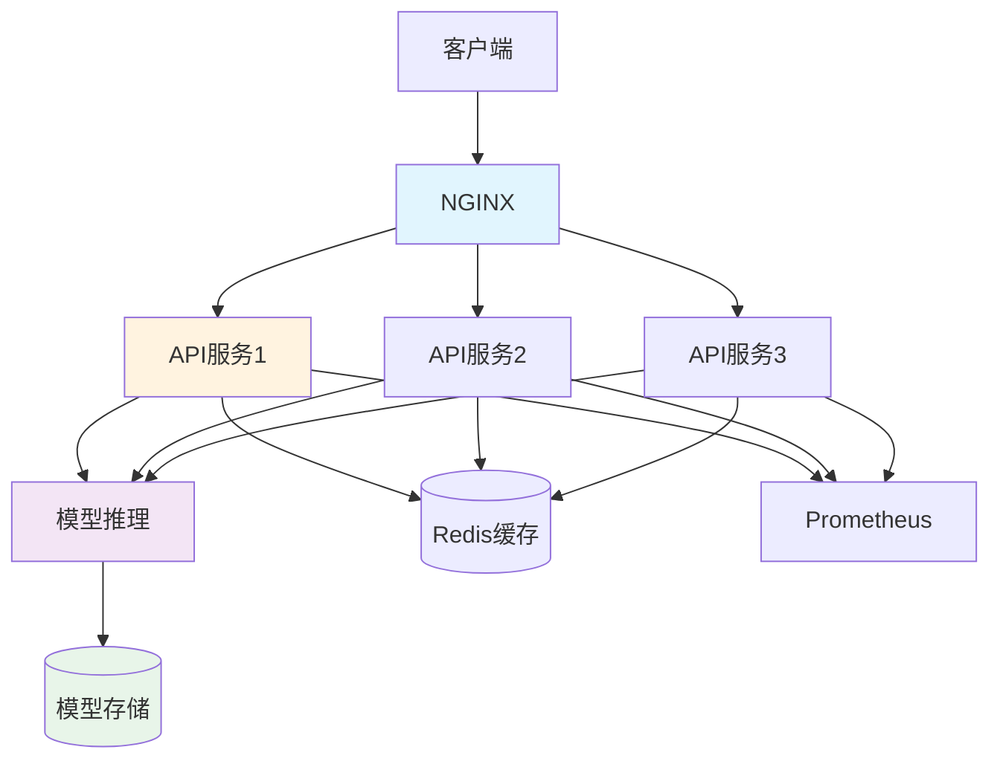

# Go AI与机器学习开发完全指南

> **简介**: Go语言在AI和机器学习领域的完整实践，涵盖推理服务、数据预处理、模型部署等核心场景

---

## 📚 目录

- [Go AI与机器学习开发完全指南](#go-ai与机器学习开发完全指南)
  - [📚 目录](#-目录)
  - [1. AI/ML架构概述](#1-aiml架构概述)
    - [典型ML系统架构](#典型ml系统架构)
    - [Go在AI/ML中的定位](#go在aiml中的定位)
  - [2. 数据处理](#2-数据处理)
    - [数据加载与预处理](#数据加载与预处理)
    - [特征工程](#特征工程)
  - [3. 模型推理](#3-模型推理)
    - [ONNX Runtime集成](#onnx-runtime集成)
    - [TensorFlow Lite集成](#tensorflow-lite集成)
  - [4. 推理服务](#4-推理服务)
    - [HTTP推理服务](#http推理服务)
    - [gRPC推理服务](#grpc推理服务)
  - [5. 模型部署](#5-模型部署)
    - [容器化部署](#容器化部署)
    - [模型版本管理](#模型版本管理)
  - [6. 批量预测](#6-批量预测)
    - [批处理引擎](#批处理引擎)
    - [分布式预测](#分布式预测)
  - [7. 特征存储](#7-特征存储)
    - [特征Store实现](#特征store实现)
    - [特征管道](#特征管道)
  - [8. 模型监控](#8-模型监控)
    - [性能监控](#性能监控)
    - [数据漂移检测](#数据漂移检测)
  - [9. 自然语言处理](#9-自然语言处理)
    - [文本预处理](#文本预处理)
    - [情感分析服务](#情感分析服务)
  - [10. 计算机视觉](#10-计算机视觉)
    - [图像预处理](#图像预处理)
    - [目标检测服务](#目标检测服务)
  - [11. 实战项目：图像分类API](#11-实战项目图像分类api)
    - [系统架构](#系统架构)
    - [核心实现](#核心实现)
  - [12. 性能优化](#12-性能优化)
  - [13. 最佳实践](#13-最佳实践)
  - [14. 开源项目推荐](#14-开源项目推荐)

---

## 1. AI/ML架构概述

### 典型ML系统架构



### Go在AI/ML中的定位

**优势**:

- ✅ 高性能推理服务
- ✅ 高并发处理能力
- ✅ 简单的部署和运维
- ✅ 优秀的网络编程支持
- ✅ 容器化友好

**局限**:

- ❌ 模型训练生态不如Python
- ❌ 第三方ML库相对较少
- ❌ 科学计算库不如Python丰富

**最佳实践**:

- 使用Python进行模型训练
- 使用Go部署推理服务
- 通过ONNX等格式转换模型

---

## 2. 数据处理

### 数据加载与预处理

```go
package data

import (
    "encoding/csv"
    "os"
    "strconv"
)

// Dataset 数据集
type Dataset struct {
    Features [][]float64
    Labels   []float64
}

// LoadCSV 加载CSV数据
func LoadCSV(filename string) (*Dataset, error) {
    file, err := os.Open(filename)
    if err != nil {
        return nil, err
    }
    defer file.Close()
    
    reader := csv.NewReader(file)
    records, err := reader.ReadAll()
    if err != nil {
        return nil, err
    }
    
    dataset := &Dataset{
        Features: make([][]float64, 0),
        Labels:   make([]float64, 0),
    }
    
    // 跳过标题行
    for i := 1; i < len(records); i++ {
        record := records[i]
        
        // 解析特征
        features := make([]float64, len(record)-1)
        for j := 0; j < len(record)-1; j++ {
            val, _ := strconv.ParseFloat(record[j], 64)
            features[j] = val
        }
        
        // 解析标签
        label, _ := strconv.ParseFloat(record[len(record)-1], 64)
        
        dataset.Features = append(dataset.Features, features)
        dataset.Labels = append(dataset.Labels, label)
    }
    
    return dataset, nil
}

// Normalize 数据归一化
func (d *Dataset) Normalize() {
    if len(d.Features) == 0 {
        return
    }
    
    numFeatures := len(d.Features[0])
    
    // 计算每个特征的均值和标准差
    means := make([]float64, numFeatures)
    stds := make([]float64, numFeatures)
    
    // 计算均值
    for _, features := range d.Features {
        for j, val := range features {
            means[j] += val
        }
    }
    
    for j := range means {
        means[j] /= float64(len(d.Features))
    }
    
    // 计算标准差
    for _, features := range d.Features {
        for j, val := range features {
            diff := val - means[j]
            stds[j] += diff * diff
        }
    }
    
    for j := range stds {
        stds[j] = math.Sqrt(stds[j] / float64(len(d.Features)))
    }
    
    // 归一化
    for i := range d.Features {
        for j := range d.Features[i] {
            if stds[j] != 0 {
                d.Features[i][j] = (d.Features[i][j] - means[j]) / stds[j]
            }
        }
    }
}

// Split 分割数据集
func (d *Dataset) Split(ratio float64) (*Dataset, *Dataset) {
    splitIdx := int(float64(len(d.Features)) * ratio)
    
    train := &Dataset{
        Features: d.Features[:splitIdx],
        Labels:   d.Labels[:splitIdx],
    }
    
    test := &Dataset{
        Features: d.Features[splitIdx:],
        Labels:   d.Labels[splitIdx:],
    }
    
    return train, test
}
```

### 特征工程

```go
// FeatureTransformer 特征转换器
type FeatureTransformer struct {
    transformers []Transformer
}

type Transformer interface {
    Fit(data [][]float64)
    Transform(data [][]float64) [][]float64
}

func NewFeatureTransformer() *FeatureTransformer {
    return &FeatureTransformer{
        transformers: make([]Transformer, 0),
    }
}

// AddTransformer 添加转换器
func (ft *FeatureTransformer) AddTransformer(t Transformer) {
    ft.transformers = append(ft.transformers, t)
}

// FitTransform 拟合并转换
func (ft *FeatureTransformer) FitTransform(data [][]float64) [][]float64 {
    result := data
    for _, transformer := range ft.transformers {
        transformer.Fit(result)
        result = transformer.Transform(result)
    }
    return result
}

// Transform 转换
func (ft *FeatureTransformer) Transform(data [][]float64) [][]float64 {
    result := data
    for _, transformer := range ft.transformers {
        result = transformer.Transform(result)
    }
    return result
}

// StandardScaler 标准化转换器
type StandardScaler struct {
    means []float64
    stds  []float64
}

func NewStandardScaler() *StandardScaler {
    return &StandardScaler{}
}

func (s *StandardScaler) Fit(data [][]float64) {
    if len(data) == 0 {
        return
    }
    
    numFeatures := len(data[0])
    s.means = make([]float64, numFeatures)
    s.stds = make([]float64, numFeatures)
    
    // 计算均值
    for _, row := range data {
        for j, val := range row {
            s.means[j] += val
        }
    }
    
    for j := range s.means {
        s.means[j] /= float64(len(data))
    }
    
    // 计算标准差
    for _, row := range data {
        for j, val := range row {
            diff := val - s.means[j]
            s.stds[j] += diff * diff
        }
    }
    
    for j := range s.stds {
        s.stds[j] = math.Sqrt(s.stds[j] / float64(len(data)))
        if s.stds[j] == 0 {
            s.stds[j] = 1
        }
    }
}

func (s *StandardScaler) Transform(data [][]float64) [][]float64 {
    result := make([][]float64, len(data))
    
    for i, row := range data {
        result[i] = make([]float64, len(row))
        for j, val := range row {
            result[i][j] = (val - s.means[j]) / s.stds[j]
        }
    }
    
    return result
}
```

---

## 3. 模型推理

### ONNX Runtime集成

```go
package inference

import (
    "github.com/yalue/onnxruntime_go"
)

// ONNXModel ONNX模型
type ONNXModel struct {
    session *onnxruntime_go.Session
    input   *onnxruntime_go.Tensor
    output  *onnxruntime_go.Tensor
}

func NewONNXModel(modelPath string) (*ONNXModel, error) {
    // 初始化ONNX Runtime
    err := onnxruntime_go.InitializeEnvironment()
    if err != nil {
        return nil, err
    }
    
    // 创建会话
    session, err := onnxruntime_go.NewSession(modelPath, nil)
    if err != nil {
        return nil, err
    }
    
    return &ONNXModel{
        session: session,
    }, nil
}

// Predict 预测
func (m *ONNXModel) Predict(input []float32) ([]float32, error) {
    // 创建输入张量
    inputShape := []int64{1, int64(len(input))}
    inputTensor, err := onnxruntime_go.NewTensor(inputShape, input)
    if err != nil {
        return nil, err
    }
    defer inputTensor.Destroy()
    
    // 运行推理
    outputs, err := m.session.Run([]onnxruntime_go.Value{inputTensor})
    if err != nil {
        return nil, err
    }
    
    // 获取输出
    outputTensor := outputs[0].(*onnxruntime_go.Tensor)
    outputData := outputTensor.GetData().([]float32)
    
    return outputData, nil
}

func (m *ONNXModel) Close() error {
    if m.session != nil {
        return m.session.Destroy()
    }
    return nil
}
```

### TensorFlow Lite集成

```go
// TFLiteModel TensorFlow Lite模型
type TFLiteModel struct {
    interpreter *tflite.Interpreter
}

func NewTFLiteModel(modelPath string) (*TFLiteModel, error) {
    // 加载模型
    model := tflite.NewModelFromFile(modelPath)
    if model == nil {
        return nil, errors.New("failed to load model")
    }
    
    // 创建解释器
    options := tflite.NewInterpreterOptions()
    options.SetNumThread(4)
    
    interpreter := tflite.NewInterpreter(model, options)
    if interpreter == nil {
        return nil, errors.New("failed to create interpreter")
    }
    
    // 分配张量
    if status := interpreter.AllocateTensors(); status != tflite.OK {
        return nil, errors.New("failed to allocate tensors")
    }
    
    return &TFLiteModel{
        interpreter: interpreter,
    }, nil
}

// Predict 预测
func (m *TFLiteModel) Predict(input []float32) ([]float32, error) {
    // 获取输入张量
    inputTensor := m.interpreter.GetInputTensor(0)
    
    // 复制输入数据
    copy(inputTensor.Float32s(), input)
    
    // 执行推理
    if status := m.interpreter.Invoke(); status != tflite.OK {
        return nil, errors.New("inference failed")
    }
    
    // 获取输出
    outputTensor := m.interpreter.GetOutputTensor(0)
    output := make([]float32, outputTensor.Dim(1))
    copy(output, outputTensor.Float32s())
    
    return output, nil
}

func (m *TFLiteModel) Close() {
    if m.interpreter != nil {
        m.interpreter.Delete()
    }
}
```

---

## 4. 推理服务

### HTTP推理服务

```go
package server

import (
    "encoding/json"
    "net/http"
    
    "github.com/gorilla/mux"
)

// InferenceServer 推理服务器
type InferenceServer struct {
    model  Model
    router *mux.Router
}

type Model interface {
    Predict(input []float32) ([]float32, error)
}

type PredictRequest struct {
    Inputs [][]float32 `json:"inputs"`
}

type PredictResponse struct {
    Predictions [][]float32 `json:"predictions"`
    Latency     int64       `json:"latency_ms"`
}

func NewInferenceServer(model Model) *InferenceServer {
    server := &InferenceServer{
        model:  model,
        router: mux.NewRouter(),
    }
    
    server.setupRoutes()
    return server
}

func (s *InferenceServer) setupRoutes() {
    s.router.HandleFunc("/predict", s.handlePredict).Methods("POST")
    s.router.HandleFunc("/health", s.handleHealth).Methods("GET")
    s.router.HandleFunc("/metrics", s.handleMetrics).Methods("GET")
}

func (s *InferenceServer) handlePredict(w http.ResponseWriter, r *http.Request) {
    start := time.Now()
    
    var req PredictRequest
    if err := json.NewDecoder(r.Body).Decode(&req); err != nil {
        http.Error(w, err.Error(), http.StatusBadRequest)
        return
    }
    
    // 批量预测
    predictions := make([][]float32, 0, len(req.Inputs))
    for _, input := range req.Inputs {
        output, err := s.model.Predict(input)
        if err != nil {
            http.Error(w, err.Error(), http.StatusInternalServerError)
            return
        }
        predictions = append(predictions, output)
    }
    
    latency := time.Since(start).Milliseconds()
    
    resp := PredictResponse{
        Predictions: predictions,
        Latency:     latency,
    }
    
    w.Header().Set("Content-Type", "application/json")
    json.NewEncoder(w).Encode(resp)
}

func (s *InferenceServer) handleHealth(w http.ResponseWriter, r *http.Request) {
    w.WriteHeader(http.StatusOK)
    json.NewEncoder(w).Encode(map[string]string{
        "status": "healthy",
    })
}

func (s *InferenceServer) handleMetrics(w http.ResponseWriter, r *http.Request) {
    // 返回Prometheus格式的指标
    w.Header().Set("Content-Type", "text/plain")
    fmt.Fprintf(w, "# HELP inference_requests_total Total number of inference requests\n")
    fmt.Fprintf(w, "# TYPE inference_requests_total counter\n")
    fmt.Fprintf(w, "inference_requests_total 123\n")
}

func (s *InferenceServer) Start(addr string) error {
    log.Printf("Starting inference server on %s", addr)
    return http.ListenAndServe(addr, s.router)
}
```

### gRPC推理服务

```go
// inference.proto
/*
syntax = "proto3";

package inference;

service InferenceService {
    rpc Predict(PredictRequest) returns (PredictResponse);
    rpc PredictStream(stream PredictRequest) returns (stream PredictResponse);
}

message PredictRequest {
    repeated float inputs = 1;
}

message PredictResponse {
    repeated float outputs = 1;
    int64 latency_ms = 2;
}
*/

// grpc_server.go
package server

import (
    "context"
    "time"
    
    "google.golang.org/grpc"
    pb "inference/proto"
)

type GRPCServer struct {
    pb.UnimplementedInferenceServiceServer
    model Model
}

func NewGRPCServer(model Model) *GRPCServer {
    return &GRPCServer{model: model}
}

func (s *GRPCServer) Predict(ctx context.Context, req *pb.PredictRequest) (*pb.PredictResponse, error) {
    start := time.Now()
    
    output, err := s.model.Predict(req.Inputs)
    if err != nil {
        return nil, err
    }
    
    latency := time.Since(start).Milliseconds()
    
    return &pb.PredictResponse{
        Outputs:   output,
        LatencyMs: latency,
    }, nil
}

func (s *GRPCServer) PredictStream(stream pb.InferenceService_PredictStreamServer) error {
    for {
        req, err := stream.Recv()
        if err == io.EOF {
            return nil
        }
        if err != nil {
            return err
        }
        
        start := time.Now()
        output, err := s.model.Predict(req.Inputs)
        if err != nil {
            return err
        }
        
        latency := time.Since(start).Milliseconds()
        
        if err := stream.Send(&pb.PredictResponse{
            Outputs:   output,
            LatencyMs: latency,
        }); err != nil {
            return err
        }
    }
}

func (s *GRPCServer) Start(addr string) error {
    lis, err := net.Listen("tcp", addr)
    if err != nil {
        return err
    }
    
    grpcServer := grpc.NewServer()
    pb.RegisterInferenceServiceServer(grpcServer, s)
    
    log.Printf("Starting gRPC server on %s", addr)
    return grpcServer.Serve(lis)
}
```

---

## 5. 模型部署

### 容器化部署

```dockerfile
# Dockerfile
FROM golang:1.21-alpine AS builder

WORKDIR /app

# 复制依赖文件
COPY go.mod go.sum ./
RUN go mod download

# 复制源代码
COPY . .

# 构建应用
RUN CGO_ENABLED=0 GOOS=linux go build -o /inference-server cmd/server/main.go

# 运行阶段
FROM alpine:latest

RUN apk --no-cache add ca-certificates

WORKDIR /root/

# 复制二进制文件
COPY --from=builder /inference-server .

# 复制模型文件
COPY models/ ./models/

# 暴露端口
EXPOSE 8080

# 健康检查
HEALTHCHECK --interval=30s --timeout=3s --start-period=5s --retries=3 \
  CMD wget --no-verbose --tries=1 --spider http://localhost:8080/health || exit 1

# 启动服务
CMD ["./inference-server"]
```

```yaml
# docker-compose.yml
version: '3.8'

services:
  inference-server:
    build: .
    ports:
      - "8080:8080"
    volumes:
      - ./models:/root/models
    environment:
      - MODEL_PATH=/root/models/model.onnx
      - NUM_WORKERS=4
    deploy:
      replicas: 3
      resources:
        limits:
          cpus: '2'
          memory: 2G
        reservations:
          cpus: '1'
          memory: 1G
```

### 模型版本管理

```go
package model

import (
    "sync"
)

// ModelRegistry 模型注册表
type ModelRegistry struct {
    models map[string]*ModelVersion
    mu     sync.RWMutex
}

type ModelVersion struct {
    Version string
    Model   Model
    Metrics *ModelMetrics
}

type ModelMetrics struct {
    RequestCount int64
    ErrorCount   int64
    AvgLatency   float64
}

func NewModelRegistry() *ModelRegistry {
    return &ModelRegistry{
        models: make(map[string]*ModelVersion),
    }
}

// Register 注册模型
func (r *ModelRegistry) Register(name, version string, model Model) {
    r.mu.Lock()
    defer r.mu.Unlock()
    
    key := fmt.Sprintf("%s:%s", name, version)
    r.models[key] = &ModelVersion{
        Version: version,
        Model:   model,
        Metrics: &ModelMetrics{},
    }
}

// Get 获取模型
func (r *ModelRegistry) Get(name, version string) (*ModelVersion, error) {
    r.mu.RLock()
    defer r.mu.RUnlock()
    
    key := fmt.Sprintf("%s:%s", name, version)
    model, exists := r.models[key]
    if !exists {
        return nil, errors.New("model not found")
    }
    
    return model, nil
}

// GetLatest 获取最新版本
func (r *ModelRegistry) GetLatest(name string) (*ModelVersion, error) {
    r.mu.RLock()
    defer r.mu.RUnlock()
    
    var latestVersion *ModelVersion
    for key, version := range r.models {
        if strings.HasPrefix(key, name+":") {
            if latestVersion == nil || version.Version > latestVersion.Version {
                latestVersion = version
            }
        }
    }
    
    if latestVersion == nil {
        return nil, errors.New("model not found")
    }
    
    return latestVersion, nil
}

// List 列出所有模型
func (r *ModelRegistry) List() []string {
    r.mu.RLock()
    defer r.mu.RUnlock()
    
    keys := make([]string, 0, len(r.models))
    for key := range r.models {
        keys = append(keys, key)
    }
    
    return keys
}

// UpdateMetrics 更新指标
func (r *ModelRegistry) UpdateMetrics(name, version string, latency float64, success bool) {
    r.mu.Lock()
    defer r.mu.Unlock()
    
    key := fmt.Sprintf("%s:%s", name, version)
    if model, exists := r.models[key]; exists {
        model.Metrics.RequestCount++
        if !success {
            model.Metrics.ErrorCount++
        }
        
        // 更新平均延迟
        oldAvg := model.Metrics.AvgLatency
        n := float64(model.Metrics.RequestCount)
        model.Metrics.AvgLatency = (oldAvg*(n-1) + latency) / n
    }
}
```

---

## 6. 批量预测

### 批处理引擎

```go
package batch

import (
    "context"
    "sync"
)

// BatchPredictor 批量预测器
type BatchPredictor struct {
    model      Model
    batchSize  int
    workers    int
}

type PredictionJob struct {
    ID     string
    Input  []float32
    Result chan PredictionResult
}

type PredictionResult struct {
    Output []float32
    Error  error
}

func NewBatchPredictor(model Model, batchSize, workers int) *BatchPredictor {
    return &BatchPredictor{
        model:     model,
        batchSize: batchSize,
        workers:   workers,
    }
}

// Process 处理批量预测
func (p *BatchPredictor) Process(ctx context.Context, jobs <-chan PredictionJob) {
    var wg sync.WaitGroup
    
    for i := 0; i < p.workers; i++ {
        wg.Add(1)
        go func() {
            defer wg.Done()
            p.worker(ctx, jobs)
        }()
    }
    
    wg.Wait()
}

func (p *BatchPredictor) worker(ctx context.Context, jobs <-chan PredictionJob) {
    batch := make([]PredictionJob, 0, p.batchSize)
    
    for {
        select {
        case <-ctx.Done():
            p.processBatch(batch)
            return
            
        case job, ok := <-jobs:
            if !ok {
                p.processBatch(batch)
                return
            }
            
            batch = append(batch, job)
            if len(batch) >= p.batchSize {
                p.processBatch(batch)
                batch = batch[:0]
            }
        }
    }
}

func (p *BatchPredictor) processBatch(jobs []PredictionJob) {
    if len(jobs) == 0 {
        return
    }
    
    for _, job := range jobs {
        output, err := p.model.Predict(job.Input)
        job.Result <- PredictionResult{
            Output: output,
            Error:  err,
        }
        close(job.Result)
    }
}
```

### 分布式预测

```go
// DistributedPredictor 分布式预测器
type DistributedPredictor struct {
    workers []string // worker节点地址
    client  *http.Client
}

func NewDistributedPredictor(workers []string) *DistributedPredictor {
    return &DistributedPredictor{
        workers: workers,
        client: &http.Client{
            Timeout: 30 * time.Second,
        },
    }
}

// Predict 分布式预测
func (p *DistributedPredictor) Predict(ctx context.Context, inputs [][]float32) ([][]float32, error) {
    // 将输入分配到不同的worker
    chunks := p.chunkInputs(inputs, len(p.workers))
    
    var wg sync.WaitGroup
    results := make([][]float32, len(inputs))
    errors := make([]error, len(chunks))
    
    for i, chunk := range chunks {
        wg.Add(1)
        go func(workerIdx int, input [][]float32) {
            defer wg.Done()
            
            output, err := p.predictOnWorker(ctx, p.workers[workerIdx], input)
            if err != nil {
                errors[workerIdx] = err
                return
            }
            
            // 复制结果
            startIdx := workerIdx * len(chunk)
            copy(results[startIdx:], output)
        }(i, chunk)
    }
    
    wg.Wait()
    
    // 检查错误
    for _, err := range errors {
        if err != nil {
            return nil, err
        }
    }
    
    return results, nil
}

func (p *DistributedPredictor) predictOnWorker(ctx context.Context, workerURL string, inputs [][]float32) ([][]float32, error) {
    req := PredictRequest{Inputs: inputs}
    body, _ := json.Marshal(req)
    
    httpReq, err := http.NewRequestWithContext(ctx, "POST", workerURL+"/predict", bytes.NewReader(body))
    if err != nil {
        return nil, err
    }
    
    httpReq.Header.Set("Content-Type", "application/json")
    
    resp, err := p.client.Do(httpReq)
    if err != nil {
        return nil, err
    }
    defer resp.Body.Close()
    
    var result PredictResponse
    if err := json.NewDecoder(resp.Body).Decode(&result); err != nil {
        return nil, err
    }
    
    return result.Predictions, nil
}

func (p *DistributedPredictor) chunkInputs(inputs [][]float32, numChunks int) [][][]float32 {
    chunkSize := (len(inputs) + numChunks - 1) / numChunks
    chunks := make([][][]float32, 0, numChunks)
    
    for i := 0; i < len(inputs); i += chunkSize {
        end := i + chunkSize
        if end > len(inputs) {
            end = len(inputs)
        }
        chunks = append(chunks, inputs[i:end])
    }
    
    return chunks
}
```

---

## 7. 特征存储

### 特征Store实现

```go
package feature

import (
    "context"
    "encoding/json"
    "time"
    
    "github.com/go-redis/redis/v8"
)

// FeatureStore 特征存储
type FeatureStore struct {
    redis *redis.Client
}

type Feature struct {
    EntityID  string                 `json:"entity_id"`
    Features  map[string]interface{} `json:"features"`
    Timestamp time.Time              `json:"timestamp"`
}

func NewFeatureStore(redisAddr string) *FeatureStore {
    client := redis.NewClient(&redis.Options{
        Addr: redisAddr,
    })
    
    return &FeatureStore{redis: client}
}

// Set 存储特征
func (fs *FeatureStore) Set(ctx context.Context, entityID string, features map[string]interface{}) error {
    feature := Feature{
        EntityID:  entityID,
        Features:  features,
        Timestamp: time.Now(),
    }
    
    data, err := json.Marshal(feature)
    if err != nil {
        return err
    }
    
    key := fmt.Sprintf("feature:%s", entityID)
    return fs.redis.Set(ctx, key, data, 24*time.Hour).Err()
}

// Get 获取特征
func (fs *FeatureStore) Get(ctx context.Context, entityID string) (*Feature, error) {
    key := fmt.Sprintf("feature:%s", entityID)
    
    data, err := fs.redis.Get(ctx, key).Result()
    if err != nil {
        return nil, err
    }
    
    var feature Feature
    if err := json.Unmarshal([]byte(data), &feature); err != nil {
        return nil, err
    }
    
    return &feature, nil
}

// GetBatch 批量获取特征
func (fs *FeatureStore) GetBatch(ctx context.Context, entityIDs []string) ([]*Feature, error) {
    keys := make([]string, len(entityIDs))
    for i, id := range entityIDs {
        keys[i] = fmt.Sprintf("feature:%s", id)
    }
    
    results, err := fs.redis.MGet(ctx, keys...).Result()
    if err != nil {
        return nil, err
    }
    
    features := make([]*Feature, 0, len(results))
    for _, result := range results {
        if result == nil {
            continue
        }
        
        var feature Feature
        if err := json.Unmarshal([]byte(result.(string)), &feature); err != nil {
            continue
        }
        
        features = append(features, &feature)
    }
    
    return features, nil
}
```

### 特征管道

```go
// FeaturePipeline 特征管道
type FeaturePipeline struct {
    extractors []FeatureExtractor
    store      *FeatureStore
}

type FeatureExtractor interface {
    Extract(ctx context.Context, entityID string) (map[string]interface{}, error)
}

func NewFeaturePipeline(store *FeatureStore) *FeaturePipeline {
    return &FeaturePipeline{
        extractors: make([]FeatureExtractor, 0),
        store:      store,
    }
}

// AddExtractor 添加特征提取器
func (fp *FeaturePipeline) AddExtractor(extractor FeatureExtractor) {
    fp.extractors = append(fp.extractors, extractor)
}

// Process 处理特征提取
func (fp *FeaturePipeline) Process(ctx context.Context, entityID string) error {
    allFeatures := make(map[string]interface{})
    
    for _, extractor := range fp.extractors {
        features, err := extractor.Extract(ctx, entityID)
        if err != nil {
            log.Printf("Feature extraction failed: %v", err)
            continue
        }
        
        for k, v := range features {
            allFeatures[k] = v
        }
    }
    
    return fp.store.Set(ctx, entityID, allFeatures)
}

// 用户特征提取器示例
type UserFeatureExtractor struct {
    db *sql.DB
}

func (e *UserFeatureExtractor) Extract(ctx context.Context, entityID string) (map[string]interface{}, error) {
    var age int
    var country string
    
    err := e.db.QueryRowContext(ctx, 
        "SELECT age, country FROM users WHERE id = $1", 
        entityID,
    ).Scan(&age, &country)
    if err != nil {
        return nil, err
    }
    
    return map[string]interface{}{
        "age":     age,
        "country": country,
    }, nil
}
```

---

## 8. 模型监控

### 性能监控

```go
package monitoring

import (
    "time"
    
    "github.com/prometheus/client_golang/prometheus"
)

// ModelMonitor 模型监控
type ModelMonitor struct {
    requestCount    *prometheus.CounterVec
    requestDuration *prometheus.HistogramVec
    predictionValue *prometheus.GaugeVec
}

func NewModelMonitor() *ModelMonitor {
    monitor := &ModelMonitor{
        requestCount: prometheus.NewCounterVec(
            prometheus.CounterOpts{
                Name: "model_requests_total",
                Help: "Total number of prediction requests",
            },
            []string{"model", "version", "status"},
        ),
        requestDuration: prometheus.NewHistogramVec(
            prometheus.HistogramOpts{
                Name:    "model_request_duration_seconds",
                Help:    "Prediction request duration",
                Buckets: prometheus.DefBuckets,
            },
            []string{"model", "version"},
        ),
        predictionValue: prometheus.NewGaugeVec(
            prometheus.GaugeOpts{
                Name: "model_prediction_value",
                Help: "Model prediction values",
            },
            []string{"model", "version"},
        ),
    }
    
    prometheus.MustRegister(
        monitor.requestCount,
        monitor.requestDuration,
        monitor.predictionValue,
    )
    
    return monitor
}

// RecordRequest 记录请求
func (m *ModelMonitor) RecordRequest(modelName, version, status string, duration time.Duration) {
    m.requestCount.WithLabelValues(modelName, version, status).Inc()
    m.requestDuration.WithLabelValues(modelName, version).Observe(duration.Seconds())
}

// RecordPrediction 记录预测值
func (m *ModelMonitor) RecordPrediction(modelName, version string, value float64) {
    m.predictionValue.WithLabelValues(modelName, version).Set(value)
}
```

### 数据漂移检测

```go
// DriftDetector 漂移检测器
type DriftDetector struct {
    baseline     *Statistics
    threshold    float64
    windowSize   int
    currentData  []float64
}

type Statistics struct {
    Mean   float64
    StdDev float64
    Min    float64
    Max    float64
}

func NewDriftDetector(baseline *Statistics, threshold float64, windowSize int) *DriftDetector {
    return &DriftDetector{
        baseline:    baseline,
        threshold:   threshold,
        windowSize:  windowSize,
        currentData: make([]float64, 0, windowSize),
    }
}

// Add 添加数据点
func (d *DriftDetector) Add(value float64) bool {
    d.currentData = append(d.currentData, value)
    
    if len(d.currentData) > d.windowSize {
        d.currentData = d.currentData[1:]
    }
    
    if len(d.currentData) == d.windowSize {
        return d.detectDrift()
    }
    
    return false
}

func (d *DriftDetector) detectDrift() bool {
    current := d.calculateStatistics()
    
    // 计算KL散度或其他度量
    meanDiff := math.Abs(current.Mean - d.baseline.Mean)
    stdDevDiff := math.Abs(current.StdDev - d.baseline.StdDev)
    
    drift := (meanDiff/d.baseline.Mean + stdDevDiff/d.baseline.StdDev) / 2
    
    if drift > d.threshold {
        log.Printf("Data drift detected: %.2f", drift)
        return true
    }
    
    return false
}

func (d *DriftDetector) calculateStatistics() *Statistics {
    if len(d.currentData) == 0 {
        return &Statistics{}
    }
    
    // 计算均值
    sum := 0.0
    min := d.currentData[0]
    max := d.currentData[0]
    
    for _, val := range d.currentData {
        sum += val
        if val < min {
            min = val
        }
        if val > max {
            max = val
        }
    }
    
    mean := sum / float64(len(d.currentData))
    
    // 计算标准差
    variance := 0.0
    for _, val := range d.currentData {
        diff := val - mean
        variance += diff * diff
    }
    stdDev := math.Sqrt(variance / float64(len(d.currentData)))
    
    return &Statistics{
        Mean:   mean,
        StdDev: stdDev,
        Min:    min,
        Max:    max,
    }
}
```

---

## 9. 自然语言处理

### 文本预处理

```go
package nlp

import (
    "regexp"
    "strings"
    "unicode"
)

// TextPreprocessor 文本预处理器
type TextPreprocessor struct {
    stopwords map[string]bool
}

func NewTextPreprocessor(stopwords []string) *TextPreprocessor {
    stopwordMap := make(map[string]bool)
    for _, word := range stopwords {
        stopwordMap[word] = true
    }
    
    return &TextPreprocessor{
        stopwords: stopwordMap,
    }
}

// Clean 清理文本
func (p *TextPreprocessor) Clean(text string) string {
    // 转小写
    text = strings.ToLower(text)
    
    // 移除URL
    urlPattern := regexp.MustCompile(`https?://\S+`)
    text = urlPattern.ReplaceAllString(text, "")
    
    // 移除邮箱
    emailPattern := regexp.MustCompile(`\S+@\S+`)
    text = emailPattern.ReplaceAllString(text, "")
    
    // 移除特殊字符
    text = strings.Map(func(r rune) rune {
        if unicode.IsLetter(r) || unicode.IsSpace(r) {
            return r
        }
        return -1
    }, text)
    
    return text
}

// Tokenize 分词
func (p *TextPreprocessor) Tokenize(text string) []string {
    return strings.Fields(text)
}

// RemoveStopwords 移除停用词
func (p *TextPreprocessor) RemoveStopwords(tokens []string) []string {
    filtered := make([]string, 0)
    for _, token := range tokens {
        if !p.stopwords[token] {
            filtered = append(filtered, token)
        }
    }
    return filtered
}

// Process 完整处理流程
func (p *TextPreprocessor) Process(text string) []string {
    text = p.Clean(text)
    tokens := p.Tokenize(text)
    tokens = p.RemoveStopwords(tokens)
    return tokens
}

// TF-IDF实现
type TFIDF struct {
    vocab map[string]int
    idf   map[string]float64
}

func NewTFIDF() *TFIDF {
    return &TFIDF{
        vocab: make(map[string]int),
        idf:   make(map[string]float64),
    }
}

// Fit 训练
func (t *TFIDF) Fit(documents [][]string) {
    // 构建词汇表
    for _, doc := range documents {
        seen := make(map[string]bool)
        for _, word := range doc {
            if !seen[word] {
                t.vocab[word]++
                seen[word] = true
            }
        }
    }
    
    // 计算IDF
    numDocs := float64(len(documents))
    for word, df := range t.vocab {
        t.idf[word] = math.Log(numDocs / float64(df))
    }
}

// Transform 转换
func (t *TFIDF) Transform(documents [][]string) [][]float64 {
    result := make([][]float64, len(documents))
    
    for i, doc := range documents {
        tf := make(map[string]float64)
        for _, word := range doc {
            tf[word]++
        }
        
        // 归一化TF
        for word := range tf {
            tf[word] /= float64(len(doc))
        }
        
        // 计算TF-IDF
        vector := make([]float64, len(t.vocab))
        j := 0
        for word := range t.vocab {
            if idf, exists := t.idf[word]; exists {
                vector[j] = tf[word] * idf
            }
            j++
        }
        
        result[i] = vector
    }
    
    return result
}
```

### 情感分析服务

```go
// SentimentAnalyzer 情感分析器
type SentimentAnalyzer struct {
    preprocessor *TextPreprocessor
    model        Model
}

type SentimentResult struct {
    Text      string  `json:"text"`
    Sentiment string  `json:"sentiment"` // positive, negative, neutral
    Score     float64 `json:"score"`
}

func NewSentimentAnalyzer(preprocessor *TextPreprocessor, model Model) *SentimentAnalyzer {
    return &SentimentAnalyzer{
        preprocessor: preprocessor,
        model:        model,
    }
}

// Analyze 分析情感
func (sa *SentimentAnalyzer) Analyze(text string) (*SentimentResult, error) {
    // 预处理
    tokens := sa.preprocessor.Process(text)
    
    // 特征提取（简化版）
    features := sa.extractFeatures(tokens)
    
    // 模型预测
    output, err := sa.model.Predict(features)
    if err != nil {
        return nil, err
    }
    
    // 解析结果
    sentiment, score := sa.parseOutput(output)
    
    return &SentimentResult{
        Text:      text,
        Sentiment: sentiment,
        Score:     score,
    }, nil
}

func (sa *SentimentAnalyzer) extractFeatures(tokens []string) []float32 {
    // 简化的特征提取
    features := make([]float32, 100)
    for i, token := range tokens {
        if i >= len(features) {
            break
        }
        features[i] = float32(len(token))
    }
    return features
}

func (sa *SentimentAnalyzer) parseOutput(output []float32) (string, float64) {
    if len(output) < 3 {
        return "unknown", 0
    }
    
    maxIdx := 0
    maxVal := output[0]
    
    for i, val := range output {
        if val > maxVal {
            maxVal = val
            maxIdx = i
        }
    }
    
    sentiments := []string{"negative", "neutral", "positive"}
    return sentiments[maxIdx], float64(maxVal)
}
```

---

## 10. 计算机视觉

### 图像预处理

```go
package cv

import (
    "image"
    "image/color"
    
    "gocv.io/x/gocv"
)

// ImagePreprocessor 图像预处理器
type ImagePreprocessor struct {
    targetSize image.Point
}

func NewImagePreprocessor(width, height int) *ImagePreprocessor {
    return &ImagePreprocessor{
        targetSize: image.Point{X: width, Y: height},
    }
}

// Preprocess 预处理图像
func (ip *ImagePreprocessor) Preprocess(img gocv.Mat) ([]float32, error) {
    // 调整大小
    resized := gocv.NewMat()
    defer resized.Close()
    gocv.Resize(img, &resized, ip.targetSize, 0, 0, gocv.InterpolationLinear)
    
    // 归一化
    normalized := gocv.NewMat()
    defer normalized.Close()
    resized.ConvertTo(&normalized, gocv.MatTypeCV32F)
    normalized.DivideFloat(255.0)
    
    // 转换为数组
    data := make([]float32, ip.targetSize.X*ip.targetSize.Y*3)
    for y := 0; y < ip.targetSize.Y; y++ {
        for x := 0; x < ip.targetSize.X; x++ {
            pixel := normalized.GetVecfAt(y, x)
            idx := (y*ip.targetSize.X + x) * 3
            data[idx] = pixel[0]     // B
            data[idx+1] = pixel[1]   // G
            data[idx+2] = pixel[2]   // R
        }
    }
    
    return data, nil
}

// LoadImage 加载图像
func LoadImage(path string) (gocv.Mat, error) {
    img := gocv.IMRead(path, gocv.IMReadColor)
    if img.Empty() {
        return gocv.Mat{}, errors.New("failed to load image")
    }
    return img, nil
}

// SaveImage 保存图像
func SaveImage(path string, img gocv.Mat) error {
    return gocv.IMWrite(path, img)
}
```

### 目标检测服务

```go
// ObjectDetector 目标检测器
type ObjectDetector struct {
    preprocessor *ImagePreprocessor
    model        Model
    classes      []string
}

type Detection struct {
    Class      string    `json:"class"`
    Confidence float64   `json:"confidence"`
    BBox       BoundingBox `json:"bbox"`
}

type BoundingBox struct {
    X      int `json:"x"`
    Y      int `json:"y"`
    Width  int `json:"width"`
    Height int `json:"height"`
}

func NewObjectDetector(preprocessor *ImagePreprocessor, model Model, classes []string) *ObjectDetector {
    return &ObjectDetector{
        preprocessor: preprocessor,
        model:        model,
        classes:      classes,
    }
}

// Detect 检测目标
func (od *ObjectDetector) Detect(img gocv.Mat) ([]Detection, error) {
    // 预处理
    input, err := od.preprocessor.Preprocess(img)
    if err != nil {
        return nil, err
    }
    
    // 模型推理
    output, err := od.model.Predict(input)
    if err != nil {
        return nil, err
    }
    
    // 解析输出
    detections := od.parseOutput(output, img.Cols(), img.Rows())
    
    return detections, nil
}

func (od *ObjectDetector) parseOutput(output []float32, imgWidth, imgHeight int) []Detection {
    // 简化的输出解析（实际需要根据模型格式调整）
    detections := make([]Detection, 0)
    
    // 假设输出格式: [class_id, confidence, x, y, w, h, ...]
    numDetections := len(output) / 6
    
    for i := 0; i < numDetections; i++ {
        idx := i * 6
        classID := int(output[idx])
        confidence := float64(output[idx+1])
        
        if confidence < 0.5 {
            continue
        }
        
        x := int(output[idx+2] * float32(imgWidth))
        y := int(output[idx+3] * float32(imgHeight))
        w := int(output[idx+4] * float32(imgWidth))
        h := int(output[idx+5] * float32(imgHeight))
        
        detections = append(detections, Detection{
            Class:      od.classes[classID],
            Confidence: confidence,
            BBox: BoundingBox{
                X:      x,
                Y:      y,
                Width:  w,
                Height: h,
            },
        })
    }
    
    return detections
}

// DrawDetections 绘制检测结果
func (od *ObjectDetector) DrawDetections(img gocv.Mat, detections []Detection) {
    for _, det := range detections {
        // 绘制边界框
        rect := image.Rect(
            det.BBox.X,
            det.BBox.Y,
            det.BBox.X+det.BBox.Width,
            det.BBox.Y+det.BBox.Height,
        )
        gocv.Rectangle(&img, rect, color.RGBA{0, 255, 0, 0}, 2)
        
        // 绘制标签
        label := fmt.Sprintf("%s: %.2f", det.Class, det.Confidence)
        gocv.PutText(&img, label, 
            image.Point{X: det.BBox.X, Y: det.BBox.Y - 10},
            gocv.FontHersheyPlain, 1.2, color.RGBA{0, 255, 0, 0}, 2)
    }
}
```

---

## 11. 实战项目：图像分类API

### 系统架构



### 核心实现

```go
// cmd/image-classifier/main.go
package main

import (
    "context"
    "log"
    "net/http"
    "os"
    "os/signal"
    "syscall"
    
    "image-classifier/internal/api"
    "image-classifier/internal/model"
    
    "github.com/gorilla/mux"
)

func main() {
    // 加载模型
    inferenceModel, err := model.NewONNXModel("models/resnet50.onnx")
    if err != nil {
        log.Fatal(err)
    }
    defer inferenceModel.Close()
    
    // 创建API服务
    apiServer := api.NewImageClassifierAPI(inferenceModel)
    
    // 设置路由
    router := mux.NewRouter()
    router.HandleFunc("/classify", apiServer.HandleClassify).Methods("POST")
    router.HandleFunc("/health", apiServer.HandleHealth).Methods("GET")
    
    // 启动服务器
    srv := &http.Server{
        Addr:    ":8080",
        Handler: router,
    }
    
    go func() {
        log.Println("Server starting on :8080")
        if err := srv.ListenAndServe(); err != nil && err != http.ErrServerClosed {
            log.Fatal(err)
        }
    }()
    
    // 优雅关闭
    quit := make(chan os.Signal, 1)
    signal.Notify(quit, syscall.SIGINT, syscall.SIGTERM)
    <-quit
    
    log.Println("Shutting down server...")
    ctx, cancel := context.WithTimeout(context.Background(), 30*time.Second)
    defer cancel()
    
    if err := srv.Shutdown(ctx); err != nil {
        log.Fatal(err)
    }
    
    log.Println("Server exited")
}
```

---

## 12. 性能优化

1. **模型优化**
   - 量化（INT8/FP16）
   - 剪枝
   - 蒸馏
   - ONNX优化

2. **推理优化**
   - 批处理
   - 模型缓存
   - 连接池
   - 异步处理

3. **资源管理**
   - Goroutine池
   - 内存复用
   - 零拷贝
   - SIMD优化

---

## 13. 最佳实践

1. **模型管理**
   - ✅ 版本控制
   - ✅ A/B测试
   - ✅ 灰度发布
   - ✅ 回滚机制

2. **监控告警**
   - ✅ 性能指标
   - ✅ 业务指标
   - ✅ 数据漂移
   - ✅ 异常检测

3. **安全性**
   - ✅ 输入验证
   - ✅ 模型加密
   - ✅ API限流
   - ✅ 访问控制

4. **可扩展性**
   - ✅ 水平扩展
   - ✅ 负载均衡
   - ✅ 缓存策略
   - ✅ 容器编排

---

## 14. 开源项目推荐

1. **Gonum**
   - 地址: <https://github.com/gonum/gonum>
   - 说明: Go科学计算库

2. **Gorgonia**
   - 地址: <https://github.com/gorgonia/gorgonia>
   - 说明: Go机器学习库

3. **GoCV**
   - 地址: <https://github.com/hybridgroup/gocv>
   - 说明: Go计算机视觉库

4. **Onnx-go**
   - 地址: <https://github.com/owulveryck/onnx-go>
   - 说明: Go ONNX实现

5. **KFServing**
   - 地址: <https://github.com/kserve/kserve>
   - 说明: Kubernetes模型服务

---

**文档维护者**: Go Documentation Team  
**最后更新**: 2025年10月24日  
**文档状态**: ✅ 完成  
**适用版本**: Go 1.21+
