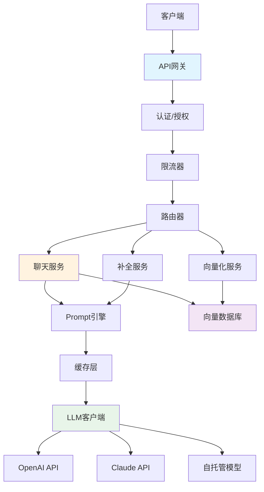

# Go LLM应用开发完整指南

> **更新日期**: 2025年10月24日  
> **适用版本**: Go 1.21+  
> **难度**: ⭐⭐⭐⭐⭐  
> **标签**: #LLM #OpenAI #Anthropic #ChatGPT #Claude #AI应用

---

## 📚 目录

- [Go LLM应用开发完整指南](#go-llm应用开发完整指南)
  - [📚 目录](#-目录)
  - [1. LLM应用架构](#1-llm应用架构)
    - [1.1 典型LLM应用架构](#11-典型llm应用架构)
    - [1.2 Go在LLM应用中的优势](#12-go在llm应用中的优势)
    - [1.3 核心组件](#13-核心组件)
  - [2. LLM API集成](#2-llm-api集成)
    - [2.1 OpenAI API](#21-openai-api)
    - [2.2 Anthropic Claude API](#22-anthropic-claude-api)
    - [2.3 统一LLM客户端接口](#23-统一llm客户端接口)
  - [3. Prompt工程](#3-prompt工程)
    - [3.1 Prompt模板管理](#31-prompt模板管理)
    - [3.2 动态Prompt构建](#32-动态prompt构建)
    - [3.3 Few-Shot Learning](#33-few-shot-learning)
    - [3.4 Chain of Thought](#34-chain-of-thought)
  - [4. 流式响应处理](#4-流式响应处理)
    - [4.1 SSE流式输出](#41-sse流式输出)
    - [4.2 WebSocket实时通信](#42-websocket实时通信)
  - [5. Function Calling](#5-function-calling)
    - [5.1 函数定义](#51-函数定义)
    - [5.2 函数执行器](#52-函数执行器)
  - [11. 实战案例](#11-实战案例)
    - [11.1 智能聊天机器人](#111-智能聊天机器人)
    - [11.2 文档摘要服务](#112-文档摘要服务)
  - [12. 生产部署](#12-生产部署)
    - [12.1 配置管理](#121-配置管理)
    - [12.2 监控与日志](#122-监控与日志)
    - [12.3 安全最佳实践](#123-安全最佳实践)
  - [13. 参考资源](#13-参考资源)
    - [官方文档](#官方文档)
    - [Go库](#go库)
    - [最佳实践](#最佳实践)

---

## 1. LLM应用架构

### 1.1 典型LLM应用架构



### 1.2 Go在LLM应用中的优势

**性能优势**:

- ✅ 高并发处理（goroutine）
- ✅ 低延迟响应
- ✅ 高效的内存管理
- ✅ 原生HTTP/2支持

**工程优势**:

- ✅ 简单的部署（单一二进制）
- ✅ 优秀的并发原语
- ✅ 强类型系统
- ✅ 丰富的标准库

**适用场景**:

- LLM API网关
- 高并发聊天服务
- 实时流式响应
- 微服务架构

### 1.3 核心组件

| 组件 | 职责 | 关键技术 |
|------|------|----------|
| **LLM客户端** | API调用、重试、流式处理 | HTTP Client, SSE |
| **Prompt引擎** | 模板管理、动态构建 | text/template |
| **缓存层** | 响应缓存、成本优化 | Redis, 内存缓存 |
| **向量存储** | Embeddings存储、语义搜索 | Qdrant, Weaviate |
| **监控系统** | 性能监控、成本追踪 | Prometheus, Grafana |

---

## 2. LLM API集成

### 2.1 OpenAI API

**完整的OpenAI客户端实现**:

```go
package llm

import (
    "bytes"
    "context"
    "encoding/json"
    "fmt"
    "io"
    "net/http"
    "time"
)

// OpenAIClient OpenAI客户端
type OpenAIClient struct {
    apiKey     string
    baseURL    string
    httpClient *http.Client
}

// ChatMessage 聊天消息
type ChatMessage struct {
    Role    string `json:"role"`    // system, user, assistant
    Content string `json:"content"`
}

// ChatRequest 聊天请求
type ChatRequest struct {
    Model       string        `json:"model"`
    Messages    []ChatMessage `json:"messages"`
    Temperature float64       `json:"temperature,omitempty"`
    MaxTokens   int           `json:"max_tokens,omitempty"`
    Stream      bool          `json:"stream,omitempty"`
}

// ChatResponse 聊天响应
type ChatResponse struct {
    ID      string `json:"id"`
    Object  string `json:"object"`
    Created int64  `json:"created"`
    Model   string `json:"model"`
    Choices []struct {
        Index   int         `json:"index"`
        Message ChatMessage `json:"message"`
        Finish  string      `json:"finish_reason"`
    } `json:"choices"`
    Usage struct {
        PromptTokens     int `json:"prompt_tokens"`
        CompletionTokens int `json:"completion_tokens"`
        TotalTokens      int `json:"total_tokens"`
    } `json:"usage"`
}

func NewOpenAIClient(apiKey string) *OpenAIClient {
    return &OpenAIClient{
        apiKey:  apiKey,
        baseURL: "https://api.openai.com/v1",
        httpClient: &http.Client{
            Timeout: 60 * time.Second,
        },
    }
}

// Chat 发送聊天请求
func (c *OpenAIClient) Chat(ctx context.Context, req ChatRequest) (*ChatResponse, error) {
    // 构建请求体
    body, err := json.Marshal(req)
    if err != nil {
        return nil, fmt.Errorf("marshal request: %w", err)
    }

    // 创建HTTP请求
    httpReq, err := http.NewRequestWithContext(
        ctx,
        http.MethodPost,
        c.baseURL+"/chat/completions",
        bytes.NewReader(body),
    )
    if err != nil {
        return nil, fmt.Errorf("create request: %w", err)
    }

    // 设置headers
    httpReq.Header.Set("Content-Type", "application/json")
    httpReq.Header.Set("Authorization", "Bearer "+c.apiKey)

    // 发送请求
    resp, err := c.httpClient.Do(httpReq)
    if err != nil {
        return nil, fmt.Errorf("do request: %w", err)
    }
    defer resp.Body.Close()

    // 检查状态码
    if resp.StatusCode != http.StatusOK {
        body, _ := io.ReadAll(resp.Body)
        return nil, fmt.Errorf("API error %d: %s", resp.StatusCode, string(body))
    }

    // 解析响应
    var chatResp ChatResponse
    if err := json.NewDecoder(resp.Body).Decode(&chatResp); err != nil {
        return nil, fmt.Errorf("decode response: %w", err)
    }

    return &chatResp, nil
}

// ChatStream 流式聊天
func (c *OpenAIClient) ChatStream(
    ctx context.Context,
    req ChatRequest,
    callback func(chunk string) error,
) error {
    req.Stream = true

    body, err := json.Marshal(req)
    if err != nil {
        return fmt.Errorf("marshal request: %w", err)
    }

    httpReq, err := http.NewRequestWithContext(
        ctx,
        http.MethodPost,
        c.baseURL+"/chat/completions",
        bytes.NewReader(body),
    )
    if err != nil {
        return fmt.Errorf("create request: %w", err)
    }

    httpReq.Header.Set("Content-Type", "application/json")
    httpReq.Header.Set("Authorization", "Bearer "+c.apiKey)
    httpReq.Header.Set("Accept", "text/event-stream")

    resp, err := c.httpClient.Do(httpReq)
    if err != nil {
        return fmt.Errorf("do request: %w", err)
    }
    defer resp.Body.Close()

    if resp.StatusCode != http.StatusOK {
        body, _ := io.ReadAll(resp.Body)
        return fmt.Errorf("API error %d: %s", resp.StatusCode, string(body))
    }

    // 读取SSE流
    reader := bufio.NewReader(resp.Body)
    for {
        line, err := reader.ReadBytes('\n')
        if err != nil {
            if err == io.EOF {
                break
            }
            return err
        }

        // 解析SSE数据
        if bytes.HasPrefix(line, []byte("data: ")) {
            data := bytes.TrimPrefix(line, []byte("data: "))
            data = bytes.TrimSpace(data)

            if string(data) == "[DONE]" {
                break
            }

            var chunk struct {
                Choices []struct {
                    Delta struct {
                        Content string `json:"content"`
                    } `json:"delta"`
                } `json:"choices"`
            }

            if err := json.Unmarshal(data, &chunk); err != nil {
                continue
            }

            if len(chunk.Choices) > 0 && chunk.Choices[0].Delta.Content != "" {
                if err := callback(chunk.Choices[0].Delta.Content); err != nil {
                    return err
                }
            }
        }
    }

    return nil
}

// 使用示例
func Example() {
    client := NewOpenAIClient("sk-...")

    // 1. 普通聊天
    resp, err := client.Chat(context.Background(), ChatRequest{
        Model: "gpt-4",
        Messages: []ChatMessage{
            {Role: "system", Content: "You are a helpful assistant."},
            {Role: "user", Content: "Hello, how are you?"},
        },
        Temperature: 0.7,
        MaxTokens:   1000,
    })
    if err != nil {
        panic(err)
    }

    fmt.Println(resp.Choices[0].Message.Content)
    fmt.Printf("Tokens used: %d\n", resp.Usage.TotalTokens)

    // 2. 流式聊天
    err = client.ChatStream(context.Background(), ChatRequest{
        Model: "gpt-4",
        Messages: []ChatMessage{
            {Role: "user", Content: "Write a short poem about Go"},
        },
    }, func(chunk string) error {
        fmt.Print(chunk)
        return nil
    })
    if err != nil {
        panic(err)
    }
}
```

### 2.2 Anthropic Claude API

**Claude客户端实现**:

```go
package llm

import (
    "bytes"
    "context"
    "encoding/json"
    "fmt"
    "io"
    "net/http"
    "time"
)

// ClaudeClient Anthropic Claude客户端
type ClaudeClient struct {
    apiKey     string
    baseURL    string
    httpClient *http.Client
}

// ClaudeMessage Claude消息格式
type ClaudeMessage struct {
    Role    string `json:"role"`    // user, assistant
    Content string `json:"content"`
}

// ClaudeRequest Claude请求
type ClaudeRequest struct {
    Model     string          `json:"model"`
    Messages  []ClaudeMessage `json:"messages"`
    MaxTokens int             `json:"max_tokens"`
    System    string          `json:"system,omitempty"`
    Stream    bool            `json:"stream,omitempty"`
}

// ClaudeResponse Claude响应
type ClaudeResponse struct {
    ID      string `json:"id"`
    Type    string `json:"type"`
    Role    string `json:"role"`
    Content []struct {
        Type string `json:"type"`
        Text string `json:"text"`
    } `json:"content"`
    Model        string `json:"model"`
    StopReason   string `json:"stop_reason"`
    StopSequence string `json:"stop_sequence"`
    Usage        struct {
        InputTokens  int `json:"input_tokens"`
        OutputTokens int `json:"output_tokens"`
    } `json:"usage"`
}

func NewClaudeClient(apiKey string) *ClaudeClient {
    return &ClaudeClient{
        apiKey:  apiKey,
        baseURL: "https://api.anthropic.com/v1",
        httpClient: &http.Client{
            Timeout: 60 * time.Second,
        },
    }
}

// Chat 发送消息给Claude
func (c *ClaudeClient) Chat(ctx context.Context, req ClaudeRequest) (*ClaudeResponse, error) {
    body, err := json.Marshal(req)
    if err != nil {
        return nil, fmt.Errorf("marshal request: %w", err)
    }

    httpReq, err := http.NewRequestWithContext(
        ctx,
        http.MethodPost,
        c.baseURL+"/messages",
        bytes.NewReader(body),
    )
    if err != nil {
        return nil, fmt.Errorf("create request: %w", err)
    }

    // Claude特定的headers
    httpReq.Header.Set("Content-Type", "application/json")
    httpReq.Header.Set("x-api-key", c.apiKey)
    httpReq.Header.Set("anthropic-version", "2023-06-01")

    resp, err := c.httpClient.Do(httpReq)
    if err != nil {
        return nil, fmt.Errorf("do request: %w", err)
    }
    defer resp.Body.Close()

    if resp.StatusCode != http.StatusOK {
        body, _ := io.ReadAll(resp.Body)
        return nil, fmt.Errorf("API error %d: %s", resp.StatusCode, string(body))
    }

    var claudeResp ClaudeResponse
    if err := json.NewDecoder(resp.Body).Decode(&claudeResp); err != nil {
        return nil, fmt.Errorf("decode response: %w", err)
    }

    return &claudeResp, nil
}

// 使用示例
func ExampleClaude() {
    client := NewClaudeClient("sk-ant-...")

    resp, err := client.Chat(context.Background(), ClaudeRequest{
        Model: "claude-3-sonnet-20240229",
        Messages: []ClaudeMessage{
            {Role: "user", Content: "Hello, Claude!"},
        },
        MaxTokens: 1000,
        System:    "You are a helpful assistant.",
    })
    if err != nil {
        panic(err)
    }

    if len(resp.Content) > 0 {
        fmt.Println(resp.Content[0].Text)
    }
    fmt.Printf("Tokens: Input=%d, Output=%d\n",
        resp.Usage.InputTokens,
        resp.Usage.OutputTokens,
    )
}
```

### 2.3 统一LLM客户端接口

**抽象接口设计**:

```go
package llm

import "context"

// LLMProvider LLM提供商接口
type LLMProvider interface {
    // Chat 发送聊天请求
    Chat(ctx context.Context, req ChatRequest) (*ChatResponse, error)
    
    // ChatStream 流式聊天
    ChatStream(ctx context.Context, req ChatRequest, callback func(string) error) error
    
    // Name 提供商名称
    Name() string
}

// UnifiedClient 统一的LLM客户端
type UnifiedClient struct {
    providers map[string]LLMProvider
    default   string
}

func NewUnifiedClient() *UnifiedClient {
    return &UnifiedClient{
        providers: make(map[string]LLMProvider),
    }
}

// RegisterProvider 注册提供商
func (c *UnifiedClient) RegisterProvider(name string, provider LLMProvider) {
    c.providers[name] = provider
    if c.default == "" {
        c.default = name
    }
}

// SetDefault 设置默认提供商
func (c *UnifiedClient) SetDefault(name string) {
    c.default = name
}

// Chat 使用指定或默认提供商
func (c *UnifiedClient) Chat(ctx context.Context, provider string, req ChatRequest) (*ChatResponse, error) {
    if provider == "" {
        provider = c.default
    }

    p, ok := c.providers[provider]
    if !ok {
        return nil, fmt.Errorf("provider %s not found", provider)
    }

    return p.Chat(ctx, req)
}

// 使用示例
func ExampleUnified() {
    client := NewUnifiedClient()

    // 注册多个提供商
    client.RegisterProvider("openai", NewOpenAIClient("sk-..."))
    client.RegisterProvider("claude", NewClaudeClient("sk-ant-..."))

    client.SetDefault("openai")

    // 使用默认提供商（OpenAI）
    resp1, _ := client.Chat(context.Background(), "", ChatRequest{
        Model: "gpt-4",
        Messages: []ChatMessage{
            {Role: "user", Content: "Hello"},
        },
    })

    // 使用Claude
    resp2, _ := client.Chat(context.Background(), "claude", ChatRequest{
        Model: "claude-3-sonnet-20240229",
        Messages: []ChatMessage{
            {Role: "user", Content: "Hello"},
        },
    })
}
```

---

## 3. Prompt工程

### 3.1 Prompt模板管理

**模板系统实现**:

```go
package prompt

import (
    "bytes"
    "fmt"
    "text/template"
)

// Template Prompt模板
type Template struct {
    name string
    tmpl *template.Template
}

// TemplateManager 模板管理器
type TemplateManager struct {
    templates map[string]*Template
}

func NewTemplateManager() *TemplateManager {
    return &TemplateManager{
        templates: make(map[string]*Template),
    }
}

// Register 注册模板
func (m *TemplateManager) Register(name, content string) error {
    tmpl, err := template.New(name).Parse(content)
    if err != nil {
        return fmt.Errorf("parse template: %w", err)
    }

    m.templates[name] = &Template{
        name: name,
        tmpl: tmpl,
    }
    return nil
}

// Render 渲染模板
func (m *TemplateManager) Render(name string, data interface{}) (string, error) {
    tmpl, ok := m.templates[name]
    if !ok {
        return "", fmt.Errorf("template %s not found", name)
    }

    var buf bytes.Buffer
    if err := tmpl.tmpl.Execute(&buf, data); err != nil {
        return "", fmt.Errorf("execute template: %w", err)
    }

    return buf.String(), nil
}

// 预定义模板
func SetupDefaultTemplates(m *TemplateManager) {
    // 摘要模板
    m.Register("summarize", `
Please summarize the following text concisely:

Text: {{.Text}}

Provide a summary in {{.MaxSentences}} sentences or less.
`)

    // 翻译模板
    m.Register("translate", `
Translate the following text from {{.SourceLang}} to {{.TargetLang}}:

{{.Text}}
`)

    // 代码解释模板
    m.Register("explain_code", `
Explain the following {{.Language}} code in simple terms:

` + "```{{.Language}}\n{{.Code}}\n```" + `

Include:
1. What the code does
2. Key concepts used
3. Potential issues or improvements
`)

    // 问答模板
    m.Register("qa", `
Context: {{.Context}}

Question: {{.Question}}

Please provide a detailed answer based on the context provided.
`)
}

// 使用示例
func Example() {
    manager := NewTemplateManager()
    SetupDefaultTemplates(manager)

    // 渲染摘要模板
    prompt, _ := manager.Render("summarize", map[string]interface{}{
        "Text":         "Long article text...",
        "MaxSentences": 3,
    })

    // 渲染翻译模板
    prompt, _ = manager.Render("translate", map[string]interface{}{
        "SourceLang": "English",
        "TargetLang": "Chinese",
        "Text":       "Hello, world!",
    })

    // 渲染代码解释模板
    prompt, _ = manager.Render("explain_code", map[string]interface{}{
        "Language": "Go",
        "Code": `func fibonacci(n int) int {
    if n <= 1 {
        return n
    }
    return fibonacci(n-1) + fibonacci(n-2)
}`,
    })
}
```

### 3.2 动态Prompt构建

**构建器模式**:

```go
package prompt

import (
    "fmt"
    "strings"
)

// Builder Prompt构建器
type Builder struct {
    parts []string
}

func NewBuilder() *Builder {
    return &Builder{
        parts: make([]string, 0),
    }
}

// AddSystem 添加系统提示
func (b *Builder) AddSystem(content string) *Builder {
    b.parts = append(b.parts, fmt.Sprintf("[System]\n%s\n", content))
    return b
}

// AddContext 添加上下文
func (b *Builder) AddContext(context string) *Builder {
    b.parts = append(b.parts, fmt.Sprintf("[Context]\n%s\n", context))
    return b
}

// AddExamples 添加示例
func (b *Builder) AddExamples(examples []Example) *Builder {
    if len(examples) == 0 {
        return b
    }

    b.parts = append(b.parts, "[Examples]")
    for i, ex := range examples {
        b.parts = append(b.parts, fmt.Sprintf("\nExample %d:", i+1))
        b.parts = append(b.parts, fmt.Sprintf("Input: %s", ex.Input))
        b.parts = append(b.parts, fmt.Sprintf("Output: %s\n", ex.Output))
    }
    return b
}

// AddInstruction 添加指令
func (b *Builder) AddInstruction(instruction string) *Builder {
    b.parts = append(b.parts, fmt.Sprintf("[Instruction]\n%s\n", instruction))
    return b
}

// AddQuery 添加查询
func (b *Builder) AddQuery(query string) *Builder {
    b.parts = append(b.parts, fmt.Sprintf("[Query]\n%s", query))
    return b
}

// Build 构建最终prompt
func (b *Builder) Build() string {
    return strings.Join(b.parts, "\n")
}

type Example struct {
    Input  string
    Output string
}

// 使用示例
func ExampleBuilder() {
    prompt := NewBuilder().
        AddSystem("You are a helpful coding assistant.").
        AddContext("The user is learning Go programming.").
        AddExamples([]Example{
            {
                Input:  "How to create a slice?",
                Output: "Use make([]Type, length, capacity) or []Type{values...}",
            },
            {
                Input:  "How to iterate a map?",
                Output: "Use for key, value := range myMap { ... }",
            },
        }).
        AddInstruction("Provide clear, concise answers with code examples.").
        AddQuery("How do I handle errors in Go?").
        Build()

    fmt.Println(prompt)
}
```

### 3.3 Few-Shot Learning

**Few-Shot示例管理**:

```go
package prompt

// FewShotManager Few-Shot示例管理器
type FewShotManager struct {
    examples []Example
    maxExamples int
}

func NewFewShotManager(maxExamples int) *FewShotManager {
    return &FewShotManager{
        examples:    make([]Example, 0),
        maxExamples: maxExamples,
    }
}

// AddExample 添加示例
func (m *FewShotManager) AddExample(input, output string) {
    m.examples = append(m.examples, Example{
        Input:  input,
        Output: output,
    })

    // 保持最大数量
    if len(m.examples) > m.maxExamples {
        m.examples = m.examples[len(m.examples)-m.maxExamples:]
    }
}

// GetExamples 获取示例
func (m *FewShotManager) GetExamples() []Example {
    return m.examples
}

// BuildPrompt 构建Few-Shot prompt
func (m *FewShotManager) BuildPrompt(task, query string) string {
    builder := NewBuilder().
        AddSystem(fmt.Sprintf("Task: %s", task))

    if len(m.examples) > 0 {
        builder.AddExamples(m.examples)
    }

    return builder.AddQuery(query).Build()
}

// 使用示例：情感分类
func ExampleFewShot() {
    manager := NewFewShotManager(5)

    // 添加示例
    manager.AddExample(
        "The product is amazing! Best purchase ever.",
        "Positive",
    )
    manager.AddExample(
        "Terrible quality, broke after one use.",
        "Negative",
    )
    manager.AddExample(
        "It's okay, nothing special.",
        "Neutral",
    )

    // 构建prompt
    prompt := manager.BuildPrompt(
        "Sentiment Classification",
        "This is exactly what I needed!",
    )

    fmt.Println(prompt)
}
```

### 3.4 Chain of Thought

**CoT实现**:

```go
package prompt

// CoTBuilder Chain of Thought构建器
type CoTBuilder struct {
    problem string
    steps   []string
}

func NewCoTBuilder(problem string) *CoTBuilder {
    return &CoTBuilder{
        problem: problem,
        steps:   make([]string, 0),
    }
}

// AddStep 添加推理步骤
func (b *CoTBuilder) AddStep(step string) *CoTBuilder {
    b.steps = append(b.steps, step)
    return b
}

// Build 构建CoT prompt
func (b *CoTBuilder) Build() string {
    var sb strings.Builder

    sb.WriteString("Let's solve this step by step:\n\n")
    sb.WriteString(fmt.Sprintf("Problem: %s\n\n", b.problem))

    for i, step := range b.steps {
        sb.WriteString(fmt.Sprintf("Step %d: %s\n", i+1, step))
    }

    sb.WriteString("\nBased on these steps, please provide the final answer.")

    return sb.String()
}

// BuildAutoCoT 自动生成CoT prompt
func BuildAutoCoT(problem string) string {
    return fmt.Sprintf(`%s

Let's approach this step-by-step:
1. First, let's identify what we know
2. Then, let's determine what we need to find
3. Next, let's plan our solution strategy
4. Finally, let's execute the plan and verify

Please think through each step carefully.`, problem)
}

// 使用示例
func ExampleCoT() {
    // 手动构建CoT
    prompt := NewCoTBuilder("A store sold 48 apples in the morning and 36 in the afternoon. How many apples were sold in total?").
        AddStep("Identify the numbers: morning = 48, afternoon = 36").
        AddStep("Determine the operation: addition (finding total)").
        AddStep("Calculate: 48 + 36 = 84").
        Build()

    // 自动CoT
    autoPrompt := BuildAutoCoT("What is the sum of all even numbers from 1 to 100?")

    fmt.Println(prompt)
    fmt.Println(autoPrompt)
}
```

---

## 4. 流式响应处理

### 4.1 SSE流式输出

**HTTP SSE服务器实现**:

```go
package api

import (
    "bufio"
    "context"
    "fmt"
    "net/http"
    "time"
)

// StreamHandler SSE流式处理器
type StreamHandler struct {
    llmClient *llm.OpenAIClient
}

func NewStreamHandler(client *llm.OpenAIClient) *StreamHandler {
    return &StreamHandler{
        llmClient: client,
    }
}

// HandleStream 处理流式请求
func (h *StreamHandler) HandleStream(w http.ResponseWriter, r *http.Request) {
    // 设置SSE headers
    w.Header().Set("Content-Type", "text/event-stream")
    w.Header().Set("Cache-Control", "no-cache")
    w.Header().Set("Connection", "keep-alive")
    w.Header().Set("Access-Control-Allow-Origin", "*")

    flusher, ok := w.(http.Flusher)
    if !ok {
        http.Error(w, "Streaming not supported", http.StatusInternalServerError)
        return
    }

    // 解析请求
    var req ChatRequest
    if err := json.NewDecoder(r.Body).Decode(&req); err != nil {
        http.Error(w, err.Error(), http.StatusBadRequest)
        return
    }

    // 流式调用LLM
    ctx := r.Context()
    err := h.llmClient.ChatStream(ctx, req, func(chunk string) error {
        // 发送SSE事件
        fmt.Fprintf(w, "data: %s\n\n", chunk)
        flusher.Flush()

        // 检查客户端是否断开
        select {
        case <-ctx.Done():
            return ctx.Err()
        default:
            return nil
        }
    })

    if err != nil {
        fmt.Fprintf(w, "data: [ERROR] %s\n\n", err.Error())
        flusher.Flush()
    }

    // 发送结束标记
    fmt.Fprintf(w, "data: [DONE]\n\n")
    flusher.Flush()
}

// 客户端使用示例（JavaScript）
/*
const eventSource = new EventSource('/api/stream');

eventSource.onmessage = (event) => {
    if (event.data === '[DONE]') {
        eventSource.close();
        return;
    }
    
    if (event.data.startsWith('[ERROR]')) {
        console.error('Stream error:', event.data);
        return;
    }
    
    // 显示流式内容
    document.getElementById('output').textContent += event.data;
};

eventSource.onerror = (error) => {
    console.error('SSE error:', error);
    eventSource.close();
};
*/
```

### 4.2 WebSocket实时通信

**WebSocket服务器实现**:

```go
package api

import (
    "context"
    "encoding/json"
    "log"
    "net/http"
    
    "github.com/gorilla/websocket"
)

var upgrader = websocket.Upgrader{
    CheckOrigin: func(r *http.Request) bool {
        return true // 生产环境需要更严格的检查
    },
}

// WSHandler WebSocket处理器
type WSHandler struct {
    llmClient *llm.OpenAIClient
}

func NewWSHandler(client *llm.OpenAIClient) *WSHandler {
    return &WSHandler{
        llmClient: client,
    }
}

// HandleWS 处理WebSocket连接
func (h *WSHandler) HandleWS(w http.ResponseWriter, r *http.Request) {
    conn, err := upgrader.Upgrade(w, r, nil)
    if err != nil {
        log.Printf("Upgrade error: %v", err)
        return
    }
    defer conn.Close()

    for {
        // 读取客户端消息
        var req ChatRequest
        if err := conn.ReadJSON(&req); err != nil {
            if websocket.IsCloseError(err, websocket.CloseNormalClosure) {
                break
            }
            log.Printf("Read error: %v", err)
            break
        }

        // 流式处理
        ctx := context.Background()
        err = h.llmClient.ChatStream(ctx, req, func(chunk string) error {
            // 发送chunk到客户端
            msg := map[string]string{
                "type": "chunk",
                "data": chunk,
            }
            return conn.WriteJSON(msg)
        })

        if err != nil {
            conn.WriteJSON(map[string]string{
                "type":  "error",
                "error": err.Error(),
            })
            continue
        }

        // 发送完成消息
        conn.WriteJSON(map[string]string{
            "type": "done",
        })
    }
}

// 客户端使用示例（JavaScript）
/*
const ws = new WebSocket('ws://localhost:8080/ws');

ws.onopen = () => {
    ws.send(JSON.stringify({
        model: 'gpt-4',
        messages: [
            {role: 'user', content: 'Hello!'}
        ]
    }));
};

ws.onmessage = (event) => {
    const msg = JSON.parse(event.data);
    
    switch(msg.type) {
        case 'chunk':
            document.getElementById('output').textContent += msg.data;
            break;
        case 'done':
            console.log('Stream completed');
            break;
        case 'error':
            console.error('Error:', msg.error);
            break;
    }
};
*/
```

---

## 5. Function Calling

### 5.1 函数定义

**Function定义和注册**:

```go
package function

import (
    "encoding/json"
    "fmt"
)

// Function 函数定义
type Function struct {
    Name        string                 `json:"name"`
    Description string                 `json:"description"`
    Parameters  map[string]interface{} `json:"parameters"`
    Handler     func(args map[string]interface{}) (interface{}, error) `json:"-"`
}

// FunctionRegistry 函数注册表
type FunctionRegistry struct {
    functions map[string]*Function
}

func NewFunctionRegistry() *FunctionRegistry {
    return &FunctionRegistry{
        functions: make(map[string]*Function),
    }
}

// Register 注册函数
func (r *FunctionRegistry) Register(fn *Function) {
    r.functions[fn.Name] = fn
}

// Get 获取函数
func (r *FunctionRegistry) Get(name string) (*Function, bool) {
    fn, ok := r.functions[name]
    return fn, ok
}

// GetFunctionSpecs 获取所有函数规格（用于API调用）
func (r *FunctionRegistry) GetFunctionSpecs() []map[string]interface{} {
    specs := make([]map[string]interface{}, 0, len(r.functions))
    
    for _, fn := range r.functions {
        specs = append(specs, map[string]interface{}{
            "name":        fn.Name,
            "description": fn.Description,
            "parameters":  fn.Parameters,
        })
    }
    
    return specs
}

// 预定义函数示例
func SetupDefaultFunctions(registry *FunctionRegistry) {
    // 获取天气
    registry.Register(&Function{
        Name:        "get_weather",
        Description: "Get the current weather for a location",
        Parameters: map[string]interface{}{
            "type": "object",
            "properties": map[string]interface{}{
                "location": map[string]interface{}{
                    "type":        "string",
                    "description": "City name, e.g. San Francisco",
                },
                "unit": map[string]interface{}{
                    "type": "string",
                    "enum": []string{"celsius", "fahrenheit"},
                },
            },
            "required": []string{"location"},
        },
        Handler: func(args map[string]interface{}) (interface{}, error) {
            location := args["location"].(string)
            unit := "celsius"
            if u, ok := args["unit"].(string); ok {
                unit = u
            }
            
            // 实际实现中应该调用真实的天气API
            return map[string]interface{}{
                "location":    location,
                "temperature": 22,
                "unit":        unit,
                "condition":   "sunny",
            }, nil
        },
    })

    // 搜索知识库
    registry.Register(&Function{
        Name:        "search_knowledge_base",
        Description: "Search the knowledge base for relevant information",
        Parameters: map[string]interface{}{
            "type": "object",
            "properties": map[string]interface{}{
                "query": map[string]interface{}{
                    "type":        "string",
                    "description": "Search query",
                },
                "top_k": map[string]interface{}{
                    "type":        "number",
                    "description": "Number of results to return",
                },
            },
            "required": []string{"query"},
        },
        Handler: func(args map[string]interface{}) (interface{}, error) {
            query := args["query"].(string)
            topK := 5
            if k, ok := args["top_k"].(float64); ok {
                topK = int(k)
            }
            
            // 实际实现中应该查询向量数据库
            return []string{
                fmt.Sprintf("Result 1 for: %s", query),
                fmt.Sprintf("Result 2 for: %s", query),
            }, nil
        },
    })

    // 执行计算
    registry.Register(&Function{
        Name:        "calculator",
        Description: "Perform mathematical calculations",
        Parameters: map[string]interface{}{
            "type": "object",
            "properties": map[string]interface{}{
                "expression": map[string]interface{}{
                    "type":        "string",
                    "description": "Mathematical expression to evaluate",
                },
            },
            "required": []string{"expression"},
        },
        Handler: func(args map[string]interface{}) (interface{}, error) {
            expr := args["expression"].(string)
            // 实际实现中应该使用安全的表达式求值器
            return map[string]interface{}{
                "expression": expr,
                "result":     42, // 示例结果
            }, nil
        },
    })
}
```

### 5.2 函数执行器

**Function Calling完整流程**:

```go
package function

import (
    "context"
    "encoding/json"
    "fmt"
)

// Executor 函数执行器
type Executor struct {
    registry  *FunctionRegistry
    llmClient *llm.OpenAIClient
}

func NewExecutor(registry *FunctionRegistry, client *llm.OpenAIClient) *Executor {
    return &Executor{
        registry:  registry,
        llmClient: client,
    }
}

// Execute 执行Function Calling流程
func (e *Executor) Execute(ctx context.Context, messages []ChatMessage) (*ChatResponse, error) {
    // 1. 构建带函数的请求
    req := ChatRequest{
        Model:     "gpt-4",
        Messages:  messages,
        Functions: e.registry.GetFunctionSpecs(),
    }

    // 2. 调用LLM
    resp, err := e.llmClient.Chat(ctx, req)
    if err != nil {
        return nil, err
    }

    // 3. 检查是否需要调用函数
    if resp.Choices[0].FinishReason == "function_call" {
        funcCall := resp.Choices[0].Message.FunctionCall
        
        // 4. 执行函数
        fn, ok := e.registry.Get(funcCall.Name)
        if !ok {
            return nil, fmt.Errorf("function %s not found", funcCall.Name)
        }

        var args map[string]interface{}
        if err := json.Unmarshal([]byte(funcCall.Arguments), &args); err != nil {
            return nil, fmt.Errorf("parse arguments: %w", err)
        }

        result, err := fn.Handler(args)
        if err != nil {
            return nil, fmt.Errorf("execute function: %w", err)
        }

        // 5. 将函数结果返回给LLM
        resultJSON, _ := json.Marshal(result)
        messages = append(messages, ChatMessage{
            Role:    "function",
            Name:    funcCall.Name,
            Content: string(resultJSON),
        })

        // 6. 递归调用，让LLM根据函数结果生成最终答案
        return e.Execute(ctx, messages)
    }

    // 没有函数调用，返回结果
    return resp, nil
}

// 使用示例
func ExampleFunctionCalling() {
    // 设置
    registry := NewFunctionRegistry()
    SetupDefaultFunctions(registry)
    
    client := llm.NewOpenAIClient("sk-...")
    executor := NewExecutor(registry, client)

    // 执行
    messages := []ChatMessage{
        {Role: "user", Content: "What's the weather like in San Francisco?"},
    }

    resp, err := executor.Execute(context.Background(), messages)
    if err != nil {
        panic(err)
    }

    fmt.Println(resp.Choices[0].Message.Content)
    // 输出: "The weather in San Francisco is currently sunny with a temperature of 22°C."
}
```

---

## 11. 实战案例

### 11.1 智能聊天机器人

**完整的聊天机器人实现**:

```go
package chatbot

import (
    "context"
    "fmt"
    "sync"
    "time"
)

// ChatBot 聊天机器人
type ChatBot struct {
    llmClient    *llm.OpenAIClient
    sessions     map[string]*Session
    mu           sync.RWMutex
    maxHistory   int
    systemPrompt string
}

// Session 会话
type Session struct {
    ID       string
    Messages []ChatMessage
    Created  time.Time
    Updated  time.Time
}

func NewChatBot(client *llm.OpenAIClient, systemPrompt string) *ChatBot {
    return &ChatBot{
        llmClient:    client,
        sessions:     make(map[string]*Session),
        maxHistory:   20,
        systemPrompt: systemPrompt,
    }
}

// CreateSession 创建会话
func (b *ChatBot) CreateSession(sessionID string) {
    b.mu.Lock()
    defer b.mu.Unlock()

    b.sessions[sessionID] = &Session{
        ID:       sessionID,
        Messages: []ChatMessage{
            {Role: "system", Content: b.systemPrompt},
        },
        Created: time.Now(),
        Updated: time.Now(),
    }
}

// Chat 聊天
func (b *ChatBot) Chat(ctx context.Context, sessionID, message string) (string, error) {
    b.mu.Lock()
    session, ok := b.sessions[sessionID]
    if !ok {
        b.mu.Unlock()
        return "", fmt.Errorf("session not found")
    }

    // 添加用户消息
    session.Messages = append(session.Messages, ChatMessage{
        Role:    "user",
        Content: message,
    })

    // 保持历史记录在限制内
    if len(session.Messages) > b.maxHistory {
        // 保留system消息 + 最近的消息
        session.Messages = append(
            session.Messages[:1],
            session.Messages[len(session.Messages)-b.maxHistory+1:]...,
        )
    }

    messages := session.Messages
    b.mu.Unlock()

    // 调用LLM
    resp, err := b.llmClient.Chat(ctx, ChatRequest{
        Model:       "gpt-4",
        Messages:    messages,
        Temperature: 0.7,
    })
    if err != nil {
        return "", err
    }

    reply := resp.Choices[0].Message.Content

    // 保存助手回复
    b.mu.Lock()
    session.Messages = append(session.Messages, ChatMessage{
        Role:    "assistant",
        Content: reply,
    })
    session.Updated = time.Now()
    b.mu.Unlock()

    return reply, nil
}

// ChatStream 流式聊天
func (b *ChatBot) ChatStream(
    ctx context.Context,
    sessionID, message string,
    callback func(string) error,
) error {
    b.mu.Lock()
    session, ok := b.sessions[sessionID]
    if !ok {
        b.mu.Unlock()
        return fmt.Errorf("session not found")
    }

    session.Messages = append(session.Messages, ChatMessage{
        Role:    "user",
        Content: message,
    })

    messages := session.Messages
    b.mu.Unlock()

    // 流式调用
    var fullReply string
    err := b.llmClient.ChatStream(ctx, ChatRequest{
        Model:    "gpt-4",
        Messages: messages,
    }, func(chunk string) error {
        fullReply += chunk
        return callback(chunk)
    })

    if err != nil {
        return err
    }

    // 保存完整回复
    b.mu.Lock()
    session.Messages = append(session.Messages, ChatMessage{
        Role:    "assistant",
        Content: fullReply,
    })
    session.Updated = time.Now()
    b.mu.Unlock()

    return nil
}

// GetHistory 获取历史
func (b *ChatBot) GetHistory(sessionID string) ([]ChatMessage, error) {
    b.mu.RLock()
    defer b.mu.RUnlock()

    session, ok := b.sessions[sessionID]
    if !ok {
        return nil, fmt.Errorf("session not found")
    }

    return session.Messages, nil
}

// HTTP Handler
type ChatBotHandler struct {
    bot *ChatBot
}

func NewChatBotHandler(bot *ChatBot) *ChatBotHandler {
    return &ChatBotHandler{bot: bot}
}

func (h *ChatBotHandler) HandleChat(w http.ResponseWriter, r *http.Request) {
    var req struct {
        SessionID string `json:"session_id"`
        Message   string `json:"message"`
    }

    if err := json.NewDecoder(r.Body).Decode(&req); err != nil {
        http.Error(w, err.Error(), http.StatusBadRequest)
        return
    }

    reply, err := h.bot.Chat(r.Context(), req.SessionID, req.Message)
    if err != nil {
        http.Error(w, err.Error(), http.StatusInternalServerError)
        return
    }

    json.NewEncoder(w).Encode(map[string]string{
        "reply": reply,
    })
}

// 使用示例
func Example() {
    client := llm.NewOpenAIClient("sk-...")
    bot := NewChatBot(client, "You are a helpful assistant.")

    // 创建会话
    sessionID := "user-123"
    bot.CreateSession(sessionID)

    // 聊天
    reply, _ := bot.Chat(context.Background(), sessionID, "Hello!")
    fmt.Println(reply)

    reply, _ = bot.Chat(context.Background(), sessionID, "What's your name?")
    fmt.Println(reply)

    // 查看历史
    history, _ := bot.GetHistory(sessionID)
    for _, msg := range history {
        fmt.Printf("%s: %s\n", msg.Role, msg.Content)
    }
}
```

### 11.2 文档摘要服务

**智能文档摘要**:

```go
package summarizer

import (
    "context"
    "fmt"
    "strings"
)

// Summarizer 文档摘要器
type Summarizer struct {
    llmClient   *llm.OpenAIClient
    chunkSize   int
    maxTokens   int
}

func NewSummarizer(client *llm.OpenAIClient) *Summarizer {
    return &Summarizer{
        llmClient: client,
        chunkSize: 2000, // 字符数
        maxTokens: 500,
    }
}

// SummarizeText 摘要文本
func (s *Summarizer) SummarizeText(ctx context.Context, text string) (string, error) {
    // 如果文本较短，直接摘要
    if len(text) <= s.chunkSize {
        return s.summarizeChunk(ctx, text)
    }

    // 长文本：分块摘要后再总结
    chunks := s.splitIntoChunks(text, s.chunkSize)
    summaries := make([]string, 0, len(chunks))

    for i, chunk := range chunks {
        summary, err := s.summarizeChunk(ctx, chunk)
        if err != nil {
            return "", fmt.Errorf("summarize chunk %d: %w", i, err)
        }
        summaries = append(summaries, summary)
    }

    // 合并所有摘要并再次总结
    combined := strings.Join(summaries, "\n\n")
    return s.summarizeChunk(ctx, combined)
}

// summarizeChunk 摘要单个块
func (s *Summarizer) summarizeChunk(ctx context.Context, text string) (string, error) {
    prompt := fmt.Sprintf(`Please provide a concise summary of the following text:

%s

Summary:`, text)

    resp, err := s.llmClient.Chat(ctx, ChatRequest{
        Model: "gpt-4",
        Messages: []ChatMessage{
            {
                Role: "system",
                Content: "You are an expert at summarizing documents concisely while preserving key information.",
            },
            {
                Role:    "user",
                Content: prompt,
            },
        },
        MaxTokens:   s.maxTokens,
        Temperature: 0.3,
    })

    if err != nil {
        return "", err
    }

    return resp.Choices[0].Message.Content, nil
}

// splitIntoChunks 分块
func (s *Summarizer) splitIntoChunks(text string, chunkSize int) []string {
    var chunks []string
    words := strings.Fields(text)
    
    var current strings.Builder
    for _, word := range words {
        if current.Len()+len(word)+1 > chunkSize {
            chunks = append(chunks, current.String())
            current.Reset()
        }
        
        if current.Len() > 0 {
            current.WriteString(" ")
        }
        current.WriteString(word)
    }
    
    if current.Len() > 0 {
        chunks = append(chunks, current.String())
    }
    
    return chunks
}

// SummarizeWithBulletPoints 生成要点摘要
func (s *Summarizer) SummarizeWithBulletPoints(ctx context.Context, text string) ([]string, error) {
    prompt := fmt.Sprintf(`Summarize the following text in bullet points:

%s

Provide 3-5 key points:`, text)

    resp, err := s.llmClient.Chat(ctx, ChatRequest{
        Model: "gpt-4",
        Messages: []ChatMessage{
            {Role: "system", Content: "You are a summarization expert."},
            {Role: "user", Content: prompt},
        },
        MaxTokens: 300,
    })

    if err != nil {
        return nil, err
    }

    // 解析要点
    content := resp.Choices[0].Message.Content
    lines := strings.Split(content, "\n")
    
    var bullets []string
    for _, line := range lines {
        line = strings.TrimSpace(line)
        if strings.HasPrefix(line, "-") || strings.HasPrefix(line, "•") || strings.HasPrefix(line, "*") {
            bullets = append(bullets, strings.TrimPrefix(strings.TrimPrefix(strings.TrimPrefix(line, "-"), "•"), "*"))
        }
    }
    
    return bullets, nil
}

// 使用示例
func Example() {
    client := llm.NewOpenAIClient("sk-...")
    summarizer := NewSummarizer(client)

    longText := `[Long document content...]`

    // 生成摘要
    summary, _ := summarizer.SummarizeText(context.Background(), longText)
    fmt.Println("Summary:", summary)

    // 生成要点
    bullets, _ := summarizer.SummarizeWithBulletPoints(context.Background(), longText)
    for i, bullet := range bullets {
        fmt.Printf("%d. %s\n", i+1, bullet)
    }
}
```

---

## 12. 生产部署

### 12.1 配置管理

**环境配置**:

```go
package config

import (
    "fmt"
    "os"
    "strconv"
)

// LLMConfig LLM配置
type LLMConfig struct {
    OpenAIKey      string
    ClaudeKey      string
    DefaultModel   string
    MaxTokens      int
    Temperature    float64
    Timeout        int
    RetryAttempts  int
    CacheEnabled   bool
    CacheTTL       int
}

// LoadConfig 加载配置
func LoadConfig() (*LLMConfig, error) {
    config := &LLMConfig{
        OpenAIKey:     getEnv("OPENAI_API_KEY", ""),
        ClaudeKey:     getEnv("CLAUDE_API_KEY", ""),
        DefaultModel:  getEnv("LLM_DEFAULT_MODEL", "gpt-4"),
        MaxTokens:     getEnvInt("LLM_MAX_TOKENS", 2000),
        Temperature:   getEnvFloat("LLM_TEMPERATURE", 0.7),
        Timeout:       getEnvInt("LLM_TIMEOUT", 60),
        RetryAttempts: getEnvInt("LLM_RETRY_ATTEMPTS", 3),
        CacheEnabled:  getEnvBool("LLM_CACHE_ENABLED", true),
        CacheTTL:      getEnvInt("LLM_CACHE_TTL", 3600),
    }

    // 验证必需配置
    if config.OpenAIKey == "" && config.ClaudeKey == "" {
        return nil, fmt.Errorf("at least one API key must be provided")
    }

    return config, nil
}

func getEnv(key, defaultValue string) string {
    if value := os.Getenv(key); value != "" {
        return value
    }
    return defaultValue
}

func getEnvInt(key string, defaultValue int) int {
    if value := os.Getenv(key); value != "" {
        if intValue, err := strconv.Atoi(value); err == nil {
            return intValue
        }
    }
    return defaultValue
}

func getEnvFloat(key string, defaultValue float64) float64 {
    if value := os.Getenv(key); value != "" {
        if floatValue, err := strconv.ParseFloat(value, 64); err == nil {
            return floatValue
        }
    }
    return defaultValue
}

func getEnvBool(key string, defaultValue bool) bool {
    if value := os.Getenv(key); value != "" {
        if boolValue, err := strconv.ParseBool(value); err == nil {
            return boolValue
        }
    }
    return defaultValue
}
```

### 12.2 监控与日志

**监控指标**:

```go
package monitoring

import (
    "time"
    
    "github.com/prometheus/client_golang/prometheus"
    "github.com/prometheus/client_golang/prometheus/promauto"
)

var (
    // LLM请求计数
    llmRequestsTotal = promauto.NewCounterVec(
        prometheus.CounterOpts{
            Name: "llm_requests_total",
            Help: "Total number of LLM requests",
        },
        []string{"model", "status"},
    )

    // LLM请求延迟
    llmRequestDuration = promauto.NewHistogramVec(
        prometheus.HistogramOpts{
            Name:    "llm_request_duration_seconds",
            Help:    "Duration of LLM requests",
            Buckets: prometheus.DefBuckets,
        },
        []string{"model"},
    )

    // Token使用量
    llmTokensUsed = promauto.NewCounterVec(
        prometheus.CounterOpts{
            Name: "llm_tokens_used_total",
            Help: "Total number of tokens used",
        },
        []string{"model", "type"}, // type: prompt, completion
    )

    // LLM成本
    llmCost = promauto.NewCounterVec(
        prometheus.CounterOpts{
            Name: "llm_cost_total_dollars",
            Help: "Total LLM API cost in dollars",
        },
        []string{"model"},
    )
)

// Metrics LLM指标收集器
type Metrics struct{}

func NewMetrics() *Metrics {
    return &Metrics{}
}

// RecordRequest 记录请求
func (m *Metrics) RecordRequest(model string, duration time.Duration, promptTokens, completionTokens int, success bool) {
    status := "success"
    if !success {
        status := "error"
    }

    llmRequestsTotal.WithLabelValues(model, status).Inc()
    llmRequestDuration.WithLabelValues(model).Observe(duration.Seconds())
    
    llmTokensUsed.WithLabelValues(model, "prompt").Add(float64(promptTokens))
    llmTokensUsed.WithLabelValues(model, "completion").Add(float64(completionTokens))

    // 计算成本（示例价格）
    cost := calculateCost(model, promptTokens, completionTokens)
    llmCost.WithLabelValues(model).Add(cost)
}

func calculateCost(model string, promptTokens, completionTokens int) float64 {
    // GPT-4定价（2025年示例）
    if model == "gpt-4" {
        promptCost := float64(promptTokens) * 0.03 / 1000
        completionCost := float64(completionTokens) * 0.06 / 1000
        return promptCost + completionCost
    }
    return 0
}
```

### 12.3 安全最佳实践

**安全措施**:

```go
package security

import (
    "context"
    "fmt"
    "regexp"
    "strings"
)

// ContentModerator 内容审核器
type ContentModerator struct {
    bannedPatterns []*regexp.Regexp
    maxLength      int
}

func NewContentModerator() *ContentModerator {
    return &ContentModerator{
        bannedPatterns: []*regexp.Regexp{
            regexp.MustCompile(`\b(password|api[_\-]?key|secret|token)\b`),
            // 添加更多敏感词模式
        },
        maxLength: 10000,
    }
}

// CheckContent 检查内容
func (m *ContentModerator) CheckContent(content string) error {
    // 长度检查
    if len(content) > m.maxLength {
        return fmt.Errorf("content too long: %d > %d", len(content), m.maxLength)
    }

    // 敏感信息检查
    for _, pattern := range m.bannedPatterns {
        if pattern.MatchString(strings.ToLower(content)) {
            return fmt.Errorf("content contains sensitive information")
        }
    }

    return nil
}

// RateLimiter API限流器
type RateLimiter struct {
    // 使用golang.org/x/time/rate
}

// SecureClient 安全的LLM客户端包装
type SecureClient struct {
    client    *llm.OpenAIClient
    moderator *ContentModerator
    limiter   *RateLimiter
}

func (c *SecureClient) Chat(ctx context.Context, req ChatRequest) (*ChatResponse, error) {
    // 1. 内容审核
    for _, msg := range req.Messages {
        if err := c.moderator.CheckContent(msg.Content); err != nil {
            return nil, fmt.Errorf("content moderation failed: %w", err)
        }
    }

    // 2. 限流检查
    if err := c.limiter.Wait(ctx); err != nil {
        return nil, fmt.Errorf("rate limit exceeded: %w", err)
    }

    // 3. 调用LLM
    return c.client.Chat(ctx, req)
}
```

---

## 13. 参考资源

### 官方文档

- [OpenAI API Documentation](https://platform.openai.com/docs)
- [Anthropic Claude API](https://docs.anthropic.com/claude/reference)
- [Function Calling Guide](https://platform.openai.com/docs/guides/function-calling)

### Go库

- [go-openai](https://github.com/sashabaranov/go-openai) - OpenAI Go客户端
- [langchaingo](https://github.com/tmc/langchaingo) - LangChain Go实现
- [chromem-go](https://github.com/philippgille/chromem-go) - 向量数据库

### 最佳实践

- [Prompt Engineering Guide](https://www.promptingguide.ai/)
- [LLM Application Patterns](https://martinfowler.com/articles/2023-chatgpt-xu-hao.html)

---

**文档维护者**: Go Documentation Team  
**最后更新**: 2025年10月24日  
**文档状态**: ✅ 完成  
**适用版本**: Go 1.21+

**贡献者**: 欢迎提交Issue和PR改进本文档
