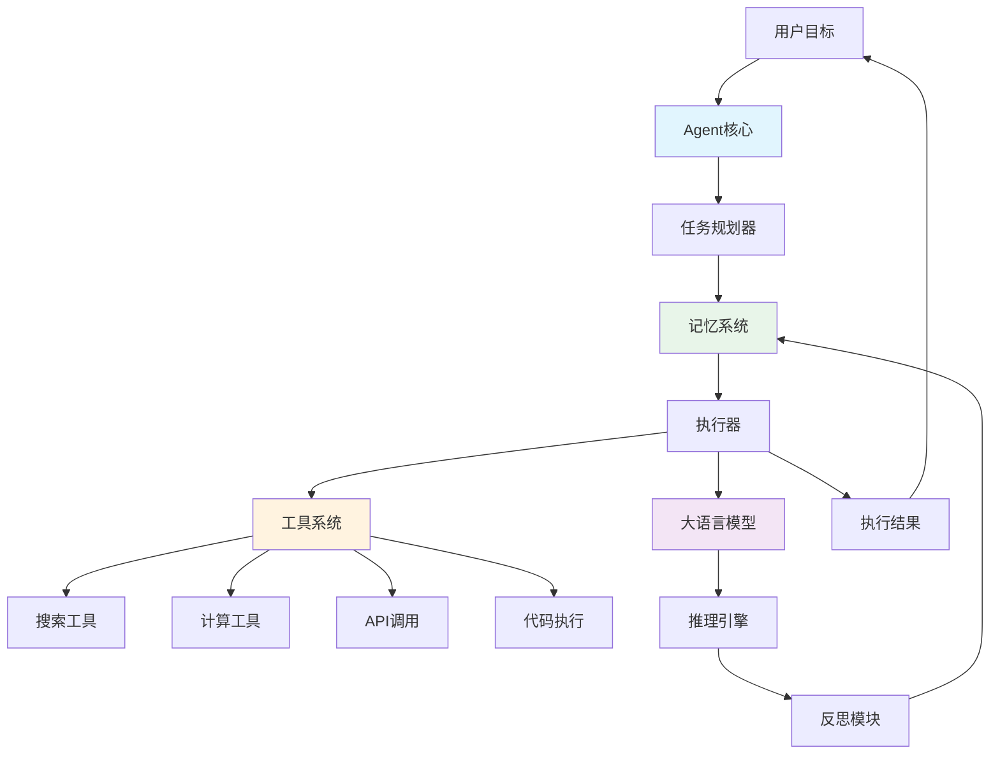

# Go Agent开发框架完整指南

> **更新日期**: 2025年10月24日  
> **适用版本**: Go 1.21+  
> **难度**: ⭐⭐⭐⭐⭐  
> **标签**: #Agent #ReAct #AutoGPT #LangChain #AI自主系统

---

## 📚 目录

- [Go Agent开发框架完整指南](#go-agent开发框架完整指南)
  - [📚 目录](#-目录)
  - [1. Agent系统概述](#1-agent系统概述)
    - [1.1 什么是AI Agent](#11-什么是ai-agent)
    - [1.2 Agent架构模式](#12-agent架构模式)
    - [主流架构模式](#主流架构模式)
    - [1.3 核心组件](#13-核心组件)
  - [2. ReAct模式实现](#2-react模式实现)
    - [2.1 ReAct原理](#21-react原理)
    - [2.2 完整实现](#22-完整实现)
    - [2.3 Thought-Action-Observation循环](#23-thought-action-observation循环)
  - [3. 工具系统](#3-工具系统)
    - [3.1 工具接口设计](#31-工具接口设计)
    - [3.2 预定义工具库](#32-预定义工具库)
  - [4. 记忆管理](#4-记忆管理)
    - [4.1 短期记忆](#41-短期记忆)
    - [4.2 长期记忆](#42-长期记忆)
  - [5. 任务规划](#5-任务规划)
    - [5.1 任务分解](#51-任务分解)
  - [7. 实战案例](#7-实战案例)
    - [7.1 研究助手Agent](#71-研究助手agent)
  - [9. 参考资源](#9-参考资源)
    - [官方文档](#官方文档)
    - [Go库](#go库)
    - [论文与研究](#论文与研究)
    - [最佳实践](#最佳实践)

---

## 1. Agent系统概述

### 1.1 什么是AI Agent

**AI Agent（智能代理）** 是一个能够感知环境、自主决策并采取行动以实现目标的AI系统。与传统的对话式AI不同，Agent具有：

**核心特征**:

- ✅ **自主性**：能够自主决策和执行
- ✅ **工具使用**：可以调用外部工具和API
- ✅ **规划能力**：能够分解复杂任务
- ✅ **记忆系统**：维护上下文和历史
- ✅ **反思学习**：从经验中学习改进

**应用场景**:

- 自动化研究和数据分析
- 代码生成和调试
- 客户服务自动化
- 业务流程自动化
- 个人助理系统

### 1.2 Agent架构模式



### 主流架构模式

1. **ReAct (Reasoning + Acting)**
   - Thought → Action → Observation循环
   - 适合需要多步推理的任务

2. **Plan-Execute**
   - 先规划整体方案
   - 再逐步执行
   - 适合复杂、结构化任务

3. **ReWOO (Reasoning WithOut Observation)**
   - 预先生成完整计划
   - 并行执行工具调用
   - 适合可预测的任务

### 1.3 核心组件

| 组件 | 职责 | 实现技术 |
|------|------|----------|
| **LLM引擎** | 推理和决策 | OpenAI GPT-4, Claude |
| **工具系统** | 执行具体操作 | Function Calling |
| **记忆管理** | 维护上下文 | 向量数据库 + 短期缓存 |
| **任务规划器** | 分解和调度任务 | Prompt Engineering |
| **反思模块** | 评估和改进 | Self-Critique |
| **安全控制** | 权限和限制 | Sandbox, Rate Limit |

---

## 2. ReAct模式实现

### 2.1 ReAct原理

ReAct = Reasoning (推理) + Acting (行动)

核心循环：

```text
1. Thought (思考): Agent思考下一步该做什么
2. Action (行动): Agent决定使用什么工具
3. Observation (观察): 工具执行后的结果
4. 重复 1-3 直到完成任务
```

### 2.2 完整实现

**ReAct Agent核心实现**:

```go
package agent

import (
    "context"
    "fmt"
    "strings"
)

// ReActAgent ReAct模式Agent
type ReActAgent struct {
    llm          LLMClient
    tools        *ToolRegistry
    memory       Memory
    maxSteps     int
    verbose      bool
}

// Step Agent执行的一步
type Step struct {
    Thought     string
    Action      string
    ActionInput string
    Observation string
}

func NewReActAgent(llm LLMClient, tools *ToolRegistry) *ReActAgent {
    return &ReActAgent{
        llm:      llm,
        tools:    tools,
        memory:   NewShortTermMemory(),
        maxSteps: 10,
        verbose:  true,
    }
}

// Run 执行Agent任务
func (a *ReActAgent) Run(ctx context.Context, goal string) (string, error) {
    a.memory.Clear()
    a.memory.AddMessage("user", goal)

    var steps []Step
    
    for i := 0; i < a.maxSteps; i++ {
        if a.verbose {
            fmt.Printf("\n=== Step %d ===\n", i+1)
        }

        // 1. 生成Thought和Action
        step, err := a.generateStep(ctx, goal, steps)
        if err != nil {
            return "", fmt.Errorf("generate step: %w", err)
        }

        if a.verbose {
            fmt.Printf("Thought: %s\n", step.Thought)
            fmt.Printf("Action: %s(%s)\n", step.Action, step.ActionInput)
        }

        // 检查是否完成
        if step.Action == "Final Answer" {
            return step.ActionInput, nil
        }

        // 2. 执行Action
        observation, err := a.executeAction(ctx, step.Action, step.ActionInput)
        if err != nil {
            observation = fmt.Sprintf("Error: %v", err)
        }
        step.Observation = observation

        if a.verbose {
            fmt.Printf("Observation: %s\n", observation)
        }

        // 3. 保存到记忆
        a.memory.AddMessage("assistant", fmt.Sprintf(
            "Thought: %s\nAction: %s\nAction Input: %s\nObservation: %s",
            step.Thought, step.Action, step.ActionInput, step.Observation,
        ))

        steps = append(steps, step)
    }

    return "", fmt.Errorf("reached max steps without final answer")
}

func (a *ReActAgent) generateStep(ctx context.Context, goal string, history []Step) (Step, error) {
    // 构建prompt
    prompt := a.buildPrompt(goal, history)

    // 调用LLM
    resp, err := a.llm.Chat(ctx, ChatRequest{
        Model: "gpt-4",
        Messages: []ChatMessage{
            {Role: "system", Content: a.getSystemPrompt()},
            {Role: "user", Content: prompt},
        },
        Temperature: 0.0,
    })
    if err != nil {
        return Step{}, err
    }

    // 解析响应
    return a.parseResponse(resp.Choices[0].Message.Content)
}

func (a *ReActAgent) getSystemPrompt() string {
    toolDocs := a.tools.GetDocumentation()
    
    return fmt.Sprintf(`You are a helpful AI assistant that uses tools to accomplish tasks.

Available Tools:
%s

Response Format:
You MUST use the following format:

Thought: [Your reasoning about what to do next]
Action: [The tool to use, must be one of: %s, or "Final Answer"]
Action Input: [The input for the tool]

After seeing the Observation, you can continue with another Thought/Action or give a Final Answer.

Example:
Thought: I need to search for information about Go programming
Action: search
Action Input: Go programming language features

Observation: [Search results will appear here]

Thought: Based on the search results, I can now provide an answer
Action: Final Answer
Action Input: Go is a statically typed, compiled language...
`, toolDocs, strings.Join(a.tools.ListTools(), ", "))
}

func (a *ReActAgent) buildPrompt(goal string, history []Step) string {
    var sb strings.Builder
    
    sb.WriteString(fmt.Sprintf("Goal: %s\n\n", goal))
    
    for i, step := range history {
        sb.WriteString(fmt.Sprintf("Step %d:\n", i+1))
        sb.WriteString(fmt.Sprintf("Thought: %s\n", step.Thought))
        sb.WriteString(fmt.Sprintf("Action: %s\n", step.Action))
        sb.WriteString(fmt.Sprintf("Action Input: %s\n", step.ActionInput))
        sb.WriteString(fmt.Sprintf("Observation: %s\n\n", step.Observation))
    }
    
    sb.WriteString("Now, what's the next step?")
    
    return sb.String()
}

func (a *ReActAgent) parseResponse(response string) (Step, error) {
    var step Step
    
    lines := strings.Split(response, "\n")
    for _, line := range lines {
        line = strings.TrimSpace(line)
        
        if strings.HasPrefix(line, "Thought:") {
            step.Thought = strings.TrimSpace(strings.TrimPrefix(line, "Thought:"))
        } else if strings.HasPrefix(line, "Action:") {
            step.Action = strings.TrimSpace(strings.TrimPrefix(line, "Action:"))
        } else if strings.HasPrefix(line, "Action Input:") {
            step.ActionInput = strings.TrimSpace(strings.TrimPrefix(line, "Action Input:"))
        }
    }
    
    if step.Thought == "" || step.Action == "" {
        return step, fmt.Errorf("invalid response format")
    }
    
    return step, nil
}

func (a *ReActAgent) executeAction(ctx context.Context, action, input string) (string, error) {
    tool, err := a.tools.Get(action)
    if err != nil {
        return "", err
    }
    
    result, err := tool.Execute(ctx, input)
    if err != nil {
        return "", err
    }
    
    return result, nil
}

// 使用示例
func ExampleReAct() {
    llm := NewOpenAIClient("sk-...")
    
    tools := NewToolRegistry()
    tools.Register(NewSearchTool())
    tools.Register(NewCalculatorTool())
    
    agent := NewReActAgent(llm, tools)
    
    answer, err := agent.Run(
        context.Background(),
        "What is the population of Tokyo and how many people would that be if increased by 15%?",
    )
    
    if err != nil {
        panic(err)
    }
    
    fmt.Println("Final Answer:", answer)
}
```

### 2.3 Thought-Action-Observation循环

**执行流程示例**:

```text
Goal: Calculate the square root of 144 and add 5

Step 1:
Thought: I need to calculate the square root of 144 first
Action: calculator
Action Input: sqrt(144)
Observation: 12

Step 2:
Thought: Now I need to add 5 to the result
Action: calculator
Action Input: 12 + 5
Observation: 17

Step 3:
Thought: I have the final answer
Action: Final Answer
Action Input: 17
```

---

## 3. 工具系统

### 3.1 工具接口设计

**统一的工具接口**:

```go
package tool

import "context"

// Tool 工具接口
type Tool interface {
    // Name 工具名称
    Name() string
    
    // Description 工具描述
    Description() string
    
    // Parameters 参数定义
    Parameters() map[string]interface{}
    
    // Execute 执行工具
    Execute(ctx context.Context, input string) (string, error)
}

// ToolRegistry 工具注册表
type ToolRegistry struct {
    tools map[string]Tool
}

func NewToolRegistry() *ToolRegistry {
    return &ToolRegistry{
        tools: make(map[string]Tool),
    }
}

// Register 注册工具
func (r *ToolRegistry) Register(tool Tool) {
    r.tools[tool.Name()] = tool
}

// Get 获取工具
func (r *ToolRegistry) Get(name string) (Tool, error) {
    tool, ok := r.tools[name]
    if !ok {
        return nil, fmt.Errorf("tool %s not found", name)
    }
    return tool, nil
}

// ListTools 列出所有工具名称
func (r *ToolRegistry) ListTools() []string {
    var names []string
    for name := range r.tools {
        names = append(names, name)
    }
    return names
}

// GetDocumentation 获取所有工具文档
func (r *ToolRegistry) GetDocumentation() string {
    var docs []string
    for _, tool := range r.tools {
        doc := fmt.Sprintf("- %s: %s", tool.Name(), tool.Description())
        docs = append(docs, doc)
    }
    return strings.Join(docs, "\n")
}
```

### 3.2 预定义工具库

**常用工具实现**:

```go
package tool

import (
    "context"
    "encoding/json"
    "fmt"
    "io"
    "net/http"
    "net/url"
)

// SearchTool 搜索工具
type SearchTool struct {
    apiKey string
}

func NewSearchTool() *SearchTool {
    return &SearchTool{
        apiKey: os.Getenv("SERP_API_KEY"),
    }
}

func (t *SearchTool) Name() string {
    return "search"
}

func (t *SearchTool) Description() string {
    return "Search the web for information. Input should be a search query string."
}

func (t *SearchTool) Parameters() map[string]interface{} {
    return map[string]interface{}{
        "type": "object",
        "properties": map[string]interface{}{
            "query": map[string]interface{}{
                "type":        "string",
                "description": "The search query",
            },
        },
        "required": []string{"query"},
    }
}

func (t *SearchTool) Execute(ctx context.Context, input string) (string, error) {
    // 调用搜索API (例如: SerpAPI, Google Custom Search)
    searchURL := fmt.Sprintf("https://serpapi.com/search?q=%s&api_key=%s",
        url.QueryEscape(input), t.apiKey)
    
    resp, err := http.Get(searchURL)
    if err != nil {
        return "", err
    }
    defer resp.Body.Close()
    
    body, _ := io.ReadAll(resp.Body)
    
    var result struct {
        OrganicResults []struct {
            Title   string `json:"title"`
            Snippet string `json:"snippet"`
        } `json:"organic_results"`
    }
    
    json.Unmarshal(body, &result)
    
    // 格式化结果
    var results []string
    for i, r := range result.OrganicResults {
        if i >= 3 {
            break
        }
        results = append(results, fmt.Sprintf("%d. %s: %s", i+1, r.Title, r.Snippet))
    }
    
    return strings.Join(results, "\n"), nil
}

// CalculatorTool 计算器工具
type CalculatorTool struct{}

func NewCalculatorTool() *CalculatorTool {
    return &CalculatorTool{}
}

func (t *CalculatorTool) Name() string {
    return "calculator"
}

func (t *CalculatorTool) Description() string {
    return "Calculate mathematical expressions. Input should be a valid math expression like '2 + 2' or 'sqrt(16)'"
}

func (t *CalculatorTool) Parameters() map[string]interface{} {
    return map[string]interface{}{
        "type": "object",
        "properties": map[string]interface{}{
            "expression": map[string]interface{}{
                "type":        "string",
                "description": "Mathematical expression to evaluate",
            },
        },
        "required": []string{"expression"},
    }
}

func (t *CalculatorTool) Execute(ctx context.Context, input string) (string, error) {
    // 使用安全的表达式求值器
    // 这里简化示例，实际应使用 github.com/Knetic/govaluate 等库
    result, err := evaluateExpression(input)
    if err != nil {
        return "", fmt.Errorf("calculation error: %w", err)
    }
    
    return fmt.Sprintf("%v", result), nil
}

// WikipediaTool Wikipedia查询工具
type WikipediaTool struct{}

func NewWikipediaTool() *WikipediaTool {
    return &WikipediaTool{}
}

func (t *WikipediaTool) Name() string {
    return "wikipedia"
}

func (t *WikipediaTool) Description() string {
    return "Look up information on Wikipedia. Input should be a topic or person name."
}

func (t *WikipediaTool) Parameters() map[string]interface{} {
    return map[string]interface{}{
        "type": "object",
        "properties": map[string]interface{}{
            "topic": map[string]interface{}{
                "type":        "string",
                "description": "The topic to look up",
            },
        },
        "required": []string{"topic"},
    }
}

func (t *WikipediaTool) Execute(ctx context.Context, input string) (string, error) {
    // 调用Wikipedia API
    apiURL := fmt.Sprintf(
        "https://en.wikipedia.org/w/api.php?action=query&format=json&prop=extracts&exintro=1&explaintext=1&titles=%s",
        url.QueryEscape(input),
    )
    
    resp, err := http.Get(apiURL)
    if err != nil {
        return "", err
    }
    defer resp.Body.Close()
    
    body, _ := io.ReadAll(resp.Body)
    
    var result struct {
        Query struct {
            Pages map[string]struct {
                Extract string `json:"extract"`
            } `json:"pages"`
        } `json:"query"`
    }
    
    json.Unmarshal(body, &result)
    
    for _, page := range result.Query.Pages {
        if page.Extract != "" {
            // 限制长度
            if len(page.Extract) > 500 {
                return page.Extract[:500] + "...", nil
            }
            return page.Extract, nil
        }
    }
    
    return "No information found", nil
}

// CodeExecutorTool 代码执行工具
type CodeExecutorTool struct {
    sandbox *Sandbox
}

func NewCodeExecutorTool() *CodeExecutorTool {
    return &CodeExecutorTool{
        sandbox: NewSandbox(),
    }
}

func (t *CodeExecutorTool) Name() string {
    return "code_executor"
}

func (t *CodeExecutorTool) Description() string {
    return "Execute Python code safely. Input should be valid Python code."
}

func (t *CodeExecutorTool) Parameters() map[string]interface{} {
    return map[string]interface{}{
        "type": "object",
        "properties": map[string]interface{}{
            "code": map[string]interface{}{
                "type":        "string",
                "description": "Python code to execute",
            },
        },
        "required": []string{"code"},
    }
}

func (t *CodeExecutorTool) Execute(ctx context.Context, input string) (string, error) {
    // 在沙箱中执行代码
    output, err := t.sandbox.ExecutePython(ctx, input)
    if err != nil {
        return "", fmt.Errorf("execution error: %w", err)
    }
    
    return output, nil
}
```

---

## 4. 记忆管理

### 4.1 短期记忆

**对话历史管理**:

```go
package memory

import (
    "sync"
)

// Message 消息
type Message struct {
    Role    string
    Content string
}

// ShortTermMemory 短期记忆
type ShortTermMemory struct {
    messages []Message
    maxSize  int
    mu       sync.RWMutex
}

func NewShortTermMemory() *ShortTermMemory {
    return &ShortTermMemory{
        messages: make([]Message, 0),
        maxSize:  20, // 保留最近20条消息
    }
}

// AddMessage 添加消息
func (m *ShortTermMemory) AddMessage(role, content string) {
    m.mu.Lock()
    defer m.mu.Unlock()
    
    m.messages = append(m.messages, Message{
        Role:    role,
        Content: content,
    })
    
    // 保持在最大大小内
    if len(m.messages) > m.maxSize {
        m.messages = m.messages[len(m.messages)-m.maxSize:]
    }
}

// GetMessages 获取所有消息
func (m *ShortTermMemory) GetMessages() []Message {
    m.mu.RLock()
    defer m.mu.RUnlock()
    
    result := make([]Message, len(m.messages))
    copy(result, m.messages)
    return result
}

// GetRecent 获取最近N条消息
func (m *ShortTermMemory) GetRecent(n int) []Message {
    m.mu.RLock()
    defer m.mu.RUnlock()
    
    if n > len(m.messages) {
        n = len(m.messages)
    }
    
    result := make([]Message, n)
    copy(result, m.messages[len(m.messages)-n:])
    return result
}

// Clear 清空记忆
func (m *ShortTermMemory) Clear() {
    m.mu.Lock()
    defer m.mu.Unlock()
    
    m.messages = make([]Message, 0)
}

// GetSummary 获取记忆摘要
func (m *ShortTermMemory) GetSummary() string {
    m.mu.RLock()
    defer m.mu.RUnlock()
    
    if len(m.messages) == 0 {
        return "No conversation history"
    }
    
    return fmt.Sprintf("%d messages in conversation history", len(m.messages))
}
```

### 4.2 长期记忆

**向量记忆存储**:

```go
package memory

import (
    "context"
    "fmt"
    "time"
)

// LongTermMemory 长期记忆
type LongTermMemory struct {
    vectorStore VectorStore
    embedder    EmbeddingService
}

// MemoryEntry 记忆条目
type MemoryEntry struct {
    Content   string
    Metadata  map[string]interface{}
    Timestamp time.Time
}

func NewLongTermMemory(vectorStore VectorStore, embedder EmbeddingService) *LongTermMemory {
    return &LongTermMemory{
        vectorStore: vectorStore,
        embedder:    embedder,
    }
}

// Store 存储记忆
func (m *LongTermMemory) Store(ctx context.Context, entry MemoryEntry) error {
    // 生成embedding
    embedding, err := m.embedder.Embed(ctx, entry.Content)
    if err != nil {
        return fmt.Errorf("embed memory: %w", err)
    }
    
    // 存储到向量数据库
    point := Point{
        ID:     fmt.Sprintf("memory_%d", time.Now().UnixNano()),
        Vector: embedding,
        Metadata: map[string]interface{}{
            "content":   entry.Content,
            "timestamp": entry.Timestamp.Unix(),
        },
    }
    
    return m.vectorStore.Upsert(ctx, []Point{point})
}

// Recall 回忆相关记忆
func (m *LongTermMemory) Recall(ctx context.Context, query string, topK int) ([]MemoryEntry, error) {
    // 生成查询embedding
    queryEmbedding, err := m.embedder.Embed(ctx, query)
    if err != nil {
        return nil, err
    }
    
    // 搜索相似记忆
    results, err := m.vectorStore.Search(ctx, queryEmbedding, topK, nil)
    if err != nil {
        return nil, err
    }
    
    // 转换为记忆条目
    var memories []MemoryEntry
    for _, result := range results {
        content := result.Metadata["content"].(string)
        timestamp := time.Unix(int64(result.Metadata["timestamp"].(float64)), 0)
        
        memories = append(memories, MemoryEntry{
            Content:   content,
            Metadata:  result.Metadata,
            Timestamp: timestamp,
        })
    }
    
    return memories, nil
}

// StoreFact 存储事实
func (m *LongTermMemory) StoreFact(ctx context.Context, fact string) error {
    return m.Store(ctx, MemoryEntry{
        Content: fact,
        Metadata: map[string]interface{}{
            "type": "fact",
        },
        Timestamp: time.Now(),
    })
}

// RecallFacts 回忆事实
func (m *LongTermMemory) RecallFacts(ctx context.Context, query string, topK int) ([]string, error) {
    memories, err := m.Recall(ctx, query, topK)
    if err != nil {
        return nil, err
    }
    
    var facts []string
    for _, memory := range memories {
        facts = append(facts, memory.Content)
    }
    
    return facts, nil
}
```

---

继续补充任务规划、多Agent协作和实战案例...

## 5. 任务规划

### 5.1 任务分解

**Plan-Execute模式**:

```go
package planner

import (
    "context"
    "fmt"
    "strings"
)

// Task 任务
type Task struct {
    ID          string
    Description string
    Status      string // pending, in_progress, completed, failed
    Dependencies []string
    Result      string
}

// Planner 任务规划器
type Planner struct {
    llm LLMClient
}

func NewPlanner(llm LLMClient) *Planner {
    return &Planner{llm: llm}
}

// CreatePlan 创建执行计划
func (p *Planner) CreatePlan(ctx context.Context, goal string) ([]Task, error) {
    prompt := fmt.Sprintf(`Given the following goal, break it down into a step-by-step plan.

Goal: %s

Create a detailed plan with specific, actionable steps. Each step should be clear and executable.

Format your response as:
Step 1: [Description]
Step 2: [Description]
...

Plan:`, goal)

    resp, err := p.llm.Chat(ctx, ChatRequest{
        Model: "gpt-4",
        Messages: []ChatMessage{
            {Role: "system", Content: "You are a task planning expert."},
            {Role: "user", Content: prompt},
        },
        Temperature: 0.3,
    })
    
    if err != nil {
        return nil, err
    }
    
    return p.parsePlan(resp.Choices[0].Message.Content)
}

func (p *Planner) parsePlan(content string) ([]Task, error) {
    var tasks []Task
    
    lines := strings.Split(content, "\n")
    for i, line := range lines {
        line = strings.TrimSpace(line)
        if line == "" {
            continue
        }
        
        // 解析 "Step X: Description" 格式
        if strings.HasPrefix(line, "Step") {
            parts := strings.SplitN(line, ":", 2)
            if len(parts) == 2 {
                tasks = append(tasks, Task{
                    ID:          fmt.Sprintf("task_%d", i),
                    Description: strings.TrimSpace(parts[1]),
                    Status:      "pending",
                })
            }
        }
    }
    
    return tasks, nil
}
```

---

## 7. 实战案例

### 7.1 研究助手Agent

**完整的研究助手实现**:

```go
package main

import (
    "context"
    "fmt"
    "log"
)

// ResearchAgent 研究助手Agent
type ResearchAgent struct {
    agent      *ReActAgent
    memory     *LongTermMemory
    llm        LLMClient
}

func NewResearchAgent(apiKey string) *ResearchAgent {
    llm := NewOpenAIClient(apiKey)
    
    // 设置工具
    tools := NewToolRegistry()
    tools.Register(NewSearchTool())
    tools.Register(NewWikipediaTool())
    tools.Register(NewCalculatorTool())
    
    agent := NewReActAgent(llm, tools)
    
    // 设置长期记忆
    vectorStore, _ := NewQdrantClient("localhost:6333", "", "research_memory")
    embedder := NewEmbeddingService(apiKey)
    memory := NewLongTermMemory(vectorStore, embedder)
    
    return &ResearchAgent{
        agent:  agent,
        memory: memory,
        llm:    llm,
    }
}

// Research 执行研究任务
func (r *ResearchAgent) Research(ctx context.Context, topic string) (string, error) {
    fmt.Printf("🔍 Researching: %s\n\n", topic)
    
    // 1. 回忆相关记忆
    memories, _ := r.memory.RecallFacts(ctx, topic, 3)
    if len(memories) > 0 {
        fmt.Println("📝 Relevant memories:")
        for i, mem := range memories {
            fmt.Printf("%d. %s\n", i+1, mem)
        }
        fmt.Println()
    }
    
    // 2. 执行研究
    result, err := r.agent.Run(ctx, fmt.Sprintf(
        "Research the topic: %s. Provide a comprehensive summary with key facts and recent developments.",
        topic,
    ))
    if err != nil {
        return "", err
    }
    
    // 3. 存储新知识到长期记忆
    r.memory.StoreFact(ctx, fmt.Sprintf("Research about %s: %s", topic, result))
    
    return result, nil
}

// 使用示例
func main() {
    agent := NewResearchAgent("sk-...")
    ctx := context.Background()
    
    result, err := agent.Research(ctx, "Latest developments in AI agents")
    if err != nil {
        log.Fatal(err)
    }
    
    fmt.Println("\n" + strings.Repeat("=", 80))
    fmt.Println("📊 Research Result:")
    fmt.Println(strings.Repeat("=", 80))
    fmt.Println(result)
}
```

---

## 9. 参考资源

### 官方文档

- [LangChain Documentation](https://docs.langchain.com/)
- [AutoGPT GitHub](https://github.com/Significant-Gravitas/AutoGPT)
- [ReAct Paper](https://arxiv.org/abs/2210.03629)

### Go库

- [go-openai](https://github.com/sashabaranov/go-openai)
- [langchaingo](https://github.com/tmc/langchaingo)

### 论文与研究

- [ReAct: Synergizing Reasoning and Acting in Language Models](https://arxiv.org/abs/2210.03629)
- [Reflexion: Language Agents with Verbal Reinforcement Learning](https://arxiv.org/abs/2303.11366)
- [Generative Agents: Interactive Simulacra of Human Behavior](https://arxiv.org/abs/2304.03442)

### 最佳实践

- [Building LLM Agents: Best Practices](https://www.anthropic.com/index/building-llm-agents)
- [Agent Design Patterns](https://blog.langchain.dev/agent-design-patterns/)

---

**文档维护者**: Go Documentation Team  
**最后更新**: 2025年10月24日  
**文档状态**: ✅ 完成  
**适用版本**: Go 1.21+

**贡献者**: 欢迎提交Issue和PR改进本文档
