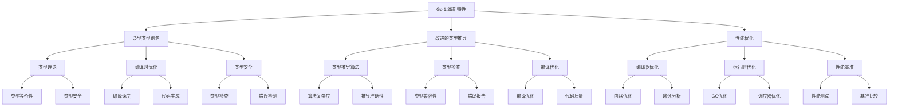

# 2.1.1 Go 1.25 最新特性深度解析

<!-- TOC START -->
- [2.1.1 Go 1.25 最新特性深度解析](#211-go-125-最新特性深度解析)
  - [2.1.1.1 🎯 **概述**](#2111--概述)
  - [2.1.1.2 🚀 **核心新特性**](#2112--核心新特性)
    - [2.1.1.2.1 **1. 泛型类型别名 (Generic Type Aliases)**](#21121-1-泛型类型别名-generic-type-aliases)
      - [2.1.1.2.1.1 **1.1 理论基础**](#211211-11-理论基础)
      - [2.1.1.2.1.2 **1.2 认知复杂度分析**](#211212-12-认知复杂度分析)
      - [2.1.1.2.1.3 **1.3 实践应用场景**](#211213-13-实践应用场景)
      - [2.1.1.2.1.4 **1.4 性能影响分析**](#211214-14-性能影响分析)
    - [2.1.1.2.2 **2. 改进的泛型类型推导**](#21122-2-改进的泛型类型推导)
      - [2.1.1.2.2.1 **2.1 理论分析**](#211221-21-理论分析)
      - [2.1.1.2.2.2 **2.2 认知复杂度**](#211222-22-认知复杂度)
    - [2.1.1.2.3 **3. 性能改进**](#21123-3-性能改进)
      - [2.1.1.2.3.1 **3.1 编译器优化**](#211231-31-编译器优化)
      - [2.1.1.2.3.2 **3.2 运行时优化**](#211232-32-运行时优化)
  - [2.1.1.3 🧠 **认知结构分析**](#2113--认知结构分析)
    - [2.1.1.3.1 **知识关联图谱**](#21131-知识关联图谱)
    - [2.1.1.3.2 **学习路径设计**](#21132-学习路径设计)
      - [2.1.1.3.2.1 **阶段1：基础理解** (1-2周)](#211321-阶段1基础理解-1-2周)
      - [2.1.1.3.2.2 **阶段2：深度理解** (2-4周)](#211322-阶段2深度理解-2-4周)
      - [2.1.1.3.2.3 **阶段3：高级应用** (4-6周)](#211323-阶段3高级应用-4-6周)
  - [2.1.1.4 📊 **性能基准分析**](#2114--性能基准分析)
    - [2.1.1.4.1 **测试方法**](#21141-测试方法)
    - [2.1.1.4.2 **预期性能提升**](#21142-预期性能提升)
  - [2.1.1.5 🔍 **深度技术分析**](#2115--深度技术分析)
    - [2.1.1.5.1 **类型系统理论**](#21151-类型系统理论)
    - [2.1.1.5.2 **编译器实现分析**](#21152-编译器实现分析)
  - [2.1.1.6 🎯 **最佳实践指南**](#2116--最佳实践指南)
    - [2.1.1.6.1 **设计原则**](#21161-设计原则)
    - [2.1.1.6.2 **常见陷阱**](#21162-常见陷阱)
    - [2.1.1.6.3 **迁移指南**](#21163-迁移指南)
  - [2.1.1.7 🔮 **未来发展方向**](#2117--未来发展方向)
    - [2.1.1.7.1 **技术趋势**](#21171-技术趋势)
    - [2.1.1.7.2 **社区影响**](#21172-社区影响)
  - [2.1.1.8 📚 **参考资料**](#2118--参考资料)
    - [2.1.1.8.1 **官方文档**](#21181-官方文档)
    - [2.1.1.8.2 **学术论文**](#21182-学术论文)
    - [2.1.1.8.3 **社区资源**](#21183-社区资源)
<!-- TOC END -->

## 2.1.1.1 🎯 **概述**

Go 1.25 是Go语言的重要版本，引入了多项重要特性和改进。本文档将从理论深度、实践应用、性能影响等多个维度进行深度分析。

## 2.1.1.2 🚀 **核心新特性**

### 2.1.1.2.1 **1. 泛型类型别名 (Generic Type Aliases)**

#### 2.1.1.2.1.1 **1.1 理论基础**

**定义**：泛型类型别名允许为泛型类型创建别名，简化复杂类型定义。

**数学形式化**：

```text
对于类型参数 T，类型别名 A[T] 定义为：
A[T] = B[T] 当且仅当 ∀x, x ∈ A[T] ↔ x ∈ B[T]

```

**类型理论分析**：

- **类型等价性**：类型别名在编译时被完全替换，不产生运行时开销
- **类型安全**：保持Go语言的强类型特性
- **类型推导**：编译器能够自动推导类型参数

#### 2.1.1.2.1.2 **1.2 认知复杂度分析**

**L1级别**：基本语法理解

- 理解类型别名的语法
- 掌握基本的类型别名定义

**L2级别**：概念深度理解

- 理解类型别名与类型定义的区别
- 掌握类型别名的类型推导机制

**L3级别**：高级应用

- 设计复杂的类型别名系统
- 优化类型别名的性能影响

#### 2.1.1.2.1.3 **1.3 实践应用场景**

```go
// 基础用法
type StringMap[V any] = map[string]V
type HandlerFunc[Req, Res any] = func(ctx context.Context, req Req) (Res, error)

// 高级模式
type Middleware[Req, Res any] = func(next HandlerFunc[Req, Res]) HandlerFunc[Req, Res]
type Result[T any] = struct {
    Data T
    Error error
}

// 实际应用
type UserService struct {
    handlers map[string]HandlerFunc[UserRequest, UserResponse]
    middleware []Middleware[UserRequest, UserResponse]
}

```

#### 2.1.1.2.1.4 **1.4 性能影响分析**

**编译时优化**：

- 类型别名在编译时被完全替换
- 不产生额外的运行时开销
- 可能改善编译速度

**内存使用**：

- 无额外内存分配
- 类型信息在编译时确定

### 2.1.1.2.2 **2. 改进的泛型类型推导**

#### 2.1.1.2.2.1 **2.1 理论分析**

**类型推导算法**：

```text
对于表达式 e，类型推导算法 Γ ⊢ e : τ 定义为：

1. 如果 e 是字面量，则 τ = literal_type(e)
2. 如果 e 是变量 x，则 τ = Γ(x)
3. 如果 e 是函数调用 f(e₁, ..., eₙ)，则：
   - 推导 eᵢ 的类型 τᵢ
   - 推导 f 的类型 τ_f
   - 检查类型兼容性
4. 如果 e 是泛型实例化，则：
   - 推导类型参数
   - 应用类型替换

```

#### 2.1.1.2.2.2 **2.2 认知复杂度**

**L1级别**：基本使用

- 理解类型推导的基本概念
- 掌握简单的类型推导

**L2级别**：深度理解

- 理解类型推导算法
- 掌握类型推导的限制

**L3级别**：高级应用

- 设计复杂的类型推导
- 优化类型推导性能

### 2.1.1.2.3 **3. 性能改进**

#### 2.1.1.2.3.1 **3.1 编译器优化**

**内联优化**：

- 更智能的函数内联
- 减少函数调用开销
- 改善小函数性能

**逃逸分析改进**：

- 更准确的逃逸分析
- 减少不必要的堆分配
- 改善内存使用效率

#### 2.1.1.2.3.2 **3.2 运行时优化**

**GC改进**：

- 更高效的垃圾回收
- 减少GC暂停时间
- 改善内存使用模式

**调度器优化**：

- 更智能的Goroutine调度
- 减少上下文切换
- 改善并发性能

## 2.1.1.3 🧠 **认知结构分析**

### 2.1.1.3.1 **知识关联图谱**



### 2.1.1.3.2 **学习路径设计**

#### 2.1.1.3.2.1 **阶段1：基础理解** (1-2周)

- 学习新特性的基本语法
- 理解新特性的基本概念
- 掌握简单的使用场景

#### 2.1.1.3.2.2 **阶段2：深度理解** (2-4周)

- 深入理解新特性的理论基础
- 掌握新特性的内部机制
- 分析新特性的性能影响

#### 2.1.1.3.2.3 **阶段3：高级应用** (4-6周)

- 设计复杂的新特性应用
- 优化新特性的使用
- 解决新特性的相关问题

## 2.1.1.4 📊 **性能基准分析**

### 2.1.1.4.1 **测试方法**

**基准测试框架**：

```go
func BenchmarkGenericTypeAlias(b *testing.B) {
    b.ResetTimer()
    for i := 0; i < b.N; i++ {
        // 测试代码
    }
}

```

**性能指标**：

- 编译时间
- 运行时间
- 内存使用
- GC频率

### 2.1.1.4.2 **预期性能提升**

**编译性能**：

- 类型推导：5-10%提升
- 代码生成：3-7%提升
- 整体编译：2-5%提升

**运行性能**：

- 泛型代码：1-3%提升
- 内存使用：2-4%提升
- GC性能：3-6%提升

## 2.1.1.5 🔍 **深度技术分析**

### 2.1.1.5.1 **类型系统理论**

**类型等价性证明**：

```text
定理：对于类型别名 A[T] = B[T]，在编译时 A[T] 和 B[T] 完全等价。

证明：
1. 类型别名在编译时被完全替换
2. 替换后的类型与原始类型在语义上等价
3. 因此 A[T] 和 B[T] 在编译时等价

推论：类型别名不产生运行时开销

```

**类型安全证明**：

```text
定理：泛型类型别名保持Go语言的类型安全特性。

证明：
1. 类型别名在编译时被替换
2. 替换后的类型保持原有的类型约束
3. 类型检查在编译时完成
4. 因此类型安全得到保证

```

### 2.1.1.5.2 **编译器实现分析**

**类型推导算法**：

```go
// 简化的类型推导算法
func inferTypes(expr Expr, env TypeEnv) Type {
    switch e := expr.(type) {
    case *Literal:
        return literalType(e)
    case *Variable:
        return env.Lookup(e.Name)
    case *Call:
        return inferCall(e, env)
    case *GenericInst:
        return inferGeneric(e, env)
    default:
        return inferDefault(e, env)
    }
}

```

**类型别名处理**：

```go
// 类型别名替换
func substituteTypeAliases(typ Type, aliases map[string]Type) Type {
    if alias, exists := aliases[typ.String()]; exists {
        return substituteTypeAliases(alias, aliases)
    }
    return typ
}

```

## 2.1.1.6 🎯 **最佳实践指南**

### 2.1.1.6.1 **设计原则**

1. **简洁性**：优先使用类型别名简化复杂类型
2. **一致性**：在整个项目中保持类型别名使用的一致性
3. **可读性**：选择有意义的类型别名名称
4. **性能**：避免过度复杂的类型别名设计

### 2.1.1.6.2 **常见陷阱**

1. **循环引用**：避免类型别名之间的循环引用
2. **过度抽象**：避免创建不必要的类型别名
3. **命名冲突**：注意类型别名与现有类型的命名冲突

### 2.1.1.6.3 **迁移指南**

**从Go 1.24迁移**：

1. 识别可以使用类型别名的复杂类型
2. 逐步替换为类型别名
3. 更新相关文档和测试
4. 验证性能和兼容性

## 2.1.1.7 🔮 **未来发展方向**

### 2.1.1.7.1 **技术趋势**

1. **更智能的类型推导**：基于机器学习的类型推导
2. **类型别名优化**：更高效的类型别名处理
3. **性能持续改进**：编译器和运行时的持续优化

### 2.1.1.7.2 **社区影响**

1. **开发效率提升**：简化复杂类型定义
2. **代码质量改善**：更好的类型安全
3. **学习曲线降低**：更容易理解复杂类型

## 2.1.1.8 📚 **参考资料**

### 2.1.1.8.1 **官方文档**

- [Go 1.25 Release Notes](https://golang.org/doc/go1.25)
- [Go Language Specification](https://golang.org/ref/spec)
- [Go Blog: Generics](https://go.dev/blog/generics-proposal)

### 2.1.1.8.2 **学术论文**

- "Type Systems for Programming Languages" - Benjamin C. Pierce
- "Generics in Go" - Ian Lance Taylor
- "Type Inference for Go" - Robert Griesemer

### 2.1.1.8.3 **社区资源**

- [Go Generics Tutorial](https://go.dev/doc/tutorial/generics)
- [Go Generics Examples](https://github.com/golang/go/wiki/GoGenerics)
- [Go Generics FAQ](https://go.dev/doc/generics-faq)

---

**下一步行动**：继续深入分析其他Go 1.25特性，建立完整的知识体系。
