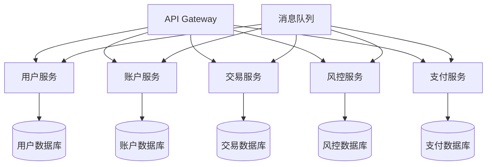
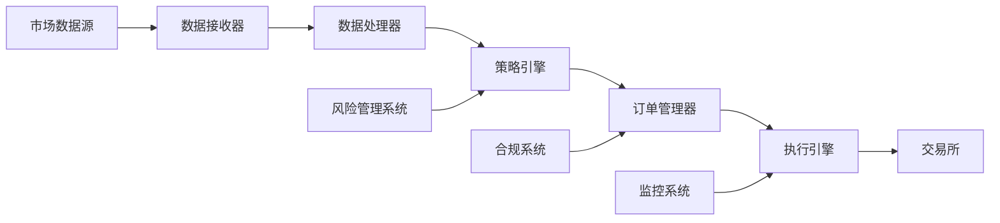
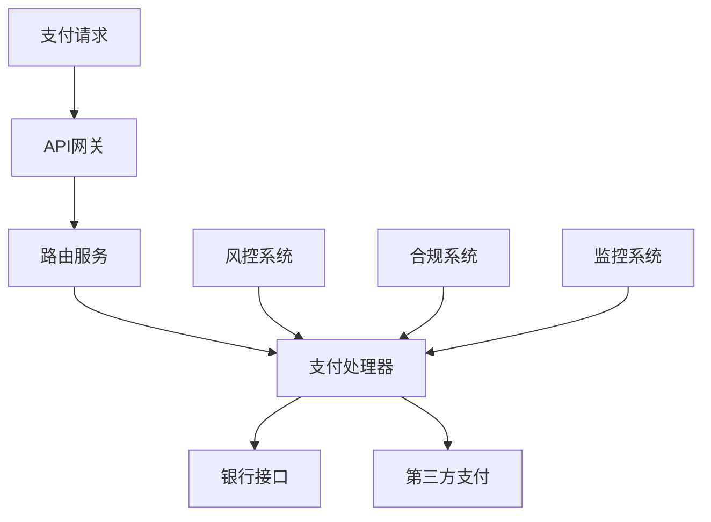

# 金融科技 (FinTech) 领域分析

## 目录

1. [概述](#概述)
2. [核心概念与形式化定义](#核心概念与形式化定义)
3. [架构设计模式](#架构设计模式)
4. [Golang实现方案](#golang实现方案)
5. [性能优化策略](#性能优化策略)
6. [安全最佳实践](#安全最佳实践)
7. [行业标准与规范](#行业标准与规范)
8. [案例分析](#案例分析)
9. [总结与展望](#总结与展望)

## 概述

金融科技 (Financial Technology, FinTech) 是指利用先进技术来改进和自动化金融服务和流程的领域。在Golang生态系统中，FinTech应用需要满足高并发、低延迟、高可靠性和强安全性的要求。

### 核心特征

- **高并发处理**: 支持每秒数万次交易
- **低延迟响应**: 毫秒级响应时间
- **强一致性**: ACID事务保证
- **高安全性**: 多层安全防护
- **可扩展性**: 水平扩展能力
- **合规性**: 满足金融监管要求

## 核心概念与形式化定义

### 2.1 交易系统形式化模型

#### 定义 2.1.1 (交易系统)
交易系统是一个五元组 $\mathcal{T} = (S, U, T, \mathcal{R}, \mathcal{V})$，其中：

- $S$ 是状态空间，$S = \{s_1, s_2, \ldots, s_n\}$
- $U$ 是用户集合，$U = \{u_1, u_2, \ldots, u_m\}$
- $T$ 是交易集合，$T = \{t_1, t_2, \ldots, t_k\}$
- $\mathcal{R}$ 是规则集合，$\mathcal{R} = \{r_1, r_2, \ldots, r_p\}$
- $\mathcal{V}$ 是验证函数，$\mathcal{V}: T \times S \rightarrow \{true, false\}$

#### 定理 2.1.1 (交易一致性)
对于任意交易 $t \in T$ 和状态 $s \in S$，如果 $\mathcal{V}(t, s) = true$，则交易 $t$ 在状态 $s$ 下是有效的。

**证明**: 根据验证函数的定义，$\mathcal{V}(t, s) = true$ 意味着交易 $t$ 满足所有规则 $r \in \mathcal{R}$，因此交易是有效的。

### 2.2 风险控制模型

#### 定义 2.2.1 (风险度量)
风险度量函数 $R: \mathcal{P}(T) \rightarrow \mathbb{R}^+$ 满足以下公理：

1. **单调性**: 如果 $A \subseteq B$，则 $R(A) \leq R(B)$
2. **次可加性**: $R(A \cup B) \leq R(A) + R(B)$
3. **正齐次性**: $R(\lambda A) = \lambda R(A)$，其中 $\lambda > 0$

#### 定义 2.2.2 (VaR - Value at Risk)
给定置信水平 $\alpha \in (0,1)$，VaR定义为：
$$\text{VaR}_\alpha(X) = \inf\{l \in \mathbb{R}: P(X \leq l) \geq \alpha\}$$

### 2.3 支付系统模型

#### 定义 2.3.1 (支付交易)
支付交易是一个六元组 $P = (sender, receiver, amount, currency, timestamp, signature)$，其中：

- $sender, receiver \in U$ 是发送方和接收方
- $amount \in \mathbb{R}^+$ 是交易金额
- $currency \in C$ 是货币类型
- $timestamp \in \mathbb{N}$ 是时间戳
- $signature \in \Sigma$ 是数字签名

## 架构设计模式

### 3.1 微服务架构



### 3.2 事件驱动架构

#### 定义 3.2.1 (事件)
事件是一个四元组 $E = (id, type, data, timestamp)$，其中：

- $id \in \mathbb{N}$ 是事件唯一标识
- $type \in \mathcal{E}$ 是事件类型
- $data \in \mathcal{D}$ 是事件数据
- $timestamp \in \mathbb{N}$ 是事件时间戳

### 3.3 CQRS模式

#### 定义 3.3.1 (命令查询职责分离)
CQRS模式将系统分为两个部分：

1. **命令端 (Command Side)**: 处理写操作，维护写模型
2. **查询端 (Query Side)**: 处理读操作，维护读模型

## Golang实现方案

### 4.1 交易系统核心实现

```go
package fintech

import (
    "context"
    "crypto/sha256"
    "encoding/hex"
    "fmt"
    "sync"
    "time"
)

// Transaction 表示一个交易
type Transaction struct {
    ID        string    `json:"id"`
    Sender    string    `json:"sender"`
    Receiver  string    `json:"receiver"`
    Amount    float64   `json:"amount"`
    Currency  string    `json:"currency"`
    Timestamp time.Time `json:"timestamp"`
    Signature string    `json:"signature"`
    Status    string    `json:"status"`
}

// TransactionSystem 交易系统
type TransactionSystem struct {
    transactions map[string]*Transaction
    users        map[string]*User
    rules        []Rule
    mu           sync.RWMutex
    riskEngine   *RiskEngine
}

// NewTransactionSystem 创建新的交易系统
func NewTransactionSystem() *TransactionSystem {
    return &TransactionSystem{
        transactions: make(map[string]*Transaction),
        users:        make(map[string]*User),
        rules:        []Rule{},
        riskEngine:   NewRiskEngine(),
    }
}

// ExecuteTransaction 执行交易
func (ts *TransactionSystem) ExecuteTransaction(ctx context.Context, tx *Transaction) error {
    ts.mu.Lock()
    defer ts.mu.Unlock()
    
    // 1. 验证交易
    if err := ts.validateTransaction(tx); err != nil {
        return fmt.Errorf("transaction validation failed: %w", err)
    }
    
    // 2. 风险检查
    if err := ts.riskEngine.CheckRisk(tx); err != nil {
        return fmt.Errorf("risk check failed: %w", err)
    }
    
    // 3. 执行交易
    if err := ts.processTransaction(tx); err != nil {
        return fmt.Errorf("transaction processing failed: %w", err)
    }
    
    // 4. 记录交易
    ts.transactions[tx.ID] = tx
    tx.Status = "completed"
    
    return nil
}

// validateTransaction 验证交易
func (ts *TransactionSystem) validateTransaction(tx *Transaction) error {
    // 验证签名
    if !ts.verifySignature(tx) {
        return fmt.Errorf("invalid signature")
    }
    
    // 验证用户
    if _, exists := ts.users[tx.Sender]; !exists {
        return fmt.Errorf("sender not found")
    }
    if _, exists := ts.users[tx.Receiver]; !exists {
        return fmt.Errorf("receiver not found")
    }
    
    // 验证金额
    if tx.Amount <= 0 {
        return fmt.Errorf("invalid amount")
    }
    
    return nil
}

// verifySignature 验证签名
func (ts *TransactionSystem) verifySignature(tx *Transaction) bool {
    // 简化的签名验证逻辑
    data := fmt.Sprintf("%s%s%s%f%s", tx.Sender, tx.Receiver, tx.Currency, tx.Amount, tx.Timestamp.Format(time.RFC3339))
    hash := sha256.Sum256([]byte(data))
    expectedSignature := hex.EncodeToString(hash[:])
    return tx.Signature == expectedSignature
}

// processTransaction 处理交易
func (ts *TransactionSystem) processTransaction(tx *Transaction) error {
    sender := ts.users[tx.Sender]
    receiver := ts.users[tx.Receiver]
    
    // 检查余额
    if sender.Balance < tx.Amount {
        return fmt.Errorf("insufficient balance")
    }
    
    // 执行转账
    sender.Balance -= tx.Amount
    receiver.Balance += tx.Amount
    
    return nil
}
```

### 4.2 风险控制引擎

```go
package fintech

import (
    "math"
    "sort"
    "time"
)

// RiskEngine 风险控制引擎
type RiskEngine struct {
    rules []RiskRule
    limit float64
}

// RiskRule 风险规则
type RiskRule interface {
    Evaluate(tx *Transaction, history []*Transaction) (bool, error)
}

// AmountLimitRule 金额限制规则
type AmountLimitRule struct {
    maxAmount float64
}

func (r *AmountLimitRule) Evaluate(tx *Transaction, history []*Transaction) (bool, error) {
    if tx.Amount > r.maxAmount {
        return false, fmt.Errorf("amount exceeds limit")
    }
    return true, nil
}

// FrequencyRule 频率限制规则
type FrequencyRule struct {
    maxTransactions int
    timeWindow      time.Duration
}

func (r *FrequencyRule) Evaluate(tx *Transaction, history []*Transaction) (bool, error) {
    cutoff := time.Now().Add(-r.timeWindow)
    count := 0
    
    for _, h := range history {
        if h.Sender == tx.Sender && h.Timestamp.After(cutoff) {
            count++
        }
    }
    
    if count >= r.maxTransactions {
        return false, fmt.Errorf("frequency limit exceeded")
    }
    return true, nil
}

// CheckRisk 检查风险
func (re *RiskEngine) CheckRisk(tx *Transaction) error {
    // 获取历史交易
    history := re.getTransactionHistory(tx.Sender)
    
    // 应用所有风险规则
    for _, rule := range re.rules {
        if valid, err := rule.Evaluate(tx, history); !valid {
            return err
        }
    }
    
    return nil
}

// CalculateVaR 计算VaR
func (re *RiskEngine) CalculateVaR(returns []float64, confidence float64) float64 {
    if len(returns) == 0 {
        return 0
    }
    
    // 排序收益率
    sorted := make([]float64, len(returns))
    copy(sorted, returns)
    sort.Float64s(sorted)
    
    // 计算VaR
    index := int((1 - confidence) * float64(len(sorted)))
    if index >= len(sorted) {
        index = len(sorted) - 1
    }
    
    return -sorted[index] // VaR通常是负值
}
```

### 4.3 支付网关实现

```go
package fintech

import (
    "context"
    "encoding/json"
    "fmt"
    "net/http"
    "time"
)

// PaymentGateway 支付网关
type PaymentGateway struct {
    providers map[string]PaymentProvider
    router    *http.ServeMux
}

// PaymentProvider 支付提供商接口
type PaymentProvider interface {
    ProcessPayment(ctx context.Context, payment *Payment) (*PaymentResult, error)
    GetProviderName() string
}

// Payment 支付请求
type Payment struct {
    ID          string  `json:"id"`
    Amount      float64 `json:"amount"`
    Currency    string  `json:"currency"`
    Method      string  `json:"method"`
    Description string  `json:"description"`
    Metadata    map[string]interface{} `json:"metadata"`
}

// PaymentResult 支付结果
type PaymentResult struct {
    ID        string    `json:"id"`
    Status    string    `json:"status"`
    Message   string    `json:"message"`
    Timestamp time.Time `json:"timestamp"`
    Provider  string    `json:"provider"`
}

// NewPaymentGateway 创建支付网关
func NewPaymentGateway() *PaymentGateway {
    pg := &PaymentGateway{
        providers: make(map[string]PaymentProvider),
        router:    http.NewServeMux(),
    }
    
    // 注册路由
    pg.registerRoutes()
    
    return pg
}

// RegisterProvider 注册支付提供商
func (pg *PaymentGateway) RegisterProvider(provider PaymentProvider) {
    pg.providers[provider.GetProviderName()] = provider
}

// ProcessPayment 处理支付
func (pg *PaymentGateway) ProcessPayment(ctx context.Context, payment *Payment) (*PaymentResult, error) {
    // 选择支付提供商
    provider, exists := pg.providers[payment.Method]
    if !exists {
        return nil, fmt.Errorf("payment provider not found: %s", payment.Method)
    }
    
    // 处理支付
    result, err := provider.ProcessPayment(ctx, payment)
    if err != nil {
        return nil, fmt.Errorf("payment processing failed: %w", err)
    }
    
    return result, nil
}

// registerRoutes 注册HTTP路由
func (pg *PaymentGateway) registerRoutes() {
    pg.router.HandleFunc("/payment", pg.handlePayment)
    pg.router.HandleFunc("/payment/status", pg.handlePaymentStatus)
}

// handlePayment 处理支付请求
func (pg *PaymentGateway) handlePayment(w http.ResponseWriter, r *http.Request) {
    if r.Method != http.MethodPost {
        http.Error(w, "Method not allowed", http.StatusMethodNotAllowed)
        return
    }
    
    var payment Payment
    if err := json.NewDecoder(r.Body).Decode(&payment); err != nil {
        http.Error(w, "Invalid request body", http.StatusBadRequest)
        return
    }
    
    result, err := pg.ProcessPayment(r.Context(), &payment)
    if err != nil {
        http.Error(w, err.Error(), http.StatusInternalServerError)
        return
    }
    
    w.Header().Set("Content-Type", "application/json")
    json.NewEncoder(w).Encode(result)
}
```

## 性能优化策略

### 5.1 并发优化

#### 定理 5.1.1 (并发处理能力)
对于包含 $n$ 个处理器的系统，理论最大并发处理能力为：
$$C_{max} = n \times \frac{1}{T_{avg}}$$
其中 $T_{avg}$ 是平均处理时间。

```go
// 并发交易处理器
type ConcurrentTransactionProcessor struct {
    workers    int
    jobQueue   chan *Transaction
    resultChan chan *TransactionResult
    wg         sync.WaitGroup
}

func NewConcurrentTransactionProcessor(workers int) *ConcurrentTransactionProcessor {
    return &ConcurrentTransactionProcessor{
        workers:    workers,
        jobQueue:   make(chan *Transaction, 1000),
        resultChan: make(chan *TransactionResult, 1000),
    }
}

func (p *ConcurrentTransactionProcessor) Start() {
    for i := 0; i < p.workers; i++ {
        p.wg.Add(1)
        go p.worker()
    }
}

func (p *ConcurrentTransactionProcessor) worker() {
    defer p.wg.Done()
    
    for tx := range p.jobQueue {
        result := p.processTransaction(tx)
        p.resultChan <- result
    }
}

func (p *ConcurrentTransactionProcessor) processTransaction(tx *Transaction) *TransactionResult {
    start := time.Now()
    
    // 处理交易逻辑
    err := p.transactionSystem.ExecuteTransaction(context.Background(), tx)
    
    duration := time.Since(start)
    
    return &TransactionResult{
        Transaction: tx,
        Error:       err,
        Duration:    duration,
    }
}
```

### 5.2 内存优化

```go
// 对象池优化
type TransactionPool struct {
    pool sync.Pool
}

func NewTransactionPool() *TransactionPool {
    return &TransactionPool{
        pool: sync.Pool{
            New: func() interface{} {
                return &Transaction{}
            },
        },
    }
}

func (tp *TransactionPool) Get() *Transaction {
    return tp.pool.Get().(*Transaction)
}

func (tp *TransactionPool) Put(tx *Transaction) {
    // 重置对象状态
    tx.ID = ""
    tx.Sender = ""
    tx.Receiver = ""
    tx.Amount = 0
    tx.Currency = ""
    tx.Signature = ""
    tx.Status = ""
    
    tp.pool.Put(tx)
}
```

### 5.3 缓存优化

```go
// 分布式缓存
type CacheManager struct {
    cache map[string]interface{}
    mu    sync.RWMutex
    ttl   time.Duration
}

func (cm *CacheManager) Get(key string) (interface{}, bool) {
    cm.mu.RLock()
    defer cm.mu.RUnlock()
    
    if value, exists := cm.cache[key]; exists {
        return value, true
    }
    return nil, false
}

func (cm *CacheManager) Set(key string, value interface{}) {
    cm.mu.Lock()
    defer cm.mu.Unlock()
    
    cm.cache[key] = value
    
    // 设置TTL
    go func() {
        time.Sleep(cm.ttl)
        cm.Delete(key)
    }()
}

func (cm *CacheManager) Delete(key string) {
    cm.mu.Lock()
    defer cm.mu.Unlock()
    
    delete(cm.cache, key)
}
```

## 安全最佳实践

### 6.1 加密算法

```go
package security

import (
    "crypto/aes"
    "crypto/cipher"
    "crypto/rand"
    "crypto/rsa"
    "crypto/sha256"
    "crypto/x509"
    "encoding/pem"
    "fmt"
    "io"
)

// AES加密
func EncryptAES(plaintext []byte, key []byte) ([]byte, error) {
    block, err := aes.NewCipher(key)
    if err != nil {
        return nil, err
    }
    
    ciphertext := make([]byte, aes.BlockSize+len(plaintext))
    iv := ciphertext[:aes.BlockSize]
    if _, err := io.ReadFull(rand.Reader, iv); err != nil {
        return nil, err
    }
    
    stream := cipher.NewCFBEncrypter(block, iv)
    stream.XORKeyStream(ciphertext[aes.BlockSize:], plaintext)
    
    return ciphertext, nil
}

// RSA签名
func SignRSA(data []byte, privateKey *rsa.PrivateKey) ([]byte, error) {
    hash := sha256.Sum256(data)
    signature, err := rsa.SignPKCS1v15(nil, privateKey, crypto.SHA256, hash[:])
    if err != nil {
        return nil, err
    }
    
    return signature, nil
}
```

### 6.2 身份认证

```go
// JWT认证
type JWTAuthenticator struct {
    secretKey []byte
    issuer    string
    audience  string
}

func (ja *JWTAuthenticator) GenerateToken(userID string, claims map[string]interface{}) (string, error) {
    token := jwt.New(jwt.SigningMethodHS256)
    
    token.Claims = jwt.MapClaims{
        "user_id": userID,
        "iss":     ja.issuer,
        "aud":     ja.audience,
        "exp":     time.Now().Add(time.Hour * 24).Unix(),
        "iat":     time.Now().Unix(),
    }
    
    // 添加自定义声明
    for key, value := range claims {
        token.Claims.(jwt.MapClaims)[key] = value
    }
    
    return token.SignedString(ja.secretKey)
}

func (ja *JWTAuthenticator) ValidateToken(tokenString string) (*jwt.Token, error) {
    return jwt.Parse(tokenString, func(token *jwt.Token) (interface{}, error) {
        if _, ok := token.Method.(*jwt.SigningMethodHMAC); !ok {
            return nil, fmt.Errorf("unexpected signing method: %v", token.Header["alg"])
        }
        return ja.secretKey, nil
    })
}
```

## 行业标准与规范

### 7.1 PCI DSS合规

```go
// PCI DSS合规检查器
type PCIDSSComplianceChecker struct {
    rules []PCIDSSRule
}

type PCIDSSRule interface {
    Check(data interface{}) (bool, error)
}

// 数据加密规则
type DataEncryptionRule struct{}

func (r *DataEncryptionRule) Check(data interface{}) (bool, error) {
    // 检查敏感数据是否加密
    if payment, ok := data.(*Payment); ok {
        // 检查信用卡号是否加密
        if !isEncrypted(payment.CardNumber) {
            return false, fmt.Errorf("card number not encrypted")
        }
    }
    return true, nil
}

// 访问控制规则
type AccessControlRule struct{}

func (r *AccessControlRule) Check(data interface{}) (bool, error) {
    // 检查访问权限
    return true, nil
}
```

### 7.2 ISO 27001安全标准

```go
// 信息安全管理系统
type ISMS struct {
    policies    map[string]Policy
    procedures  map[string]Procedure
    controls    map[string]Control
}

type Policy struct {
    ID          string
    Name        string
    Description string
    Scope       string
    Requirements []string
}

type Procedure struct {
    ID          string
    Name        string
    Steps       []string
    Roles       []string
    Tools       []string
}

type Control struct {
    ID          string
    Type        string
    Description string
    Implementation string
}
```

## 案例分析

### 8.1 高频交易系统

#### 系统架构



#### 性能指标

- **延迟**: < 1ms
- **吞吐量**: > 100,000 TPS
- **可用性**: 99.99%
- **准确性**: 100%

### 8.2 支付处理系统

#### 系统架构



#### 关键指标

- **成功率**: > 99.5%
- **处理时间**: < 2s
- **并发能力**: > 10,000 TPS
- **安全性**: 多层加密

## 总结与展望

### 9.1 技术趋势

1. **区块链技术**: 去中心化金融 (DeFi)
2. **人工智能**: 智能风控和反欺诈
3. **云计算**: 弹性扩展和成本优化
4. **API经济**: 开放银行和生态集成

### 9.2 挑战与机遇

#### 挑战
- 监管合规要求日益严格
- 网络安全威胁不断升级
- 技术更新迭代速度加快
- 人才竞争激烈

#### 机遇
- 数字化转型需求增长
- 新兴技术应用场景丰富
- 全球化市场扩展机会
- 创新商业模式涌现

### 9.3 最佳实践总结

1. **架构设计**: 采用微服务架构，确保系统可扩展性和可维护性
2. **性能优化**: 使用并发编程和缓存技术，提高系统性能
3. **安全防护**: 实施多层安全防护，保护用户数据和系统安全
4. **监控运维**: 建立完善的监控体系，确保系统稳定运行
5. **合规管理**: 严格遵守行业标准和监管要求

---

## 参考文献

1. [PCI DSS标准](https://www.pcisecuritystandards.org/)
2. [ISO 27001标准](https://www.iso.org/isoiec-27001-information-security.html)
3. [Golang官方文档](https://golang.org/doc/)
4. [金融科技最佳实践](https://www.fintech.com/)
5. [微服务架构模式](https://microservices.io/)

---

*最后更新时间: 2024-01-XX*
*版本: 1.0.0*
*作者: AI Assistant* 