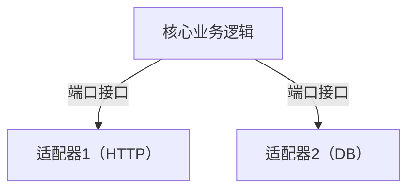
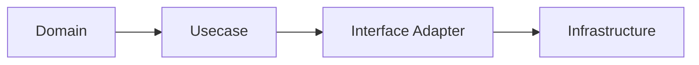
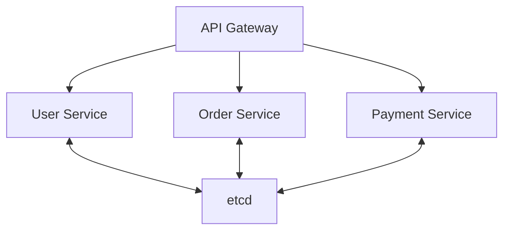

# Go架构设计模式总览

## 1. 六边形架构（Hexagonal Architecture）
### 定义
六边形架构（端口-适配器架构）强调将业务逻辑与外部依赖解耦。Go通过接口和依赖注入天然适配。

### 工程案例
- 典型项目：kratos、go-clean-arch
- 代码片段：
```go
type UserRepo interface { Find(id int) (*User, error) }
type UserService struct { repo UserRepo }
```

### 图示


### 批判性分析
- 优点：可测试性强，易维护
- 局限：初学者门槛高，过度抽象易臃肿

### 范畴论视角
- 业务逻辑为对象，端口为态射，适配器为范畴间桥梁

---

## 2. Clean Architecture
### 定义
以依赖规则为核心，内层不依赖外层，业务逻辑独立于框架、数据库、UI。

### 工程实践
- 领域层、用例层、接口适配层、基础设施层
- 典型项目：kratos、Go kit

### 图示


### 批判性分析
- 优点：可维护性、可测试性高
- 局限：初期开发成本高，样板代码多

### 范畴论视角
- 层次为对象，依赖为态射，系统为分层范畴

---

## 3. 微服务架构
### 定义
单一职责、自治服务、去中心化数据管理，Go的静态编译、原生并发、部署便捷性极适合微服务。

### 工程案例
- 典型框架：go-micro、kratos、go-zero
- 代码片段：
```go
import "go.etcd.io/etcd/clientv3"
cli, _ := clientv3.New(clientv3.Config{Endpoints: []string{"localhost:2379"}})
cli.Put(context.Background(), "/services/user/instance1", "127.0.0.1:8081")
```

### 图示


### 批判性分析
- 优点：高可扩展性、易于弹性伸缩
- 局限：分布式复杂性提升，需重点设计通信与一致性

### 范畴论视角
- 服务为对象，API为态射，etcd为协调器 