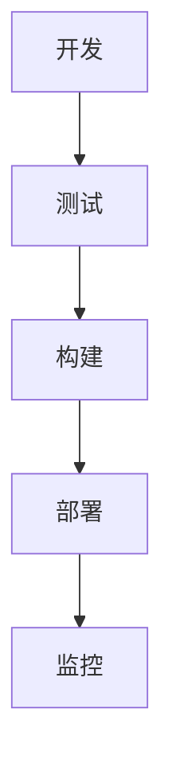
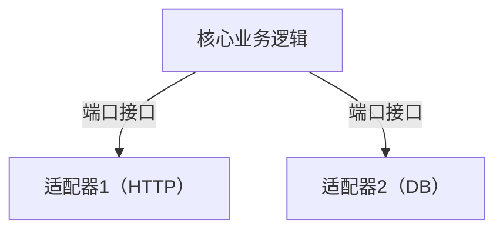
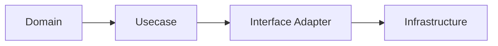
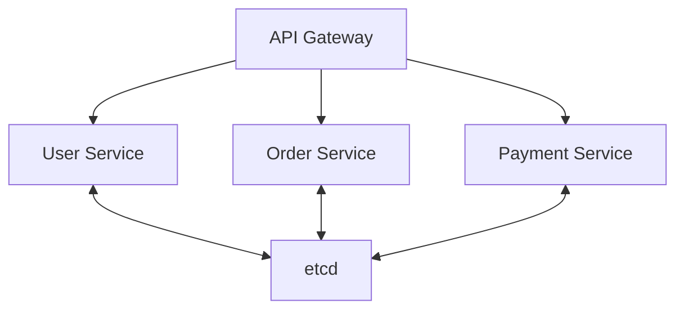
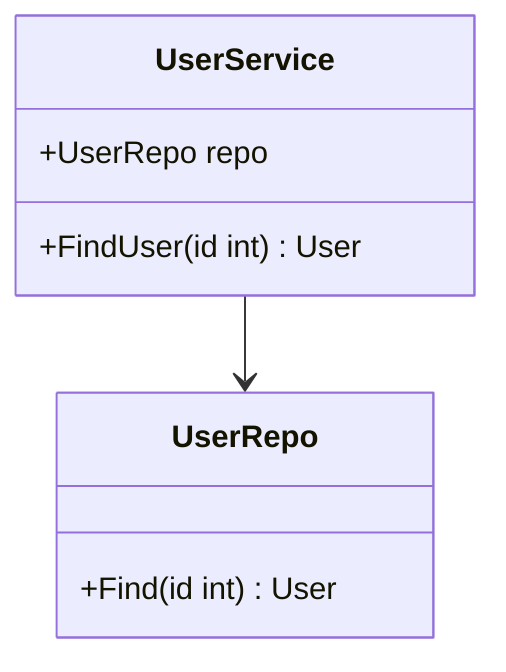
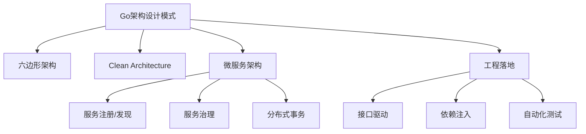

# Go架构设计模式总览

## 0. 内容导航/索引

- [Go架构设计模式总览](#go架构设计模式总览)
  - [0. 内容导航/索引](#0-内容导航索引)
  - [工程流程模板（Mermaid）](#工程流程模板mermaid)
  - [1. 六边形架构（Hexagonal Architecture）](#1-六边形架构hexagonal-architecture)
    - [定义](#定义)
    - [工程案例](#工程案例)
    - [图示](#图示)
    - [批判性分析](#批判性分析)
    - [范畴论视角](#范畴论视角)
    - [1.6 知识点小结](#16-知识点小结)
  - [2. Clean Architecture](#2-clean-architecture)
    - [定义](#定义-1)
    - [工程实践](#工程实践)
    - [图示](#图示-1)
    - [批判性分析](#批判性分析-1)
    - [范畴论视角](#范畴论视角-1)
    - [2.6 知识点小结](#26-知识点小结)
  - [3. 微服务架构](#3-微服务架构)
    - [定义](#定义-2)
    - [工程案例](#工程案例-1)
    - [图示](#图示-2)
    - [批判性分析](#批判性分析-2)
    - [范畴论视角](#范畴论视角-2)
    - [3.6 知识点小结](#36-知识点小结)
  - [4. 行业对比与开源趋势](#4-行业对比与开源趋势)
    - [Go与Java、Rust等主流语言架构模式对比](#go与javarust等主流语言架构模式对比)
    - [最新开源趋势](#最新开源趋势)
  - [5. 哲科工程批判性分析](#5-哲科工程批判性分析)
  - [6. 多表征内容补充](#6-多表征内容补充)
  - [7. 实际项目落地经验](#7-实际项目落地经验)
  - [8. 常见反模式与规避建议](#8-常见反模式与规避建议)
  - [9. 未来发展建议](#9-未来发展建议)
  - [10. 参考文献与外部链接](#10-参考文献与外部链接)
  - [11. 常见问题答疑（FAQ）](#11-常见问题答疑faq)
  - [12. 最佳实践清单](#12-最佳实践清单)
  - [13. 典型错误案例剖析](#13-典型错误案例剖析)
  - [14. 进阶阅读推荐](#14-进阶阅读推荐)
  - [全局知识地图（Mermaid）](#全局知识地图mermaid)
  - [15. 工程模板/脚手架代码示例](#15-工程模板脚手架代码示例)
    - [六边形架构基础模板](#六边形架构基础模板)
    - [Clean Architecture分层模板](#clean-architecture分层模板)
  - [16. 常见面试题/考点](#16-常见面试题考点)
  - [17. 术语表/缩略语解释](#17-术语表缩略语解释)
  - [18. 常见陷阱与误区对照表](#18-常见陷阱与误区对照表)
  - [19. 交叉引用/相关主题推荐](#19-交叉引用相关主题推荐)
  - [20. 学习路径建议](#20-学习路径建议)

---

> 交叉引用：
>
> - 并发与并行模式详见[02-Go并发与并行模式](./02-Go并发与并行模式.md)
> - 分布式与微服务模式详见[03-Go分布式与微服务模式](./03-Go分布式与微服务模式.md)

## 工程流程模板（Mermaid）



## 1. 六边形架构（Hexagonal Architecture）

### 定义

六边形架构（端口-适配器架构）强调将业务逻辑与外部依赖解耦。Go通过接口和依赖注入天然适配。

### 工程案例

- 典型项目：kratos、go-clean-arch
- 代码片段：

```go
type UserRepo interface { Find(id int) (*User, error) }
type UserService struct { repo UserRepo }
```

### 图示



### 批判性分析

- 优点：可测试性强，易维护
- 局限：初学者门槛高，过度抽象易臃肿

### 范畴论视角

- 业务逻辑为对象，端口为态射，适配器为范畴间桥梁

### 1.6 知识点小结

- 六边形架构强调解耦与可测试性，适合接口驱动的Go项目。
- 工程落地建议：优先在核心业务逻辑中引入端口-适配器思想，逐步推广到全局。

## 2. Clean Architecture

### 定义

以依赖规则为核心，内层不依赖外层，业务逻辑独立于框架、数据库、UI。

### 工程实践

- 领域层、用例层、接口适配层、基础设施层
- 典型项目：kratos、Go kit

### 图示



### 批判性分析

- 优点：可维护性、可测试性高
- 局限：初期开发成本高，样板代码多

### 范畴论视角

- 层次为对象，依赖为态射，系统为分层范畴

### 2.6 知识点小结

- Clean Architecture分层清晰，便于团队协作与演进。
- 工程落地建议：结合Go的包结构和依赖注入，保持每层职责单一。

## 3. 微服务架构

### 定义

单一职责、自治服务、去中心化数据管理，Go的静态编译、原生并发、部署便捷性极适合微服务。

### 工程案例

- 典型框架：go-micro、kratos、go-zero
- 代码片段：

```go
import "go.etcd.io/etcd/clientv3"
cli, _ := clientv3.New(clientv3.Config{Endpoints: []string{"localhost:2379"}})
cli.Put(context.Background(), "/services/user/instance1", "127.0.0.1:8081")
```

### 图示



### 批判性分析

- 优点：高可扩展性、易于弹性伸缩
- 局限：分布式复杂性提升，需重点设计通信与一致性

### 范畴论视角

- 服务为对象，API为态射，etcd为协调器

### 3.6 知识点小结

- 微服务架构需关注服务拆分粒度、通信协议和基础设施选型。
- 工程落地建议：采用成熟的服务注册、配置中心和链路追踪方案。

## 4. 行业对比与开源趋势

### Go与Java、Rust等主流语言架构模式对比

- Go：接口驱动、部署便捷、并发原语强，适合云原生、微服务、DevOps场景
- Java：生态成熟，适合大型企业级应用，Spring等框架丰富
- Rust：极致安全与性能，适合高并发、嵌入式、系统级开发

### 最新开源趋势

- Go架构模式正向"云原生原生化"演进，K8s、Operator、Service Mesh等均以Go为主力
- 微服务框架持续演进（kratos、go-zero、go-micro等），强调可观测性、服务治理、自动化
- 事件驱动、Serverless、无状态架构等新范式在Go生态中快速落地

## 5. 哲科工程批判性分析

- Go架构模式体现了"范畴化"与"组合性"哲学思想，强调解耦、可复用、可组合
- 工程实践中需警惕"过度抽象"与"样板代码"陷阱，保持架构的简洁性与可演化性
- 未来趋势：架构自动化、智能化、形式化验证将成为主流，Go生态需持续拥抱理论创新与工程落地

## 6. 多表征内容补充

- UML类图、流程图、数学表达式、伪代码等多种方式表达架构思想
- 示例：



- 数学表达式：
  - 设S为服务集合，P为端口集合，A为适配器集合，存在映射f: S×P→A，实现架构的可组合性

## 7. 实际项目落地经验

- 建议从小型服务或单一业务模块试点六边形/Clean架构，逐步推广到全局
- 结合Go的接口与依赖注入，提升单元测试覆盖率和可维护性
- 微服务拆分需结合领域驱动设计（DDD），避免"微服务地狱"

## 8. 常见反模式与规避建议

- 过度抽象导致代码难以理解和维护，应保持架构简洁、接口聚合
- 盲目追求"全栈微服务"，忽视团队协作与运维能力
- 忽略服务间契约与数据一致性，易引发系统性风险

## 9. 未来发展建议

- 持续关注Go生态下的架构自动化、智能化工具（如代码生成、自动测试、服务网格）
- 探索领域建模、事件风暴等方法与Go架构的结合
- 推动架构决策的可追溯性与形式化验证

## 10. 参考文献与外部链接

- [Go官方文档](https://golang.org/doc/)
- [kratos微服务框架](https://go-kratos.dev/)
- [Go Clean Architecture](https://github.com/bxcodec/go-clean-arch)
- [微服务设计](https://martinfowler.com/microservices/)
- [Hexagonal Architecture](https://alistair.cockburn.us/hexagonal-architecture/)

## 11. 常见问题答疑（FAQ）

- Q: 六边形架构和Clean架构在Go项目中如何选择？
  A: 小型项目建议六边形架构，关注解耦与测试；中大型项目建议Clean架构，便于分层协作与演进。
- Q: 微服务拆分的粒度如何把握？
  A: 建议以领域边界为核心，避免过度拆分导致运维复杂。

## 12. 最佳实践清单

- 领域驱动设计（DDD）结合架构分层，提升业务可维护性
- 接口与依赖注入贯穿全局，便于测试与扩展
- 服务间通信优先采用gRPC/Protobuf，提升性能与兼容性

## 13. 典型错误案例剖析

- 案例：过度抽象导致团队协作低效，建议接口聚合、文档同步
- 案例：微服务拆分后缺乏统一配置与注册中心，导致服务发现混乱

## 14. 进阶阅读推荐

- [Domain-Driven Design Reference](https://domainlanguage.com/ddd/reference/)
- [Go Patterns](https://github.com/tmrts/go-patterns)
- [Building Microservices](https://www.oreilly.com/library/view/building-microservices/9781491950340/)

## 全局知识地图（Mermaid）



## 15. 工程模板/脚手架代码示例

### 六边形架构基础模板

```go
// 端口接口
type UserRepository interface {
    FindByID(id int) (*User, error)
}
// 适配器实现
type UserRepoImpl struct {}
func (r *UserRepoImpl) FindByID(id int) (*User, error) { /* ... */ }
// 业务服务
type UserService struct {
    repo UserRepository
}
func (s *UserService) GetUser(id int) (*User, error) {
    return s.repo.FindByID(id)
}
```

### Clean Architecture分层模板

```go
// domain/user.go
type User struct { ID int; Name string }
// usecase/user.go
type UserUsecase interface { GetUser(id int) (*User, error) }
// infra/user_repo.go
type UserRepo struct {}
func (r *UserRepo) GetUser(id int) (*User, error) { /* ... */ }
```

## 16. 常见面试题/考点

- 六边形架构与传统分层架构有何区别？
- Clean Architecture的依赖规则是什么？
- 微服务拆分的原则与常见陷阱？
- 如何在Go项目中实现依赖注入？
- Go项目中如何保证服务间契约的兼容性？

## 17. 术语表/缩略语解释

- DDD：领域驱动设计（Domain-Driven Design）
- DI：依赖注入（Dependency Injection）
- SOA：面向服务架构（Service-Oriented Architecture）
- API：应用程序编程接口（Application Programming Interface）
- gRPC：Google远程过程调用框架

## 18. 常见陷阱与误区对照表

| 陷阱/误区 | 说明 | 规避建议 |
|---|---|---|
| 过度抽象 | 结构复杂，难以维护 | 保持接口聚合，适度抽象 |
| 微服务拆分过细 | 运维复杂，性能下降 | 以领域边界为核心拆分 |
| 忽视契约管理 | 服务间不兼容 | 明确API版本与文档管理 |
| 依赖注入滥用 | 代码难以追踪 | 只在必要层次引入DI |

## 19. 交叉引用/相关主题推荐

- 推荐阅读：[02-Go并发与并行模式](./02-Go并发与并行模式.md)
- 推荐阅读：[03-Go分布式与微服务模式](./03-Go分布式与微服务模式.md)
- 推荐阅读：[06-Go架构模式形式化与证明](./06-Go架构模式形式化与证明.md)

## 20. 学习路径建议

- 新手：建议先掌握Go基础语法与接口，理解六边形架构基本思想
- 进阶：深入学习Clean Architecture与微服务架构，结合实际项目实践
- 高阶：关注架构自动化、领域驱动设计、服务治理与形式化建模
