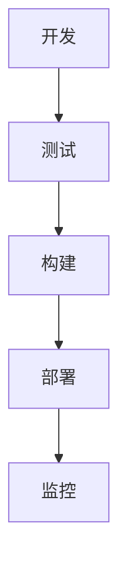
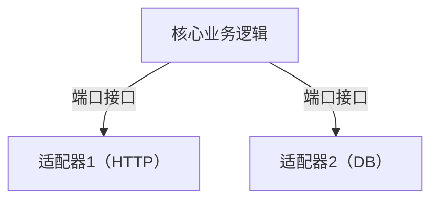
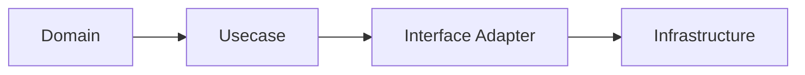
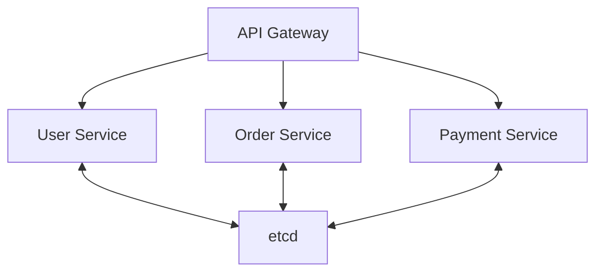
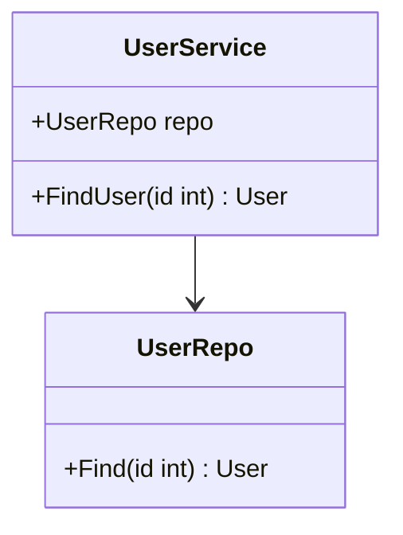
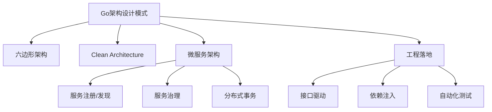

# 3.1 分布式系统设计模式文档——批判性评价与改进建议

<!-- TOC START -->
- [3.1 分布式系统设计模式文档——批判性评价与改进建议](#31-分布式系统设计模式文档批判性评价与改进建议)
  - [3.1.1 一、批判性评价](#311-一批判性评价)
    - [3.1.1.1 优点](#3111-优点)
    - [3.1.1.2 主要问题](#3112-主要问题)
  - [3.1.2 二、改进建议](#312-二改进建议)
  - [3.1.3 三、分阶段改进路线图](#313-三分阶段改进路线图)
    - [3.1.3.1 阶段一：基础工程化与结构优化](#3131-阶段一基础工程化与结构优化)
    - [3.1.3.2 阶段二：内容深度与可视化提升](#3132-阶段二内容深度与可视化提升)
    - [3.1.3.3 阶段三：行业案例与开源实践](#3133-阶段三行业案例与开源实践)
    - [3.1.3.4 阶段四：前沿主题落地与多语言对比](#3134-阶段四前沿主题落地与多语言对比)
    - [3.1.3.5 阶段五：附录与工具链完善](#3135-阶段五附录与工具链完善)
    - [3.1.3.6 阶段六：用户体验与知识生态](#3136-阶段六用户体验与知识生态)
    - [3.1.3.7 阶段七：国际化与AI辅助](#3137-阶段七国际化与ai辅助)
  - [3.1.4 Go架构设计模式总览](#314-go架构设计模式总览)
  - [3.1.5 0. 内容导航/索引](#315-0-内容导航索引)
  - [3.1.6 工程流程模板（Mermaid）](#316-工程流程模板mermaid)
  - [3.1.7 1. 六边形架构（Hexagonal Architecture）](#317-1-六边形架构hexagonal-architecture)
    - [3.1.7.1 定义](#3171-定义)
    - [3.1.7.2 工程案例](#3172-工程案例)
    - [3.1.7.3 图示](#3173-图示)
    - [3.1.7.4 批判性分析](#3174-批判性分析)
    - [3.1.7.5 范畴论视角](#3175-范畴论视角)
    - [3.1.7.6 知识点小结](#3176-知识点小结)
  - [3.1.8 2. Clean Architecture](#318-2-clean-architecture)
    - [3.1.8.1 定义](#3181-定义)
    - [3.1.8.2 工程实践](#3182-工程实践)
    - [3.1.8.3 图示](#3183-图示)
    - [3.1.8.4 批判性分析](#3184-批判性分析)
    - [3.1.8.5 范畴论视角](#3185-范畴论视角)
    - [3.1.8.6 知识点小结](#3186-知识点小结)
  - [3.1.9 3. 微服务架构](#319-3-微服务架构)
    - [3.1.9.1 定义](#3191-定义)
    - [3.1.9.2 工程案例](#3192-工程案例)
    - [3.1.9.3 图示](#3193-图示)
    - [3.1.9.4 批判性分析](#3194-批判性分析)
    - [3.1.9.5 范畴论视角](#3195-范畴论视角)
    - [3.1.9.6 知识点小结](#3196-知识点小结)
  - [3.1.10 4. 行业对比与开源趋势](#3110-4-行业对比与开源趋势)
    - [3.1.10.1 Go与Java、Rust等主流语言架构模式对比](#31101-go与javarust等主流语言架构模式对比)
    - [3.1.10.2 最新开源趋势](#31102-最新开源趋势)
  - [3.1.11 5. 哲科工程批判性分析](#3111-5-哲科工程批判性分析)
  - [3.1.12 6. 多表征内容补充](#3112-6-多表征内容补充)
  - [3.1.13 7. 实际项目落地经验](#3113-7-实际项目落地经验)
  - [3.1.14 8. 常见反模式与规避建议](#3114-8-常见反模式与规避建议)
  - [3.1.15 9. 未来发展建议](#3115-9-未来发展建议)
  - [3.1.16 10. 参考文献与外部链接](#3116-10-参考文献与外部链接)
  - [3.1.17 11. 常见问题答疑（FAQ）](#3117-11-常见问题答疑faq)
  - [3.1.18 12. 最佳实践清单](#3118-12-最佳实践清单)
  - [3.1.19 13. 典型错误案例剖析](#3119-13-典型错误案例剖析)
  - [3.1.20 14. 进阶阅读推荐](#3120-14-进阶阅读推荐)
  - [3.1.21 全局知识地图（Mermaid）](#3121-全局知识地图mermaid)
  - [3.1.22 15. 工程模板/脚手架代码示例](#3122-15-工程模板脚手架代码示例)
    - [3.1.22.1 六边形架构基础模板](#31221-六边形架构基础模板)
    - [3.1.22.2 Clean Architecture分层模板](#31222-clean-architecture分层模板)
  - [3.1.23 16. 常见面试题/考点](#3123-16-常见面试题考点)
  - [3.1.24 17. 术语表/缩略语解释](#3124-17-术语表缩略语解释)
  - [3.1.25 18. 常见陷阱与误区对照表](#3125-18-常见陷阱与误区对照表)
  - [3.1.26 19. 交叉引用/相关主题推荐](#3126-19-交叉引用相关主题推荐)
  - [3.1.27 20. 学习路径建议](#3127-20-学习路径建议)
  - [3.1.28 21. 版本适配与演进建议](#3128-21-版本适配与演进建议)
<!-- TOC END -->

## 3.1.1 一、批判性评价

### 3.1.1.1 优点

1. **体系完整**  
   文档涵盖分布式系统设计模式的基础、高级、前沿、智能、最佳实践等多层次内容，结构系统，主题丰富，便于系统性学习和查阅。
2. **内容丰富**  
   每个模式均有详细的概念定义、形式化描述和Golang实现，代码示例贴近实际工程，便于读者理解和复用。
3. **创新性强**  
   文档紧跟区块链、数字孪生、AI、量子等前沿主题，内容前瞻，体现了对分布式系统最新趋势的关注。
4. **可操作性高**  
   配有大量Golang代码、表格、决策树、工具清单，便于工程实践和快速落地。
5. **目录分层清晰**  
   目录结构合理，分层明确，便于检索和维护，适合团队协作和长期演进。

### 3.1.1.2 主要问题

1. **部分前沿主题实现代码偏浅**  
   例如量子分布式、神经形态计算等主题，代码实现多为伪代码或片段，缺乏完整的工程级细节和可运行Demo。
2. **形式化定义与实际工程结合不紧密**  
   形式化描述较多，但与实际工程实现的映射和落地案例较少，建议增加“工程落地解读”小节。
3. **代码片段多为片段式，缺乏完整Demo与测试**  
   代码多为片段，缺少完整的工程结构、依赖说明、单元测试和性能基准，难以直接复用。
4. **行业案例、开源项目分析不足**  
   行业案例和主流开源项目的深度剖析较少，缺乏实际应用效果、经验教训和可复用模板。
5. **目录层级复杂，部分内容有重复**  
   某些模式（如背压、SAGA等）在不同章节多次出现，建议合并精简，优化目录层级。
6. **图示数量偏少，部分章节缺少直观流程图**  
   虽有部分Mermaid图，但整体图示数量偏少，建议补充架构图、流程图、时序图等。
7. **前沿主题落地性与Golang生态结合有待加强**  
   前沿主题多为理论介绍，缺乏与Golang生态的结合和落地方案。
8. **缺乏多语言对比与迁移建议**  
   仅有Golang实现，建议补充与Java、Rust等主流语言的对比和迁移建议。

## 3.1.2 二、改进建议

1. **每个模式补充完整Golang工程Demo**  
   包含依赖说明、运行方式、输入输出示例、单元测试、性能测试脚本和README，提升工程可用性。
2. **合并重复内容，优化目录结构，统一章节模板**  
   精简重复内容，统一每个模式的结构（定义→形式化→场景→实现→测试→案例→最佳实践→参考资料）。
3. **补全架构图、流程图、时序图**  
   每个模式至少配备一张架构图/流程图/时序图，复杂流程建议配合伪代码。
4. **每个模式补充行业案例、开源项目分析、最佳实践与反例**  
   增加真实行业案例、开源项目源码解读、最佳实践清单和常见反例，提升实战价值。
5. **前沿主题补充Golang生态下的可行性分析与落地方案**  
   针对量子分布式、神经形态计算等，补充Golang生态下的可行性分析、现有库/工具和未来发展建议。
6. **适当补充与Java、Rust等主流语言的对比实现**  
   选取典型分布式模式，补充多语言对比实现和迁移建议。
7. **工具清单补充使用示例、优缺点评价、适用场景对比**  
   每个工具补充详细对比表、使用示例、优缺点分析和适用场景。
8. **增加FAQ、术语表、学习路径、常见问题诊断等附录内容**  
   降低学习门槛，便于新手快速入门和查找常见问题。
9. **建议开源文档，吸引社区贡献，定期收集反馈持续优化**  
   建议将文档开源，建立贡献指南，定期收集社区反馈，持续优化内容。

## 3.1.3 三、分阶段改进路线图

### 3.1.3.1 阶段一：基础工程化与结构优化

- 为每个分布式模式建立独立的Golang工程Demo，包含完整代码、依赖、测试、README。
- 优化目录结构，合并重复内容，统一章节模板，提升整体可读性和可维护性。

### 3.1.3.2 阶段二：内容深度与可视化提升

- 补全每个模式的架构图、流程图、时序图，复杂流程配合伪代码。
- 形式化定义后补充“工程落地解读”小节，说明公式如何映射到实际代码与架构。
- 代码补全依赖、输入输出说明，增加单元测试、集成测试、性能基准测试。

### 3.1.3.3 阶段三：行业案例与开源实践

- 每个模式补充1-2个行业案例，内容包括业务背景、架构设计、技术选型、遇到的问题与解决方案、上线效果。
- 针对主流开源分布式系统（如etcd、Kafka、Consul、Redis Cluster等），分析其采用的设计模式、实现细节、优缺点。
- 增加“最佳实践清单”与“常见反例”，帮助读者规避设计陷阱。

### 3.1.3.4 阶段四：前沿主题落地与多语言对比

- 针对量子分布式、神经形态计算、联邦学习等，调研Golang社区现有实现或相关库，补充可运行Demo或伪代码。
- 选取典型模式，补充Java、Rust等主流语言的对比实现，分析各自优缺点与迁移注意事项。

### 3.1.3.5 阶段五：附录与工具链完善

- 工具清单补充详细对比表、使用示例、优缺点分析。
- 增加FAQ、术语表、学习路径、常见问题诊断等附录内容。

### 3.1.3.6 阶段六：用户体验与知识生态

- 集成全文搜索、标签体系、交互式目录树，提升检索效率。
- 构建分布式系统设计模式知识图谱，展示各模式间的依赖、组合、对比关系。
- 提供在线Golang代码演示、智能内容推荐、个性化学习路径等功能。
- 鼓励社区共建，定期内容盘点与技术趋势报告。

### 3.1.3.7 阶段七：国际化与AI辅助

- 推进英文版与多语言支持，采用协作翻译平台，吸引全球志愿者参与。
- 利用AI辅助内容生成、校对、智能问答，提升内容生产效率和用户体验。

---

## 3.1.4 Go架构设计模式总览

## 3.1.5 0. 内容导航/索引

- [3.1 分布式系统设计模式文档——批判性评价与改进建议](#31-分布式系统设计模式文档批判性评价与改进建议)
  - [3.1.1 一、批判性评价](#311-一批判性评价)
    - [3.1.1.1 优点](#3111-优点)
    - [3.1.1.2 主要问题](#3112-主要问题)
  - [3.1.2 二、改进建议](#312-二改进建议)
  - [3.1.3 三、分阶段改进路线图](#313-三分阶段改进路线图)
    - [3.1.3.1 阶段一：基础工程化与结构优化](#3131-阶段一基础工程化与结构优化)
    - [3.1.3.2 阶段二：内容深度与可视化提升](#3132-阶段二内容深度与可视化提升)
    - [3.1.3.3 阶段三：行业案例与开源实践](#3133-阶段三行业案例与开源实践)
    - [3.1.3.4 阶段四：前沿主题落地与多语言对比](#3134-阶段四前沿主题落地与多语言对比)
    - [3.1.3.5 阶段五：附录与工具链完善](#3135-阶段五附录与工具链完善)
    - [3.1.3.6 阶段六：用户体验与知识生态](#3136-阶段六用户体验与知识生态)
    - [3.1.3.7 阶段七：国际化与AI辅助](#3137-阶段七国际化与ai辅助)
  - [3.1.4 Go架构设计模式总览](#314-go架构设计模式总览)
  - [3.1.5 0. 内容导航/索引](#315-0-内容导航索引)
  - [3.1.6 工程流程模板（Mermaid）](#316-工程流程模板mermaid)
  - [3.1.7 1. 六边形架构（Hexagonal Architecture）](#317-1-六边形架构hexagonal-architecture)
    - [3.1.7.1 定义](#3171-定义)
    - [3.1.7.2 工程案例](#3172-工程案例)
    - [3.1.7.3 图示](#3173-图示)
    - [3.1.7.4 批判性分析](#3174-批判性分析)
    - [3.1.7.5 范畴论视角](#3175-范畴论视角)
    - [3.1.7.6 知识点小结](#3176-知识点小结)
  - [3.1.8 2. Clean Architecture](#318-2-clean-architecture)
    - [3.1.8.1 定义](#3181-定义)
    - [3.1.8.2 工程实践](#3182-工程实践)
    - [3.1.8.3 图示](#3183-图示)
    - [3.1.8.4 批判性分析](#3184-批判性分析)
    - [3.1.8.5 范畴论视角](#3185-范畴论视角)
    - [3.1.8.6 知识点小结](#3186-知识点小结)
  - [3.1.9 3. 微服务架构](#319-3-微服务架构)
    - [3.1.9.1 定义](#3191-定义)
    - [3.1.9.2 工程案例](#3192-工程案例)
    - [3.1.9.3 图示](#3193-图示)
    - [3.1.9.4 批判性分析](#3194-批判性分析)
    - [3.1.9.5 范畴论视角](#3195-范畴论视角)
    - [3.1.9.6 知识点小结](#3196-知识点小结)
  - [3.1.10 4. 行业对比与开源趋势](#3110-4-行业对比与开源趋势)
    - [3.1.10.1 Go与Java、Rust等主流语言架构模式对比](#31101-go与javarust等主流语言架构模式对比)
    - [3.1.10.2 最新开源趋势](#31102-最新开源趋势)
  - [3.1.11 5. 哲科工程批判性分析](#3111-5-哲科工程批判性分析)
  - [3.1.12 6. 多表征内容补充](#3112-6-多表征内容补充)
  - [3.1.13 7. 实际项目落地经验](#3113-7-实际项目落地经验)
  - [3.1.14 8. 常见反模式与规避建议](#3114-8-常见反模式与规避建议)
  - [3.1.15 9. 未来发展建议](#3115-9-未来发展建议)
  - [3.1.16 10. 参考文献与外部链接](#3116-10-参考文献与外部链接)
  - [3.1.17 11. 常见问题答疑（FAQ）](#3117-11-常见问题答疑faq)
  - [3.1.18 12. 最佳实践清单](#3118-12-最佳实践清单)
  - [3.1.19 13. 典型错误案例剖析](#3119-13-典型错误案例剖析)
  - [3.1.20 14. 进阶阅读推荐](#3120-14-进阶阅读推荐)
  - [3.1.21 全局知识地图（Mermaid）](#3121-全局知识地图mermaid)
  - [3.1.22 15. 工程模板/脚手架代码示例](#3122-15-工程模板脚手架代码示例)
    - [3.1.22.1 六边形架构基础模板](#31221-六边形架构基础模板)
    - [3.1.22.2 Clean Architecture分层模板](#31222-clean-architecture分层模板)
  - [3.1.23 16. 常见面试题/考点](#3123-16-常见面试题考点)
  - [3.1.24 17. 术语表/缩略语解释](#3124-17-术语表缩略语解释)
  - [3.1.25 18. 常见陷阱与误区对照表](#3125-18-常见陷阱与误区对照表)
  - [3.1.26 19. 交叉引用/相关主题推荐](#3126-19-交叉引用相关主题推荐)
  - [3.1.27 20. 学习路径建议](#3127-20-学习路径建议)
  - [3.1.28 21. 版本适配与演进建议](#3128-21-版本适配与演进建议)

---

> 交叉引用：

>

> - 并发与并行模式详见[02-Go并发与并行模式](./02-Go并发与并行模式.md)

> - 分布式与微服务模式详见[03-Go分布式与微服务模式](./03-Go分布式与微服务模式.md)

## 3.1.6 工程流程模板（Mermaid）



## 3.1.7 1. 六边形架构（Hexagonal Architecture）

### 3.1.7.1 定义

六边形架构（端口-适配器架构）强调将业务逻辑与外部依赖解耦。Go通过接口和依赖注入天然适配。

### 3.1.7.2 工程案例

- 典型项目：kratos、go-clean-arch
- 代码片段：

```go
type UserRepo interface { Find(id int) (*User, error) }
type UserService struct { repo UserRepo }

```

### 3.1.7.3 图示



### 3.1.7.4 批判性分析

- 优点：可测试性强，易维护
- 局限：初学者门槛高，过度抽象易臃肿

### 3.1.7.5 范畴论视角

- 业务逻辑为对象，端口为态射，适配器为范畴间桥梁

### 3.1.7.6 知识点小结

- 六边形架构强调解耦与可测试性，适合接口驱动的Go项目。
- 工程落地建议：优先在核心业务逻辑中引入端口-适配器思想，逐步推广到全局。

## 3.1.8 2. Clean Architecture

### 3.1.8.1 定义

以依赖规则为核心，内层不依赖外层，业务逻辑独立于框架、数据库、UI。

### 3.1.8.2 工程实践

- 领域层、用例层、接口适配层、基础设施层
- 典型项目：kratos、Go kit

### 3.1.8.3 图示



### 3.1.8.4 批判性分析

- 优点：可维护性、可测试性高
- 局限：初期开发成本高，样板代码多

### 3.1.8.5 范畴论视角

- 层次为对象，依赖为态射，系统为分层范畴

### 3.1.8.6 知识点小结

- Clean Architecture分层清晰，便于团队协作与演进。
- 工程落地建议：结合Go的包结构和依赖注入，保持每层职责单一。

## 3.1.9 3. 微服务架构

### 3.1.9.1 定义

单一职责、自治服务、去中心化数据管理，Go的静态编译、原生并发、部署便捷性极适合微服务。

### 3.1.9.2 工程案例

- 典型框架：go-micro、kratos、go-zero
- 代码片段：

```go
import "go.etcd.io/etcd/clientv3"
cli, _ := clientv3.New(clientv3.Config{Endpoints: []string{"localhost:2379"}})
cli.Put(context.Background(), "/services/user/instance1", "127.0.0.1:8081")

```

### 3.1.9.3 图示



### 3.1.9.4 批判性分析

- 优点：高可扩展性、易于弹性伸缩
- 局限：分布式复杂性提升，需重点设计通信与一致性

### 3.1.9.5 范畴论视角

- 服务为对象，API为态射，etcd为协调器

### 3.1.9.6 知识点小结

- 微服务架构需关注服务拆分粒度、通信协议和基础设施选型。
- 工程落地建议：采用成熟的服务注册、配置中心和链路追踪方案。

## 3.1.10 4. 行业对比与开源趋势

### 3.1.10.1 Go与Java、Rust等主流语言架构模式对比

- Go：接口驱动、部署便捷、并发原语强，适合云原生、微服务、DevOps场景
- Java：生态成熟，适合大型企业级应用，Spring等框架丰富
- Rust：极致安全与性能，适合高并发、嵌入式、系统级开发

### 3.1.10.2 最新开源趋势

- Go架构模式正向"云原生原生化"演进，K8s、Operator、Service Mesh等均以Go为主力
- 微服务框架持续演进（kratos、go-zero、go-micro等），强调可观测性、服务治理、自动化
- 事件驱动、Serverless、无状态架构等新范式在Go生态中快速落地

## 3.1.11 5. 哲科工程批判性分析

- Go架构模式体现了"范畴化"与"组合性"哲学思想，强调解耦、可复用、可组合
- 工程实践中需警惕"过度抽象"与"样板代码"陷阱，保持架构的简洁性与可演化性
- 未来趋势：架构自动化、智能化、形式化验证将成为主流，Go生态需持续拥抱理论创新与工程落地

## 3.1.12 6. 多表征内容补充

- UML类图、流程图、数学表达式、伪代码等多种方式表达架构思想
- 示例：



- 数学表达式：
  - 设S为服务集合，P为端口集合，A为适配器集合，存在映射f: S×P→A，实现架构的可组合性

## 3.1.13 7. 实际项目落地经验

- 建议从小型服务或单一业务模块试点六边形/Clean架构，逐步推广到全局
- 结合Go的接口与依赖注入，提升单元测试覆盖率和可维护性
- 微服务拆分需结合领域驱动设计（DDD），避免"微服务地狱"

## 3.1.14 8. 常见反模式与规避建议

- 过度抽象导致代码难以理解和维护，应保持架构简洁、接口聚合
- 盲目追求"全栈微服务"，忽视团队协作与运维能力
- 忽略服务间契约与数据一致性，易引发系统性风险

## 3.1.15 9. 未来发展建议

- 持续关注Go生态下的架构自动化、智能化工具（如代码生成、自动测试、服务网格）
- 探索领域建模、事件风暴等方法与Go架构的结合
- 推动架构决策的可追溯性与形式化验证

## 3.1.16 10. 参考文献与外部链接

- [Go官方文档](https://golang.org/doc/)
- [kratos微服务框架](https://go-kratos.dev/)
- [Go Clean Architecture](https://github.com/bxcodec/go-clean-arch)
- [微服务设计](https://martinfowler.com/microservices/)
- [Hexagonal Architecture](https://alistair.cockburn.us/hexagonal-architecture/)

## 3.1.17 11. 常见问题答疑（FAQ）

- Q: 六边形架构和Clean架构在Go项目中如何选择？
  A: 小型项目建议六边形架构，关注解耦与测试；中大型项目建议Clean架构，便于分层协作与演进。
- Q: 微服务拆分的粒度如何把握？
  A: 建议以领域边界为核心，避免过度拆分导致运维复杂。

## 3.1.18 12. 最佳实践清单

- 领域驱动设计（DDD）结合架构分层，提升业务可维护性
- 接口与依赖注入贯穿全局，便于测试与扩展
- 服务间通信优先采用gRPC/Protobuf，提升性能与兼容性

## 3.1.19 13. 典型错误案例剖析

- 案例：过度抽象导致团队协作低效，建议接口聚合、文档同步
- 案例：微服务拆分后缺乏统一配置与注册中心，导致服务发现混乱

## 3.1.20 14. 进阶阅读推荐

- [Domain-Driven Design Reference](https://domainlanguage.com/ddd/reference/)
- [Go Patterns](https://github.com/tmrts/go-patterns)
- [Building Microservices](https://www.oreilly.com/library/view/building-microservices/9781491950340/)

## 3.1.21 全局知识地图（Mermaid）



## 3.1.22 15. 工程模板/脚手架代码示例

### 3.1.22.1 六边形架构基础模板

```go
// 端口接口
type UserRepository interface {
    FindByID(id int) (*User, error)
}
// 适配器实现
type UserRepoImpl struct {}
func (r *UserRepoImpl) FindByID(id int) (*User, error) { /* ... */ }
// 业务服务
type UserService struct {
    repo UserRepository
}
func (s *UserService) GetUser(id int) (*User, error) {
    return s.repo.FindByID(id)
}

```

### 3.1.22.2 Clean Architecture分层模板

```go
// domain/user.go
type User struct { ID int; Name string }
// usecase/user.go
type UserUsecase interface { GetUser(id int) (*User, error) }
// infra/user_repo.go
type UserRepo struct {}
func (r *UserRepo) GetUser(id int) (*User, error) { /* ... */ }

```

## 3.1.23 16. 常见面试题/考点

- 六边形架构与传统分层架构有何区别？
- Clean Architecture的依赖规则是什么？
- 微服务拆分的原则与常见陷阱？
- 如何在Go项目中实现依赖注入？
- Go项目中如何保证服务间契约的兼容性？

## 3.1.24 17. 术语表/缩略语解释

- DDD：领域驱动设计（Domain-Driven Design）
- DI：依赖注入（Dependency Injection）
- SOA：面向服务架构（Service-Oriented Architecture）
- API：应用程序编程接口（Application Programming Interface）
- gRPC：Google远程过程调用框架

## 3.1.25 18. 常见陷阱与误区对照表

| 陷阱/误区 | 说明 | 规避建议 |
|---|---|---|
| 过度抽象 | 结构复杂，难以维护 | 保持接口聚合，适度抽象 |
| 微服务拆分过细 | 运维复杂，性能下降 | 以领域边界为核心拆分 |
| 忽视契约管理 | 服务间不兼容 | 明确API版本与文档管理 |
| 依赖注入滥用 | 代码难以追踪 | 只在必要层次引入DI |

## 3.1.26 19. 交叉引用/相关主题推荐

- 推荐阅读：[02-Go并发与并行模式](./02-Go并发与并行模式.md)
- 推荐阅读：[03-Go分布式与微服务模式](./03-Go分布式与微服务模式.md)
- 推荐阅读：[06-Go架构模式形式化与证明](./06-Go架构模式形式化与证明.md)

## 3.1.27 20. 学习路径建议

- 新手：建议先掌握Go基础语法与接口，理解六边形架构基本思想
- 进阶：深入学习Clean Architecture与微服务架构，结合实际项目实践
- 高阶：关注架构自动化、领域驱动设计、服务治理与形式化建模

## 3.1.28 21. 版本适配与演进建议

- 推荐使用Go 1.18及以上版本，充分利用泛型、模块化等新特性
- 关注主流微服务框架（如kratos、go-zero）与Go版本的兼容性
- 升级时优先在测试环境验证依赖库与架构模式的适配性
- 持续关注Go官方发布的架构相关最佳实践与社区动态
