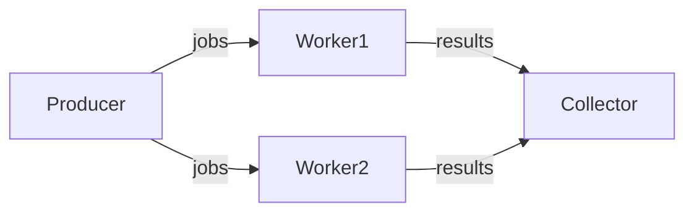
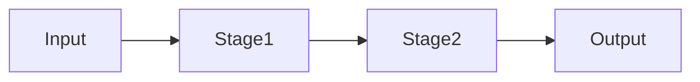
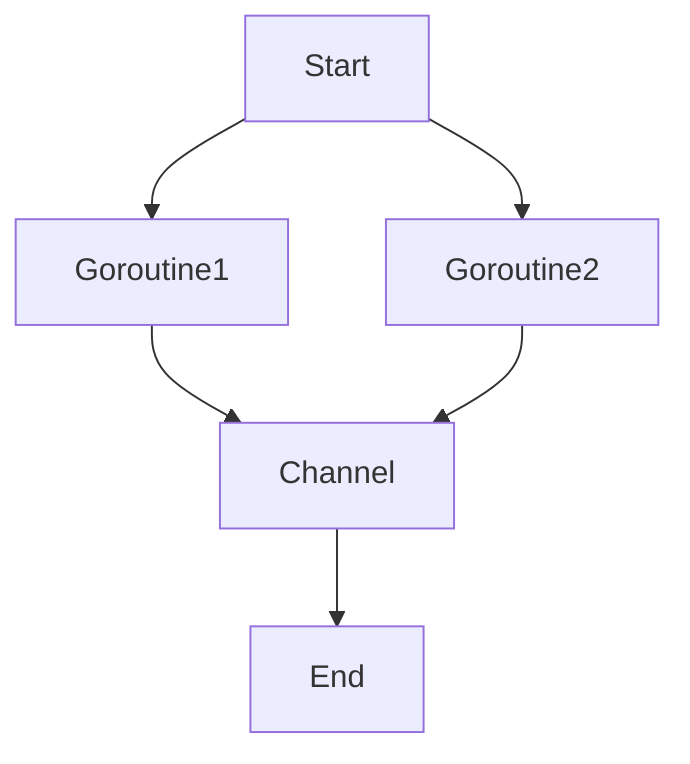

# Go并发与并行模式

## 1. Goroutine与Channel模式

### 定义

Go通过goroutine和channel实现轻量级并发。

### 工程案例

- 工作池、Fan-in/Fan-out、Pipeline
- 代码片段：

```go
func worker(jobs <-chan int, results chan<- int) { ... }
go worker(jobs, results)
```

### 图示



### 批判性分析

- 优点：极简语法，易用
- 局限：易出现泄漏、死锁，调试难

### 范畴论视角

- goroutine为对象，channel为态射

---

## 2. Pipeline流水线模式

### 定义

多阶段数据处理，每阶段独立goroutine，channel串联。

### 工程案例

- 日志处理、数据清洗
- 代码片段：

```go
func stage1(in <-chan int) <-chan int { ... }
func stage2(in <-chan int) <-chan int { ... }
```

### 图示



### 批判性分析

- 优点：天然并发，易扩展
- 局限：调试复杂，易阻塞

---

## 3. 生产者-消费者模式

### 工程案例

```go
jobs := make(chan int, 100)
results := make(chan int, 100)
for w := 1; w <= 3; w++ {
    go worker(w, jobs, results)
}
for j := 1; j <= 5; j++ {
    jobs <- j
}
close(jobs)
```

---

## 4. 并发安全与工程陷阱

### 典型问题

- goroutine泄漏、死锁、竞态条件
- sync.Mutex、atomic包

### 工程建议

- go test -race检测
- 优先channel，必要时用锁

### 批判性分析

- Go并发易用但隐性bug多，需结合工具链

### 范畴论视角

- 并发为过程范畴，goroutine为对象，channel为态射

## 5. 工程实战案例与性能对比

### 实战案例

- 高并发Web服务器：使用Goroutine池、Channel实现百万级并发连接
- 数据处理流水线：多阶段Pipeline处理大规模日志数据

### 性能对比

- Go vs Java：Go的Goroutine调度更轻量，内存占用低，适合高并发I/O密集型场景
- Go vs Rust：Rust并发安全性极高，Go易用性更强，适合业务开发

### 最新并发原语

- sync.Map、atomic.Value、context包的进化
- Go 1.20+引入的runtime/pprof、trace工具提升并发调优能力

## 6. 哲科工程分析与多表征

- Go并发模式体现"过程范畴"思想，强调协作、同步、解耦
- 工程实践需警惕"隐性死锁""资源泄漏"等陷阱，结合工具链保障健壮性
- Mermaid流程图、伪代码、数学表达式等多表征方式辅助理解



- 数学表达式：
  - 设G为Goroutine集合，C为Channel集合，存在映射f: G×C→P，P为并发过程集合

## 7. 并发调优实战
- 使用pprof、trace等工具定位性能瓶颈与死锁
- 通过合理设置GOMAXPROCS、调优Goroutine池大小提升吞吐
- 利用context实现超时控制与协程取消，防止资源泄漏

## 8. 常见并发陷阱与规避
- 忽视channel关闭时机，导致死锁或panic
- 误用共享变量，未加锁导致竞态条件
- 过度依赖全局状态，降低并发扩展性

## 9. 未来并发方向
- Go原生支持的异步IO、协程调度器持续优化
- 并发安全容器、Actor模型等新并发范式在Go生态中逐步落地
- 结合AI进行并发bug检测与自动修复

## 10. 参考文献与外部链接
- [Go并发编程官方文档](https://golang.org/doc/effective_go#concurrency)
- [Go pprof性能分析](https://blog.golang.org/pprof)
- [Go并发模式实战](https://github.com/lotusirous/go-concurrency-patterns)
- [Go trace工具](https://blog.golang.org/using-go-modules)
- [Go语言设计与实现](https://draveness.me/golang/)

## 11. 常见问题答疑（FAQ）
- Q: Goroutine泄漏如何排查？
  A: 使用pprof、trace等工具，关注未关闭的channel和未退出的协程。
- Q: Channel缓冲区如何设置？
  A: 根据生产/消费速率动态调整，避免阻塞或内存浪费。

## 12. 最佳实践清单
- 所有协程均应有退出机制，避免泄漏
- Channel关闭由发送方负责，接收方通过range安全消费
- 使用sync.WaitGroup管理协程生命周期

## 13. 典型错误案例剖析
- 案例：未关闭channel导致死锁
- 案例：多个协程写同一变量未加锁，导致竞态

## 14. 进阶阅读推荐
- [Go Concurrency Patterns](https://blog.golang.org/pipelines)
- [Go by Example: Goroutines](https://gobyexample.com/goroutines)
- [Go语言并发之道](https://github.com/chanxuehong/go-concurrent-programming)
