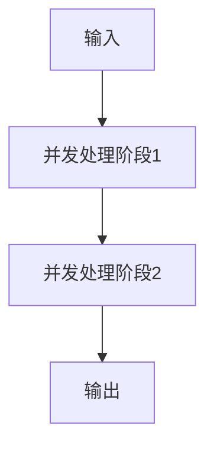
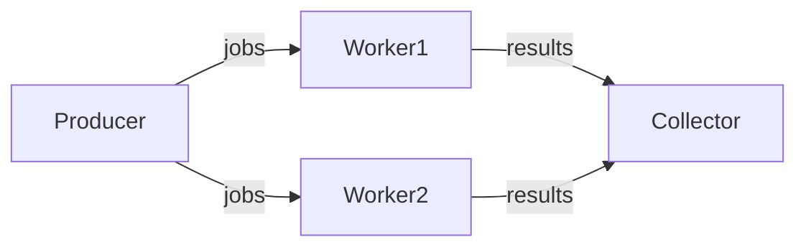
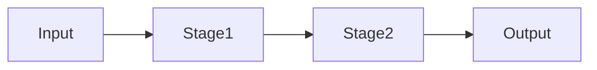
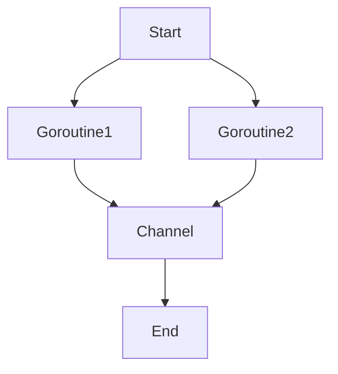
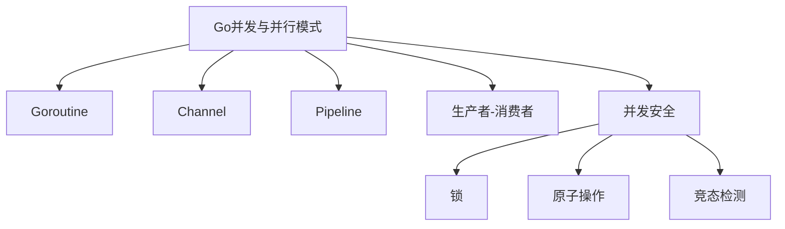

# Go并发与并行模式

## 0. 内容导航/索引

- [Go并发与并行模式](#go并发与并行模式)
  - [0. 内容导航/索引](#0-内容导航索引)
  - [并发工程流程模板（Mermaid）](#并发工程流程模板mermaid)
  - [1. Goroutine与Channel模式](#1-goroutine与channel模式)
    - [定义](#定义)
    - [工程案例](#工程案例)
    - [图示](#图示)
    - [批判性分析](#批判性分析)
    - [范畴论视角](#范畴论视角)
    - [1.6 知识点小结](#16-知识点小结)
  - [2. Pipeline流水线模式](#2-pipeline流水线模式)
    - [定义](#定义-1)
    - [工程案例](#工程案例-1)
    - [图示](#图示-1)
    - [批判性分析](#批判性分析-1)
    - [2.6 知识点小结](#26-知识点小结)
  - [3. 生产者-消费者模式](#3-生产者-消费者模式)
    - [工程案例](#工程案例-2)
  - [4. 并发安全与工程陷阱](#4-并发安全与工程陷阱)
    - [典型问题](#典型问题)
    - [工程建议](#工程建议)
    - [批判性分析](#批判性分析-2)
    - [范畴论视角](#范畴论视角-1)
    - [4.6 知识点小结](#46-知识点小结)
  - [5. 工程实战案例与性能对比](#5-工程实战案例与性能对比)
    - [实战案例](#实战案例)
    - [性能对比](#性能对比)
    - [最新并发原语](#最新并发原语)
  - [6. 哲科工程分析与多表征](#6-哲科工程分析与多表征)
  - [7. 并发调优实战](#7-并发调优实战)
  - [8. 常见并发陷阱与规避](#8-常见并发陷阱与规避)
  - [9. 未来并发方向](#9-未来并发方向)
  - [10. 参考文献与外部链接](#10-参考文献与外部链接)
  - [11. 常见问题答疑（FAQ）](#11-常见问题答疑faq)
  - [12. 最佳实践清单](#12-最佳实践清单)
  - [13. 典型错误案例剖析](#13-典型错误案例剖析)
  - [14. 进阶阅读推荐](#14-进阶阅读推荐)
  - [全局知识地图（Mermaid）](#全局知识地图mermaid)
  - [15. 工程模板/脚手架代码示例](#15-工程模板脚手架代码示例)
    - [Goroutine池模板](#goroutine池模板)
    - [Pipeline模式模板](#pipeline模式模板)
  - [16. 常见面试题/考点](#16-常见面试题考点)
  - [17. 术语表/缩略语解释](#17-术语表缩略语解释)
  - [18. 常见陷阱与误区对照表](#18-常见陷阱与误区对照表)
  - [19. 交叉引用/相关主题推荐](#19-交叉引用相关主题推荐)
  - [20. 学习路径建议](#20-学习路径建议)

---

> 交叉引用：
>
> - 架构设计模式详见[01-Go架构设计模式总览](./01-Go架构设计模式总览.md)
> - 分布式与微服务详见[03-Go分布式与微服务模式](./03-Go分布式与微服务模式.md)

## 并发工程流程模板（Mermaid）



## 1. Goroutine与Channel模式

### 定义

Go通过goroutine和channel实现轻量级并发。

### 工程案例

- 工作池、Fan-in/Fan-out、Pipeline
- 代码片段：

```go
func worker(jobs <-chan int, results chan<- int) { ... }
go worker(jobs, results)
```

### 图示



### 批判性分析

- 优点：极简语法，易用
- 局限：易出现泄漏、死锁，调试难

### 范畴论视角

- goroutine为对象，channel为态射

### 1.6 知识点小结

- Goroutine与Channel是Go并发的核心，适合高并发I/O场景。
- 工程落地建议：合理设计协程退出机制，避免泄漏。

---

## 2. Pipeline流水线模式

### 定义

多阶段数据处理，每阶段独立goroutine，channel串联。

### 工程案例

- 日志处理、数据清洗
- 代码片段：

```go
func stage1(in <-chan int) <-chan int { ... }
func stage2(in <-chan int) <-chan int { ... }
```

### 图示



### 批判性分析

- 优点：天然并发，易扩展
- 局限：调试复杂，易阻塞

### 2.6 知识点小结

- Pipeline模式适合多阶段数据处理，提升并发效率。
- 工程落地建议：每个阶段独立协程，合理设置缓冲区。

---

## 3. 生产者-消费者模式

### 工程案例

```go
jobs := make(chan int, 100)
results := make(chan int, 100)
for w := 1; w <= 3; w++ {
    go worker(w, jobs, results)
}
for j := 1; j <= 5; j++ {
    jobs <- j
}
close(jobs)
```

---

## 4. 并发安全与工程陷阱

### 典型问题

- goroutine泄漏、死锁、竞态条件
- sync.Mutex、atomic包

### 工程建议

- go test -race检测
- 优先channel，必要时用锁

### 批判性分析

- Go并发易用但隐性bug多，需结合工具链

### 范畴论视角

- 并发为过程范畴，goroutine为对象，channel为态射

### 4.6 知识点小结

- 并发安全需结合锁、原子操作与channel，防止竞态与死锁。
- 工程落地建议：充分利用go test -race和pprof工具。

## 5. 工程实战案例与性能对比

### 实战案例

- 高并发Web服务器：使用Goroutine池、Channel实现百万级并发连接
- 数据处理流水线：多阶段Pipeline处理大规模日志数据

### 性能对比

- Go vs Java：Go的Goroutine调度更轻量，内存占用低，适合高并发I/O密集型场景
- Go vs Rust：Rust并发安全性极高，Go易用性更强，适合业务开发

### 最新并发原语

- sync.Map、atomic.Value、context包的进化
- Go 1.20+引入的runtime/pprof、trace工具提升并发调优能力

## 6. 哲科工程分析与多表征

- Go并发模式体现"过程范畴"思想，强调协作、同步、解耦
- 工程实践需警惕"隐性死锁""资源泄漏"等陷阱，结合工具链保障健壮性
- Mermaid流程图、伪代码、数学表达式等多表征方式辅助理解



- 数学表达式：
  - 设G为Goroutine集合，C为Channel集合，存在映射f: G×C→P，P为并发过程集合

## 7. 并发调优实战

- 使用pprof、trace等工具定位性能瓶颈与死锁
- 通过合理设置GOMAXPROCS、调优Goroutine池大小提升吞吐
- 利用context实现超时控制与协程取消，防止资源泄漏

## 8. 常见并发陷阱与规避

- 忽视channel关闭时机，导致死锁或panic
- 误用共享变量，未加锁导致竞态条件
- 过度依赖全局状态，降低并发扩展性

## 9. 未来并发方向

- Go原生支持的异步IO、协程调度器持续优化
- 并发安全容器、Actor模型等新并发范式在Go生态中逐步落地
- 结合AI进行并发bug检测与自动修复

## 10. 参考文献与外部链接

- [Go并发编程官方文档](https://golang.org/doc/effective_go#concurrency)
- [Go pprof性能分析](https://blog.golang.org/pprof)
- [Go并发模式实战](https://github.com/lotusirous/go-concurrency-patterns)
- [Go trace工具](https://blog.golang.org/using-go-modules)
- [Go语言设计与实现](https://draveness.me/golang/)

## 11. 常见问题答疑（FAQ）

- Q: Goroutine泄漏如何排查？
  A: 使用pprof、trace等工具，关注未关闭的channel和未退出的协程。
- Q: Channel缓冲区如何设置？
  A: 根据生产/消费速率动态调整，避免阻塞或内存浪费。

## 12. 最佳实践清单

- 所有协程均应有退出机制，避免泄漏
- Channel关闭由发送方负责，接收方通过range安全消费
- 使用sync.WaitGroup管理协程生命周期

## 13. 典型错误案例剖析

- 案例：未关闭channel导致死锁
- 案例：多个协程写同一变量未加锁，导致竞态

## 14. 进阶阅读推荐

- [Go Concurrency Patterns](https://blog.golang.org/pipelines)
- [Go by Example: Goroutines](https://gobyexample.com/goroutines)
- [Go语言并发之道](https://github.com/chanxuehong/go-concurrent-programming)

## 全局知识地图（Mermaid）



## 15. 工程模板/脚手架代码示例

### Goroutine池模板

```go
var wg sync.WaitGroup
jobs := make(chan int, 100)
for w := 0; w < 5; w++ {
    wg.Add(1)
    go func() {
        defer wg.Done()
        for job := range jobs {
            // 处理job
        }
    }()
}
// 投递任务
for i := 0; i < 100; i++ { jobs <- i }
close(jobs)
wg.Wait()
```

### Pipeline模式模板

```go
func stage1(in <-chan int) <-chan int {
    out := make(chan int)
    go func() {
        for v := range in { out <- v * 2 }
        close(out)
    }()
    return out
}
```

## 16. 常见面试题/考点

- Go的Goroutine调度原理？
- Channel的无缓冲与有缓冲区别？
- 如何检测并发中的竞态条件？
- select语句的典型应用场景？
- 如何优雅关闭多个协程？

## 17. 术语表/缩略语解释
- Goroutine：Go语言中的轻量级线程
- Channel：Go并发通信机制
- Mutex：互斥锁
- WaitGroup：协程同步等待组
- Race Condition：竞态条件

## 18. 常见陷阱与误区对照表
| 陷阱/误区 | 说明 | 规避建议 |
|---|---|---|
| 协程泄漏 | 协程未退出，资源浪费 | 设计退出机制，及时关闭channel |
| 死锁 | 多协程互相等待 | 使用go test -race检测，简化锁粒度 |
| 竞态条件 | 多协程并发写同一变量 | 加锁或用channel传递数据 |
| Channel未关闭 | 导致协程阻塞 | 由发送方负责关闭channel |

## 19. 交叉引用/相关主题推荐
- 推荐阅读：[01-Go架构设计模式总览](./01-Go架构设计模式总览.md)
- 推荐阅读：[03-Go分布式与微服务模式](./03-Go分布式与微服务模式.md)
- 推荐阅读：[05-Go与主流开源组件集成](./05-Go与主流开源组件集成.md)

## 20. 学习路径建议
- 新手：建议先掌握Goroutine、Channel等基础并发原语
- 进阶：学习Pipeline、生产者-消费者等并发模式，掌握并发调优工具
- 高阶：关注并发安全、Actor模型、并发容器与自动化测试
