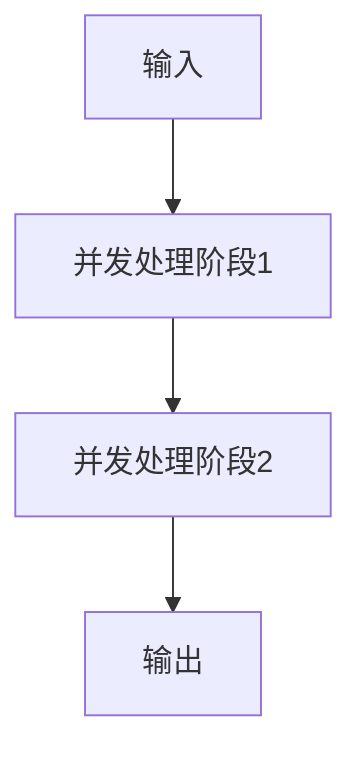
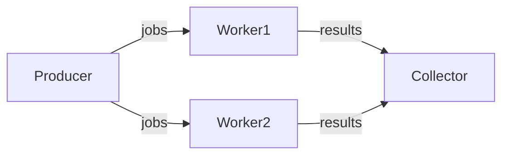
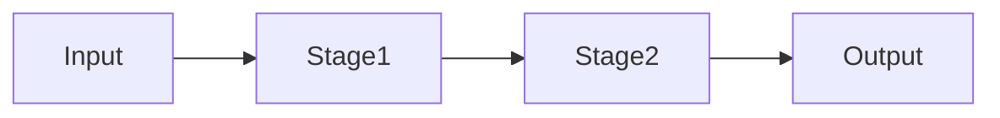
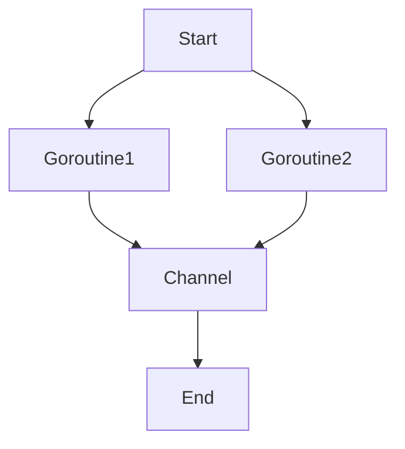
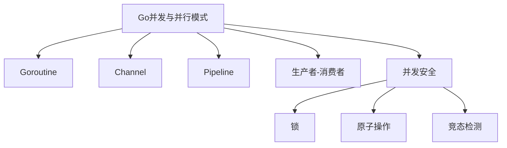

# 3.1 分布式系统设计模式文档——批判性评价与改进建议

<!-- TOC START -->
- [3.1 分布式系统设计模式文档——批判性评价与改进建议](#31-分布式系统设计模式文档批判性评价与改进建议)
  - [3.1.1 一、批判性评价](#311-一批判性评价)
    - [3.1.1.1 优点](#3111-优点)
    - [3.1.1.2 主要问题](#3112-主要问题)
  - [3.1.2 二、改进建议](#312-二改进建议)
  - [3.1.3 三、分阶段改进路线图](#313-三分阶段改进路线图)
    - [3.1.3.1 阶段一：基础工程化与结构优化](#3131-阶段一基础工程化与结构优化)
    - [3.1.3.2 阶段二：内容深度与可视化提升](#3132-阶段二内容深度与可视化提升)
    - [3.1.3.3 阶段三：行业案例与开源实践](#3133-阶段三行业案例与开源实践)
    - [3.1.3.4 阶段四：前沿主题落地与多语言对比](#3134-阶段四前沿主题落地与多语言对比)
    - [3.1.3.5 阶段五：附录与工具链完善](#3135-阶段五附录与工具链完善)
    - [3.1.3.6 阶段六：用户体验与知识生态](#3136-阶段六用户体验与知识生态)
    - [3.1.3.7 阶段七：国际化与AI辅助](#3137-阶段七国际化与ai辅助)
  - [3.1.4 Go并发与并行模式](#314-go并发与并行模式)
  - [3.1.5 0. 内容导航/索引](#315-0-内容导航索引)
  - [3.1.6 并发工程流程模板（Mermaid）](#316-并发工程流程模板mermaid)
  - [3.1.7 1. Goroutine与Channel模式](#317-1-goroutine与channel模式)
    - [3.1.7.1 定义](#3171-定义)
    - [3.1.7.2 工程案例](#3172-工程案例)
    - [3.1.7.3 图示](#3173-图示)
    - [3.1.7.4 批判性分析](#3174-批判性分析)
    - [3.1.7.5 范畴论视角](#3175-范畴论视角)
    - [3.1.7.6 知识点小结](#3176-知识点小结)
  - [3.1.8 2. Pipeline流水线模式](#318-2-pipeline流水线模式)
    - [3.1.8.1 定义](#3181-定义)
    - [3.1.8.2 工程案例](#3182-工程案例)
    - [3.1.8.3 图示](#3183-图示)
    - [3.1.8.4 批判性分析](#3184-批判性分析)
    - [3.1.8.5 知识点小结](#3185-知识点小结)
  - [3.1.9 3. 生产者-消费者模式](#319-3-生产者-消费者模式)
    - [3.1.9.1 工程案例](#3191-工程案例)
  - [3.1.10 4. 并发安全与工程陷阱](#3110-4-并发安全与工程陷阱)
    - [3.1.10.1 典型问题](#31101-典型问题)
    - [3.1.10.2 工程建议](#31102-工程建议)
    - [3.1.10.3 批判性分析](#31103-批判性分析)
    - [3.1.10.4 范畴论视角](#31104-范畴论视角)
    - [3.1.10.5 知识点小结](#31105-知识点小结)
  - [3.1.11 5. 工程实战案例与性能对比](#3111-5-工程实战案例与性能对比)
    - [3.1.11.1 实战案例](#31111-实战案例)
    - [3.1.11.2 性能对比](#31112-性能对比)
    - [3.1.11.3 最新并发原语](#31113-最新并发原语)
  - [3.1.12 6. 哲科工程分析与多表征](#3112-6-哲科工程分析与多表征)
  - [3.1.13 7. 并发调优实战](#3113-7-并发调优实战)
  - [3.1.14 8. 常见并发陷阱与规避](#3114-8-常见并发陷阱与规避)
  - [3.1.15 9. 未来并发方向](#3115-9-未来并发方向)
  - [3.1.16 10. 参考文献与外部链接](#3116-10-参考文献与外部链接)
  - [3.1.17 11. 常见问题答疑（FAQ）](#3117-11-常见问题答疑faq)
  - [3.1.18 12. 最佳实践清单](#3118-12-最佳实践清单)
  - [3.1.19 13. 典型错误案例剖析](#3119-13-典型错误案例剖析)
  - [3.1.20 14. 进阶阅读推荐](#3120-14-进阶阅读推荐)
  - [3.1.21 全局知识地图（Mermaid）](#3121-全局知识地图mermaid)
  - [3.1.22 15. 工程模板/脚手架代码示例](#3122-15-工程模板脚手架代码示例)
    - [3.1.22.1 Goroutine池模板](#31221-goroutine池模板)
    - [3.1.22.2 Pipeline模式模板](#31222-pipeline模式模板)
  - [3.1.23 16. 常见面试题/考点](#3123-16-常见面试题考点)
  - [3.1.24 17. 术语表/缩略语解释](#3124-17-术语表缩略语解释)
  - [3.1.25 18. 常见陷阱与误区对照表](#3125-18-常见陷阱与误区对照表)
  - [3.1.26 19. 交叉引用/相关主题推荐](#3126-19-交叉引用相关主题推荐)
  - [3.1.27 20. 学习路径建议](#3127-20-学习路径建议)
  - [3.1.28 21. 版本适配与演进建议](#3128-21-版本适配与演进建议)
<!-- TOC END -->

## 3.1.1 一、批判性评价

### 3.1.1.1 优点

1. **体系完整**  
   文档涵盖分布式系统设计模式的基础、高级、前沿、智能、最佳实践等多层次内容，结构系统，主题丰富，便于系统性学习和查阅。
2. **内容丰富**  
   每个模式均有详细的概念定义、形式化描述和Golang实现，代码示例贴近实际工程，便于读者理解和复用。
3. **创新性强**  
   文档紧跟区块链、数字孪生、AI、量子等前沿主题，内容前瞻，体现了对分布式系统最新趋势的关注。
4. **可操作性高**  
   配有大量Golang代码、表格、决策树、工具清单，便于工程实践和快速落地。
5. **目录分层清晰**  
   目录结构合理，分层明确，便于检索和维护，适合团队协作和长期演进。

### 3.1.1.2 主要问题

1. **部分前沿主题实现代码偏浅**  
   例如量子分布式、神经形态计算等主题，代码实现多为伪代码或片段，缺乏完整的工程级细节和可运行Demo。
2. **形式化定义与实际工程结合不紧密**  
   形式化描述较多，但与实际工程实现的映射和落地案例较少，建议增加“工程落地解读”小节。
3. **代码片段多为片段式，缺乏完整Demo与测试**  
   代码多为片段，缺少完整的工程结构、依赖说明、单元测试和性能基准，难以直接复用。
4. **行业案例、开源项目分析不足**  
   行业案例和主流开源项目的深度剖析较少，缺乏实际应用效果、经验教训和可复用模板。
5. **目录层级复杂，部分内容有重复**  
   某些模式（如背压、SAGA等）在不同章节多次出现，建议合并精简，优化目录层级。
6. **图示数量偏少，部分章节缺少直观流程图**  
   虽有部分Mermaid图，但整体图示数量偏少，建议补充架构图、流程图、时序图等。
7. **前沿主题落地性与Golang生态结合有待加强**  
   前沿主题多为理论介绍，缺乏与Golang生态的结合和落地方案。
8. **缺乏多语言对比与迁移建议**  
   仅有Golang实现，建议补充与Java、Rust等主流语言的对比和迁移建议。

## 3.1.2 二、改进建议

1. **每个模式补充完整Golang工程Demo**  
   包含依赖说明、运行方式、输入输出示例、单元测试、性能测试脚本和README，提升工程可用性。
2. **合并重复内容，优化目录结构，统一章节模板**  
   精简重复内容，统一每个模式的结构（定义→形式化→场景→实现→测试→案例→最佳实践→参考资料）。
3. **补全架构图、流程图、时序图**  
   每个模式至少配备一张架构图/流程图/时序图，复杂流程建议配合伪代码。
4. **每个模式补充行业案例、开源项目分析、最佳实践与反例**  
   增加真实行业案例、开源项目源码解读、最佳实践清单和常见反例，提升实战价值。
5. **前沿主题补充Golang生态下的可行性分析与落地方案**  
   针对量子分布式、神经形态计算等，补充Golang生态下的可行性分析、现有库/工具和未来发展建议。
6. **适当补充与Java、Rust等主流语言的对比实现**  
   选取典型分布式模式，补充多语言对比实现和迁移建议。
7. **工具清单补充使用示例、优缺点评价、适用场景对比**  
   每个工具补充详细对比表、使用示例、优缺点分析和适用场景。
8. **增加FAQ、术语表、学习路径、常见问题诊断等附录内容**  
   降低学习门槛，便于新手快速入门和查找常见问题。
9. **建议开源文档，吸引社区贡献，定期收集反馈持续优化**  
   建议将文档开源，建立贡献指南，定期收集社区反馈，持续优化内容。

## 3.1.3 三、分阶段改进路线图

### 3.1.3.1 阶段一：基础工程化与结构优化

- 为每个分布式模式建立独立的Golang工程Demo，包含完整代码、依赖、测试、README。
- 优化目录结构，合并重复内容，统一章节模板，提升整体可读性和可维护性。

### 3.1.3.2 阶段二：内容深度与可视化提升

- 补全每个模式的架构图、流程图、时序图，复杂流程配合伪代码。
- 形式化定义后补充“工程落地解读”小节，说明公式如何映射到实际代码与架构。
- 代码补全依赖、输入输出说明，增加单元测试、集成测试、性能基准测试。

### 3.1.3.3 阶段三：行业案例与开源实践

- 每个模式补充1-2个行业案例，内容包括业务背景、架构设计、技术选型、遇到的问题与解决方案、上线效果。
- 针对主流开源分布式系统（如etcd、Kafka、Consul、Redis Cluster等），分析其采用的设计模式、实现细节、优缺点。
- 增加“最佳实践清单”与“常见反例”，帮助读者规避设计陷阱。

### 3.1.3.4 阶段四：前沿主题落地与多语言对比

- 针对量子分布式、神经形态计算、联邦学习等，调研Golang社区现有实现或相关库，补充可运行Demo或伪代码。
- 选取典型模式，补充Java、Rust等主流语言的对比实现，分析各自优缺点与迁移注意事项。

### 3.1.3.5 阶段五：附录与工具链完善

- 工具清单补充详细对比表、使用示例、优缺点分析。
- 增加FAQ、术语表、学习路径、常见问题诊断等附录内容。

### 3.1.3.6 阶段六：用户体验与知识生态

- 集成全文搜索、标签体系、交互式目录树，提升检索效率。
- 构建分布式系统设计模式知识图谱，展示各模式间的依赖、组合、对比关系。
- 提供在线Golang代码演示、智能内容推荐、个性化学习路径等功能。
- 鼓励社区共建，定期内容盘点与技术趋势报告。

### 3.1.3.7 阶段七：国际化与AI辅助

- 推进英文版与多语言支持，采用协作翻译平台，吸引全球志愿者参与。
- 利用AI辅助内容生成、校对、智能问答，提升内容生产效率和用户体验。

---

## 3.1.4 Go并发与并行模式

## 3.1.5 0. 内容导航/索引

- [3.1 分布式系统设计模式文档——批判性评价与改进建议](#31-分布式系统设计模式文档批判性评价与改进建议)
  - [3.1.1 一、批判性评价](#311-一批判性评价)
    - [3.1.1.1 优点](#3111-优点)
    - [3.1.1.2 主要问题](#3112-主要问题)
  - [3.1.2 二、改进建议](#312-二改进建议)
  - [3.1.3 三、分阶段改进路线图](#313-三分阶段改进路线图)
    - [3.1.3.1 阶段一：基础工程化与结构优化](#3131-阶段一基础工程化与结构优化)
    - [3.1.3.2 阶段二：内容深度与可视化提升](#3132-阶段二内容深度与可视化提升)
    - [3.1.3.3 阶段三：行业案例与开源实践](#3133-阶段三行业案例与开源实践)
    - [3.1.3.4 阶段四：前沿主题落地与多语言对比](#3134-阶段四前沿主题落地与多语言对比)
    - [3.1.3.5 阶段五：附录与工具链完善](#3135-阶段五附录与工具链完善)
    - [3.1.3.6 阶段六：用户体验与知识生态](#3136-阶段六用户体验与知识生态)
    - [3.1.3.7 阶段七：国际化与AI辅助](#3137-阶段七国际化与ai辅助)
  - [3.1.4 Go并发与并行模式](#314-go并发与并行模式)
  - [3.1.5 0. 内容导航/索引](#315-0-内容导航索引)
  - [3.1.6 并发工程流程模板（Mermaid）](#316-并发工程流程模板mermaid)
  - [3.1.7 1. Goroutine与Channel模式](#317-1-goroutine与channel模式)
    - [3.1.7.1 定义](#3171-定义)
    - [3.1.7.2 工程案例](#3172-工程案例)
    - [3.1.7.3 图示](#3173-图示)
    - [3.1.7.4 批判性分析](#3174-批判性分析)
    - [3.1.7.5 范畴论视角](#3175-范畴论视角)
    - [3.1.7.6 知识点小结](#3176-知识点小结)
  - [3.1.8 2. Pipeline流水线模式](#318-2-pipeline流水线模式)
    - [3.1.8.1 定义](#3181-定义)
    - [3.1.8.2 工程案例](#3182-工程案例)
    - [3.1.8.3 图示](#3183-图示)
    - [3.1.8.4 批判性分析](#3184-批判性分析)
    - [3.1.8.5 知识点小结](#3185-知识点小结)
  - [3.1.9 3. 生产者-消费者模式](#319-3-生产者-消费者模式)
    - [3.1.9.1 工程案例](#3191-工程案例)
  - [3.1.10 4. 并发安全与工程陷阱](#3110-4-并发安全与工程陷阱)
    - [3.1.10.1 典型问题](#31101-典型问题)
    - [3.1.10.2 工程建议](#31102-工程建议)
    - [3.1.10.3 批判性分析](#31103-批判性分析)
    - [3.1.10.4 范畴论视角](#31104-范畴论视角)
    - [3.1.10.5 知识点小结](#31105-知识点小结)
  - [3.1.11 5. 工程实战案例与性能对比](#3111-5-工程实战案例与性能对比)
    - [3.1.11.1 实战案例](#31111-实战案例)
    - [3.1.11.2 性能对比](#31112-性能对比)
    - [3.1.11.3 最新并发原语](#31113-最新并发原语)
  - [3.1.12 6. 哲科工程分析与多表征](#3112-6-哲科工程分析与多表征)
  - [3.1.13 7. 并发调优实战](#3113-7-并发调优实战)
  - [3.1.14 8. 常见并发陷阱与规避](#3114-8-常见并发陷阱与规避)
  - [3.1.15 9. 未来并发方向](#3115-9-未来并发方向)
  - [3.1.16 10. 参考文献与外部链接](#3116-10-参考文献与外部链接)
  - [3.1.17 11. 常见问题答疑（FAQ）](#3117-11-常见问题答疑faq)
  - [3.1.18 12. 最佳实践清单](#3118-12-最佳实践清单)
  - [3.1.19 13. 典型错误案例剖析](#3119-13-典型错误案例剖析)
  - [3.1.20 14. 进阶阅读推荐](#3120-14-进阶阅读推荐)
  - [3.1.21 全局知识地图（Mermaid）](#3121-全局知识地图mermaid)
  - [3.1.22 15. 工程模板/脚手架代码示例](#3122-15-工程模板脚手架代码示例)
    - [3.1.22.1 Goroutine池模板](#31221-goroutine池模板)
    - [3.1.22.2 Pipeline模式模板](#31222-pipeline模式模板)
  - [3.1.23 16. 常见面试题/考点](#3123-16-常见面试题考点)
  - [3.1.24 17. 术语表/缩略语解释](#3124-17-术语表缩略语解释)
  - [3.1.25 18. 常见陷阱与误区对照表](#3125-18-常见陷阱与误区对照表)
  - [3.1.26 19. 交叉引用/相关主题推荐](#3126-19-交叉引用相关主题推荐)
  - [3.1.27 20. 学习路径建议](#3127-20-学习路径建议)
  - [3.1.28 21. 版本适配与演进建议](#3128-21-版本适配与演进建议)

---

> 交叉引用：
>
> - 架构设计模式详见[01-Go架构设计模式总览](./01-Go架构设计模式总览.md)
> - 分布式与微服务详见[03-Go分布式与微服务模式](./03-Go分布式与微服务模式.md)

## 3.1.6 并发工程流程模板（Mermaid）



## 3.1.7 1. Goroutine与Channel模式

### 3.1.7.1 定义

Go通过goroutine和channel实现轻量级并发。

### 3.1.7.2 工程案例

- 工作池、Fan-in/Fan-out、Pipeline
- 代码片段：

```go
func worker(jobs <-chan int, results chan<- int) { ... }
go worker(jobs, results)
```

### 3.1.7.3 图示



### 3.1.7.4 批判性分析

- 优点：极简语法，易用
- 局限：易出现泄漏、死锁，调试难

### 3.1.7.5 范畴论视角

- goroutine为对象，channel为态射

### 3.1.7.6 知识点小结

- Goroutine与Channel是Go并发的核心，适合高并发I/O场景。
- 工程落地建议：合理设计协程退出机制，避免泄漏。

---

## 3.1.8 2. Pipeline流水线模式

### 3.1.8.1 定义

多阶段数据处理，每阶段独立goroutine，channel串联。

### 3.1.8.2 工程案例

- 日志处理、数据清洗
- 代码片段：

```go
func stage1(in <-chan int) <-chan int { ... }
func stage2(in <-chan int) <-chan int { ... }
```

### 3.1.8.3 图示



### 3.1.8.4 批判性分析

- 优点：天然并发，易扩展
- 局限：调试复杂，易阻塞

### 3.1.8.5 知识点小结

- Pipeline模式适合多阶段数据处理，提升并发效率。
- 工程落地建议：每个阶段独立协程，合理设置缓冲区。

---

## 3.1.9 3. 生产者-消费者模式

### 3.1.9.1 工程案例

```go
jobs := make(chan int, 100)
results := make(chan int, 100)
for w := 1; w <= 3; w++ {
    go worker(w, jobs, results)
}
for j := 1; j <= 5; j++ {
    jobs <- j
}
close(jobs)
```

---

## 3.1.10 4. 并发安全与工程陷阱

### 3.1.10.1 典型问题

- goroutine泄漏、死锁、竞态条件
- sync.Mutex、atomic包

### 3.1.10.2 工程建议

- go test -race检测
- 优先channel，必要时用锁

### 3.1.10.3 批判性分析

- Go并发易用但隐性bug多，需结合工具链

### 3.1.10.4 范畴论视角

- 并发为过程范畴，goroutine为对象，channel为态射

### 3.1.10.5 知识点小结

- 并发安全需结合锁、原子操作与channel，防止竞态与死锁。
- 工程落地建议：充分利用go test -race和pprof工具。

## 3.1.11 5. 工程实战案例与性能对比

### 3.1.11.1 实战案例

- 高并发Web服务器：使用Goroutine池、Channel实现百万级并发连接
- 数据处理流水线：多阶段Pipeline处理大规模日志数据

### 3.1.11.2 性能对比

- Go vs Java：Go的Goroutine调度更轻量，内存占用低，适合高并发I/O密集型场景
- Go vs Rust：Rust并发安全性极高，Go易用性更强，适合业务开发

### 3.1.11.3 最新并发原语

- sync.Map、atomic.Value、context包的进化
- Go 1.20+引入的runtime/pprof、trace工具提升并发调优能力

## 3.1.12 6. 哲科工程分析与多表征

- Go并发模式体现"过程范畴"思想，强调协作、同步、解耦
- 工程实践需警惕"隐性死锁""资源泄漏"等陷阱，结合工具链保障健壮性
- Mermaid流程图、伪代码、数学表达式等多表征方式辅助理解



- 数学表达式：
  - 设G为Goroutine集合，C为Channel集合，存在映射f: G×C→P，P为并发过程集合

## 3.1.13 7. 并发调优实战

- 使用pprof、trace等工具定位性能瓶颈与死锁
- 通过合理设置GOMAXPROCS、调优Goroutine池大小提升吞吐
- 利用context实现超时控制与协程取消，防止资源泄漏

## 3.1.14 8. 常见并发陷阱与规避

- 忽视channel关闭时机，导致死锁或panic
- 误用共享变量，未加锁导致竞态条件
- 过度依赖全局状态，降低并发扩展性

## 3.1.15 9. 未来并发方向

- Go原生支持的异步IO、协程调度器持续优化
- 并发安全容器、Actor模型等新并发范式在Go生态中逐步落地
- 结合AI进行并发bug检测与自动修复

## 3.1.16 10. 参考文献与外部链接

- [Go并发编程官方文档](https://golang.org/doc/effective_go#concurrency)
- [Go pprof性能分析](https://blog.golang.org/pprof)
- [Go并发模式实战](https://github.com/lotusirous/go-concurrency-patterns)
- [Go trace工具](https://blog.golang.org/using-go-modules)
- [Go语言设计与实现](https://draveness.me/golang/)

## 3.1.17 11. 常见问题答疑（FAQ）

- Q: Goroutine泄漏如何排查？
  A: 使用pprof、trace等工具，关注未关闭的channel和未退出的协程。
- Q: Channel缓冲区如何设置？
  A: 根据生产/消费速率动态调整，避免阻塞或内存浪费。

## 3.1.18 12. 最佳实践清单

- 所有协程均应有退出机制，避免泄漏
- Channel关闭由发送方负责，接收方通过range安全消费
- 使用sync.WaitGroup管理协程生命周期

## 3.1.19 13. 典型错误案例剖析

- 案例：未关闭channel导致死锁
- 案例：多个协程写同一变量未加锁，导致竞态

## 3.1.20 14. 进阶阅读推荐

- [Go Concurrency Patterns](https://blog.golang.org/pipelines)
- [Go by Example: Goroutines](https://gobyexample.com/goroutines)
- [Go语言并发之道](https://github.com/chanxuehong/go-concurrent-programming)

## 3.1.21 全局知识地图（Mermaid）



## 3.1.22 15. 工程模板/脚手架代码示例

### 3.1.22.1 Goroutine池模板

```go
var wg sync.WaitGroup
jobs := make(chan int, 100)
for w := 0; w < 5; w++ {
    wg.Add(1)
    go func() {
        defer wg.Done()
        for job := range jobs {
            // 处理job
        }
    }()
}
// 投递任务
for i := 0; i < 100; i++ { jobs <- i }
close(jobs)
wg.Wait()
```

### 3.1.22.2 Pipeline模式模板

```go
func stage1(in <-chan int) <-chan int {
    out := make(chan int)
    go func() {
        for v := range in { out <- v * 2 }
        close(out)
    }()
    return out
}
```

## 3.1.23 16. 常见面试题/考点

- Go的Goroutine调度原理？
- Channel的无缓冲与有缓冲区别？
- 如何检测并发中的竞态条件？
- select语句的典型应用场景？
- 如何优雅关闭多个协程？

## 3.1.24 17. 术语表/缩略语解释

- Goroutine：Go语言中的轻量级线程
- Channel：Go并发通信机制
- Mutex：互斥锁
- WaitGroup：协程同步等待组
- Race Condition：竞态条件

## 3.1.25 18. 常见陷阱与误区对照表

| 陷阱/误区 | 说明 | 规避建议 |
|---|---|---|
| 协程泄漏 | 协程未退出，资源浪费 | 设计退出机制，及时关闭channel |
| 死锁 | 多协程互相等待 | 使用go test -race检测，简化锁粒度 |
| 竞态条件 | 多协程并发写同一变量 | 加锁或用channel传递数据 |
| Channel未关闭 | 导致协程阻塞 | 由发送方负责关闭channel |

## 3.1.26 19. 交叉引用/相关主题推荐

- 推荐阅读：[01-Go架构设计模式总览](./01-Go架构设计模式总览.md)
- 推荐阅读：[03-Go分布式与微服务模式](./03-Go分布式与微服务模式.md)
- 推荐阅读：[05-Go与主流开源组件集成](./05-Go与主流开源组件集成.md)

## 3.1.27 20. 学习路径建议

- 新手：建议先掌握Goroutine、Channel等基础并发原语
- 进阶：学习Pipeline、生产者-消费者等并发模式，掌握并发调优工具
- 高阶：关注并发安全、Actor模型、并发容器与自动化测试

## 3.1.28 21. 版本适配与演进建议

- 推荐使用Go 1.18及以上版本，利用sync/atomic、context等并发原语的最新改进
- 并发调优工具（如pprof、trace）建议使用Go官方最新版
- 关注并发库（如ants、errgroup）与Go版本的兼容性
- 升级Go版本时，务必回归测试并发相关代码，防止隐性bug
