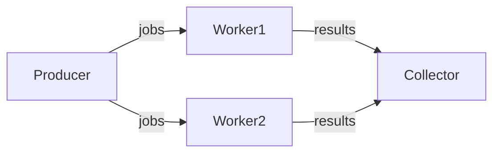
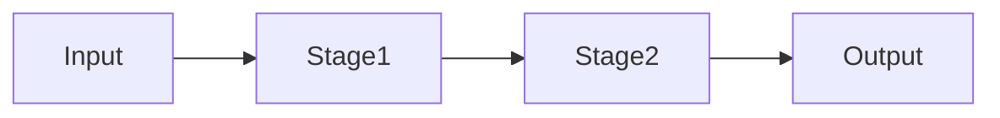

# Go并发与并行模式

## 1. Goroutine与Channel模式
### 定义
Go通过goroutine和channel实现轻量级并发。

### 工程案例
- 工作池、Fan-in/Fan-out、Pipeline
- 代码片段：
```go
func worker(jobs <-chan int, results chan<- int) { ... }
go worker(jobs, results)
```

### 图示


### 批判性分析
- 优点：极简语法，易用
- 局限：易出现泄漏、死锁，调试难

### 范畴论视角
- goroutine为对象，channel为态射

---

## 2. Pipeline流水线模式
### 定义
多阶段数据处理，每阶段独立goroutine，channel串联。

### 工程案例
- 日志处理、数据清洗
- 代码片段：
```go
func stage1(in <-chan int) <-chan int { ... }
func stage2(in <-chan int) <-chan int { ... }
```

### 图示


### 批判性分析
- 优点：天然并发，易扩展
- 局限：调试复杂，易阻塞

---

## 3. 生产者-消费者模式
### 工程案例
```go
jobs := make(chan int, 100)
results := make(chan int, 100)
for w := 1; w <= 3; w++ {
    go worker(w, jobs, results)
}
for j := 1; j <= 5; j++ {
    jobs <- j
}
close(jobs)
```

---

## 4. 并发安全与工程陷阱
### 典型问题
- goroutine泄漏、死锁、竞态条件
- sync.Mutex、atomic包

### 工程建议
- go test -race检测
- 优先channel，必要时用锁

### 批判性分析
- Go并发易用但隐性bug多，需结合工具链

### 范畴论视角
- 并发为过程范畴，goroutine为对象，channel为态射 