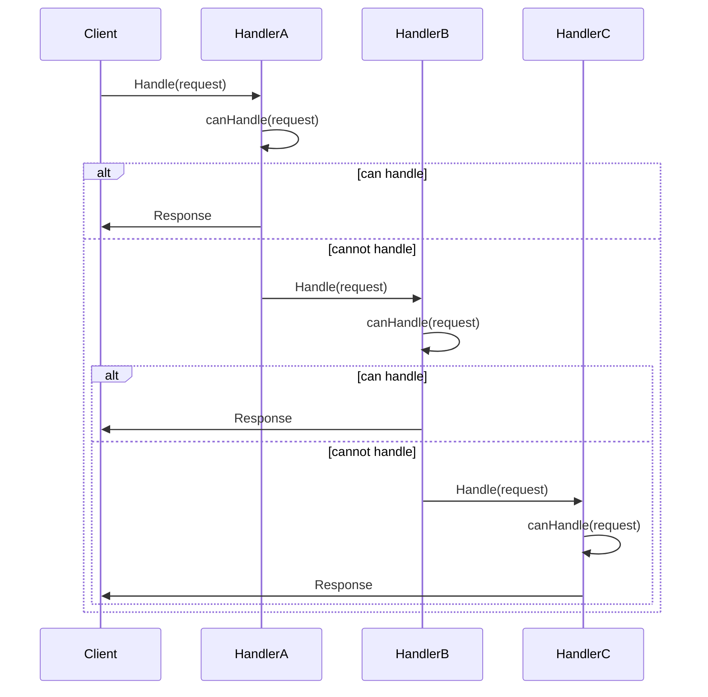
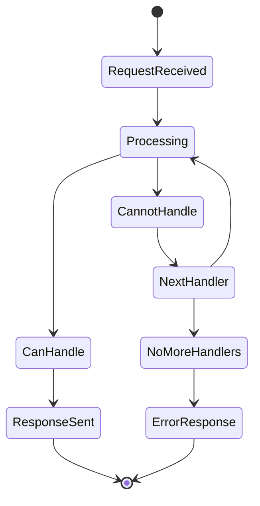

# 责任链模式 (Chain of Responsibility Pattern)

## 目录

1. [概述](#1-概述)
2. [形式化定义](#2-形式化定义)
3. [结构分析](#3-结构分析)
4. [Golang实现](#4-golang实现)
5. [性能分析](#5-性能分析)
6. [应用场景](#6-应用场景)
7. [最佳实践](#7-最佳实践)
8. [案例分析](#8-案例分析)

## 1. 概述

### 1.1 模式定义

责任链模式允许将请求沿着处理者链进行传递，直到有一个处理者处理它。在Golang中，责任链模式充分利用接口和组合特性，实现灵活的处理流程。

### 1.2 核心思想

- **解耦发送者和接收者**：发送者不需要知道具体由哪个处理者处理请求
- **动态组合处理链**：可以在运行时动态构建和修改处理链
- **单一职责**：每个处理者只负责处理自己能处理的请求
- **开闭原则**：新增处理者不需要修改现有代码

## 2. 形式化定义

### 2.1 数学定义

设 $H$ 为处理者集合，$R$ 为请求集合，$S$ 为响应集合，定义责任链系统：

$$\mathcal{C} = (H, R, S, \rightarrow, \phi, \psi)$$

其中：

- $\rightarrow \subseteq H \times H$ 为处理者链关系
- $\phi: H \times R \rightarrow \{true, false\}$ 为处理能力函数
- $\psi: H \times R \rightarrow S$ 为处理函数

### 2.2 处理链代数

定义处理链代数：

$$(H, \circ, \oplus, \preceq)$$

其中：

- $\circ$ 为链组合操作：$h_1 \circ h_2$ 表示 $h_1$ 后接 $h_2$
- $\oplus$ 为并行处理操作：$h_1 \oplus h_2$ 表示 $h_1$ 和 $h_2$ 并行处理
- $\preceq$ 为优先级关系：$h_1 \preceq h_2$ 表示 $h_1$ 优先级不高于 $h_2$

### 2.3 处理能力公理

**公理1（传递性）**：
$$\forall h_1, h_2, h_3 \in H: h_1 \rightarrow h_2 \land h_2 \rightarrow h_3 \Rightarrow h_1 \rightarrow h_3$$

**公理2（反自反性）**：
$$\forall h \in H: \neg(h \rightarrow h)$$

**公理3（处理能力）**：
$$\forall h \in H, r \in R: \phi(h, r) \Rightarrow \psi(h, r) \in S$$

### 2.4 处理链正确性

定义处理链的正确性：

$$\text{Correct}(\mathcal{C}) \iff \forall r \in R, \exists h \in H: \phi(h, r) \land \psi(h, r) \neq \bot$$

其中 $\bot$ 表示未处理状态。

## 3. 结构分析

### 3.1 UML类图

```mermaid
classDiagram
    class Handler {
        <<interface>>
        +SetNext(Handler)
        +Handle(Request) Response
    }
    
    class BaseHandler {
        -next Handler
        +SetNext(Handler)
        +Handle(Request) Response
        +HandleNext(Request) Response
    }
    
    class ConcreteHandlerA {
        +Handle(Request) Response
        -canHandle(Request) bool
    }
    
    class ConcreteHandlerB {
        +Handle(Request) Response
        -canHandle(Request) bool
    }
    
    class Request {
        +Type string
        +Data interface{}
        +Priority int
    }
    
    class Response {
        +Success bool
        +Data interface{}
        +Error error
    }
    
    Handler <|.. BaseHandler
    BaseHandler <|-- ConcreteHandlerA
    BaseHandler <|-- ConcreteHandlerB
    Handler --> Request
    Handler --> Response
```

### 3.2 时序图



### 3.3 状态转换图



## 4. Golang实现

### 4.1 核心接口设计

```go
// Handler 处理者接口
type Handler interface {
    Handle(request Request) Response
    SetNext(handler Handler)
    CanHandle(request Request) bool
}

// Request 请求结构
type Request struct {
    ID       string
    Type     string
    Data     interface{}
    Priority int
    Metadata map[string]interface{}
}

// Response 响应结构
type Response struct {
    Success bool
    Data    interface{}
    Error   error
    Handler string
}

// BaseHandler 基础处理者
type BaseHandler struct {
    next Handler
    name string
}

func (h *BaseHandler) SetNext(handler Handler) {
    h.next = handler
}

func (h *BaseHandler) HandleNext(request Request) Response {
    if h.next != nil {
        return h.next.Handle(request)
    }
    return Response{
        Success: false,
        Error:   fmt.Errorf("no handler available"),
    }
}
```

### 4.2 具体处理者实现

```go
// LoggingHandler 日志处理者
type LoggingHandler struct {
    BaseHandler
    logger *log.Logger
}

func NewLoggingHandler(logger *log.Logger) *LoggingHandler {
    return &LoggingHandler{
        BaseHandler: BaseHandler{name: "LoggingHandler"},
        logger:      logger,
    }
}

func (h *LoggingHandler) CanHandle(request Request) bool {
    return request.Type == "log" || request.Type == "debug"
}

func (h *LoggingHandler) Handle(request Request) Response {
    if !h.CanHandle(request) {
        return h.HandleNext(request)
    }
    
    h.logger.Printf("Processing request: %s", request.ID)
    
    // 处理逻辑
    result := fmt.Sprintf("Logged: %v", request.Data)
    
    return Response{
        Success: true,
        Data:    result,
        Handler: h.name,
    }
}

// ValidationHandler 验证处理者
type ValidationHandler struct {
    BaseHandler
    validators map[string]func(interface{}) error
}

func NewValidationHandler() *ValidationHandler {
    return &ValidationHandler{
        BaseHandler: BaseHandler{name: "ValidationHandler"},
        validators:  make(map[string]func(interface{}) error),
    }
}

func (h *ValidationHandler) AddValidator(dataType string, validator func(interface{}) error) {
    h.validators[dataType] = validator
}

func (h *ValidationHandler) CanHandle(request Request) bool {
    return request.Type == "validate"
}

func (h *ValidationHandler) Handle(request Request) Response {
    if !h.CanHandle(request) {
        return h.HandleNext(request)
    }
    
    // 获取数据类型
    dataType, ok := request.Metadata["dataType"].(string)
    if !ok {
        return Response{
            Success: false,
            Error:   fmt.Errorf("dataType not specified"),
            Handler: h.name,
        }
    }
    
    // 执行验证
    validator, exists := h.validators[dataType]
    if !exists {
        return Response{
            Success: false,
            Error:   fmt.Errorf("no validator for type: %s", dataType),
            Handler: h.name,
        }
    }
    
    if err := validator(request.Data); err != nil {
        return Response{
            Success: false,
            Error:   err,
            Handler: h.name,
        }
    }
    
    return Response{
        Success: true,
        Data:    "Validation passed",
        Handler: h.name,
    }
}

// ProcessingHandler 业务处理者
type ProcessingHandler struct {
    BaseHandler
    processors map[string]func(interface{}) (interface{}, error)
}

func NewProcessingHandler() *ProcessingHandler {
    return &ProcessingHandler{
        BaseHandler: BaseHandler{name: "ProcessingHandler"},
        processors:  make(map[string]func(interface{}) (interface{}, error)),
    }
}

func (h *ProcessingHandler) AddProcessor(operation string, processor func(interface{}) (interface{}, error)) {
    h.processors[operation] = processor
}

func (h *ProcessingHandler) CanHandle(request Request) bool {
    return request.Type == "process"
}

func (h *ProcessingHandler) Handle(request Request) Response {
    if !h.CanHandle(request) {
        return h.HandleNext(request)
    }
    
    operation, ok := request.Metadata["operation"].(string)
    if !ok {
        return Response{
            Success: false,
            Error:   fmt.Errorf("operation not specified"),
            Handler: h.name,
        }
    }
    
    processor, exists := h.processors[operation]
    if !exists {
        return Response{
            Success: false,
            Error:   fmt.Errorf("no processor for operation: %s", operation),
            Handler: h.name,
        }
    }
    
    result, err := processor(request.Data)
    if err != nil {
        return Response{
            Success: false,
            Error:   err,
            Handler: h.name,
        }
    }
    
    return Response{
        Success: true,
        Data:    result,
        Handler: h.name,
    }
}
```

### 4.3 并发安全实现

```go
// ConcurrentHandler 并发安全处理者
type ConcurrentHandler struct {
    BaseHandler
    mu       sync.RWMutex
    handlers map[string]Handler
}

func NewConcurrentHandler() *ConcurrentHandler {
    return &ConcurrentHandler{
        BaseHandler: BaseHandler{name: "ConcurrentHandler"},
        handlers:    make(map[string]Handler),
    }
}

func (h *ConcurrentHandler) AddHandler(name string, handler Handler) {
    h.mu.Lock()
    defer h.mu.Unlock()
    h.handlers[name] = handler
}

func (h *ConcurrentHandler) RemoveHandler(name string) {
    h.mu.Lock()
    defer h.mu.Unlock()
    delete(h.handlers, name)
}

func (h *ConcurrentHandler) CanHandle(request Request) bool {
    h.mu.RLock()
    defer h.mu.RUnlock()
    
    for _, handler := range h.handlers {
        if handler.CanHandle(request) {
            return true
        }
    }
    return false
}

func (h *ConcurrentHandler) Handle(request Request) Response {
    h.mu.RLock()
    defer h.mu.RUnlock()
    
    for _, handler := range h.handlers {
        if handler.CanHandle(request) {
            return handler.Handle(request)
        }
    }
    
    return h.HandleNext(request)
}
```

### 4.4 链构建器

```go
// ChainBuilder 链构建器
type ChainBuilder struct {
    handlers []Handler
}

func NewChainBuilder() *ChainBuilder {
    return &ChainBuilder{
        handlers: make([]Handler, 0),
    }
}

func (b *ChainBuilder) AddHandler(handler Handler) *ChainBuilder {
    b.handlers = append(b.handlers, handler)
    return b
}

func (b *ChainBuilder) Build() Handler {
    if len(b.handlers) == 0 {
        return nil
    }
    
    // 构建链
    for i := 0; i < len(b.handlers)-1; i++ {
        b.handlers[i].SetNext(b.handlers[i+1])
    }
    
    return b.handlers[0]
}

// 使用示例
func ExampleChainBuilder() {
    // 创建处理者
    logger := NewLoggingHandler(log.New(os.Stdout, "", log.LstdFlags))
    validator := NewValidationHandler()
    processor := NewProcessingHandler()
    
    // 添加验证器
    validator.AddValidator("string", func(data interface{}) error {
        if _, ok := data.(string); !ok {
            return fmt.Errorf("expected string, got %T", data)
        }
        return nil
    })
    
    // 添加处理器
    processor.AddProcessor("uppercase", func(data interface{}) (interface{}, error) {
        if str, ok := data.(string); ok {
            return strings.ToUpper(str), nil
        }
        return nil, fmt.Errorf("cannot process non-string data")
    })
    
    // 构建链
    chain := NewChainBuilder().
        AddHandler(logger).
        AddHandler(validator).
        AddHandler(processor).
        Build()
    
    // 使用链
    request := Request{
        ID:   "req-001",
        Type: "process",
        Data: "hello world",
        Metadata: map[string]interface{}{
            "dataType":  "string",
            "operation": "uppercase",
        },
    }
    
    response := chain.Handle(request)
    fmt.Printf("Response: %+v\n", response)
}
```

## 5. 性能分析

### 5.1 时间复杂度分析

#### 5.1.1 线性责任链

对于线性责任链，时间复杂度为：

$$T(n) = O(n)$$

其中 $n$ 为处理者数量。

**证明**：
- 最坏情况下，请求需要遍历所有处理者
- 每个处理者的处理时间为常数 $O(1)$
- 总时间复杂度为 $O(n)$

#### 5.1.2 树形责任链

对于平衡树形责任链，时间复杂度为：

$$T(n) = O(\log n)$$

其中 $n$ 为处理者数量。

**证明**：
- 平衡树的高度为 $\log n$
- 每个节点的处理时间为常数 $O(1)$
- 总时间复杂度为 $O(\log n)$

### 5.2 空间复杂度分析

#### 5.2.1 内存使用

空间复杂度为：

$$S(n) = O(n)$$

其中 $n$ 为处理者数量。

**分析**：
- 每个处理者占用常数空间
- 链关系占用 $O(n)$ 空间
- 总空间复杂度为 $O(n)$

#### 5.2.2 内存优化

```go
// 对象池优化
type HandlerPool struct {
    pool sync.Pool
}

func NewHandlerPool() *HandlerPool {
    return &HandlerPool{
        pool: sync.Pool{
            New: func() interface{} {
                return &BaseHandler{}
            },
        },
    }
}

func (p *HandlerPool) Get() *BaseHandler {
    return p.pool.Get().(*BaseHandler)
}

func (p *HandlerPool) Put(h *BaseHandler) {
    h.next = nil // 清理引用
    p.pool.Put(h)
}
```

### 5.3 并发性能分析

#### 5.3.1 吞吐量分析

定义吞吐量函数：

$$T(n, m) = \frac{n \cdot m}{t_{avg}}$$

其中：

- $n$ 为并发数
- $m$ 为请求数
- $t_{avg}$ 为平均处理时间

#### 5.3.2 延迟分析

定义延迟函数：

$$L(n) = t_{queue} + \sum_{i=1}^{n} t_{process_i} + t_{network}$$

其中：

- $t_{queue}$ 为队列等待时间
- $t_{process_i}$ 为第 $i$ 个处理者的处理时间
- $t_{network}$ 为网络传输时间

### 5.4 基准测试

```go
func BenchmarkChainOfResponsibility(b *testing.B) {
    // 创建处理链
    chain := createTestChain()
    
    request := Request{
        ID:   "benchmark",
        Type: "process",
        Data: "test data",
        Metadata: map[string]interface{}{
            "dataType":  "string",
            "operation": "uppercase",
        },
    }
    
    b.ResetTimer()
    for i := 0; i < b.N; i++ {
        chain.Handle(request)
    }
}

func BenchmarkConcurrentChain(b *testing.B) {
    chain := createTestChain()
    request := Request{
        ID:   "concurrent",
        Type: "process",
        Data: "test data",
        Metadata: map[string]interface{}{
            "dataType":  "string",
            "operation": "uppercase",
        },
    }
    
    b.ResetTimer()
    b.RunParallel(func(pb *testing.PB) {
        for pb.Next() {
            chain.Handle(request)
        }
    })
}
```

## 6. 应用场景

### 6.1 中间件系统

```go
// HTTP中间件链
type Middleware interface {
    Process(next http.Handler) http.Handler
}

type LoggingMiddleware struct{}

func (m *LoggingMiddleware) Process(next http.Handler) http.Handler {
    return http.HandlerFunc(func(w http.ResponseWriter, r *http.Request) {
        start := time.Now()
        next.ServeHTTP(w, r)
        log.Printf("Request processed in %v", time.Since(start))
    })
}

type AuthMiddleware struct{}

func (m *AuthMiddleware) Process(next http.Handler) http.Handler {
    return http.HandlerFunc(func(w http.ResponseWriter, r *http.Request) {
        if !isAuthenticated(r) {
            http.Error(w, "Unauthorized", http.StatusUnauthorized)
            return
        }
        next.ServeHTTP(w, r)
    })
}
```

### 6.2 审批流程

```go
// 审批处理者
type ApprovalHandler struct {
    BaseHandler
    minAmount float64
    maxAmount float64
    level     string
}

func (h *ApprovalHandler) CanHandle(request Request) bool {
    amount, ok := request.Data.(float64)
    if !ok {
        return false
    }
    return amount >= h.minAmount && amount <= h.maxAmount
}

func (h *ApprovalHandler) Handle(request Request) Response {
    if !h.CanHandle(request) {
        return h.HandleNext(request)
    }
    
    return Response{
        Success: true,
        Data:    fmt.Sprintf("Approved by %s", h.level),
        Handler: h.name,
    }
}
```

### 6.3 异常处理

```go
// 异常处理链
type ExceptionHandler struct {
    BaseHandler
    exceptionType reflect.Type
    handler       func(error) error
}

func (h *ExceptionHandler) CanHandle(request Request) bool {
    if err, ok := request.Data.(error); ok {
        return reflect.TypeOf(err) == h.exceptionType
    }
    return false
}

func (h *ExceptionHandler) Handle(request Request) Response {
    if !h.CanHandle(request) {
        return h.HandleNext(request)
    }
    
    err := request.Data.(error)
    handledErr := h.handler(err)
    
    return Response{
        Success: handledErr == nil,
        Error:   handledErr,
        Handler: h.name,
    }
}
```

## 7. 最佳实践

### 7.1 设计原则

1. **单一职责**：每个处理者只负责一种类型的请求
2. **开闭原则**：新增处理者不需要修改现有代码
3. **依赖倒置**：依赖抽象接口而非具体实现
4. **接口隔离**：使用小而精确的接口

### 7.2 实现建议

1. **使用接口**：定义清晰的Handler接口
2. **错误处理**：统一的错误处理机制
3. **并发安全**：考虑并发访问的安全性
4. **性能优化**：使用对象池、缓存等技术
5. **测试覆盖**：完整的单元测试

### 7.3 常见陷阱

1. **循环引用**：避免处理者之间的循环引用
2. **性能问题**：避免过长的处理链
3. **错误传播**：合理处理错误传播
4. **状态管理**：避免状态不一致

## 8. 案例分析

### 8.1 日志处理系统

```go
// 完整的日志处理系统示例
func LogProcessingSystem() {
    // 创建处理者
    consoleLogger := &ConsoleLogger{level: "INFO"}
    fileLogger := &FileLogger{level: "DEBUG", filename: "app.log"}
    errorLogger := &ErrorLogger{level: "ERROR"}
    
    // 构建链
    chain := NewChainBuilder().
        AddHandler(consoleLogger).
        AddHandler(fileLogger).
        AddHandler(errorLogger).
        Build()
    
    // 处理日志
    logs := []LogEntry{
        {Level: "INFO", Message: "Application started"},
        {Level: "DEBUG", Message: "Processing request"},
        {Level: "ERROR", Message: "Database connection failed"},
    }
    
    for _, log := range logs {
        request := Request{
            ID:   generateID(),
            Type: "log",
            Data: log,
        }
        chain.Handle(request)
    }
}
```

### 8.2 数据验证系统

```go
// 数据验证系统
func DataValidationSystem() {
    // 创建验证器
    stringValidator := &StringValidator{}
    numberValidator := &NumberValidator{}
    emailValidator := &EmailValidator{}
    
    // 构建验证链
    chain := NewChainBuilder().
        AddHandler(stringValidator).
        AddHandler(numberValidator).
        AddHandler(emailValidator).
        Build()
    
    // 验证数据
    data := []interface{}{
        "hello world",
        42,
        "invalid-email",
        "user@example.com",
    }
    
    for _, item := range data {
        request := Request{
            ID:   generateID(),
            Type: "validate",
            Data: item,
        }
        response := chain.Handle(request)
        fmt.Printf("Validation result: %+v\n", response)
    }
}
```

---

**参考文献**：

1. Gamma, E., Helm, R., Johnson, R., & Vlissides, J. (1994). Design Patterns: Elements of Reusable Object-Oriented Software
2. Go Language Specification. https://golang.org/ref/spec
3. Go Concurrency Patterns. https://golang.org/doc/effective_go.html#concurrency
4. Effective Go. https://golang.org/doc/effective_go.html 