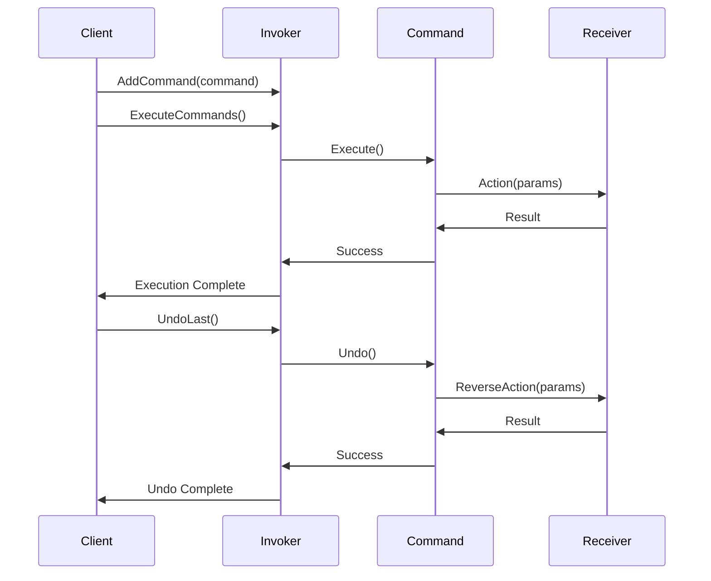
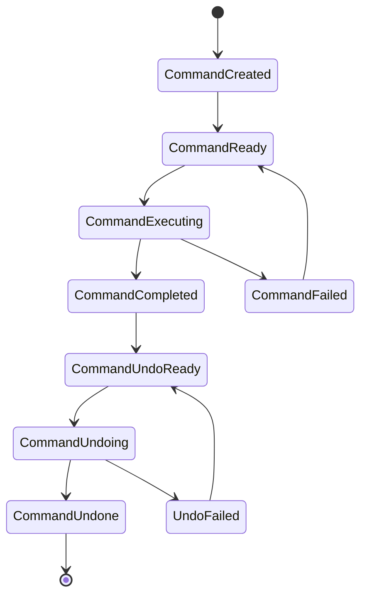

# 3.3.1 命令模式 (Command Pattern)

## 3.3.1.1 目录

## 3.3.1.2 1. 概述

### 3.3.1.2.1 模式定义

命令模式将请求封装成对象，从而可以用不同的请求对客户进行参数化，对请求排队或记录请求日志，以及支持可撤销的操作。在Golang中，命令模式充分利用接口和函数式编程特性。

### 3.3.1.2.2 核心思想

- **封装请求**：将请求封装成独立的对象
- **参数化**：可以用不同的命令对象参数化客户端
- **队列化**：支持请求的排队和执行
- **可撤销**：支持操作的撤销和重做
- **解耦**：发送者和接收者解耦

## 3.3.1.3 2. 形式化定义

### 3.3.1.3.1 数学定义

设 $C$ 为命令集合，$R$ 为接收者集合，$I$ 为调用者集合，定义命令系统：

$$\mathcal{C} = (C, R, I, \rightarrow, \phi, \psi, \theta)$$

其中：

- $\rightarrow \subseteq I \times C$ 为调用关系
- $\phi: C \times R \rightarrow \{true, false\}$ 为执行能力函数
- $\psi: C \times R \rightarrow R$ 为执行函数
- $\theta: C \rightarrow C$ 为撤销函数

### 3.3.1.3.2 命令代数

定义命令代数：

$$(C, \circ, \oplus, \otimes, \preceq)$$

其中：

- $\circ$ 为命令组合：$c_1 \circ c_2$ 表示先执行 $c_1$ 再执行 $c_2$
- $\oplus$ 为命令选择：$c_1 \oplus c_2$ 表示选择执行 $c_1$ 或 $c_2$
- $\otimes$ 为命令变换：$c_1 \otimes c_2$ 表示将 $c_2$ 应用到 $c_1$
- $\preceq$ 为优先级关系：$c_1 \preceq c_2$ 表示 $c_1$ 优先级不高于 $c_2$

### 3.3.1.3.3 命令执行公理

**公理1（执行一致性）**：
$$\forall c \in C, r \in R: \phi(c, r) \Rightarrow \psi(c, r) \in R$$

**公理2（撤销一致性）**：
$$\forall c \in C: \theta(\theta(c)) = c$$

**公理3（组合结合性）**：
$$\forall c_1, c_2, c_3 \in C: (c_1 \circ c_2) \circ c_3 = c_1 \circ (c_2 \circ c_3)$$

### 3.3.1.3.4 命令队列系统

定义命令队列系统：

$$\mathcal{Q} = (Q, C, \text{enqueue}, \text{dequeue}, \text{execute})$$

其中：

- $Q$ 为队列集合
- $\text{enqueue}: Q \times C \rightarrow Q$ 为入队操作
- $\text{dequeue}: Q \rightarrow Q \times C$ 为出队操作
- $\text{execute}: C \times R \rightarrow R$ 为执行操作

## 3.3.1.4 3. 结构分析

### 3.3.1.4.1 UML类图

```mermaid
classDiagram
    class Command {
        <<interface>>
        +Execute() error
        +Undo() error
        +CanExecute() bool
    }
    
    class ConcreteCommand {
        -receiver Receiver
        -params map[string]interface{}
        +Execute() error
        +Undo() error
        +CanExecute() bool
    }
    
    class Invoker {
        -commands []Command
        -history []Command
        +AddCommand(Command)
        +ExecuteCommands() error
        +UndoLast() error
    }
    
    class Receiver {
        <<interface>>
        +Action(params map[string]interface{}) error
        +ReverseAction(params map[string]interface{}) error
    }
    
    class ConcreteReceiver {
        +Action(params map[string]interface{}) error
        +ReverseAction(params map[string]interface{}) error
    }
    
    class Client {
        +CreateCommand() Command
        +SetReceiver(Receiver)
    }
    
    Command <|.. ConcreteCommand
    ConcreteCommand --> Receiver
    Receiver <|.. ConcreteReceiver
    Invoker --> Command
    Client --> Command
    Client --> Receiver

```

### 3.3.1.4.2 时序图



### 3.3.1.4.3 状态转换图



## 3.3.1.5 4. Golang实现

### 3.3.1.5.1 核心接口设计

```go
// Command 命令接口
type Command interface {
    Execute() error
    Undo() error
    CanExecute() bool
    GetID() string
    GetTimestamp() time.Time
}

// Receiver 接收者接口
type Receiver interface {
    Action(params map[string]interface{}) error
    ReverseAction(params map[string]interface{}) error
    CanHandle(action string) bool
}

// Invoker 调用者接口
type Invoker interface {
    AddCommand(command Command) error
    ExecuteCommands() error
    UndoLast() error
    GetHistory() []Command
    ClearHistory()
}

// CommandResult 命令执行结果
type CommandResult struct {
    CommandID string
    Success   bool
    Error     error
    Timestamp time.Time
    Duration  time.Duration
}

```

### 3.3.1.5.2 基础命令实现

```go
// BaseCommand 基础命令
type BaseCommand struct {
    id        string
    timestamp time.Time
    receiver  Receiver
    params    map[string]interface{}
}

func NewBaseCommand(receiver Receiver, params map[string]interface{}) *BaseCommand {
    return &BaseCommand{
        id:        generateID(),
        timestamp: time.Now(),
        receiver:  receiver,
        params:    params,
    }
}

func (c *BaseCommand) GetID() string {
    return c.id
}

func (c *BaseCommand) GetTimestamp() time.Time {
    return c.timestamp
}

func (c *BaseCommand) CanExecute() bool {
    return c.receiver != nil
}

// ConcreteCommand 具体命令
type ConcreteCommand struct {
    BaseCommand
    action string
}

func NewConcreteCommand(receiver Receiver, action string, params map[string]interface{}) *ConcreteCommand {
    return &ConcreteCommand{
        BaseCommand: *NewBaseCommand(receiver, params),
        action:      action,
    }
}

func (c *ConcreteCommand) Execute() error {
    if !c.CanExecute() {
        return fmt.Errorf("command cannot be executed")
    }
    
    if !c.receiver.CanHandle(c.action) {
        return fmt.Errorf("receiver cannot handle action: %s", c.action)
    }
    
    return c.receiver.Action(c.params)
}

func (c *ConcreteCommand) Undo() error {
    if !c.CanExecute() {
        return fmt.Errorf("command cannot be undone")
    }
    
    return c.receiver.ReverseAction(c.params)
}

```

### 3.3.1.5.3 复合命令实现

```go
// CompositeCommand 复合命令
type CompositeCommand struct {
    BaseCommand
    commands []Command
}

func NewCompositeCommand(commands ...Command) *CompositeCommand {
    return &CompositeCommand{
        BaseCommand: *NewBaseCommand(nil, nil),
        commands:    commands,
    }
}

func (c *CompositeCommand) AddCommand(command Command) {
    c.commands = append(c.commands, command)
}

func (c *CompositeCommand) Execute() error {
    for _, cmd := range c.commands {
        if err := cmd.Execute(); err != nil {
            return fmt.Errorf("composite command failed: %w", err)
        }
    }
    return nil
}

func (c *CompositeCommand) Undo() error {
    // 逆序执行撤销
    for i := len(c.commands) - 1; i >= 0; i-- {
        if err := c.commands[i].Undo(); err != nil {
            return fmt.Errorf("composite undo failed: %w", err)
        }
    }
    return nil
}

func (c *CompositeCommand) CanExecute() bool {
    for _, cmd := range c.commands {
        if !cmd.CanExecute() {
            return false
        }
    }
    return true
}

// MacroCommand 宏命令
type MacroCommand struct {
    CompositeCommand
    name string
}

func NewMacroCommand(name string, commands ...Command) *MacroCommand {
    return &MacroCommand{
        CompositeCommand: *NewCompositeCommand(commands...),
        name:             name,
    }
}

func (m *MacroCommand) GetName() string {
    return m.name
}

```

### 3.3.1.5.4 调用者实现

```go
// CommandInvoker 命令调用者
type CommandInvoker struct {
    commands []Command
    history  []Command
    mu       sync.RWMutex
    maxSize  int
}

func NewCommandInvoker(maxSize int) *CommandInvoker {
    return &CommandInvoker{
        commands: make([]Command, 0),
        history:  make([]Command, 0),
        maxSize:  maxSize,
    }
}

func (i *CommandInvoker) AddCommand(command Command) error {
    i.mu.Lock()
    defer i.mu.Unlock()
    
    if !command.CanExecute() {
        return fmt.Errorf("command cannot be executed")
    }
    
    i.commands = append(i.commands, command)
    
    // 限制队列大小
    if len(i.commands) > i.maxSize {
        i.commands = i.commands[1:]
    }
    
    return nil
}

func (i *CommandInvoker) ExecuteCommands() error {
    i.mu.Lock()
    defer i.mu.Unlock()
    
    var results []CommandResult
    
    for _, command := range i.commands {
        start := time.Now()
        err := command.Execute()
        duration := time.Since(start)
        
        result := CommandResult{
            CommandID: command.GetID(),
            Success:   err == nil,
            Error:     err,
            Timestamp: time.Now(),
            Duration:  duration,
        }
        
        results = append(results, result)
        
        if err == nil {
            i.history = append(i.history, command)
        }
    }
    
    // 清空命令队列
    i.commands = make([]Command, 0)
    
    // 记录执行结果
    i.logResults(results)
    
    return nil
}

func (i *CommandInvoker) UndoLast() error {
    i.mu.Lock()
    defer i.mu.Unlock()
    
    if len(i.history) == 0 {
        return fmt.Errorf("no commands to undo")
    }
    
    lastCommand := i.history[len(i.history)-1]
    i.history = i.history[:len(i.history)-1]
    
    return lastCommand.Undo()
}

func (i *CommandInvoker) GetHistory() []Command {
    i.mu.RLock()
    defer i.mu.RUnlock()
    
    result := make([]Command, len(i.history))
    copy(result, i.history)
    return result
}

func (i *CommandInvoker) ClearHistory() {
    i.mu.Lock()
    defer i.mu.Unlock()
    i.history = make([]Command, 0)
}

func (i *CommandInvoker) logResults(results []CommandResult) {
    for _, result := range results {
        if result.Success {
            log.Printf("Command %s executed successfully in %v", result.CommandID, result.Duration)
        } else {
            log.Printf("Command %s failed: %v", result.CommandID, result.Error)
        }
    }
}

```

### 3.3.1.5.5 异步命令实现

```go
// AsyncCommand 异步命令
type AsyncCommand struct {
    BaseCommand
    result chan CommandResult
    done   chan struct{}
}

func NewAsyncCommand(receiver Receiver, params map[string]interface{}) *AsyncCommand {
    return &AsyncCommand{
        BaseCommand: *NewBaseCommand(receiver, params),
        result:      make(chan CommandResult, 1),
        done:        make(chan struct{}),
    }
}

func (c *AsyncCommand) Execute() error {
    go func() {
        start := time.Now()
        err := c.receiver.Action(c.params)
        duration := time.Since(start)
        
        result := CommandResult{
            CommandID: c.GetID(),
            Success:   err == nil,
            Error:     err,
            Timestamp: time.Now(),
            Duration:  duration,
        }
        
        select {
        case c.result <- result:
        case <-c.done:
        }
    }()
    
    return nil
}

func (c *AsyncCommand) GetResult() CommandResult {
    select {
    case result := <-c.result:
        return result
    case <-time.After(30 * time.Second):
        return CommandResult{
            CommandID: c.GetID(),
            Success:   false,
            Error:     fmt.Errorf("command execution timeout"),
            Timestamp: time.Now(),
        }
    }
}

func (c *AsyncCommand) Cancel() {
    close(c.done)
}

```

### 3.3.1.5.6 具体接收者实现

```go
// FileReceiver 文件操作接收者
type FileReceiver struct {
    basePath string
    mu       sync.RWMutex
}

func NewFileReceiver(basePath string) *FileReceiver {
    return &FileReceiver{
        basePath: basePath,
    }
}

func (r *FileReceiver) CanHandle(action string) bool {
    switch action {
    case "create", "delete", "move", "copy":
        return true
    default:
        return false
    }
}

func (r *FileReceiver) Action(params map[string]interface{}) error {
    action, ok := params["action"].(string)
    if !ok {
        return fmt.Errorf("action parameter required")
    }
    
    switch action {
    case "create":
        return r.createFile(params)
    case "delete":
        return r.deleteFile(params)
    case "move":
        return r.moveFile(params)
    case "copy":
        return r.copyFile(params)
    default:
        return fmt.Errorf("unsupported action: %s", action)
    }
}

func (r *FileReceiver) ReverseAction(params map[string]interface{}) error {
    action, ok := params["action"].(string)
    if !ok {
        return fmt.Errorf("action parameter required")
    }
    
    switch action {
    case "create":
        return r.deleteFile(params)
    case "delete":
        return r.createFile(params)
    case "move":
        return r.moveFileBack(params)
    case "copy":
        return r.deleteFile(params)
    default:
        return fmt.Errorf("unsupported reverse action: %s", action)
    }
}

func (r *FileReceiver) createFile(params map[string]interface{}) error {
    filename, ok := params["filename"].(string)
    if !ok {
        return fmt.Errorf("filename parameter required")
    }
    
    content, _ := params["content"].(string)
    
    filepath := filepath.Join(r.basePath, filename)
    return os.WriteFile(filepath, []byte(content), 0644)
}

func (r *FileReceiver) deleteFile(params map[string]interface{}) error {
    filename, ok := params["filename"].(string)
    if !ok {
        return fmt.Errorf("filename parameter required")
    }
    
    filepath := filepath.Join(r.basePath, filename)
    return os.Remove(filepath)
}

func (r *FileReceiver) moveFile(params map[string]interface{}) error {
    source, ok := params["source"].(string)
    if !ok {
        return fmt.Errorf("source parameter required")
    }
    
    destination, ok := params["destination"].(string)
    if !ok {
        return fmt.Errorf("destination parameter required")
    }
    
    sourcePath := filepath.Join(r.basePath, source)
    destPath := filepath.Join(r.basePath, destination)
    
    return os.Rename(sourcePath, destPath)
}

func (r *FileReceiver) moveFileBack(params map[string]interface{}) error {
    // 交换源和目标
    source := params["destination"].(string)
    destination := params["source"].(string)
    
    params["source"] = source
    params["destination"] = destination
    
    return r.moveFile(params)
}

func (r *FileReceiver) copyFile(params map[string]interface{}) error {
    source, ok := params["source"].(string)
    if !ok {
        return fmt.Errorf("source parameter required")
    }
    
    destination, ok := params["destination"].(string)
    if !ok {
        return fmt.Errorf("destination parameter required")
    }
    
    sourcePath := filepath.Join(r.basePath, source)
    destPath := filepath.Join(r.basePath, destination)
    
    sourceFile, err := os.Open(sourcePath)
    if err != nil {
        return err
    }
    defer sourceFile.Close()
    
    destFile, err := os.Create(destPath)
    if err != nil {
        return err
    }
    defer destFile.Close()
    
    _, err = io.Copy(destFile, sourceFile)
    return err
}

```

## 3.3.1.6 5. 性能分析

### 3.3.1.6.1 时间复杂度分析

#### 3.3.1.6.1.1 命令执行

单个命令执行的时间复杂度：

$$T(n) = O(1)$$

其中 $n$ 为命令参数数量。

**证明**：

- 命令执行主要涉及参数传递和接收者调用
- 参数数量通常为常数
- 接收者操作复杂度为 $O(1)$

#### 3.3.1.6.1.2 命令队列

命令队列执行的时间复杂度：

$$T(n) = O(n)$$

其中 $n$ 为队列中的命令数量。

**证明**：

- 需要遍历所有命令
- 每个命令执行时间为 $O(1)$
- 总时间复杂度为 $O(n)$

#### 3.3.1.6.1.3 复合命令

复合命令执行的时间复杂度：

$$T(n) = O(n)$$

其中 $n$ 为复合命令中的子命令数量。

**证明**：

- 需要执行所有子命令
- 每个子命令执行时间为 $O(1)$
- 总时间复杂度为 $O(n)$

### 3.3.1.6.2 空间复杂度分析

#### 3.3.1.6.2.1 内存使用

空间复杂度为：

$$S(n) = O(n)$$

其中 $n$ 为命令数量。

**分析**：

- 每个命令占用常数空间
- 命令队列占用 $O(n)$ 空间
- 历史记录占用 $O(n)$ 空间

#### 3.3.1.6.2.2 内存优化

```go
// 命令池优化
type CommandPool struct {
    pool sync.Pool
}

func NewCommandPool() *CommandPool {
    return &CommandPool{
        pool: sync.Pool{
            New: func() interface{} {
                return &BaseCommand{}
            },
        },
    }
}

func (p *CommandPool) Get() *BaseCommand {
    return p.pool.Get().(*BaseCommand)
}

func (p *CommandPool) Put(cmd *BaseCommand) {
    cmd.receiver = nil
    cmd.params = nil
    p.pool.Put(cmd)
}

```

### 3.3.1.6.3 并发性能分析

#### 3.3.1.6.3.1 并发执行

定义并发执行函数：

$$C(n, m) = \frac{n \cdot m}{t_{avg}}$$

其中：

- $n$ 为并发数
- $m$ 为命令数
- $t_{avg}$ 为平均执行时间

#### 3.3.1.6.3.2 队列性能

定义队列性能函数：

$$Q(n) = t_{enqueue} + t_{dequeue} + t_{execute}$$

其中：

- $t_{enqueue}$ 为入队时间
- $t_{dequeue}$ 为出队时间
- $t_{execute}$ 为执行时间

### 3.3.1.6.4 基准测试

```go
func BenchmarkCommandExecution(b *testing.B) {
    receiver := NewFileReceiver("/tmp")
    command := NewConcreteCommand(receiver, "create", map[string]interface{}{
        "filename": "test.txt",
        "content":  "test content",
    })
    
    b.ResetTimer()
    for i := 0; i < b.N; i++ {
        command.Execute()
        command.Undo()
    }
}

func BenchmarkCommandQueue(b *testing.B) {
    invoker := NewCommandInvoker(1000)
    receiver := NewFileReceiver("/tmp")
    
    for i := 0; i < 100; i++ {
        command := NewConcreteCommand(receiver, "create", map[string]interface{}{
            "filename": fmt.Sprintf("test%d.txt", i),
            "content":  "test content",
        })
        invoker.AddCommand(command)
    }
    
    b.ResetTimer()
    for i := 0; i < b.N; i++ {
        invoker.ExecuteCommands()
    }
}

func BenchmarkAsyncCommand(b *testing.B) {
    receiver := NewFileReceiver("/tmp")
    
    b.ResetTimer()
    b.RunParallel(func(pb *testing.PB) {
        for pb.Next() {
            command := NewAsyncCommand(receiver, map[string]interface{}{
                "action":   "create",
                "filename": "test.txt",
                "content":  "test content",
            })
            command.Execute()
            command.GetResult()
        }
    })
}

```

## 3.3.1.7 6. 应用场景

### 3.3.1.7.1 文本编辑器

```go
// 文本编辑命令
type TextEditCommand struct {
    BaseCommand
    text     string
    position int
    oldText  string
}

func NewTextEditCommand(receiver Receiver, text string, position int) *TextEditCommand {
    return &TextEditCommand{
        BaseCommand: *NewBaseCommand(receiver, map[string]interface{}{
            "action": "edit",
            "text":   text,
            "pos":    position,
        }),
        text:     text,
        position: position,
    }
}

func (c *TextEditCommand) Execute() error {
    // 保存旧文本用于撤销
    c.oldText = c.getTextAtPosition()
    
    return c.receiver.Action(c.params)
}

func (c *TextEditCommand) Undo() error {
    // 恢复旧文本
    c.params["text"] = c.oldText
    return c.receiver.ReverseAction(c.params)
}

func (c *TextEditCommand) getTextAtPosition() string {
    // 获取指定位置的文本
    return ""
}

```

### 3.3.1.7.2 数据库事务

```go
// 数据库命令
type DatabaseCommand struct {
    BaseCommand
    sql      string
    params   []interface{}
    rollback string
}

func NewDatabaseCommand(receiver Receiver, sql string, params []interface{}) *DatabaseCommand {
    return &DatabaseCommand{
        BaseCommand: *NewBaseCommand(receiver, map[string]interface{}{
            "action": "execute",
            "sql":    sql,
            "params": params,
        }),
        sql:    sql,
        params: params,
    }
}

func (c *DatabaseCommand) Execute() error {
    // 生成回滚SQL
    c.rollback = c.generateRollbackSQL()
    
    return c.receiver.Action(c.params)
}

func (c *DatabaseCommand) Undo() error {
    // 执行回滚
    c.params["sql"] = c.rollback
    return c.receiver.Action(c.params)
}

func (c *DatabaseCommand) generateRollbackSQL() string {
    // 根据SQL类型生成回滚语句
    return ""
}

```

### 3.3.1.7.3 网络请求

```go
// HTTP请求命令
type HTTPCommand struct {
    BaseCommand
    method   string
    url      string
    headers  map[string]string
    body     []byte
    response *http.Response
}

func NewHTTPCommand(receiver Receiver, method, url string, headers map[string]string, body []byte) *HTTPCommand {
    return &HTTPCommand{
        BaseCommand: *NewBaseCommand(receiver, map[string]interface{}{
            "action":  "request",
            "method":  method,
            "url":     url,
            "headers": headers,
            "body":    body,
        }),
        method:  method,
        url:     url,
        headers: headers,
        body:    body,
    }
}

func (c *HTTPCommand) Execute() error {
    return c.receiver.Action(c.params)
}

func (c *HTTPCommand) Undo() error {
    // HTTP请求通常不可撤销，但可以记录日志
    return fmt.Errorf("HTTP requests cannot be undone")
}

```

## 3.3.1.8 7. 最佳实践

### 3.3.1.8.1 设计原则

1. **单一职责**：每个命令只负责一个操作
2. **开闭原则**：新增命令不需要修改现有代码
3. **依赖倒置**：依赖抽象接口而非具体实现
4. **接口隔离**：使用小而精确的接口

### 3.3.1.8.2 实现建议

1. **使用接口**：定义清晰的Command接口
2. **错误处理**：统一的错误处理机制
3. **并发安全**：考虑并发访问的安全性
4. **性能优化**：使用对象池、缓存等技术
5. **测试覆盖**：完整的单元测试

### 3.3.1.8.3 常见陷阱

1. **内存泄漏**：避免命令对象的内存泄漏
2. **性能问题**：避免过长的命令队列
3. **状态管理**：避免状态不一致
4. **错误传播**：合理处理错误传播

## 3.3.1.9 8. 案例分析

### 3.3.1.9.1 完整的文本编辑器

```go
// 文本编辑器示例
func TextEditorExample() {
    // 创建接收者
    editor := NewTextEditor()
    
    // 创建调用者
    invoker := NewCommandInvoker(100)
    
    // 创建命令
    commands := []Command{
        NewTextEditCommand(editor, "Hello", 0),
        NewTextEditCommand(editor, " World", 5),
        NewTextEditCommand(editor, "!", 11),
    }
    
    // 添加命令到调用者
    for _, cmd := range commands {
        invoker.AddCommand(cmd)
    }
    
    // 执行命令
    if err := invoker.ExecuteCommands(); err != nil {
        log.Printf("Execution failed: %v", err)
        return
    }
    
    fmt.Printf("Text: %s\n", editor.GetText())
    
    // 撤销操作
    if err := invoker.UndoLast(); err != nil {
        log.Printf("Undo failed: %v", err)
        return
    }
    
    fmt.Printf("After undo: %s\n", editor.GetText())
}

// TextEditor 文本编辑器
type TextEditor struct {
    text string
    mu   sync.RWMutex
}

func NewTextEditor() *TextEditor {
    return &TextEditor{
        text: "",
    }
}

func (e *TextEditor) CanHandle(action string) bool {
    return action == "edit"
}

func (e *TextEditor) Action(params map[string]interface{}) error {
    e.mu.Lock()
    defer e.mu.Unlock()
    
    text, ok := params["text"].(string)
    if !ok {
        return fmt.Errorf("text parameter required")
    }
    
    position, ok := params["pos"].(int)
    if !ok {
        return fmt.Errorf("position parameter required")
    }
    
    if position > len(e.text) {
        position = len(e.text)
    }
    
    e.text = e.text[:position] + text + e.text[position:]
    return nil
}

func (e *TextEditor) ReverseAction(params map[string]interface{}) error {
    e.mu.Lock()
    defer e.mu.Unlock()
    
    text, ok := params["text"].(string)
    if !ok {
        return fmt.Errorf("text parameter required")
    }
    
    position, ok := params["pos"].(int)
    if !ok {
        return fmt.Errorf("position parameter required")
    }
    
    if position+len(text) > len(e.text) {
        return fmt.Errorf("invalid position for reverse action")
    }
    
    e.text = e.text[:position] + e.text[position+len(text):]
    return nil
}

func (e *TextEditor) GetText() string {
    e.mu.RLock()
    defer e.mu.RUnlock()
    return e.text
}

```

### 3.3.1.9.2 文件操作管理器

```go
// 文件操作管理器示例
func FileManagerExample() {
    // 创建接收者
    fileManager := NewFileReceiver("/tmp")
    
    // 创建调用者
    invoker := NewCommandInvoker(50)
    
    // 创建复合命令
    setupCommands := NewMacroCommand("setup", 
        NewConcreteCommand(fileManager, "create", map[string]interface{}{
            "filename": "config.txt",
            "content":  "server=localhost\nport=8080",
        }),
        NewConcreteCommand(fileManager, "create", map[string]interface{}{
            "filename": "data.txt",
            "content":  "initial data",
        }),
    )
    
    // 添加命令
    invoker.AddCommand(setupCommands)
    
    // 执行命令
    if err := invoker.ExecuteCommands(); err != nil {
        log.Printf("Setup failed: %v", err)
        return
    }
    
    fmt.Println("Setup completed successfully")
    
    // 撤销整个设置
    if err := invoker.UndoLast(); err != nil {
        log.Printf("Undo failed: %v", err)
        return
    }
    
    fmt.Println("Setup undone successfully")
}

```

---

**参考文献**：

1. Gamma, E., Helm, R., Johnson, R., & Vlissides, J. (1994). Design Patterns: Elements of Reusable Object-Oriented Software
2. Go Language Specification. <https://golang.org/ref/spec>
3. Go Concurrency Patterns. <https://golang.org/doc/effective_go.html#concurrency>
4. Effective Go. <https://golang.org/doc/effective_go.html>
