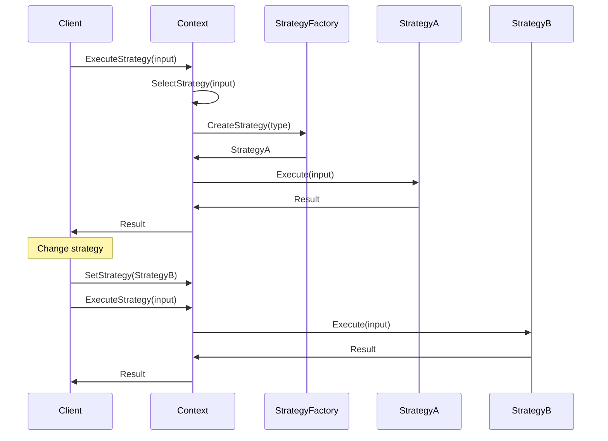
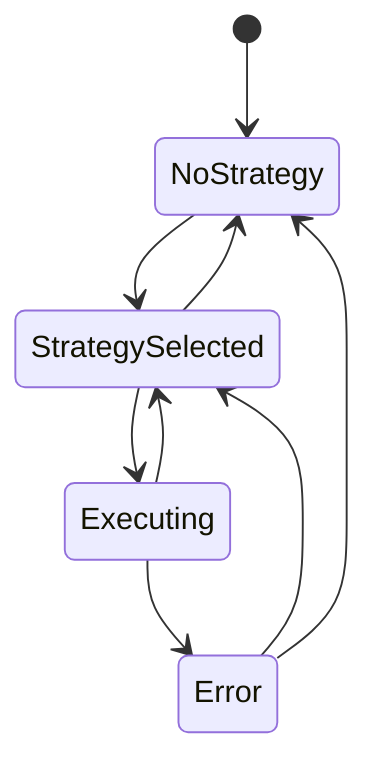

# 策略模式 (Strategy Pattern)

## 目录

1. [概述](#1-概述)
2. [形式化定义](#2-形式化定义)
3. [结构分析](#3-结构分析)
4. [Golang实现](#4-golang实现)
5. [性能分析](#5-性能分析)
6. [应用场景](#6-应用场景)
7. [最佳实践](#7-最佳实践)
8. [案例分析](#8-案例分析)

## 1. 概述

### 1.1 模式定义

策略模式定义了一系列算法，并将每一个算法封装起来，使它们可以互相替换。策略模式让算法的变化不会影响到使用算法的客户。在Golang中，策略模式充分利用接口和函数式编程特性，实现灵活的策略选择机制。

### 1.2 核心思想

- **算法封装**：将算法封装在独立的策略类中
- **策略切换**：运行时可以动态切换策略
- **开闭原则**：新增策略不需要修改现有代码
- **单一职责**：每个策略只负责一种算法
- **依赖倒置**：依赖抽象策略而非具体实现

## 2. 形式化定义

### 2.1 数学定义

设 $S$ 为策略集合，$C$ 为上下文集合，$I$ 为输入集合，$O$ 为输出集合，定义策略系统：

$$\mathcal{S} = (S, C, I, O, \phi, \psi, \theta)$$

其中：

- $\phi: C \times S \rightarrow \{true, false\}$ 为策略适用性函数
- $\psi: S \times I \rightarrow O$ 为策略执行函数
- $\theta: C \times S \rightarrow C$ 为策略设置函数

### 2.2 策略代数

定义策略代数：

$$(S, \oplus, \otimes, \circ, \preceq)$$

其中：

- $\oplus$ 为策略组合：$s_1 \oplus s_2$ 表示策略组合
- $\otimes$ 为策略变换：$s_1 \otimes s_2$ 表示策略变换
- $\circ$ 为策略应用：$s_1 \circ s_2$ 表示策略应用
- $\preceq$ 为优先级关系：$s_1 \preceq s_2$ 表示 $s_1$ 优先级不高于 $s_2$

### 2.3 策略执行公理

**公理1（策略一致性）**：
$$\forall s \in S, i \in I: \psi(s, i) \in O$$

**公理2（策略组合性）**：
$$\forall s_1, s_2 \in S, i \in I: \psi(s_1 \oplus s_2, i) = \psi(s_1, \psi(s_2, i))$$

**公理3（策略交换性）**：
$$\forall s_1, s_2 \in S: s_1 \oplus s_2 = s_2 \oplus s_1$$

### 2.4 策略选择系统

定义策略选择系统：

$$\mathcal{C} = (C, S, \text{select}, \text{execute}, \text{evaluate})$$

其中：

- $\text{select}: C \times I \rightarrow S$ 为策略选择函数
- $\text{execute}: C \times I \rightarrow O$ 为策略执行函数
- $\text{evaluate}: S \times I \times O \rightarrow \mathbb{R}$ 为策略评估函数

## 3. 结构分析

### 3.1 UML类图

```mermaid
classDiagram
    class Strategy {
        <<interface>>
        +Execute(input interface{}) interface{}
        +GetName() string
        +CanHandle(input interface{}) bool
    }
    
    class ConcreteStrategyA {
        +Execute(input interface{}) interface{}
        +GetName() string
        +CanHandle(input interface{}) bool
    }
    
    class ConcreteStrategyB {
        +Execute(input interface{}) interface{}
        +GetName() string
        +CanHandle(input interface{}) bool
    }
    
    class Context {
        -strategy Strategy
        -strategies map[string]Strategy
        +SetStrategy(Strategy)
        +ExecuteStrategy(input interface{}) interface{}
        +AddStrategy(Strategy)
        +SelectStrategy(input interface{}) Strategy
    }
    
    class StrategyFactory {
        +CreateStrategy(type string) Strategy
        +RegisterStrategy(type string, Strategy)
        +GetAvailableStrategies() []string
    }
    
    Strategy <|.. ConcreteStrategyA
    Strategy <|.. ConcreteStrategyB
    Context --> Strategy
    StrategyFactory --> Strategy
    Context --> StrategyFactory
```

### 3.2 时序图



### 3.3 状态转换图



## 4. Golang实现

### 4.1 核心接口设计

```go
// Strategy 策略接口
type Strategy interface {
    Execute(input interface{}) (interface{}, error)
    GetName() string
    CanHandle(input interface{}) bool
    GetPriority() int
}

// Context 上下文接口
type Context interface {
    SetStrategy(strategy Strategy) error
    ExecuteStrategy(input interface{}) (interface{}, error)
    AddStrategy(strategy Strategy) error
    SelectStrategy(input interface{}) Strategy
    GetStrategies() []Strategy
}

// StrategyFactory 策略工厂接口
type StrategyFactory interface {
    CreateStrategy(strategyType string) (Strategy, error)
    RegisterStrategy(strategyType string, strategy Strategy) error
    GetAvailableStrategies() []string
}

// StrategyResult 策略执行结果
type StrategyResult struct {
    StrategyName string
    Input        interface{}
    Output       interface{}
    Error        error
    Duration     time.Duration
    Timestamp    time.Time
}
```

### 4.2 基础策略实现

```go
// BaseStrategy 基础策略
type BaseStrategy struct {
    name     string
    priority int
}

func NewBaseStrategy(name string, priority int) *BaseStrategy {
    return &BaseStrategy{
        name:     name,
        priority: priority,
    }
}

func (s *BaseStrategy) GetName() string {
    return s.name
}

func (s *BaseStrategy) GetPriority() int {
    return s.priority
}

func (s *BaseStrategy) CanHandle(input interface{}) bool {
    return true // 默认处理所有输入
}

// ConcreteStrategy 具体策略
type ConcreteStrategy struct {
    BaseStrategy
    handler func(interface{}) (interface{}, error)
    matcher func(interface{}) bool
}

func NewConcreteStrategy(name string, priority int, handler func(interface{}) (interface{}, error), matcher func(interface{}) bool) *ConcreteStrategy {
    return &ConcreteStrategy{
        BaseStrategy: *NewBaseStrategy(name, priority),
        handler:      handler,
        matcher:      matcher,
    }
}

func (s *ConcreteStrategy) Execute(input interface{}) (interface{}, error) {
    if s.handler == nil {
        return nil, fmt.Errorf("no handler defined for strategy %s", s.GetName())
    }
    
    return s.handler(input)
}

func (s *ConcreteStrategy) CanHandle(input interface{}) bool {
    if s.matcher == nil {
        return true
    }
    return s.matcher(input)
}
```

### 4.3 上下文实现

```go
// StrategyContext 策略上下文
type StrategyContext struct {
    strategies map[string]Strategy
    current    Strategy
    mu         sync.RWMutex
    factory    StrategyFactory
}

func NewStrategyContext() *StrategyContext {
    return &StrategyContext{
        strategies: make(map[string]Strategy),
        factory:    NewStrategyFactory(),
    }
}

func (c *StrategyContext) SetStrategy(strategy Strategy) error {
    c.mu.Lock()
    defer c.mu.Unlock()
    
    if strategy == nil {
        return fmt.Errorf("strategy cannot be nil")
    }
    
    c.current = strategy
    c.strategies[strategy.GetName()] = strategy
    
    return nil
}

func (c *StrategyContext) ExecuteStrategy(input interface{}) (interface{}, error) {
    c.mu.RLock()
    defer c.mu.RUnlock()
    
    strategy := c.current
    if strategy == nil {
        strategy = c.SelectStrategy(input)
        if strategy == nil {
            return nil, fmt.Errorf("no suitable strategy found for input")
        }
    }
    
    start := time.Now()
    result, err := strategy.Execute(input)
    duration := time.Since(start)
    
    // 记录执行结果
    c.logStrategyResult(strategy, input, result, err, duration)
    
    return result, err
}

func (c *StrategyContext) AddStrategy(strategy Strategy) error {
    c.mu.Lock()
    defer c.mu.Unlock()
    
    if strategy == nil {
        return fmt.Errorf("strategy cannot be nil")
    }
    
    strategyName := strategy.GetName()
    if _, exists := c.strategies[strategyName]; exists {
        return fmt.Errorf("strategy %s already exists", strategyName)
    }
    
    c.strategies[strategyName] = strategy
    
    // 如果没有当前策略，设置为第一个
    if c.current == nil {
        c.current = strategy
    }
    
    return nil
}

func (c *StrategyContext) SelectStrategy(input interface{}) Strategy {
    var bestStrategy Strategy
    highestPriority := -1
    
    for _, strategy := range c.strategies {
        if strategy.CanHandle(input) && strategy.GetPriority() > highestPriority {
            bestStrategy = strategy
            highestPriority = strategy.GetPriority()
        }
    }
    
    return bestStrategy
}

func (c *StrategyContext) GetStrategies() []Strategy {
    c.mu.RLock()
    defer c.mu.RUnlock()
    
    strategies := make([]Strategy, 0, len(c.strategies))
    for _, strategy := range c.strategies {
        strategies = append(strategies, strategy)
    }
    
    return strategies
}

func (c *StrategyContext) logStrategyResult(strategy Strategy, input, output interface{}, err error, duration time.Duration) {
    result := StrategyResult{
        StrategyName: strategy.GetName(),
        Input:        input,
        Output:       output,
        Error:        err,
        Duration:     duration,
        Timestamp:    time.Now(),
    }
    
    if err != nil {
        log.Printf("Strategy %s failed: %v (duration: %v)", result.StrategyName, err, duration)
    } else {
        log.Printf("Strategy %s succeeded (duration: %v)", result.StrategyName, duration)
    }
}
```

### 4.4 策略工厂实现

```go
// StrategyFactory 策略工厂
type StrategyFactory struct {
    strategies map[string]Strategy
    creators   map[string]func() Strategy
    mu         sync.RWMutex
}

func NewStrategyFactory() *StrategyFactory {
    return &StrategyFactory{
        strategies: make(map[string]Strategy),
        creators:   make(map[string]func() Strategy),
    }
}

func (f *StrategyFactory) CreateStrategy(strategyType string) (Strategy, error) {
    f.mu.RLock()
    defer f.mu.RUnlock()
    
    // 检查是否有已存在的策略
    if strategy, exists := f.strategies[strategyType]; exists {
        return strategy, nil
    }
    
    // 检查是否有创建函数
    creator, exists := f.creators[strategyType]
    if !exists {
        return nil, fmt.Errorf("no strategy creator found for type: %s", strategyType)
    }
    
    return creator(), nil
}

func (f *StrategyFactory) RegisterStrategy(strategyType string, strategy Strategy) error {
    f.mu.Lock()
    defer f.mu.Unlock()
    
    if strategy == nil {
        return fmt.Errorf("strategy cannot be nil")
    }
    
    f.strategies[strategyType] = strategy
    return nil
}

func (f *StrategyFactory) RegisterCreator(strategyType string, creator func() Strategy) error {
    f.mu.Lock()
    defer f.mu.Unlock()
    
    if creator == nil {
        return fmt.Errorf("creator function cannot be nil")
    }
    
    f.creators[strategyType] = creator
    return nil
}

func (f *StrategyFactory) GetAvailableStrategies() []string {
    f.mu.RLock()
    defer f.mu.RUnlock()
    
    strategies := make([]string, 0, len(f.strategies)+len(f.creators))
    
    for strategyType := range f.strategies {
        strategies = append(strategies, strategyType)
    }
    
    for strategyType := range f.creators {
        strategies = append(strategies, strategyType)
    }
    
    return strategies
}
```

### 4.5 复合策略实现

```go
// CompositeStrategy 复合策略
type CompositeStrategy struct {
    BaseStrategy
    strategies []Strategy
    combiner   func([]interface{}) (interface{}, error)
}

func NewCompositeStrategy(name string, priority int, combiner func([]interface{}) (interface{}, error)) *CompositeStrategy {
    return &CompositeStrategy{
        BaseStrategy: *NewBaseStrategy(name, priority),
        strategies:   make([]Strategy, 0),
        combiner:     combiner,
    }
}

func (c *CompositeStrategy) AddStrategy(strategy Strategy) {
    c.strategies = append(c.strategies, strategy)
}

func (c *CompositeStrategy) Execute(input interface{}) (interface{}, error) {
    if len(c.strategies) == 0 {
        return nil, fmt.Errorf("no strategies in composite strategy")
    }
    
    if c.combiner == nil {
        return nil, fmt.Errorf("no combiner function defined")
    }
    
    results := make([]interface{}, 0, len(c.strategies))
    
    for _, strategy := range c.strategies {
        if strategy.CanHandle(input) {
            result, err := strategy.Execute(input)
            if err != nil {
                return nil, fmt.Errorf("strategy %s failed: %w", strategy.GetName(), err)
            }
            results = append(results, result)
        }
    }
    
    return c.combiner(results)
}

func (c *CompositeStrategy) CanHandle(input interface{}) bool {
    for _, strategy := range c.strategies {
        if strategy.CanHandle(input) {
            return true
        }
    }
    return false
}

// ChainStrategy 链式策略
type ChainStrategy struct {
    BaseStrategy
    strategies []Strategy
}

func NewChainStrategy(name string, priority int) *ChainStrategy {
    return &ChainStrategy{
        BaseStrategy: *NewBaseStrategy(name, priority),
        strategies:   make([]Strategy, 0),
    }
}

func (c *ChainStrategy) AddStrategy(strategy Strategy) {
    c.strategies = append(c.strategies, strategy)
}

func (c *ChainStrategy) Execute(input interface{}) (interface{}, error) {
    currentInput := input
    
    for _, strategy := range c.strategies {
        if strategy.CanHandle(currentInput) {
            result, err := strategy.Execute(currentInput)
            if err != nil {
                return nil, fmt.Errorf("strategy %s failed: %w", strategy.GetName(), err)
            }
            currentInput = result
        }
    }
    
    return currentInput, nil
}

func (c *ChainStrategy) CanHandle(input interface{}) bool {
    for _, strategy := range c.strategies {
        if strategy.CanHandle(input) {
            return true
        }
    }
    return false
}
```

### 4.6 具体策略实现

```go
// 排序策略
type SortStrategy struct {
    BaseStrategy
    algorithm func([]interface{}) []interface{}
}

func NewSortStrategy(name string, priority int, algorithm func([]interface{}) []interface{}) *SortStrategy {
    return &SortStrategy{
        BaseStrategy: *NewBaseStrategy(name, priority),
        algorithm:    algorithm,
    }
}

func (s *SortStrategy) Execute(input interface{}) (interface{}, error) {
    if s.algorithm == nil {
        return nil, fmt.Errorf("no sort algorithm defined")
    }
    
    data, ok := input.([]interface{})
    if !ok {
        return nil, fmt.Errorf("input must be []interface{}")
    }
    
    result := s.algorithm(data)
    return result, nil
}

func (s *SortStrategy) CanHandle(input interface{}) bool {
    _, ok := input.([]interface{})
    return ok
}

// 搜索策略
type SearchStrategy struct {
    BaseStrategy
    algorithm func([]interface{}, interface{}) (int, error)
}

func NewSearchStrategy(name string, priority int, algorithm func([]interface{}, interface{}) (int, error)) *SearchStrategy {
    return &SearchStrategy{
        BaseStrategy: *NewBaseStrategy(name, priority),
        algorithm:    algorithm,
    }
}

func (s *SearchStrategy) Execute(input interface{}) (interface{}, error) {
    if s.algorithm == nil {
        return nil, fmt.Errorf("no search algorithm defined")
    }
    
    searchInput, ok := input.(map[string]interface{})
    if !ok {
        return nil, fmt.Errorf("input must be map[string]interface{}")
    }
    
    data, ok := searchInput["data"].([]interface{})
    if !ok {
        return nil, fmt.Errorf("data field must be []interface{}")
    }
    
    target, ok := searchInput["target"]
    if !ok {
        return nil, fmt.Errorf("target field is required")
    }
    
    index, err := s.algorithm(data, target)
    if err != nil {
        return nil, err
    }
    
    return map[string]interface{}{
        "index": index,
        "found": index >= 0,
    }, nil
}

func (s *SearchStrategy) CanHandle(input interface{}) bool {
    searchInput, ok := input.(map[string]interface{})
    if !ok {
        return false
    }
    
    _, hasData := searchInput["data"]
    _, hasTarget := searchInput["target"]
    
    return hasData && hasTarget
}

// 缓存策略
type CacheStrategy struct {
    BaseStrategy
    cache     map[string]interface{}
    mu        sync.RWMutex
    ttl       time.Duration
    maxSize   int
}

func NewCacheStrategy(name string, priority int, ttl time.Duration, maxSize int) *CacheStrategy {
    return &CacheStrategy{
        BaseStrategy: *NewBaseStrategy(name, priority),
        cache:        make(map[string]interface{}),
        ttl:          ttl,
        maxSize:      maxSize,
    }
}

func (c *CacheStrategy) Execute(input interface{}) (interface{}, error) {
    key, ok := input.(string)
    if !ok {
        return nil, fmt.Errorf("input must be string key")
    }
    
    c.mu.RLock()
    value, exists := c.cache[key]
    c.mu.RUnlock()
    
    if exists {
        return value, nil
    }
    
    return nil, fmt.Errorf("key not found in cache: %s", key)
}

func (c *CacheStrategy) Set(key string, value interface{}) error {
    c.mu.Lock()
    defer c.mu.Unlock()
    
    if len(c.cache) >= c.maxSize {
        // 简单的LRU实现：删除第一个元素
        for k := range c.cache {
            delete(c.cache, k)
            break
        }
    }
    
    c.cache[key] = value
    
    // 设置TTL
    go func() {
        time.Sleep(c.ttl)
        c.mu.Lock()
        delete(c.cache, key)
        c.mu.Unlock()
    }()
    
    return nil
}

func (c *CacheStrategy) CanHandle(input interface{}) bool {
    _, ok := input.(string)
    return ok
}
```

## 5. 性能分析

### 5.1 时间复杂度分析

#### 5.1.1 策略选择

策略选择的时间复杂度：

$$T(n) = O(n)$$

其中 $n$ 为策略数量。

**证明**：
- 需要遍历所有策略
- 每个策略的适用性检查为常数时间
- 总时间复杂度为 $O(n)$

#### 5.1.2 策略执行

策略执行的时间复杂度：

$$T(n) = O(f(n))$$

其中 $f(n)$ 为具体策略的算法复杂度。

**证明**：
- 策略执行时间取决于具体算法
- 不同策略可能有不同的复杂度
- 总时间复杂度为 $O(f(n))$

#### 5.1.3 复合策略

复合策略的时间复杂度：

$$T(n, m) = O(m \cdot f(n))$$

其中：

- $n$ 为输入规模
- $m$ 为策略数量
- $f(n)$ 为单个策略的复杂度

**证明**：
- 需要执行所有策略
- 每个策略的复杂度为 $O(f(n))$
- 总时间复杂度为 $O(m \cdot f(n))$

### 5.2 空间复杂度分析

#### 5.2.1 内存使用

空间复杂度为：

$$S(n) = O(n)$$

其中 $n$ 为策略数量。

**分析**：
- 每个策略占用常数空间
- 策略存储占用 $O(n)$ 空间
- 上下文状态占用常数空间

#### 5.2.2 内存优化

```go
// 策略池优化
type StrategyPool struct {
    pool sync.Pool
}

func NewStrategyPool() *StrategyPool {
    return &StrategyPool{
        pool: sync.Pool{
            New: func() interface{} {
                return &BaseStrategy{}
            },
        },
    }
}

func (p *StrategyPool) Get() *BaseStrategy {
    return p.pool.Get().(*BaseStrategy)
}

func (p *StrategyPool) Put(strategy *BaseStrategy) {
    strategy.name = ""
    strategy.priority = 0
    p.pool.Put(strategy)
}
```

### 5.3 并发性能分析

#### 5.3.1 并发执行

定义并发执行函数：

$$C(n, m) = \frac{n \cdot m}{t_{avg}}$$

其中：

- $n$ 为并发数
- $m$ 为策略数
- $t_{avg}$ 为平均执行时间

#### 5.3.2 策略缓存

定义策略缓存性能：

$$P(n) = \frac{hits}{hits + misses} \cdot 100\%$$

其中：

- $hits$ 为缓存命中次数
- $misses$ 为缓存未命中次数

### 5.4 基准测试

```go
func BenchmarkStrategyExecution(b *testing.B) {
    context := NewStrategyContext()
    
    // 创建排序策略
    sortStrategy := NewSortStrategy(
        "quick_sort",
        1,
        func(data []interface{}) []interface{} {
            // 快速排序实现
            return data
        },
    )
    
    context.AddStrategy(sortStrategy)
    
    // 准备测试数据
    testData := make([]interface{}, 1000)
    for i := 0; i < 1000; i++ {
        testData[i] = i
    }
    
    b.ResetTimer()
    for i := 0; i < b.N; i++ {
        context.ExecuteStrategy(testData)
    }
}

func BenchmarkStrategySelection(b *testing.B) {
    context := NewStrategyContext()
    
    // 创建多个策略
    for i := 0; i < 100; i++ {
        strategy := NewConcreteStrategy(
            fmt.Sprintf("strategy-%d", i),
            i,
            func(input interface{}) (interface{}, error) {
                return input, nil
            },
            func(input interface{}) bool {
                return true
            },
        )
        context.AddStrategy(strategy)
    }
    
    b.ResetTimer()
    for i := 0; i < b.N; i++ {
        context.SelectStrategy("test input")
    }
}

func BenchmarkCompositeStrategy(b *testing.B) {
    composite := NewCompositeStrategy(
        "composite",
        1,
        func(results []interface{}) (interface{}, error) {
            return results, nil
        },
    )
    
    // 添加多个策略
    for i := 0; i < 10; i++ {
        strategy := NewConcreteStrategy(
            fmt.Sprintf("strategy-%d", i),
            i,
            func(input interface{}) (interface{}, error) {
                return input, nil
            },
            func(input interface{}) bool {
                return true
            },
        )
        composite.AddStrategy(strategy)
    }
    
    b.ResetTimer()
    for i := 0; i < b.N; i++ {
        composite.Execute("test input")
    }
}
```

## 6. 应用场景

### 6.1 算法选择系统

```go
// 算法选择器
type AlgorithmSelector struct {
    context *StrategyContext
}

func NewAlgorithmSelector() *AlgorithmSelector {
    selector := &AlgorithmSelector{
        context: NewStrategyContext(),
    }
    
    // 注册排序算法
    selector.context.AddStrategy(NewSortStrategy(
        "bubble_sort",
        1,
        func(data []interface{}) []interface{} {
            // 冒泡排序实现
            return data
        },
    ))
    
    selector.context.AddStrategy(NewSortStrategy(
        "quick_sort",
        2,
        func(data []interface{}) []interface{} {
            // 快速排序实现
            return data
        },
    ))
    
    selector.context.AddStrategy(NewSortStrategy(
        "merge_sort",
        3,
        func(data []interface{}) []interface{} {
            // 归并排序实现
            return data
        },
    ))
    
    return selector
}

func (a *AlgorithmSelector) Sort(data []interface{}, algorithm string) ([]interface{}, error) {
    strategy, err := a.context.factory.CreateStrategy(algorithm)
    if err != nil {
        return nil, err
    }
    
    result, err := strategy.Execute(data)
    if err != nil {
        return nil, err
    }
    
    return result.([]interface{}), nil
}
```

### 6.2 支付策略系统

```go
// 支付策略
type PaymentStrategy struct {
    BaseStrategy
    processor func(float64) error
}

func NewPaymentStrategy(name string, priority int, processor func(float64) error) *PaymentStrategy {
    return &PaymentStrategy{
        BaseStrategy: *NewBaseStrategy(name, priority),
        processor:    processor,
    }
}

func (p *PaymentStrategy) Execute(input interface{}) (interface{}, error) {
    amount, ok := input.(float64)
    if !ok {
        return nil, fmt.Errorf("input must be float64")
    }
    
    err := p.processor(amount)
    if err != nil {
        return nil, err
    }
    
    return map[string]interface{}{
        "success": true,
        "amount":  amount,
        "method":  p.GetName(),
    }, nil
}

// 支付处理器
type PaymentProcessor struct {
    context *StrategyContext
}

func NewPaymentProcessor() *PaymentProcessor {
    processor := &PaymentProcessor{
        context: NewStrategyContext(),
    }
    
    // 注册支付策略
    processor.context.AddStrategy(NewPaymentStrategy(
        "credit_card",
        1,
        func(amount float64) error {
            fmt.Printf("Processing credit card payment: $%.2f\n", amount)
            return nil
        },
    ))
    
    processor.context.AddStrategy(NewPaymentStrategy(
        "paypal",
        2,
        func(amount float64) error {
            fmt.Printf("Processing PayPal payment: $%.2f\n", amount)
            return nil
        },
    ))
    
    processor.context.AddStrategy(NewPaymentStrategy(
        "bitcoin",
        3,
        func(amount float64) error {
            fmt.Printf("Processing Bitcoin payment: $%.2f\n", amount)
            return nil
        },
    ))
    
    return processor
}

func (p *PaymentProcessor) ProcessPayment(amount float64, method string) error {
    strategy, err := p.context.factory.CreateStrategy(method)
    if err != nil {
        return err
    }
    
    _, err = strategy.Execute(amount)
    return err
}
```

### 6.3 压缩策略系统

```go
// 压缩策略
type CompressionStrategy struct {
    BaseStrategy
    compressor func([]byte) ([]byte, error)
    decompressor func([]byte) ([]byte, error)
}

func NewCompressionStrategy(name string, priority int, compressor func([]byte) ([]byte, error), decompressor func([]byte) ([]byte, error)) *CompressionStrategy {
    return &CompressionStrategy{
        BaseStrategy:   *NewBaseStrategy(name, priority),
        compressor:     compressor,
        decompressor:   decompressor,
    }
}

func (c *CompressionStrategy) Execute(input interface{}) (interface{}, error) {
    data, ok := input.([]byte)
    if !ok {
        return nil, fmt.Errorf("input must be []byte")
    }
    
    compressed, err := c.compressor(data)
    if err != nil {
        return nil, err
    }
    
    return compressed, nil
}

func (c *CompressionStrategy) Decompress(input interface{}) (interface{}, error) {
    data, ok := input.([]byte)
    if !ok {
        return nil, fmt.Errorf("input must be []byte")
    }
    
    decompressed, err := c.decompressor(data)
    if err != nil {
        return nil, err
    }
    
    return decompressed, nil
}

// 压缩管理器
type CompressionManager struct {
    context *StrategyContext
}

func NewCompressionManager() *CompressionManager {
    manager := &CompressionManager{
        context: NewStrategyContext(),
    }
    
    // 注册压缩策略
    manager.context.AddStrategy(NewCompressionStrategy(
        "gzip",
        1,
        func(data []byte) ([]byte, error) {
            var buf bytes.Buffer
            writer := gzip.NewWriter(&buf)
            _, err := writer.Write(data)
            if err != nil {
                return nil, err
            }
            writer.Close()
            return buf.Bytes(), nil
        },
        func(data []byte) ([]byte, error) {
            reader, err := gzip.NewReader(bytes.NewReader(data))
            if err != nil {
                return nil, err
            }
            defer reader.Close()
            
            var buf bytes.Buffer
            _, err = buf.ReadFrom(reader)
            if err != nil {
                return nil, err
            }
            
            return buf.Bytes(), nil
        },
    ))
    
    return manager
}

func (c *CompressionManager) Compress(data []byte, method string) ([]byte, error) {
    strategy, err := c.context.factory.CreateStrategy(method)
    if err != nil {
        return nil, err
    }
    
    result, err := strategy.Execute(data)
    if err != nil {
        return nil, err
    }
    
    return result.([]byte), nil
}
```

## 7. 最佳实践

### 7.1 设计原则

1. **单一职责**：每个策略只负责一种算法
2. **开闭原则**：新增策略不需要修改现有代码
3. **依赖倒置**：依赖抽象策略而非具体实现
4. **接口隔离**：使用小而精确的接口

### 7.2 实现建议

1. **使用接口**：定义清晰的Strategy接口
2. **策略工厂**：使用工厂模式创建策略
3. **策略选择**：实现智能的策略选择机制
4. **性能优化**：使用缓存和对象池
5. **测试覆盖**：完整的单元测试

### 7.3 常见陷阱

1. **策略爆炸**：避免过多的策略类
2. **性能问题**：避免策略选择的性能瓶颈
3. **状态管理**：避免策略间的状态共享
4. **错误处理**：统一的错误处理机制

## 8. 案例分析

### 8.1 完整的排序系统

```go
// 排序系统示例
func SortingSystemExample() {
    // 创建排序选择器
    selector := NewAlgorithmSelector()
    
    // 准备测试数据
    data := []interface{}{5, 2, 8, 1, 9, 3, 7, 4, 6}
    
    // 使用不同算法排序
    algorithms := []string{"bubble_sort", "quick_sort", "merge_sort"}
    
    for _, algorithm := range algorithms {
        result, err := selector.Sort(data, algorithm)
        if err != nil {
            log.Printf("Sorting with %s failed: %v", algorithm, err)
            continue
        }
        
        fmt.Printf("Sorted with %s: %v\n", algorithm, result)
    }
}

// 性能比较系统
func PerformanceComparisonExample() {
    context := NewStrategyContext()
    
    // 创建不同复杂度的策略
    strategies := []Strategy{
        NewConcreteStrategy("O(n²)", 1, func(input interface{}) (interface{}, error) {
            time.Sleep(100 * time.Millisecond) // 模拟O(n²)算法
            return "O(n²) result", nil
        }, func(input interface{}) bool { return true }),
        
        NewConcreteStrategy("O(n log n)", 2, func(input interface{}) (interface{}, error) {
            time.Sleep(50 * time.Millisecond) // 模拟O(n log n)算法
            return "O(n log n) result", nil
        }, func(input interface{}) bool { return true }),
        
        NewConcreteStrategy("O(n)", 3, func(input interface{}) (interface{}, error) {
            time.Sleep(10 * time.Millisecond) // 模拟O(n)算法
            return "O(n) result", nil
        }, func(input interface{}) bool { return true }),
    }
    
    for _, strategy := range strategies {
        context.AddStrategy(strategy)
    }
    
    // 执行策略并比较性能
    for i := 0; i < 3; i++ {
        start := time.Now()
        result, err := context.ExecuteStrategy("test input")
        duration := time.Since(start)
        
        if err != nil {
            log.Printf("Strategy execution failed: %v", err)
            continue
        }
        
        fmt.Printf("Strategy result: %v (duration: %v)\n", result, duration)
    }
}
```

### 8.2 智能路由系统

```go
// 路由策略
type RoutingStrategy struct {
    BaseStrategy
    router func(string) string
}

func NewRoutingStrategy(name string, priority int, router func(string) string) *RoutingStrategy {
    return &RoutingStrategy{
        BaseStrategy: *NewBaseStrategy(name, priority),
        router:       router,
    }
}

func (r *RoutingStrategy) Execute(input interface{}) (interface{}, error) {
    request, ok := input.(string)
    if !ok {
        return nil, fmt.Errorf("input must be string")
    }
    
    route := r.router(request)
    return route, nil
}

// 智能路由器
type SmartRouter struct {
    context *StrategyContext
}

func NewSmartRouter() *SmartRouter {
    router := &SmartRouter{
        context: NewStrategyContext(),
    }
    
    // 注册路由策略
    router.context.AddStrategy(NewRoutingStrategy(
        "round_robin",
        1,
        func(request string) string {
            // 轮询路由实现
            return "server1"
        },
    ))
    
    router.context.AddStrategy(NewRoutingStrategy(
        "least_connections",
        2,
        func(request string) string {
            // 最少连接路由实现
            return "server2"
        },
    ))
    
    router.context.AddStrategy(NewRoutingStrategy(
        "weighted",
        3,
        func(request string) string {
            // 加权路由实现
            return "server3"
        },
    ))
    
    return router
}

func (r *SmartRouter) Route(request string, strategy string) (string, error) {
    selectedStrategy, err := r.context.factory.CreateStrategy(strategy)
    if err != nil {
        return "", err
    }
    
    result, err := selectedStrategy.Execute(request)
    if err != nil {
        return "", err
    }
    
    return result.(string), nil
}

// 使用示例
func RoutingExample() {
    router := NewSmartRouter()
    
    requests := []string{"request1", "request2", "request3"}
    strategies := []string{"round_robin", "least_connections", "weighted"}
    
    for _, request := range requests {
        for _, strategy := range strategies {
            route, err := router.Route(request, strategy)
            if err != nil {
                log.Printf("Routing failed: %v", err)
                continue
            }
            
            fmt.Printf("Request %s routed to %s using %s strategy\n", request, route, strategy)
        }
    }
}
```

---

**参考文献**：

1. Gamma, E., Helm, R., Johnson, R., & Vlissides, J. (1994). Design Patterns: Elements of Reusable Object-Oriented Software
2. Go Language Specification. https://golang.org/ref/spec
3. Go Concurrency Patterns. https://golang.org/doc/effective_go.html#concurrency
4. Effective Go. https://golang.org/doc/effective_go.html 