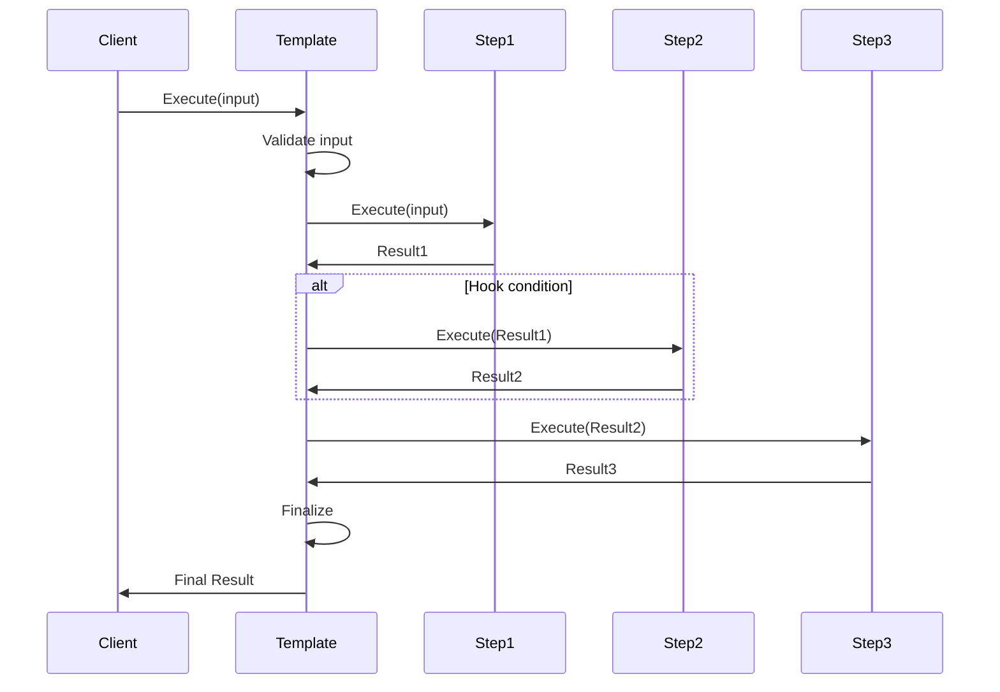
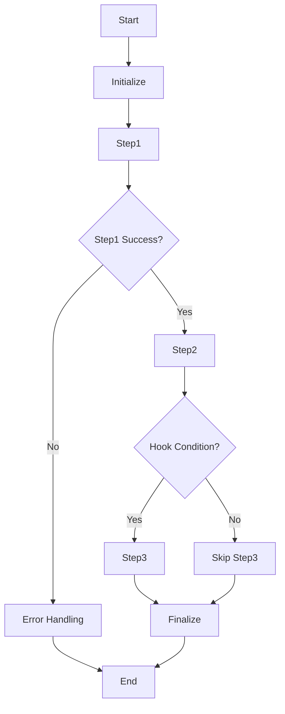

# 3.3.1 模板方法模式 (Template Method Pattern)

<!-- TOC START -->
- [3.3.1 模板方法模式 (Template Method Pattern)](#331-模板方法模式-template-method-pattern)
  - [3.3.1.1 目录](#3311-目录)
  - [3.3.1.2 1. 概述](#3312-1-概述)
    - [3.3.1.2.1 模式定义](#33121-模式定义)
    - [3.3.1.2.2 核心思想](#33122-核心思想)
  - [3.3.1.3 2. 形式化定义](#3313-2-形式化定义)
    - [3.3.1.3.1 数学定义](#33131-数学定义)
    - [3.3.1.3.2 算法模板代数](#33132-算法模板代数)
    - [3.3.1.3.3 模板执行公理](#33133-模板执行公理)
  - [3.3.1.4 3. 结构分析](#3314-3-结构分析)
    - [3.3.1.4.1 UML类图](#33141-uml类图)
    - [3.3.1.4.2 时序图](#33142-时序图)
    - [3.3.1.4.3 算法流程图](#33143-算法流程图)
  - [3.3.1.5 4. Golang实现](#3315-4-golang实现)
    - [3.3.1.5.1 核心接口设计](#33151-核心接口设计)
    - [3.3.1.5.2 基础步骤实现](#33152-基础步骤实现)
    - [3.3.1.5.3 模板实现](#33153-模板实现)
    - [3.3.1.5.4 钩子实现](#33154-钩子实现)
    - [3.3.1.5.5 具体应用实现](#33155-具体应用实现)
  - [3.3.1.6 5. 性能分析](#3316-5-性能分析)
    - [3.3.1.6.1 时间复杂度分析](#33161-时间复杂度分析)
      - [3.3.1.6.1.1 模板执行](#331611-模板执行)
      - [3.3.1.6.1.2 步骤选择](#331612-步骤选择)
      - [3.3.1.6.1.3 钩子执行](#331613-钩子执行)
    - [3.3.1.6.2 空间复杂度分析](#33162-空间复杂度分析)
      - [3.3.1.6.2.1 内存使用](#331621-内存使用)
      - [3.3.1.6.2.2 内存优化](#331622-内存优化)
    - [3.3.1.6.3 并发性能分析](#33163-并发性能分析)
      - [3.3.1.6.3.1 并发执行](#331631-并发执行)
      - [3.3.1.6.3.2 步骤并行化](#331632-步骤并行化)
    - [3.3.1.6.4 基准测试](#33164-基准测试)
  - [3.3.1.7 6. 应用场景](#3317-6-应用场景)
    - [3.3.1.7.1 数据处理管道](#33171-数据处理管道)
    - [3.3.1.7.2 构建系统](#33172-构建系统)
    - [3.3.1.7.3 工作流引擎](#33173-工作流引擎)
  - [3.3.1.8 7. 最佳实践](#3318-7-最佳实践)
    - [3.3.1.8.1 设计原则](#33181-设计原则)
    - [3.3.1.8.2 实现建议](#33182-实现建议)
    - [3.3.1.8.3 常见陷阱](#33183-常见陷阱)
  - [3.3.1.9 8. 案例分析](#3319-8-案例分析)
    - [3.3.1.9.1 完整的数据处理系统](#33191-完整的数据处理系统)
    - [3.3.1.9.2 构建系统示例](#33192-构建系统示例)
<!-- TOC END -->

## 3.3.1.1 目录

## 3.3.1.2 1. 概述

### 3.3.1.2.1 模式定义

模板方法模式定义了一个算法的骨架，将一些步骤延迟到子类中实现。模板方法使得子类可以在不改变算法结构的情况下，重新定义算法的某些特定步骤。在Golang中，模板方法模式充分利用接口和嵌入特性，实现灵活的算法框架。

### 3.3.1.2.2 核心思想

- **算法骨架**：定义算法的整体结构
- **步骤抽象**：将可变步骤抽象为接口
- **钩子方法**：提供可选的扩展点
- **代码复用**：避免重复的算法结构
- **开闭原则**：对扩展开放，对修改关闭

## 3.3.1.3 2. 形式化定义

### 3.3.1.3.1 数学定义

设 $A$ 为算法集合，$S$ 为步骤集合，$I$ 为输入集合，$O$ 为输出集合，定义模板方法系统：

$$\mathcal{T} = (A, S, I, O, \phi, \psi, \theta)$$

其中：

- $\phi: A \times S \rightarrow \{true, false\}$ 为步骤适用性函数
- $\psi: S \times I \rightarrow O$ 为步骤执行函数
- $\theta: A \times S \rightarrow S$ 为步骤组合函数

### 3.3.1.3.2 算法模板代数

定义算法模板代数：

$$(A, \oplus, \otimes, \circ, \preceq)$$

其中：

- $\oplus$ 为算法组合：$a_1 \oplus a_2$ 表示算法组合
- $\otimes$ 为算法变换：$a_1 \otimes a_2$ 表示算法变换
- $\circ$ 为算法应用：$a_1 \circ a_2$ 表示算法应用
- $\preceq$ 为优先级关系：$a_1 \preceq a_2$ 表示 $a_1$ 优先级不高于 $a_2$

### 3.3.1.3.3 模板执行公理

**公理1（步骤一致性）**：
$$\forall s \in S, i \in I: \psi(s, i) \in O$$

**公理2（组合结合性）**：
$$\forall s_1, s_2, s_3 \in S: (s_1 \circ s_2) \circ s_3 = s_1 \circ (s_2 \circ s_3)$$

**公理3（模板完整性）**：
$$\forall a \in A, i \in I: \exists o \in O: \theta(a, i) = o$$

## 3.3.1.4 3. 结构分析

### 3.3.1.4.1 UML类图

```mermaid
classDiagram
    class AbstractClass {
        <<abstract>>
        +TemplateMethod() void
        +Step1() void
        +Step2() void
        +Step3() void
        +Hook() bool
    }
    
    class ConcreteClassA {
        +Step1() void
        +Step2() void
        +Step3() void
        +Hook() bool
    }
    
    class ConcreteClassB {
        +Step1() void
        +Step2() void
        +Step3() void
        +Hook() bool
    }
    
    class Step {
        <<interface>>
        +Execute(input interface{}) interface{}
        +GetName() string
        +CanExecute(input interface{}) bool
    }
    
    class Template {
        -steps []Step
        +AddStep(Step)
        +Execute(input interface{}) interface{}
        +GetSteps() []Step
    }
    
    AbstractClass <|-- ConcreteClassA
    AbstractClass <|-- ConcreteClassB
    Template --> Step
    AbstractClass --> Template

```

### 3.3.1.4.2 时序图



### 3.3.1.4.3 算法流程图



## 3.3.1.5 4. Golang实现

### 3.3.1.5.1 核心接口设计

```go
// Step 步骤接口
type Step interface {
    Execute(input interface{}) (interface{}, error)
    GetName() string
    CanExecute(input interface{}) bool
    GetPriority() int
}

// Template 模板接口
type Template interface {
    AddStep(step Step) error
    Execute(input interface{}) (interface{}, error)
    GetSteps() []Step
    SetHook(condition func(interface{}) bool)
}

// Hook 钩子接口
type Hook interface {
    ShouldExecute(context interface{}) bool
    Execute(context interface{}) error
}

// AlgorithmTemplate 算法模板
type AlgorithmTemplate struct {
    steps    []Step
    hooks    map[string]Hook
    mu       sync.RWMutex
    validate func(interface{}) error
    finalize func(interface{}) error
}

```

### 3.3.1.5.2 基础步骤实现

```go
// BaseStep 基础步骤
type BaseStep struct {
    name     string
    priority int
}

func NewBaseStep(name string, priority int) *BaseStep {
    return &BaseStep{
        name:     name,
        priority: priority,
    }
}

func (s *BaseStep) GetName() string {
    return s.name
}

func (s *BaseStep) GetPriority() int {
    return s.priority
}

func (s *BaseStep) CanExecute(input interface{}) bool {
    return true // 默认可以执行
}

// ConcreteStep 具体步骤
type ConcreteStep struct {
    BaseStep
    handler func(interface{}) (interface{}, error)
    matcher func(interface{}) bool
}

func NewConcreteStep(name string, priority int, handler func(interface{}) (interface{}, error), matcher func(interface{}) bool) *ConcreteStep {
    return &ConcreteStep{
        BaseStep: *NewBaseStep(name, priority),
        handler:  handler,
        matcher:  matcher,
    }
}

func (s *ConcreteStep) Execute(input interface{}) (interface{}, error) {
    if s.handler == nil {
        return nil, fmt.Errorf("no handler defined for step %s", s.GetName())
    }
    
    return s.handler(input)
}

func (s *ConcreteStep) CanExecute(input interface{}) bool {
    if s.matcher == nil {
        return true
    }
    return s.matcher(input)
}

```

### 3.3.1.5.3 模板实现

```go
// AlgorithmTemplate 算法模板
type AlgorithmTemplate struct {
    steps    []Step
    hooks    map[string]Hook
    mu       sync.RWMutex
    validate func(interface{}) error
    finalize func(interface{}) error
}

func NewAlgorithmTemplate() *AlgorithmTemplate {
    return &AlgorithmTemplate{
        steps: make([]Step, 0),
        hooks: make(map[string]Hook),
    }
}

func (t *AlgorithmTemplate) AddStep(step Step) error {
    t.mu.Lock()
    defer t.mu.Unlock()
    
    if step == nil {
        return fmt.Errorf("step cannot be nil")
    }
    
    t.steps = append(t.steps, step)
    
    // 按优先级排序
    sort.Slice(t.steps, func(i, j int) bool {
        return t.steps[i].GetPriority() < t.steps[j].GetPriority()
    })
    
    return nil
}

func (t *AlgorithmTemplate) Execute(input interface{}) (interface{}, error) {
    t.mu.RLock()
    defer t.mu.RUnlock()
    
    // 验证输入
    if t.validate != nil {
        if err := t.validate(input); err != nil {
            return nil, fmt.Errorf("input validation failed: %w", err)
        }
    }
    
    currentInput := input
    
    // 执行步骤
    for _, step := range t.steps {
        if !step.CanExecute(currentInput) {
            continue
        }
        
        // 检查钩子条件
        if hook, exists := t.hooks[step.GetName()]; exists {
            if !hook.ShouldExecute(currentInput) {
                continue
            }
        }
        
        result, err := step.Execute(currentInput)
        if err != nil {
            return nil, fmt.Errorf("step %s failed: %w", step.GetName(), err)
        }
        
        currentInput = result
    }
    
    // 最终处理
    if t.finalize != nil {
        if err := t.finalize(currentInput); err != nil {
            return nil, fmt.Errorf("finalization failed: %w", err)
        }
    }
    
    return currentInput, nil
}

func (t *AlgorithmTemplate) GetSteps() []Step {
    t.mu.RLock()
    defer t.mu.RUnlock()
    
    result := make([]Step, len(t.steps))
    copy(result, t.steps)
    return result
}

func (t *AlgorithmTemplate) SetHook(stepName string, hook Hook) {
    t.mu.Lock()
    defer t.mu.Unlock()
    t.hooks[stepName] = hook
}

func (t *AlgorithmTemplate) SetValidator(validator func(interface{}) error) {
    t.validate = validator
}

func (t *AlgorithmTemplate) SetFinalizer(finalizer func(interface{}) error) {
    t.finalize = finalizer
}

```

### 3.3.1.5.4 钩子实现

```go
// BaseHook 基础钩子
type BaseHook struct {
    condition func(interface{}) bool
    action    func(interface{}) error
}

func NewBaseHook(condition func(interface{}) bool, action func(interface{}) error) *BaseHook {
    return &BaseHook{
        condition: condition,
        action:    action,
    }
}

func (h *BaseHook) ShouldExecute(context interface{}) bool {
    if h.condition == nil {
        return true
    }
    return h.condition(context)
}

func (h *BaseHook) Execute(context interface{}) error {
    if h.action == nil {
        return nil
    }
    return h.action(context)
}

// ConditionalHook 条件钩子
type ConditionalHook struct {
    BaseHook
    name string
}

func NewConditionalHook(name string, condition func(interface{}) bool, action func(interface{}) error) *ConditionalHook {
    return &ConditionalHook{
        BaseHook: *NewBaseHook(condition, action),
        name:     name,
    }
}

func (c *ConditionalHook) GetName() string {
    return c.name
}

```

### 3.3.1.5.5 具体应用实现

```go
// 数据处理模板
type DataProcessingTemplate struct {
    *AlgorithmTemplate
}

func NewDataProcessingTemplate() *DataProcessingTemplate {
    template := &DataProcessingTemplate{
        AlgorithmTemplate: NewAlgorithmTemplate(),
    }
    
    // 添加验证步骤
    template.AddStep(NewConcreteStep(
        "validate",
        1,
        func(input interface{}) (interface{}, error) {
            data, ok := input.([]interface{})
            if !ok {
                return nil, fmt.Errorf("input must be []interface{}")
            }
            if len(data) == 0 {
                return nil, fmt.Errorf("input cannot be empty")
            }
            return data, nil
        },
        func(input interface{}) bool {
            return true
        },
    ))
    
    // 添加过滤步骤
    template.AddStep(NewConcreteStep(
        "filter",
        2,
        func(input interface{}) (interface{}, error) {
            data, ok := input.([]interface{})
            if !ok {
                return nil, fmt.Errorf("input must be []interface{}")
            }
            
            filtered := make([]interface{}, 0)
            for _, item := range data {
                if item != nil {
                    filtered = append(filtered, item)
                }
            }
            
            return filtered, nil
        },
        func(input interface{}) bool {
            return true
        },
    ))
    
    // 添加转换步骤
    template.AddStep(NewConcreteStep(
        "transform",
        3,
        func(input interface{}) (interface{}, error) {
            data, ok := input.([]interface{})
            if !ok {
                return nil, fmt.Errorf("input must be []interface{}")
            }
            
            transformed := make([]interface{}, len(data))
            for i, item := range data {
                if str, ok := item.(string); ok {
                    transformed[i] = strings.ToUpper(str)
                } else {
                    transformed[i] = item
                }
            }
            
            return transformed, nil
        },
        func(input interface{}) bool {
            return true
        },
    ))
    
    // 添加聚合步骤
    template.AddStep(NewConcreteStep(
        "aggregate",
        4,
        func(input interface{}) (interface{}, error) {
            data, ok := input.([]interface{})
            if !ok {
                return nil, fmt.Errorf("input must be []interface{}")
            }
            
            return map[string]interface{}{
                "count": len(data),
                "data":  data,
            }, nil
        },
        func(input interface{}) bool {
            return true
        },
    ))
    
    return template
}

// 文件处理模板
type FileProcessingTemplate struct {
    *AlgorithmTemplate
}

func NewFileProcessingTemplate() *FileProcessingTemplate {
    template := &FileProcessingTemplate{
        AlgorithmTemplate: NewAlgorithmTemplate(),
    }
    
    // 添加文件读取步骤
    template.AddStep(NewConcreteStep(
        "read_file",
        1,
        func(input interface{}) (interface{}, error) {
            filename, ok := input.(string)
            if !ok {
                return nil, fmt.Errorf("input must be string filename")
            }
            
            data, err := os.ReadFile(filename)
            if err != nil {
                return nil, fmt.Errorf("failed to read file: %w", err)
            }
            
            return string(data), nil
        },
        func(input interface{}) bool {
            _, ok := input.(string)
            return ok
        },
    ))
    
    // 添加内容解析步骤
    template.AddStep(NewConcreteStep(
        "parse_content",
        2,
        func(input interface{}) (interface{}, error) {
            content, ok := input.(string)
            if !ok {
                return nil, fmt.Errorf("input must be string content")
            }
            
            lines := strings.Split(content, "\n")
            return lines, nil
        },
        func(input interface{}) bool {
            _, ok := input.(string)
            return ok
        },
    ))
    
    // 添加内容处理步骤
    template.AddStep(NewConcreteStep(
        "process_lines",
        3,
        func(input interface{}) (interface{}, error) {
            lines, ok := input.([]string)
            if !ok {
                return nil, fmt.Errorf("input must be []string")
            }
            
            processed := make([]string, 0)
            for _, line := range lines {
                line = strings.TrimSpace(line)
                if line != "" {
                    processed = append(processed, line)
                }
            }
            
            return processed, nil
        },
        func(input interface{}) bool {
            _, ok := input.([]string)
            return ok
        },
    ))
    
    // 添加结果输出步骤
    template.AddStep(NewConcreteStep(
        "write_output",
        4,
        func(input interface{}) (interface{}, error) {
            lines, ok := input.([]string)
            if !ok {
                return nil, fmt.Errorf("input must be []string")
            }
            
            output := strings.Join(lines, "\n")
            return output, nil
        },
        func(input interface{}) bool {
            _, ok := input.([]string)
            return ok
        },
    ))
    
    return template
}

```

## 3.3.1.6 5. 性能分析

### 3.3.1.6.1 时间复杂度分析

#### 3.3.1.6.1.1 模板执行

模板执行的时间复杂度：

$$T(n) = O(n)$$

其中 $n$ 为步骤数量。

**证明**：

- 需要执行所有步骤
- 每个步骤的执行时间为常数
- 总时间复杂度为 $O(n)$

#### 3.3.1.6.1.2 步骤选择

步骤选择的时间复杂度：

$$T(n) = O(n)$$

其中 $n$ 为步骤数量。

**证明**：

- 需要检查每个步骤的适用性
- 每个检查的时间为常数
- 总时间复杂度为 $O(n)$

#### 3.3.1.6.1.3 钩子执行

钩子执行的时间复杂度：

$$T(n, m) = O(n + m)$$

其中：

- $n$ 为步骤数量
- $m$ 为钩子数量

**证明**：

- 步骤执行时间为 $O(n)$
- 钩子检查时间为 $O(m)$
- 总时间复杂度为 $O(n + m)$

### 3.3.1.6.2 空间复杂度分析

#### 3.3.1.6.2.1 内存使用

空间复杂度为：

$$S(n) = O(n)$$

其中 $n$ 为步骤数量。

**分析**：

- 每个步骤占用常数空间
- 步骤存储占用 $O(n)$ 空间
- 钩子存储占用 $O(m)$ 空间，其中 $m$ 为钩子数量

#### 3.3.1.6.2.2 内存优化

```go
// 步骤池优化
type StepPool struct {
    pool sync.Pool
}

func NewStepPool() *StepPool {
    return &StepPool{
        pool: sync.Pool{
            New: func() interface{} {
                return &BaseStep{}
            },
        },
    }
}

func (p *StepPool) Get() *BaseStep {
    return p.pool.Get().(*BaseStep)
}

func (p *StepPool) Put(step *BaseStep) {
    step.name = ""
    step.priority = 0
    p.pool.Put(step)
}

```

### 3.3.1.6.3 并发性能分析

#### 3.3.1.6.3.1 并发执行

定义并发执行函数：

$$C(n, m) = \frac{n \cdot m}{t_{avg}}$$

其中：

- $n$ 为并发数
- $m$ 为模板数
- $t_{avg}$ 为平均执行时间

#### 3.3.1.6.3.2 步骤并行化

定义步骤并行化性能：

$$P(n) = \frac{t_{sequential}}{t_{parallel}}$$

其中：

- $t_{sequential}$ 为串行执行时间
- $t_{parallel}$ 为并行执行时间

### 3.3.1.6.4 基准测试

```go
func BenchmarkTemplateExecution(b *testing.B) {
    template := NewDataProcessingTemplate()
    
    // 准备测试数据
    data := make([]interface{}, 1000)
    for i := 0; i < 1000; i++ {
        data[i] = fmt.Sprintf("item_%d", i)
    }
    
    b.ResetTimer()
    for i := 0; i < b.N; i++ {
        template.Execute(data)
    }
}

func BenchmarkStepExecution(b *testing.B) {
    step := NewConcreteStep(
        "test_step",
        1,
        func(input interface{}) (interface{}, error) {
            return input, nil
        },
        func(input interface{}) bool {
            return true
        },
    )
    
    b.ResetTimer()
    for i := 0; i < b.N; i++ {
        step.Execute("test input")
    }
}

func BenchmarkHookExecution(b *testing.B) {
    hook := NewBaseHook(
        func(context interface{}) bool {
            return true
        },
        func(context interface{}) error {
            return nil
        },
    )
    
    b.ResetTimer()
    for i := 0; i < b.N; i++ {
        hook.ShouldExecute("test context")
    }
}

```

## 3.3.1.7 6. 应用场景

### 3.3.1.7.1 数据处理管道

```go
// 数据处理管道
type DataPipeline struct {
    template *AlgorithmTemplate
}

func NewDataPipeline() *DataPipeline {
    pipeline := &DataPipeline{
        template: NewAlgorithmTemplate(),
    }
    
    // 添加数据验证步骤
    pipeline.template.AddStep(NewConcreteStep(
        "validate",
        1,
        func(input interface{}) (interface{}, error) {
            // 数据验证逻辑
            return input, nil
        },
        func(input interface{}) bool {
            return true
        },
    ))
    
    // 添加数据清洗步骤
    pipeline.template.AddStep(NewConcreteStep(
        "clean",
        2,
        func(input interface{}) (interface{}, error) {
            // 数据清洗逻辑
            return input, nil
        },
        func(input interface{}) bool {
            return true
        },
    ))
    
    // 添加数据转换步骤
    pipeline.template.AddStep(NewConcreteStep(
        "transform",
        3,
        func(input interface{}) (interface{}, error) {
            // 数据转换逻辑
            return input, nil
        },
        func(input interface{}) bool {
            return true
        },
    ))
    
    return pipeline
}

func (p *DataPipeline) Process(data interface{}) (interface{}, error) {
    return p.template.Execute(data)
}

```

### 3.3.1.7.2 构建系统

```go
// 构建系统
type BuildSystem struct {
    template *AlgorithmTemplate
}

func NewBuildSystem() *BuildSystem {
    build := &BuildSystem{
        template: NewAlgorithmTemplate(),
    }
    
    // 添加代码检查步骤
    build.template.AddStep(NewConcreteStep(
        "lint",
        1,
        func(input interface{}) (interface{}, error) {
            // 代码检查逻辑
            return input, nil
        },
        func(input interface{}) bool {
            return true
        },
    ))
    
    // 添加测试步骤
    build.template.AddStep(NewConcreteStep(
        "test",
        2,
        func(input interface{}) (interface{}, error) {
            // 测试逻辑
            return input, nil
        },
        func(input interface{}) bool {
            return true
        },
    ))
    
    // 添加编译步骤
    build.template.AddStep(NewConcreteStep(
        "compile",
        3,
        func(input interface{}) (interface{}, error) {
            // 编译逻辑
            return input, nil
        },
        func(input interface{}) bool {
            return true
        },
    ))
    
    // 添加部署步骤
    build.template.AddStep(NewConcreteStep(
        "deploy",
        4,
        func(input interface{}) (interface{}, error) {
            // 部署逻辑
            return input, nil
        },
        func(input interface{}) bool {
            return true
        },
    ))
    
    return build
}

func (b *BuildSystem) Build(project interface{}) (interface{}, error) {
    return b.template.Execute(project)
}

```

### 3.3.1.7.3 工作流引擎

```go
// 工作流引擎
type WorkflowEngine struct {
    template *AlgorithmTemplate
}

func NewWorkflowEngine() *WorkflowEngine {
    engine := &WorkflowEngine{
        template: NewAlgorithmTemplate(),
    }
    
    // 添加工作流初始化步骤
    engine.template.AddStep(NewConcreteStep(
        "initialize",
        1,
        func(input interface{}) (interface{}, error) {
            // 初始化逻辑
            return input, nil
        },
        func(input interface{}) bool {
            return true
        },
    ))
    
    // 添加工作流执行步骤
    engine.template.AddStep(NewConcreteStep(
        "execute",
        2,
        func(input interface{}) (interface{}, error) {
            // 执行逻辑
            return input, nil
        },
        func(input interface{}) bool {
            return true
        },
    ))
    
    // 添加工作流清理步骤
    engine.template.AddStep(NewConcreteStep(
        "cleanup",
        3,
        func(input interface{}) (interface{}, error) {
            // 清理逻辑
            return input, nil
        },
        func(input interface{}) bool {
            return true
        },
    ))
    
    return engine
}

func (w *WorkflowEngine) Execute(workflow interface{}) (interface{}, error) {
    return w.template.Execute(workflow)
}

```

## 3.3.1.8 7. 最佳实践

### 3.3.1.8.1 设计原则

1. **单一职责**：每个步骤只负责一个功能
2. **开闭原则**：新增步骤不需要修改现有代码
3. **依赖倒置**：依赖抽象步骤而非具体实现
4. **接口隔离**：使用小而精确的接口

### 3.3.1.8.2 实现建议

1. **使用接口**：定义清晰的Step接口
2. **步骤排序**：实现步骤的优先级排序
3. **钩子机制**：提供灵活的扩展点
4. **错误处理**：统一的错误处理机制
5. **测试覆盖**：完整的单元测试

### 3.3.1.8.3 常见陷阱

1. **步骤爆炸**：避免过多的步骤类
2. **性能问题**：避免步骤执行的性能瓶颈
3. **状态管理**：避免步骤间的状态共享
4. **错误传播**：合理处理错误传播

## 3.3.1.9 8. 案例分析

### 3.3.1.9.1 完整的数据处理系统

```go
// 数据处理系统示例
func DataProcessingSystemExample() {
    // 创建数据处理模板
    template := NewDataProcessingTemplate()
    
    // 添加钩子
    template.SetHook("transform", NewBaseHook(
        func(context interface{}) bool {
            data, ok := context.([]interface{})
            if !ok {
                return false
            }
            return len(data) > 0
        },
        func(context interface{}) error {
            fmt.Println("Transform hook executed")
            return nil
        },
    ))
    
    // 准备测试数据
    data := []interface{}{
        "hello",
        "world",
        nil,
        "golang",
        "",
        "template",
    }
    
    // 执行数据处理
    result, err := template.Execute(data)
    if err != nil {
        log.Printf("Data processing failed: %v", err)
        return
    }
    
    fmt.Printf("Processing result: %+v\n", result)
}

// 文件处理系统示例
func FileProcessingSystemExample() {
    // 创建文件处理模板
    template := NewFileProcessingTemplate()
    
    // 创建临时文件
    content := "line1\nline2\n\nline3\n  line4  \n"
    tmpfile, err := os.CreateTemp("", "template_test")
    if err != nil {
        log.Printf("Failed to create temp file: %v", err)
        return
    }
    defer os.Remove(tmpfile.Name())
    
    if _, err := tmpfile.Write([]byte(content)); err != nil {
        log.Printf("Failed to write temp file: %v", err)
        return
    }
    tmpfile.Close()
    
    // 执行文件处理
    result, err := template.Execute(tmpfile.Name())
    if err != nil {
        log.Printf("File processing failed: %v", err)
        return
    }
    
    fmt.Printf("File processing result: %s\n", result)
}

```

### 3.3.1.9.2 构建系统示例

```go
// 构建系统示例
func BuildSystemExample() {
    // 创建构建系统
    build := NewBuildSystem()
    
    // 添加构建钩子
    build.template.SetHook("test", NewBaseHook(
        func(context interface{}) bool {
            // 检查是否需要运行测试
            return true
        },
        func(context interface{}) error {
            fmt.Println("Running tests...")
            return nil
        },
    ))
    
    // 模拟项目构建
    project := map[string]interface{}{
        "name":    "my-project",
        "version": "1.0.0",
        "files":   []string{"main.go", "utils.go"},
    }
    
    // 执行构建
    result, err := build.Build(project)
    if err != nil {
        log.Printf("Build failed: %v", err)
        return
    }
    
    fmt.Printf("Build result: %+v\n", result)
}

```

---

**参考文献**：

1. Gamma, E., Helm, R., Johnson, R., & Vlissides, J. (1994). Design Patterns: Elements of Reusable Object-Oriented Software
2. Go Language Specification. <https://golang.org/ref/spec>
3. Go Concurrency Patterns. <https://golang.org/doc/effective_go.html#concurrency>
4. Effective Go. <https://golang.org/doc/effective_go.html>
