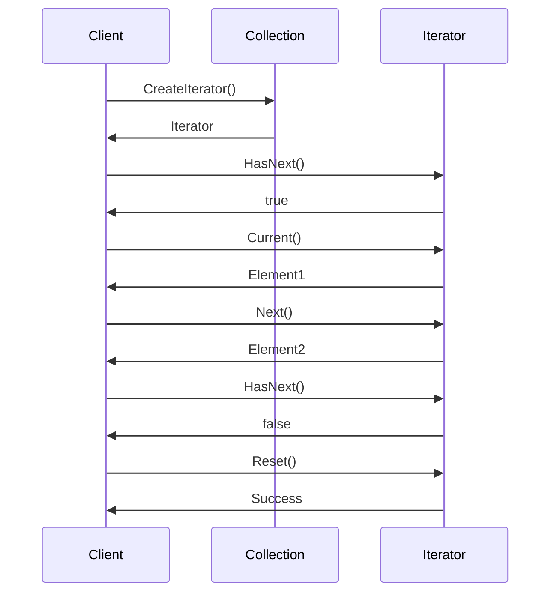
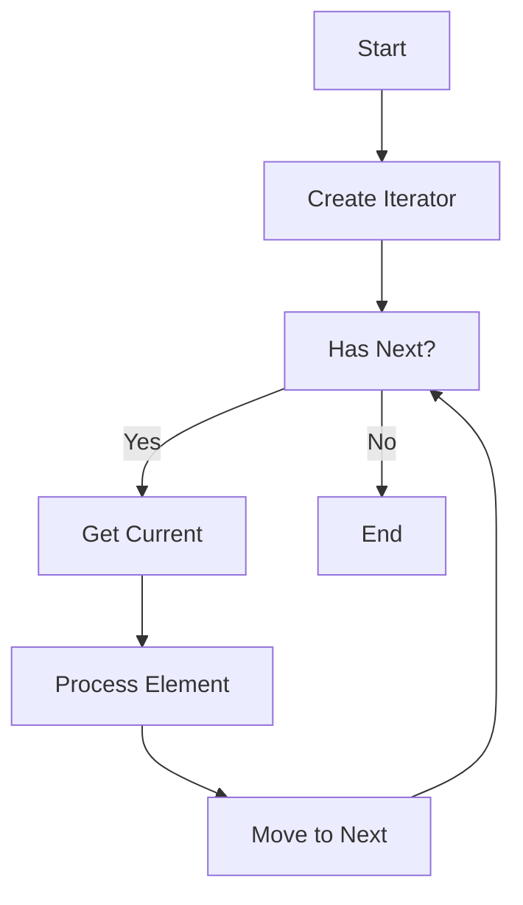

# 迭代器模式 (Iterator Pattern)

## 目录

1. [概述](#1-概述)
2. [形式化定义](#2-形式化定义)
3. [结构分析](#3-结构分析)
4. [Golang实现](#4-golang实现)
5. [性能分析](#5-性能分析)
6. [应用场景](#6-应用场景)
7. [最佳实践](#7-最佳实践)
8. [案例分析](#8-案例分析)

## 1. 概述

### 1.1 模式定义

迭代器模式提供一种方法顺序访问一个聚合对象中的各个元素，而又不暴露其内部的表示。在Golang中，迭代器模式充分利用接口和通道特性，实现高效的数据遍历机制。

### 1.2 核心思想

- **封装遍历**：将遍历逻辑封装在迭代器中
- **统一接口**：提供统一的遍历接口
- **解耦集合**：迭代器与集合解耦
- **支持并发**：支持并发安全的遍历
- **多种遍历**：支持不同的遍历策略

## 2. 形式化定义

### 2.1 数学定义

设 $I$ 为迭代器集合，$C$ 为集合集合，$E$ 为元素集合，定义迭代器系统：

$$\mathcal{I} = (I, C, E, \rightarrow, \phi, \psi, \theta)$$

其中：

- $\rightarrow \subseteq I \times C$ 为迭代器关联关系
- $\phi: I \rightarrow \{true, false\}$ 为迭代器有效性函数
- $\psi: I \rightarrow E$ 为当前元素函数
- $\theta: I \rightarrow I$ 为下一个迭代器函数

### 2.2 迭代器代数

定义迭代器代数：

$$(I, \oplus, \otimes, \circ, \preceq)$$

其中：

- $\oplus$ 为迭代器组合：$i_1 \oplus i_2$ 表示迭代器组合
- $\otimes$ 为迭代器变换：$i_1 \otimes i_2$ 表示迭代器变换
- $\circ$ 为迭代器应用：$i_1 \circ i_2$ 表示迭代器应用
- $\preceq$ 为优先级关系：$i_1 \preceq i_2$ 表示 $i_1$ 优先级不高于 $i_2$

### 2.3 迭代器公理

**公理1（迭代器一致性）**：
$$\forall i \in I: \phi(i) \Rightarrow \psi(i) \in E$$

**公理2（迭代器终止性）**：
$$\forall i \in I: \exists n \in \mathbb{N}: \phi(\theta^n(i)) = false$$

**公理3（迭代器唯一性）**：
$$\forall i_1, i_2 \in I, c \in C: i_1 \rightarrow c \land i_2 \rightarrow c \Rightarrow i_1 = i_2$$

### 2.4 遍历系统

定义遍历系统：

$$\mathcal{T} = (T, I, \text{next}, \text{hasNext}, \text{current})$$

其中：

- $T$ 为遍历器集合
- $\text{next}: T \rightarrow T$ 为下一个遍历器函数
- $\text{hasNext}: T \rightarrow \{true, false\}$ 为是否有下一个函数
- $\text{current}: T \rightarrow E$ 为当前元素函数

## 3. 结构分析

### 3.1 UML类图

```mermaid
classDiagram
    class Iterator {
        <<interface>>
        +Next() interface{}
        +HasNext() bool
        +Current() interface{}
        +Reset() error
    }
    
    class ConcreteIterator {
        -collection Collection
        -index int
        +Next() interface{}
        +HasNext() bool
        +Current() interface{}
        +Reset() error
    }
    
    class Collection {
        <<interface>>
        +CreateIterator() Iterator
        +GetSize() int
        +GetAt(index int) interface{}
    }
    
    class ConcreteCollection {
        -elements []interface{}
        +CreateIterator() Iterator
        +GetSize() int
        +GetAt(index int) interface{}
        +Add(element interface{})
        +Remove(index int)
    }
    
    class AsyncIterator {
        -channel chan interface{}
        -done chan struct{}
        +Next() interface{}
        +HasNext() bool
        +Current() interface{}
        +Reset() error
    }
    
    Iterator <|.. ConcreteIterator
    Iterator <|.. AsyncIterator
    Collection <|.. ConcreteCollection
    ConcreteIterator --> ConcreteCollection
    AsyncIterator --> ConcreteCollection
```

### 3.2 时序图



### 3.3 遍历流程图



## 4. Golang实现

### 4.1 核心接口设计

```go
// Iterator 迭代器接口
type Iterator interface {
    Next() (interface{}, error)
    HasNext() bool
    Current() (interface{}, error)
    Reset() error
    GetIndex() int
    GetSize() int
}

// Collection 集合接口
type Collection interface {
    CreateIterator() Iterator
    GetSize() int
    GetAt(index int) (interface{}, error)
    Add(element interface{}) error
    Remove(index int) error
    Clear() error
}

// AsyncIterator 异步迭代器接口
type AsyncIterator interface {
    Iterator
    NextAsync() <-chan interface{}
    Stop() error
}

// IteratorResult 迭代器结果
type IteratorResult struct {
    Value interface{}
    Index int
    Error error
}
```

### 4.2 基础迭代器实现

```go
// BaseIterator 基础迭代器
type BaseIterator struct {
    collection Collection
    index      int
    size       int
}

func NewBaseIterator(collection Collection) *BaseIterator {
    return &BaseIterator{
        collection: collection,
        index:      -1,
        size:       collection.GetSize(),
    }
}

func (i *BaseIterator) Next() (interface{}, error) {
    if !i.HasNext() {
        return nil, fmt.Errorf("no more elements")
    }
    
    i.index++
    return i.Current()
}

func (i *BaseIterator) HasNext() bool {
    return i.index < i.size-1
}

func (i *BaseIterator) Current() (interface{}, error) {
    if i.index < 0 || i.index >= i.size {
        return nil, fmt.Errorf("invalid index: %d", i.index)
    }
    
    return i.collection.GetAt(i.index)
}

func (i *BaseIterator) Reset() error {
    i.index = -1
    return nil
}

func (i *BaseIterator) GetIndex() int {
    return i.index
}

func (i *BaseIterator) GetSize() int {
    return i.size
}

// ConcreteIterator 具体迭代器
type ConcreteIterator struct {
    BaseIterator
    filter func(interface{}) bool
    mapper func(interface{}) interface{}
}

func NewConcreteIterator(collection Collection, filter func(interface{}) bool, mapper func(interface{}) interface{}) *ConcreteIterator {
    return &ConcreteIterator{
        BaseIterator: *NewBaseIterator(collection),
        filter:       filter,
        mapper:       mapper,
    }
}

func (i *ConcreteIterator) Next() (interface{}, error) {
    for i.HasNext() {
        i.index++
        current, err := i.Current()
        if err != nil {
            continue
        }
        
        if i.filter != nil && !i.filter(current) {
            continue
        }
        
        if i.mapper != nil {
            current = i.mapper(current)
        }
        
        return current, nil
    }
    
    return nil, fmt.Errorf("no more elements")
}

func (i *ConcreteIterator) HasNext() bool {
    // 检查是否有满足条件的下一个元素
    tempIndex := i.index
    for tempIndex < i.size-1 {
        tempIndex++
        element, err := i.collection.GetAt(tempIndex)
        if err != nil {
            continue
        }
        
        if i.filter == nil || i.filter(element) {
            return true
        }
    }
    return false
}
```

### 4.3 集合实现

```go
// BaseCollection 基础集合
type BaseCollection struct {
    elements []interface{}
    mu       sync.RWMutex
}

func NewBaseCollection() *BaseCollection {
    return &BaseCollection{
        elements: make([]interface{}, 0),
    }
}

func (c *BaseCollection) CreateIterator() Iterator {
    return NewBaseIterator(c)
}

func (c *BaseCollection) GetSize() int {
    c.mu.RLock()
    defer c.mu.RUnlock()
    return len(c.elements)
}

func (c *BaseCollection) GetAt(index int) (interface{}, error) {
    c.mu.RLock()
    defer c.mu.RUnlock()
    
    if index < 0 || index >= len(c.elements) {
        return nil, fmt.Errorf("index out of bounds: %d", index)
    }
    
    return c.elements[index], nil
}

func (c *BaseCollection) Add(element interface{}) error {
    c.mu.Lock()
    defer c.mu.Unlock()
    
    c.elements = append(c.elements, element)
    return nil
}

func (c *BaseCollection) Remove(index int) error {
    c.mu.Lock()
    defer c.mu.Unlock()
    
    if index < 0 || index >= len(c.elements) {
        return fmt.Errorf("index out of bounds: %d", index)
    }
    
    c.elements = append(c.elements[:index], c.elements[index+1:]...)
    return nil
}

func (c *BaseCollection) Clear() error {
    c.mu.Lock()
    defer c.mu.Unlock()
    
    c.elements = make([]interface{}, 0)
    return nil
}

// ConcreteCollection 具体集合
type ConcreteCollection struct {
    BaseCollection
    name string
}

func NewConcreteCollection(name string) *ConcreteCollection {
    return &ConcreteCollection{
        BaseCollection: *NewBaseCollection(),
        name:           name,
    }
}

func (c *ConcreteCollection) GetName() string {
    return c.name
}

func (c *ConcreteCollection) CreateFilteredIterator(filter func(interface{}) bool) Iterator {
    return NewConcreteIterator(c, filter, nil)
}

func (c *ConcreteCollection) CreateMappedIterator(mapper func(interface{}) interface{}) Iterator {
    return NewConcreteIterator(c, nil, mapper)
}
```

### 4.4 异步迭代器实现

```go
// AsyncIterator 异步迭代器
type AsyncIterator struct {
    collection Collection
    channel    chan interface{}
    done       chan struct{}
    current    interface{}
    index      int
    size       int
}

func NewAsyncIterator(collection Collection, bufferSize int) *AsyncIterator {
    iterator := &AsyncIterator{
        collection: collection,
        channel:    make(chan interface{}, bufferSize),
        done:       make(chan struct{}),
        index:      -1,
        size:       collection.GetSize(),
    }
    
    go iterator.produce()
    return iterator
}

func (a *AsyncIterator) produce() {
    defer close(a.channel)
    
    for i := 0; i < a.size; i++ {
        element, err := a.collection.GetAt(i)
        if err != nil {
            continue
        }
        
        select {
        case a.channel <- element:
        case <-a.done:
            return
        }
    }
}

func (a *AsyncIterator) Next() (interface{}, error) {
    select {
    case element := <-a.channel:
        a.current = element
        a.index++
        return element, nil
    case <-a.done:
        return nil, fmt.Errorf("iterator stopped")
    default:
        return nil, fmt.Errorf("no more elements")
    }
}

func (a *AsyncIterator) HasNext() bool {
    return len(a.channel) > 0
}

func (a *AsyncIterator) Current() (interface{}, error) {
    if a.current == nil {
        return nil, fmt.Errorf("no current element")
    }
    return a.current, nil
}

func (a *AsyncIterator) Reset() error {
    a.Stop()
    a.index = -1
    a.current = nil
    a.channel = make(chan interface{}, cap(a.channel))
    a.done = make(chan struct{})
    go a.produce()
    return nil
}

func (a *AsyncIterator) GetIndex() int {
    return a.index
}

func (a *AsyncIterator) GetSize() int {
    return a.size
}

func (a *AsyncIterator) NextAsync() <-chan interface{} {
    return a.channel
}

func (a *AsyncIterator) Stop() error {
    select {
    case <-a.done:
        return nil
    default:
        close(a.done)
        return nil
    }
}
```

### 4.5 并发安全迭代器

```go
// ConcurrentIterator 并发安全迭代器
type ConcurrentIterator struct {
    collection Collection
    index      int32
    size       int
    mu         sync.RWMutex
}

func NewConcurrentIterator(collection Collection) *ConcurrentIterator {
    return &ConcurrentIterator{
        collection: collection,
        index:      -1,
        size:       collection.GetSize(),
    }
}

func (c *ConcurrentIterator) Next() (interface{}, error) {
    c.mu.Lock()
    defer c.mu.Unlock()
    
    if !c.HasNext() {
        return nil, fmt.Errorf("no more elements")
    }
    
    c.index++
    return c.Current()
}

func (c *ConcurrentIterator) HasNext() bool {
    return c.index < int32(c.size-1)
}

func (c *ConcurrentIterator) Current() (interface{}, error) {
    if c.index < 0 || c.index >= int32(c.size) {
        return nil, fmt.Errorf("invalid index: %d", c.index)
    }
    
    return c.collection.GetAt(int(c.index))
}

func (c *ConcurrentIterator) Reset() error {
    c.mu.Lock()
    defer c.mu.Unlock()
    
    c.index = -1
    return nil
}

func (c *ConcurrentIterator) GetIndex() int {
    return int(c.index)
}

func (c *ConcurrentIterator) GetSize() int {
    return c.size
}
```

### 4.6 特殊迭代器实现

```go
// ReverseIterator 反向迭代器
type ReverseIterator struct {
    collection Collection
    index      int
    size       int
}

func NewReverseIterator(collection Collection) *ReverseIterator {
    return &ReverseIterator{
        collection: collection,
        index:      collection.GetSize(),
        size:       collection.GetSize(),
    }
}

func (r *ReverseIterator) Next() (interface{}, error) {
    if !r.HasNext() {
        return nil, fmt.Errorf("no more elements")
    }
    
    r.index--
    return r.Current()
}

func (r *ReverseIterator) HasNext() bool {
    return r.index > 0
}

func (r *ReverseIterator) Current() (interface{}, error) {
    if r.index < 0 || r.index >= r.size {
        return nil, fmt.Errorf("invalid index: %d", r.index)
    }
    
    return r.collection.GetAt(r.index)
}

func (r *ReverseIterator) Reset() error {
    r.index = r.size
    return nil
}

func (r *ReverseIterator) GetIndex() int {
    return r.index
}

func (r *ReverseIterator) GetSize() int {
    return r.size
}

// RangeIterator 范围迭代器
type RangeIterator struct {
    collection Collection
    start      int
    end        int
    step       int
    current    int
}

func NewRangeIterator(collection Collection, start, end, step int) *RangeIterator {
    return &RangeIterator{
        collection: collection,
        start:      start,
        end:        end,
        step:       step,
        current:    start,
    }
}

func (r *RangeIterator) Next() (interface{}, error) {
    if !r.HasNext() {
        return nil, fmt.Errorf("no more elements")
    }
    
    element, err := r.collection.GetAt(r.current)
    if err != nil {
        return nil, err
    }
    
    r.current += r.step
    return element, nil
}

func (r *RangeIterator) HasNext() bool {
    if r.step > 0 {
        return r.current < r.end
    }
    return r.current > r.end
}

func (r *RangeIterator) Current() (interface{}, error) {
    if r.current < r.start || r.current >= r.end {
        return nil, fmt.Errorf("invalid current position: %d", r.current)
    }
    
    return r.collection.GetAt(r.current)
}

func (r *RangeIterator) Reset() error {
    r.current = r.start
    return nil
}

func (r *RangeIterator) GetIndex() int {
    return r.current
}

func (r *RangeIterator) GetSize() int {
    return (r.end - r.start) / r.step
}
```

## 5. 性能分析

### 5.1 时间复杂度分析

#### 5.1.1 基本遍历

基本遍历的时间复杂度：

$$T(n) = O(n)$$

其中 $n$ 为元素数量。

**证明**：
- 需要访问所有元素
- 每个元素的访问时间为常数
- 总时间复杂度为 $O(n)$

#### 5.1.2 过滤遍历

过滤遍历的时间复杂度：

$$T(n) = O(n)$$

其中 $n$ 为元素数量。

**证明**：
- 需要检查所有元素
- 每个元素的过滤检查时间为常数
- 总时间复杂度为 $O(n)$

#### 5.1.3 异步遍历

异步遍历的时间复杂度：

$$T(n) = O(n)$$

其中 $n$ 为元素数量。

**证明**：
- 异步遍历不改变时间复杂度
- 只是改变了执行方式
- 总时间复杂度仍为 $O(n)$

### 5.2 空间复杂度分析

#### 5.2.1 内存使用

空间复杂度为：

$$S(n) = O(1)$$

其中 $n$ 为元素数量。

**分析**：
- 迭代器本身占用常数空间
- 不复制集合数据
- 只存储索引和引用

#### 5.2.2 异步迭代器

异步迭代器的空间复杂度：

$$S(n) = O(b)$$

其中 $b$ 为缓冲区大小。

**分析**：
- 需要缓冲区存储元素
- 缓冲区大小通常为常数
- 空间复杂度为 $O(b)$

### 5.3 并发性能分析

#### 5.3.1 并发遍历

定义并发遍历性能：

$$C(n, m) = \frac{n \cdot m}{t_{avg}}$$

其中：

- $n$ 为并发数
- $m$ 为元素数
- $t_{avg}$ 为平均处理时间

#### 5.3.2 同步开销

定义同步开销：

$$S(n) = t_{lock} + t_{process} + t_{unlock}$$

其中：

- $t_{lock}$ 为加锁时间
- $t_{process}$ 为处理时间
- $t_{unlock}$ 为解锁时间

### 5.4 基准测试

```go
func BenchmarkIteratorTraversal(b *testing.B) {
    collection := NewConcreteCollection("test")
    
    // 添加测试数据
    for i := 0; i < 1000; i++ {
        collection.Add(fmt.Sprintf("item_%d", i))
    }
    
    b.ResetTimer()
    for i := 0; i < b.N; i++ {
        iterator := collection.CreateIterator()
        for iterator.HasNext() {
            iterator.Next()
        }
    }
}

func BenchmarkFilteredIterator(b *testing.B) {
    collection := NewConcreteCollection("test")
    
    // 添加测试数据
    for i := 0; i < 1000; i++ {
        collection.Add(i)
    }
    
    filter := func(element interface{}) bool {
        num, ok := element.(int)
        return ok && num%2 == 0
    }
    
    b.ResetTimer()
    for i := 0; i < b.N; i++ {
        iterator := collection.CreateFilteredIterator(filter)
        for iterator.HasNext() {
            iterator.Next()
        }
    }
}

func BenchmarkAsyncIterator(b *testing.B) {
    collection := NewConcreteCollection("test")
    
    // 添加测试数据
    for i := 0; i < 1000; i++ {
        collection.Add(fmt.Sprintf("item_%d", i))
    }
    
    b.ResetTimer()
    for i := 0; i < b.N; i++ {
        iterator := NewAsyncIterator(collection, 100)
        for iterator.HasNext() {
            iterator.Next()
        }
        iterator.Stop()
    }
}

func BenchmarkConcurrentIterator(b *testing.B) {
    collection := NewConcreteCollection("test")
    
    // 添加测试数据
    for i := 0; i < 1000; i++ {
        collection.Add(fmt.Sprintf("item_%d", i))
    }
    
    b.ResetTimer()
    b.RunParallel(func(pb *testing.PB) {
        iterator := NewConcurrentIterator(collection)
        for pb.Next() {
            for iterator.HasNext() {
                iterator.Next()
            }
            iterator.Reset()
        }
    })
}
```

## 6. 应用场景

### 6.1 数据库查询结果遍历

```go
// 数据库结果集迭代器
type DatabaseResultIterator struct {
    rows    *sql.Rows
    current map[string]interface{}
    hasNext bool
}

func NewDatabaseResultIterator(rows *sql.Rows) *DatabaseResultIterator {
    return &DatabaseResultIterator{
        rows: rows,
    }
}

func (d *DatabaseResultIterator) Next() (interface{}, error) {
    if !d.HasNext() {
        return nil, fmt.Errorf("no more rows")
    }
    
    columns, err := d.rows.Columns()
    if err != nil {
        return nil, err
    }
    
    values := make([]interface{}, len(columns))
    valuePtrs := make([]interface{}, len(columns))
    for i := range values {
        valuePtrs[i] = &values[i]
    }
    
    if err := d.rows.Scan(valuePtrs...); err != nil {
        return nil, err
    }
    
    d.current = make(map[string]interface{})
    for i, column := range columns {
        d.current[column] = values[i]
    }
    
    d.hasNext = d.rows.Next()
    return d.current, nil
}

func (d *DatabaseResultIterator) HasNext() bool {
    if d.current == nil {
        d.hasNext = d.rows.Next()
    }
    return d.hasNext
}

func (d *DatabaseResultIterator) Current() (interface{}, error) {
    if d.current == nil {
        return nil, fmt.Errorf("no current row")
    }
    return d.current, nil
}

func (d *DatabaseResultIterator) Reset() error {
    return fmt.Errorf("database iterator cannot be reset")
}

func (d *DatabaseResultIterator) GetIndex() int {
    return -1 // 数据库迭代器不支持索引
}

func (d *DatabaseResultIterator) GetSize() int {
    return -1 // 数据库迭代器不支持大小
}
```

### 6.2 文件系统遍历

```go
// 文件系统迭代器
type FileSystemIterator struct {
    rootPath string
    files    []string
    index    int
    recursive bool
}

func NewFileSystemIterator(rootPath string, recursive bool) *FileSystemIterator {
    iterator := &FileSystemIterator{
        rootPath:  rootPath,
        recursive: recursive,
        index:     -1,
    }
    
    iterator.collectFiles()
    return iterator
}

func (f *FileSystemIterator) collectFiles() {
    var files []string
    
    if f.recursive {
        err := filepath.Walk(f.rootPath, func(path string, info os.FileInfo, err error) error {
            if err != nil {
                return err
            }
            if !info.IsDir() {
                files = append(files, path)
            }
            return nil
        })
        if err != nil {
            return
        }
    } else {
        entries, err := os.ReadDir(f.rootPath)
        if err != nil {
            return
        }
        
        for _, entry := range entries {
            if !entry.IsDir() {
                files = append(files, filepath.Join(f.rootPath, entry.Name()))
            }
        }
    }
    
    f.files = files
}

func (f *FileSystemIterator) Next() (interface{}, error) {
    if !f.HasNext() {
        return nil, fmt.Errorf("no more files")
    }
    
    f.index++
    return f.Current()
}

func (f *FileSystemIterator) HasNext() bool {
    return f.index < len(f.files)-1
}

func (f *FileSystemIterator) Current() (interface{}, error) {
    if f.index < 0 || f.index >= len(f.files) {
        return nil, fmt.Errorf("invalid index: %d", f.index)
    }
    
    return f.files[f.index], nil
}

func (f *FileSystemIterator) Reset() error {
    f.index = -1
    return nil
}

func (f *FileSystemIterator) GetIndex() int {
    return f.index
}

func (f *FileSystemIterator) GetSize() int {
    return len(f.files)
}
```

### 6.3 网络流数据遍历

```go
// 网络流迭代器
type NetworkStreamIterator struct {
    reader   io.Reader
    scanner  *bufio.Scanner
    current  string
    hasNext  bool
}

func NewNetworkStreamIterator(reader io.Reader) *NetworkStreamIterator {
    return &NetworkStreamIterator{
        reader:  reader,
        scanner: bufio.NewScanner(reader),
    }
}

func (n *NetworkStreamIterator) Next() (interface{}, error) {
    if !n.HasNext() {
        return nil, fmt.Errorf("no more data")
    }
    
    if n.scanner.Scan() {
        n.current = n.scanner.Text()
        n.hasNext = true
        return n.current, nil
    }
    
    n.hasNext = false
    return nil, n.scanner.Err()
}

func (n *NetworkStreamIterator) HasNext() bool {
    return n.hasNext
}

func (n *NetworkStreamIterator) Current() (interface{}, error) {
    if n.current == "" {
        return nil, fmt.Errorf("no current data")
    }
    return n.current, nil
}

func (n *NetworkStreamIterator) Reset() error {
    return fmt.Errorf("network stream iterator cannot be reset")
}

func (n *NetworkStreamIterator) GetIndex() int {
    return -1
}

func (n *NetworkStreamIterator) GetSize() int {
    return -1
}
```

## 7. 最佳实践

### 7.1 设计原则

1. **单一职责**：迭代器只负责遍历逻辑
2. **开闭原则**：新增遍历方式不需要修改集合
3. **依赖倒置**：依赖抽象迭代器而非具体实现
4. **接口隔离**：使用小而精确的接口

### 7.2 实现建议

1. **使用接口**：定义清晰的Iterator接口
2. **并发安全**：考虑并发环境下的安全性
3. **资源管理**：正确管理迭代器资源
4. **错误处理**：统一的错误处理机制
5. **测试覆盖**：完整的单元测试

### 7.3 常见陷阱

1. **资源泄漏**：避免迭代器资源泄漏
2. **并发问题**：避免并发访问的问题
3. **性能问题**：避免低效的遍历实现
4. **状态管理**：避免迭代器状态不一致

## 8. 案例分析

### 8.1 完整的数据处理系统

```go
// 数据处理系统示例
func DataProcessingSystemExample() {
    // 创建集合
    collection := NewConcreteCollection("data")
    
    // 添加数据
    for i := 0; i < 100; i++ {
        collection.Add(i)
    }
    
    // 基本遍历
    fmt.Println("Basic traversal:")
    iterator := collection.CreateIterator()
    for iterator.HasNext() {
        element, _ := iterator.Next()
        fmt.Printf("%v ", element)
    }
    fmt.Println()
    
    // 过滤遍历
    fmt.Println("Filtered traversal (even numbers):")
    filter := func(element interface{}) bool {
        num, ok := element.(int)
        return ok && num%2 == 0
    }
    filteredIterator := collection.CreateFilteredIterator(filter)
    for filteredIterator.HasNext() {
        element, _ := filteredIterator.Next()
        fmt.Printf("%v ", element)
    }
    fmt.Println()
    
    // 映射遍历
    fmt.Println("Mapped traversal (squared):")
    mapper := func(element interface{}) interface{} {
        num, ok := element.(int)
        if ok {
            return num * num
        }
        return element
    }
    mappedIterator := collection.CreateMappedIterator(mapper)
    for mappedIterator.HasNext() {
        element, _ := mappedIterator.Next()
        fmt.Printf("%v ", element)
    }
    fmt.Println()
    
    // 反向遍历
    fmt.Println("Reverse traversal:")
    reverseIterator := NewReverseIterator(collection)
    for reverseIterator.HasNext() {
        element, _ := reverseIterator.Next()
        fmt.Printf("%v ", element)
    }
    fmt.Println()
}

// 异步迭代器示例
func AsyncIteratorExample() {
    // 创建集合
    collection := NewConcreteCollection("async")
    
    // 添加数据
    for i := 0; i < 10; i++ {
        collection.Add(fmt.Sprintf("item_%d", i))
    }
    
    // 创建异步迭代器
    asyncIterator := NewAsyncIterator(collection, 5)
    
    // 异步遍历
    fmt.Println("Async traversal:")
    for asyncIterator.HasNext() {
        element, err := asyncIterator.Next()
        if err != nil {
            break
        }
        fmt.Printf("%v ", element)
    }
    fmt.Println()
    
    asyncIterator.Stop()
}

// 并发迭代器示例
func ConcurrentIteratorExample() {
    // 创建集合
    collection := NewConcreteCollection("concurrent")
    
    // 添加数据
    for i := 0; i < 1000; i++ {
        collection.Add(i)
    }
    
    // 并发遍历
    var wg sync.WaitGroup
    for i := 0; i < 5; i++ {
        wg.Add(1)
        go func(id int) {
            defer wg.Done()
            
            iterator := NewConcurrentIterator(collection)
            count := 0
            for iterator.HasNext() {
                element, _ := iterator.Next()
                count++
            }
            fmt.Printf("Goroutine %d processed %d elements\n", id, count)
        }(i)
    }
    
    wg.Wait()
}
```

### 8.2 文件处理系统

```go
// 文件处理系统示例
func FileProcessingSystemExample() {
    // 创建临时目录
    tempDir, err := os.MkdirTemp("", "iterator_test")
    if err != nil {
        log.Printf("Failed to create temp dir: %v", err)
        return
    }
    defer os.RemoveAll(tempDir)
    
    // 创建测试文件
    for i := 0; i < 5; i++ {
        filename := filepath.Join(tempDir, fmt.Sprintf("file_%d.txt", i))
        content := fmt.Sprintf("Content of file %d", i)
        os.WriteFile(filename, []byte(content), 0644)
    }
    
    // 创建文件系统迭代器
    iterator := NewFileSystemIterator(tempDir, false)
    
    fmt.Println("Files in directory:")
    for iterator.HasNext() {
        file, _ := iterator.Next()
        fmt.Printf("  %s\n", file)
    }
    
    // 递归遍历
    recursiveIterator := NewFileSystemIterator(tempDir, true)
    
    fmt.Println("All files (recursive):")
    for recursiveIterator.HasNext() {
        file, _ := recursiveIterator.Next()
        fmt.Printf("  %s\n", file)
    }
}
```

---

**参考文献**：

1. Gamma, E., Helm, R., Johnson, R., & Vlissides, J. (1994). Design Patterns: Elements of Reusable Object-Oriented Software
2. Go Language Specification. https://golang.org/ref/spec
3. Go Concurrency Patterns. https://golang.org/doc/effective_go.html#concurrency
4. Effective Go. https://golang.org/doc/effective_go.html 