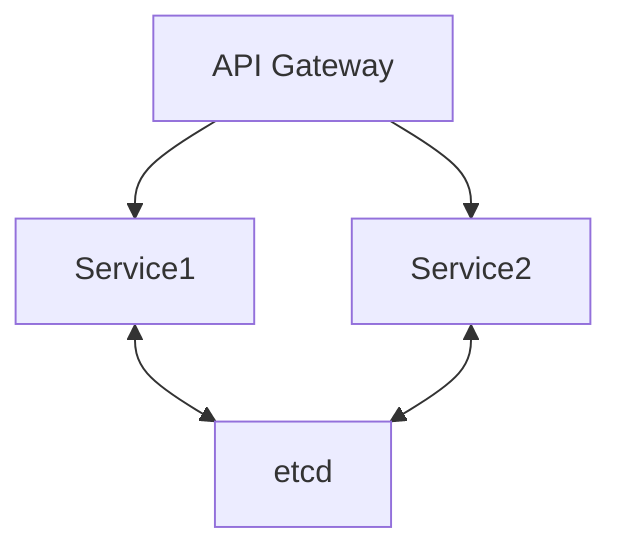
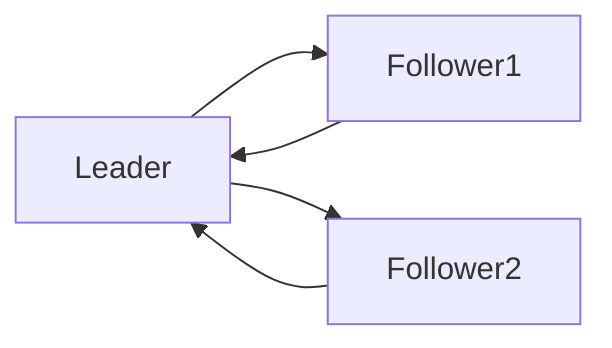
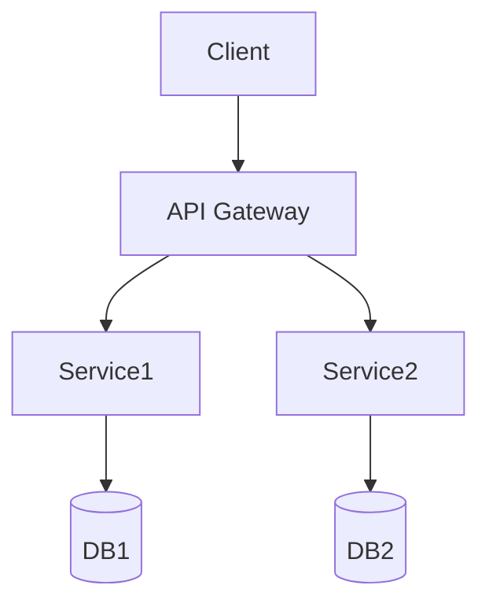

# Go分布式与微服务模式

## 1. 服务治理模式

### 定义

服务注册/发现、负载均衡、熔断、限流、分布式事务等。

### 工程案例

- etcd、consul、go-zero、grpc-go
- 代码片段：

```go
import "go.etcd.io/etcd/clientv3"
cli, _ := clientv3.New(clientv3.Config{Endpoints: []string{"localhost:2379"}})
cli.Put(context.Background(), "/services/user/instance1", "127.0.0.1:8081")
```

### 图示



### 批判性分析

- Go生态分布式组件丰富，性能优异
- 分布式事务、强一致性仍有挑战

---

## 2. 一致性算法与分布式通信

### Raft算法

- etcd、Hashicorp raft为Go实现
- 代码片段：

```go
func (n *Node) startElection() {
    n.state = Candidate
    n.votes = 1
    for peer := range n.peers {
        go n.requestVote(peer)
    }
}
```

### 图示



### 批判性分析

- Go实现Raft高性能、易读，社区活跃
- 分布式一致性复杂，需权衡CAP

---

## 3. 分布式事务与CAP权衡

### 典型模式

- Saga、TCC、2PC
- 代码片段：go-saga、dtm-labs/dtm

### 批判性分析

- 分布式事务难兼顾强一致性与高可用，需结合业务权衡

### 范畴论视角

- 节点为对象，选主/日志同步为态射，系统为分布式一致性范畴

## 4. 云原生最佳实践与行业案例

### 云原生最佳实践

- 微服务+Kubernetes：Go服务容器化、自动扩缩容、服务发现与治理
- Service Mesh（Istio、Linkerd）：流量管理、可观测性、零信任安全
- Operator模式：自动化运维、声明式资源管理

### 行业案例

- 金融：高可用账务系统、分布式风控引擎
- 互联网：大规模API网关、弹性伸缩服务
- IOT：边缘计算、分布式数据采集

### 最新开源趋势

- Go生态持续推动云原生标准，K8s、etcd、containerd等核心项目均为Go实现
- 微服务框架与服务网格深度融合，强调自动化与智能化

## 5. 哲科工程分析与多表征

- 分布式架构体现"去中心化""自治协作"哲学思想，强调系统的弹性与演化
- 工程实践需警惕"分布式陷阱"：网络分区、数据一致性、观测性不足
- Mermaid架构图、伪代码、数学表达式等多表征方式辅助理解



- 数学表达式：
  - 设N为节点集合，S为服务集合，存在映射f: N×S→C，C为通信通道集合

## 6. 分布式运维与工程经验
- 建议采用集中式日志、分布式链路追踪（如Jaeger、Zipkin）提升可观测性
- 服务注册/发现、配置中心、熔断限流等基础设施建议优先选用成熟开源组件
- 灰度发布、金丝雀发布等策略降低分布式系统变更风险

## 7. 常见分布式反模式与规避
- 忽视网络分区与超时处理，导致服务雪崩
- 过度依赖单点组件，降低系统弹性
- 分布式事务滥用，导致性能瓶颈与一致性难题

## 8. 未来趋势
- 云原生分布式架构与Serverless深度融合
- 智能化运维（AIOps）、自愈系统成为主流
- 形式化验证与自动化测试提升分布式系统可靠性

## 9. 参考文献与外部链接
- [Go微服务最佳实践](https://github.com/micro-in-cn/tutorials)
- [etcd官方文档](https://etcd.io/docs/)
- [Kubernetes官方文档](https://kubernetes.io/zh/docs/)
- [Service Mesh介绍](https://istio.io/latest/zh/docs/concepts/what-is-istio/)
- [分布式系统设计](https://martinfowler.com/articles/microservice-trade-offs.html)

## 10. 常见问题答疑（FAQ）
- Q: 服务注册/发现如何保证高可用？
  A: 采用多节点etcd/consul集群，结合健康检查与自动重连机制。
- Q: 分布式事务如何权衡一致性与性能？
  A: 业务优先采用最终一致性，关键场景可用Saga/TCC等模式。

## 11. 最佳实践清单
- 所有服务均应有健康检查与自动重启机制
- 日志、链路追踪、监控三位一体，提升可观测性
- 配置中心、注册中心、熔断限流等基础设施优先选用成熟方案

## 12. 典型错误案例剖析
- 案例：单点注册中心故障导致全局服务不可用
- 案例：分布式事务滥用，系统性能大幅下降

## 13. 进阶阅读推荐
- [Designing Data-Intensive Applications](https://dataintensive.net/)
- [微服务架构设计模式](https://microservices.io/patterns/index.html)
- [Distributed Systems for Fun and Profit](http://book.mixu.net/distsys/)
