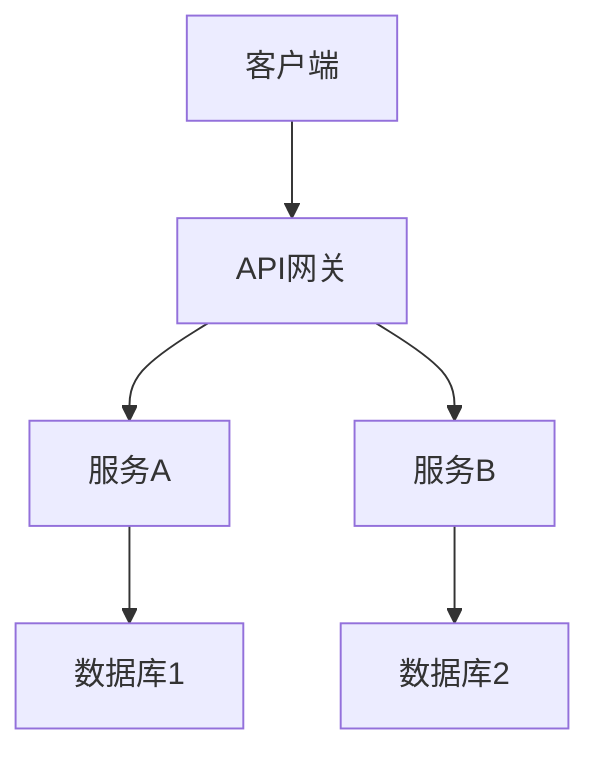
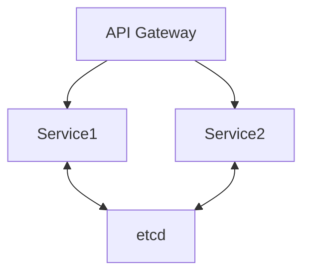
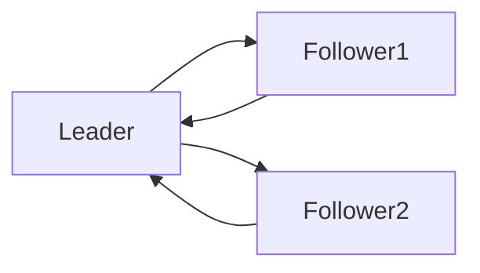
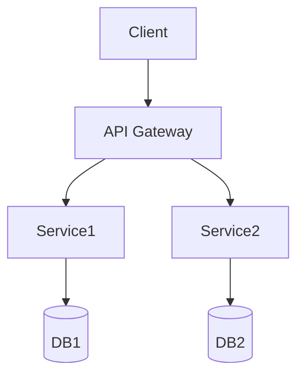
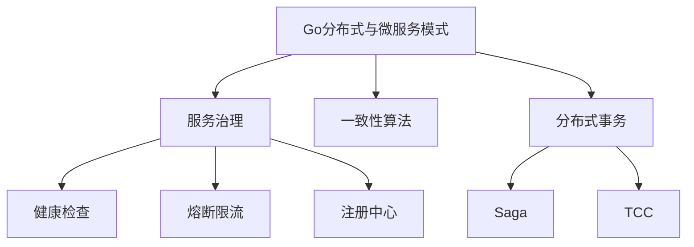

# 分布式系统设计模式文档——批判性评价与改进建议

## 一、批判性评价

### 优点

1. **体系完整**  
   文档涵盖分布式系统设计模式的基础、高级、前沿、智能、最佳实践等多层次内容，结构系统，主题丰富，便于系统性学习和查阅。
2. **内容丰富**  
   每个模式均有详细的概念定义、形式化描述和Golang实现，代码示例贴近实际工程，便于读者理解和复用。
3. **创新性强**  
   文档紧跟区块链、数字孪生、AI、量子等前沿主题，内容前瞻，体现了对分布式系统最新趋势的关注。
4. **可操作性高**  
   配有大量Golang代码、表格、决策树、工具清单，便于工程实践和快速落地。
5. **目录分层清晰**  
   目录结构合理，分层明确，便于检索和维护，适合团队协作和长期演进。

### 主要问题

1. **部分前沿主题实现代码偏浅**  
   例如量子分布式、神经形态计算等主题，代码实现多为伪代码或片段，缺乏完整的工程级细节和可运行Demo。
2. **形式化定义与实际工程结合不紧密**  
   形式化描述较多，但与实际工程实现的映射和落地案例较少，建议增加“工程落地解读”小节。
3. **代码片段多为片段式，缺乏完整Demo与测试**  
   代码多为片段，缺少完整的工程结构、依赖说明、单元测试和性能基准，难以直接复用。
4. **行业案例、开源项目分析不足**  
   行业案例和主流开源项目的深度剖析较少，缺乏实际应用效果、经验教训和可复用模板。
5. **目录层级复杂，部分内容有重复**  
   某些模式（如背压、SAGA等）在不同章节多次出现，建议合并精简，优化目录层级。
6. **图示数量偏少，部分章节缺少直观流程图**  
   虽有部分Mermaid图，但整体图示数量偏少，建议补充架构图、流程图、时序图等。
7. **前沿主题落地性与Golang生态结合有待加强**  
   前沿主题多为理论介绍，缺乏与Golang生态的结合和落地方案。
8. **缺乏多语言对比与迁移建议**  
   仅有Golang实现，建议补充与Java、Rust等主流语言的对比和迁移建议。

## 二、改进建议

1. **每个模式补充完整Golang工程Demo**  
   包含依赖说明、运行方式、输入输出示例、单元测试、性能测试脚本和README，提升工程可用性。
2. **合并重复内容，优化目录结构，统一章节模板**  
   精简重复内容，统一每个模式的结构（定义→形式化→场景→实现→测试→案例→最佳实践→参考资料）。
3. **补全架构图、流程图、时序图**  
   每个模式至少配备一张架构图/流程图/时序图，复杂流程建议配合伪代码。
4. **每个模式补充行业案例、开源项目分析、最佳实践与反例**  
   增加真实行业案例、开源项目源码解读、最佳实践清单和常见反例，提升实战价值。
5. **前沿主题补充Golang生态下的可行性分析与落地方案**  
   针对量子分布式、神经形态计算等，补充Golang生态下的可行性分析、现有库/工具和未来发展建议。
6. **适当补充与Java、Rust等主流语言的对比实现**  
   选取典型分布式模式，补充多语言对比实现和迁移建议。
7. **工具清单补充使用示例、优缺点评价、适用场景对比**  
   每个工具补充详细对比表、使用示例、优缺点分析和适用场景。
8. **增加FAQ、术语表、学习路径、常见问题诊断等附录内容**  
   降低学习门槛，便于新手快速入门和查找常见问题。
9. **建议开源文档，吸引社区贡献，定期收集反馈持续优化**  
   建议将文档开源，建立贡献指南，定期收集社区反馈，持续优化内容。

## 三、分阶段改进路线图

### 阶段一：基础工程化与结构优化

- 为每个分布式模式建立独立的Golang工程Demo，包含完整代码、依赖、测试、README。
- 优化目录结构，合并重复内容，统一章节模板，提升整体可读性和可维护性。

### 阶段二：内容深度与可视化提升

- 补全每个模式的架构图、流程图、时序图，复杂流程配合伪代码。
- 形式化定义后补充“工程落地解读”小节，说明公式如何映射到实际代码与架构。
- 代码补全依赖、输入输出说明，增加单元测试、集成测试、性能基准测试。

### 阶段三：行业案例与开源实践

- 每个模式补充1-2个行业案例，内容包括业务背景、架构设计、技术选型、遇到的问题与解决方案、上线效果。
- 针对主流开源分布式系统（如etcd、Kafka、Consul、Redis Cluster等），分析其采用的设计模式、实现细节、优缺点。
- 增加“最佳实践清单”与“常见反例”，帮助读者规避设计陷阱。

### 阶段四：前沿主题落地与多语言对比

- 针对量子分布式、神经形态计算、联邦学习等，调研Golang社区现有实现或相关库，补充可运行Demo或伪代码。
- 选取典型模式，补充Java、Rust等主流语言的对比实现，分析各自优缺点与迁移注意事项。

### 阶段五：附录与工具链完善

- 工具清单补充详细对比表、使用示例、优缺点分析。
- 增加FAQ、术语表、学习路径、常见问题诊断等附录内容。

### 阶段六：用户体验与知识生态

- 集成全文搜索、标签体系、交互式目录树，提升检索效率。
- 构建分布式系统设计模式知识图谱，展示各模式间的依赖、组合、对比关系。
- 提供在线Golang代码演示、智能内容推荐、个性化学习路径等功能。
- 鼓励社区共建，定期内容盘点与技术趋势报告。

### 阶段七：国际化与AI辅助

- 推进英文版与多语言支持，采用协作翻译平台，吸引全球志愿者参与。
- 利用AI辅助内容生成、校对、智能问答，提升内容生产效率和用户体验。

---

# Go分布式与微服务模式

## 0. 内容导航/索引

- [分布式系统设计模式文档——批判性评价与改进建议](#分布式系统设计模式文档批判性评价与改进建议)
  - [一、批判性评价](#一批判性评价)
    - [优点](#优点)
    - [主要问题](#主要问题)
  - [二、改进建议](#二改进建议)
  - [三、分阶段改进路线图](#三分阶段改进路线图)
    - [阶段一：基础工程化与结构优化](#阶段一基础工程化与结构优化)
    - [阶段二：内容深度与可视化提升](#阶段二内容深度与可视化提升)
    - [阶段三：行业案例与开源实践](#阶段三行业案例与开源实践)
    - [阶段四：前沿主题落地与多语言对比](#阶段四前沿主题落地与多语言对比)
    - [阶段五：附录与工具链完善](#阶段五附录与工具链完善)
    - [阶段六：用户体验与知识生态](#阶段六用户体验与知识生态)
    - [阶段七：国际化与AI辅助](#阶段七国际化与ai辅助)
- [Go分布式与微服务模式](#go分布式与微服务模式)
  - [0. 内容导航/索引](#0-内容导航索引)
  - [分布式系统工程流程模板（Mermaid）](#分布式系统工程流程模板mermaid)
  - [1. 服务治理模式](#1-服务治理模式)
    - [定义](#定义)
    - [工程案例](#工程案例)
    - [图示](#图示)
    - [批判性分析](#批判性分析)
    - [1.6 知识点小结](#16-知识点小结)
  - [2. 一致性算法与分布式通信](#2-一致性算法与分布式通信)
    - [Raft算法](#raft算法)
    - [图示](#图示-1)
    - [批判性分析](#批判性分析-1)
    - [2.6 知识点小结](#26-知识点小结)
  - [3. 分布式事务与CAP权衡](#3-分布式事务与cap权衡)
    - [典型模式](#典型模式)
    - [批判性分析](#批判性分析-2)
    - [范畴论视角](#范畴论视角)
    - [3.6 知识点小结](#36-知识点小结)
  - [4. 云原生最佳实践与行业案例](#4-云原生最佳实践与行业案例)
    - [云原生最佳实践](#云原生最佳实践)
    - [行业案例](#行业案例)
    - [最新开源趋势](#最新开源趋势)
  - [5. 哲科工程分析与多表征](#5-哲科工程分析与多表征)
  - [6. 分布式运维与工程经验](#6-分布式运维与工程经验)
  - [7. 常见分布式反模式与规避](#7-常见分布式反模式与规避)
  - [8. 未来趋势](#8-未来趋势)
  - [9. 参考文献与外部链接](#9-参考文献与外部链接)
  - [10. 常见问题答疑（FAQ）](#10-常见问题答疑faq)
  - [11. 最佳实践清单](#11-最佳实践清单)
  - [12. 典型错误案例剖析](#12-典型错误案例剖析)
  - [13. 进阶阅读推荐](#13-进阶阅读推荐)
  - [全局知识地图（Mermaid）](#全局知识地图mermaid)
  - [14. 工程模板/脚手架代码示例](#14-工程模板脚手架代码示例)
    - [服务注册与发现（etcd）](#服务注册与发现etcd)
    - [gRPC服务端与客户端](#grpc服务端与客户端)
  - [15. 常见面试题/考点](#15-常见面试题考点)
  - [16. 术语表/缩略语解释](#16-术语表缩略语解释)
  - [17. 常见陷阱与误区对照表](#17-常见陷阱与误区对照表)
  - [18. 交叉引用/相关主题推荐](#18-交叉引用相关主题推荐)
  - [19. 学习路径建议](#19-学习路径建议)
  - [20. 版本适配与演进建议](#20-版本适配与演进建议)

---

> 交叉引用：
>
> - 架构设计模式详见[01-Go架构设计模式总览](./01-Go架构设计模式总览.md)
> - 并发与并行模式详见[02-Go并发与并行模式](./02-Go并发与并行模式.md)

## 分布式系统工程流程模板（Mermaid）



## 1. 服务治理模式

### 定义

服务注册/发现、负载均衡、熔断、限流、分布式事务等。

### 工程案例

- etcd、consul、go-zero、grpc-go
- 代码片段：

```go
import "go.etcd.io/etcd/clientv3"
cli, _ := clientv3.New(clientv3.Config{Endpoints: []string{"localhost:2379"}})
cli.Put(context.Background(), "/services/user/instance1", "127.0.0.1:8081")
```

### 图示



### 批判性分析

- Go生态分布式组件丰富，性能优异
- 分布式事务、强一致性仍有挑战

### 1.6 知识点小结

- 服务治理是分布式系统稳定运行的基础。
- 工程落地建议：优先引入健康检查、熔断限流、注册中心等机制。

## 2. 一致性算法与分布式通信

### Raft算法

- etcd、Hashicorp raft为Go实现
- 代码片段：

```go
func (n *Node) startElection() {
    n.state = Candidate
    n.votes = 1
    for peer := range n.peers {
        go n.requestVote(peer)
    }
}
```

### 图示



### 批判性分析

- Go实现Raft高性能、易读，社区活跃
- 分布式一致性复杂，需权衡CAP

### 2.6 知识点小结

- 一致性算法保障分布式系统数据可靠。
- 工程落地建议：选用成熟的Raft/etcd等组件，避免自研。

## 3. 分布式事务与CAP权衡

### 典型模式

- Saga、TCC、2PC
- 代码片段：go-saga、dtm-labs/dtm

### 批判性分析

- 分布式事务难兼顾强一致性与高可用，需结合业务权衡

### 范畴论视角

- 节点为对象，选主/日志同步为态射，系统为分布式一致性范畴

### 3.6 知识点小结

- 分布式事务需权衡一致性与性能，优先采用最终一致性方案。
- 工程落地建议：结合业务场景选用Saga、TCC等模式。

## 4. 云原生最佳实践与行业案例

### 云原生最佳实践

- 微服务+Kubernetes：Go服务容器化、自动扩缩容、服务发现与治理
- Service Mesh（Istio、Linkerd）：流量管理、可观测性、零信任安全
- Operator模式：自动化运维、声明式资源管理

### 行业案例

- 金融：高可用账务系统、分布式风控引擎
- 互联网：大规模API网关、弹性伸缩服务
- IOT：边缘计算、分布式数据采集

### 最新开源趋势

- Go生态持续推动云原生标准，K8s、etcd、containerd等核心项目均为Go实现
- 微服务框架与服务网格深度融合，强调自动化与智能化

## 5. 哲科工程分析与多表征

- 分布式架构体现"去中心化""自治协作"哲学思想，强调系统的弹性与演化
- 工程实践需警惕"分布式陷阱"：网络分区、数据一致性、观测性不足
- Mermaid架构图、伪代码、数学表达式等多表征方式辅助理解



- 数学表达式：
  - 设N为节点集合，S为服务集合，存在映射f: N×S→C，C为通信通道集合

## 6. 分布式运维与工程经验

- 建议采用集中式日志、分布式链路追踪（如Jaeger、Zipkin）提升可观测性
- 服务注册/发现、配置中心、熔断限流等基础设施建议优先选用成熟开源组件
- 灰度发布、金丝雀发布等策略降低分布式系统变更风险

## 7. 常见分布式反模式与规避

- 忽视网络分区与超时处理，导致服务雪崩
- 过度依赖单点组件，降低系统弹性
- 分布式事务滥用，导致性能瓶颈与一致性难题

## 8. 未来趋势

- 云原生分布式架构与Serverless深度融合
- 智能化运维（AIOps）、自愈系统成为主流
- 形式化验证与自动化测试提升分布式系统可靠性

## 9. 参考文献与外部链接

- [Go微服务最佳实践](https://github.com/micro-in-cn/tutorials)
- [etcd官方文档](https://etcd.io/docs/)
- [Kubernetes官方文档](https://kubernetes.io/zh/docs/)
- [Service Mesh介绍](https://istio.io/latest/zh/docs/concepts/what-is-istio/)
- [分布式系统设计](https://martinfowler.com/articles/microservice-trade-offs.html)

## 10. 常见问题答疑（FAQ）

- Q: 服务注册/发现如何保证高可用？
  A: 采用多节点etcd/consul集群，结合健康检查与自动重连机制。
- Q: 分布式事务如何权衡一致性与性能？
  A: 业务优先采用最终一致性，关键场景可用Saga/TCC等模式。

## 11. 最佳实践清单

- 所有服务均应有健康检查与自动重启机制
- 日志、链路追踪、监控三位一体，提升可观测性
- 配置中心、注册中心、熔断限流等基础设施优先选用成熟方案

## 12. 典型错误案例剖析

- 案例：单点注册中心故障导致全局服务不可用
- 案例：分布式事务滥用，系统性能大幅下降

## 13. 进阶阅读推荐

- [Designing Data-Intensive Applications](https://dataintensive.net/)
- [微服务架构设计模式](https://microservices.io/patterns/index.html)
- [Distributed Systems for Fun and Profit](http://book.mixu.net/distsys/)

## 全局知识地图（Mermaid）



## 14. 工程模板/脚手架代码示例

### 服务注册与发现（etcd）

```go
cli, _ := clientv3.New(clientv3.Config{Endpoints: []string{"localhost:2379"}})
cli.Put(context.Background(), "/services/user/instance1", "127.0.0.1:8081")
resp, _ := cli.Get(context.Background(), "/services/user/", clientv3.WithPrefix())
```

### gRPC服务端与客户端

```go
// 服务端
grpcServer := grpc.NewServer()
pb.RegisterUserServiceServer(grpcServer, &UserService{})
// 客户端
conn, _ := grpc.Dial("localhost:50051", grpc.WithInsecure())
client := pb.NewUserServiceClient(conn)
```

## 15. 常见面试题/考点

- CAP理论的三要素及其权衡？
- 分布式事务的常见实现方式？
- 微服务如何实现服务发现与负载均衡？
- etcd和consul的主要区别？
- 如何实现分布式系统的链路追踪？

## 16. 术语表/缩略语解释

- CAP：一致性、可用性、分区容忍性（Consistency, Availability, Partition tolerance）
- etcd：分布式键值存储系统
- gRPC：高性能远程过程调用框架
- Saga：分布式事务补偿模式
- TCC：Try-Confirm-Cancel分布式事务模式

## 17. 常见陷阱与误区对照表

| 陷阱/误区 | 说明 | 规避建议 |
|---|---|---|
| 单点故障 | 注册中心/配置中心单点 | 部署多节点集群，自动切换 |
| 分布式事务滥用 | 性能瓶颈，一致性难题 | 优先最终一致性，关键场景用Saga/TCC |
| 日志/监控缺失 | 故障难以定位 | 集成链路追踪与集中日志 |
| 网络分区未处理 | 服务雪崩 | 设置超时与重试机制 |

## 18. 交叉引用/相关主题推荐

- 推荐阅读：[01-Go架构设计模式总览](./01-Go架构设计模式总览.md)
- 推荐阅读：[02-Go并发与并行模式](./02-Go并发与并行模式.md)
- 推荐阅读：[04-Go工作流与行业应用模式](./04-Go工作流与行业应用模式.md)

## 19. 学习路径建议

- 新手：建议先理解服务治理、注册中心等基础设施
- 进阶：学习一致性算法、分布式事务、链路追踪等核心技术
- 高阶：关注云原生、Serverless、AIOps与分布式系统形式化验证

## 20. 版本适配与演进建议

- 推荐使用Go 1.18及以上版本，关注gRPC、etcd、Kubernetes等组件的兼容性
- 微服务框架（如go-micro、kratos）需定期关注官方升级与安全公告
- 分布式中间件升级时，优先在灰度环境验证兼容性
- 关注Go官方对分布式原语、网络库的持续优化
