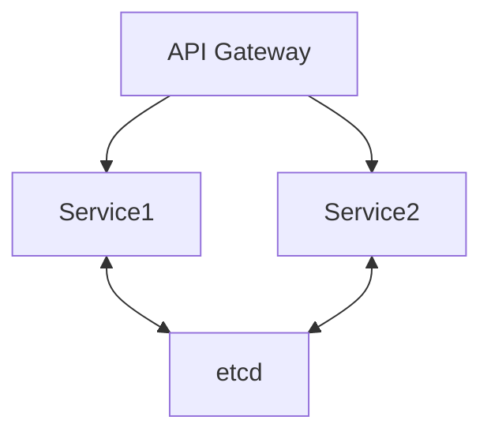
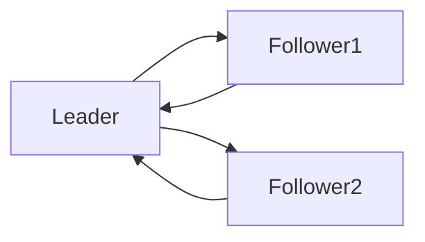

# Go分布式与微服务模式

## 1. 服务治理模式
### 定义
服务注册/发现、负载均衡、熔断、限流、分布式事务等。

### 工程案例
- etcd、consul、go-zero、grpc-go
- 代码片段：
```go
import "go.etcd.io/etcd/clientv3"
cli, _ := clientv3.New(clientv3.Config{Endpoints: []string{"localhost:2379"}})
cli.Put(context.Background(), "/services/user/instance1", "127.0.0.1:8081")
```

### 图示


### 批判性分析
- Go生态分布式组件丰富，性能优异
- 分布式事务、强一致性仍有挑战

---

## 2. 一致性算法与分布式通信
### Raft算法
- etcd、Hashicorp raft为Go实现
- 代码片段：
```go
func (n *Node) startElection() {
    n.state = Candidate
    n.votes = 1
    for peer := range n.peers {
        go n.requestVote(peer)
    }
}
```

### 图示


### 批判性分析
- Go实现Raft高性能、易读，社区活跃
- 分布式一致性复杂，需权衡CAP

---

## 3. 分布式事务与CAP权衡
### 典型模式
- Saga、TCC、2PC
- 代码片段：go-saga、dtm-labs/dtm

### 批判性分析
- 分布式事务难兼顾强一致性与高可用，需结合业务权衡

### 范畴论视角
- 节点为对象，选主/日志同步为态射，系统为分布式一致性范畴 