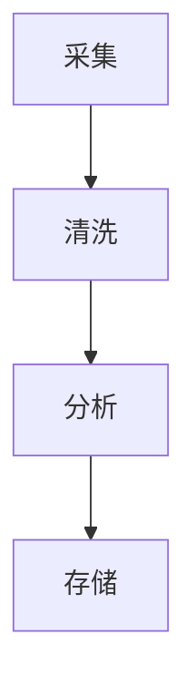

# Go工作流与行业应用模式

## 1. 工作流引擎集成
### 定义
Argo Workflows、Temporal等通过gRPC与Go服务集成。

### 工程案例
- 数据处理流水线：采集→清洗→分析→存储
- 代码片段：
```go
// 伪代码
func process() {
  go collect()
  go clean()
  go analyze()
  go store()
}
```

### 图示


### 批判性分析
- Go高并发、低延迟，适合工作流场景
- 复杂业务编排需借助外部引擎

---

## 2. 金融科技行业架构
### 事件溯源与CQRS
- 事件总线、消息队列、事件存储
- 典型项目：eventhorizon、go-cqrs

### 批判性分析
- 高可追溯性，易扩展，系统复杂度提升

---

## 3. 云原生与IOT
### 云原生
- Operator、Controller、CRD，Go为K8s官方语言
- 工程实践：K8s Operator、Argo Workflows、Tekton

### IOT
- 边缘计算、数据采集与处理

### 批判性分析
- Go在云原生领域为事实标准，IOT场景高效能

### 范畴论视角
- 工作流步骤为对象，数据流为态射，整体为工作流范畴 