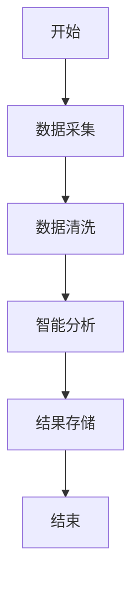
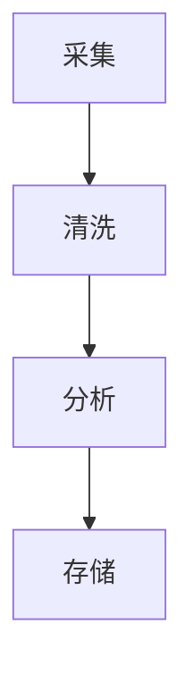
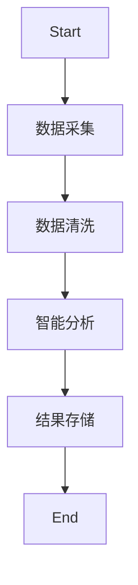
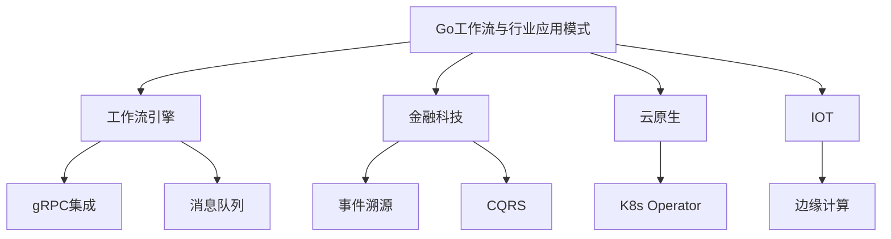

# Go工作流与行业应用模式

## 0. 内容导航/索引

- [Go工作流与行业应用模式](#go工作流与行业应用模式)
  - [0. 内容导航/索引](#0-内容导航索引)
  - [工作流自动化流程模板（Mermaid）](#工作流自动化流程模板mermaid)
  - [1. 工作流引擎集成](#1-工作流引擎集成)
    - [定义](#定义)
    - [工程案例](#工程案例)
    - [图示](#图示)
    - [批判性分析](#批判性分析)
  - [2. 金融科技行业架构](#2-金融科技行业架构)
    - [事件溯源与CQRS](#事件溯源与cqrs)
    - [批判性分析](#批判性分析-1)
  - [3. 云原生与IOT](#3-云原生与iot)
    - [云原生](#云原生)
    - [IOT](#iot)
    - [批判性分析](#批判性分析-2)
    - [范畴论视角](#范畴论视角)
  - [4. 跨行业案例与自动化趋势](#4-跨行业案例与自动化趋势)
    - [跨行业案例](#跨行业案例)
    - [自动化与智能化趋势](#自动化与智能化趋势)
  - [5. 哲科工程分析与多表征](#5-哲科工程分析与多表征)
  - [6. 行业落地经验](#6-行业落地经验)
  - [7. 常见工作流反模式与规避](#7-常见工作流反模式与规避)
  - [8. 未来发展方向](#8-未来发展方向)
  - [9. 参考文献与外部链接](#9-参考文献与外部链接)
  - [10. 常见问题答疑（FAQ）](#10-常见问题答疑faq)
  - [11. 最佳实践清单](#11-最佳实践清单)
  - [12. 典型错误案例剖析](#12-典型错误案例剖析)
  - [13. 进阶阅读推荐](#13-进阶阅读推荐)
  - [14. 工程模板/脚手架代码示例](#14-工程模板脚手架代码示例)
  - [15. 常见面试题/考点](#15-常见面试题考点)
  - [16. 术语表/缩略语解释](#16-术语表缩略语解释)
  - [17. 常见陷阱与误区对照表](#17-常见陷阱与误区对照表)

---

> 交叉引用：
>
> - 架构设计模式详见[01-Go架构设计模式总览](./01-Go架构设计模式总览.md)
> - 分布式与微服务详见[03-Go分布式与微服务模式](./03-Go分布式与微服务模式.md)

## 工作流自动化流程模板（Mermaid）



## 1. 工作流引擎集成

### 定义

Argo Workflows、Temporal等通过gRPC与Go服务集成。

### 工程案例

- 数据处理流水线：采集→清洗→分析→存储
- 代码片段：

```go
// 伪代码
func process() {
  go collect()
  go clean()
  go analyze()
  go store()
}
```

### 图示



### 批判性分析

- Go高并发、低延迟，适合工作流场景
- 复杂业务编排需借助外部引擎

### 1.6 知识点小结
- 工作流引擎集成提升了业务自动化与可追溯性。
- 工程落地建议：优先采用gRPC/消息队列等解耦通信方式。

## 2. 金融科技行业架构

### 事件溯源与CQRS

- 事件总线、消息队列、事件存储
- 典型项目：eventhorizon、go-cqrs

### 批判性分析

- 高可追溯性，易扩展，系统复杂度提升

### 2.6 知识点小结
- 金融科技行业重视事件溯源与CQRS，提升系统可审计性。
- 工程落地建议：结合事件总线与幂等机制设计账务系统。

---

## 3. 云原生与IOT

### 云原生

- Operator、Controller、CRD，Go为K8s官方语言
- 工程实践：K8s Operator、Argo Workflows、Tekton

### IOT

- 边缘计算、数据采集与处理

### 批判性分析

- Go在云原生领域为事实标准，IOT场景高效能

### 3.6 知识点小结
- 云原生与IOT场景下，Go具备高性能与生态优势。
- 工程落地建议：优先选用K8s Operator、边缘计算等方案。

### 范畴论视角

- 工作流步骤为对象，数据流为态射，整体为工作流范畴

## 4. 跨行业案例与自动化趋势

### 跨行业案例

- 金融：自动化清算、智能风控、事件驱动账务流水
- 制造：IOT数据采集、边缘智能、生产流程自动化
- 互联网：内容分发、广告投放、用户行为分析

### 自动化与智能化趋势

- 工作流引擎与AI/ML结合，实现智能决策与自适应流程
- 低代码/无代码平台推动业务自动化，Go作为后端引擎广泛应用

## 5. 哲科工程分析与多表征

- 工作流模式体现"过程自动化""自组织"哲学思想，强调系统的灵活性与可演化性
- 工程实践需关注"流程僵化""异常处理"问题，保持系统弹性
- Mermaid流程图、伪代码、数学表达式等多表征方式辅助理解



- 数学表达式：
  - 设F为流程集合，S为步骤集合，存在映射f: F×S→R，R为结果集合

## 6. 行业落地经验

- 金融行业建议采用事件驱动架构，提升审计与可追溯性
- 制造与IOT领域优先考虑边缘计算与数据本地处理，降低延迟
- 互联网行业可结合Serverless与自动化工作流提升弹性与效率

## 7. 常见工作流反模式与规避

- 流程僵化，难以适应业务变化，建议采用可配置、可编排的工作流引擎
- 异常处理缺失，导致流程中断或数据丢失
- 过度依赖人工干预，降低自动化水平

## 8. 未来发展方向

- 工作流与AI/ML深度融合，实现智能决策与自适应流程
- 低代码/无代码平台推动业务创新，Go作为后端引擎持续扩展
- 行业标准化与流程互操作性提升

## 9. 参考文献与外部链接

- [Argo Workflows官方文档](https://argoproj.github.io/argo-workflows/)
- [Temporal官方文档](https://docs.temporal.io/)
- [事件驱动架构](https://martinfowler.com/articles/201701-event-driven.html)
- [Serverless架构](https://martinfowler.com/articles/serverless.html)
- [IOT边缘计算](https://azure.microsoft.com/zh-cn/overview/what-is-edge-computing/)

## 10. 常见问题答疑（FAQ）

- Q: 工作流引擎如何与Go服务集成？
  A: 通过gRPC、REST API或消息队列实现解耦与异步通信。
- Q: 如何处理工作流中的异常与补偿？
  A: 设计幂等操作、补偿机制和异常捕获，保证流程健壮。

## 11. 最佳实践清单

- 工作流节点设计应支持重试与补偿
- 业务流程可视化，便于监控与优化
- 结合事件驱动架构提升系统弹性

## 12. 典型错误案例剖析

- 案例：流程异常未捕获，导致数据丢失
- 案例：人工节点过多，自动化水平低，效率受限

## 13. 进阶阅读推荐

- [Workflow Patterns](http://www.workflowpatterns.com/)
- [Practical Event-Driven Microservices](https://www.oreilly.com/library/view/practical-event-driven-microservices-architecture/9781098113820/)
- [Serverless Workflow Specification](https://serverlessworkflow.io/)

## 14. 工程模板/脚手架代码示例
### Argo Workflows任务定义（YAML）
```yaml
apiVersion: argoproj.io/v1alpha1
kind: Workflow
metadata:
  generateName: sample-pipeline-
spec:
  entrypoint: main
  templates:
  - name: main
    steps:
    - - name: collect
        template: collect
    - - name: clean
        template: clean
    - - name: analyze
        template: analyze
    - - name: store
        template: store
  - name: collect
    container:
      image: busybox
      command: [sh, -c]
      args: ["echo collect"]
```
### Go集成消息队列（NATS）
```go
nc, _ := nats.Connect(nats.DefaultURL)
nc.Publish("events", []byte("data"))
nc.Subscribe("events", func(m *nats.Msg) { /* 处理消息 */ })
```

## 15. 常见面试题/考点
- 工作流引擎与Go服务集成的常见方式？
- 事件驱动架构的优势与挑战？
- 如何设计幂等的工作流节点？
- 金融行业常用的事件溯源模式？
- IOT场景下Go的优势体现在哪些方面？

## 全局知识地图（Mermaid）


## 16. 术语表/缩略语解释
- BPMN：业务流程建模与标注（Business Process Model and Notation）
- EDA：事件驱动架构（Event-Driven Architecture）
- IOT：物联网（Internet of Things）
- CRD：自定义资源定义（Custom Resource Definition）
- Operator：K8s自动化运维控制器

## 17. 常见陷阱与误区对照表
| 陷阱/误区 | 说明 | 规避建议 |
|---|---|---|
| 流程僵化 | 难以适应业务变化 | 采用可配置、可编排引擎 |
| 异常处理缺失 | 流程中断或数据丢失 | 设计补偿与重试机制 |
| 人工节点过多 | 自动化水平低 | 优化流程，减少人工干预 |
| 事件幂等性缺失 | 重复事件导致数据异常 | 设计幂等操作与唯一标识 |
