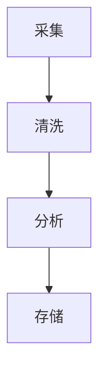
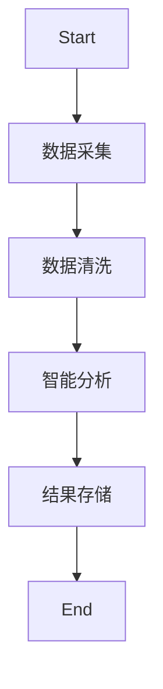

# Go工作流与行业应用模式

## 1. 工作流引擎集成

### 定义

Argo Workflows、Temporal等通过gRPC与Go服务集成。

### 工程案例

- 数据处理流水线：采集→清洗→分析→存储
- 代码片段：

```go
// 伪代码
func process() {
  go collect()
  go clean()
  go analyze()
  go store()
}
```

### 图示



### 批判性分析

- Go高并发、低延迟，适合工作流场景
- 复杂业务编排需借助外部引擎

---

## 2. 金融科技行业架构

### 事件溯源与CQRS

- 事件总线、消息队列、事件存储
- 典型项目：eventhorizon、go-cqrs

### 批判性分析

- 高可追溯性，易扩展，系统复杂度提升

---

## 3. 云原生与IOT

### 云原生

- Operator、Controller、CRD，Go为K8s官方语言
- 工程实践：K8s Operator、Argo Workflows、Tekton

### IOT

- 边缘计算、数据采集与处理

### 批判性分析

- Go在云原生领域为事实标准，IOT场景高效能

### 范畴论视角

- 工作流步骤为对象，数据流为态射，整体为工作流范畴

## 4. 跨行业案例与自动化趋势

### 跨行业案例

- 金融：自动化清算、智能风控、事件驱动账务流水
- 制造：IOT数据采集、边缘智能、生产流程自动化
- 互联网：内容分发、广告投放、用户行为分析

### 自动化与智能化趋势

- 工作流引擎与AI/ML结合，实现智能决策与自适应流程
- 低代码/无代码平台推动业务自动化，Go作为后端引擎广泛应用

## 5. 哲科工程分析与多表征

- 工作流模式体现"过程自动化""自组织"哲学思想，强调系统的灵活性与可演化性
- 工程实践需关注"流程僵化""异常处理"问题，保持系统弹性
- Mermaid流程图、伪代码、数学表达式等多表征方式辅助理解



- 数学表达式：
  - 设F为流程集合，S为步骤集合，存在映射f: F×S→R，R为结果集合

## 6. 行业落地经验
- 金融行业建议采用事件驱动架构，提升审计与可追溯性
- 制造与IOT领域优先考虑边缘计算与数据本地处理，降低延迟
- 互联网行业可结合Serverless与自动化工作流提升弹性与效率

## 7. 常见工作流反模式与规避
- 流程僵化，难以适应业务变化，建议采用可配置、可编排的工作流引擎
- 异常处理缺失，导致流程中断或数据丢失
- 过度依赖人工干预，降低自动化水平

## 8. 未来发展方向
- 工作流与AI/ML深度融合，实现智能决策与自适应流程
- 低代码/无代码平台推动业务创新，Go作为后端引擎持续扩展
- 行业标准化与流程互操作性提升

## 9. 参考文献与外部链接
- [Argo Workflows官方文档](https://argoproj.github.io/argo-workflows/)
- [Temporal官方文档](https://docs.temporal.io/)
- [事件驱动架构](https://martinfowler.com/articles/201701-event-driven.html)
- [Serverless架构](https://martinfowler.com/articles/serverless.html)
- [IOT边缘计算](https://azure.microsoft.com/zh-cn/overview/what-is-edge-computing/)

## 10. 常见问题答疑（FAQ）
- Q: 工作流引擎如何与Go服务集成？
  A: 通过gRPC、REST API或消息队列实现解耦与异步通信。
- Q: 如何处理工作流中的异常与补偿？
  A: 设计幂等操作、补偿机制和异常捕获，保证流程健壮。

## 11. 最佳实践清单
- 工作流节点设计应支持重试与补偿
- 业务流程可视化，便于监控与优化
- 结合事件驱动架构提升系统弹性

## 12. 典型错误案例剖析
- 案例：流程异常未捕获，导致数据丢失
- 案例：人工节点过多，自动化水平低，效率受限

## 13. 进阶阅读推荐
- [Workflow Patterns](http://www.workflowpatterns.com/)
- [Practical Event-Driven Microservices](https://www.oreilly.com/library/view/practical-event-driven-microservices-architecture/9781098113820/)
- [Serverless Workflow Specification](https://serverlessworkflow.io/)
