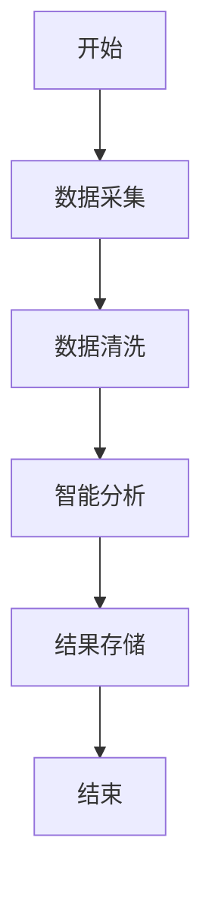
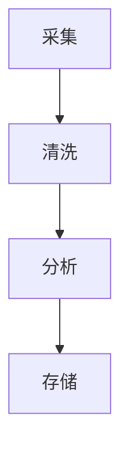
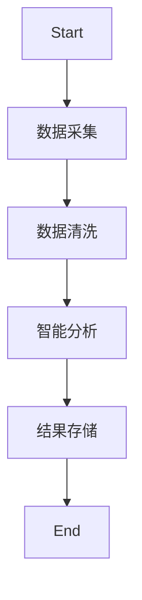
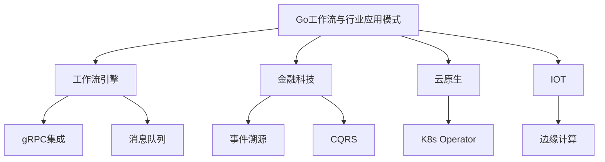

# 分布式系统设计模式文档——批判性评价与改进建议

## 一、批判性评价

### 优点

1. **体系完整**  
   文档涵盖分布式系统设计模式的基础、高级、前沿、智能、最佳实践等多层次内容，结构系统，主题丰富，便于系统性学习和查阅。
2. **内容丰富**  
   每个模式均有详细的概念定义、形式化描述和Golang实现，代码示例贴近实际工程，便于读者理解和复用。
3. **创新性强**  
   文档紧跟区块链、数字孪生、AI、量子等前沿主题，内容前瞻，体现了对分布式系统最新趋势的关注。
4. **可操作性高**  
   配有大量Golang代码、表格、决策树、工具清单，便于工程实践和快速落地。
5. **目录分层清晰**  
   目录结构合理，分层明确，便于检索和维护，适合团队协作和长期演进。

### 主要问题

1. **部分前沿主题实现代码偏浅**  
   例如量子分布式、神经形态计算等主题，代码实现多为伪代码或片段，缺乏完整的工程级细节和可运行Demo。
2. **形式化定义与实际工程结合不紧密**  
   形式化描述较多，但与实际工程实现的映射和落地案例较少，建议增加“工程落地解读”小节。
3. **代码片段多为片段式，缺乏完整Demo与测试**  
   代码多为片段，缺少完整的工程结构、依赖说明、单元测试和性能基准，难以直接复用。
4. **行业案例、开源项目分析不足**  
   行业案例和主流开源项目的深度剖析较少，缺乏实际应用效果、经验教训和可复用模板。
5. **目录层级复杂，部分内容有重复**  
   某些模式（如背压、SAGA等）在不同章节多次出现，建议合并精简，优化目录层级。
6. **图示数量偏少，部分章节缺少直观流程图**  
   虽有部分Mermaid图，但整体图示数量偏少，建议补充架构图、流程图、时序图等。
7. **前沿主题落地性与Golang生态结合有待加强**  
   前沿主题多为理论介绍，缺乏与Golang生态的结合和落地方案。
8. **缺乏多语言对比与迁移建议**  
   仅有Golang实现，建议补充与Java、Rust等主流语言的对比和迁移建议。

## 二、改进建议

1. **每个模式补充完整Golang工程Demo**  
   包含依赖说明、运行方式、输入输出示例、单元测试、性能测试脚本和README，提升工程可用性。
2. **合并重复内容，优化目录结构，统一章节模板**  
   精简重复内容，统一每个模式的结构（定义→形式化→场景→实现→测试→案例→最佳实践→参考资料）。
3. **补全架构图、流程图、时序图**  
   每个模式至少配备一张架构图/流程图/时序图，复杂流程建议配合伪代码。
4. **每个模式补充行业案例、开源项目分析、最佳实践与反例**  
   增加真实行业案例、开源项目源码解读、最佳实践清单和常见反例，提升实战价值。
5. **前沿主题补充Golang生态下的可行性分析与落地方案**  
   针对量子分布式、神经形态计算等，补充Golang生态下的可行性分析、现有库/工具和未来发展建议。
6. **适当补充与Java、Rust等主流语言的对比实现**  
   选取典型分布式模式，补充多语言对比实现和迁移建议。
7. **工具清单补充使用示例、优缺点评价、适用场景对比**  
   每个工具补充详细对比表、使用示例、优缺点分析和适用场景。
8. **增加FAQ、术语表、学习路径、常见问题诊断等附录内容**  
   降低学习门槛，便于新手快速入门和查找常见问题。
9. **建议开源文档，吸引社区贡献，定期收集反馈持续优化**  
   建议将文档开源，建立贡献指南，定期收集社区反馈，持续优化内容。

## 三、分阶段改进路线图

### 阶段一：基础工程化与结构优化

- 为每个分布式模式建立独立的Golang工程Demo，包含完整代码、依赖、测试、README。
- 优化目录结构，合并重复内容，统一章节模板，提升整体可读性和可维护性。

### 阶段二：内容深度与可视化提升

- 补全每个模式的架构图、流程图、时序图，复杂流程配合伪代码。
- 形式化定义后补充“工程落地解读”小节，说明公式如何映射到实际代码与架构。
- 代码补全依赖、输入输出说明，增加单元测试、集成测试、性能基准测试。

### 阶段三：行业案例与开源实践

- 每个模式补充1-2个行业案例，内容包括业务背景、架构设计、技术选型、遇到的问题与解决方案、上线效果。
- 针对主流开源分布式系统（如etcd、Kafka、Consul、Redis Cluster等），分析其采用的设计模式、实现细节、优缺点。
- 增加“最佳实践清单”与“常见反例”，帮助读者规避设计陷阱。

### 阶段四：前沿主题落地与多语言对比

- 针对量子分布式、神经形态计算、联邦学习等，调研Golang社区现有实现或相关库，补充可运行Demo或伪代码。
- 选取典型模式，补充Java、Rust等主流语言的对比实现，分析各自优缺点与迁移注意事项。

### 阶段五：附录与工具链完善

- 工具清单补充详细对比表、使用示例、优缺点分析。
- 增加FAQ、术语表、学习路径、常见问题诊断等附录内容。

### 阶段六：用户体验与知识生态

- 集成全文搜索、标签体系、交互式目录树，提升检索效率。
- 构建分布式系统设计模式知识图谱，展示各模式间的依赖、组合、对比关系。
- 提供在线Golang代码演示、智能内容推荐、个性化学习路径等功能。
- 鼓励社区共建，定期内容盘点与技术趋势报告。

### 阶段七：国际化与AI辅助

- 推进英文版与多语言支持，采用协作翻译平台，吸引全球志愿者参与。
- 利用AI辅助内容生成、校对、智能问答，提升内容生产效率和用户体验。

---

# Go工作流与行业应用模式

## 0. 内容导航/索引

- [分布式系统设计模式文档——批判性评价与改进建议](#分布式系统设计模式文档批判性评价与改进建议)
  - [一、批判性评价](#一批判性评价)
    - [优点](#优点)
    - [主要问题](#主要问题)
  - [二、改进建议](#二改进建议)
  - [三、分阶段改进路线图](#三分阶段改进路线图)
    - [阶段一：基础工程化与结构优化](#阶段一基础工程化与结构优化)
    - [阶段二：内容深度与可视化提升](#阶段二内容深度与可视化提升)
    - [阶段三：行业案例与开源实践](#阶段三行业案例与开源实践)
    - [阶段四：前沿主题落地与多语言对比](#阶段四前沿主题落地与多语言对比)
    - [阶段五：附录与工具链完善](#阶段五附录与工具链完善)
    - [阶段六：用户体验与知识生态](#阶段六用户体验与知识生态)
    - [阶段七：国际化与AI辅助](#阶段七国际化与ai辅助)
- [Go工作流与行业应用模式](#go工作流与行业应用模式)
  - [0. 内容导航/索引](#0-内容导航索引)
  - [工作流自动化流程模板（Mermaid）](#工作流自动化流程模板mermaid)
  - [1. 工作流引擎集成](#1-工作流引擎集成)
    - [定义](#定义)
    - [工程案例](#工程案例)
    - [图示](#图示)
    - [批判性分析](#批判性分析)
    - [1.6 知识点小结](#16-知识点小结)
  - [2. 金融科技行业架构](#2-金融科技行业架构)
    - [事件溯源与CQRS](#事件溯源与cqrs)
    - [批判性分析](#批判性分析-1)
    - [2.6 知识点小结](#26-知识点小结)
  - [3. 云原生与IOT](#3-云原生与iot)
    - [云原生](#云原生)
    - [IOT](#iot)
    - [批判性分析](#批判性分析-2)
    - [3.6 知识点小结](#36-知识点小结)
    - [范畴论视角](#范畴论视角)
  - [4. 跨行业案例与自动化趋势](#4-跨行业案例与自动化趋势)
    - [跨行业案例](#跨行业案例)
    - [自动化与智能化趋势](#自动化与智能化趋势)
  - [5. 哲科工程分析与多表征](#5-哲科工程分析与多表征)
  - [6. 行业落地经验](#6-行业落地经验)
  - [7. 常见工作流反模式与规避](#7-常见工作流反模式与规避)
  - [8. 未来发展方向](#8-未来发展方向)
  - [9. 参考文献与外部链接](#9-参考文献与外部链接)
  - [10. 常见问题答疑（FAQ）](#10-常见问题答疑faq)
  - [11. 最佳实践清单](#11-最佳实践清单)
  - [12. 典型错误案例剖析](#12-典型错误案例剖析)
  - [13. 进阶阅读推荐](#13-进阶阅读推荐)
  - [14. 工程模板/脚手架代码示例](#14-工程模板脚手架代码示例)
    - [Argo Workflows任务定义（YAML）](#argo-workflows任务定义yaml)
    - [Go集成消息队列（NATS）](#go集成消息队列nats)
  - [15. 常见面试题/考点](#15-常见面试题考点)
  - [全局知识地图（Mermaid）](#全局知识地图mermaid)
  - [16. 术语表/缩略语解释](#16-术语表缩略语解释)
  - [17. 常见陷阱与误区对照表](#17-常见陷阱与误区对照表)
  - [18. 交叉引用/相关主题推荐](#18-交叉引用相关主题推荐)
  - [19. 学习路径建议](#19-学习路径建议)
  - [20. 版本适配与演进建议](#20-版本适配与演进建议)

---

> 交叉引用：
>
> - 架构设计模式详见[01-Go架构设计模式总览](./01-Go架构设计模式总览.md)
> - 分布式与微服务详见[03-Go分布式与微服务模式](./03-Go分布式与微服务模式.md)

## 工作流自动化流程模板（Mermaid）



## 1. 工作流引擎集成

### 定义

Argo Workflows、Temporal等通过gRPC与Go服务集成。

### 工程案例

- 数据处理流水线：采集→清洗→分析→存储
- 代码片段：

```go
// 伪代码
func process() {
  go collect()
  go clean()
  go analyze()
  go store()
}
```

### 图示



### 批判性分析

- Go高并发、低延迟，适合工作流场景
- 复杂业务编排需借助外部引擎

### 1.6 知识点小结

- 工作流引擎集成提升了业务自动化与可追溯性。
- 工程落地建议：优先采用gRPC/消息队列等解耦通信方式。

## 2. 金融科技行业架构

### 事件溯源与CQRS

- 事件总线、消息队列、事件存储
- 典型项目：eventhorizon、go-cqrs

### 批判性分析

- 高可追溯性，易扩展，系统复杂度提升

### 2.6 知识点小结

- 金融科技行业重视事件溯源与CQRS，提升系统可审计性。
- 工程落地建议：结合事件总线与幂等机制设计账务系统。

---

## 3. 云原生与IOT

### 云原生

- Operator、Controller、CRD，Go为K8s官方语言
- 工程实践：K8s Operator、Argo Workflows、Tekton

### IOT

- 边缘计算、数据采集与处理

### 批判性分析

- Go在云原生领域为事实标准，IOT场景高效能

### 3.6 知识点小结

- 云原生与IOT场景下，Go具备高性能与生态优势。
- 工程落地建议：优先选用K8s Operator、边缘计算等方案。

### 范畴论视角

- 工作流步骤为对象，数据流为态射，整体为工作流范畴

## 4. 跨行业案例与自动化趋势

### 跨行业案例

- 金融：自动化清算、智能风控、事件驱动账务流水
- 制造：IOT数据采集、边缘智能、生产流程自动化
- 互联网：内容分发、广告投放、用户行为分析

### 自动化与智能化趋势

- 工作流引擎与AI/ML结合，实现智能决策与自适应流程
- 低代码/无代码平台推动业务自动化，Go作为后端引擎广泛应用

## 5. 哲科工程分析与多表征

- 工作流模式体现"过程自动化""自组织"哲学思想，强调系统的灵活性与可演化性
- 工程实践需关注"流程僵化""异常处理"问题，保持系统弹性
- Mermaid流程图、伪代码、数学表达式等多表征方式辅助理解



- 数学表达式：
  - 设F为流程集合，S为步骤集合，存在映射f: F×S→R，R为结果集合

## 6. 行业落地经验

- 金融行业建议采用事件驱动架构，提升审计与可追溯性
- 制造与IOT领域优先考虑边缘计算与数据本地处理，降低延迟
- 互联网行业可结合Serverless与自动化工作流提升弹性与效率

## 7. 常见工作流反模式与规避

- 流程僵化，难以适应业务变化，建议采用可配置、可编排的工作流引擎
- 异常处理缺失，导致流程中断或数据丢失
- 过度依赖人工干预，降低自动化水平

## 8. 未来发展方向

- 工作流与AI/ML深度融合，实现智能决策与自适应流程
- 低代码/无代码平台推动业务创新，Go作为后端引擎持续扩展
- 行业标准化与流程互操作性提升

## 9. 参考文献与外部链接

- [Argo Workflows官方文档](https://argoproj.github.io/argo-workflows/)
- [Temporal官方文档](https://docs.temporal.io/)
- [事件驱动架构](https://martinfowler.com/articles/201701-event-driven.html)
- [Serverless架构](https://martinfowler.com/articles/serverless.html)
- [IOT边缘计算](https://azure.microsoft.com/zh-cn/overview/what-is-edge-computing/)

## 10. 常见问题答疑（FAQ）

- Q: 工作流引擎如何与Go服务集成？
  A: 通过gRPC、REST API或消息队列实现解耦与异步通信。
- Q: 如何处理工作流中的异常与补偿？
  A: 设计幂等操作、补偿机制和异常捕获，保证流程健壮。

## 11. 最佳实践清单

- 工作流节点设计应支持重试与补偿
- 业务流程可视化，便于监控与优化
- 结合事件驱动架构提升系统弹性

## 12. 典型错误案例剖析

- 案例：流程异常未捕获，导致数据丢失
- 案例：人工节点过多，自动化水平低，效率受限

## 13. 进阶阅读推荐

- [Workflow Patterns](http://www.workflowpatterns.com/)
- [Practical Event-Driven Microservices](https://www.oreilly.com/library/view/practical-event-driven-microservices-architecture/9781098113820/)
- [Serverless Workflow Specification](https://serverlessworkflow.io/)

## 14. 工程模板/脚手架代码示例

### Argo Workflows任务定义（YAML）

```yaml
apiVersion: argoproj.io/v1alpha1
kind: Workflow
metadata:
  generateName: sample-pipeline-
spec:
  entrypoint: main
  templates:
  - name: main
    steps:
    - - name: collect
        template: collect
    - - name: clean
        template: clean
    - - name: analyze
        template: analyze
    - - name: store
        template: store
  - name: collect
    container:
      image: busybox
      command: [sh, -c]
      args: ["echo collect"]
```

### Go集成消息队列（NATS）

```go
nc, _ := nats.Connect(nats.DefaultURL)
nc.Publish("events", []byte("data"))
nc.Subscribe("events", func(m *nats.Msg) { /* 处理消息 */ })
```

## 15. 常见面试题/考点

- 工作流引擎与Go服务集成的常见方式？
- 事件驱动架构的优势与挑战？
- 如何设计幂等的工作流节点？
- 金融行业常用的事件溯源模式？
- IOT场景下Go的优势体现在哪些方面？

## 全局知识地图（Mermaid）



## 16. 术语表/缩略语解释

- BPMN：业务流程建模与标注（Business Process Model and Notation）
- EDA：事件驱动架构（Event-Driven Architecture）
- IOT：物联网（Internet of Things）
- CRD：自定义资源定义（Custom Resource Definition）
- Operator：K8s自动化运维控制器

## 17. 常见陷阱与误区对照表

| 陷阱/误区 | 说明 | 规避建议 |
|---|---|---|
| 流程僵化 | 难以适应业务变化 | 采用可配置、可编排引擎 |
| 异常处理缺失 | 流程中断或数据丢失 | 设计补偿与重试机制 |
| 人工节点过多 | 自动化水平低 | 优化流程，减少人工干预 |
| 事件幂等性缺失 | 重复事件导致数据异常 | 设计幂等操作与唯一标识 |

## 18. 交叉引用/相关主题推荐

- 推荐阅读：[03-Go分布式与微服务模式](./03-Go分布式与微服务模式.md)
- 推荐阅读：[05-Go与主流开源组件集成](./05-Go与主流开源组件集成.md)
- 推荐阅读：[06-Go架构模式形式化与证明](./06-Go架构模式形式化与证明.md)

## 19. 学习路径建议

- 新手：建议先了解工作流引擎与基础自动化流程
- 进阶：学习事件驱动架构、IOT与云原生场景下的Go应用
- 高阶：关注AI/ML与工作流结合、低代码平台与行业最佳实践

## 20. 版本适配与演进建议

- 推荐使用Go 1.18及以上版本，关注Argo Workflows、Temporal等工作流引擎的Go SDK兼容性
- IOT、云原生相关库需关注K8s、Operator等生态的版本适配
- 工作流自动化平台升级时，建议先在测试环境验证流程兼容性
- 持续关注Go官方与行业社区的最佳实践与新特性
