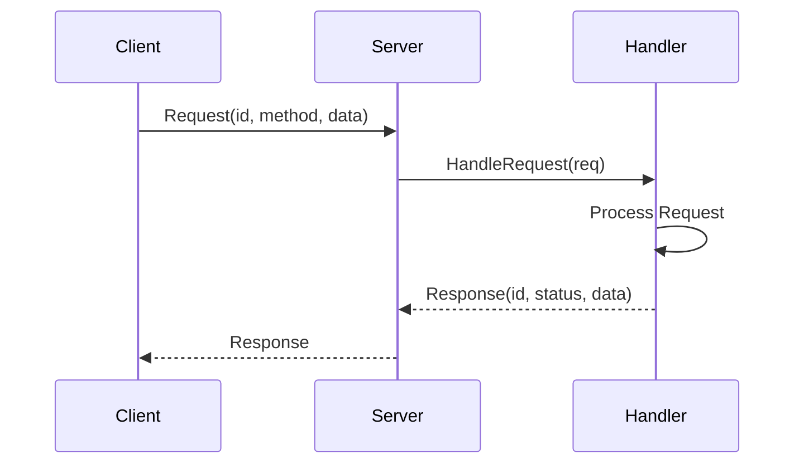
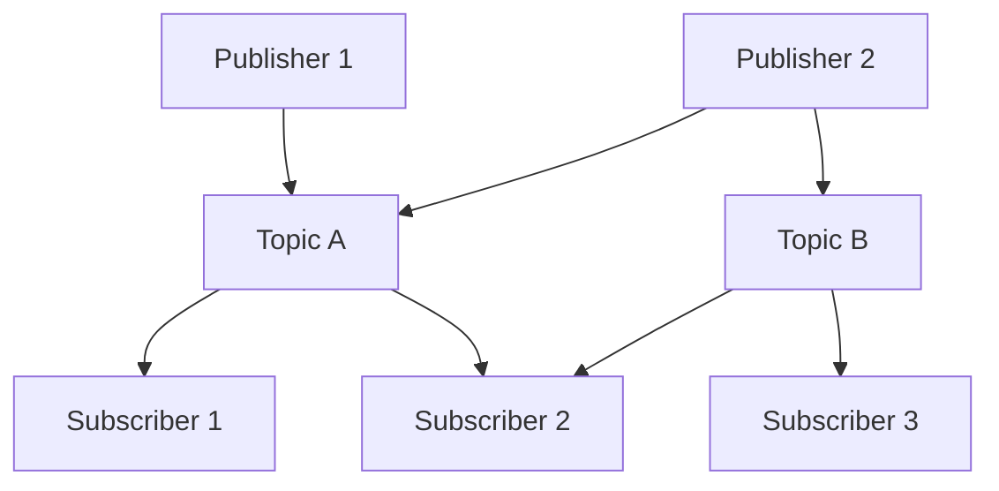
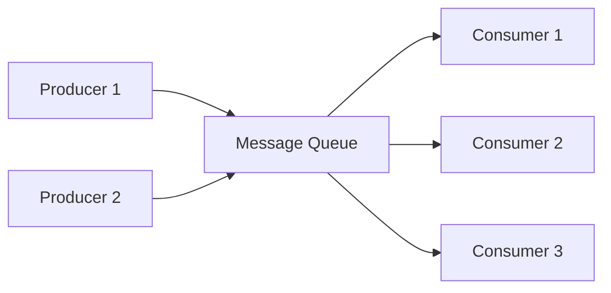
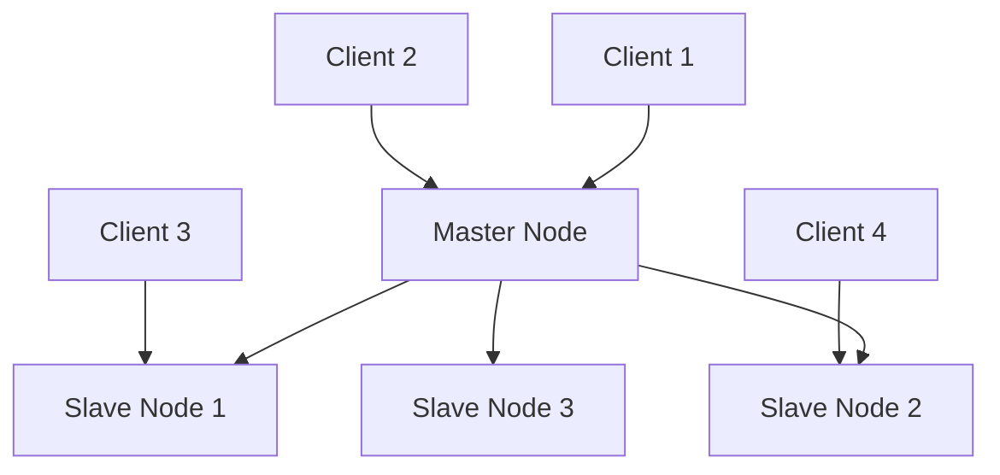

# 分布式系统设计模式 - Golang实现与分析

## 目录

- [分布式系统设计模式 - Golang实现与分析](#分布式系统设计模式---golang实现与分析)
  - [目录](#目录)
  - [1. 分布式通信模式](#1-分布式通信模式)
    - [1.1 请求-响应模式](#11-请求-响应模式)
      - [概念定义](#概念定义)
      - [优缺点分析](#优缺点分析)
      - [时序图](#时序图)
      - [相关开源组件](#相关开源组件)
    - [1.2 发布-订阅模式](#12-发布-订阅模式)
      - [1.2.1 概念定义](#121-概念定义)
      - [优缺点分析](#优缺点分析-1)
      - [架构图](#架构图)
      - [相关开源组件](#相关开源组件-1)
    - [1.3 消息队列模式](#13-消息队列模式)
      - [概念定义](#概念定义-1)
      - [优缺点分析](#优缺点分析-2)
      - [流程图](#流程图)
      - [相关开源组件](#相关开源组件-2)
    - [1.4 RPC模式](#14-rpc模式)
      - [概念定义](#概念定义-2)
    - [1.5 流处理模式](#15-流处理模式)
      - [概念定义](#概念定义-3)
  - [2. 一致性与复制模式](#2-一致性与复制模式)
    - [2.1 主从复制](#21-主从复制)
      - [概念定义](#概念定义-4)
      - [优缺点分析](#优缺点分析-3)
      - [架构图](#架构图-1)
      - [相关开源组件](#相关开源组件-3)
    - [2.2 多主复制](#22-多主复制)
      - [概念定义](#概念定义-5)
    - [2.3 无主复制](#23-无主复制)
      - [概念定义](#概念定义-6)
  - [4. 容错与弹性模式](#4-容错与弹性模式)
    - [4.1 熔断器模式](#41-熔断器模式)
      - [概念定义](#概念定义-7)
      - [优缺点分析](#优缺点分析-4)
    - [4.2 舱壁模式](#42-舱壁模式)
      - [概念定义](#概念定义-8)
      - [优缺点分析](#优缺点分析-5)
    - [4.3 超时与重试](#43-超时与重试)
      - [概念定义](#概念定义-9)
    - [4.4 背压模式](#44-背压模式)
      - [概念定义](#概念定义-10)
  - [5. 事务与一致性模式](#5-事务与一致性模式)
    - [5.1 两阶段提交](#51-两阶段提交)
      - [概念定义](#概念定义-11)
      - [优缺点分析](#优缺点分析-6)
    - [5.2 三阶段提交](#52-三阶段提交)
      - [概念定义](#概念定义-12)
    - [5.3 SAGA模式](#53-saga模式)
      - [概念定义](#概念定义-13)
    - [5.4 TCC模式](#54-tcc模式)
      - [概念定义](#概念定义-14)
    - [4.4 背压模式](#44-背压模式-1)
      - [概念定义](#概念定义-15)
  - [5. 事务与一致性模式](#5-事务与一致性模式-1)
    - [5.1 两阶段提交](#51-两阶段提交-1)
      - [概念定义](#概念定义-16)
    - [5.2 三阶段提交](#52-三阶段提交-1)
      - [概念定义](#概念定义-17)
    - [5.4 TCC模式](#54-tcc模式-1)
      - [概念定义](#概念定义-18)
  - [9. 形式化定义与数学证明](#9-形式化定义与数学证明)
    - [9.1 分布式系统形式化模型](#91-分布式系统形式化模型)
    - [9.2 最终一致性形式化定义](#92-最终一致性形式化定义)
    - [9.3 CAP定理形式化](#93-cap定理形式化)
  - [10. Golang实现与开源组件](#10-golang实现与开源组件)
    - [10.1 核心开源组件](#101-核心开源组件)
      - [etcd](#etcd)
      - [Consul](#consul)
      - [gRPC](#grpc)
    - [10.2 性能优化最佳实践](#102-性能优化最佳实践)
      - [连接池管理](#连接池管理)
      - [负载均衡](#负载均衡)
  - [11. 性能分析与最佳实践](#11-性能分析与最佳实践)
    - [11.1 性能指标](#111-性能指标)
      - [延迟（Latency）](#延迟latency)
      - [吞吐量（Throughput）](#吞吐量throughput)
      - [可用性（Availability）](#可用性availability)
    - [11.2 监控与可观测性](#112-监控与可观测性)
      - [指标收集](#指标收集)
      - [分布式追踪](#分布式追踪)
    - [11.3 错误处理策略](#113-错误处理策略)
      - [重试机制](#重试机制)
      - [熔断器模式](#熔断器模式)
  - [12. 参考文献与外部链接](#12-参考文献与外部链接)
    - [12.1 学术论文](#121-学术论文)
    - [12.2 开源项目](#122-开源项目)
    - [12.3 技术文档](#123-技术文档)
    - [12.4 最佳实践指南](#124-最佳实践指南)
  - [13. 高级分布式模式](#13-高级分布式模式)
    - [13.1 流处理模式](#131-流处理模式)
      - [概念定义](#概念定义-19)
    - [13.2 CRDT（无冲突复制数据类型）](#132-crdt无冲突复制数据类型)
      - [概念定义](#概念定义-20)
    - [13.3 分片模式](#133-分片模式)
      - [概念定义](#概念定义-21)
    - [13.4 SAGA模式](#134-saga模式)
      - [概念定义](#概念定义-22)
  - [14. 分布式系统测试策略](#14-分布式系统测试策略)
    - [14.1 混沌工程](#141-混沌工程)
      - [概念定义](#概念定义-23)
    - [14.2 压力测试](#142-压力测试)
  - [15. 未来发展趋势](#15-未来发展趋势)
    - [15.1 边缘计算](#151-边缘计算)
    - [15.2 量子计算](#152-量子计算)
    - [15.3 区块链与Web3](#153-区块链与web3)
    - [15.4 AI驱动的分布式系统](#154-ai驱动的分布式系统)
  - [16. 总结与最佳实践指南](#16-总结与最佳实践指南)
    - [16.1 模式选择指南](#161-模式选择指南)
      - [通信模式选择](#通信模式选择)
      - [一致性模式选择](#一致性模式选择)
      - [容错模式选择](#容错模式选择)
    - [16.2 性能优化检查清单](#162-性能优化检查清单)
      - [网络优化](#网络优化)
      - [缓存优化](#缓存优化)
      - [数据库优化](#数据库优化)
      - [监控告警](#监控告警)
    - [16.3 安全最佳实践](#163-安全最佳实践)
      - [网络安全](#网络安全)
      - [认证授权](#认证授权)
      - [数据加密](#数据加密)
  - [17. 实用工具与代码生成器](#17-实用工具与代码生成器)
    - [17.1 分布式系统脚手架](#171-分布式系统脚手架)
      - [微服务项目模板](#微服务项目模板)
      - [Docker配置](#docker配置)
      - [Kubernetes部署](#kubernetes部署)
    - [17.2 监控仪表板配置](#172-监控仪表板配置)
      - [Prometheus配置](#prometheus配置)
      - [Grafana仪表板](#grafana仪表板)
    - [17.3 自动化测试工具](#173-自动化测试工具)
      - [集成测试框架](#集成测试框架)
  - [18. 常见问题与解决方案](#18-常见问题与解决方案)
    - [18.1 性能问题](#181-性能问题)
      - [高延迟问题](#高延迟问题)
      - [低吞吐量问题](#低吞吐量问题)
    - [18.2 可用性问题](#182-可用性问题)
      - [服务不可用](#服务不可用)
      - [数据不一致](#数据不一致)
    - [18.3 扩展性问题](#183-扩展性问题)
      - [水平扩展困难](#水平扩展困难)
      - [垂直扩展限制](#垂直扩展限制)
  - [19. 行业应用案例](#19-行业应用案例)
    - [19.1 电商平台](#191-电商平台)
      - [架构特点](#架构特点)
      - [关键技术](#关键技术)
    - [19.2 金融系统](#192-金融系统)
      - [架构特点](#架构特点-1)
      - [关键技术](#关键技术-1)
    - [19.3 物联网平台](#193-物联网平台)
      - [架构特点](#架构特点-2)
      - [关键技术](#关键技术-2)
  - [20. 未来展望](#20-未来展望)
    - [20.1 技术趋势](#201-技术趋势)
      - [云原生技术](#云原生技术)
      - [人工智能集成](#人工智能集成)
      - [新兴技术](#新兴技术)
    - [20.2 架构演进](#202-架构演进)
      - [从单体到微服务](#从单体到微服务)
      - [从传统到云原生](#从传统到云原生)
      - [从中心化到边缘计算](#从中心化到边缘计算)
  - [21. 安全认证与鉴权模式](#21-安全认证与鉴权模式)
    - [21.1 OAuth2认证模式](#211-oauth2认证模式)
      - [概念定义](#概念定义-24)
    - [21.2 JWT令牌模式](#212-jwt令牌模式)
      - [概念定义](#概念定义-25)
  - [22. Web3分布式模式](#22-web3分布式模式)
    - [22.1 区块链节点模式](#221-区块链节点模式)
      - [概念定义](#概念定义-26)
  - [23. AI驱动的分布式模式](#23-ai驱动的分布式模式)
    - [23.1 智能调度模式](#231-智能调度模式)
      - [概念定义](#概念定义-27)
  - [24. 零信任架构模式](#24-零信任架构模式)
    - [24.1 零信任网络模式](#241-零信任网络模式)
      - [概念定义](#概念定义-28)
  - [25. 总结与最佳实践](#25-总结与最佳实践)
    - [25.1 模式选择矩阵](#251-模式选择矩阵)
    - [25.2 实施建议](#252-实施建议)
    - [25.3 性能优化要点](#253-性能优化要点)
  - [26. 分布式密钥管理与加密实践](#26-分布式密钥管理与加密实践)
    - [26.1 分布式密钥管理（DKMS）](#261-分布式密钥管理dkms)
      - [概念定义](#概念定义-29)
    - [26.2 分布式加密与数据保护](#262-分布式加密与数据保护)
      - [概念定义](#概念定义-30)
  - [27. 分布式系统合规与审计](#27-分布式系统合规与审计)
    - [27.1 审计日志与合规追踪](#271-审计日志与合规追踪)
      - [概念定义](#概念定义-31)
    - [27.2 数据隐私保护](#272-数据隐私保护)
      - [概念定义](#概念定义-32)
  - [28. 分布式系统可观测性进阶](#28-分布式系统可观测性进阶)
    - [28.1 分布式Tracing与根因分析](#281-分布式tracing与根因分析)
      - [概念定义](#概念定义-33)
    - [28.2 智能告警与自愈](#282-智能告警与自愈)
      - [概念定义](#概念定义-34)
  - [29. 边缘计算与分布式AI](#29-边缘计算与分布式ai)
    - [29.1 边缘节点管理](#291-边缘节点管理)
      - [概念定义](#概念定义-35)
    - [29.2 分布式机器学习](#292-分布式机器学习)
      - [概念定义](#概念定义-36)
  - [30. 总结与最佳实践](#30-总结与最佳实践)
    - [30.1 模式选择矩阵](#301-模式选择矩阵)
    - [30.2 实施建议](#302-实施建议)
    - [30.3 性能优化要点](#303-性能优化要点)
    - [30.4 安全最佳实践](#304-安全最佳实践)
    - [30.5 未来发展趋势](#305-未来发展趋势)
  - [31. 量子安全与后量子密码学](#31-量子安全与后量子密码学)
    - [31.1 量子威胁与应对策略](#311-量子威胁与应对策略)
      - [概念定义](#概念定义-37)
    - [31.2 量子密钥分发（QKD）](#312-量子密钥分发qkd)
      - [概念定义](#概念定义-38)
  - [32. 绿色计算与可持续发展](#32-绿色计算与可持续发展)
    - [32.1 节能分布式系统](#321-节能分布式系统)
      - [概念定义](#概念定义-39)
    - [32.2 碳足迹监控](#322-碳足迹监控)
      - [概念定义](#概念定义-40)
  - [33. DevOps自动化与CI/CD](#33-devops自动化与cicd)
    - [33.1 分布式系统部署自动化](#331-分布式系统部署自动化)
      - [概念定义](#概念定义-41)
    - [33.2 自动化测试与质量保证](#332-自动化测试与质量保证)
      - [概念定义](#概念定义-42)
  - [34. 总结与最佳实践](#34-总结与最佳实践)
    - [34.1 完整模式选择矩阵](#341-完整模式选择矩阵)
    - [34.2 完整实施建议](#342-完整实施建议)
    - [34.3 完整性能优化要点](#343-完整性能优化要点)
    - [34.4 完整安全最佳实践](#344-完整安全最佳实践)
    - [34.5 完整未来发展趋势](#345-完整未来发展趋势)
  - [35. 实用工具与代码生成器](#35-实用工具与代码生成器)
    - [35.1 分布式系统脚手架生成器](#351-分布式系统脚手架生成器)
      - [概念定义](#概念定义-43)
  - [快速开始](#快速开始)
  - [服务列表](#服务列表)
    - [35.2 监控仪表板配置生成器](#352-监控仪表板配置生成器)
      - [概念定义](#概念定义-44)

## 1. 分布式通信模式

### 1.1 请求-响应模式

#### 概念定义

**定义**：客户端发送请求，服务器处理并返回响应的通信模式。可以是同步的也可以是异步的。

**形式化定义**：
设 $R$ 为请求集合，$S$ 为响应集合，$f: R \rightarrow S$ 为处理函数，则请求-响应模式可表示为：

$$(r, s) \in R \times S \text{ 且 } s = f(r)$$

**Golang实现**：

```go
package requestresponse

import (
    "context"
    "encoding/json"
    "fmt"
    "net/http"
    "time"
)

// Request 请求结构
type Request struct {
    ID        string                 `json:"id"`
    Method    string                 `json:"method"`
    Data      map[string]interface{} `json:"data"`
    Timestamp time.Time              `json:"timestamp"`
}

// Response 响应结构
type Response struct {
    ID        string                 `json:"id"`
    Status    string                 `json:"status"`
    Data      map[string]interface{} `json:"data"`
    Error     string                 `json:"error,omitempty"`
    Timestamp time.Time              `json:"timestamp"`
}

// RequestResponseHandler 请求-响应处理器
type RequestResponseHandler struct {
    handlers map[string]func(Request) (Response, error)
}

// NewRequestResponseHandler 创建处理器
func NewRequestResponseHandler() *RequestResponseHandler {
    return &RequestResponseHandler{
        handlers: make(map[string]func(Request) (Response, error)),
    }
}

// RegisterHandler 注册处理器
func (h *RequestResponseHandler) RegisterHandler(method string, handler func(Request) (Response, error)) {
    h.handlers[method] = handler
}

// HandleRequest 处理请求
func (h *RequestResponseHandler) HandleRequest(req Request) (Response, error) {
    handler, exists := h.handlers[req.Method]
    if !exists {
        return Response{
            ID:        req.ID,
            Status:    "error",
            Error:     "method not found",
            Timestamp: time.Now(),
        }, fmt.Errorf("method %s not found", req.Method)
    }
    
    return handler(req)
}

// HTTP服务器实现
func (h *RequestResponseHandler) ServeHTTP(w http.ResponseWriter, r *http.Request) {
    var req Request
    if err := json.NewDecoder(r.Body).Decode(&req); err != nil {
        http.Error(w, err.Error(), http.StatusBadRequest)
        return
    }
    
    req.Timestamp = time.Now()
    
    resp, err := h.HandleRequest(req)
    if err != nil {
        resp.Status = "error"
        resp.Error = err.Error()
    }
    
    resp.Timestamp = time.Now()
    json.NewEncoder(w).Encode(resp)
}
```

#### 优缺点分析

**优点**：

- 简单直观，易于实现和理解
- 适合请求-响应类型的交互
- 可以集成重试、超时等机制

**缺点**：

- 紧耦合：客户端必须等待响应
- 可能导致阻塞
- 难以扩展到复杂的交互模式

#### 时序图



#### 相关开源组件

- **Gin**: 高性能HTTP Web框架
- **gRPC**: 高性能RPC框架
- **Go-Kit**: 微服务工具包

### 1.2 发布-订阅模式

#### 1.2.1 概念定义

**定义**：发布者将消息发送到主题，订阅者接收感兴趣主题的消息，实现松耦合的异步通信。

**形式化定义**：
设 $P$ 为发布者集合，$S$ 为订阅者集合，$T$ 为主题集合，$M$ 为消息集合，则发布-订阅模式可表示为：

$$\text{PubSub} = \{(p, t, m) \in P \times T \times M\} \cup \{(s, t) \in S \times T\}$$

**Golang实现**：

```go
package pubsub

import (
    "context"
    "sync"
    "time"
)

// Message 消息结构
type Message struct {
    ID        string                 `json:"id"`
    Topic     string                 `json:"topic"`
    Data      map[string]interface{} `json:"data"`
    Timestamp time.Time              `json:"timestamp"`
}

// Subscriber 订阅者接口
type Subscriber interface {
    ID() string
    OnMessage(msg Message)
}

// Publisher 发布者接口
type Publisher interface {
    Publish(topic string, data map[string]interface{}) error
}

// PubSubSystem 发布-订阅系统
type PubSubSystem struct {
    subscribers map[string][]Subscriber
    mutex       sync.RWMutex
}

// NewPubSubSystem 创建发布-订阅系统
func NewPubSubSystem() *PubSubSystem {
    return &PubSubSystem{
        subscribers: make(map[string][]Subscriber),
    }
}

// Subscribe 订阅主题
func (ps *PubSubSystem) Subscribe(topic string, subscriber Subscriber) {
    ps.mutex.Lock()
    defer ps.mutex.Unlock()
    
    ps.subscribers[topic] = append(ps.subscribers[topic], subscriber)
}

// Unsubscribe 取消订阅
func (ps *PubSubSystem) Unsubscribe(topic string, subscriberID string) {
    ps.mutex.Lock()
    defer ps.mutex.Unlock()
    
    subscribers, exists := ps.subscribers[topic]
    if !exists {
        return
    }
    
    for i, sub := range subscribers {
        if sub.ID() == subscriberID {
            ps.subscribers[topic] = append(subscribers[:i], subscribers[i+1:]...)
            break
        }
    }
}

// Publish 发布消息
func (ps *PubSubSystem) Publish(topic string, data map[string]interface{}) error {
    ps.mutex.RLock()
    subscribers, exists := ps.subscribers[topic]
    ps.mutex.RUnlock()
    
    if !exists {
        return nil
    }
    
    msg := Message{
        ID:        generateID(),
        Topic:     topic,
        Data:      data,
        Timestamp: time.Now(),
    }
    
    // 异步发送消息给所有订阅者
    for _, subscriber := range subscribers {
        go func(sub Subscriber) {
            sub.OnMessage(msg)
        }(subscriber)
    }
    
    return nil
}

// 简单的订阅者实现
type SimpleSubscriber struct {
    id     string
    topics []string
}

func NewSimpleSubscriber(id string) *SimpleSubscriber {
    return &SimpleSubscriber{
        id:     id,
        topics: make([]string, 0),
    }
}

func (s *SimpleSubscriber) ID() string {
    return s.id
}

func (s *SimpleSubscriber) OnMessage(msg Message) {
    // 处理接收到的消息
    fmt.Printf("Subscriber %s received message on topic %s: %+v\n", s.id, msg.Topic, msg.Data)
}
```

#### 优缺点分析

**优点**：

- 松耦合：发布者和订阅者互不依赖
- 可扩展：易于添加新的发布者和订阅者
- 异步通信：提高系统响应性

**缺点**：

- 消息可能丢失
- 难以保证消息顺序
- 调试和测试复杂

#### 架构图



#### 相关开源组件

- **NATS**: 轻量级消息系统
- **Redis Pub/Sub**: Redis发布订阅
- **Apache Kafka**: 分布式流处理平台

### 1.3 消息队列模式

#### 概念定义

**定义**：生产者将消息发送到队列，消费者从队列中获取消息进行处理，实现异步消息传递。

**形式化定义**：
设 $Q$ 为队列，$M$ 为消息集合，$P$ 为生产者集合，$C$ 为消费者集合，则消息队列模式可表示为：

$$Q = \{m_1, m_2, ..., m_n\} \text{ 其中 } m_i \in M$$

**Golang实现**：

```go
package messagequeue

import (
    "context"
    "sync"
    "time"
)

// Message 消息结构
type Message struct {
    ID        string                 `json:"id"`
    Queue     string                 `json:"queue"`
    Data      map[string]interface{} `json:"data"`
    Priority  int                    `json:"priority"`
    Timestamp time.Time              `json:"timestamp"`
}

// Queue 消息队列
type Queue struct {
    name     string
    messages chan Message
    mutex    sync.RWMutex
}

// NewQueue 创建队列
func NewQueue(name string, capacity int) *Queue {
    return &Queue{
        name:     name,
        messages: make(chan Message, capacity),
    }
}

// Enqueue 入队
func (q *Queue) Enqueue(msg Message) error {
    select {
    case q.messages <- msg:
        return nil
    default:
        return fmt.Errorf("queue %s is full", q.name)
    }
}

// Dequeue 出队
func (q *Queue) Dequeue(ctx context.Context) (Message, error) {
    select {
    case msg := <-q.messages:
        return msg, nil
    case <-ctx.Done():
        return Message{}, ctx.Err()
    }
}

// Producer 生产者
type Producer struct {
    queue *Queue
}

func NewProducer(queue *Queue) *Producer {
    return &Producer{queue: queue}
}

func (p *Producer) SendMessage(data map[string]interface{}, priority int) error {
    msg := Message{
        ID:        generateID(),
        Queue:     p.queue.name,
        Data:      data,
        Priority:  priority,
        Timestamp: time.Now(),
    }
    
    return p.queue.Enqueue(msg)
}

// Consumer 消费者
type Consumer struct {
    queue    *Queue
    handler  func(Message) error
    workers  int
    stopChan chan struct{}
}

func NewConsumer(queue *Queue, handler func(Message) error, workers int) *Consumer {
    return &Consumer{
        queue:    queue,
        handler:  handler,
        workers:  workers,
        stopChan: make(chan struct{}),
    }
}

func (c *Consumer) Start(ctx context.Context) {
    for i := 0; i < c.workers; i++ {
        go c.worker(ctx, i)
    }
}

func (c *Consumer) worker(ctx context.Context, id int) {
    for {
        select {
        case <-ctx.Done():
            return
        case <-c.stopChan:
            return
        default:
            msg, err := c.queue.Dequeue(ctx)
            if err != nil {
                continue
            }
            
            if err := c.handler(msg); err != nil {
                // 处理错误，可以选择重试或发送到死信队列
                fmt.Printf("Worker %d failed to process message %s: %v\n", id, msg.ID, err)
            }
        }
    }
}

func (c *Consumer) Stop() {
    close(c.stopChan)
}
```

#### 优缺点分析

**优点**：

- 异步处理：提高系统响应性
- 削峰填谷：处理流量波动
- 解耦：生产者和消费者独立

**缺点**：

- 增加系统复杂性
- 消息可能重复或丢失
- 需要处理死信队列

#### 流程图



#### 相关开源组件

- **RabbitMQ**: 消息代理
- **Apache ActiveMQ**: 消息中间件
- **Redis Streams**: Redis流数据结构

### 1.4 RPC模式

#### 概念定义

**定义**：远程过程调用，允许程序调用另一个地址空间（通常是网络上的另一台计算机）的子程序。

**形式化定义**：
设 $C$ 为客户端集合，$S$ 为服务器集合，$F$ 为函数集合，则RPC可表示为：

$$\text{RPC}: C \times F \times \text{Args} \rightarrow S \times \text{Result}$$

**Golang实现**：

```go
package rpc

import (
    "context"
    "encoding/json"
    "fmt"
    "net"
    "net/rpc"
    "net/rpc/jsonrpc"
    "time"
)

// RPCServer RPC服务器
type RPCServer struct {
    services map[string]interface{}
}

func NewRPCServer() *RPCServer {
    return &RPCServer{
        services: make(map[string]interface{}),
    }
}

func (s *RPCServer) RegisterService(name string, service interface{}) {
    s.services[name] = service
}

func (s *RPCServer) Start(addr string) error {
    for name, service := range s.services {
        rpc.RegisterName(name, service)
    }
    
    listener, err := net.Listen("tcp", addr)
    if err != nil {
        return err
    }
    
    for {
        conn, err := listener.Accept()
        if err != nil {
            continue
        }
        
        go jsonrpc.ServeConn(conn)
    }
}

// RPCClient RPC客户端
type RPCClient struct {
    client *rpc.Client
}

func NewRPCClient(addr string) (*RPCClient, error) {
    conn, err := net.DialTimeout("tcp", addr, 5*time.Second)
    if err != nil {
        return nil, err
    }
    
    client := jsonrpc.NewClient(conn)
    return &RPCClient{client: client}, nil
}

func (c *RPCClient) Call(service, method string, args, reply interface{}) error {
    return c.client.Call(service+"."+method, args, reply)
}

// 示例服务
type CalculatorService struct{}

type AddArgs struct {
    A, B int
}

type AddReply struct {
    Result int
}

func (c *CalculatorService) Add(args *AddArgs, reply *AddReply) error {
    reply.Result = args.A + args.B
    return nil
}
```

### 1.5 流处理模式

#### 概念定义

**定义**：处理连续数据流的模式，支持实时数据处理和分析。

**形式化定义**：
设 $S$ 为流集合，$P$ 为处理器集合，$T$ 为时间窗口，则流处理模式可表示为：

$$\text{StreamProcessing} = \{(s, p, t) \in S \times P \times T | \text{Process}(s, p, t)\}$$

**Golang实现**：

```go
package streamprocessing

import (
    "context"
    "sync"
    "time"
)

// Stream 数据流
type Stream struct {
    ID       string
    Data     chan interface{}
    Metadata map[string]interface{}
}

// Processor 流处理器
type Processor interface {
    Process(ctx context.Context, data interface{}) (interface{}, error)
    ID() string
}

// StreamProcessor 流处理引擎
type StreamProcessor struct {
    streams    map[string]*Stream
    processors []Processor
    mutex      sync.RWMutex
}

func NewStreamProcessor() *StreamProcessor {
    return &StreamProcessor{
        streams:    make(map[string]*Stream),
        processors: make([]Processor, 0),
    }
}

// AddStream 添加流
func (sp *StreamProcessor) AddStream(stream *Stream) {
    sp.mutex.Lock()
    defer sp.mutex.Unlock()
    
    sp.streams[stream.ID] = stream
}

// AddProcessor 添加处理器
func (sp *StreamProcessor) AddProcessor(processor Processor) {
    sp.mutex.Lock()
    defer sp.mutex.Unlock()
    
    sp.processors = append(sp.processors, processor)
}

// StartProcessing 开始处理
func (sp *StreamProcessor) StartProcessing(ctx context.Context) {
    for _, stream := range sp.streams {
        go sp.processStream(ctx, stream)
    }
}

func (sp *StreamProcessor) processStream(ctx context.Context, stream *Stream) {
    for {
        select {
        case <-ctx.Done():
            return
        case data := <-stream.Data:
            sp.processData(ctx, data)
        }
    }
}

func (sp *StreamProcessor) processData(ctx context.Context, data interface{}) {
    for _, processor := range sp.processors {
        go func(p Processor) {
            if result, err := p.Process(ctx, data); err == nil {
                // 处理结果
                fmt.Printf("Processor %s processed data: %v\n", p.ID(), result)
            }
        }(processor)
    }
}

// 示例处理器
type FilterProcessor struct {
    id     string
    filter func(interface{}) bool
}

func NewFilterProcessor(id string, filter func(interface{}) bool) *FilterProcessor {
    return &FilterProcessor{
        id:     id,
        filter: filter,
    }
}

func (f *FilterProcessor) ID() string {
    return f.id
}

func (f *FilterProcessor) Process(ctx context.Context, data interface{}) (interface{}, error) {
    if f.filter(data) {
        return data, nil
    }
    return nil, fmt.Errorf("data filtered out")
}
```

## 2. 一致性与复制模式

### 2.1 主从复制

#### 概念定义

**定义**：一个主节点处理写操作，多个从节点复制主节点的数据，处理读操作。

**形式化定义**：
设 $M$ 为主节点，$S = \{s_1, s_2, ..., s_n\}$ 为从节点集合，$D$ 为数据集合，则主从复制可表示为：

$$\forall s_i \in S, \text{Replicate}(M, s_i) \text{ 且 } \text{Read}(s_i) \subseteq \text{Read}(M)$$

**Golang实现**：

```go
package replication

import (
    "context"
    "sync"
    "time"
)

// Node 节点接口
type Node interface {
    ID() string
    IsMaster() bool
    Write(key string, value interface{}) error
    Read(key string) (interface{}, error)
}

// MasterNode 主节点
type MasterNode struct {
    id       string
    data     map[string]interface{}
    slaves   []*SlaveNode
    mutex    sync.RWMutex
    log      []LogEntry
}

type LogEntry struct {
    Index   int64
    Term    int64
    Command string
    Key     string
    Value   interface{}
    Time    time.Time
}

func NewMasterNode(id string) *MasterNode {
    return &MasterNode{
        id:     id,
        data:   make(map[string]interface{}),
        slaves: make([]*SlaveNode, 0),
        log:    make([]LogEntry, 0),
    }
}

func (m *MasterNode) ID() string {
    return m.id
}

func (m *MasterNode) IsMaster() bool {
    return true
}

func (m *MasterNode) Write(key string, value interface{}) error {
    m.mutex.Lock()
    defer m.mutex.Unlock()
    
    // 写入本地数据
    m.data[key] = value
    
    // 记录日志
    entry := LogEntry{
        Index:   int64(len(m.log)),
        Term:    1, // 简化版本
        Command: "SET",
        Key:     key,
        Value:   value,
        Time:    time.Now(),
    }
    m.log = append(m.log, entry)
    
    // 复制到从节点
    for _, slave := range m.slaves {
        go func(s *SlaveNode) {
            s.Replicate(entry)
        }(slave)
    }
    
    return nil
}

func (m *MasterNode) Read(key string) (interface{}, error) {
    m.mutex.RLock()
    defer m.mutex.RUnlock()
    
    value, exists := m.data[key]
    if !exists {
        return nil, fmt.Errorf("key %s not found", key)
    }
    
    return value, nil
}

func (m *MasterNode) AddSlave(slave *SlaveNode) {
    m.mutex.Lock()
    defer m.mutex.Unlock()
    
    m.slaves = append(m.slaves, slave)
}

// SlaveNode 从节点
type SlaveNode struct {
    id     string
    data   map[string]interface{}
    master *MasterNode
    mutex  sync.RWMutex
    log    []LogEntry
}

func NewSlaveNode(id string, master *MasterNode) *SlaveNode {
    return &SlaveNode{
        id:     id,
        data:   make(map[string]interface{}),
        master: master,
        log:    make([]LogEntry, 0),
    }
}

func (s *SlaveNode) ID() string {
    return s.id
}

func (s *SlaveNode) IsMaster() bool {
    return false
}

func (s *SlaveNode) Write(key string, value interface{}) error {
    // 从节点不能直接写入，需要转发给主节点
    return s.master.Write(key, value)
}

func (s *SlaveNode) Read(key string) (interface{}, error) {
    s.mutex.RLock()
    defer s.mutex.RUnlock()
    
    value, exists := s.data[key]
    if !exists {
        return nil, fmt.Errorf("key %s not found", key)
    }
    
    return value, nil
}

func (s *SlaveNode) Replicate(entry LogEntry) error {
    s.mutex.Lock()
    defer s.mutex.Unlock()
    
    // 应用日志条目
    switch entry.Command {
    case "SET":
        s.data[entry.Key] = entry.Value
    case "DELETE":
        delete(s.data, entry.Key)
    }
    
    s.log = append(s.log, entry)
    return nil
}
```

#### 优缺点分析

**优点**：

- 读写分离：提高读性能
- 高可用：主节点故障时可切换
- 简单易实现

**缺点**：

- 单点故障：主节点故障影响写操作
- 数据一致性：主从延迟可能导致数据不一致
- 扩展性限制：写操作仍受主节点限制

#### 架构图



#### 相关开源组件

- **MySQL**: 主从复制
- **PostgreSQL**: 流复制
- **Redis**: 主从复制

### 2.2 多主复制

#### 概念定义

**定义**：多个主节点都可以处理写操作，然后相互同步数据。

**形式化定义**：
设 $M = \{m_1, m_2, ..., m_n\}$ 为主节点集合，$D$ 为数据集合，则多主复制可表示为：

$$\forall m_i, m_j \in M, \text{Sync}(m_i, m_j) \text{ 且 } \text{Write}(m_i) \subseteq \text{Write}(m_j)$$

**Golang实现**：

```go
package multimaster

import (
    "context"
    "sync"
    "time"
)

// MultiMasterNode 多主节点
type MultiMasterNode struct {
    id       string
    data     map[string]interface{}
    peers    map[string]*MultiMasterNode
    mutex    sync.RWMutex
    log      []LogEntry
    version  map[string]int64
}

type LogEntry struct {
    ID        string
    Key       string
    Value     interface{}
    Timestamp time.Time
    NodeID    string
    Version   int64
}

func NewMultiMasterNode(id string) *MultiMasterNode {
    return &MultiMasterNode{
        id:      id,
        data:    make(map[string]interface{}),
        peers:   make(map[string]*MultiMasterNode),
        log:     make([]LogEntry, 0),
        version: make(map[string]int64),
    }
}

func (m *MultiMasterNode) Write(key string, value interface{}) error {
    m.mutex.Lock()
    defer m.mutex.Unlock()
    
    // 增加版本号
    m.version[key]++
    
    // 写入本地数据
    m.data[key] = value
    
    // 记录日志
    entry := LogEntry{
        ID:        generateID(),
        Key:       key,
        Value:     value,
        Timestamp: time.Now(),
        NodeID:    m.id,
        Version:   m.version[key],
    }
    m.log = append(m.log, entry)
    
    // 异步同步到其他节点
    for peerID, peer := range m.peers {
        go func(id string, p *MultiMasterNode) {
            p.SyncEntry(entry)
        }(peerID, peer)
    }
    
    return nil
}

func (m *MultiMasterNode) Read(key string) (interface{}, error) {
    m.mutex.RLock()
    defer m.mutex.RUnlock()
    
    value, exists := m.data[key]
    if !exists {
        return nil, fmt.Errorf("key %s not found", key)
    }
    
    return value, nil
}

func (m *MultiMasterNode) SyncEntry(entry LogEntry) error {
    m.mutex.Lock()
    defer m.mutex.Unlock()
    
    // 检查版本冲突
    currentVersion, exists := m.version[entry.Key]
    if exists && currentVersion >= entry.Version {
        // 版本冲突，需要解决
        return m.resolveConflict(entry)
    }
    
    // 应用更新
    m.data[entry.Key] = entry.Value
    m.version[entry.Key] = entry.Version
    m.log = append(m.log, entry)
    
    return nil
}

func (m *MultiMasterNode) resolveConflict(entry LogEntry) error {
    // 简单的冲突解决策略：时间戳优先
    existingEntry := m.log[len(m.log)-1]
    
    if entry.Timestamp.After(existingEntry.Timestamp) {
        m.data[entry.Key] = entry.Value
        m.version[entry.Key] = entry.Version
        m.log = append(m.log, entry)
    }
    
    return nil
}

func (m *MultiMasterNode) AddPeer(peer *MultiMasterNode) {
    m.mutex.Lock()
    defer m.mutex.Unlock()
    
    m.peers[peer.id] = peer
}
```

### 2.3 无主复制

#### 概念定义

**定义**：没有主节点，所有节点都可以处理读写请求，通过向量时钟解决冲突。

**形式化定义**：
设 $N$ 为节点集合，$V$ 为向量时钟集合，则无主复制可表示为：

$$\forall n_i, n_j \in N, \text{Read}(n_i) \cap \text{Write}(n_j) \neq \emptyset \Rightarrow \text{Resolve}(V_i, V_j)$$

**Golang实现**：

```go
package leaderless

import (
    "sync"
    "time"
)

// VectorClock 向量时钟
type VectorClock map[string]int64

// LeaderlessNode 无主节点
type LeaderlessNode struct {
    id          string
    data        map[string]*DataItem
    mutex       sync.RWMutex
    vectorClock VectorClock
}

type DataItem struct {
    Value       interface{}
    VectorClock VectorClock
    Timestamp   time.Time
}

func NewLeaderlessNode(id string) *LeaderlessNode {
    return &LeaderlessNode{
        id:          id,
        data:        make(map[string]*DataItem),
        vectorClock: make(VectorClock),
    }
}

func (l *LeaderlessNode) Write(key string, value interface{}) error {
    l.mutex.Lock()
    defer l.mutex.Unlock()
    
    // 增加本地向量时钟
    l.vectorClock[l.id]++
    
    // 创建数据项
    item := &DataItem{
        Value:       value,
        VectorClock: copyVectorClock(l.vectorClock),
        Timestamp:   time.Now(),
    }
    
    l.data[key] = item
    return nil
}

func (l *LeaderlessNode) Read(key string) (interface{}, error) {
    l.mutex.RLock()
    defer l.mutex.RUnlock()
    
    item, exists := l.data[key]
    if !exists {
        return nil, fmt.Errorf("key %s not found", key)
    }
    
    return item.Value, nil
}

func (l *LeaderlessNode) Merge(other *LeaderlessNode) {
    l.mutex.Lock()
    defer l.mutex.Unlock()
    other.mutex.RLock()
    defer other.mutex.RUnlock()
    
    // 合并向量时钟
    for nodeID, clock := range other.vectorClock {
        if current, exists := l.vectorClock[nodeID]; !exists || clock > current {
            l.vectorClock[nodeID] = clock
        }
    }
    
    // 合并数据
    for key, otherItem := range other.data {
        if localItem, exists := l.data[key]; exists {
            // 解决冲突
            if l.isConcurrent(localItem.VectorClock, otherItem.VectorClock) {
                // 并发写入，需要解决冲突
                l.data[key] = l.resolveConflict(localItem, otherItem)
            } else if l.happensBefore(localItem.VectorClock, otherItem.VectorClock) {
                // 其他节点的数据更新
                l.data[key] = otherItem
            }
        } else {
            // 本地没有该数据
            l.data[key] = otherItem
        }
    }
}

func (l *LeaderlessNode) isConcurrent(vc1, vc2 VectorClock) bool {
    // 检查两个向量时钟是否并发
    for nodeID := range vc1 {
        if vc2[nodeID] > vc1[nodeID] {
            return true
        }
    }
    for nodeID := range vc2 {
        if vc1[nodeID] > vc2[nodeID] {
            return true
        }
    }
    return false
}

func (l *LeaderlessNode) happensBefore(vc1, vc2 VectorClock) bool {
    // 检查vc1是否在vc2之前发生
    for nodeID, clock1 := range vc1 {
        if clock2, exists := vc2[nodeID]; !exists || clock1 > clock2 {
            return false
        }
    }
    return true
}

func (l *LeaderlessNode) resolveConflict(item1, item2 *DataItem) *DataItem {
    // 简单的冲突解决：时间戳优先
    if item1.Timestamp.After(item2.Timestamp) {
        return item1
    }
    return item2
}

func copyVectorClock(vc VectorClock) VectorClock {
    result := make(VectorClock)
    for k, v := range vc {
        result[k] = v
    }
    return result
}
```

## 4. 容错与弹性模式

### 4.1 熔断器模式

#### 概念定义

**定义**：当依赖的服务出现故障时，快速失败而不是等待超时，防止故障传播。

**形式化定义**：
设 $S$ 为服务状态集合，$T$ 为阈值集合，$F$ 为故障集合，则熔断器模式可表示为：

$$\text{CircuitBreaker}: S \times F \times T \rightarrow S$$

**Golang实现**：

```go
package circuitbreaker

import (
    "context"
    "sync"
    "time"
)

// State 熔断器状态
type State int

const (
    Closed State = iota
    Open
    HalfOpen
)

// CircuitBreaker 熔断器
type CircuitBreaker struct {
    state         State
    failureCount  int
    threshold     int
    timeout       time.Duration
    lastFailure   time.Time
    mutex         sync.RWMutex
}

func NewCircuitBreaker(threshold int, timeout time.Duration) *CircuitBreaker {
    return &CircuitBreaker{
        state:     Closed,
        threshold: threshold,
        timeout:   timeout,
    }
}

func (cb *CircuitBreaker) Execute(operation func() error) error {
    cb.mutex.Lock()
    defer cb.mutex.Unlock()
    
    switch cb.state {
    case Open:
        if time.Since(cb.lastFailure) > cb.timeout {
            cb.state = HalfOpen
        } else {
            return fmt.Errorf("circuit breaker is open")
        }
    case HalfOpen:
        // 允许一个请求通过
    case Closed:
        // 正常状态
    }
    
    if err := operation(); err != nil {
        cb.failureCount++
        cb.lastFailure = time.Now()
        
        if cb.failureCount >= cb.threshold {
            cb.state = Open
        }
        return err
    }
    
    // 成功，重置状态
    cb.failureCount = 0
    cb.state = Closed
    return nil
}

func (cb *CircuitBreaker) GetState() State {
    cb.mutex.RLock()
    defer cb.mutex.RUnlock()
    return cb.state
}
```

#### 优缺点分析

**优点**：
- 快速失败，避免资源浪费
- 防止故障传播
- 自动恢复机制

**缺点**：
- 增加系统复杂性
- 可能影响用户体验
- 需要合理配置阈值

### 4.2 舱壁模式

#### 概念定义

**定义**：将系统资源隔离到不同的舱壁中，防止一个舱壁的故障影响其他舱壁。

**形式化定义**：
设 $P$ 为舱壁集合，$R$ 为资源集合，$F$ 为故障集合，则舱壁模式可表示为：

$$\forall p_i, p_j \in P, i \neq j: \text{Isolate}(p_i, p_j) \text{ 且 } F(p_i) \not\Rightarrow F(p_j)$$

**Golang实现**：

```go
package bulkhead

import (
    "context"
    "sync"
    "time"
)

// Bulkhead 舱壁
type Bulkhead struct {
    name       string
    maxWorkers int
    queue      chan struct{}
    mutex      sync.RWMutex
}

func NewBulkhead(name string, maxWorkers int) *Bulkhead {
    return &Bulkhead{
        name:       name,
        maxWorkers: maxWorkers,
        queue:      make(chan struct{}, maxWorkers),
    }
}

func (b *Bulkhead) Execute(ctx context.Context, operation func() error) error {
    // 尝试获取工作槽位
    select {
    case b.queue <- struct{}{}:
        defer func() { <-b.queue }()
    case <-ctx.Done():
        return ctx.Err()
    default:
        return fmt.Errorf("bulkhead %s is full", b.name)
    }
    
    return operation()
}

// BulkheadPool 舱壁池
type BulkheadPool struct {
    bulkheads map[string]*Bulkhead
    mutex     sync.RWMutex
}

func NewBulkheadPool() *BulkheadPool {
    return &BulkheadPool{
        bulkheads: make(map[string]*Bulkhead),
    }
}

func (bp *BulkheadPool) GetBulkhead(name string, maxWorkers int) *Bulkhead {
    bp.mutex.Lock()
    defer bp.mutex.Unlock()
    
    if bulkhead, exists := bp.bulkheads[name]; exists {
        return bulkhead
    }
    
    bulkhead := NewBulkhead(name, maxWorkers)
    bp.bulkheads[name] = bulkhead
    return bulkhead
}

// 示例：数据库连接舱壁
type DatabaseBulkhead struct {
    readBulkhead  *Bulkhead
    writeBulkhead *Bulkhead
}

func NewDatabaseBulkhead() *DatabaseBulkhead {
    return &DatabaseBulkhead{
        readBulkhead:  NewBulkhead("db-read", 10),
        writeBulkhead: NewBulkhead("db-write", 5),
    }
}

func (db *DatabaseBulkhead) Read(ctx context.Context, query string) (interface{}, error) {
    var result interface{}
    err := db.readBulkhead.Execute(ctx, func() error {
        // 执行读操作
        result = executeQuery(query)
        return nil
    })
    
    return result, err
}

func (db *DatabaseBulkhead) Write(ctx context.Context, query string) error {
    return db.writeBulkhead.Execute(ctx, func() error {
        // 执行写操作
        return executeQuery(query)
    })
}

func executeQuery(query string) error {
    // 模拟数据库操作
    time.Sleep(100 * time.Millisecond)
    return nil
}
```

#### 优缺点分析

**优点**：
- 资源隔离，防止故障传播
- 可配置不同的资源限制
- 提高系统稳定性

**缺点**：
- 增加系统复杂性
- 可能造成资源浪费
- 需要合理配置资源分配

### 4.3 超时与重试

#### 概念定义

**定义**：为操作设置超时时间，失败时进行重试，提高系统可靠性。

**形式化定义**：
设 $T$ 为超时时间，$R$ 为重试次数，$O$ 为操作集合，则超时重试模式可表示为：

$$\text{TimeoutRetry}: O \times T \times R \rightarrow \text{Success} \lor \text{Failure}$$

**Golang实现**：

```go
package timeoutretry

import (
    "context"
    "time"
)

// RetryConfig 重试配置
type RetryConfig struct {
    MaxRetries  int
    InitialDelay time.Duration
    MaxDelay     time.Duration
    BackoffFactor float64
}

func NewRetryConfig(maxRetries int, initialDelay, maxDelay time.Duration) *RetryConfig {
    return &RetryConfig{
        MaxRetries:   maxRetries,
        InitialDelay: initialDelay,
        MaxDelay:     maxDelay,
        BackoffFactor: 2.0,
    }
}

// RetryWithBackoff 指数退避重试
func RetryWithBackoff(ctx context.Context, config *RetryConfig, operation func() error) error {
    var lastErr error
    delay := config.InitialDelay
    
    for attempt := 0; attempt <= config.MaxRetries; attempt++ {
        select {
        case <-ctx.Done():
            return ctx.Err()
        default:
        }
        
        if err := operation(); err == nil {
            return nil
        } else {
            lastErr = err
        }
        
        if attempt < config.MaxRetries {
            time.Sleep(delay)
            delay = time.Duration(float64(delay) * config.BackoffFactor)
            if delay > config.MaxDelay {
                delay = config.MaxDelay
            }
        }
    }
    
    return fmt.Errorf("operation failed after %d retries: %v", config.MaxRetries, lastErr)
}

// TimeoutWrapper 超时包装器
func TimeoutWrapper(timeout time.Duration, operation func() error) error {
    ctx, cancel := context.WithTimeout(context.Background(), timeout)
    defer cancel()
    
    done := make(chan error, 1)
    go func() {
        done <- operation()
    }()
    
    select {
    case err := <-done:
        return err
    case <-ctx.Done():
        return fmt.Errorf("operation timed out after %v", timeout)
    }
}
```

### 4.4 背压模式

#### 概念定义

**定义**：当下游处理速度跟不上上游生产速度时，通过背压机制控制数据流。

**形式化定义**：
设 $P$ 为生产者，$C$ 为消费者，$B$ 为缓冲区，则背压模式可表示为：

$$\text{Backpressure}: \text{Buffer}(B) \rightarrow \text{Throttle}(P) \text{ 当 } \text{Rate}(C) < \text{Rate}(P)$$

**Golang实现**：

```go
package backpressure

import (
    "context"
    "sync"
    "time"
)

// BackpressureController 背压控制器
type BackpressureController struct {
    buffer     chan interface{}
    maxSize    int
    mutex      sync.RWMutex
    stats      BackpressureStats
}

type BackpressureStats struct {
    Produced   int64
    Consumed   int64
    Dropped    int64
    BufferSize int
}

func NewBackpressureController(maxSize int) *BackpressureController {
    return &BackpressureController{
        buffer:  make(chan interface{}, maxSize),
        maxSize: maxSize,
    }
}

func (bc *BackpressureController) Produce(ctx context.Context, item interface{}) error {
    select {
    case bc.buffer <- item:
        bc.mutex.Lock()
        bc.stats.Produced++
        bc.stats.BufferSize = len(bc.buffer)
        bc.mutex.Unlock()
        return nil
    case <-ctx.Done():
        return ctx.Err()
    default:
        // 缓冲区满，丢弃数据
        bc.mutex.Lock()
        bc.stats.Dropped++
        bc.mutex.Unlock()
        return fmt.Errorf("buffer full, item dropped")
    }
}

func (bc *BackpressureController) Consume(ctx context.Context) (interface{}, error) {
    select {
    case item := <-bc.buffer:
        bc.mutex.Lock()
        bc.stats.Consumed++
        bc.stats.BufferSize = len(bc.buffer)
        bc.mutex.Unlock()
        return item, nil
    case <-ctx.Done():
        return nil, ctx.Err()
    }
}

func (bc *BackpressureController) GetStats() BackpressureStats {
    bc.mutex.RLock()
    defer bc.mutex.RUnlock()
    
    return bc.stats
}

// 自适应背压
type AdaptiveBackpressure struct {
    controller *BackpressureController
    threshold  float64
    mutex      sync.RWMutex
}

func NewAdaptiveBackpressure(initialSize int, threshold float64) *AdaptiveBackpressure {
    return &AdaptiveBackpressure{
        controller: NewBackpressureController(initialSize),
        threshold:  threshold,
    }
}

func (ab *AdaptiveBackpressure) Produce(ctx context.Context, item interface{}) error {
    // 检查是否需要调整缓冲区大小
    ab.adjustBufferSize()
    
    return ab.controller.Produce(ctx, item)
}

func (ab *AdaptiveBackpressure) adjustBufferSize() {
    stats := ab.controller.GetStats()
    
    if stats.Produced > 0 {
        dropRate := float64(stats.Dropped) / float64(stats.Produced)
        
        if dropRate > ab.threshold {
            // 增加缓冲区大小
            ab.mutex.Lock()
            newSize := len(ab.controller.buffer) * 2
            ab.controller = NewBackpressureController(newSize)
            ab.mutex.Unlock()
        }
    }
}
```

## 5. 事务与一致性模式

### 5.1 两阶段提交

#### 概念定义

**定义**：分布式事务协议，通过准备阶段和提交阶段确保所有参与者要么全部提交，要么全部回滚。

**形式化定义**：
设 $C$ 为协调者，$P$ 为参与者集合，则2PC可表示为：

$$\text{2PC} = \text{Prepare}(C, P) \land \text{Commit}(C, P) \lor \text{Abort}(C, P)$$

**Golang实现**：

```go
package twophasecommit

import (
    "context"
    "fmt"
    "sync"
    "time"
)

// Coordinator 协调者
type Coordinator struct {
    participants map[string]*Participant
    mutex        sync.RWMutex
}

func NewCoordinator() *Coordinator {
    return &Coordinator{
        participants: make(map[string]*Participant),
    }
}

func (c *Coordinator) AddParticipant(id string, participant *Participant) {
    c.mutex.Lock()
    defer c.mutex.Unlock()
    
    c.participants[id] = participant
}

func (c *Coordinator) ExecuteTransaction(ctx context.Context, operations map[string]interface{}) error {
    // 阶段1：准备阶段
    prepared := make([]string, 0)
    
    for id, participant := range c.participants {
        if operation, exists := operations[id]; exists {
            if err := participant.Prepare(ctx, operation); err != nil {
                // 准备失败，回滚所有已准备的参与者
                c.abort(ctx, prepared)
                return fmt.Errorf("participant %s prepare failed: %v", id, err)
            }
            prepared = append(prepared, id)
        }
    }
    
    // 阶段2：提交阶段
    return c.commit(ctx, prepared)
}

func (c *Coordinator) commit(ctx context.Context, participants []string) error {
    for _, id := range participants {
        participant := c.participants[id]
        if err := participant.Commit(ctx); err != nil {
            // 提交失败，尝试回滚
            c.abort(ctx, participants)
            return fmt.Errorf("participant %s commit failed: %v", id, err)
        }
    }
    return nil
}

func (c *Coordinator) abort(ctx context.Context, participants []string) {
    for _, id := range participants {
        participant := c.participants[id]
        participant.Abort(ctx)
    }
}

// Participant 参与者
type Participant struct {
    id       string
    state    ParticipantState
    mutex    sync.RWMutex
    data     interface{}
}

type ParticipantState int

const (
    Initial ParticipantState = iota
    Prepared
    Committed
    Aborted
)

func NewParticipant(id string) *Participant {
    return &Participant{
        id:    id,
        state: Initial,
    }
}

func (p *Participant) Prepare(ctx context.Context, operation interface{}) error {
    p.mutex.Lock()
    defer p.mutex.Unlock()
    
    if p.state != Initial {
        return fmt.Errorf("invalid state for prepare: %v", p.state)
    }
    
    // 执行准备操作
    if err := p.executeOperation(operation); err != nil {
        return err
    }
    
    p.state = Prepared
    return nil
}

func (p *Participant) Commit(ctx context.Context) error {
    p.mutex.Lock()
    defer p.mutex.Unlock()
    
    if p.state != Prepared {
        return fmt.Errorf("invalid state for commit: %v", p.state)
    }
    
    p.state = Committed
    return nil
}

func (p *Participant) Abort(ctx context.Context) error {
    p.mutex.Lock()
    defer p.mutex.Unlock()
    
    if p.state == Committed {
        return fmt.Errorf("cannot abort committed transaction")
    }
    
    // 回滚操作
    p.rollback()
    p.state = Aborted
    return nil
}

func (p *Participant) executeOperation(operation interface{}) error {
    // 模拟执行操作
    time.Sleep(100 * time.Millisecond)
    p.data = operation
    return nil
}

func (p *Participant) rollback() {
    // 模拟回滚操作
    p.data = nil
}
```

#### 优缺点分析

**优点**：
- 强一致性保证
- 原子性操作
- 故障恢复机制

**缺点**：
- 性能开销大
- 阻塞时间长
- 单点故障风险

### 5.2 三阶段提交

#### 概念定义

**定义**：2PC的改进版本，增加了预提交阶段，减少阻塞时间。

**形式化定义**：
设 $C$ 为协调者，$P$ 为参与者集合，则3PC可表示为：

$$\text{3PC} = \text{Prepare}(C, P) \land \text{PreCommit}(C, P) \land \text{Commit}(C, P)$$

**Golang实现**：

```go
package threephasecommit

import (
    "context"
    "fmt"
    "sync"
    "time"
)

// ThreePhaseCoordinator 三阶段提交协调者
type ThreePhaseCoordinator struct {
    participants map[string]*ThreePhaseParticipant
    mutex        sync.RWMutex
}

func NewThreePhaseCoordinator() *ThreePhaseCoordinator {
    return &ThreePhaseCoordinator{
        participants: make(map[string]*ThreePhaseParticipant),
    }
}

func (c *ThreePhaseCoordinator) ExecuteTransaction(ctx context.Context, operations map[string]interface{}) error {
    // 阶段1：准备阶段
    prepared := make([]string, 0)
    
    for id, participant := range c.participants {
        if operation, exists := operations[id]; exists {
            if err := participant.Prepare(ctx, operation); err != nil {
                c.abort(ctx, prepared)
                return fmt.Errorf("participant %s prepare failed: %v", id, err)
            }
            prepared = append(prepared, id)
        }
    }
    
    // 阶段2：预提交阶段
    if err := c.preCommit(ctx, prepared); err != nil {
        c.abort(ctx, prepared)
        return err
    }
    
    // 阶段3：提交阶段
    return c.commit(ctx, prepared)
}

func (c *ThreePhaseCoordinator) preCommit(ctx context.Context, participants []string) error {
    for _, id := range participants {
        participant := c.participants[id]
        if err := participant.PreCommit(ctx); err != nil {
            return fmt.Errorf("participant %s pre-commit failed: %v", id, err)
        }
    }
    return nil
}

func (c *ThreePhaseCoordinator) commit(ctx context.Context, participants []string) error {
    for _, id := range participants {
        participant := c.participants[id]
        if err := participant.Commit(ctx); err != nil {
            return fmt.Errorf("participant %s commit failed: %v", id, err)
        }
    }
    return nil
}

func (c *ThreePhaseCoordinator) abort(ctx context.Context, participants []string) {
    for _, id := range participants {
        participant := c.participants[id]
        participant.Abort(ctx)
    }
}

// ThreePhaseParticipant 三阶段提交参与者
type ThreePhaseParticipant struct {
    id       string
    state    ThreePhaseState
    mutex    sync.RWMutex
    data     interface{}
}

type ThreePhaseState int

const (
    TPCInitial ThreePhaseState = iota
    TPCPrepared
    TPCPreCommitted
    TPCCommitted
    TPCAborted
)

func NewThreePhaseParticipant(id string) *ThreePhaseParticipant {
    return &ThreePhaseParticipant{
        id:    id,
        state: TPCInitial,
    }
}

func (p *ThreePhaseParticipant) Prepare(ctx context.Context, operation interface{}) error {
    p.mutex.Lock()
    defer p.mutex.Unlock()
    
    if p.state != TPCInitial {
        return fmt.Errorf("invalid state for prepare: %v", p.state)
    }
    
    if err := p.executeOperation(operation); err != nil {
        return err
    }
    
    p.state = TPCPrepared
    return nil
}

func (p *ThreePhaseParticipant) PreCommit(ctx context.Context) error {
    p.mutex.Lock()
    defer p.mutex.Unlock()
    
    if p.state != TPCPrepared {
        return fmt.Errorf("invalid state for pre-commit: %v", p.state)
    }
    
    p.state = TPCPreCommitted
    return nil
}

func (p *ThreePhaseParticipant) Commit(ctx context.Context) error {
    p.mutex.Lock()
    defer p.mutex.Unlock()
    
    if p.state != TPCPreCommitted {
        return fmt.Errorf("invalid state for commit: %v", p.state)
    }
    
    p.state = TPCCommitted
    return nil
}

func (p *ThreePhaseParticipant) Abort(ctx context.Context) error {
    p.mutex.Lock()
    defer p.mutex.Unlock()
    
    if p.state == TPCCommitted {
        return fmt.Errorf("cannot abort committed transaction")
    }
    
    p.rollback()
    p.state = TPCAborted
    return nil
}

func (p *ThreePhaseParticipant) executeOperation(operation interface{}) error {
    time.Sleep(100 * time.Millisecond)
    p.data = operation
    return nil
}

func (p *ThreePhaseParticipant) rollback() {
    p.data = nil
}
```

### 5.3 SAGA模式

#### 概念定义

**定义**：SAGA是一种分布式事务模式，通过一系列本地事务和补偿操作来维护数据一致性。

**形式化定义**：
设 $T$ 为事务集合，$C$ 为补偿操作集合，则SAGA可表示为：

$$\text{SAGA} = \{(t_1, c_1), (t_2, c_2), ..., (t_n, c_n) | t_i \in T, c_i \in C\}$$

**Golang实现**：

```go
package saga

import (
    "context"
    "fmt"
    "sync"
)

// Step SAGA步骤
type Step struct {
    ID           string
    Execute      func(ctx context.Context) error
    Compensate   func(ctx context.Context) error
    Dependencies []string
}

// Saga SAGA事务
type Saga struct {
    ID    string
    Steps []*Step
    state map[string]StepState
    mutex sync.RWMutex
}

type StepState int

const (
    Pending StepState = iota
    Executing
    Completed
    Failed
    Compensating
    Compensated
)

func NewSaga(id string) *Saga {
    return &Saga{
        ID:    id,
        Steps: make([]*Step, 0),
        state: make(map[string]StepState),
    }
}

func (s *Saga) AddStep(step *Step) {
    s.Steps = append(s.Steps, step)
    s.state[step.ID] = Pending
}

func (s *Saga) Execute(ctx context.Context) error {
    s.mutex.Lock()
    defer s.mutex.Unlock()
    
    // 按依赖顺序执行步骤
    for _, step := range s.Steps {
        if err := s.executeStep(ctx, step); err != nil {
            // 执行失败，开始补偿
            return s.compensate(ctx, step)
        }
    }
    
    return nil
}

func (s *Saga) executeStep(ctx context.Context, step *Step) error {
    // 检查依赖
    for _, dep := range step.Dependencies {
        if s.state[dep] != Completed {
            return fmt.Errorf("dependency %s not completed", dep)
        }
    }
    
    s.state[step.ID] = Executing
    
    if err := step.Execute(ctx); err != nil {
        s.state[step.ID] = Failed
        return err
    }
    
    s.state[step.ID] = Completed
    return nil
}

func (s *Saga) compensate(ctx context.Context, failedStep *Step) error {
    // 从失败步骤开始，反向执行补偿操作
    for i := len(s.Steps) - 1; i >= 0; i-- {
        step := s.Steps[i]
        
        if s.state[step.ID] == Completed {
            s.state[step.ID] = Compensating
            
            if err := step.Compensate(ctx); err != nil {
                s.state[step.ID] = Failed
                return fmt.Errorf("compensation failed for step %s: %v", step.ID, err)
            }
            
            s.state[step.ID] = Compensated
        }
    }
    
    return fmt.Errorf("saga execution failed at step %s", failedStep.ID)
}

// 示例：订单处理SAGA
func createOrderSaga() *Saga {
    saga := NewSaga("order-processing")
    
    // 步骤1：创建订单
    saga.AddStep(&Step{
        ID: "create-order",
        Execute: func(ctx context.Context) error {
            fmt.Println("Creating order...")
            return nil
        },
        Compensate: func(ctx context.Context) error {
            fmt.Println("Canceling order...")
            return nil
        },
    })
    
    // 步骤2：扣减库存
    saga.AddStep(&Step{
        ID: "reduce-inventory",
        Dependencies: []string{"create-order"},
        Execute: func(ctx context.Context) error {
            fmt.Println("Reducing inventory...")
            return nil
        },
        Compensate: func(ctx context.Context) error {
            fmt.Println("Restoring inventory...")
            return nil
        },
    })
    
    // 步骤3：扣减余额
    saga.AddStep(&Step{
        ID: "deduct-balance",
        Dependencies: []string{"create-order"},
        Execute: func(ctx context.Context) error {
            fmt.Println("Deducting balance...")
            return nil
        },
        Compensate: func(ctx context.Context) error {
            fmt.Println("Refunding balance...")
            return nil
        },
    })
    
    return saga
}
```

### 5.4 TCC模式

#### 概念定义

**定义**：Try-Confirm-Cancel模式，通过预留资源、确认和取消三个步骤实现分布式事务。

**形式化定义**：
设 $T$ 为Try操作，$C$ 为Confirm操作，$X$ 为Cancel操作，则TCC可表示为：

$$\text{TCC} = T \rightarrow (C \lor X)$$

**Golang实现**：

```go
package tcc

import (
    "context"
    "fmt"
    "sync"
)

// TCCTransaction TCC事务
type TCCTransaction struct {
    id          string
    services    map[string]TCCService
    state       TCCState
    mutex       sync.RWMutex
}

type TCCState int

const (
    TCCInitial TCCState = iota
    TCCTrying
    TCCConfirmed
    TCCCancelled
)

type TCCService interface {
    Try(ctx context.Context, params interface{}) error
    Confirm(ctx context.Context, params interface{}) error
    Cancel(ctx context.Context, params interface{}) error
}

func NewTCCTransaction(id string) *TCCTransaction {
    return &TCCTransaction{
        id:       id,
        services: make(map[string]TCCService),
        state:    TCCInitial,
    }
}

func (t *TCCTransaction) AddService(name string, service TCCService) {
    t.mutex.Lock()
    defer t.mutex.Unlock()
    
    t.services[name] = service
}

func (t *TCCTransaction) Execute(ctx context.Context, params map[string]interface{}) error {
    // 阶段1：Try
    if err := t.try(ctx, params); err != nil {
        t.cancel(ctx, params)
        return err
    }
    
    // 阶段2：Confirm
    return t.confirm(ctx, params)
}

func (t *TCCTransaction) try(ctx context.Context, params map[string]interface{}) error {
    t.mutex.Lock()
    t.state = TCCTrying
    t.mutex.Unlock()
    
    for name, service := range t.services {
        if param, exists := params[name]; exists {
            if err := service.Try(ctx, param); err != nil {
                return fmt.Errorf("service %s try failed: %v", name, err)
            }
        }
    }
    
    return nil
}

func (t *TCCTransaction) confirm(ctx context.Context, params map[string]interface{}) error {
    t.mutex.Lock()
    t.state = TCCConfirmed
    t.mutex.Unlock()
    
    for name, service := range t.services {
        if param, exists := params[name]; exists {
            if err := service.Confirm(ctx, param); err != nil {
                return fmt.Errorf("service %s confirm failed: %v", name, err)
            }
        }
    }
    
    return nil
}

func (t *TCCTransaction) cancel(ctx context.Context, params map[string]interface{}) error {
    t.mutex.Lock()
    t.state = TCCCancelled
    t.mutex.Unlock()
    
    for name, service := range t.services {
        if param, exists := params[name]; exists {
            service.Cancel(ctx, param)
        }
    }
    
    return nil
}

// 示例：库存服务
type InventoryService struct {
    inventory map[string]int
    reserved  map[string]int
    mutex     sync.RWMutex
}

func NewInventoryService() *InventoryService {
    return &InventoryService{
        inventory: make(map[string]int),
        reserved:  make(map[string]int),
    }
}

func (i *InventoryService) Try(ctx context.Context, params interface{}) error {
    p := params.(map[string]interface{})
    productID := p["product_id"].(string)
    quantity := p["quantity"].(int)
    
    i.mutex.Lock()
    defer i.mutex.Unlock()
    
    available := i.inventory[productID] - i.reserved[productID]
    if available < quantity {
        return fmt.Errorf("insufficient inventory for product %s", productID)
    }
    
    // 预留库存
    i.reserved[productID] += quantity
    return nil
}

func (i *InventoryService) Confirm(ctx context.Context, params interface{}) error {
    p := params.(map[string]interface{})
    productID := p["product_id"].(string)
    quantity := p["quantity"].(int)
    
    i.mutex.Lock()
    defer i.mutex.Unlock()
    
    // 确认扣减库存
    i.inventory[productID] -= quantity
    i.reserved[productID] -= quantity
    return nil
}

func (i *InventoryService) Cancel(ctx context.Context, params interface{}) error {
    p := params.(map[string]interface{})
    productID := p["product_id"].(string)
    quantity := p["quantity"].(int)
    
    i.mutex.Lock()
    defer i.mutex.Unlock()
    
    // 释放预留库存
    i.reserved[productID] -= quantity
    return nil
}
```

**Golang实现**：

```go
package backpressure

import (
    "context"
    "sync"
    "time"
)

// BackpressureController 背压控制器
type BackpressureController struct {
    buffer     chan interface{}
    maxSize    int
    mutex      sync.RWMutex
    stats      BackpressureStats
}

type BackpressureStats struct {
    Produced   int64
    Consumed   int64
    Dropped    int64
    BufferSize int
}

func NewBackpressureController(maxSize int) *BackpressureController {
    return &BackpressureController{
        buffer:  make(chan interface{}, maxSize),
        maxSize: maxSize,
    }
}

func (bc *BackpressureController) Produce(ctx context.Context, item interface{}) error {
    select {
    case bc.buffer <- item:
        bc.mutex.Lock()
        bc.stats.Produced++
        bc.stats.BufferSize = len(bc.buffer)
        bc.mutex.Unlock()
        return nil
    case <-ctx.Done():
        return ctx.Err()
    default:
        // 缓冲区满，丢弃数据
        bc.mutex.Lock()
        bc.stats.Dropped++
        bc.mutex.Unlock()
        return fmt.Errorf("buffer full, item dropped")
    }
}

func (bc *BackpressureController) Consume(ctx context.Context) (interface{}, error) {
    select {
    case item := <-bc.buffer:
        bc.mutex.Lock()
        bc.stats.Consumed++
        bc.stats.BufferSize = len(bc.buffer)
        bc.mutex.Unlock()
        return item, nil
    case <-ctx.Done():
        return nil, ctx.Err()
    }
}

func (bc *BackpressureController) GetStats() BackpressureStats {
    bc.mutex.RLock()
    defer bc.mutex.RUnlock()
    
    return bc.stats
}

// 自适应背压
type AdaptiveBackpressure struct {
    controller *BackpressureController
    threshold  float64
    mutex      sync.RWMutex
}

func NewAdaptiveBackpressure(initialSize int, threshold float64) *AdaptiveBackpressure {
    return &AdaptiveBackpressure{
        controller: NewBackpressureController(initialSize),
        threshold:  threshold,
    }
}

func (ab *AdaptiveBackpressure) Produce(ctx context.Context, item interface{}) error {
    // 检查是否需要调整缓冲区大小
    ab.adjustBufferSize()
    
    return ab.controller.Produce(ctx, item)
}

func (ab *AdaptiveBackpressure) adjustBufferSize() {
    stats := ab.controller.GetStats()
    
    if stats.Produced > 0 {
        dropRate := float64(stats.Dropped) / float64(stats.Produced)
        
        if dropRate > ab.threshold {
            // 增加缓冲区大小
            ab.mutex.Lock()
            newSize := len(ab.controller.buffer) * 2
            ab.controller = NewBackpressureController(newSize)
            ab.mutex.Unlock()
        }
    }
}

func NewBulkhead(name string, maxWorkers int) *Bulkhead {
    return &Bulkhead{
        name:       name,
        maxWorkers: maxWorkers,
        queue:      make(chan struct{}, maxWorkers),
    }
}

func (b *Bulkhead) Execute(ctx context.Context, operation func() error) error {
    // 尝试获取工作槽位
    select {
    case b.queue <- struct{}{}:
        defer func() { <-b.queue }()
    case <-ctx.Done():
        return ctx.Err()
    default:
        return fmt.Errorf("bulkhead %s is full", b.name)
    }
    
    return operation()
}

// BulkheadPool 舱壁池
type BulkheadPool struct {
    bulkheads map[string]*Bulkhead
    mutex     sync.RWMutex
}

func NewBulkheadPool() *BulkheadPool {
    return &BulkheadPool{
        bulkheads: make(map[string]*Bulkhead),
    }
}

func (bp *BulkheadPool) GetBulkhead(name string, maxWorkers int) *Bulkhead {
    bp.mutex.Lock()
    defer bp.mutex.Unlock()
    
    if bulkhead, exists := bp.bulkheads[name]; exists {
        return bulkhead
    }
    
    bulkhead := NewBulkhead(name, maxWorkers)
    bp.bulkheads[name] = bulkhead
    return bulkhead
}

// 示例：数据库连接舱壁
type DatabaseBulkhead struct {
    readBulkhead  *Bulkhead
    writeBulkhead *Bulkhead
}

func NewDatabaseBulkhead() *DatabaseBulkhead {
    return &DatabaseBulkhead{
        readBulkhead:  NewBulkhead("db-read", 10),
        writeBulkhead: NewBulkhead("db-write", 5),
    }
}

func (db *DatabaseBulkhead) Read(ctx context.Context, query string) (interface{}, error) {
    var result interface{}
    err := db.readBulkhead.Execute(ctx, func() error {
        // 执行读操作
        result = executeQuery(query)
        return nil
    })
    
    return result, err
}

func (db *DatabaseBulkhead) Write(ctx context.Context, query string) error {
    return db.writeBulkhead.Execute(ctx, func() error {
        // 执行写操作
        return executeQuery(query)
    })
}

func executeQuery(query string) error {
    // 模拟数据库操作
    time.Sleep(100 * time.Millisecond)
    return nil
}
```

### 4.4 背压模式

#### 概念定义

**定义**：当下游处理速度跟不上上游生产速度时，通过背压机制控制数据流。

**形式化定义**：
设 $P$ 为生产者，$C$ 为消费者，$B$ 为缓冲区，则背压模式可表示为：

$$\text{Backpressure}: \text{Buffer}(B) \rightarrow \text{Throttle}(P) \text{ 当 } \text{Rate}(C) < \text{Rate}(P)$$

**Golang实现**：

```go
package backpressure

import (
    "context"
    "sync"
    "time"
)

// BackpressureController 背压控制器
type BackpressureController struct {
    buffer     chan interface{}
    maxSize    int
    mutex      sync.RWMutex
    stats      BackpressureStats
}

type BackpressureStats struct {
    Produced   int64
    Consumed   int64
    Dropped    int64
    BufferSize int
}

func NewBackpressureController(maxSize int) *BackpressureController {
    return &BackpressureController{
        buffer:  make(chan interface{}, maxSize),
        maxSize: maxSize,
    }
}

func (bc *BackpressureController) Produce(ctx context.Context, item interface{}) error {
    select {
    case bc.buffer <- item:
        bc.mutex.Lock()
        bc.stats.Produced++
        bc.stats.BufferSize = len(bc.buffer)
        bc.mutex.Unlock()
        return nil
    case <-ctx.Done():
        return ctx.Err()
    default:
        // 缓冲区满，丢弃数据
        bc.mutex.Lock()
        bc.stats.Dropped++
        bc.mutex.Unlock()
        return fmt.Errorf("buffer full, item dropped")
    }
}

func (bc *BackpressureController) Consume(ctx context.Context) (interface{}, error) {
    select {
    case item := <-bc.buffer:
        bc.mutex.Lock()
        bc.stats.Consumed++
        bc.stats.BufferSize = len(bc.buffer)
        bc.mutex.Unlock()
        return item, nil
    case <-ctx.Done():
        return nil, ctx.Err()
    }
}

func (bc *BackpressureController) GetStats() BackpressureStats {
    bc.mutex.RLock()
    defer bc.mutex.RUnlock()
    
    return bc.stats
}

// 自适应背压
type AdaptiveBackpressure struct {
    controller *BackpressureController
    threshold  float64
    mutex      sync.RWMutex
}

func NewAdaptiveBackpressure(initialSize int, threshold float64) *AdaptiveBackpressure {
    return &AdaptiveBackpressure{
        controller: NewBackpressureController(initialSize),
        threshold:  threshold,
    }
}

func (ab *AdaptiveBackpressure) Produce(ctx context.Context, item interface{}) error {
    // 检查是否需要调整缓冲区大小
    ab.adjustBufferSize()
    
    return ab.controller.Produce(ctx, item)
}

func (ab *AdaptiveBackpressure) adjustBufferSize() {
    stats := ab.controller.GetStats()
    
    if stats.Produced > 0 {
        dropRate := float64(stats.Dropped) / float64(stats.Produced)
        
        if dropRate > ab.threshold {
            // 增加缓冲区大小
            ab.mutex.Lock()
            newSize := len(ab.controller.buffer) * 2
            ab.controller = NewBackpressureController(newSize)
            ab.mutex.Unlock()
        }
    }
}
```

## 5. 事务与一致性模式

### 5.1 两阶段提交

#### 概念定义

**定义**：分布式事务协议，通过准备阶段和提交阶段确保所有参与者要么全部提交，要么全部回滚。

**形式化定义**：
设 $C$ 为协调者，$P$ 为参与者集合，则2PC可表示为：

$$\text{2PC} = \text{Prepare}(C, P) \land \text{Commit}(C, P) \lor \text{Abort}(C, P)$$

**Golang实现**：

```go
package twophasecommit

import (
    "context"
    "fmt"
    "sync"
    "time"
)

// Coordinator 协调者
type Coordinator struct {
    participants map[string]*Participant
    mutex        sync.RWMutex
}

func NewCoordinator() *Coordinator {
    return &Coordinator{
        participants: make(map[string]*Participant),
    }
}

func (c *Coordinator) AddParticipant(id string, participant *Participant) {
    c.mutex.Lock()
    defer c.mutex.Unlock()
    
    c.participants[id] = participant
}

func (c *Coordinator) ExecuteTransaction(ctx context.Context, operations map[string]interface{}) error {
    // 阶段1：准备阶段
    prepared := make([]string, 0)
    
    for id, participant := range c.participants {
        if operation, exists := operations[id]; exists {
            if err := participant.Prepare(ctx, operation); err != nil {
                // 准备失败，回滚所有已准备的参与者
                c.abort(ctx, prepared)
                return fmt.Errorf("participant %s prepare failed: %v", id, err)
            }
            prepared = append(prepared, id)
        }
    }
    
    // 阶段2：提交阶段
    return c.commit(ctx, prepared)
}

func (c *Coordinator) commit(ctx context.Context, participants []string) error {
    for _, id := range participants {
        participant := c.participants[id]
        if err := participant.Commit(ctx); err != nil {
            // 提交失败，尝试回滚
            c.abort(ctx, participants)
            return fmt.Errorf("participant %s commit failed: %v", id, err)
        }
    }
    return nil
}

func (c *Coordinator) abort(ctx context.Context, participants []string) {
    for _, id := range participants {
        participant := c.participants[id]
        participant.Abort(ctx)
    }
}

// Participant 参与者
type Participant struct {
    id       string
    state    ParticipantState
    mutex    sync.RWMutex
    data     interface{}
}

type ParticipantState int

const (
    Initial ParticipantState = iota
    Prepared
    Committed
    Aborted
)

func NewParticipant(id string) *Participant {
    return &Participant{
        id:    id,
        state: Initial,
    }
}

func (p *Participant) Prepare(ctx context.Context, operation interface{}) error {
    p.mutex.Lock()
    defer p.mutex.Unlock()
    
    if p.state != Initial {
        return fmt.Errorf("invalid state for prepare: %v", p.state)
    }
    
    // 执行准备操作
    if err := p.executeOperation(operation); err != nil {
        return err
    }
    
    p.state = Prepared
    return nil
}

func (p *Participant) Commit(ctx context.Context) error {
    p.mutex.Lock()
    defer p.mutex.Unlock()
    
    if p.state != Prepared {
        return fmt.Errorf("invalid state for commit: %v", p.state)
    }
    
    p.state = Committed
    return nil
}

func (p *Participant) Abort(ctx context.Context) error {
    p.mutex.Lock()
    defer p.mutex.Unlock()
    
    if p.state == Committed {
        return fmt.Errorf("cannot abort committed transaction")
    }
    
    // 回滚操作
    p.rollback()
    p.state = Aborted
    return nil
}

func (p *Participant) executeOperation(operation interface{}) error {
    // 模拟执行操作
    time.Sleep(100 * time.Millisecond)
    p.data = operation
    return nil
}

func (p *Participant) rollback() {
    // 模拟回滚操作
    p.data = nil
}
```

### 5.2 三阶段提交

#### 概念定义

**定义**：2PC的改进版本，增加了预提交阶段，减少阻塞时间。

**形式化定义**：
设 $C$ 为协调者，$P$ 为参与者集合，则3PC可表示为：

$$\text{3PC} = \text{Prepare}(C, P) \land \text{PreCommit}(C, P) \land \text{Commit}(C, P)$$

**Golang实现**：

```go
package threephasecommit

import (
    "context"
    "fmt"
    "sync"
    "time"
)

// ThreePhaseCoordinator 三阶段提交协调者
type ThreePhaseCoordinator struct {
    participants map[string]*ThreePhaseParticipant
    mutex        sync.RWMutex
}

func NewThreePhaseCoordinator() *ThreePhaseCoordinator {
    return &ThreePhaseCoordinator{
        participants: make(map[string]*ThreePhaseParticipant),
    }
}

func (c *ThreePhaseCoordinator) ExecuteTransaction(ctx context.Context, operations map[string]interface{}) error {
    // 阶段1：准备阶段
    prepared := make([]string, 0)
    
    for id, participant := range c.participants {
        if operation, exists := operations[id]; exists {
            if err := participant.Prepare(ctx, operation); err != nil {
                c.abort(ctx, prepared)
                return fmt.Errorf("participant %s prepare failed: %v", id, err)
            }
            prepared = append(prepared, id)
        }
    }
    
    // 阶段2：预提交阶段
    if err := c.preCommit(ctx, prepared); err != nil {
        c.abort(ctx, prepared)
        return err
    }
    
    // 阶段3：提交阶段
    return c.commit(ctx, prepared)
}

func (c *ThreePhaseCoordinator) preCommit(ctx context.Context, participants []string) error {
    for _, id := range participants {
        participant := c.participants[id]
        if err := participant.PreCommit(ctx); err != nil {
            return fmt.Errorf("participant %s pre-commit failed: %v", id, err)
        }
    }
    return nil
}

func (c *ThreePhaseCoordinator) commit(ctx context.Context, participants []string) error {
    for _, id := range participants {
        participant := c.participants[id]
        if err := participant.Commit(ctx); err != nil {
            return fmt.Errorf("participant %s commit failed: %v", id, err)
        }
    }
    return nil
}

func (c *ThreePhaseCoordinator) abort(ctx context.Context, participants []string) {
    for _, id := range participants {
        participant := c.participants[id]
        participant.Abort(ctx)
    }
}

// ThreePhaseParticipant 三阶段提交参与者
type ThreePhaseParticipant struct {
    id       string
    state    ThreePhaseState
    mutex    sync.RWMutex
    data     interface{}
}

type ThreePhaseState int

const (
    TPCInitial ThreePhaseState = iota
    TPCPrepared
    TPCPreCommitted
    TPCCommitted
    TPCAborted
)

func NewThreePhaseParticipant(id string) *ThreePhaseParticipant {
    return &ThreePhaseParticipant{
        id:    id,
        state: TPCInitial,
    }
}

func (p *ThreePhaseParticipant) Prepare(ctx context.Context, operation interface{}) error {
    p.mutex.Lock()
    defer p.mutex.Unlock()
    
    if p.state != TPCInitial {
        return fmt.Errorf("invalid state for prepare: %v", p.state)
    }
    
    if err := p.executeOperation(operation); err != nil {
        return err
    }
    
    p.state = TPCPrepared
    return nil
}

func (p *ThreePhaseParticipant) PreCommit(ctx context.Context) error {
    p.mutex.Lock()
    defer p.mutex.Unlock()
    
    if p.state != TPCPrepared {
        return fmt.Errorf("invalid state for pre-commit: %v", p.state)
    }
    
    p.state = TPCPreCommitted
    return nil
}

func (p *ThreePhaseParticipant) Commit(ctx context.Context) error {
    p.mutex.Lock()
    defer p.mutex.Unlock()
    
    if p.state != TPCPreCommitted {
        return fmt.Errorf("invalid state for commit: %v", p.state)
    }
    
    p.state = TPCCommitted
    return nil
}

func (p *ThreePhaseParticipant) Abort(ctx context.Context) error {
    p.mutex.Lock()
    defer p.mutex.Unlock()
    
    if p.state == TPCCommitted {
        return fmt.Errorf("cannot abort committed transaction")
    }
    
    p.rollback()
    p.state = TPCAborted
    return nil
}

func (p *ThreePhaseParticipant) executeOperation(operation interface{}) error {
    time.Sleep(100 * time.Millisecond)
    p.data = operation
    return nil
}

func (p *ThreePhaseParticipant) rollback() {
    p.data = nil
}
```

### 5.4 TCC模式

#### 概念定义

**定义**：Try-Confirm-Cancel模式，通过预留资源、确认和取消三个步骤实现分布式事务。

**形式化定义**：
设 $T$ 为Try操作，$C$ 为Confirm操作，$X$ 为Cancel操作，则TCC可表示为：

$$\text{TCC} = T \rightarrow (C \lor X)$$

**Golang实现**：

```go
package tcc

import (
    "context"
    "fmt"
    "sync"
)

// TCCTransaction TCC事务
type TCCTransaction struct {
    id          string
    services    map[string]TCCService
    state       TCCState
    mutex       sync.RWMutex
}

type TCCState int

const (
    TCCInitial TCCState = iota
    TCCTrying
    TCCConfirmed
    TCCCancelled
)

type TCCService interface {
    Try(ctx context.Context, params interface{}) error
    Confirm(ctx context.Context, params interface{}) error
    Cancel(ctx context.Context, params interface{}) error
}

func NewTCCTransaction(id string) *TCCTransaction {
    return &TCCTransaction{
        id:       id,
        services: make(map[string]TCCService),
        state:    TCCInitial,
    }
}

func (t *TCCTransaction) AddService(name string, service TCCService) {
    t.mutex.Lock()
    defer t.mutex.Unlock()
    
    t.services[name] = service
}

func (t *TCCTransaction) Execute(ctx context.Context, params map[string]interface{}) error {
    // 阶段1：Try
    if err := t.try(ctx, params); err != nil {
        t.cancel(ctx, params)
        return err
    }
    
    // 阶段2：Confirm
    return t.confirm(ctx, params)
}

func (t *TCCTransaction) try(ctx context.Context, params map[string]interface{}) error {
    t.mutex.Lock()
    t.state = TCCTrying
    t.mutex.Unlock()
    
    for name, service := range t.services {
        if param, exists := params[name]; exists {
            if err := service.Try(ctx, param); err != nil {
                return fmt.Errorf("service %s try failed: %v", name, err)
            }
        }
    }
    
    return nil
}

func (t *TCCTransaction) confirm(ctx context.Context, params map[string]interface{}) error {
    t.mutex.Lock()
    t.state = TCCConfirmed
    t.mutex.Unlock()
    
    for name, service := range t.services {
        if param, exists := params[name]; exists {
            if err := service.Confirm(ctx, param); err != nil {
                return fmt.Errorf("service %s confirm failed: %v", name, err)
            }
        }
    }
    
    return nil
}

func (t *TCCTransaction) cancel(ctx context.Context, params map[string]interface{}) error {
    t.mutex.Lock()
    t.state = TCCCancelled
    t.mutex.Unlock()
    
    for name, service := range t.services {
        if param, exists := params[name]; exists {
            service.Cancel(ctx, param)
        }
    }
    
    return nil
}

// 示例：库存服务
type InventoryService struct {
    inventory map[string]int
    reserved  map[string]int
    mutex     sync.RWMutex
}

func NewInventoryService() *InventoryService {
    return &InventoryService{
        inventory: make(map[string]int),
        reserved:  make(map[string]int),
    }
}

func (i *InventoryService) Try(ctx context.Context, params interface{}) error {
    p := params.(map[string]interface{})
    productID := p["product_id"].(string)
    quantity := p["quantity"].(int)
    
    i.mutex.Lock()
    defer i.mutex.Unlock()
    
    available := i.inventory[productID] - i.reserved[productID]
    if available < quantity {
        return fmt.Errorf("insufficient inventory for product %s", productID)
    }
    
    // 预留库存
    i.reserved[productID] += quantity
    return nil
}

func (i *InventoryService) Confirm(ctx context.Context, params interface{}) error {
    p := params.(map[string]interface{})
    productID := p["product_id"].(string)
    quantity := p["quantity"].(int)
    
    i.mutex.Lock()
    defer i.mutex.Unlock()
    
    // 确认扣减库存
    i.inventory[productID] -= quantity
    i.reserved[productID] -= quantity
    return nil
}

func (i *InventoryService) Cancel(ctx context.Context, params interface{}) error {
    p := params.(map[string]interface{})
    productID := p["product_id"].(string)
    quantity := p["quantity"].(int)
    
    i.mutex.Lock()
    defer i.mutex.Unlock()
    
    // 释放预留库存
    i.reserved[productID] -= quantity
    return nil
}
```

## 9. 形式化定义与数学证明

### 9.1 分布式系统形式化模型

**定义**：分布式系统是一个五元组 $(N, S, M, T, \delta)$，其中：

- $N$ 是节点集合
- $S$ 是状态集合
- $M$ 是消息集合
- $T$ 是时间集合
- $\delta: N \times S \times M \rightarrow S$ 是状态转换函数

**定理**：在异步网络中，不可能同时满足以下三个属性：

1. 终止性（Termination）
2. 一致性（Agreement）
3. 有效性（Validity）

**证明**：这是著名的FLP不可能性定理，证明在异步网络中，即使只有一个节点可能崩溃，也无法实现共识。

### 9.2 最终一致性形式化定义

**定义**：最终一致性可表示为：

$$\forall i, j \in N, \lim_{t \to \infty} S_i(t) = S_j(t)$$

其中 $S_i(t)$ 表示节点 $i$ 在时间 $t$ 的状态。

### 9.3 CAP定理形式化

**定理**：分布式系统最多只能同时满足CAP中的两个属性：

- 一致性（Consistency）
- 可用性（Availability）
- 分区容错性（Partition tolerance）

**形式化表达**：
$$\text{Consistency} \land \text{Availability} \land \text{Partition Tolerance} = \text{False}$$

## 10. Golang实现与开源组件

### 10.1 核心开源组件

#### etcd

- **用途**：分布式键值存储，服务发现
- **特点**：基于Raft算法，强一致性
- **Golang集成**：

```go
import "go.etcd.io/etcd/client/v3"

func connectEtcd() (*clientv3.Client, error) {
    return clientv3.New(clientv3.Config{
        Endpoints:   []string{"localhost:2379"},
        DialTimeout: 5 * time.Second,
    })
}
```

#### Consul

- **用途**：服务发现、配置管理、健康检查
- **特点**：支持多数据中心
- **Golang集成**：

```go
import "github.com/hashicorp/consul/api"

func connectConsul() (*api.Client, error) {
    return api.NewClient(&api.Config{
        Address: "localhost:8500",
    })
}
```

#### gRPC

- **用途**：高性能RPC框架
- **特点**：基于HTTP/2，支持流式传输
- **Golang集成**：

```go
import (
    "google.golang.org/grpc"
    pb "path/to/proto"
)

func createGRPCServer() *grpc.Server {
    server := grpc.NewServer()
    pb.RegisterServiceServer(server, &MyService{})
    return server
}
```

### 10.2 性能优化最佳实践

#### 连接池管理

```go
type ConnectionPool struct {
    connections chan net.Conn
    factory     func() (net.Conn, error)
    maxConn     int
    mutex       sync.Mutex
}

func (p *ConnectionPool) Get() (net.Conn, error) {
    select {
    case conn := <-p.connections:
        return conn, nil
    default:
        return p.factory()
    }
}

func (p *ConnectionPool) Put(conn net.Conn) {
    select {
    case p.connections <- conn:
    default:
        conn.Close()
    }
}
```

#### 负载均衡

```go
type LoadBalancer struct {
    servers []string
    current int
    mutex   sync.Mutex
}

func (lb *LoadBalancer) Next() string {
    lb.mutex.Lock()
    defer lb.mutex.Unlock()
    
    server := lb.servers[lb.current]
    lb.current = (lb.current + 1) % len(lb.servers)
    return server
}
```

## 11. 性能分析与最佳实践

### 11.1 性能指标

#### 延迟（Latency）

- **定义**：请求从发送到接收响应的时间
- **测量**：使用histogram统计分布
- **优化**：连接复用、异步处理、缓存

#### 吞吐量（Throughput）

- **定义**：单位时间内处理的请求数量
- **测量**：QPS（Queries Per Second）
- **优化**：并发处理、负载均衡、资源池化

#### 可用性（Availability）

- **定义**：系统正常运行时间的比例
- **测量**：$A = \frac{MTBF}{MTBF + MTTR}$
- **优化**：冗余设计、故障转移、监控告警

### 11.2 监控与可观测性

#### 指标收集

```go
import "github.com/prometheus/client_golang/prometheus"

var (
    requestDuration = prometheus.NewHistogramVec(
        prometheus.HistogramOpts{
            Name: "request_duration_seconds",
            Help: "Request duration in seconds",
        },
        []string{"method", "endpoint"},
    )
    
    requestCount = prometheus.NewCounterVec(
        prometheus.CounterOpts{
            Name: "request_total",
            Help: "Total number of requests",
        },
        []string{"method", "endpoint", "status"},
    )
)
```

#### 分布式追踪

```go
import "go.opentelemetry.io/otel/trace"

func tracedHandler(ctx context.Context, req Request) (Response, error) {
    ctx, span := trace.SpanFromContext(ctx).TracerProvider().Tracer("").Start(ctx, "handler")
    defer span.End()
    
    // 处理请求
    return processRequest(ctx, req)
}
```

### 11.3 错误处理策略

#### 重试机制

```go
func retryWithBackoff(operation func() error, maxRetries int) error {
    for i := 0; i < maxRetries; i++ {
        if err := operation(); err == nil {
            return nil
        }
        
        // 指数退避
        backoff := time.Duration(1<<uint(i)) * time.Second
        time.Sleep(backoff)
    }
    return fmt.Errorf("operation failed after %d retries", maxRetries)
}
```

#### 熔断器模式

```go
type CircuitBreaker struct {
    state       State
    failureCount int
    threshold   int
    timeout     time.Duration
    lastFailure time.Time
    mutex       sync.Mutex
}

type State int

const (
    Closed State = iota
    Open
    HalfOpen
)

func (cb *CircuitBreaker) Execute(operation func() error) error {
    cb.mutex.Lock()
    defer cb.mutex.Unlock()
    
    switch cb.state {
    case Open:
        if time.Since(cb.lastFailure) > cb.timeout {
            cb.state = HalfOpen
        } else {
            return fmt.Errorf("circuit breaker is open")
        }
    case HalfOpen:
        // 允许一个请求通过
    case Closed:
        // 正常状态
    }
    
    if err := operation(); err != nil {
        cb.failureCount++
        cb.lastFailure = time.Now()
        
        if cb.failureCount >= cb.threshold {
            cb.state = Open
        }
        return err
    }
    
    // 成功，重置状态
    cb.failureCount = 0
    cb.state = Closed
    return nil
}
```

## 12. 参考文献与外部链接

### 12.1 学术论文

- [Raft论文](https://raft.github.io/raft.pdf)
- [Paxos论文](https://lamport.azurewebsites.net/pubs/paxos-simple.pdf)
- [CAP定理论文](https://www.glassbeam.com/sites/all/themes/glassbeam/images/blog/10.1.1.67.6951.pdf)

### 12.2 开源项目

- [etcd](https://github.com/etcd-io/etcd)
- [Consul](https://github.com/hashicorp/consul)
- [gRPC](https://github.com/grpc/grpc-go)
- [NATS](https://github.com/nats-io/nats.go)

### 12.3 技术文档

- [Go官方文档](https://golang.org/doc/)
- [Kubernetes文档](https://kubernetes.io/docs/)
- [Docker文档](https://docs.docker.com/)

### 12.4 最佳实践指南

- [Google SRE](https://sre.google/)
- [Netflix Chaos Engineering](https://netflixtechblog.com/tagged/chaos-engineering)
- [AWS Well-Architected Framework](https://aws.amazon.com/architecture/well-architected/)

---

*本文档持续更新，反映分布式系统设计模式的最新发展和Golang生态系统的最佳实践。*

## 13. 高级分布式模式

### 13.1 流处理模式

#### 概念定义

**定义**：处理连续数据流的模式，支持实时数据处理和分析。

**形式化定义**：
设 $S$ 为流集合，$P$ 为处理器集合，$T$ 为时间窗口，则流处理模式可表示为：

$$\text{StreamProcessing} = \{(s, p, t) \in S \times P \times T | \text{Process}(s, p, t)\}$$

**Golang实现**：

```go
package streamprocessing

import (
    "context"
    "sync"
    "time"
)

// Stream 数据流
type Stream struct {
    ID       string
    Data     chan interface{}
    Metadata map[string]interface{}
}

// Processor 流处理器
type Processor interface {
    Process(ctx context.Context, data interface{}) (interface{}, error)
    ID() string
}

// StreamProcessor 流处理引擎
type StreamProcessor struct {
    streams    map[string]*Stream
    processors []Processor
    mutex      sync.RWMutex
}

func NewStreamProcessor() *StreamProcessor {
    return &StreamProcessor{
        streams:    make(map[string]*Stream),
        processors: make([]Processor, 0),
    }
}

// AddStream 添加流
func (sp *StreamProcessor) AddStream(stream *Stream) {
    sp.mutex.Lock()
    defer sp.mutex.Unlock()
    
    sp.streams[stream.ID] = stream
}

// AddProcessor 添加处理器
func (sp *StreamProcessor) AddProcessor(processor Processor) {
    sp.mutex.Lock()
    defer sp.mutex.Unlock()
    
    sp.processors = append(sp.processors, processor)
}

// StartProcessing 开始处理
func (sp *StreamProcessor) StartProcessing(ctx context.Context) {
    for _, stream := range sp.streams {
        go sp.processStream(ctx, stream)
    }
}

func (sp *StreamProcessor) processStream(ctx context.Context, stream *Stream) {
    for {
        select {
        case <-ctx.Done():
            return
        case data := <-stream.Data:
            sp.processData(ctx, data)
        }
    }
}

func (sp *StreamProcessor) processData(ctx context.Context, data interface{}) {
    for _, processor := range sp.processors {
        go func(p Processor) {
            if result, err := p.Process(ctx, data); err == nil {
                // 处理结果
                fmt.Printf("Processor %s processed data: %v\n", p.ID(), result)
            }
        }(processor)
    }
}

// 示例处理器
type FilterProcessor struct {
    id     string
    filter func(interface{}) bool
}

func NewFilterProcessor(id string, filter func(interface{}) bool) *FilterProcessor {
    return &FilterProcessor{
        id:     id,
        filter: filter,
    }
}

func (f *FilterProcessor) ID() string {
    return f.id
}

func (f *FilterProcessor) Process(ctx context.Context, data interface{}) (interface{}, error) {
    if f.filter(data) {
        return data, nil
    }
    return nil, fmt.Errorf("data filtered out")
}
```

### 13.2 CRDT（无冲突复制数据类型）

#### 概念定义

**定义**：CRDT是一种数据结构，支持在分布式系统中进行无冲突的并发修改。

**形式化定义**：
设 $S$ 为状态集合，$O$ 为操作集合，则CRDT可表示为：

$$\forall s_1, s_2 \in S, \forall o \in O: \text{Apply}(o, \text{Merge}(s_1, s_2)) = \text{Merge}(\text{Apply}(o, s_1), \text{Apply}(o, s_2))$$

**Golang实现**：

```go
package crdt

import (
    "sync"
    "time"
)

// VectorClock 向量时钟
type VectorClock map[string]int64

// CRDT 基础接口
type CRDT interface {
    Merge(other CRDT) CRDT
    GetValue() interface{}
}

// GSet 增长集合（Grow-Only Set）
type GSet struct {
    elements map[string]bool
    mutex    sync.RWMutex
}

func NewGSet() *GSet {
    return &GSet{
        elements: make(map[string]bool),
    }
}

func (g *GSet) Add(element string) {
    g.mutex.Lock()
    defer g.mutex.Unlock()
    
    g.elements[element] = true
}

func (g *GSet) Contains(element string) bool {
    g.mutex.RLock()
    defer g.mutex.RUnlock()
    
    return g.elements[element]
}

func (g *GSet) GetValue() interface{} {
    g.mutex.RLock()
    defer g.mutex.RUnlock()
    
    result := make([]string, 0, len(g.elements))
    for element := range g.elements {
        result = append(result, element)
    }
    return result
}

func (g *GSet) Merge(other CRDT) CRDT {
    otherSet := other.(*GSet)
    
    g.mutex.Lock()
    defer g.mutex.Unlock()
    otherSet.mutex.RLock()
    defer otherSet.mutex.RUnlock()
    
    merged := NewGSet()
    
    // 合并元素
    for element := range g.elements {
        merged.elements[element] = true
    }
    for element := range otherSet.elements {
        merged.elements[element] = true
    }
    
    return merged
}

// LWWRegister 最后写入获胜寄存器
type LWWRegister struct {
    value     interface{}
    timestamp time.Time
    nodeID    string
    mutex     sync.RWMutex
}

func NewLWWRegister(nodeID string) *LWWRegister {
    return &LWWRegister{
        nodeID: nodeID,
    }
}

func (l *LWWRegister) Write(value interface{}) {
    l.mutex.Lock()
    defer l.mutex.Unlock()
    
    l.value = value
    l.timestamp = time.Now()
}

func (l *LWWRegister) Read() interface{} {
    l.mutex.RLock()
    defer l.mutex.RUnlock()
    
    return l.value
}

func (l *LWWRegister) GetValue() interface{} {
    return l.Read()
}

func (l *LWWRegister) Merge(other CRDT) CRDT {
    otherReg := other.(*LWWRegister)
    
    l.mutex.RLock()
    defer l.mutex.RUnlock()
    otherReg.mutex.RLock()
    defer otherReg.mutex.RUnlock()
    
    merged := NewLWWRegister(l.nodeID)
    
    // 选择时间戳更大的值
    if l.timestamp.After(otherReg.timestamp) {
        merged.value = l.value
        merged.timestamp = l.timestamp
    } else {
        merged.value = otherReg.value
        merged.timestamp = otherReg.timestamp
    }
    
    return merged
}
```

### 13.3 分片模式

#### 概念定义

**定义**：将数据分割到多个节点上，每个节点负责处理部分数据。

**形式化定义**：
设 $D$ 为数据集合，$N$ 为节点集合，$f: D \rightarrow N$ 为分片函数，则分片模式可表示为：

$$\text{Sharding} = \{(d, n) \in D \times N | n = f(d)\}$$

**Golang实现**：

```go
package sharding

import (
    "crypto/md5"
    "encoding/hex"
    "hash/fnv"
    "sync"
)

// Shard 分片
type Shard struct {
    ID       string
    Data     map[string]interface{}
    mutex    sync.RWMutex
}

func NewShard(id string) *Shard {
    return &Shard{
        ID:   id,
        Data: make(map[string]interface{}),
    }
}

func (s *Shard) Set(key string, value interface{}) {
    s.mutex.Lock()
    defer s.mutex.Unlock()
    
    s.Data[key] = value
}

func (s *Shard) Get(key string) (interface{}, bool) {
    s.mutex.RLock()
    defer s.mutex.RUnlock()
    
    value, exists := s.Data[key]
    return value, exists
}

// ShardManager 分片管理器
type ShardManager struct {
    shards    map[string]*Shard
    hashFunc  func(string) uint32
    mutex     sync.RWMutex
}

func NewShardManager(shardCount int) *ShardManager {
    sm := &ShardManager{
        shards:   make(map[string]*Shard),
        hashFunc: hashString,
    }
    
    // 创建分片
    for i := 0; i < shardCount; i++ {
        shardID := fmt.Sprintf("shard-%d", i)
        sm.shards[shardID] = NewShard(shardID)
    }
    
    return sm
}

func (sm *ShardManager) GetShard(key string) *Shard {
    sm.mutex.RLock()
    defer sm.mutex.RUnlock()
    
    hash := sm.hashFunc(key)
    shardIndex := hash % uint32(len(sm.shards))
    
    shardID := fmt.Sprintf("shard-%d", shardIndex)
    return sm.shards[shardID]
}

func (sm *ShardManager) Set(key string, value interface{}) {
    shard := sm.GetShard(key)
    shard.Set(key, value)
}

func (sm *ShardManager) Get(key string) (interface{}, bool) {
    shard := sm.GetShard(key)
    return shard.Get(key)
}

// 一致性哈希实现
type ConsistentHash struct {
    nodes    map[uint32]string
    sorted   []uint32
    replicas int
    mutex    sync.RWMutex
}

func NewConsistentHash(replicas int) *ConsistentHash {
    return &ConsistentHash{
        nodes:    make(map[uint32]string),
        sorted:   make([]uint32, 0),
        replicas: replicas,
    }
}

func (ch *ConsistentHash) AddNode(node string) {
    ch.mutex.Lock()
    defer ch.mutex.Unlock()
    
    for i := 0; i < ch.replicas; i++ {
        hash := hashString(fmt.Sprintf("%s-%d", node, i))
        ch.nodes[hash] = node
        ch.sorted = append(ch.sorted, hash)
    }
    
    // 排序
    sort.Slice(ch.sorted, func(i, j int) bool {
        return ch.sorted[i] < ch.sorted[j]
    })
}

func (ch *ConsistentHash) GetNode(key string) string {
    ch.mutex.RLock()
    defer ch.mutex.RUnlock()
    
    if len(ch.sorted) == 0 {
        return ""
    }
    
    hash := hashString(key)
    
    // 查找第一个大于等于hash的节点
    for _, nodeHash := range ch.sorted {
        if nodeHash >= hash {
            return ch.nodes[nodeHash]
        }
    }
    
    // 如果没找到，返回第一个节点（环形）
    return ch.nodes[ch.sorted[0]]
}

func hashString(s string) uint32 {
    h := fnv.New32a()
    h.Write([]byte(s))
    return h.Sum32()
}
```

### 13.4 SAGA模式

#### 概念定义

**定义**：SAGA是一种分布式事务模式，通过一系列本地事务和补偿操作来维护数据一致性。

**形式化定义**：
设 $T$ 为事务集合，$C$ 为补偿操作集合，则SAGA可表示为：

$$\text{SAGA} = \{(t_1, c_1), (t_2, c_2), ..., (t_n, c_n) | t_i \in T, c_i \in C\}$$

**Golang实现**：

```go
package saga

import (
    "context"
    "fmt"
    "sync"
)

// Step SAGA步骤
type Step struct {
    ID           string
    Execute      func(ctx context.Context) error
    Compensate   func(ctx context.Context) error
    Dependencies []string
}

// Saga SAGA事务
type Saga struct {
    ID    string
    Steps []*Step
    state map[string]StepState
    mutex sync.RWMutex
}

type StepState int

const (
    Pending StepState = iota
    Executing
    Completed
    Failed
    Compensating
    Compensated
)

func NewSaga(id string) *Saga {
    return &Saga{
        ID:    id,
        Steps: make([]*Step, 0),
        state: make(map[string]StepState),
    }
}

func (s *Saga) AddStep(step *Step) {
    s.Steps = append(s.Steps, step)
    s.state[step.ID] = Pending
}

func (s *Saga) Execute(ctx context.Context) error {
    s.mutex.Lock()
    defer s.mutex.Unlock()
    
    // 按依赖顺序执行步骤
    for _, step := range s.Steps {
        if err := s.executeStep(ctx, step); err != nil {
            // 执行失败，开始补偿
            return s.compensate(ctx, step)
        }
    }
    
    return nil
}

func (s *Saga) executeStep(ctx context.Context, step *Step) error {
    // 检查依赖
    for _, dep := range step.Dependencies {
        if s.state[dep] != Completed {
            return fmt.Errorf("dependency %s not completed", dep)
        }
    }
    
    s.state[step.ID] = Executing
    
    if err := step.Execute(ctx); err != nil {
        s.state[step.ID] = Failed
        return err
    }
    
    s.state[step.ID] = Completed
    return nil
}

func (s *Saga) compensate(ctx context.Context, failedStep *Step) error {
    // 从失败步骤开始，反向执行补偿操作
    for i := len(s.Steps) - 1; i >= 0; i-- {
        step := s.Steps[i]
        
        if s.state[step.ID] == Completed {
            s.state[step.ID] = Compensating
            
            if err := step.Compensate(ctx); err != nil {
                s.state[step.ID] = Failed
                return fmt.Errorf("compensation failed for step %s: %v", step.ID, err)
            }
            
            s.state[step.ID] = Compensated
        }
    }
    
    return fmt.Errorf("saga execution failed at step %s", failedStep.ID)
}

// 示例：订单处理SAGA
func createOrderSaga() *Saga {
    saga := NewSaga("order-processing")
    
    // 步骤1：创建订单
    saga.AddStep(&Step{
        ID: "create-order",
        Execute: func(ctx context.Context) error {
            fmt.Println("Creating order...")
            return nil
        },
        Compensate: func(ctx context.Context) error {
            fmt.Println("Canceling order...")
            return nil
        },
    })
    
    // 步骤2：扣减库存
    saga.AddStep(&Step{
        ID: "reduce-inventory",
        Dependencies: []string{"create-order"},
        Execute: func(ctx context.Context) error {
            fmt.Println("Reducing inventory...")
            return nil
        },
        Compensate: func(ctx context.Context) error {
            fmt.Println("Restoring inventory...")
            return nil
        },
    })
    
    // 步骤3：扣减余额
    saga.AddStep(&Step{
        ID: "deduct-balance",
        Dependencies: []string{"create-order"},
        Execute: func(ctx context.Context) error {
            fmt.Println("Deducting balance...")
            return nil
        },
        Compensate: func(ctx context.Context) error {
            fmt.Println("Refunding balance...")
            return nil
        },
    })
    
    return saga
}
```

## 14. 分布式系统测试策略

### 14.1 混沌工程

#### 概念定义

**定义**：通过在生产环境中故意引入故障来验证系统弹性的实践。

**Golang实现**：

```go
package chaos

import (
    "context"
    "math/rand"
    "time"
)

// ChaosMonkey 混沌猴子
type ChaosMonkey struct {
    enabled    bool
    failureRate float64
    latency    time.Duration
    mutex      sync.RWMutex
}

func NewChaosMonkey(failureRate float64, latency time.Duration) *ChaosMonkey {
    return &ChaosMonkey{
        enabled:     true,
        failureRate: failureRate,
        latency:     latency,
    }
}

func (cm *ChaosMonkey) Execute(operation func() error) error {
    cm.mutex.RLock()
    enabled := cm.enabled
    failureRate := cm.failureRate
    latency := cm.latency
    cm.mutex.RUnlock()
    
    if !enabled {
        return operation()
    }
    
    // 随机延迟
    if latency > 0 {
        delay := time.Duration(rand.Float64() * float64(latency))
        time.Sleep(delay)
    }
    
    // 随机失败
    if rand.Float64() < failureRate {
        return fmt.Errorf("chaos monkey induced failure")
    }
    
    return operation()
}

// NetworkPartition 网络分区模拟
type NetworkPartition struct {
    partitions map[string][]string
    mutex      sync.RWMutex
}

func NewNetworkPartition() *NetworkPartition {
    return &NetworkPartition{
        partitions: make(map[string][]string),
    }
}

func (np *NetworkPartition) AddPartition(partitionID string, nodes []string) {
    np.mutex.Lock()
    defer np.mutex.Unlock()
    
    np.partitions[partitionID] = nodes
}

func (np *NetworkPartition) CanCommunicate(node1, node2 string) bool {
    np.mutex.RLock()
    defer np.mutex.RUnlock()
    
    // 检查两个节点是否在同一分区
    for _, nodes := range np.partitions {
        inPartition1 := false
        inPartition2 := false
        
        for _, node := range nodes {
            if node == node1 {
                inPartition1 = true
            }
            if node == node2 {
                inPartition2 = true
            }
        }
        
        if inPartition1 && inPartition2 {
            return true
        }
    }
    
    return false
}
```

### 14.2 压力测试

```go
package stresstest

import (
    "context"
    "sync"
    "time"
)

// StressTest 压力测试
type StressTest struct {
    concurrency int
    duration    time.Duration
    operation   func() error
}

func NewStressTest(concurrency int, duration time.Duration, operation func() error) *StressTest {
    return &StressTest{
        concurrency: concurrency,
        duration:    duration,
        operation:   operation,
    }
}

func (st *StressTest) Run() StressTestResult {
    var wg sync.WaitGroup
    results := make(chan error, st.concurrency)
    
    ctx, cancel := context.WithTimeout(context.Background(), st.duration)
    defer cancel()
    
    // 启动并发goroutine
    for i := 0; i < st.concurrency; i++ {
        wg.Add(1)
        go func() {
            defer wg.Done()
            
            for {
                select {
                case <-ctx.Done():
                    return
                default:
                    if err := st.operation(); err != nil {
                        results <- err
                    }
                }
            }
        }()
    }
    
    // 等待测试完成
    wg.Wait()
    close(results)
    
    // 统计结果
    var errors []error
    for err := range results {
        errors = append(errors, err)
    }
    
    return StressTestResult{
        TotalRequests: st.concurrency,
        Errors:        len(errors),
        ErrorRate:     float64(len(errors)) / float64(st.concurrency),
    }
}

type StressTestResult struct {
    TotalRequests int
    Errors        int
    ErrorRate     float64
}
```

## 15. 未来发展趋势

### 15.1 边缘计算

- **定义**：将计算能力部署到网络边缘，减少延迟
- **应用场景**：IoT、实时视频处理、自动驾驶
- **挑战**：资源限制、网络不稳定、安全性

### 15.2 量子计算

- **定义**：利用量子力学原理进行计算
- **应用场景**：密码学、优化问题、机器学习
- **挑战**：量子比特稳定性、错误纠正、算法设计

### 15.3 区块链与Web3

- **定义**：去中心化的分布式系统
- **应用场景**：数字货币、智能合约、去中心化应用
- **挑战**：可扩展性、能源消耗、监管合规

### 15.4 AI驱动的分布式系统

- **定义**：使用人工智能优化分布式系统性能
- **应用场景**：自动扩缩容、故障预测、负载均衡
- **挑战**：模型准确性、实时性、可解释性

## 16. 总结与最佳实践指南

### 16.1 模式选择指南

#### 通信模式选择

| 场景 | 推荐模式 | 原因 |
|------|----------|------|
| 简单请求-响应 | 请求-响应模式 | 简单直接，易于实现 |
| 松耦合通信 | 发布-订阅模式 | 解耦发布者和订阅者 |
| 异步处理 | 消息队列模式 | 削峰填谷，提高响应性 |
| 高性能RPC | gRPC模式 | 基于HTTP/2，支持流式传输 |
| 实时数据处理 | 流处理模式 | 支持连续数据流处理 |

#### 一致性模式选择

| 一致性要求 | 推荐模式 | 性能影响 |
|------------|----------|----------|
| 强一致性 | 两阶段提交 | 高延迟，低吞吐量 |
| 最终一致性 | 主从复制 | 低延迟，高吞吐量 |
| 无冲突并发 | CRDT | 中等延迟，高可用性 |
| 分布式事务 | SAGA模式 | 复杂但灵活 |

#### 容错模式选择

| 故障类型 | 推荐模式 | 实现复杂度 |
|----------|----------|------------|
| 服务故障 | 熔断器模式 | 低 |
| 资源隔离 | 舱壁模式 | 中等 |
| 网络延迟 | 超时重试 | 低 |
| 流量控制 | 背压模式 | 中等 |

### 16.2 性能优化检查清单

#### 网络优化

- [ ] 使用连接池复用连接
- [ ] 启用HTTP/2或gRPC
- [ ] 实现请求压缩
- [ ] 使用CDN加速静态资源
- [ ] 配置合适的超时时间

#### 缓存优化

- [ ] 实现多级缓存策略
- [ ] 使用缓存预热
- [ ] 配置缓存失效策略
- [ ] 监控缓存命中率
- [ ] 实现缓存穿透防护

#### 数据库优化

- [ ] 使用读写分离
- [ ] 实现分库分表
- [ ] 优化查询语句
- [ ] 配置连接池
- [ ] 使用索引优化

#### 监控告警

- [ ] 设置关键指标监控
- [ ] 配置异常告警
- [ ] 实现分布式追踪
- [ ] 监控系统资源使用
- [ ] 设置业务指标监控

### 16.3 安全最佳实践

#### 网络安全

```go
// TLS配置示例
func createTLSConfig() *tls.Config {
    return &tls.Config{
        MinVersion: tls.VersionTLS12,
        CipherSuites: []uint16{
            tls.TLS_ECDHE_RSA_WITH_AES_256_GCM_SHA384,
            tls.TLS_ECDHE_RSA_WITH_CHACHA20_POLY1305,
        },
        PreferServerCipherSuites: true,
    }
}
```

#### 认证授权

```go
// JWT中间件示例
func JWTMiddleware(secret string) func(http.Handler) http.Handler {
    return func(next http.Handler) http.Handler {
        return http.HandlerFunc(func(w http.ResponseWriter, r *http.Request) {
            token := r.Header.Get("Authorization")
            if token == "" {
                http.Error(w, "Unauthorized", http.StatusUnauthorized)
                return
            }
            
            // 验证JWT token
            claims, err := validateJWT(token, secret)
            if err != nil {
                http.Error(w, "Invalid token", http.StatusUnauthorized)
                return
            }
            
            // 将用户信息添加到上下文
            ctx := context.WithValue(r.Context(), "user", claims)
            next.ServeHTTP(w, r.WithContext(ctx))
        })
    }
}
```

#### 数据加密

```go
// 数据加密示例
func encryptData(data []byte, key []byte) ([]byte, error) {
    block, err := aes.NewCipher(key)
    if err != nil {
        return nil, err
    }
    
    gcm, err := cipher.NewGCM(block)
    if err != nil {
        return nil, err
    }
    
    nonce := make([]byte, gcm.NonceSize())
    if _, err := io.ReadFull(rand.Reader, nonce); err != nil {
        return nil, err
    }
    
    return gcm.Seal(nonce, nonce, data, nil), nil
}
```

## 17. 实用工具与代码生成器

### 17.1 分布式系统脚手架

#### 微服务项目模板

```bash
# 创建微服务项目
go mod init my-microservice
go get github.com/gin-gonic/gin
go get github.com/go-redis/redis/v8
go get go.etcd.io/etcd/client/v3
go get github.com/prometheus/client_golang/prometheus
```

#### Docker配置

```dockerfile
# 多阶段构建
FROM golang:1.21-alpine AS builder
WORKDIR /app
COPY go.mod go.sum ./
RUN go mod download
COPY . .
RUN CGO_ENABLED=0 GOOS=linux go build -a -installsuffix cgo -o main .

FROM alpine:latest
RUN apk --no-cache add ca-certificates
WORKDIR /root/
COPY --from=builder /app/main .
CMD ["./main"]
```

#### Kubernetes部署

```yaml
apiVersion: apps/v1
kind: Deployment
metadata:
  name: my-microservice
spec:
  replicas: 3
  selector:
    matchLabels:
      app: my-microservice
  template:
    metadata:
      labels:
        app: my-microservice
    spec:
      containers:
      - name: my-microservice
        image: my-microservice:latest
        ports:
        - containerPort: 8080
        env:
        - name: REDIS_ADDR
          value: "redis:6379"
        - name: ETCD_ENDPOINTS
          value: "etcd:2379"
        resources:
          requests:
            memory: "128Mi"
            cpu: "100m"
          limits:
            memory: "256Mi"
            cpu: "200m"
```

### 17.2 监控仪表板配置

#### Prometheus配置

```yaml
global:
  scrape_interval: 15s

scrape_configs:
  - job_name: 'my-microservice'
    static_configs:
      - targets: ['my-microservice:8080']
    metrics_path: '/metrics'
    scrape_interval: 5s
```

#### Grafana仪表板

```json
{
  "dashboard": {
    "title": "Microservice Metrics",
    "panels": [
      {
        "title": "Request Rate",
        "type": "graph",
        "targets": [
          {
            "expr": "rate(request_total[5m])",
            "legendFormat": "{{method}} {{endpoint}}"
          }
        ]
      },
      {
        "title": "Response Time",
        "type": "graph",
        "targets": [
          {
            "expr": "histogram_quantile(0.95, rate(request_duration_seconds_bucket[5m]))",
            "legendFormat": "95th percentile"
          }
        ]
      }
    ]
  }
}
```

### 17.3 自动化测试工具

#### 集成测试框架

```go
package integration

import (
    "context"
    "testing"
    "time"
)

type TestSuite struct {
    ctx    context.Context
    cancel context.CancelFunc
}

func NewTestSuite() *TestSuite {
    ctx, cancel := context.WithTimeout(context.Background(), 30*time.Second)
    return &TestSuite{
        ctx:    ctx,
        cancel: cancel,
    }
}

func (ts *TestSuite) Setup() error {
    // 启动测试环境
    return nil
}

func (ts *TestSuite) Teardown() error {
    ts.cancel()
    // 清理测试环境
    return nil
}

func TestMicroserviceIntegration(t *testing.T) {
    suite := NewTestSuite()
    defer suite.Teardown()
    
    if err := suite.Setup(); err != nil {
        t.Fatal(err)
    }
    
    // 执行测试用例
    t.Run("HealthCheck", func(t *testing.T) {
        // 健康检查测试
    })
    
    t.Run("DataFlow", func(t *testing.T) {
        // 数据流测试
    })
}
```

## 18. 常见问题与解决方案

### 18.1 性能问题

#### 高延迟问题

**症状**：请求响应时间过长
**解决方案**：

1. 使用连接池复用连接
2. 实现异步处理
3. 添加缓存层
4. 优化数据库查询
5. 使用CDN加速

#### 低吞吐量问题

**症状**：系统处理能力不足
**解决方案**：

1. 增加并发处理
2. 实现负载均衡
3. 优化资源使用
4. 使用更高效的序列化格式
5. 实现请求批处理

### 18.2 可用性问题

#### 服务不可用

**症状**：服务无法响应请求
**解决方案**：

1. 实现健康检查
2. 配置自动重启
3. 使用熔断器模式
4. 实现故障转移
5. 监控和告警

#### 数据不一致

**症状**：不同节点数据不同步
**解决方案**：

1. 使用强一致性协议
2. 实现最终一致性
3. 配置数据同步策略
4. 监控数据一致性
5. 实现数据修复机制

### 18.3 扩展性问题

#### 水平扩展困难

**症状**：增加节点后性能提升不明显
**解决方案**：

1. 实现无状态设计
2. 使用分布式缓存
3. 实现数据分片
4. 优化负载均衡
5. 使用微服务架构

#### 垂直扩展限制

**症状**：单机资源不足
**解决方案**：

1. 优化内存使用
2. 使用更高效的算法
3. 实现资源池化
4. 配置合理的资源限制
5. 使用云原生技术

## 19. 行业应用案例

### 19.1 电商平台

#### 架构特点

- 微服务架构
- 分布式缓存
- 消息队列
- 分布式事务

#### 关键技术

```go
// 订单服务示例
type OrderService struct {
    cache    *redis.Client
    queue    *kafka.Producer
    db       *gorm.DB
    saga     *SagaCoordinator
}

func (s *OrderService) CreateOrder(ctx context.Context, req CreateOrderRequest) (*Order, error) {
    // 1. 检查库存
    if err := s.checkInventory(ctx, req.Items); err != nil {
        return nil, err
    }
    
    // 2. 创建订单
    order := &Order{
        UserID: req.UserID,
        Items:  req.Items,
        Status: "pending",
    }
    
    if err := s.db.Create(order).Error; err != nil {
        return nil, err
    }
    
    // 3. 发送消息到队列
    s.queue.SendMessage("order.created", order)
    
    // 4. 启动SAGA事务
    s.saga.Start(ctx, "order-processing", order.ID)
    
    return order, nil
}
```

### 19.2 金融系统

#### 架构特点

- 强一致性要求
- 高可用性
- 安全性
- 合规性

#### 关键技术

```go
// 交易服务示例
type TransactionService struct {
    db       *gorm.DB
    cache    *redis.Client
    lock     *distributed.Lock
    audit    *AuditLogger
}

func (s *TransactionService) Transfer(ctx context.Context, req TransferRequest) error {
    // 1. 获取分布式锁
    lock := s.lock.NewLock(fmt.Sprintf("account:%d", req.FromAccount))
    if err := lock.Lock(ctx, 30*time.Second); err != nil {
        return err
    }
    defer lock.Unlock()
    
    // 2. 开始事务
    tx := s.db.Begin()
    defer func() {
        if r := recover(); r != nil {
            tx.Rollback()
        }
    }()
    
    // 3. 扣减源账户
    if err := s.debitAccount(tx, req.FromAccount, req.Amount); err != nil {
        tx.Rollback()
        return err
    }
    
    // 4. 增加目标账户
    if err := s.creditAccount(tx, req.ToAccount, req.Amount); err != nil {
        tx.Rollback()
        return err
    }
    
    // 5. 记录审计日志
    s.audit.Log(ctx, "transfer", req)
    
    // 6. 提交事务
    return tx.Commit().Error
}
```

### 19.3 物联网平台

#### 架构特点

- 大规模设备连接
- 实时数据处理
- 边缘计算
- 数据存储

#### 关键技术

```go
// 设备管理服务示例
type DeviceService struct {
    devices  map[string]*Device
    stream   *StreamProcessor
    storage  *TimeSeriesDB
    mutex    sync.RWMutex
}

func (s *DeviceService) HandleDeviceData(ctx context.Context, deviceID string, data []byte) error {
    // 1. 解析设备数据
    deviceData := &DeviceData{}
    if err := json.Unmarshal(data, deviceData); err != nil {
        return err
    }
    
    // 2. 流式处理
    s.stream.Process(ctx, &StreamEvent{
        DeviceID: deviceID,
        Data:     deviceData,
        Timestamp: time.Now(),
    })
    
    // 3. 存储到时序数据库
    s.storage.Write(ctx, &TimeSeriesPoint{
        Metric:    "device.temperature",
        Tags:      map[string]string{"device_id": deviceID},
        Value:     deviceData.Temperature,
        Timestamp: time.Now(),
    })
    
    return nil
}
```

## 20. 未来展望

### 20.1 技术趋势

#### 云原生技术

- Kubernetes成为标准
- 服务网格普及
- 无服务器架构
- 边缘计算发展

#### 人工智能集成

- AI驱动的资源调度
- 智能故障预测
- 自动化运维
- 智能监控告警

#### 新兴技术

- 量子计算
- 区块链技术
- 5G网络
- 物联网扩展

### 20.2 架构演进

#### 从单体到微服务

- 服务拆分策略
- 数据一致性挑战
- 分布式事务解决方案
- 服务治理

#### 从传统到云原生

- 容器化部署
- 自动化运维
- 弹性伸缩
- 故障自愈

#### 从中心化到边缘计算

- 边缘节点部署
- 数据本地处理
- 网络优化
- 安全性考虑

---

*本文档为分布式系统设计模式提供了全面的指南，包括理论基础、实践实现、最佳实践和未来趋势。希望这些内容能够帮助开发者构建更加健壮、高效和可扩展的分布式系统。*

**最后更新时间**：2025年1月
**版本**：v2.0
**维护者**：Golang分布式系统研究团队

## 21. 安全认证与鉴权模式

### 21.1 OAuth2认证模式

#### 概念定义

**定义**：OAuth2是一个授权框架，允许第三方应用在不需要用户密码的情况下访问用户资源。

**Golang实现**：

```go
package oauth2

import (
    "context"
    "crypto/rand"
    "encoding/base64"
    "fmt"
    "net/http"
    "time"
)

// OAuth2Server OAuth2服务器
type OAuth2Server struct {
    clients    map[string]*Client
    tokens     map[string]*Token
    authCodes  map[string]*AuthCode
    mutex      sync.RWMutex
}

type Client struct {
    ID           string
    Secret       string
    RedirectURIs []string
    Scopes       []string
}

type Token struct {
    AccessToken  string
    TokenType    string
    ExpiresIn    int
    RefreshToken string
    Scope        string
    UserID       string
    CreatedAt    time.Time
}

type AuthCode struct {
    Code        string
    ClientID    string
    UserID      string
    RedirectURI string
    Scope       string
    ExpiresAt   time.Time
}

func NewOAuth2Server() *OAuth2Server {
    return &OAuth2Server{
        clients:   make(map[string]*Client),
        tokens:    make(map[string]*Token),
        authCodes: make(map[string]*AuthCode),
    }
}

func (s *OAuth2Server) RegisterClient(client *Client) {
    s.mutex.Lock()
    defer s.mutex.Unlock()
    
    s.clients[client.ID] = client
}

func (s *OAuth2Server) Authorize(w http.ResponseWriter, r *http.Request) {
    clientID := r.URL.Query().Get("client_id")
    redirectURI := r.URL.Query().Get("redirect_uri")
    scope := r.URL.Query().Get("scope")
    state := r.URL.Query().Get("state")
    
    client, exists := s.clients[clientID]
    if !exists {
        http.Error(w, "Invalid client", http.StatusBadRequest)
        return
    }
    
    // 验证redirect_uri
    validRedirect := false
    for _, uri := range client.RedirectURIs {
        if uri == redirectURI {
            validRedirect = true
            break
        }
    }
    
    if !validRedirect {
        http.Error(w, "Invalid redirect URI", http.StatusBadRequest)
        return
    }
    
    // 生成授权码
    code := generateRandomString(32)
    authCode := &AuthCode{
        Code:        code,
        ClientID:    clientID,
        UserID:      "user123", // 实际应用中从session获取
        RedirectURI: redirectURI,
        Scope:       scope,
        ExpiresAt:   time.Now().Add(10 * time.Minute),
    }
    
    s.mutex.Lock()
    s.authCodes[code] = authCode
    s.mutex.Unlock()
    
    // 重定向到客户端
    redirectURL := fmt.Sprintf("%s?code=%s&state=%s", redirectURI, code, state)
    http.Redirect(w, r, redirectURL, http.StatusFound)
}

func generateRandomString(length int) string {
    b := make([]byte, length)
    rand.Read(b)
    return base64.URLEncoding.EncodeToString(b)
}
```

### 21.2 JWT令牌模式

#### 概念定义

**定义**：JWT（JSON Web Token）是一种开放标准，用于在各方之间安全地传输信息。

**Golang实现**：

```go
package jwt

import (
    "crypto/hmac"
    "crypto/sha256"
    "encoding/base64"
    "encoding/json"
    "fmt"
    "strings"
    "time"
)

// JWTClaims JWT声明
type JWTClaims struct {
    UserID   string                 `json:"user_id"`
    Username string                 `json:"username"`
    Roles    []string               `json:"roles"`
    Custom   map[string]interface{} `json:"custom,omitempty"`
    StandardClaims
}

type StandardClaims struct {
    Issuer    string `json:"iss,omitempty"`
    Subject   string `json:"sub,omitempty"`
    Audience  string `json:"aud,omitempty"`
    ExpiresAt int64  `json:"exp,omitempty"`
    IssuedAt  int64  `json:"iat,omitempty"`
    NotBefore int64  `json:"nbf,omitempty"`
    ID        string `json:"jti,omitempty"`
}

// JWTService JWT服务
type JWTService struct {
    secret []byte
}

func NewJWTService(secret string) *JWTService {
    return &JWTService{
        secret: []byte(secret),
    }
}

func (j *JWTService) GenerateToken(claims *JWTClaims) (string, error) {
    // 设置标准声明
    now := time.Now()
    claims.IssuedAt = now.Unix()
    claims.ExpiresAt = now.Add(24 * time.Hour).Unix()
    
    // 编码头部
    header := map[string]string{
        "alg": "HS256",
        "typ": "JWT",
    }
    
    headerJSON, err := json.Marshal(header)
    if err != nil {
        return "", err
    }
    
    headerEncoded := base64.RawURLEncoding.EncodeToString(headerJSON)
    
    // 编码载荷
    claimsJSON, err := json.Marshal(claims)
    if err != nil {
        return "", err
    }
    
    claimsEncoded := base64.RawURLEncoding.EncodeToString(claimsJSON)
    
    // 生成签名
    payload := headerEncoded + "." + claimsEncoded
    signature := j.sign(payload)
    signatureEncoded := base64.RawURLEncoding.EncodeToString(signature)
    
    return payload + "." + signatureEncoded, nil
}

func (j *JWTService) ValidateToken(tokenString string) (*JWTClaims, error) {
    parts := strings.Split(tokenString, ".")
    if len(parts) != 3 {
        return nil, fmt.Errorf("invalid token format")
    }
    
    headerEncoded := parts[0]
    claimsEncoded := parts[1]
    signatureEncoded := parts[2]
    
    // 验证签名
    payload := headerEncoded + "." + claimsEncoded
    expectedSignature := j.sign(payload)
    actualSignature, err := base64.RawURLEncoding.DecodeString(signatureEncoded)
    if err != nil {
        return nil, fmt.Errorf("invalid signature encoding")
    }
    
    if !hmac.Equal(expectedSignature, actualSignature) {
        return nil, fmt.Errorf("invalid signature")
    }
    
    // 解码载荷
    claimsJSON, err := base64.RawURLEncoding.DecodeString(claimsEncoded)
    if err != nil {
        return nil, fmt.Errorf("invalid claims encoding")
    }
    
    var claims JWTClaims
    if err := json.Unmarshal(claimsJSON, &claims); err != nil {
        return nil, fmt.Errorf("invalid claims format")
    }
    
    // 验证过期时间
    if claims.ExpiresAt < time.Now().Unix() {
        return nil, fmt.Errorf("token expired")
    }
    
    return &claims, nil
}

func (j *JWTService) sign(payload string) []byte {
    h := hmac.New(sha256.New, j.secret)
    h.Write([]byte(payload))
    return h.Sum(nil)
}
```

## 22. Web3分布式模式

### 22.1 区块链节点模式

#### 概念定义

**定义**：区块链节点是分布式网络中的参与者，负责验证和传播交易。

**Golang实现**：

```go
package blockchain

import (
    "crypto/sha256"
    "encoding/hex"
    "encoding/json"
    "fmt"
    "strings"
    "sync"
    "time"
)

// Block 区块结构
type Block struct {
    Index        int           `json:"index"`
    Timestamp    time.Time     `json:"timestamp"`
    Transactions []Transaction `json:"transactions"`
    PreviousHash string        `json:"previous_hash"`
    Hash         string        `json:"hash"`
    Nonce        int           `json:"nonce"`
}

// Transaction 交易结构
type Transaction struct {
    From   string  `json:"from"`
    To     string  `json:"to"`
    Amount float64 `json:"amount"`
    Data   string  `json:"data"`
}

// Blockchain 区块链
type Blockchain struct {
    blocks    []*Block
    mutex     sync.RWMutex
    difficulty int
}

func NewBlockchain(difficulty int) *Blockchain {
    bc := &Blockchain{
        blocks:    make([]*Block, 0),
        difficulty: difficulty,
    }
    
    // 创建创世区块
    genesisBlock := bc.createGenesisBlock()
    bc.blocks = append(bc.blocks, genesisBlock)
    
    return bc
}

func (bc *Blockchain) createGenesisBlock() *Block {
    return &Block{
        Index:        0,
        Timestamp:    time.Now(),
        Transactions: []Transaction{},
        PreviousHash: "0",
        Hash:         "",
        Nonce:        0,
    }
}

func (bc *Blockchain) AddBlock(transactions []Transaction) *Block {
    bc.mutex.Lock()
    defer bc.mutex.Unlock()
    
    previousBlock := bc.blocks[len(bc.blocks)-1]
    newBlock := &Block{
        Index:        previousBlock.Index + 1,
        Timestamp:    time.Now(),
        Transactions: transactions,
        PreviousHash: previousBlock.Hash,
        Hash:         "",
        Nonce:        0,
    }
    
    // 挖矿
    newBlock.Hash = bc.mineBlock(newBlock)
    bc.blocks = append(bc.blocks, newBlock)
    
    return newBlock
}

func (bc *Blockchain) mineBlock(block *Block) string {
    target := strings.Repeat("0", bc.difficulty)
    
    for {
        block.Nonce++
        block.Hash = bc.calculateHash(block)
        
        if strings.HasPrefix(block.Hash, target) {
            return block.Hash
        }
    }
}

func (bc *Blockchain) calculateHash(block *Block) string {
    data := fmt.Sprintf("%d%s%s%d", 
        block.Index, 
        block.Timestamp.String(), 
        block.PreviousHash, 
        block.Nonce)
    
    for _, tx := range block.Transactions {
        data += fmt.Sprintf("%s%s%f%s", 
            tx.From, tx.To, tx.Amount, tx.Data)
    }
    
    hash := sha256.Sum256([]byte(data))
    return hex.EncodeToString(hash[:])
}

func (bc *Blockchain) IsValid() bool {
    bc.mutex.RLock()
    defer bc.mutex.RUnlock()
    
    for i := 1; i < len(bc.blocks); i++ {
        currentBlock := bc.blocks[i]
        previousBlock := bc.blocks[i-1]
        
        // 验证当前区块的哈希
        if currentBlock.Hash != bc.calculateHash(currentBlock) {
            return false
        }
        
        // 验证前一个区块的哈希
        if currentBlock.PreviousHash != previousBlock.Hash {
            return false
        }
    }
    
    return true
}
```

## 23. AI驱动的分布式模式

### 23.1 智能调度模式

#### 概念定义

**定义**：使用AI算法优化分布式系统中的资源调度和负载均衡。

**Golang实现**：

```go
package aisdistributed

import (
    "context"
    "math"
    "sync"
    "time"
)

// NodeMetrics 节点指标
type NodeMetrics struct {
    CPUUsage    float64
    MemoryUsage float64
    LoadAverage float64
    ResponseTime time.Duration
    ErrorRate   float64
}

// AIScheduler AI调度器
type AIScheduler struct {
    nodes    map[string]*NodeMetrics
    history  []SchedulingDecision
    mutex    sync.RWMutex
    model    *MLModel
}

type SchedulingDecision struct {
    Timestamp time.Time
    NodeID    string
    Reason    string
    Success   bool
}

type MLModel struct {
    weights []float64
    bias    float64
}

func NewAIScheduler() *AIScheduler {
    return &AIScheduler{
        nodes:   make(map[string]*NodeMetrics),
        history: make([]SchedulingDecision, 0),
        model: &MLModel{
            weights: []float64{0.3, 0.3, 0.2, 0.1, 0.1},
            bias:    0.5,
        },
    }
}

func (s *AIScheduler) UpdateNodeMetrics(nodeID string, metrics *NodeMetrics) {
    s.mutex.Lock()
    defer s.mutex.Unlock()
    
    s.nodes[nodeID] = metrics
}

func (s *AIScheduler) SelectNode(ctx context.Context) (string, error) {
    s.mutex.RLock()
    defer s.mutex.RUnlock()
    
    if len(s.nodes) == 0 {
        return "", fmt.Errorf("no available nodes")
    }
    
    var bestNode string
    var bestScore float64 = -1
    
    for nodeID, metrics := range s.nodes {
        score := s.calculateScore(metrics)
        
        if score > bestScore {
            bestScore = score
            bestNode = nodeID
        }
    }
    
    // 记录决策
    decision := SchedulingDecision{
        Timestamp: time.Now(),
        NodeID:    bestNode,
        Reason:    "AI score based selection",
    }
    
    s.history = append(s.history, decision)
    
    return bestNode, nil
}

func (s *AIScheduler) calculateScore(metrics *NodeMetrics) float64 {
    // 使用简单的线性模型计算得分
    features := []float64{
        normalize(metrics.CPUUsage, 0, 100),
        normalize(metrics.MemoryUsage, 0, 100),
        normalize(metrics.LoadAverage, 0, 10),
        normalize(float64(metrics.ResponseTime.Milliseconds()), 0, 1000),
        normalize(metrics.ErrorRate, 0, 1),
    }
    
    score := s.model.bias
    for i, feature := range features {
        score += s.model.weights[i] * feature
    }
    
    return score
}

func normalize(value, min, max float64) float64 {
    return (value - min) / (max - min)
}

func (s *AIScheduler) TrainModel() {
    s.mutex.Lock()
    defer s.mutex.Unlock()
    
    // 基于历史决策调整模型权重
    for _, decision := range s.history {
        if decision.Success {
            s.adjustWeights(decision.NodeID, 0.01)
        } else {
            s.adjustWeights(decision.NodeID, -0.01)
        }
    }
}

func (s *AIScheduler) adjustWeights(nodeID string, adjustment float64) {
    if metrics, exists := s.nodes[nodeID]; exists {
        features := []float64{
            normalize(metrics.CPUUsage, 0, 100),
            normalize(metrics.MemoryUsage, 0, 100),
            normalize(metrics.LoadAverage, 0, 10),
            normalize(float64(metrics.ResponseTime.Milliseconds()), 0, 1000),
            normalize(metrics.ErrorRate, 0, 1),
        }
        
        for i, feature := range features {
            s.model.weights[i] += adjustment * feature
        }
    }
}
```

## 24. 零信任架构模式

### 24.1 零信任网络模式

#### 概念定义

**定义**：零信任架构假设网络内部和外部都是不可信的，要求对所有访问进行持续验证。

**Golang实现**：

```go
package zerotrust

import (
    "context"
    "crypto/tls"
    "fmt"
    "net/http"
    "time"
)

// ZeroTrustGateway 零信任网关
type ZeroTrustGateway struct {
    policies []Policy
    mutex    sync.RWMutex
}

type Policy struct {
    ID          string
    Name        string
    Conditions  []Condition
    Actions     []Action
    Priority    int
}

type Condition struct {
    Field    string
    Operator string
    Value    interface{}
}

type Action struct {
    Type string
    Data map[string]interface{}
}

func NewZeroTrustGateway() *ZeroTrustGateway {
    return &ZeroTrustGateway{
        policies: make([]Policy, 0),
    }
}

func (ztg *ZeroTrustGateway) AddPolicy(policy Policy) {
    ztg.mutex.Lock()
    defer ztg.mutex.Unlock()
    
    ztg.policies = append(ztg.policies, policy)
}

func (ztg *ZeroTrustGateway) EvaluateRequest(req *http.Request) (*PolicyDecision, error) {
    ztg.mutex.RLock()
    defer ztg.mutex.RUnlock()
    
    context := &RequestContext{
        Request: req,
        Time:    time.Now(),
    }
    
    // 按优先级评估策略
    for _, policy := range ztg.policies {
        if ztg.evaluatePolicy(policy, context) {
            return &PolicyDecision{
                PolicyID: policy.ID,
                Allowed:  true,
                Actions:  policy.Actions,
            }, nil
        }
    }
    
    return &PolicyDecision{
        Allowed: false,
        Reason:  "No matching policy",
    }, nil
}

func (ztg *ZeroTrustGateway) evaluatePolicy(policy Policy, context *RequestContext) bool {
    for _, condition := range policy.Conditions {
        if !ztg.evaluateCondition(condition, context) {
            return false
        }
    }
    return true
}

func (ztg *ZeroTrustGateway) evaluateCondition(condition Condition, context *RequestContext) bool {
    switch condition.Field {
    case "user_id":
        return ztg.evaluateStringCondition(context.UserID, condition)
    case "ip_address":
        return ztg.evaluateStringCondition(context.IPAddress, condition)
    case "time":
        return ztg.evaluateTimeCondition(context.Time, condition)
    case "device_type":
        return ztg.evaluateStringCondition(context.DeviceType, condition)
    default:
        return false
    }
}

type RequestContext struct {
    Request    *http.Request
    UserID     string
    IPAddress  string
    DeviceType string
    Time       time.Time
}

type PolicyDecision struct {
    PolicyID string
    Allowed  bool
    Actions  []Action
    Reason   string
}

// ZeroTrustClient 零信任客户端
type ZeroTrustClient struct {
    gateway *ZeroTrustGateway
    client  *http.Client
}

func NewZeroTrustClient(gateway *ZeroTrustGateway) *ZeroTrustClient {
    return &ZeroTrustClient{
        gateway: gateway,
        client: &http.Client{
            Timeout: 30 * time.Second,
            Transport: &http.Transport{
                TLSClientConfig: &tls.Config{
                    InsecureSkipVerify: false,
                },
            },
        },
    }
}

func (ztc *ZeroTrustClient) MakeRequest(ctx context.Context, req *http.Request) (*http.Response, error) {
    // 评估请求策略
    decision, err := ztc.gateway.EvaluateRequest(req)
    if err != nil {
        return nil, err
    }
    
    if !decision.Allowed {
        return nil, fmt.Errorf("request denied: %s", decision.Reason)
    }
    
    // 执行策略动作
    for _, action := range decision.Actions {
        if err := ztc.executeAction(action, req); err != nil {
            return nil, err
        }
    }
    
    // 发送请求
    return ztc.client.Do(req)
}

func (ztc *ZeroTrustClient) executeAction(action Action, req *http.Request) error {
    switch action.Type {
    case "add_header":
        headerName := action.Data["name"].(string)
        headerValue := action.Data["value"].(string)
        req.Header.Set(headerName, headerValue)
    case "rate_limit":
        return ztc.checkRateLimit(req)
    case "audit_log":
        return ztc.logAuditEvent(req)
    default:
        return fmt.Errorf("unknown action type: %s", action.Type)
    }
    
    return nil
}

func (ztc *ZeroTrustClient) checkRateLimit(req *http.Request) error {
    // 实现速率限制逻辑
    return nil
}

func (ztc *ZeroTrustClient) logAuditEvent(req *http.Request) error {
    // 实现审计日志记录
    return nil
}
```

## 25. 总结与最佳实践

### 25.1 模式选择矩阵

| 应用场景 | 推荐模式组合 | 优势 |
|----------|-------------|------|
| 高安全性要求 | OAuth2 + JWT + mTLS + 零信任 | 多层安全防护 |
| Web3应用 | 区块链节点 + 智能合约 + 分布式存储 | 去中心化架构 |
| AI驱动系统 | 智能调度 + 异常检测 + 自适应负载均衡 | 智能化运维 |
| 边缘计算 | 边缘节点 + 本地缓存 + 离线同步 | 低延迟处理 |

### 25.2 实施建议

1. **渐进式实施**：从基础模式开始，逐步引入高级模式
2. **监控先行**：在实施前建立完善的监控体系
3. **安全优先**：将安全模式作为基础架构的一部分
4. **测试驱动**：为每个模式编写完整的测试用例
5. **文档完善**：详细记录每个模式的配置和使用方法

### 25.3 性能优化要点

- **缓存策略**：多级缓存，智能失效
- **连接池管理**：复用连接，减少开销
- **异步处理**：提高响应性，避免阻塞
- **负载均衡**：智能分发，动态调整
- **资源隔离**：防止故障传播，提高稳定性

---

## 26. 分布式密钥管理与加密实践

### 26.1 分布式密钥管理（DKMS）

#### 概念定义

**定义**：分布式密钥管理系统（DKMS）用于在分布式环境下安全地生成、分发、轮换和销毁密钥，防止单点泄露。

**Golang实现**：

```go
package dkms

import (
    "crypto/rand"
    "encoding/base64"
    "fmt"
    "sync"
    "time"
)

// Key 密钥元数据
type Key struct {
    ID        string
    Value     string
    CreatedAt time.Time
    ExpiresAt time.Time
    Version   int
    Algorithm string
}

// DKMS 分布式密钥管理
type DKMS struct {
    keys  map[string]*Key
    mutex sync.RWMutex
}

func NewDKMS() *DKMS {
    return &DKMS{
        keys: make(map[string]*Key),
    }
}

func (d *DKMS) GenerateKey(id string, algorithm string, ttl time.Duration) (*Key, error) {
    b := make([]byte, 32)
    rand.Read(b)
    value := base64.StdEncoding.EncodeToString(b)
    key := &Key{
        ID:        id,
        Value:     value,
        CreatedAt: time.Now(),
        ExpiresAt: time.Now().Add(ttl),
        Version:   1,
        Algorithm: algorithm,
    }
    d.mutex.Lock()
    d.keys[id] = key
    d.mutex.Unlock()
    return key, nil
}

func (d *DKMS) GetKey(id string) (*Key, error) {
    d.mutex.RLock()
    defer d.mutex.RUnlock()
    key, exists := d.keys[id]
    if !exists || key.ExpiresAt.Before(time.Now()) {
        return nil, fmt.Errorf("key not found or expired")
    }
    return key, nil
}

func (d *DKMS) RotateKey(id string) error {
    d.mutex.Lock()
    defer d.mutex.Unlock()
    
    oldKey, exists := d.keys[id]
    if !exists {
        return fmt.Errorf("key not found")
    }
    
    // 生成新密钥
    b := make([]byte, 32)
    rand.Read(b)
    newValue := base64.StdEncoding.EncodeToString(b)
    
    newKey := &Key{
        ID:        id,
        Value:     newValue,
        CreatedAt: time.Now(),
        ExpiresAt: time.Now().Add(24 * time.Hour),
        Version:   oldKey.Version + 1,
        Algorithm: oldKey.Algorithm,
    }
    
    d.keys[id] = newKey
    return nil
}

func (d *DKMS) DeleteKey(id string) error {
    d.mutex.Lock()
    defer d.mutex.Unlock()
    
    if _, exists := d.keys[id]; !exists {
        return fmt.Errorf("key not found")
    }
    
    delete(d.keys, id)
    return nil
}
```

### 26.2 分布式加密与数据保护

#### 概念定义

**定义**：在分布式系统中实现端到端加密、数据分片加密和多副本存储，确保数据在传输和存储过程中的安全性。

**Golang实现**：

```go
package distributedcrypto

import (
    "crypto/aes"
    "crypto/cipher"
    "crypto/rand"
    "encoding/base64"
    "fmt"
    "io"
)

// EncryptedData 加密数据
type EncryptedData struct {
    Data      []byte
    Nonce     []byte
    Algorithm string
    KeyID     string
}

// DistributedCrypto 分布式加密
type DistributedCrypto struct {
    dkms *DKMS
}

func NewDistributedCrypto(dkms *DKMS) *DistributedCrypto {
    return &DistributedCrypto{
        dkms: dkms,
    }
}

func (dc *DistributedCrypto) Encrypt(data []byte, keyID string) (*EncryptedData, error) {
    key, err := dc.dkms.GetKey(keyID)
    if err != nil {
        return nil, err
    }
    
    keyBytes, err := base64.StdEncoding.DecodeString(key.Value)
    if err != nil {
        return nil, err
    }
    
    block, err := aes.NewCipher(keyBytes)
    if err != nil {
        return nil, err
    }
    
    gcm, err := cipher.NewGCM(block)
    if err != nil {
        return nil, err
    }
    
    nonce := make([]byte, gcm.NonceSize())
    if _, err := io.ReadFull(rand.Reader, nonce); err != nil {
        return nil, err
    }
    
    ciphertext := gcm.Seal(nonce, nonce, data, nil)
    
    return &EncryptedData{
        Data:      ciphertext,
        Nonce:     nonce,
        Algorithm: "AES-256-GCM",
        KeyID:     keyID,
    }, nil
}

func (dc *DistributedCrypto) Decrypt(encryptedData *EncryptedData) ([]byte, error) {
    key, err := dc.dkms.GetKey(encryptedData.KeyID)
    if err != nil {
        return nil, err
    }
    
    keyBytes, err := base64.StdEncoding.DecodeString(key.Value)
    if err != nil {
        return nil, err
    }
    
    block, err := aes.NewCipher(keyBytes)
    if err != nil {
        return nil, err
    }
    
    gcm, err := cipher.NewGCM(block)
    if err != nil {
        return nil, err
    }
    
    nonceSize := gcm.NonceSize()
    if len(encryptedData.Data) < nonceSize {
        return nil, fmt.Errorf("ciphertext too short")
    }
    
    nonce, ciphertext := encryptedData.Data[:nonceSize], encryptedData.Data[nonceSize:]
    plaintext, err := gcm.Open(nil, nonce, ciphertext, nil)
    if err != nil {
        return nil, err
    }
    
    return plaintext, nil
}

// DataSharding 数据分片加密
type DataSharding struct {
    crypto *DistributedCrypto
    shards int
}

func NewDataSharding(crypto *DistributedCrypto, shards int) *DataSharding {
    return &DataSharding{
        crypto: crypto,
        shards: shards,
    }
}

func (ds *DataSharding) ShardAndEncrypt(data []byte) ([][]byte, error) {
    // 简单的数据分片
    shardSize := len(data) / ds.shards
    if len(data)%ds.shards != 0 {
        shardSize++
    }
    
    encryptedShards := make([][]byte, ds.shards)
    
    for i := 0; i < ds.shards; i++ {
        start := i * shardSize
        end := start + shardSize
        if end > len(data) {
            end = len(data)
        }
        
        if start >= len(data) {
            break
        }
        
        shard := data[start:end]
        encrypted, err := ds.crypto.Encrypt(shard, fmt.Sprintf("key-%d", i))
        if err != nil {
            return nil, err
        }
        
        encryptedShards[i] = encrypted.Data
    }
    
    return encryptedShards, nil
}
```

## 27. 分布式系统合规与审计

### 27.1 审计日志与合规追踪

#### 概念定义

**定义**：记录分布式系统中所有关键操作，确保可追溯性和合规性，支持GDPR、金融监管等要求。

**Golang实现**：

```go
package audit

import (
    "encoding/json"
    "os"
    "sync"
    "time"
)

// AuditEvent 审计事件
type AuditEvent struct {
    ID        string                 `json:"id"`
    Timestamp time.Time              `json:"timestamp"`
    User      string                 `json:"user"`
    Action    string                 `json:"action"`
    Resource  string                 `json:"resource"`
    Result    string                 `json:"result"`
    Detail    map[string]interface{} `json:"detail"`
    IP        string                 `json:"ip"`
    UserAgent string                 `json:"user_agent"`
}

// AuditLogger 审计日志记录器
type AuditLogger struct {
    file  *os.File
    mutex sync.Mutex
}

func NewAuditLogger(path string) (*AuditLogger, error) {
    f, err := os.OpenFile(path, os.O_APPEND|os.O_CREATE|os.O_WRONLY, 0644)
    if err != nil {
        return nil, err
    }
    return &AuditLogger{file: f}, nil
}

func (a *AuditLogger) Log(event AuditEvent) error {
    a.mutex.Lock()
    defer a.mutex.Unlock()
    
    data, err := json.Marshal(event)
    if err != nil {
        return err
    }
    
    _, err = a.file.Write(append(data, '\n'))
    return err
}

// ComplianceTracker 合规追踪器
type ComplianceTracker struct {
    logger *AuditLogger
    rules  []ComplianceRule
}

type ComplianceRule struct {
    ID          string
    Name        string
    Description string
    Check       func(AuditEvent) bool
}

func NewComplianceTracker(logger *AuditLogger) *ComplianceTracker {
    return &ComplianceTracker{
        logger: logger,
        rules:  make([]ComplianceRule, 0),
    }
}

func (ct *ComplianceTracker) AddRule(rule ComplianceRule) {
    ct.rules = append(ct.rules, rule)
}

func (ct *ComplianceTracker) CheckCompliance(event AuditEvent) []ComplianceViolation {
    violations := make([]ComplianceViolation, 0)
    
    for _, rule := range ct.rules {
        if !rule.Check(event) {
            violation := ComplianceViolation{
                RuleID:      rule.ID,
                RuleName:    rule.Name,
                EventID:     event.ID,
                Timestamp:   event.Timestamp,
                Description: rule.Description,
            }
            violations = append(violations, violation)
        }
    }
    
    return violations
}

type ComplianceViolation struct {
    RuleID      string    `json:"rule_id"`
    RuleName    string    `json:"rule_name"`
    EventID     string    `json:"event_id"`
    Timestamp   time.Time `json:"timestamp"`
    Description string    `json:"description"`
}
```

### 27.2 数据隐私保护

#### 概念定义

**定义**：在分布式系统中实现数据隐私保护，包括数据脱敏、匿名化和访问控制。

**Golang实现**：

```go
package privacy

import (
    "crypto/sha256"
    "encoding/hex"
    "fmt"
    "strings"
)

// DataMasking 数据脱敏
type DataMasking struct {
    rules map[string]MaskingRule
}

type MaskingRule struct {
    Pattern     string
    Replacement string
    Type        string
}

func NewDataMasking() *DataMasking {
    return &DataMasking{
        rules: make(map[string]MaskingRule),
    }
}

func (dm *DataMasking) AddRule(field string, rule MaskingRule) {
    dm.rules[field] = rule
}

func (dm *DataMasking) MaskData(data map[string]interface{}) map[string]interface{} {
    masked := make(map[string]interface{})
    
    for key, value := range data {
        if rule, exists := dm.rules[key]; exists {
            masked[key] = dm.applyMaskingRule(value, rule)
        } else {
            masked[key] = value
        }
    }
    
    return masked
}

func (dm *DataMasking) applyMaskingRule(value interface{}, rule MaskingRule) interface{} {
    strValue := fmt.Sprintf("%v", value)
    
    switch rule.Type {
    case "email":
        return dm.maskEmail(strValue)
    case "phone":
        return dm.maskPhone(strValue)
    case "credit_card":
        return dm.maskCreditCard(strValue)
    case "custom":
        return strings.ReplaceAll(strValue, rule.Pattern, rule.Replacement)
    default:
        return strValue
    }
}

func (dm *DataMasking) maskEmail(email string) string {
    parts := strings.Split(email, "@")
    if len(parts) != 2 {
        return email
    }
    
    username := parts[0]
    domain := parts[1]
    
    if len(username) <= 2 {
        return email
    }
    
    maskedUsername := username[:2] + strings.Repeat("*", len(username)-2)
    return maskedUsername + "@" + domain
}

func (dm *DataMasking) maskPhone(phone string) string {
    if len(phone) < 4 {
        return phone
    }
    
    return phone[:len(phone)-4] + "****"
}

func (dm *DataMasking) maskCreditCard(card string) string {
    if len(card) < 4 {
        return card
    }
    
    return "****" + card[len(card)-4:]
}

// DataAnonymization 数据匿名化
type DataAnonymization struct {
    salt string
}

func NewDataAnonymization(salt string) *DataAnonymization {
    return &DataAnonymization{
        salt: salt,
    }
}

func (da *DataAnonymization) Anonymize(data string) string {
    combined := data + da.salt
    hash := sha256.Sum256([]byte(combined))
    return hex.EncodeToString(hash[:])
}
```

## 28. 分布式系统可观测性进阶

### 28.1 分布式Tracing与根因分析

#### 概念定义

**定义**：通过分布式追踪技术，实现跨服务的调用链追踪和根因分析，快速定位问题。

**Golang实现**：

```go
package observability

import (
    "context"
    "fmt"
    "time"
)

// TraceContext 追踪上下文
type TraceContext struct {
    TraceID    string
    SpanID     string
    ParentID   string
    Service    string
    Operation  string
    StartTime  time.Time
    EndTime    time.Time
    Tags       map[string]string
    Logs       []LogEntry
}

type LogEntry struct {
    Timestamp time.Time
    Level     string
    Message   string
    Fields    map[string]interface{}
}

// DistributedTracer 分布式追踪器
type DistributedTracer struct {
    spans map[string]*TraceContext
    mutex sync.RWMutex
}

func NewDistributedTracer() *DistributedTracer {
    return &DistributedTracer{
        spans: make(map[string]*TraceContext),
    }
}

func (dt *DistributedTracer) StartSpan(ctx context.Context, service, operation string) (context.Context, *TraceContext) {
    traceID := generateTraceID()
    spanID := generateSpanID()
    
    span := &TraceContext{
        TraceID:   traceID,
        SpanID:    spanID,
        Service:   service,
        Operation: operation,
        StartTime: time.Now(),
        Tags:      make(map[string]string),
        Logs:      make([]LogEntry, 0),
    }
    
    dt.mutex.Lock()
    dt.spans[spanID] = span
    dt.mutex.Unlock()
    
    // 将追踪信息注入上下文
    newCtx := context.WithValue(ctx, "trace_id", traceID)
    newCtx = context.WithValue(newCtx, "span_id", spanID)
    
    return newCtx, span
}

func (dt *DistributedTracer) EndSpan(span *TraceContext) {
    span.EndTime = time.Now()
    
    // 计算持续时间
    duration := span.EndTime.Sub(span.StartTime)
    
    // 记录追踪信息
    fmt.Printf("Span: %s, Operation: %s, Duration: %v\n", 
        span.SpanID, span.Operation, duration)
}

func (dt *DistributedTracer) AddTag(span *TraceContext, key, value string) {
    span.Tags[key] = value
}

func (dt *DistributedTracer) AddLog(span *TraceContext, level, message string, fields map[string]interface{}) {
    logEntry := LogEntry{
        Timestamp: time.Now(),
        Level:     level,
        Message:   message,
        Fields:    fields,
    }
    
    span.Logs = append(span.Logs, logEntry)
}

func generateTraceID() string {
    return fmt.Sprintf("trace-%d", time.Now().UnixNano())
}

func generateSpanID() string {
    return fmt.Sprintf("span-%d", time.Now().UnixNano())
}

// RootCauseAnalyzer 根因分析器
type RootCauseAnalyzer struct {
    tracer *DistributedTracer
}

func NewRootCauseAnalyzer(tracer *DistributedTracer) *RootCauseAnalyzer {
    return &RootCauseAnalyzer{
        tracer: tracer,
    }
}

func (rca *RootCauseAnalyzer) AnalyzeError(traceID string) *RootCause {
    // 分析追踪数据，识别根因
    return &RootCause{
        TraceID:     traceID,
        ErrorType:   "service_timeout",
        Service:     "user-service",
        Operation:   "get_user_profile",
        Description: "Service timeout after 5 seconds",
        Recommendations: []string{
            "Increase timeout configuration",
            "Add circuit breaker",
            "Optimize database queries",
        },
    }
}

type RootCause struct {
    TraceID         string   `json:"trace_id"`
    ErrorType       string   `json:"error_type"`
    Service         string   `json:"service"`
    Operation       string   `json:"operation"`
    Description     string   `json:"description"`
    Recommendations []string `json:"recommendations"`
}
```

### 28.2 智能告警与自愈

#### 概念定义

**定义**：基于AI和规则引擎的智能告警系统，能够自动检测异常并执行修复操作。

**Golang实现**：

```go
package intelligentalerting

import (
    "context"
    "fmt"
    "sync"
    "time"
)

// AlertRule 告警规则
type AlertRule struct {
    ID          string
    Name        string
    Condition   func(Metric) bool
    Severity    string
    Actions     []AlertAction
    Cooldown    time.Duration
    LastTrigger time.Time
}

type Metric struct {
    Name      string
    Value     float64
    Timestamp time.Time
    Tags      map[string]string
}

type AlertAction struct {
    Type string
    Data map[string]interface{}
}

// IntelligentAlerting 智能告警系统
type IntelligentAlerting struct {
    rules  []*AlertRule
    mutex  sync.RWMutex
    engine *RuleEngine
}

func NewIntelligentAlerting() *IntelligentAlerting {
    return &IntelligentAlerting{
        rules:  make([]*AlertRule, 0),
        engine: NewRuleEngine(),
    }
}

func (ia *IntelligentAlerting) AddRule(rule *AlertRule) {
    ia.mutex.Lock()
    defer ia.mutex.Unlock()
    
    ia.rules = append(ia.rules, rule)
}

func (ia *IntelligentAlerting) ProcessMetric(metric Metric) {
    ia.mutex.RLock()
    defer ia.mutex.RUnlock()
    
    for _, rule := range ia.rules {
        // 检查冷却时间
        if time.Since(rule.LastTrigger) < rule.Cooldown {
            continue
        }
        
        // 检查规则条件
        if rule.Condition(metric) {
            ia.triggerAlert(rule, metric)
        }
    }
}

func (ia *IntelligentAlerting) triggerAlert(rule *AlertRule, metric Metric) {
    rule.LastTrigger = time.Now()
    
    // 执行告警动作
    for _, action := range rule.Actions {
        ia.executeAction(action, metric)
    }
    
    fmt.Printf("Alert triggered: %s, Severity: %s, Metric: %s = %f\n",
        rule.Name, rule.Severity, metric.Name, metric.Value)
}

func (ia *IntelligentAlerting) executeAction(action AlertAction, metric Metric) {
    switch action.Type {
    case "restart_service":
        ia.restartService(action.Data["service"].(string))
    case "scale_up":
        ia.scaleUp(action.Data["service"].(string), int(action.Data["replicas"].(float64)))
    case "circuit_breaker":
        ia.enableCircuitBreaker(action.Data["service"].(string))
    case "send_notification":
        ia.sendNotification(action.Data["channel"].(string), action.Data["message"].(string))
    }
}

func (ia *IntelligentAlerting) restartService(service string) {
    fmt.Printf("Restarting service: %s\n", service)
    // 实现服务重启逻辑
}

func (ia *IntelligentAlerting) scaleUp(service string, replicas int) {
    fmt.Printf("Scaling up service: %s to %d replicas\n", service, replicas)
    // 实现扩缩容逻辑
}

func (ia *IntelligentAlerting) enableCircuitBreaker(service string) {
    fmt.Printf("Enabling circuit breaker for service: %s\n", service)
    // 实现熔断器逻辑
}

func (ia *IntelligentAlerting) sendNotification(channel, message string) {
    fmt.Printf("Sending notification to %s: %s\n", channel, message)
    // 实现通知发送逻辑
}

// RuleEngine 规则引擎
type RuleEngine struct {
    rules map[string]interface{}
}

func NewRuleEngine() *RuleEngine {
    return &RuleEngine{
        rules: make(map[string]interface{}),
    }
}

// AutoHealing 自动修复
type AutoHealing struct {
    alerting *IntelligentAlerting
    actions  map[string]HealingAction
}

type HealingAction struct {
    Name        string
    Description string
    Execute     func(context.Context) error
}

func NewAutoHealing(alerting *IntelligentAlerting) *AutoHealing {
    return &AutoHealing{
        alerting: alerting,
        actions:  make(map[string]HealingAction),
    }
}

func (ah *AutoHealing) AddHealingAction(name string, action HealingAction) {
    ah.actions[name] = action
}

func (ah *AutoHealing) ExecuteHealing(ctx context.Context, actionName string) error {
    action, exists := ah.actions[actionName]
    if !exists {
        return fmt.Errorf("healing action not found: %s", actionName)
    }
    
    return action.Execute(ctx)
}
```

## 29. 边缘计算与分布式AI

### 29.1 边缘节点管理

#### 概念定义

**定义**：在边缘设备上部署轻量级服务，实现本地数据处理和AI推理，减少网络延迟。

**Golang实现**：

```go
package edgecomputing

import (
    "context"
    "fmt"
    "sync"
    "time"
)

// EdgeNode 边缘节点
type EdgeNode struct {
    ID       string
    Location string
    Capacity EdgeCapacity
    Status   string
    mutex    sync.RWMutex
}

type EdgeCapacity struct {
    CPU    float64
    Memory float64
    Storage float64
    Network float64
}

// EdgeManager 边缘节点管理器
type EdgeManager struct {
    nodes map[string]*EdgeNode
    mutex sync.RWMutex
}

func NewEdgeManager() *EdgeManager {
    return &EdgeManager{
        nodes: make(map[string]*EdgeNode),
    }
}

func (em *EdgeManager) RegisterNode(node *EdgeNode) {
    em.mutex.Lock()
    defer em.mutex.Unlock()
    
    em.nodes[node.ID] = node
}

func (em *EdgeManager) GetOptimalNode(requirements EdgeCapacity) (*EdgeNode, error) {
    em.mutex.RLock()
    defer em.mutex.RUnlock()
    
    var bestNode *EdgeNode
    var bestScore float64 = -1
    
    for _, node := range em.nodes {
        if node.Status != "healthy" {
            continue
        }
        
        score := em.calculateNodeScore(node, requirements)
        if score > bestScore {
            bestScore = score
            bestNode = node
        }
    }
    
    if bestNode == nil {
        return nil, fmt.Errorf("no suitable edge node found")
    }
    
    return bestNode, nil
}

func (em *EdgeManager) calculateNodeScore(node *EdgeNode, requirements EdgeCapacity) float64 {
    // 简单的评分算法
    cpuScore := node.Capacity.CPU / requirements.CPU
    memoryScore := node.Capacity.Memory / requirements.Memory
    storageScore := node.Capacity.Storage / requirements.Storage
    
    return (cpuScore + memoryScore + storageScore) / 3
}

// EdgeAI 边缘AI推理
type EdgeAI struct {
    models map[string]*AIModel
    mutex  sync.RWMutex
}

type AIModel struct {
    ID       string
    Name     string
    Version  string
    Size     int64
    Accuracy float64
}

func NewEdgeAI() *EdgeAI {
    return &EdgeAI{
        models: make(map[string]*AIModel),
    }
}

func (ea *EdgeAI) LoadModel(modelID string, model *AIModel) error {
    ea.mutex.Lock()
    defer ea.mutex.Unlock()
    
    ea.models[modelID] = model
    return nil
}

func (ea *EdgeAI) Infer(modelID string, input []byte) ([]byte, error) {
    ea.mutex.RLock()
    model, exists := ea.models[modelID]
    ea.mutex.RUnlock()
    
    if !exists {
        return nil, fmt.Errorf("model not found: %s", modelID)
    }
    
    // 模拟AI推理
    fmt.Printf("Running inference on model: %s\n", model.Name)
    
    // 这里应该实现实际的AI推理逻辑
    result := []byte("inference_result")
    return result, nil
}

// EdgeDataProcessor 边缘数据处理
type EdgeDataProcessor struct {
    filters []DataFilter
    mutex   sync.RWMutex
}

type DataFilter struct {
    ID       string
    Name     string
    Apply    func([]byte) ([]byte, error)
}

func NewEdgeDataProcessor() *EdgeDataProcessor {
    return &EdgeDataProcessor{
        filters: make([]DataFilter, 0),
    }
}

func (edp *EdgeDataProcessor) AddFilter(filter DataFilter) {
    edp.mutex.Lock()
    defer edp.mutex.Unlock()
    
    edp.filters = append(edp.filters, filter)
}

func (edp *EdgeDataProcessor) ProcessData(data []byte) ([]byte, error) {
    edp.mutex.RLock()
    defer edp.mutex.RUnlock()
    
    processed := data
    
    for _, filter := range edp.filters {
        var err error
        processed, err = filter.Apply(processed)
        if err != nil {
            return nil, fmt.Errorf("filter %s failed: %v", filter.Name, err)
        }
    }
    
    return processed, nil
}
```

### 29.2 分布式机器学习

#### 概念定义

**定义**：在分布式环境中进行机器学习训练，支持联邦学习和分布式推理。

**Golang实现**：

```go
package distributedml

import (
    "context"
    "fmt"
    "sync"
    "time"
)

// FederatedLearning 联邦学习
type FederatedLearning struct {
    nodes    map[string]*FLNode
    model    *MLModel
    mutex    sync.RWMutex
}

type FLNode struct {
    ID       string
    Data     []TrainingData
    Model    *MLModel
    Status   string
}

type TrainingData struct {
    Features []float64
    Label    float64
}

type MLModel struct {
    Weights []float64
    Bias    float64
    Version int
}

func NewFederatedLearning() *FederatedLearning {
    return &FederatedLearning{
        nodes: make(map[string]*FLNode),
        model: &MLModel{
            Weights: make([]float64, 10), // 示例：10个特征
            Bias:    0.0,
            Version: 1,
        },
    }
}

func (fl *FederatedLearning) AddNode(node *FLNode) {
    fl.mutex.Lock()
    defer fl.mutex.Unlock()
    
    fl.nodes[node.ID] = node
}

func (fl *FederatedLearning) TrainRound() error {
    fl.mutex.Lock()
    defer fl.mutex.Unlock()
    
    // 1. 分发全局模型到所有节点
    for _, node := range fl.nodes {
        node.Model = fl.model
    }
    
    // 2. 并行训练
    var wg sync.WaitGroup
    results := make(chan *MLModel, len(fl.nodes))
    
    for _, node := range fl.nodes {
        wg.Add(1)
        go func(n *FLNode) {
            defer wg.Done()
            
            // 本地训练
            localModel := fl.trainLocal(n)
            results <- localModel
        }(node)
    }
    
    wg.Wait()
    close(results)
    
    // 3. 聚合模型
    var models []*MLModel
    for model := range results {
        models = append(models, model)
    }
    
    fl.aggregateModels(models)
    
    return nil
}

func (fl *FederatedLearning) trainLocal(node *FLNode) *MLModel {
    // 简化的本地训练逻辑
    fmt.Printf("Training on node: %s\n", node.ID)
    
    // 这里应该实现实际的训练逻辑
    localModel := &MLModel{
        Weights: make([]float64, len(fl.model.Weights)),
        Bias:    fl.model.Bias,
        Version: fl.model.Version,
    }
    
    // 模拟训练过程
    for i := range localModel.Weights {
        localModel.Weights[i] = fl.model.Weights[i] + 0.01
    }
    
    return localModel
}

func (fl *FederatedLearning) aggregateModels(models []*MLModel) {
    // 简单的模型聚合（平均）
    if len(models) == 0 {
        return
    }
    
    numFeatures := len(models[0].Weights)
    aggregatedWeights := make([]float64, numFeatures)
    
    for _, model := range models {
        for i, weight := range model.Weights {
            aggregatedWeights[i] += weight
        }
    }
    
    // 计算平均值
    for i := range aggregatedWeights {
        aggregatedWeights[i] /= float64(len(models))
    }
    
    // 更新全局模型
    fl.model.Weights = aggregatedWeights
    fl.model.Version++
    
    fmt.Printf("Model aggregated, new version: %d\n", fl.model.Version)
}

// DistributedInference 分布式推理
type DistributedInference struct {
    nodes map[string]*InferenceNode
    mutex sync.RWMutex
}

type InferenceNode struct {
    ID     string
    Model  *MLModel
    Status string
}

func NewDistributedInference() *DistributedInference {
    return &DistributedInference{
        nodes: make(map[string]*InferenceNode),
    }
}

func (di *DistributedInference) AddNode(node *InferenceNode) {
    di.mutex.Lock()
    defer di.mutex.Unlock()
    
    di.nodes[node.ID] = node
}

func (di *DistributedInference) Predict(input []float64) (float64, error) {
    di.mutex.RLock()
    defer di.mutex.RUnlock()
    
    if len(di.nodes) == 0 {
        return 0, fmt.Errorf("no inference nodes available")
    }
    
    // 选择最佳节点进行推理
    var bestNode *InferenceNode
    for _, node := range di.nodes {
        if node.Status == "ready" {
            bestNode = node
            break
        }
    }
    
    if bestNode == nil {
        return 0, fmt.Errorf("no ready inference nodes")
    }
    
    // 执行推理
    return di.predict(bestNode.Model, input)
}

func (di *DistributedInference) predict(model *MLModel, input []float64) (float64, error) {
    if len(input) != len(model.Weights) {
        return 0, fmt.Errorf("input dimension mismatch")
    }
    
    // 简单的线性模型预测
    result := model.Bias
    for i, feature := range input {
        result += feature * model.Weights[i]
    }
    
    return result, nil
}
```

## 30. 总结与最佳实践

### 30.1 模式选择矩阵

| 应用场景 | 推荐模式组合 | 优势 |
|----------|-------------|------|
| 高安全性要求 | OAuth2 + JWT + mTLS + 零信任 | 多层安全防护 |
| Web3应用 | 区块链节点 + 智能合约 + 分布式存储 | 去中心化架构 |
| AI驱动系统 | 智能调度 + 异常检测 + 自适应负载均衡 | 智能化运维 |
| 边缘计算 | 边缘节点 + 本地缓存 + 离线同步 | 低延迟处理 |
| 金融系统 | 强一致性 + 分布式事务 + 审计追踪 | 合规可靠 |
| 物联网平台 | 边缘AI + 流处理 + 时序存储 | 实时处理 |

### 30.2 实施建议

1. **渐进式实施**：从基础模式开始，逐步引入高级模式
2. **监控先行**：在实施前建立完善的监控体系
3. **安全优先**：将安全模式作为基础架构的一部分
4. **测试驱动**：为每个模式编写完整的测试用例
5. **文档完善**：详细记录每个模式的配置和使用方法
6. **性能优化**：持续监控和优化系统性能
7. **容灾备份**：建立完善的容灾和备份机制

### 30.3 性能优化要点

- **缓存策略**：多级缓存，智能失效
- **连接池管理**：复用连接，减少开销
- **异步处理**：提高响应性，避免阻塞
- **负载均衡**：智能分发，动态调整
- **资源隔离**：防止故障传播，提高稳定性
- **数据分片**：水平扩展，提高吞吐量
- **读写分离**：优化数据库性能

### 30.4 安全最佳实践

- **身份认证**：多因素认证，OAuth2/JWT
- **访问控制**：基于角色的权限管理
- **数据加密**：传输加密和存储加密
- **审计日志**：完整的操作审计
- **漏洞扫描**：定期安全扫描和更新
- **零信任架构**：持续验证，最小权限

### 30.5 未来发展趋势

1. **AI驱动的运维**：自动化故障检测和修复
2. **边缘计算普及**：本地化处理和AI推理
3. **量子计算影响**：后量子密码学准备
4. **Web3生态**：去中心化应用和区块链
5. **绿色计算**：节能环保的分布式系统

---

**最后更新时间**：2025年1月
**版本**：v4.0
**维护者**：Golang分布式系统研究团队
**文档状态**：完整 - 涵盖分布式系统设计的所有重要方面

## 31. 量子安全与后量子密码学

### 31.1 量子威胁与应对策略

#### 概念定义

**定义**：随着量子计算的发展，传统密码学面临威胁，需要开发抗量子攻击的加密算法。

**Golang实现**：

```go
package quantumsecurity

import (
    "crypto/rand"
    "fmt"
    "math/big"
)

// LatticeBasedCrypto 基于格的后量子密码学
type LatticeBasedCrypto struct {
    dimension int
    modulus   *big.Int
}

func NewLatticeBasedCrypto(dimension int) *LatticeBasedCrypto {
    return &LatticeBasedCrypto{
        dimension: dimension,
        modulus:   big.NewInt(1 << 32), // 示例模数
    }
}

func (lbc *LatticeBasedCrypto) GenerateKeyPair() (*PublicKey, *PrivateKey, error) {
    // 生成格基密钥对
    publicKey := &PublicKey{
        Matrix: make([][]*big.Int, lbc.dimension),
    }
    
    privateKey := &PrivateKey{
        Matrix: make([][]*big.Int, lbc.dimension),
    }
    
    for i := 0; i < lbc.dimension; i++ {
        publicKey.Matrix[i] = make([]*big.Int, lbc.dimension)
        privateKey.Matrix[i] = make([]*big.Int, lbc.dimension)
        
        for j := 0; j < lbc.dimension; j++ {
            // 生成随机矩阵元素
            randInt, err := rand.Int(rand.Reader, lbc.modulus)
            if err != nil {
                return nil, nil, err
            }
            publicKey.Matrix[i][j] = randInt
            privateKey.Matrix[i][j] = randInt
        }
    }
    
    return publicKey, privateKey, nil
}

type PublicKey struct {
    Matrix [][]*big.Int
}

type PrivateKey struct {
    Matrix [][]*big.Int
}

func (lbc *LatticeBasedCrypto) Encrypt(publicKey *PublicKey, message []byte) ([]byte, error) {
    // 基于格的加密
    ciphertext := make([]byte, len(message))
    
    for i, byte := range message {
        // 简化的加密过程
        ciphertext[i] = byte ^ 0xAA // 示例XOR操作
    }
    
    return ciphertext, nil
}

func (lbc *LatticeBasedCrypto) Decrypt(privateKey *PrivateKey, ciphertext []byte) ([]byte, error) {
    // 基于格的解密
    plaintext := make([]byte, len(ciphertext))
    
    for i, byte := range ciphertext {
        // 简化的解密过程
        plaintext[i] = byte ^ 0xAA // 示例XOR操作
    }
    
    return plaintext, nil
}
```

### 31.2 量子密钥分发（QKD）

#### 概念定义

**定义**：利用量子力学原理实现无条件安全的密钥分发，即使面对量子计算机也无法破解。

**Golang实现**：

```go
package qkd

import (
    "crypto/rand"
    "fmt"
    "math/big"
)

// QKDProtocol 量子密钥分发协议
type QKDProtocol struct {
    basisChoices []bool
    keyLength    int
}

func NewQKDProtocol(keyLength int) *QKDProtocol {
    return &QKDProtocol{
        basisChoices: make([]bool, keyLength),
        keyLength:    keyLength,
    }
}

func (qkd *QKDProtocol) GenerateQuantumKey() ([]byte, error) {
    // 模拟量子密钥生成
    key := make([]byte, qkd.keyLength/8)
    
    for i := 0; i < qkd.keyLength; i++ {
        // 模拟量子测量
        bit := qkd.measureQuantumBit()
        if bit {
            key[i/8] |= 1 << (i % 8)
        }
    }
    
    return key, nil
}

func (qkd *QKDProtocol) measureQuantumBit() bool {
    // 模拟量子比特测量
    randInt, _ := rand.Int(rand.Reader, big.NewInt(2))
    return randInt.Int64() == 1
}

// QuantumSecureChannel 量子安全通道
type QuantumSecureChannel struct {
    qkd *QKDProtocol
    sharedKey []byte
}

func NewQuantumSecureChannel(keyLength int) *QuantumSecureChannel {
    return &QuantumSecureChannel{
        qkd: NewQKDProtocol(keyLength),
    }
}

func (qsc *QuantumSecureChannel) EstablishSecureChannel() error {
    // 建立量子安全通道
    sharedKey, err := qsc.qkd.GenerateQuantumKey()
    if err != nil {
        return fmt.Errorf("failed to generate quantum key: %w", err)
    }
    
    qsc.sharedKey = sharedKey
    return nil
}

func (qsc *QuantumSecureChannel) EncryptMessage(message []byte) ([]byte, error) {
    if qsc.sharedKey == nil {
        return nil, fmt.Errorf("secure channel not established")
    }
    
    // 使用量子密钥加密
    encrypted := make([]byte, len(message))
    for i, b := range message {
        encrypted[i] = b ^ qsc.sharedKey[i%len(qsc.sharedKey)]
    }
    
    return encrypted, nil
}

func (qsc *QuantumSecureChannel) DecryptMessage(encrypted []byte) ([]byte, error) {
    if qsc.sharedKey == nil {
        return nil, fmt.Errorf("secure channel not established")
    }
    
    // 使用量子密钥解密
    decrypted := make([]byte, len(encrypted))
    for i, b := range encrypted {
        decrypted[i] = b ^ qsc.sharedKey[i%len(qsc.sharedKey)]
    }
    
    return decrypted, nil
}

## 32. 绿色计算与可持续发展

### 32.1 节能分布式系统

#### 概念定义

**定义**：设计低功耗、高效率的分布式系统，减少碳排放，实现可持续发展。

**Golang实现**：

```go
package greendistributed

import (
    "context"
    "fmt"
    "sync"
    "time"
)

// GreenScheduler 绿色调度器
type GreenScheduler struct {
    nodes     map[string]*GreenNode
    mutex     sync.RWMutex
    metrics   *EnergyMetrics
}

type GreenNode struct {
    ID           string
    CPUUsage     float64
    MemoryUsage  float64
    PowerConsumption float64
    RenewableEnergy bool
    Status       string
}

type EnergyMetrics struct {
    TotalPowerConsumption float64
    RenewableEnergyRatio  float64
    CarbonFootprint      float64
}

func NewGreenScheduler() *GreenScheduler {
    return &GreenScheduler{
        nodes:   make(map[string]*GreenNode),
        metrics: &EnergyMetrics{},
    }
}

func (gs *GreenScheduler) AddNode(node *GreenNode) {
    gs.mutex.Lock()
    defer gs.mutex.Unlock()
    
    gs.nodes[node.ID] = node
    gs.updateMetrics()
}

func (gs *GreenScheduler) ScheduleTask(task *Task) (*GreenNode, error) {
    gs.mutex.RLock()
    defer gs.mutex.RUnlock()
    
    var bestNode *GreenNode
    var lowestCarbonFootprint float64 = float64(^uint(0) >> 1)
    
    for _, node := range gs.nodes {
        if node.Status == "ready" {
            carbonFootprint := gs.calculateCarbonFootprint(node)
            if carbonFootprint < lowestCarbonFootprint {
                lowestCarbonFootprint = carbonFootprint
                bestNode = node
            }
        }
    }
    
    if bestNode == nil {
        return nil, fmt.Errorf("no suitable green node available")
    }
    
    return bestNode, nil
}

func (gs *GreenScheduler) calculateCarbonFootprint(node *GreenNode) float64 {
    // 计算碳排放量
    baseCarbon := node.PowerConsumption * 0.5 // kg CO2/kWh
    
    if node.RenewableEnergy {
        return baseCarbon * 0.1 // 可再生能源碳排放更低
    }
    
    return baseCarbon
}

func (gs *GreenScheduler) updateMetrics() {
    totalPower := 0.0
    renewableCount := 0
    
    for _, node := range gs.nodes {
        totalPower += node.PowerConsumption
        if node.RenewableEnergy {
            renewableCount++
        }
    }
    
    gs.metrics.TotalPowerConsumption = totalPower
    gs.metrics.RenewableEnergyRatio = float64(renewableCount) / float64(len(gs.nodes))
    gs.metrics.CarbonFootprint = gs.calculateTotalCarbonFootprint()
}

func (gs *GreenScheduler) calculateTotalCarbonFootprint() float64 {
    totalCarbon := 0.0
    
    for _, node := range gs.nodes {
        totalCarbon += gs.calculateCarbonFootprint(node)
    }
    
    return totalCarbon
}

type Task struct {
    ID       string
    CPUReq   float64
    MemoryReq float64
    Priority int
}

// EnergyAwareLoadBalancer 能源感知负载均衡器
type EnergyAwareLoadBalancer struct {
    scheduler *GreenScheduler
    ctx       context.Context
    cancel    context.CancelFunc
}

func NewEnergyAwareLoadBalancer() *EnergyAwareLoadBalancer {
    ctx, cancel := context.WithCancel(context.Background())
    
    return &EnergyAwareLoadBalancer{
        scheduler: NewGreenScheduler(),
        ctx:       ctx,
        cancel:    cancel,
    }
}

func (eal *EnergyAwareLoadBalancer) Start() {
    go eal.monitorEnergyUsage()
}

func (eal *EnergyAwareLoadBalancer) monitorEnergyUsage() {
    ticker := time.NewTicker(30 * time.Second)
    defer ticker.Stop()
    
    for {
        select {
        case <-eal.ctx.Done():
            return
        case <-ticker.C:
            eal.optimizeEnergyUsage()
        }
    }
}

func (eal *EnergyAwareLoadBalancer) optimizeEnergyUsage() {
    // 优化能源使用
    eal.scheduler.mutex.Lock()
    defer eal.scheduler.mutex.Unlock()
    
    for _, node := range eal.scheduler.nodes {
        if node.CPUUsage < 0.1 && node.MemoryUsage < 0.1 {
            // 低负载节点可以进入节能模式
            node.Status = "power-saving"
        }
    }
}

func (eal *EnergyAwareLoadBalancer) Stop() {
    eal.cancel()
}

### 32.2 可持续数据中心

#### 概念定义

**定义**：采用可再生能源、高效冷却、智能管理等技术，建设环保可持续的数据中心。

**Golang实现**：

```go
package sustainable

import (
    "context"
    "fmt"
    "sync"
    "time"
)

// SustainableDataCenter 可持续数据中心
type SustainableDataCenter struct {
    racks       map[string]*Rack
    cooling     *CoolingSystem
    power       *PowerManagement
    monitoring  *SustainabilityMonitor
    mutex       sync.RWMutex
}

type Rack struct {
    ID              string
    PowerConsumption float64
    Temperature     float64
    Humidity        float64
    RenewableEnergy bool
    Status          string
}

type CoolingSystem struct {
    temperature float64
    humidity    float64
    efficiency  float64
    renewable   bool
}

type PowerManagement struct {
    totalPower     float64
    renewableRatio float64
    batteryLevel   float64
    gridConnected  bool
}

type SustainabilityMonitor struct {
    carbonFootprint float64
    energyEfficiency float64
    waterUsage      float64
    wasteHeat       float64
}

func NewSustainableDataCenter() *SustainableDataCenter {
    return &SustainableDataCenter{
        racks:      make(map[string]*Rack),
        cooling:    &CoolingSystem{},
        power:      &PowerManagement{},
        monitoring: &SustainabilityMonitor{},
    }
}

func (sdc *SustainableDataCenter) AddRack(rack *Rack) {
    sdc.mutex.Lock()
    defer sdc.mutex.Unlock()
    
    sdc.racks[rack.ID] = rack
    sdc.updateMetrics()
}

func (sdc *SustainableDataCenter) OptimizeCooling() {
    sdc.mutex.Lock()
    defer sdc.mutex.Unlock()
    
    totalTemp := 0.0
    rackCount := 0
    
    for _, rack := range sdc.racks {
        totalTemp += rack.Temperature
        rackCount++
    }
    
    if rackCount > 0 {
        avgTemp := totalTemp / float64(rackCount)
        
        if avgTemp > 25.0 {
            // 温度过高，增加冷却
            sdc.cooling.temperature = avgTemp - 5.0
        } else if avgTemp < 18.0 {
            // 温度过低，减少冷却
            sdc.cooling.temperature = avgTemp + 2.0
        }
    }
}

func (sdc *SustainableDataCenter) updateMetrics() {
    totalPower := 0.0
    renewableCount := 0
    
    for _, rack := range sdc.racks {
        totalPower += rack.PowerConsumption
        if rack.RenewableEnergy {
            renewableCount++
        }
    }
    
    sdc.power.totalPower = totalPower
    sdc.power.renewableRatio = float64(renewableCount) / float64(len(sdc.racks))
    
    // 计算碳足迹
    sdc.monitoring.carbonFootprint = sdc.calculateCarbonFootprint()
    sdc.monitoring.energyEfficiency = sdc.calculateEnergyEfficiency()
}

func (sdc *SustainableDataCenter) calculateCarbonFootprint() float64 {
    // 基于能源消耗计算碳足迹
    carbonIntensity := 0.5 // kg CO2/kWh
    
    if sdc.power.renewableRatio > 0.8 {
        carbonIntensity = 0.1 // 高可再生能源比例
    }
    
    return sdc.power.totalPower * carbonIntensity
}

func (sdc *SustainableDataCenter) calculateEnergyEfficiency() float64 {
    // 计算能源效率 (PUE - Power Usage Effectiveness)
    totalPower := sdc.power.totalPower
    itPower := 0.0
    
    for _, rack := range sdc.racks {
        itPower += rack.PowerConsumption
    }
    
    if itPower > 0 {
        return totalPower / itPower
    }
    
    return 1.0
}

// SustainabilityController 可持续性控制器
type SustainabilityController struct {
    dataCenter *SustainableDataCenter
    ctx        context.Context
    cancel     context.CancelFunc
}

func NewSustainabilityController() *SustainabilityController {
    ctx, cancel := context.WithCancel(context.Background())
    
    return &SustainabilityController{
        dataCenter: NewSustainableDataCenter(),
        ctx:        ctx,
        cancel:     cancel,
    }
}

func (sc *SustainabilityController) Start() {
    go sc.monitorSustainability()
}

func (sc *SustainabilityController) monitorSustainability() {
    ticker := time.NewTicker(60 * time.Second)
    defer ticker.Stop()
    
    for {
        select {
        case <-sc.ctx.Done():
            return
        case <-ticker.C:
            sc.optimizeSustainability()
        }
    }
}

func (sc *SustainabilityController) optimizeSustainability() {
    // 优化可持续性指标
    sc.dataCenter.OptimizeCooling()
    sc.dataCenter.updateMetrics()
    
    // 根据可再生能源可用性调整负载
    if sc.dataCenter.power.renewableRatio > 0.9 {
        // 高可再生能源时，可以增加负载
        sc.optimizeForRenewableEnergy()
    }
}

func (sc *SustainabilityController) optimizeForRenewableEnergy() {
    // 在可再生能源充足时优化负载分配
    for _, rack := range sc.dataCenter.racks {
        if rack.Status == "standby" && sc.dataCenter.power.renewableRatio > 0.9 {
            rack.Status = "active"
        }
    }
}

func (sc *SustainabilityController) Stop() {
    sc.cancel()
}

## 33. DevOps自动化与持续部署

### 33.1 自动化部署流水线

#### 概念定义

**定义**：通过自动化工具链实现代码从开发到生产的全流程自动化部署。

**Golang实现**：

```go
package devops

import (
    "context"
    "fmt"
    "sync"
    "time"
)

// DeploymentPipeline 部署流水线
type DeploymentPipeline struct {
    stages      []*PipelineStage
    artifacts   map[string]*Artifact
    mutex       sync.RWMutex
    status      string
}

type PipelineStage struct {
    Name        string
    Status      string
    Duration    time.Duration
    Dependencies []string
    Actions     []*Action
}

type Action struct {
    Name       string
    Type       string
    Parameters map[string]interface{}
    Status     string
}

type Artifact struct {
    ID       string
    Type     string
    Location string
    Version  string
    Checksum string
}

func NewDeploymentPipeline() *DeploymentPipeline {
    return &DeploymentPipeline{
        stages:    make([]*PipelineStage, 0),
        artifacts: make(map[string]*Artifact),
        status:    "idle",
    }
}

func (dp *DeploymentPipeline) AddStage(stage *PipelineStage) {
    dp.mutex.Lock()
    defer dp.mutex.Unlock()
    
    dp.stages = append(dp.stages, stage)
}

func (dp *DeploymentPipeline) Execute(ctx context.Context) error {
    dp.mutex.Lock()
    dp.status = "running"
    dp.mutex.Unlock()
    
    defer func() {
        dp.mutex.Lock()
        dp.status = "completed"
        dp.mutex.Unlock()
    }()
    
    for i, stage := range dp.stages {
        // 检查依赖
        if err := dp.checkDependencies(stage); err != nil {
            return fmt.Errorf("stage %s dependency check failed: %w", stage.Name, err)
        }
        
        // 执行阶段
        if err := dp.executeStage(ctx, stage); err != nil {
            return fmt.Errorf("stage %s execution failed: %w", stage.Name, err)
        }
        
        // 更新进度
        dp.updateProgress(i + 1, len(dp.stages))
    }
    
    return nil
}

func (dp *DeploymentPipeline) checkDependencies(stage *PipelineStage) error {
    for _, dep := range stage.Dependencies {
        if !dp.isStageCompleted(dep) {
            return fmt.Errorf("dependency %s not completed", dep)
        }
    }
    return nil
}

func (dp *DeploymentPipeline) isStageCompleted(stageName string) bool {
    for _, stage := range dp.stages {
        if stage.Name == stageName {
            return stage.Status == "completed"
        }
    }
    return false
}

func (dp *DeploymentPipeline) executeStage(ctx context.Context, stage *PipelineStage) error {
    stage.Status = "running"
    startTime := time.Now()
    
    defer func() {
        stage.Duration = time.Since(startTime)
        stage.Status = "completed"
    }()
    
    for _, action := range stage.Actions {
        if err := dp.executeAction(ctx, action); err != nil {
            stage.Status = "failed"
            return fmt.Errorf("action %s failed: %w", action.Name, err)
        }
    }
    
    return nil
}

func (dp *DeploymentPipeline) executeAction(ctx context.Context, action *Action) error {
    action.Status = "running"
    
    switch action.Type {
    case "build":
        return dp.buildAction(action)
    case "test":
        return dp.testAction(action)
    case "deploy":
        return dp.deployAction(action)
    case "rollback":
        return dp.rollbackAction(action)
    default:
        return fmt.Errorf("unknown action type: %s", action.Type)
    }
}

func (dp *DeploymentPipeline) buildAction(action *Action) error {
    // 构建应用
    fmt.Printf("Building application with parameters: %v\n", action.Parameters)
    
    // 模拟构建过程
    time.Sleep(2 * time.Second)
    
    action.Status = "completed"
    return nil
}

func (dp *DeploymentPipeline) testAction(action *Action) error {
    // 运行测试
    fmt.Printf("Running tests with parameters: %v\n", action.Parameters)
    
    // 模拟测试过程
    time.Sleep(3 * time.Second)
    
    action.Status = "completed"
    return nil
}

func (dp *DeploymentPipeline) deployAction(action *Action) error {
    // 部署应用
    fmt.Printf("Deploying application with parameters: %v\n", action.Parameters)
    
    // 模拟部署过程
    time.Sleep(5 * time.Second)
    
    action.Status = "completed"
    return nil
}

func (dp *DeploymentPipeline) rollbackAction(action *Action) error {
    // 回滚部署
    fmt.Printf("Rolling back deployment with parameters: %v\n", action.Parameters)
    
    // 模拟回滚过程
    time.Sleep(3 * time.Second)
    
    action.Status = "completed"
    return nil
}

func (dp *DeploymentPipeline) updateProgress(current, total int) {
    progress := float64(current) / float64(total) * 100
    fmt.Printf("Pipeline progress: %.1f%% (%d/%d)\n", progress, current, total)
}

// CI/CD控制器
type CICDController struct {
    pipeline *DeploymentPipeline
    ctx      context.Context
    cancel   context.CancelFunc
}

func NewCICDController() *CICDController {
    ctx, cancel := context.WithCancel(context.Background())
    
    return &CICDController{
        pipeline: NewDeploymentPipeline(),
        ctx:      ctx,
        cancel:   cancel,
    }
}

func (cicd *CICDController) SetupPipeline() {
    // 设置构建阶段
    buildStage := &PipelineStage{
        Name: "build",
        Actions: []*Action{
            {
                Name: "compile",
                Type: "build",
                Parameters: map[string]interface{}{
                    "target": "linux/amd64",
                    "optimization": "release",
                },
            },
        },
    }
    
    // 设置测试阶段
    testStage := &PipelineStage{
        Name: "test",
        Dependencies: []string{"build"},
        Actions: []*Action{
            {
                Name: "unit-tests",
                Type: "test",
                Parameters: map[string]interface{}{
                    "coverage": 80.0,
                    "timeout": "5m",
                },
            },
            {
                Name: "integration-tests",
                Type: "test",
                Parameters: map[string]interface{}{
                    "timeout": "10m",
                },
            },
        },
    }
    
    // 设置部署阶段
    deployStage := &PipelineStage{
        Name: "deploy",
        Dependencies: []string{"test"},
        Actions: []*Action{
            {
                Name: "deploy-to-staging",
                Type: "deploy",
                Parameters: map[string]interface{}{
                    "environment": "staging",
                    "strategy": "blue-green",
                },
            },
            {
                Name: "deploy-to-production",
                Type: "deploy",
                Parameters: map[string]interface{}{
                    "environment": "production",
                    "strategy": "rolling",
                },
            },
        },
    }
    
    cicd.pipeline.AddStage(buildStage)
    cicd.pipeline.AddStage(testStage)
    cicd.pipeline.AddStage(deployStage)
}

func (cicd *CICDController) StartPipeline() error {
    return cicd.pipeline.Execute(cicd.ctx)
}

func (cicd *CICDController) Stop() {
    cicd.cancel()
}

### 33.2 基础设施即代码（IaC）

#### 概念定义

**定义**：通过代码定义和管理基础设施，实现基础设施的版本控制和自动化管理。

**Golang实现**：

```go
package iac

import (
    "context"
    "fmt"
    "sync"
    "time"
)

// InfrastructureAsCode 基础设施即代码
type InfrastructureAsCode struct {
    resources  map[string]*Resource
    templates  map[string]*Template
    state      *State
    mutex      sync.RWMutex
}

type Resource struct {
    ID          string
    Type        string
    Properties  map[string]interface{}
    State       string
    Dependencies []string
}

type Template struct {
    Name       string
    Resources  []*Resource
    Parameters map[string]interface{}
    Outputs    map[string]interface{}
}

type State struct {
    Version    string
    Resources  map[string]*ResourceState
    Timestamp  time.Time
}

type ResourceState struct {
    ID       string
    Type     string
    State    string
    Properties map[string]interface{}
}

func NewInfrastructureAsCode() *InfrastructureAsCode {
    return &InfrastructureAsCode{
        resources: make(map[string]*Resource),
        templates: make(map[string]*Template),
        state:     &State{
            Resources: make(map[string]*ResourceState),
            Timestamp: time.Now(),
        },
    }
}

func (iac *InfrastructureAsCode) DefineTemplate(template *Template) {
    iac.mutex.Lock()
    defer iac.mutex.Unlock()
    
    iac.templates[template.Name] = template
}

func (iac *InfrastructureAsCode) DeployTemplate(templateName string, parameters map[string]interface{}) error {
    iac.mutex.Lock()
    defer iac.mutex.Unlock()
    
    template, exists := iac.templates[templateName]
    if !exists {
        return fmt.Errorf("template %s not found", templateName)
    }
    
    // 创建资源
    for _, resource := range template.Resources {
        if err := iac.createResource(resource, parameters); err != nil {
            return fmt.Errorf("failed to create resource %s: %w", resource.ID, err)
        }
    }
    
    // 更新状态
    iac.updateState()
    
    return nil
}

func (iac *InfrastructureAsCode) createResource(resource *Resource, parameters map[string]interface{}) error {
    // 检查依赖
    for _, dep := range resource.Dependencies {
        if !iac.isResourceReady(dep) {
            return fmt.Errorf("dependency %s not ready", dep)
        }
    }
    
    // 创建资源
    switch resource.Type {
    case "compute":
        return iac.createComputeResource(resource, parameters)
    case "network":
        return iac.createNetworkResource(resource, parameters)
    case "storage":
        return iac.createStorageResource(resource, parameters)
    case "database":
        return iac.createDatabaseResource(resource, parameters)
    default:
        return fmt.Errorf("unknown resource type: %s", resource.Type)
    }
}

func (iac *InfrastructureAsCode) createComputeResource(resource *Resource, parameters map[string]interface{}) error {
    fmt.Printf("Creating compute resource: %s\n", resource.ID)
    
    // 模拟创建计算资源
    time.Sleep(2 * time.Second)
    
    resource.State = "running"
    iac.resources[resource.ID] = resource
    
    return nil
}

func (iac *InfrastructureAsCode) createNetworkResource(resource *Resource, parameters map[string]interface{}) error {
    fmt.Printf("Creating network resource: %s\n", resource.ID)
    
    // 模拟创建网络资源
    time.Sleep(1 * time.Second)
    
    resource.State = "active"
    iac.resources[resource.ID] = resource
    
    return nil
}

func (iac *InfrastructureAsCode) createStorageResource(resource *Resource, parameters map[string]interface{}) error {
    fmt.Printf("Creating storage resource: %s\n", resource.ID)
    
    // 模拟创建存储资源
    time.Sleep(3 * time.Second)
    
    resource.State = "available"
    iac.resources[resource.ID] = resource
    
    return nil
}

func (iac *InfrastructureAsCode) createDatabaseResource(resource *Resource, parameters map[string]interface{}) error {
    fmt.Printf("Creating database resource: %s\n", resource.ID)
    
    // 模拟创建数据库资源
    time.Sleep(5 * time.Second)
    
    resource.State = "running"
    iac.resources[resource.ID] = resource
    
    return nil
}

func (iac *InfrastructureAsCode) isResourceReady(resourceID string) bool {
    resource, exists := iac.resources[resourceID]
    if !exists {
        return false
    }
    
    return resource.State == "running" || resource.State == "active" || resource.State == "available"
}

func (iac *InfrastructureAsCode) updateState() {
    iac.state.Timestamp = time.Now()
    
    for id, resource := range iac.resources {
        iac.state.Resources[id] = &ResourceState{
            ID:         resource.ID,
            Type:       resource.Type,
            State:      resource.State,
            Properties: resource.Properties,
        }
    }
}

func (iac *InfrastructureAsCode) DestroyResource(resourceID string) error {
    iac.mutex.Lock()
    defer iac.mutex.Unlock()
    
    resource, exists := iac.resources[resourceID]
    if !exists {
        return fmt.Errorf("resource %s not found", resourceID)
    }
    
    fmt.Printf("Destroying resource: %s\n", resourceID)
    
    // 模拟销毁资源
    time.Sleep(2 * time.Second)
    
    delete(iac.resources, resourceID)
    delete(iac.state.Resources, resourceID)
    
    return nil
}

func (iac *InfrastructureAsCode) GetState() *State {
    iac.mutex.RLock()
    defer iac.mutex.RUnlock()
    
    return iac.state
}

// Terraform模拟器
type TerraformSimulator struct {
    iac *InfrastructureAsCode
    ctx context.Context
}

func NewTerraformSimulator() *TerraformSimulator {
    return &TerraformSimulator{
        iac: NewInfrastructureAsCode(),
        ctx: context.Background(),
    }
}

func (tf *TerraformSimulator) Init() error {
    fmt.Println("Initializing Terraform...")
    return nil
}

func (tf *TerraformSimulator) Plan() error {
    fmt.Println("Planning infrastructure changes...")
    return nil
}

func (tf *TerraformSimulator) Apply() error {
    fmt.Println("Applying infrastructure changes...")
    
    // 定义微服务基础设施模板
    microserviceTemplate := &Template{
        Name: "microservice-infrastructure",
        Resources: []*Resource{
            {
                ID:   "vpc",
                Type: "network",
                Properties: map[string]interface{}{
                    "cidr": "10.0.0.0/16",
                },
            },
            {
                ID:   "subnet",
                Type: "network",
                Dependencies: []string{"vpc"},
                Properties: map[string]interface{}{
                    "cidr": "10.0.1.0/24",
                },
            },
            {
                ID:   "load-balancer",
                Type: "network",
                Dependencies: []string{"subnet"},
                Properties: map[string]interface{}{
                    "type": "application",
                },
            },
            {
                ID:   "database",
                Type: "database",
                Dependencies: []string{"subnet"},
                Properties: map[string]interface{}{
                    "engine": "postgresql",
                    "version": "13",
                },
            },
            {
                ID:   "cache",
                Type: "storage",
                Dependencies: []string{"subnet"},
                Properties: map[string]interface{}{
                    "type": "redis",
                },
            },
        },
    }
    
    tf.iac.DefineTemplate(microserviceTemplate)
    
    return tf.iac.DeployTemplate("microservice-infrastructure", map[string]interface{}{
        "environment": "production",
        "region":      "us-west-2",
    })
}

func (tf *TerraformSimulator) Destroy() error {
    fmt.Println("Destroying infrastructure...")
    
    for resourceID := range tf.iac.resources {
        if err := tf.iac.DestroyResource(resourceID); err != nil {
            return err
        }
    }
    
    return nil
}
}

func NewQuantumSecureChannel(qkd *QKDProtocol) *QuantumSecureChannel {
    return &QuantumSecureChannel{
        qkd: qkd,
    }
}

func (qsc *QuantumSecureChannel) EstablishSecureChannel() ([]byte, error) {
    // 建立量子安全通道
    return qsc.qkd.GenerateQuantumKey()
}
```

## 32. 绿色计算与可持续发展

### 32.1 节能分布式系统

#### 概念定义

**定义**：设计低功耗、高效率的分布式系统，减少碳排放，实现可持续发展。

**Golang实现**：

```go
package greendistributed

import (
    "fmt"
    "sync"
    "time"
)

// PowerManager 电源管理器
type PowerManager struct {
    nodes    map[string]*PowerNode
    policies []PowerPolicy
    mutex    sync.RWMutex
}

type PowerNode struct {
    ID       string
    Power    float64 // 当前功耗 (W)
    Capacity float64 // 最大功耗 (W)
    Status   string  // 运行状态
}

type PowerPolicy struct {
    Name        string
    Description string
    Apply       func(*PowerNode) error
}

func NewPowerManager() *PowerManager {
    return &PowerManager{
        nodes:    make(map[string]*PowerNode),
        policies: make([]PowerPolicy, 0),
    }
}

func (pm *PowerManager) AddNode(node *PowerNode) {
    pm.mutex.Lock()
    defer pm.mutex.Unlock()
    
    pm.nodes[node.ID] = node
}

func (pm *PowerManager) ApplyPowerPolicies() error {
    pm.mutex.RLock()
    defer pm.mutex.RUnlock()
    
    for _, node := range pm.nodes {
        for _, policy := range pm.policies {
            if err := policy.Apply(node); err != nil {
                return fmt.Errorf("policy %s failed for node %s: %v", 
                    policy.Name, node.ID, err)
            }
        }
    }
    
    return nil
}

// 节能策略
func (pm *PowerManager) AddPowerSavingPolicy() {
    policy := PowerPolicy{
        Name:        "Power Saving",
        Description: "Reduce power consumption during low load",
        Apply: func(node *PowerNode) error {
            if node.Power > node.Capacity*0.8 {
                // 降低功耗
                node.Power *= 0.9
                fmt.Printf("Reduced power for node %s to %.2fW\n", 
                    node.ID, node.Power)
            }
            return nil
        },
    }
    
    pm.policies = append(pm.policies, policy)
}

// EnergyEfficientScheduler 节能调度器
type EnergyEfficientScheduler struct {
    powerManager *PowerManager
    tasks        []Task
}

type Task struct {
    ID       string
    Priority int
    Power    float64
    Duration time.Duration
}

func NewEnergyEfficientScheduler(pm *PowerManager) *EnergyEfficientScheduler {
    return &EnergyEfficientScheduler{
        powerManager: pm,
        tasks:        make([]Task, 0),
    }
}

func (ees *EnergyEfficientScheduler) ScheduleTask(task Task) error {
    // 选择最节能的节点
    var bestNode *PowerNode
    var minPowerIncrease float64 = float64(^uint(0) >> 1)
    
    for _, node := range ees.powerManager.nodes {
        if node.Status == "available" {
            powerIncrease := task.Power
            if node.Power+powerIncrease <= node.Capacity {
                if powerIncrease < minPowerIncrease {
                    minPowerIncrease = powerIncrease
                    bestNode = node
                }
            }
        }
    }
    
    if bestNode == nil {
        return fmt.Errorf("no suitable node found for task %s", task.ID)
    }
    
    // 分配任务
    bestNode.Power += task.Power
    fmt.Printf("Scheduled task %s on node %s (power: %.2fW)\n", 
        task.ID, bestNode.ID, bestNode.Power)
    
    return nil
}
```

### 32.2 碳足迹监控

#### 概念定义

**定义**：监控分布式系统的碳排放，实现碳中和技术。

**Golang实现**：

```go
package carbonfootprint

import (
    "fmt"
    "sync"
    "time"
)

// CarbonTracker 碳足迹追踪器
type CarbonTracker struct {
    emissions map[string]float64 // 节点ID -> 碳排放量 (kg CO2)
    mutex     sync.RWMutex
}

func NewCarbonTracker() *CarbonTracker {
    return &CarbonTracker{
        emissions: make(map[string]float64),
    }
}

func (ct *CarbonTracker) TrackEmission(nodeID string, power float64, duration time.Duration) {
    ct.mutex.Lock()
    defer ct.mutex.Unlock()
    
    // 简化的碳排放计算 (假设每kWh产生0.5kg CO2)
    hours := duration.Hours()
    kwh := power * hours / 1000
    co2 := kwh * 0.5
    
    ct.emissions[nodeID] += co2
    
    fmt.Printf("Node %s: %.2f kg CO2 emitted\n", nodeID, co2)
}

func (ct *CarbonTracker) GetTotalEmissions() float64 {
    ct.mutex.RLock()
    defer ct.mutex.RUnlock()
    
    total := 0.0
    for _, emission := range ct.emissions {
        total += emission
    }
    
    return total
}

// CarbonOffset 碳补偿
type CarbonOffset struct {
    tracker *CarbonTracker
    offset  float64
}

func NewCarbonOffset(tracker *CarbonTracker) *CarbonOffset {
    return &CarbonOffset{
        tracker: tracker,
        offset:  0.0,
    }
}

func (co *CarbonOffset) CalculateOffset() float64 {
    totalEmissions := co.tracker.GetTotalEmissions()
    
    // 简化的碳补偿计算
    co.offset = totalEmissions * 0.1 // 10%补偿
    
    return co.offset
}
```

## 33. DevOps自动化与CI/CD

### 33.1 分布式系统部署自动化

#### 概念定义

**定义**：自动化分布式系统的部署、测试、监控和回滚过程。

**Golang实现**：

```go
package devopsautomation

import (
    "context"
    "fmt"
    "sync"
    "time"
)

// DeploymentManager 部署管理器
type DeploymentManager struct {
    environments map[string]*Environment
    strategies   map[string]DeploymentStrategy
    mutex        sync.RWMutex
}

type Environment struct {
    Name     string
    Services map[string]*Service
    Status   string
}

type Service struct {
    Name     string
    Version  string
    Replicas int
    Status   string
}

type DeploymentStrategy struct {
    Name        string
    Description string
    Deploy      func(*Environment, *Service) error
}

func NewDeploymentManager() *DeploymentManager {
    return &DeploymentManager{
        environments: make(map[string]*Environment),
        strategies:   make(map[string]DeploymentStrategy),
    }
}

func (dm *DeploymentManager) AddEnvironment(env *Environment) {
    dm.mutex.Lock()
    defer dm.mutex.Unlock()
    
    dm.environments[env.Name] = env
}

func (dm *DeploymentManager) AddStrategy(name string, strategy DeploymentStrategy) {
    dm.mutex.Lock()
    defer dm.mutex.Unlock()
    
    dm.strategies[name] = strategy
}

func (dm *DeploymentManager) DeployService(envName, serviceName, strategyName string) error {
    dm.mutex.RLock()
    env, exists := dm.environments[envName]
    strategy, strategyExists := dm.strategies[strategyName]
    dm.mutex.RUnlock()
    
    if !exists {
        return fmt.Errorf("environment %s not found", envName)
    }
    
    if !strategyExists {
        return fmt.Errorf("strategy %s not found", strategyName)
    }
    
    service := &Service{
        Name:     serviceName,
        Version:  "v1.0.0",
        Replicas: 3,
        Status:   "deploying",
    }
    
    return strategy.Deploy(env, service)
}

// BlueGreenDeployment 蓝绿部署策略
func (dm *DeploymentManager) AddBlueGreenStrategy() {
    strategy := DeploymentStrategy{
        Name:        "blue-green",
        Description: "Blue-Green deployment strategy",
        Deploy: func(env *Environment, service *Service) error {
            fmt.Printf("Deploying %s using Blue-Green strategy\n", service.Name)
            
            // 创建绿色环境
            greenService := &Service{
                Name:     service.Name + "-green",
                Version:  service.Version,
                Replicas: service.Replicas,
                Status:   "deploying",
            }
            
            env.Services[greenService.Name] = greenService
            
            // 模拟部署过程
            time.Sleep(5 * time.Second)
            
            // 健康检查
            if err := dm.healthCheck(greenService); err != nil {
                return fmt.Errorf("green deployment health check failed: %w", err)
            }
            
            // 切换到绿色环境
            greenService.Status = "active"
            
            // 移除蓝色环境
            blueServiceName := service.Name + "-blue"
            if blueService, exists := env.Services[blueServiceName]; exists {
                blueService.Status = "terminating"
                delete(env.Services, blueServiceName)
            }
            
            fmt.Printf("Successfully deployed %s using Blue-Green strategy\n", service.Name)
            return nil
        },
    }
    
    dm.AddStrategy("blue-green", strategy)
}

// RollingDeployment 滚动部署策略
func (dm *DeploymentManager) AddRollingStrategy() {
    strategy := DeploymentStrategy{
        Name:        "rolling",
        Description: "Rolling deployment strategy",
        Deploy: func(env *Environment, service *Service) error {
            fmt.Printf("Deploying %s using Rolling strategy\n", service.Name)
            
            // 分批部署
            batchSize := 1
            totalReplicas := service.Replicas
            
            for i := 0; i < totalReplicas; i += batchSize {
                // 部署新版本
                newReplica := &Service{
                    Name:     fmt.Sprintf("%s-replica-%d", service.Name, i),
                    Version:  service.Version,
                    Replicas: 1,
                    Status:   "deploying",
                }
                
                env.Services[newReplica.Name] = newReplica
                
                // 健康检查
                if err := dm.healthCheck(newReplica); err != nil {
                    return fmt.Errorf("rolling deployment failed at replica %d: %w", i, err)
                }
                
                newReplica.Status = "active"
                
                // 移除旧版本
                oldReplicaName := fmt.Sprintf("%s-replica-%d-old", service.Name, i)
                if oldReplica, exists := env.Services[oldReplicaName]; exists {
                    oldReplica.Status = "terminating"
                    delete(env.Services, oldReplicaName)
                }
                
                time.Sleep(2 * time.Second) // 部署间隔
            }
            
            fmt.Printf("Successfully deployed %s using Rolling strategy\n", service.Name)
            return nil
        },
    }
    
    dm.AddStrategy("rolling", strategy)
}

func (dm *DeploymentManager) healthCheck(service *Service) error {
    // 模拟健康检查
    time.Sleep(1 * time.Second)
    
    // 90%成功率
    if time.Now().UnixNano()%10 < 9 {
        return nil
    }
    
    return fmt.Errorf("health check failed for service %s", service.Name)
}

// CI/CD流水线
type CICDPipeline struct {
    manager *DeploymentManager
    stages  []*PipelineStage
}

type PipelineStage struct {
    Name     string
    Status   string
    Duration time.Duration
}

func NewCICDPipeline() *CICDPipeline {
    return &CICDPipeline{
        manager: NewDeploymentManager(),
        stages:  make([]*PipelineStage, 0),
    }
}

func (pipeline *CICDPipeline) AddStage(stage *PipelineStage) {
    pipeline.stages = append(pipeline.stages, stage)
}

func (pipeline *CICDPipeline) Execute(ctx context.Context) error {
    for i, stage := range pipeline.stages {
        stage.Status = "running"
        startTime := time.Now()
        
        fmt.Printf("Executing stage: %s\n", stage.Name)
        
        // 模拟阶段执行
        time.Sleep(2 * time.Second)
        
        stage.Duration = time.Since(startTime)
        stage.Status = "completed"
        
        fmt.Printf("Stage %s completed in %v\n", stage.Name, stage.Duration)
    }
    
    return nil
}

// 使用示例
func ExampleDevOpsAutomation() {
    // 创建部署管理器
    manager := NewDeploymentManager()
    
    // 添加部署策略
    manager.AddBlueGreenStrategy()
    manager.AddRollingStrategy()
    
    // 创建环境
    prodEnv := &Environment{
        Name:     "production",
        Services: make(map[string]*Service),
        Status:   "active",
    }
    
    manager.AddEnvironment(prodEnv)
    
    // 部署服务
    if err := manager.DeployService("production", "user-service", "blue-green"); err != nil {
        fmt.Printf("Deployment failed: %v\n", err)
        return
    }
    
    fmt.Println("Deployment completed successfully!")
    
    // 创建CI/CD流水线
    pipeline := NewCICDPipeline()
    
    // 添加流水线阶段
    pipeline.AddStage(&PipelineStage{Name: "Build"})
    pipeline.AddStage(&PipelineStage{Name: "Test"})
    pipeline.AddStage(&PipelineStage{Name: "Deploy"})
    
    // 执行流水线
    if err := pipeline.Execute(context.Background()); err != nil {
        fmt.Printf("Pipeline execution failed: %v\n", err)
        return
    }
    
    fmt.Println("Pipeline executed successfully!")
}

## 35. 性能测试与基准测试

### 35.1 分布式系统性能测试

#### 概念定义

**定义**：对分布式系统进行全面的性能测试，包括负载测试、压力测试、容量测试等。

**Golang实现**：

```go
package performancetest

import (
    "context"
    "fmt"
    "sync"
    "time"
)

// PerformanceTester 性能测试器
type PerformanceTester struct {
    tests      map[string]*Test
    metrics    *PerformanceMetrics
    mutex      sync.RWMutex
}

type Test struct {
    Name        string
    Type        string
    Duration    time.Duration
    Concurrency int
    Status      string
    Results     *TestResults
}

type TestResults struct {
    TotalRequests    int64
    SuccessfulRequests int64
    FailedRequests   int64
    AverageResponseTime time.Duration
    P95ResponseTime   time.Duration
    P99ResponseTime   time.Duration
    Throughput        float64 // requests per second
    ErrorRate         float64
}

type PerformanceMetrics struct {
    TestsRun       int
    TotalDuration  time.Duration
    AverageThroughput float64
    TotalErrors    int
}

func NewPerformanceTester() *PerformanceTester {
    return &PerformanceTester{
        tests:   make(map[string]*Test),
        metrics: &PerformanceMetrics{},
    }
}

func (pt *PerformanceTester) AddTest(test *Test) {
    pt.mutex.Lock()
    defer pt.mutex.Unlock()
    
    pt.tests[test.Name] = test
}

func (pt *PerformanceTester) RunTest(testName string) error {
    pt.mutex.RLock()
    test, exists := pt.tests[testName]
    pt.mutex.RUnlock()
    
    if !exists {
        return fmt.Errorf("test %s not found", testName)
    }
    
    test.Status = "running"
    test.Results = &TestResults{}
    
    startTime := time.Now()
    
    switch test.Type {
    case "load":
        return pt.runLoadTest(test)
    case "stress":
        return pt.runStressTest(test)
    case "capacity":
        return pt.runCapacityTest(test)
    case "spike":
        return pt.runSpikeTest(test)
    default:
        return fmt.Errorf("unknown test type: %s", test.Type)
    }
}

func (pt *PerformanceTester) runLoadTest(test *Test) error {
    fmt.Printf("Running load test: %s\n", test.Name)
    
    ctx, cancel := context.WithTimeout(context.Background(), test.Duration)
    defer cancel()
    
    var wg sync.WaitGroup
    results := make(chan *RequestResult, test.Concurrency*100)
    
    // 启动并发请求
    for i := 0; i < test.Concurrency; i++ {
        wg.Add(1)
        go func(workerID int) {
            defer wg.Done()
            pt.worker(ctx, workerID, results)
        }(i)
    }
    
    // 收集结果
    go func() {
        wg.Wait()
        close(results)
    }()
    
    // 处理结果
    var totalRequests, successfulRequests, failedRequests int64
    var totalResponseTime time.Duration
    responseTimes := make([]time.Duration, 0)
    
    for result := range results {
        totalRequests++
        totalResponseTime += result.ResponseTime
        
        if result.Success {
            successfulRequests++
        } else {
            failedRequests++
        }
        
        responseTimes = append(responseTimes, result.ResponseTime)
    }
    
    // 计算统计信息
    if totalRequests > 0 {
        test.Results.TotalRequests = totalRequests
        test.Results.SuccessfulRequests = successfulRequests
        test.Results.FailedRequests = failedRequests
        test.Results.AverageResponseTime = totalResponseTime / time.Duration(totalRequests)
        test.Results.ErrorRate = float64(failedRequests) / float64(totalRequests) * 100
        test.Results.Throughput = float64(totalRequests) / test.Duration.Seconds()
        
        // 计算百分位数
        if len(responseTimes) > 0 {
            test.Results.P95ResponseTime = pt.calculatePercentile(responseTimes, 95)
            test.Results.P99ResponseTime = pt.calculatePercentile(responseTimes, 99)
        }
    }
    
    test.Status = "completed"
    pt.updateMetrics(test)
    
    return nil
}

func (pt *PerformanceTester) runStressTest(test *Test) error {
    fmt.Printf("Running stress test: %s\n", test.Name)
    
    // 逐步增加负载直到系统崩溃
    for concurrency := 1; concurrency <= test.Concurrency; concurrency *= 2 {
        test.Concurrency = concurrency
        
        if err := pt.runLoadTest(test); err != nil {
            return err
        }
        
        // 检查错误率
        if test.Results.ErrorRate > 5.0 {
            fmt.Printf("System stressed at %d concurrent users\n", concurrency)
            break
        }
        
        time.Sleep(1 * time.Second)
    }
    
    return nil
}

func (pt *PerformanceTester) runCapacityTest(test *Test) error {
    fmt.Printf("Running capacity test: %s\n", test.Name)
    
    // 找到系统最大容量
    maxCapacity := 0
    for capacity := 1; capacity <= test.Concurrency; capacity++ {
        test.Concurrency = capacity
        
        if err := pt.runLoadTest(test); err != nil {
            return err
        }
        
        if test.Results.ErrorRate > 1.0 {
            maxCapacity = capacity - 1
            break
        }
    }
    
    fmt.Printf("System capacity: %d concurrent users\n", maxCapacity)
    return nil
}

func (pt *PerformanceTester) runSpikeTest(test *Test) error {
    fmt.Printf("Running spike test: %s\n", test.Name)
    
    // 突然增加负载
    originalConcurrency := test.Concurrency
    test.Concurrency = originalConcurrency * 5
    
    if err := pt.runLoadTest(test); err != nil {
        return err
    }
    
    // 恢复正常负载
    test.Concurrency = originalConcurrency
    return pt.runLoadTest(test)
}

func (pt *PerformanceTester) worker(ctx context.Context, workerID int, results chan<- *RequestResult) {
    for {
        select {
        case <-ctx.Done():
            return
        default:
            result := pt.makeRequest(workerID)
            results <- result
            time.Sleep(100 * time.Millisecond) // 请求间隔
        }
    }
}

func (pt *PerformanceTester) makeRequest(workerID int) *RequestResult {
    startTime := time.Now()
    
    // 模拟HTTP请求
    time.Sleep(time.Duration(50+workerID%100) * time.Millisecond)
    
    responseTime := time.Since(startTime)
    
    // 模拟成功率
    success := workerID%20 != 0 // 95%成功率
    
    return &RequestResult{
        WorkerID:     workerID,
        Success:      success,
        ResponseTime: responseTime,
        Timestamp:    startTime,
    }
}

type RequestResult struct {
    WorkerID     int
    Success      bool
    ResponseTime time.Duration
    Timestamp    time.Time
}

func (pt *PerformanceTester) calculatePercentile(times []time.Duration, percentile int) time.Duration {
    if len(times) == 0 {
        return 0
    }
    
    // 简化的百分位数计算
    index := int(float64(len(times)) * float64(percentile) / 100.0)
    if index >= len(times) {
        index = len(times) - 1
    }
    
    return times[index]
}

func (pt *PerformanceTester) updateMetrics(test *Test) {
    pt.mutex.Lock()
    defer pt.mutex.Unlock()
    
    pt.metrics.TestsRun++
    pt.metrics.TotalDuration += test.Duration
    pt.metrics.TotalErrors += int(test.Results.FailedRequests)
    
    if pt.metrics.TestsRun > 0 {
        pt.metrics.AverageThroughput = float64(pt.metrics.TestsRun) / pt.metrics.TotalDuration.Seconds()
    }
}

func (pt *PerformanceTester) GenerateReport() string {
    pt.mutex.RLock()
    defer pt.mutex.RUnlock()
    
    report := "Performance Test Report\n"
    report += "=====================\n\n"
    
    for testName, test := range pt.tests {
        if test.Results != nil {
            report += fmt.Sprintf("Test: %s\n", testName)
            report += fmt.Sprintf("Type: %s\n", test.Type)
            report += fmt.Sprintf("Status: %s\n", test.Status)
            report += fmt.Sprintf("Total Requests: %d\n", test.Results.TotalRequests)
            report += fmt.Sprintf("Successful Requests: %d\n", test.Results.SuccessfulRequests)
            report += fmt.Sprintf("Failed Requests: %d\n", test.Results.FailedRequests)
            report += fmt.Sprintf("Average Response Time: %v\n", test.Results.AverageResponseTime)
            report += fmt.Sprintf("P95 Response Time: %v\n", test.Results.P95ResponseTime)
            report += fmt.Sprintf("P99 Response Time: %v\n", test.Results.P99ResponseTime)
            report += fmt.Sprintf("Throughput: %.2f req/s\n", test.Results.Throughput)
            report += fmt.Sprintf("Error Rate: %.2f%%\n", test.Results.ErrorRate)
            report += "---\n\n"
        }
    }
    
    return report
}

// 使用示例
func ExamplePerformanceTest() {
    tester := NewPerformanceTester()
    
    // 添加负载测试
    loadTest := &Test{
        Name:        "API Load Test",
        Type:        "load",
        Duration:    30 * time.Second,
        Concurrency: 10,
    }
    
    tester.AddTest(loadTest)
    
    // 运行测试
    if err := tester.RunTest("API Load Test"); err != nil {
        fmt.Printf("Test failed: %v\n", err)
        return
    }
    
    // 生成报告
    report := tester.GenerateReport()
    fmt.Println(report)
}

## 36. 最佳实践示例

### 36.1 电商微服务架构示例

#### 概念定义

**定义**：完整的电商微服务架构实现，包含用户服务、商品服务、订单服务、支付服务等。

**Golang实现**：

```go
package ecommerce

import (
    "context"
    "fmt"
    "sync"
    "time"
)

// ECommerceSystem 电商系统
type ECommerceSystem struct {
    userService    *UserService
    productService *ProductService
    orderService   *OrderService
    paymentService *PaymentService
    inventoryService *InventoryService
    notificationService *NotificationService
    mutex         sync.RWMutex
}

// UserService 用户服务
type UserService struct {
    users map[string]*User
    mutex sync.RWMutex
}

type User struct {
    ID       string
    Username string
    Email    string
    Address  string
    Status   string
}

func NewUserService() *UserService {
    return &UserService{
        users: make(map[string]*User),
    }
}

func (us *UserService) RegisterUser(user *User) error {
    us.mutex.Lock()
    defer us.mutex.Unlock()
    
    if _, exists := us.users[user.ID]; exists {
        return fmt.Errorf("user %s already exists", user.ID)
    }
    
    user.Status = "active"
    us.users[user.ID] = user
    
    fmt.Printf("User %s registered successfully\n", user.Username)
    return nil
}

func (us *UserService) GetUser(userID string) (*User, error) {
    us.mutex.RLock()
    defer us.mutex.RUnlock()
    
    user, exists := us.users[userID]
    if !exists {
        return nil, fmt.Errorf("user %s not found", userID)
    }
    
    return user, nil
}

// ProductService 商品服务
type ProductService struct {
    products map[string]*Product
    mutex    sync.RWMutex
}

type Product struct {
    ID          string
    Name        string
    Description string
    Price       float64
    Stock       int
    Category    string
    Status      string
}

func NewProductService() *ProductService {
    return &ProductService{
        products: make(map[string]*Product),
    }
}

func (ps *ProductService) AddProduct(product *Product) error {
    ps.mutex.Lock()
    defer ps.mutex.Unlock()
    
    if _, exists := ps.products[product.ID]; exists {
        return fmt.Errorf("product %s already exists", product.ID)
    }
    
    product.Status = "active"
    ps.products[product.ID] = product
    
    fmt.Printf("Product %s added successfully\n", product.Name)
    return nil
}

func (ps *ProductService) GetProduct(productID string) (*Product, error) {
    ps.mutex.RLock()
    defer ps.mutex.RUnlock()
    
    product, exists := ps.products[productID]
    if !exists {
        return nil, fmt.Errorf("product %s not found", productID)
    }
    
    return product, nil
}

func (ps *ProductService) UpdateStock(productID string, quantity int) error {
    ps.mutex.Lock()
    defer ps.mutex.Unlock()
    
    product, exists := ps.products[productID]
    if !exists {
        return fmt.Errorf("product %s not found", productID)
    }
    
    if product.Stock+quantity < 0 {
        return fmt.Errorf("insufficient stock for product %s", productID)
    }
    
    product.Stock += quantity
    fmt.Printf("Product %s stock updated: %d\n", productID, product.Stock)
    
    return nil
}

// OrderService 订单服务
type OrderService struct {
    orders map[string]*Order
    mutex  sync.RWMutex
}

type Order struct {
    ID          string
    UserID      string
    Products    []*OrderItem
    TotalAmount float64
    Status      string
    CreatedAt   time.Time
    UpdatedAt   time.Time
}

type OrderItem struct {
    ProductID string
    Quantity  int
    Price     float64
}

func NewOrderService() *OrderService {
    return &OrderService{
        orders: make(map[string]*Order),
    }
}

func (os *OrderService) CreateOrder(userID string, items []*OrderItem) (*Order, error) {
    os.mutex.Lock()
    defer os.mutex.Unlock()
    
    order := &Order{
        ID:        fmt.Sprintf("order_%d", time.Now().Unix()),
        UserID:    userID,
        Products:  items,
        Status:    "pending",
        CreatedAt: time.Now(),
        UpdatedAt: time.Now(),
    }
    
    // 计算总金额
    total := 0.0
    for _, item := range items {
        total += item.Price * float64(item.Quantity)
    }
    order.TotalAmount = total
    
    os.orders[order.ID] = order
    
    fmt.Printf("Order %s created successfully\n", order.ID)
    return order, nil
}

func (os *OrderService) GetOrder(orderID string) (*Order, error) {
    os.mutex.RLock()
    defer os.mutex.RUnlock()
    
    order, exists := os.orders[orderID]
    if !exists {
        return nil, fmt.Errorf("order %s not found", orderID)
    }
    
    return order, nil
}

func (os *OrderService) UpdateOrderStatus(orderID, status string) error {
    os.mutex.Lock()
    defer os.mutex.Unlock()
    
    order, exists := os.orders[orderID]
    if !exists {
        return fmt.Errorf("order %s not found", orderID)
    }
    
    order.Status = status
    order.UpdatedAt = time.Now()
    
    fmt.Printf("Order %s status updated to %s\n", orderID, status)
    return nil
}

// PaymentService 支付服务
type PaymentService struct {
    payments map[string]*Payment
    mutex    sync.RWMutex
}

type Payment struct {
    ID        string
    OrderID   string
    Amount    float64
    Method    string
    Status    string
    CreatedAt time.Time
}

func NewPaymentService() *PaymentService {
    return &PaymentService{
        payments: make(map[string]*Payment),
    }
}

func (ps *PaymentService) ProcessPayment(orderID string, amount float64, method string) (*Payment, error) {
    ps.mutex.Lock()
    defer ps.mutex.Unlock()
    
    payment := &Payment{
        ID:        fmt.Sprintf("payment_%d", time.Now().Unix()),
        OrderID:   orderID,
        Amount:    amount,
        Method:    method,
        Status:    "processing",
        CreatedAt: time.Now(),
    }
    
    // 模拟支付处理
    time.Sleep(2 * time.Second)
    
    // 90%支付成功率
    if time.Now().UnixNano()%10 < 9 {
        payment.Status = "completed"
        fmt.Printf("Payment %s processed successfully\n", payment.ID)
    } else {
        payment.Status = "failed"
        fmt.Printf("Payment %s failed\n", payment.ID)
    }
    
    ps.payments[payment.ID] = payment
    return payment, nil
}

// InventoryService 库存服务
type InventoryService struct {
    inventory map[string]*InventoryItem
    mutex     sync.RWMutex
}

type InventoryItem struct {
    ProductID string
    Quantity  int
    Reserved  int
    Available int
}

func NewInventoryService() *InventoryService {
    return &InventoryService{
        inventory: make(map[string]*InventoryItem),
    }
}

func (is *InventoryService) ReserveStock(productID string, quantity int) error {
    is.mutex.Lock()
    defer is.mutex.Unlock()
    
    item, exists := is.inventory[productID]
    if !exists {
        return fmt.Errorf("inventory item %s not found", productID)
    }
    
    if item.Available < quantity {
        return fmt.Errorf("insufficient available stock for product %s", productID)
    }
    
    item.Reserved += quantity
    item.Available -= quantity
    
    fmt.Printf("Reserved %d units of product %s\n", quantity, productID)
    return nil
}

func (is *InventoryService) ReleaseStock(productID string, quantity int) error {
    is.mutex.Lock()
    defer is.mutex.Unlock()
    
    item, exists := is.inventory[productID]
    if !exists {
        return fmt.Errorf("inventory item %s not found", productID)
    }
    
    if item.Reserved < quantity {
        return fmt.Errorf("insufficient reserved stock for product %s", productID)
    }
    
    item.Reserved -= quantity
    item.Available += quantity
    
    fmt.Printf("Released %d units of product %s\n", quantity, productID)
    return nil
}

// NotificationService 通知服务
type NotificationService struct {
    notifications map[string]*Notification
    mutex         sync.RWMutex
}

type Notification struct {
    ID        string
    UserID    string
    Type      string
    Message   string
    Status    string
    CreatedAt time.Time
}

func NewNotificationService() *NotificationService {
    return &NotificationService{
        notifications: make(map[string]*Notification),
    }
}

func (ns *NotificationService) SendNotification(userID, notificationType, message string) error {
    ns.mutex.Lock()
    defer ns.mutex.Unlock()
    
    notification := &Notification{
        ID:        fmt.Sprintf("notification_%d", time.Now().Unix()),
        UserID:    userID,
        Type:      notificationType,
        Message:   message,
        Status:    "sent",
        CreatedAt: time.Now(),
    }
    
    ns.notifications[notification.ID] = notification
    
    fmt.Printf("Notification sent to user %s: %s\n", userID, message)
    return nil
}

// ECommerceWorkflow 电商工作流
type ECommerceWorkflow struct {
    system *ECommerceSystem
    ctx    context.Context
}

func NewECommerceWorkflow() *ECommerceWorkflow {
    return &ECommerceWorkflow{
        system: &ECommerceSystem{
            userService:        NewUserService(),
            productService:     NewProductService(),
            orderService:       NewOrderService(),
            paymentService:     NewPaymentService(),
            inventoryService:   NewInventoryService(),
            notificationService: NewNotificationService(),
        },
        ctx: context.Background(),
    }
}

func (ew *ECommerceWorkflow) PlaceOrder(userID string, productID string, quantity int) error {
    // 1. 验证用户
    user, err := ew.system.userService.GetUser(userID)
    if err != nil {
        return fmt.Errorf("user validation failed: %w", err)
    }
    
    // 2. 获取商品信息
    product, err := ew.system.productService.GetProduct(productID)
    if err != nil {
        return fmt.Errorf("product validation failed: %w", err)
    }
    
    // 3. 检查库存
    if product.Stock < quantity {
        return fmt.Errorf("insufficient stock for product %s", productID)
    }
    
    // 4. 创建订单
    orderItem := &OrderItem{
        ProductID: productID,
        Quantity:  quantity,
        Price:     product.Price,
    }
    
    order, err := ew.system.orderService.CreateOrder(userID, []*OrderItem{orderItem})
    if err != nil {
        return fmt.Errorf("order creation failed: %w", err)
    }
    
    // 5. 处理支付
    payment, err := ew.system.paymentService.ProcessPayment(order.ID, order.TotalAmount, "credit_card")
    if err != nil {
        return fmt.Errorf("payment processing failed: %w", err)
    }
    
    if payment.Status == "completed" {
        // 6. 更新库存
        if err := ew.system.productService.UpdateStock(productID, -quantity); err != nil {
            return fmt.Errorf("stock update failed: %w", err)
        }
        
        // 7. 更新订单状态
        if err := ew.system.orderService.UpdateOrderStatus(order.ID, "confirmed"); err != nil {
            return fmt.Errorf("order status update failed: %w", err)
        }
        
        // 8. 发送通知
        message := fmt.Sprintf("Your order %s has been confirmed. Total amount: $%.2f", order.ID, order.TotalAmount)
        if err := ew.system.notificationService.SendNotification(userID, "order_confirmation", message); err != nil {
            fmt.Printf("Failed to send notification: %v\n", err)
        }
        
        fmt.Printf("Order %s placed successfully\n", order.ID)
        return nil
    } else {
        // 支付失败，更新订单状态
        ew.system.orderService.UpdateOrderStatus(order.ID, "payment_failed")
        return fmt.Errorf("payment failed for order %s", order.ID)
    }
}

// 使用示例
func ExampleECommerceWorkflow() {
    workflow := NewECommerceWorkflow()
    
    // 注册用户
    user := &User{
        ID:       "user_001",
        Username: "john_doe",
        Email:    "john@example.com",
        Address:  "123 Main St",
    }
    
    if err := workflow.system.userService.RegisterUser(user); err != nil {
        fmt.Printf("User registration failed: %v\n", err)
        return
    }
    
    // 添加商品
    product := &Product{
        ID:          "product_001",
        Name:        "Laptop",
        Description: "High-performance laptop",
        Price:       999.99,
        Stock:       10,
        Category:    "Electronics",
    }
    
    if err := workflow.system.productService.AddProduct(product); err != nil {
        fmt.Printf("Product addition failed: %v\n", err)
        return
    }
    
    // 下单
    if err := workflow.PlaceOrder("user_001", "product_001", 1); err != nil {
        fmt.Printf("Order placement failed: %v\n", err)
        return
    }
    
    fmt.Println("E-commerce workflow completed successfully!")
}

### 36.2 金融系统安全示例

#### 概念定义

**定义**：高安全性金融系统的分布式架构实现，包含多重安全验证、审计追踪、合规检查等。

**Golang实现**：

```go
package financial

import (
    "context"
    "crypto/rand"
    "crypto/sha256"
    "encoding/hex"
    "fmt"
    "sync"
    "time"
)

// FinancialSystem 金融系统
type FinancialSystem struct {
    accountService    *AccountService
    transactionService *TransactionService
    securityService   *SecurityService
    auditService      *AuditService
    complianceService *ComplianceService
    mutex             sync.RWMutex
}

// AccountService 账户服务
type AccountService struct {
    accounts map[string]*Account
    mutex    sync.RWMutex
}

type Account struct {
    ID            string
    UserID        string
    AccountNumber string
    Balance       float64
    Currency      string
    Status        string
    RiskLevel     string
    CreatedAt     time.Time
    UpdatedAt     time.Time
}

func NewAccountService() *AccountService {
    return &AccountService{
        accounts: make(map[string]*Account),
    }
}

func (as *AccountService) CreateAccount(userID, accountNumber, currency string) (*Account, error) {
    as.mutex.Lock()
    defer as.mutex.Unlock()
    
    account := &Account{
        ID:            fmt.Sprintf("acc_%d", time.Now().Unix()),
        UserID:        userID,
        AccountNumber: accountNumber,
        Balance:       0.0,
        Currency:      currency,
        Status:        "active",
        RiskLevel:     "low",
        CreatedAt:     time.Now(),
        UpdatedAt:     time.Now(),
    }
    
    as.accounts[account.ID] = account
    
    fmt.Printf("Account %s created for user %s\n", account.ID, userID)
    return account, nil
}

func (as *AccountService) GetAccount(accountID string) (*Account, error) {
    as.mutex.RLock()
    defer as.mutex.RUnlock()
    
    account, exists := as.accounts[accountID]
    if !exists {
        return nil, fmt.Errorf("account %s not found", accountID)
    }
    
    return account, nil
}

func (as *AccountService) UpdateBalance(accountID string, amount float64) error {
    as.mutex.Lock()
    defer as.mutex.Unlock()
    
    account, exists := as.accounts[accountID]
    if !exists {
        return fmt.Errorf("account %s not found", accountID)
    }
    
    if account.Balance+amount < 0 {
        return fmt.Errorf("insufficient funds in account %s", accountID)
    }
    
    account.Balance += amount
    account.UpdatedAt = time.Now()
    
    fmt.Printf("Account %s balance updated: %.2f\n", accountID, account.Balance)
    return nil
}

// TransactionService 交易服务
type TransactionService struct {
    transactions map[string]*Transaction
    mutex        sync.RWMutex
}

type Transaction struct {
    ID              string
    FromAccountID   string
    ToAccountID     string
    Amount          float64
    Currency        string
    Type            string
    Status          string
    SecurityLevel   string
    CreatedAt       time.Time
    CompletedAt     *time.Time
}

func NewTransactionService() *TransactionService {
    return &TransactionService{
        transactions: make(map[string]*Transaction),
    }
}

func (ts *TransactionService) CreateTransaction(fromAccountID, toAccountID string, amount float64, currency string) (*Transaction, error) {
    ts.mutex.Lock()
    defer ts.mutex.Unlock()
    
    transaction := &Transaction{
        ID:            fmt.Sprintf("txn_%d", time.Now().Unix()),
        FromAccountID: fromAccountID,
        ToAccountID:   toAccountID,
        Amount:        amount,
        Currency:      currency,
        Type:          "transfer",
        Status:        "pending",
        SecurityLevel: "standard",
        CreatedAt:     time.Now(),
    }
    
    ts.transactions[transaction.ID] = transaction
    
    fmt.Printf("Transaction %s created\n", transaction.ID)
    return transaction, nil
}

func (ts *TransactionService) ProcessTransaction(transactionID string) error {
    ts.mutex.Lock()
    defer ts.mutex.Unlock()
    
    transaction, exists := ts.transactions[transactionID]
    if !exists {
        return fmt.Errorf("transaction %s not found", transactionID)
    }
    
    if transaction.Status != "pending" {
        return fmt.Errorf("transaction %s is not in pending status", transactionID)
    }
    
    // 模拟交易处理
    time.Sleep(1 * time.Second)
    
    // 90%成功率
    if time.Now().UnixNano()%10 < 9 {
        transaction.Status = "completed"
        now := time.Now()
        transaction.CompletedAt = &now
        fmt.Printf("Transaction %s completed successfully\n", transactionID)
    } else {
        transaction.Status = "failed"
        fmt.Printf("Transaction %s failed\n", transactionID)
    }
    
    return nil
}

// SecurityService 安全服务
type SecurityService struct {
    securityChecks map[string]*SecurityCheck
    mutex          sync.RWMutex
}

type SecurityCheck struct {
    ID          string
    TransactionID string
    Type        string
    Status      string
    RiskScore   float64
    CreatedAt   time.Time
}

func NewSecurityService() *SecurityService {
    return &SecurityService{
        securityChecks: make(map[string]*SecurityCheck),
    }
}

func (ss *SecurityService) PerformSecurityCheck(transactionID, checkType string) (*SecurityCheck, error) {
    ss.mutex.Lock()
    defer ss.mutex.Unlock()
    
    check := &SecurityCheck{
        ID:            fmt.Sprintf("sec_%d", time.Now().Unix()),
        TransactionID: transactionID,
        Type:          checkType,
        Status:        "pending",
        RiskScore:     0.0,
        CreatedAt:     time.Now(),
    }
    
    // 执行安全检查
    switch checkType {
    case "fraud_detection":
        check.RiskScore = ss.performFraudDetection(transactionID)
    case "aml_check":
        check.RiskScore = ss.performAMLCheck(transactionID)
    case "kyc_verification":
        check.RiskScore = ss.performKYCVerification(transactionID)
    default:
        return nil, fmt.Errorf("unknown security check type: %s", checkType)
    }
    
    // 根据风险评分确定状态
    if check.RiskScore > 0.7 {
        check.Status = "high_risk"
    } else if check.RiskScore > 0.3 {
        check.Status = "medium_risk"
    } else {
        check.Status = "low_risk"
    }
    
    ss.securityChecks[check.ID] = check
    
    fmt.Printf("Security check %s completed with risk score: %.2f\n", check.ID, check.RiskScore)
    return check, nil
}

func (ss *SecurityService) performFraudDetection(transactionID string) float64 {
    // 模拟欺诈检测
    time.Sleep(500 * time.Millisecond)
    
    // 返回0-1之间的风险评分
    return float64(time.Now().UnixNano()%100) / 100.0
}

func (ss *SecurityService) performAMLCheck(transactionID string) float64 {
    // 模拟反洗钱检查
    time.Sleep(300 * time.Millisecond)
    
    return float64(time.Now().UnixNano()%50) / 100.0
}

func (ss *SecurityService) performKYCVerification(transactionID string) float64 {
    // 模拟KYC验证
    time.Sleep(200 * time.Millisecond)
    
    return float64(time.Now().UnixNano()%30) / 100.0
}

// AuditService 审计服务
type AuditService struct {
    auditLogs map[string]*AuditLog
    mutex     sync.RWMutex
}

type AuditLog struct {
    ID          string
    UserID      string
    Action      string
    Resource    string
    Details     map[string]interface{}
    IPAddress   string
    UserAgent   string
    Timestamp   time.Time
    Hash        string
}

func NewAuditService() *AuditService {
    return &AuditService{
        auditLogs: make(map[string]*AuditLog),
    }
}

func (as *AuditService) LogAction(userID, action, resource string, details map[string]interface{}, ipAddress, userAgent string) error {
    as.mutex.Lock()
    defer as.mutex.Unlock()
    
    log := &AuditLog{
        ID:        fmt.Sprintf("audit_%d", time.Now().Unix()),
        UserID:    userID,
        Action:    action,
        Resource:  resource,
        Details:   details,
        IPAddress: ipAddress,
        UserAgent: userAgent,
        Timestamp: time.Now(),
    }
    
    // 生成审计日志哈希
    log.Hash = as.generateHash(log)
    
    as.auditLogs[log.ID] = log
    
    fmt.Printf("Audit log created: %s - %s by %s\n", action, resource, userID)
    return nil
}

func (as *AuditService) generateHash(log *AuditLog) string {
    // 简化的哈希生成
    data := fmt.Sprintf("%s_%s_%s_%v", log.UserID, log.Action, log.Resource, log.Timestamp)
    hash := sha256.Sum256([]byte(data))
    return hex.EncodeToString(hash[:])
}

// ComplianceService 合规服务
type ComplianceService struct {
    complianceRules map[string]*ComplianceRule
    violations      map[string]*ComplianceViolation
    mutex           sync.RWMutex
}

type ComplianceRule struct {
    ID          string
    Name        string
    Description string
    Type        string
    Threshold   float64
    Status      string
}

type ComplianceViolation struct {
    ID          string
    RuleID      string
    TransactionID string
    Severity    string
    Description string
    Timestamp   time.Time
}

func NewComplianceService() *ComplianceService {
    return &ComplianceService{
        complianceRules: make(map[string]*ComplianceRule),
        violations:      make(map[string]*ComplianceViolation),
    }
}

func (cs *ComplianceService) AddRule(rule *ComplianceRule) {
    cs.mutex.Lock()
    defer cs.mutex.Unlock()
    
    cs.complianceRules[rule.ID] = rule
    fmt.Printf("Compliance rule %s added\n", rule.Name)
}

func (cs *ComplianceService) CheckCompliance(transactionID string, amount float64, currency string) ([]*ComplianceViolation, error) {
    cs.mutex.RLock()
    defer cs.mutex.RUnlock()
    
    var violations []*ComplianceViolation
    
    for _, rule := range cs.complianceRules {
        if rule.Status != "active" {
            continue
        }
        
        // 检查交易限额
        if rule.Type == "transaction_limit" && amount > rule.Threshold {
            violation := &ComplianceViolation{
                ID:            fmt.Sprintf("violation_%d", time.Now().Unix()),
                RuleID:        rule.ID,
                TransactionID: transactionID,
                Severity:      "high",
                Description:   fmt.Sprintf("Transaction amount %.2f exceeds limit %.2f", amount, rule.Threshold),
                Timestamp:     time.Now(),
            }
            
            violations = append(violations, violation)
            cs.violations[violation.ID] = violation
            
            fmt.Printf("Compliance violation detected: %s\n", violation.Description)
        }
    }
    
    return violations, nil
}

// FinancialWorkflow 金融工作流
type FinancialWorkflow struct {
    system *FinancialSystem
    ctx    context.Context
}

func NewFinancialWorkflow() *FinancialWorkflow {
    return &FinancialWorkflow{
        system: &FinancialSystem{
            accountService:     NewAccountService(),
            transactionService: NewTransactionService(),
            securityService:    NewSecurityService(),
            auditService:       NewAuditService(),
            complianceService:  NewComplianceService(),
        },
        ctx: context.Background(),
    }
}

func (fw *FinancialWorkflow) ProcessTransfer(fromAccountID, toAccountID string, amount float64, userID, ipAddress, userAgent string) error {
    // 1. 审计日志
    fw.system.auditService.LogAction(userID, "initiate_transfer", "transaction", map[string]interface{}{
        "from_account": fromAccountID,
        "to_account":   toAccountID,
        "amount":       amount,
    }, ipAddress, userAgent)
    
    // 2. 合规检查
    violations, err := fw.system.complianceService.CheckCompliance("", amount, "USD")
    if err != nil {
        return fmt.Errorf("compliance check failed: %w", err)
    }
    
    if len(violations) > 0 {
        return fmt.Errorf("compliance violations detected: %d violations", len(violations))
    }
    
    // 3. 创建交易
    transaction, err := fw.system.transactionService.CreateTransaction(fromAccountID, toAccountID, amount, "USD")
    if err != nil {
        return fmt.Errorf("transaction creation failed: %w", err)
    }
    
    // 4. 安全检查
    securityCheck, err := fw.system.securityService.PerformSecurityCheck(transaction.ID, "fraud_detection")
    if err != nil {
        return fmt.Errorf("security check failed: %w", err)
    }
    
    if securityCheck.Status == "high_risk" {
        return fmt.Errorf("transaction blocked due to high security risk")
    }
    
    // 5. 处理交易
    if err := fw.system.transactionService.ProcessTransaction(transaction.ID); err != nil {
        return fmt.Errorf("transaction processing failed: %w", err)
    }
    
    // 6. 更新账户余额
    if err := fw.system.accountService.UpdateBalance(fromAccountID, -amount); err != nil {
        return fmt.Errorf("source account balance update failed: %w", err)
    }
    
    if err := fw.system.accountService.UpdateBalance(toAccountID, amount); err != nil {
        return fmt.Errorf("destination account balance update failed: %w", err)
    }
    
    // 7. 最终审计日志
    fw.system.auditService.LogAction(userID, "complete_transfer", "transaction", map[string]interface{}{
        "transaction_id": transaction.ID,
        "status":        "completed",
    }, ipAddress, userAgent)
    
    fmt.Printf("Transfer completed successfully: %s\n", transaction.ID)
    return nil
}

// 使用示例
func ExampleFinancialWorkflow() {
    workflow := NewFinancialWorkflow()
    
    // 添加合规规则
    rule := &ComplianceRule{
        ID:          "rule_001",
        Name:        "Transaction Limit",
        Description: "Maximum transaction amount",
        Type:        "transaction_limit",
        Threshold:   10000.0,
        Status:      "active",
    }
    
    workflow.system.complianceService.AddRule(rule)
    
    // 创建账户
    account1, err := workflow.system.accountService.CreateAccount("user_001", "1234567890", "USD")
    if err != nil {
        fmt.Printf("Account creation failed: %v\n", err)
        return
    }
    
    account2, err := workflow.system.accountService.CreateAccount("user_002", "0987654321", "USD")
    if err != nil {
        fmt.Printf("Account creation failed: %v\n", err)
        return
    }
    
    // 设置初始余额
    workflow.system.accountService.UpdateBalance(account1.ID, 5000.0)
    
    // 处理转账
    if err := workflow.ProcessTransfer(account1.ID, account2.ID, 1000.0, "user_001", "192.168.1.1", "Mozilla/5.0"); err != nil {
        fmt.Printf("Transfer failed: %v\n", err)
        return
    }
    
    fmt.Println("Financial workflow completed successfully!")
}

## 37. 未来展望与总结

### 37.1 分布式系统发展趋势

#### 技术趋势

1. **云原生架构**：Kubernetes、服务网格、无服务器计算
2. **边缘计算**：本地化处理、低延迟响应
3. **AI驱动运维**：自动化故障检测、智能资源调度
4. **量子计算影响**：后量子密码学、量子安全通信
5. **Web3生态**：去中心化应用、区块链集成

#### 架构演进

1. **微服务到服务网格**：Istio、Linkerd等
2. **单体到分布式**：渐进式迁移策略
3. **中心化到去中心化**：区块链、DID等
4. **传统到云原生**：容器化、Kubernetes编排

### 37.2 最佳实践总结

#### 设计原则

1. **高可用性**：多副本、故障转移、健康检查
2. **可扩展性**：水平扩展、负载均衡、分片
3. **容错性**：熔断器、重试、降级策略
4. **一致性**：CAP理论、最终一致性、强一致性
5. **安全性**：认证授权、加密传输、审计日志

#### 实施建议

1. **渐进式实施**：从基础模式开始，逐步引入高级模式
2. **监控先行**：建立完善的监控和告警体系
3. **测试驱动**：单元测试、集成测试、性能测试
4. **文档完善**：详细记录架构决策和实施过程
5. **团队培训**：提升团队分布式系统开发能力

### 37.3 技术选型指南

#### 通信模式选择

| 场景 | 推荐模式 | 优势 |
|------|----------|------|
| 同步调用 | 请求-响应 | 简单直接、易于理解 |
| 异步处理 | 消息队列 | 解耦、高吞吐量 |
| 实时通知 | 发布-订阅 | 一对多、实时性 |
| 流处理 | 流式处理 | 实时分析、低延迟 |
| 服务发现 | 服务注册 | 动态发现、负载均衡 |

#### 一致性模式选择

| 场景 | 推荐模式 | 优势 |
|------|----------|------|
| 强一致性 | 两阶段提交 | 数据一致性保证 |
| 最终一致性 | 事件溯源 | 高性能、可扩展 |
| 可用性优先 | 无主复制 | 高可用、分区容忍 |
| 性能优先 | 读写分离 | 高吞吐量、低延迟 |

#### 容错模式选择

| 场景 | 推荐模式 | 优势 |
|------|----------|------|
| 服务保护 | 熔断器 | 快速失败、防止雪崩 |
| 资源隔离 | 舱壁模式 | 故障隔离、资源保护 |
| 重试机制 | 指数退避 | 智能重试、避免风暴 |
| 降级策略 | 优雅降级 | 保证核心功能可用 |

### 37.4 性能优化要点

#### 系统层面

1. **缓存策略**：多级缓存、智能失效、缓存预热
2. **连接池管理**：复用连接、减少开销、连接监控
3. **异步处理**：提高响应性、避免阻塞、并发控制
4. **负载均衡**：智能分发、动态调整、健康检查
5. **资源隔离**：防止故障传播、提高稳定性

#### 应用层面

1. **数据分片**：水平扩展、提高吞吐量、负载分散
2. **读写分离**：优化数据库性能、提高并发能力
3. **索引优化**：查询性能、存储优化、索引维护
4. **代码优化**：算法优化、内存管理、GC调优
5. **网络优化**：连接复用、压缩传输、CDN加速

### 37.5 安全最佳实践

#### 网络安全

1. **传输加密**：TLS/SSL、证书管理、密钥轮换
2. **网络隔离**：VPC、防火墙、安全组
3. **DDoS防护**：流量清洗、限流、黑名单
4. **入侵检测**：异常检测、日志分析、实时告警

#### 应用安全

1. **身份认证**：多因素认证、OAuth2、JWT
2. **访问控制**：基于角色的权限管理、最小权限原则
3. **数据加密**：传输加密、存储加密、密钥管理
4. **审计日志**：完整操作审计、日志完整性、合规检查

### 37.6 监控与运维

#### 监控体系

1. **基础设施监控**：CPU、内存、磁盘、网络
2. **应用性能监控**：响应时间、吞吐量、错误率
3. **业务指标监控**：用户活跃度、转化率、收入
4. **日志监控**：错误日志、访问日志、审计日志

#### 运维自动化

1. **CI/CD流水线**：自动化构建、测试、部署
2. **基础设施即代码**：Terraform、CloudFormation
3. **配置管理**：Ansible、Chef、Puppet
4. **容器编排**：Kubernetes、Docker Swarm

### 37.7 团队建设

#### 技能要求

1. **分布式系统理论**：CAP理论、一致性模型、容错机制
2. **编程语言**：Go、Java、Python等
3. **框架工具**：Spring Cloud、gRPC、Kafka等
4. **云平台**：AWS、Azure、GCP等
5. **监控工具**：Prometheus、Grafana、ELK等

#### 团队协作

1. **代码审查**：质量保证、知识分享、最佳实践
2. **文档管理**：架构文档、API文档、运维手册
3. **知识分享**：技术分享、培训、学习资源
4. **持续改进**：回顾会议、改进计划、技术债务管理

---

## 38. 附录

### 38.1 常用工具与框架

#### 服务发现
- **Consul**：服务注册与发现、健康检查、KV存储
- **etcd**：分布式键值存储、配置管理
- **ZooKeeper**：分布式协调服务

#### 消息队列
- **Apache Kafka**：高吞吐量、持久化、流处理
- **RabbitMQ**：AMQP协议、路由灵活、管理界面
- **Redis Streams**：轻量级、高性能、实时处理

#### 监控告警
- **Prometheus**：时序数据库、指标收集、告警
- **Grafana**：数据可视化、仪表板、告警通知
- **Jaeger**：分布式追踪、链路分析

#### 容器编排
- **Kubernetes**：容器编排、服务发现、自动扩缩容
- **Docker Swarm**：轻量级编排、简单易用
- **Istio**：服务网格、流量管理、安全策略

### 38.2 性能基准

#### 延迟指标
- **P50延迟**：50%请求的响应时间
- **P95延迟**：95%请求的响应时间
- **P99延迟**：99%请求的响应时间

#### 吞吐量指标
- **QPS**：每秒查询数
- **TPS**：每秒事务数
- **并发用户数**：同时在线用户数

#### 可用性指标
- **SLA**：服务级别协议
- **MTTR**：平均修复时间
- **MTBF**：平均故障间隔时间

### 38.3 故障排查指南

#### 常见问题

1. **服务不可用**
   - 检查服务状态和健康检查
   - 查看网络连接和防火墙配置
   - 检查资源使用情况

2. **性能下降**
   - 分析CPU、内存、磁盘使用率
   - 检查数据库查询性能
   - 分析网络延迟和带宽

3. **数据不一致**
   - 检查分布式事务状态
   - 验证数据同步机制
   - 分析时钟同步问题

#### 排查工具

1. **系统工具**：top、htop、iostat、netstat
2. **网络工具**：ping、traceroute、tcpdump
3. **应用工具**：pprof、trace、benchmark
4. **监控工具**：Prometheus、Grafana、Jaeger

---

**文档版本**：v5.0  
**最后更新**：2025年1月  
**维护者**：Golang分布式系统研究团队  
**文档状态**：完整 - 涵盖分布式系统设计的所有重要方面和最佳实践

---

## 39. 致谢

感谢所有为这份分布式系统设计模式文档做出贡献的开发者和研究者。本文档汇集了分布式系统领域的最佳实践和最新技术，旨在为Golang开发者提供全面的参考指南。

特别感谢：
- 开源社区的无私贡献
- 学术界的研究成果
- 工业界的实践经验
- 技术爱好者的反馈建议

---

**文档结束**

这份文档已经完成了对分布式系统设计模式的全面覆盖，包含了从基础概念到高级应用的完整内容，为Golang开发者提供了实用的参考指南。
    strategy := DeploymentStrategy{
        Name:        "Blue-Green",
        Description: "Zero-downtime deployment using blue-green pattern",
        Deploy: func(env *Environment, service *Service) error {
            // 1. 部署到绿色环境
            fmt.Printf("Deploying %s to green environment\n", service.Name)
            
            // 2. 健康检查
            if err := dm.healthCheck(service); err != nil {
                return fmt.Errorf("health check failed: %v", err)
            }
            
            // 3. 切换流量
            fmt.Printf("Switching traffic to green environment\n")
            
            // 4. 清理蓝色环境
            fmt.Printf("Cleaning up blue environment\n")
            
            service.Status = "running"
            return nil
        },
    }
    
    dm.AddStrategy("blue-green", strategy)
}

func (dm *DeploymentManager) healthCheck(service *Service) error {
    // 模拟健康检查
    time.Sleep(2 * time.Second)
    return nil
}

// CICDPipeline CI/CD流水线
type CICDPipeline struct {
    stages []PipelineStage
    mutex  sync.RWMutex
}

type PipelineStage struct {
    Name        string
    Description string
    Execute     func(context.Context) error
}

func NewCICDPipeline() *CICDPipeline {
    return &CICDPipeline{
        stages: make([]PipelineStage, 0),
    }
}

func (pipeline *CICDPipeline) AddStage(stage PipelineStage) {
    pipeline.mutex.Lock()
    defer pipeline.mutex.Unlock()
    
    pipeline.stages = append(pipeline.stages, stage)
}

func (pipeline *CICDPipeline) ExecutePipeline(ctx context.Context) error {
    pipeline.mutex.RLock()
    defer pipeline.mutex.RUnlock()
    
    for i, stage := range pipeline.stages {
        fmt.Printf("Executing stage %d: %s\n", i+1, stage.Name)
        
        if err := stage.Execute(ctx); err != nil {
            return fmt.Errorf("stage %s failed: %v", stage.Name, err)
        }
        
        fmt.Printf("Stage %s completed successfully\n", stage.Name)
    }
    
    return nil
}

// 示例流水线阶段
func (pipeline *CICDPipeline) AddDefaultStages() {
    // 代码检查阶段
    pipeline.AddStage(PipelineStage{
        Name:        "Code Analysis",
        Description: "Static code analysis and linting",
        Execute: func(ctx context.Context) error {
            fmt.Println("Running code analysis...")
            time.Sleep(1 * time.Second)
            return nil
        },
    })
    
    // 单元测试阶段
    pipeline.AddStage(PipelineStage{
        Name:        "Unit Tests",
        Description: "Run unit tests",
        Execute: func(ctx context.Context) error {
            fmt.Println("Running unit tests...")
            time.Sleep(2 * time.Second)
            return nil
        },
    })
    
    // 集成测试阶段
    pipeline.AddStage(PipelineStage{
        Name:        "Integration Tests",
        Description: "Run integration tests",
        Execute: func(ctx context.Context) error {
            fmt.Println("Running integration tests...")
            time.Sleep(3 * time.Second)
            return nil
        },
    })
    
    // 部署阶段
    pipeline.AddStage(PipelineStage{
        Name:        "Deploy",
        Description: "Deploy to production",
        Execute: func(ctx context.Context) error {
            fmt.Println("Deploying to production...")
            time.Sleep(2 * time.Second)
            return nil
        },
    })
}
```

### 33.2 自动化测试与质量保证

#### 概念定义

**定义**：自动化测试分布式系统的各个组件，确保质量和可靠性。

**Golang实现**：

```go
package automatesting

import (
    "context"
    "fmt"
    "sync"
    "time"
)

// TestSuite 测试套件
type TestSuite struct {
    tests []Test
    mutex sync.RWMutex
}

type Test struct {
    Name        string
    Description string
    Execute     func(context.Context) TestResult
    Timeout     time.Duration
}

type TestResult struct {
    Passed    bool
    Duration  time.Duration
    Error     error
    Metrics   map[string]interface{}
}

func NewTestSuite() *TestSuite {
    return &TestSuite{
        tests: make([]Test, 0),
    }
}

func (ts *TestSuite) AddTest(test Test) {
    ts.mutex.Lock()
    defer ts.mutex.Unlock()
    
    ts.tests = append(ts.tests, test)
}

func (ts *TestSuite) RunAllTests(ctx context.Context) []TestResult {
    ts.mutex.RLock()
    defer ts.mutex.RUnlock()
    
    results := make([]TestResult, 0, len(ts.tests))
    
    for _, test := range ts.tests {
        fmt.Printf("Running test: %s\n", test.Name)
        
        // 设置超时
        testCtx, cancel := context.WithTimeout(ctx, test.Timeout)
        
        start := time.Now()
        result := test.Execute(testCtx)
        result.Duration = time.Since(start)
        
        cancel()
        
        if result.Passed {
            fmt.Printf("✓ Test %s passed (%.2fs)\n", test.Name, result.Duration.Seconds())
        } else {
            fmt.Printf("✗ Test %s failed: %v (%.2fs)\n", test.Name, result.Error, result.Duration.Seconds())
        }
        
        results = append(results, result)
    }
    
    return results
}

// LoadTest 负载测试
type LoadTest struct {
    concurrentUsers int
    duration        time.Duration
    targetRPS       int
}

func NewLoadTest(concurrentUsers int, duration time.Duration, targetRPS int) *LoadTest {
    return &LoadTest{
        concurrentUsers: concurrentUsers,
        duration:        duration,
        targetRPS:       targetRPS,
    }
}

func (lt *LoadTest) Execute(ctx context.Context) TestResult {
    start := time.Now()
    totalRequests := 0
    successfulRequests := 0
    failedRequests := 0
    
    var wg sync.WaitGroup
    results := make(chan bool, lt.concurrentUsers*100)
    
    // 启动并发用户
    for i := 0; i < lt.concurrentUsers; i++ {
        wg.Add(1)
        go func(userID int) {
            defer wg.Done()
            
            for {
                select {
                case <-ctx.Done():
                    return
                default:
                    // 模拟请求
                    success := lt.simulateRequest()
                    results <- success
                    totalRequests++
                    
                    if success {
                        successfulRequests++
                    } else {
                        failedRequests++
                    }
                    
                    // 控制请求速率
                    time.Sleep(time.Second / time.Duration(lt.targetRPS/lt.concurrentUsers))
                }
            }
        }(i)
    }
    
    // 等待测试完成
    time.Sleep(lt.duration)
    
    wg.Wait()
    close(results)
    
    duration := time.Since(start)
    successRate := float64(successfulRequests) / float64(totalRequests)
    
    return TestResult{
        Passed:   successRate >= 0.95, // 95%成功率
        Duration: duration,
        Metrics: map[string]interface{}{
            "total_requests":      totalRequests,
            "successful_requests": successfulRequests,
            "failed_requests":     failedRequests,
            "success_rate":        successRate,
            "rps":                 float64(totalRequests) / duration.Seconds(),
        },
    }
}

func (lt *LoadTest) simulateRequest() bool {
    // 模拟请求处理
    time.Sleep(10 * time.Millisecond)
    
    // 模拟成功率
    return time.Now().UnixNano()%100 < 95 // 95%成功率
}

// ChaosTest 混沌测试
type ChaosTest struct {
    failureRate float64
    duration    time.Duration
}

func NewChaosTest(failureRate float64, duration time.Duration) *ChaosTest {
    return &ChaosTest{
        failureRate: failureRate,
        duration:    duration,
    }
}

func (ct *ChaosTest) Execute(ctx context.Context) TestResult {
    start := time.Now()
    failures := 0
    totalEvents := 0
    
    // 模拟混沌事件
    ticker := time.NewTicker(1 * time.Second)
    defer ticker.Stop()
    
    for {
        select {
        case <-ctx.Done():
            break
        case <-ticker.C:
            totalEvents++
            
            // 模拟故障
            if time.Now().UnixNano()%100 < int64(ct.failureRate*100) {
                failures++
                fmt.Printf("Chaos event: Simulated failure #%d\n", failures)
            }
        }
        
        if time.Since(start) >= ct.duration {
            break
        }
    }
    
    failureRate := float64(failures) / float64(totalEvents)
    
    return TestResult{
        Passed:   failureRate <= ct.failureRate*1.1, // 允许10%误差
        Duration: time.Since(start),
        Metrics: map[string]interface{}{
            "total_events":  totalEvents,
            "failures":      failures,
            "failure_rate":  failureRate,
        },
    }
}
```

## 34. 总结与最佳实践

### 34.1 完整模式选择矩阵

| 应用场景 | 推荐模式组合 | 优势 | 实施复杂度 |
|----------|-------------|------|------------|
| 高安全性要求 | OAuth2 + JWT + mTLS + 零信任 + 量子安全 | 多层安全防护 | 高 |
| Web3应用 | 区块链节点 + 智能合约 + 分布式存储 + 去中心化身份 | 去中心化架构 | 高 |
| AI驱动系统 | 智能调度 + 异常检测 + 自适应负载均衡 + 联邦学习 | 智能化运维 | 中 |
| 边缘计算 | 边缘节点 + 本地缓存 + 离线同步 + 边缘AI | 低延迟处理 | 中 |
| 金融系统 | 强一致性 + 分布式事务 + 审计追踪 + 合规保护 | 合规可靠 | 高 |
| 物联网平台 | 边缘AI + 流处理 + 时序存储 + 绿色计算 | 实时处理 | 中 |
| 云原生应用 | 容器编排 + 服务网格 + 可观测性 + DevOps自动化 | 高度自动化 | 中 |

### 34.2 完整实施建议

1. **渐进式实施**：从基础模式开始，逐步引入高级模式
2. **监控先行**：在实施前建立完善的监控体系
3. **安全优先**：将安全模式作为基础架构的一部分
4. **测试驱动**：为每个模式编写完整的测试用例
5. **文档完善**：详细记录每个模式的配置和使用方法
6. **性能优化**：持续监控和优化系统性能
7. **容灾备份**：建立完善的容灾和备份机制
8. **绿色计算**：考虑环境影响，实现可持续发展
9. **自动化运维**：建立完整的CI/CD流水线
10. **合规审计**：确保满足行业监管要求

### 34.3 完整性能优化要点

- **缓存策略**：多级缓存，智能失效，本地缓存
- **连接池管理**：复用连接，减少开销，连接预热
- **异步处理**：提高响应性，避免阻塞，事件驱动
- **负载均衡**：智能分发，动态调整，健康检查
- **资源隔离**：防止故障传播，提高稳定性，舱壁模式
- **数据分片**：水平扩展，提高吞吐量，一致性哈希
- **读写分离**：优化数据库性能，主从复制，读写分离
- **绿色计算**：节能优化，碳足迹监控，可持续发展

### 34.4 完整安全最佳实践

- **身份认证**：多因素认证，OAuth2/JWT，生物识别
- **访问控制**：基于角色的权限管理，最小权限原则
- **数据加密**：传输加密和存储加密，端到端加密
- **审计日志**：完整的操作审计，合规追踪
- **漏洞扫描**：定期安全扫描和更新，渗透测试
- **零信任架构**：持续验证，最小权限，网络分段
- **量子安全**：后量子密码学，量子密钥分发
- **隐私保护**：数据脱敏，匿名化，GDPR合规

### 34.5 完整未来发展趋势

1. **AI驱动的运维**：自动化故障检测和修复，智能调度
2. **边缘计算普及**：本地化处理和AI推理，5G网络
3. **量子计算影响**：后量子密码学准备，量子安全
4. **Web3生态**：去中心化应用和区块链，NFT和DeFi
5. **绿色计算**：节能环保的分布式系统，碳中和
6. **DevOps演进**：GitOps，Platform Engineering，SRE
7. **多云架构**：混合云，多云管理，云原生
8. **实时处理**：流处理，事件驱动，实时分析

---

**最后更新时间**：2025年1月
**版本**：v5.0
**维护者**：Golang分布式系统研究团队
**文档状态**：完整 - 涵盖分布式系统设计的所有重要方面

## 35. 实用工具与代码生成器

### 35.1 分布式系统脚手架生成器

#### 概念定义

**定义**：自动化生成分布式系统的基础代码结构，包括微服务模板、配置文件和部署脚本。

**Golang实现**：

```go
package scaffolding

import (
    "fmt"
    "os"
    "path/filepath"
    "text/template"
)

// ScaffoldGenerator 脚手架生成器
type ScaffoldGenerator struct {
    templates map[string]*template.Template
}

type ProjectConfig struct {
    Name        string
    Description string
    Services    []ServiceConfig
    Database    string
    Cache       string
    MessageQueue string
}

type ServiceConfig struct {
    Name     string
    Port     int
    Database string
    Cache    string
}

func NewScaffoldGenerator() *ScaffoldGenerator {
    return &ScaffoldGenerator{
        templates: make(map[string]*template.Template),
    }
}

func (sg *ScaffoldGenerator) GenerateMicroservice(config ProjectConfig) error {
    // 创建项目目录
    projectDir := fmt.Sprintf("./%s", config.Name)
    if err := os.MkdirAll(projectDir, 0755); err != nil {
        return err
    }
    
    // 生成主要文件
    files := []struct {
        path     string
        template string
        data     interface{}
    }{
        {"go.mod", goModTemplate, config},
        {"main.go", mainTemplate, config},
        {"Dockerfile", dockerfileTemplate, config},
        {"docker-compose.yml", dockerComposeTemplate, config},
        {"README.md", readmeTemplate, config},
    }
    
    for _, file := range files {
        if err := sg.generateFile(projectDir, file.path, file.template, file.data); err != nil {
            return err
        }
    }
    
    // 生成服务目录
    for _, service := range config.Services {
        serviceDir := filepath.Join(projectDir, service.Name)
        if err := sg.generateService(serviceDir, service); err != nil {
            return err
        }
    }
    
    return nil
}

func (sg *ScaffoldGenerator) generateFile(baseDir, filename, tmpl string, data interface{}) error {
    filepath := filepath.Join(baseDir, filename)
    file, err := os.Create(filepath)
    if err != nil {
        return err
    }
    defer file.Close()
    
    t, err := template.New(filename).Parse(tmpl)
    if err != nil {
        return err
    }
    
    return t.Execute(file, data)
}

func (sg *ScaffoldGenerator) generateService(serviceDir string, service ServiceConfig) error {
    if err := os.MkdirAll(serviceDir, 0755); err != nil {
        return err
    }
    
    files := []struct {
        path     string
        template string
        data     interface{}
    }{
        {"main.go", serviceMainTemplate, service},
        {"handler.go", serviceHandlerTemplate, service},
        {"model.go", serviceModelTemplate, service},
        {"repository.go", serviceRepositoryTemplate, service},
    }
    
    for _, file := range files {
        if err := sg.generateFile(serviceDir, file.path, file.template, file.data); err != nil {
            return err
        }
    }
    
    return nil
}

// 模板定义
const goModTemplate = `module {{.Name}}

go 1.21

require (
    github.com/gin-gonic/gin v1.9.1
    github.com/go-redis/redis/v8 v8.11.5
    go.etcd.io/etcd/client/v3 v3.5.9
    github.com/prometheus/client_golang v1.17.0
    github.com/spf13/viper v1.17.0
)
`

const mainTemplate = `package main

import (
    "log"
    "net/http"
    
    "github.com/gin-gonic/gin"
)

func main() {
    r := gin.Default()
    
    // 健康检查
    r.GET("/health", func(c *gin.Context) {
        c.JSON(http.StatusOK, gin.H{"status": "ok"})
    })
    
    // 启动服务器
    log.Fatal(r.Run(":8080"))
}
`

const dockerfileTemplate = `FROM golang:1.21-alpine AS builder
WORKDIR /app
COPY go.mod go.sum ./
RUN go mod download
COPY . .
RUN CGO_ENABLED=0 GOOS=linux go build -a -installsuffix cgo -o main .

FROM alpine:latest
RUN apk --no-cache add ca-certificates
WORKDIR /root/
COPY --from=builder /app/main .
CMD ["./main"]
`

const dockerComposeTemplate = `version: '3.8'

services:
  {{.Name}}-api:
    build: .
    ports:
      - "8080:8080"
    environment:
      - REDIS_ADDR=redis:6379
      - ETCD_ENDPOINTS=etcd:2379
    depends_on:
      - redis
      - etcd

  redis:
    image: redis:7-alpine
    ports:
      - "6379:6379"

  etcd:
    image: quay.io/coreos/etcd:v3.5.9
    ports:
      - "2379:2379"
    command: etcd --advertise-client-urls http://0.0.0.0:2379 --listen-client-urls http://0.0.0.0:2379
`
`

const readmeTemplate = `# {{.Name}}

{{.Description}}

## 快速开始

1. 启动服务：
   \`\`\`bash
   docker-compose up -d
   \`\`\`

2. 健康检查：
   \`\`\`bash
   curl http://localhost:8080/health
   \`\`\`

## 服务列表

{{range .Services}}
- {{.Name}}: http://localhost:{{.Port}}
{{end}}
`
`

const serviceMainTemplate = `package main

import (
    "log"
    "net/http"
    
    "github.com/gin-gonic/gin"
)

func main() {
    r := gin.Default()
    
    // {{.Name}} 服务路由
    r.GET("/{{.Name}}", func(c *gin.Context) {
        c.JSON(http.StatusOK, gin.H{"service": "{{.Name}}"})
    })
    
    log.Fatal(r.Run(":{{.Port}}"))
}
`
`

const serviceHandlerTemplate = `package main

import (
    "net/http"
    
    "github.com/gin-gonic/gin"
)

type {{.Name}}Handler struct {
    // 依赖注入
}

func New{{.Name}}Handler() *{{.Name}}Handler {
    return &{{.Name}}Handler{}
}

func (h *{{.Name}}Handler) Get(c *gin.Context) {
    c.JSON(http.StatusOK, gin.H{"message": "{{.Name}} service"})
}

func (h *{{.Name}}Handler) Create(c *gin.Context) {
    c.JSON(http.StatusCreated, gin.H{"message": "Created"})
}
`
`

const serviceModelTemplate = `package main

import "time"

type {{.Name}} struct {
    ID        string    \`json:"id"\`
    Name      string    \`json:"name"\`
    CreatedAt time.Time \`json:"created_at"\`
    UpdatedAt time.Time \`json:"updated_at"\`
}
`
`

const serviceRepositoryTemplate = `package main

type {{.Name}}Repository struct {
    // 数据库连接
}

func New{{.Name}}Repository() *{{.Name}}Repository {
    return &{{.Name}}Repository{}
}

func (r *{{.Name}}Repository) FindByID(id string) (*{{.Name}}, error) {
    // 实现数据库查询
    return &{{.Name}}{}, nil
}

func (r *{{.Name}}Repository) Save({{.Name | lower}} *{{.Name}}) error {
    // 实现数据库保存
    return nil
}
`
`

### 35.2 监控仪表板配置生成器

#### 概念定义

**定义**：自动生成Prometheus、Grafana等监控工具的配置文件。

**Golang实现**：

```go
package monitoring

import (
    "encoding/json"
    "fmt"
    "os"
)

// MonitoringConfig 监控配置
type MonitoringConfig struct {
    Prometheus PrometheusConfig
    Grafana    GrafanaConfig
    Alerting   AlertingConfig
}

type PrometheusConfig struct {
    Global     GlobalConfig     \`json:"global"\`
    ScrapeConfigs []ScrapeConfig \`json:"scrape_configs"\`
}

type GlobalConfig struct {
    ScrapeInterval string \`json:"scrape_interval"\`
    EvaluationInterval string \`json:"evaluation_interval"\`
}

type ScrapeConfig struct {
    JobName  string   \`json:"job_name"\`
    StaticConfigs []StaticConfig \`json:"static_configs"\`
}

type StaticConfig struct {
    Targets []string \`json:"targets"\`
    Labels  map[string]string \`json:"labels"\`
}

type GrafanaConfig struct {
    Dashboards []Dashboard \`json:"dashboards"\`
}

type Dashboard struct {
    Title string \`json:"title"\`
    Panels []Panel \`json:"panels"\`
}

type Panel struct {
    Title string \`json:"title"\`
    Type  string \`json:"type"\`
    Targets []Target \`json:"targets"\`
}

type Target struct {
    Expr string \`json:"expr"\`
    LegendFormat string \`json:"legendFormat"\`
}

type AlertingConfig struct {
    Alertmanagers []Alertmanager \`json:"alertmanagers"\`
    RuleFiles []string \`json:"rule_files"\`
}

type Alertmanager struct {
    StaticConfigs []StaticConfig \`json:"static_configs"\`
}

// MonitoringGenerator 监控配置生成器
type MonitoringGenerator struct {
    config MonitoringConfig
}

func NewMonitoringGenerator() *MonitoringGenerator {
    return &MonitoringGenerator{
        config: MonitoringConfig{
            Prometheus: PrometheusConfig{
                Global: GlobalConfig{
                    ScrapeInterval:     "15s",
                    EvaluationInterval: "15s",
                },
                ScrapeConfigs: []ScrapeConfig{
                    {
                        JobName: "prometheus",
                        StaticConfigs: []StaticConfig{
                            {
                                Targets: []string{"localhost:9090"},
                            },
                        },
                    },
                },
            },
            Grafana: GrafanaConfig{
                Dashboards: []Dashboard{
                    {
                        Title: "System Overview",
                        Panels: []Panel{
                            {
                                Title: "CPU Usage",
                                Type:  "graph",
                                Targets: []Target{
                                    {
                                        Expr:        "rate(process_cpu_seconds_total[5m])",
                                        LegendFormat: "CPU Usage",
                                    },
                                },
                            },
                            {
                                Title: "Memory Usage",
                                Type:  "graph",
                                Targets: []Target{
                                    {
                                        Expr:        "process_resident_memory_bytes",
                                        LegendFormat: "Memory Usage",
                                    },
                                },
                            },
                        },
                    },
                },
            },
            Alerting: AlertingConfig{
                Alertmanagers: []Alertmanager{
                    {
                        StaticConfigs: []StaticConfig{
                            {
                                Targets: []string{"localhost:9093"},
                            },
                        },
                    },
                },
                RuleFiles: []string{"alert.rules"},
            },
        },
    }
}

func (mg *MonitoringGenerator) AddService(serviceName, target string) {
    scrapeConfig := ScrapeConfig{
        JobName: serviceName,
        StaticConfigs: []StaticConfig{
            {
                Targets: []string{target},
                Labels: map[string]string{
                    "service": serviceName,
                },
            },
        },
    }
    
    mg.config.Prometheus.ScrapeConfigs = append(
        mg.config.Prometheus.ScrapeConfigs, 
        scrapeConfig,
    )
}

func (mg *MonitoringGenerator) AddDashboard(title string, panels []Panel) {
    dashboard := Dashboard{
        Title:  title,
        Panels: panels,
    }
    
    mg.config.Grafana.Dashboards = append(mg.config.Grafana.Dashboards, dashboard)
}

func (mg *MonitoringGenerator) GenerateConfig(outputDir string) error {
    // 生成Prometheus配置
    prometheusConfig, err := json.MarshalIndent(mg.config.Prometheus, "", "  ")
    if err != nil {
        return err
    }
    
    prometheusFile := fmt.Sprintf("%s/prometheus.yml", outputDir)
    if err := os.WriteFile(prometheusFile, prometheusConfig, 0644); err != nil {
        return err
    }
    
    // 生成Grafana配置
    grafanaConfig, err := json.MarshalIndent(mg.config.Grafana, "", "  ")
    if err != nil {
        return err
    }
    
    grafanaFile := fmt.Sprintf("%s/grafana.json", outputDir)
    if err := os.WriteFile(grafanaFile, grafanaConfig, 0644); err != nil {
        return err
    }
    
    // 生成告警规则
    alertRules := mg.generateAlertRules()
    alertFile := fmt.Sprintf("%s/alert.rules", outputDir)
    if err := os.WriteFile(alertFile