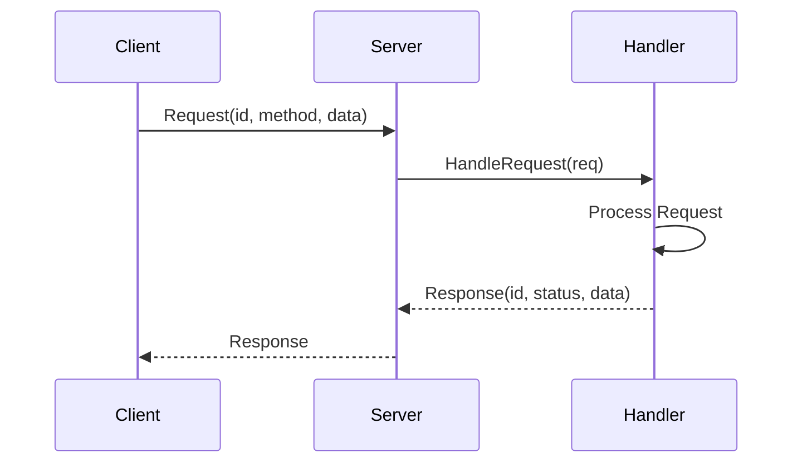
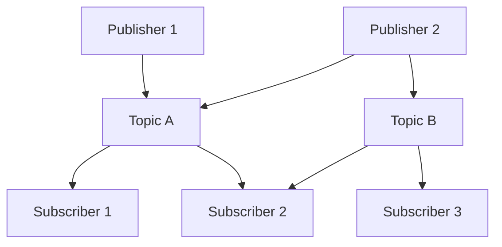
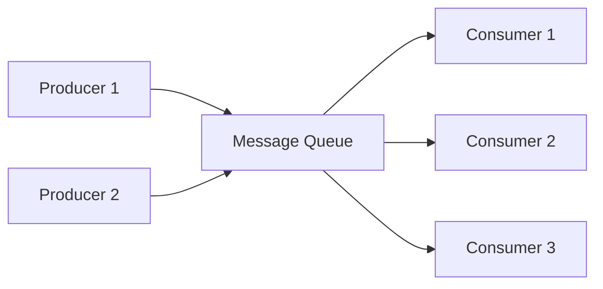
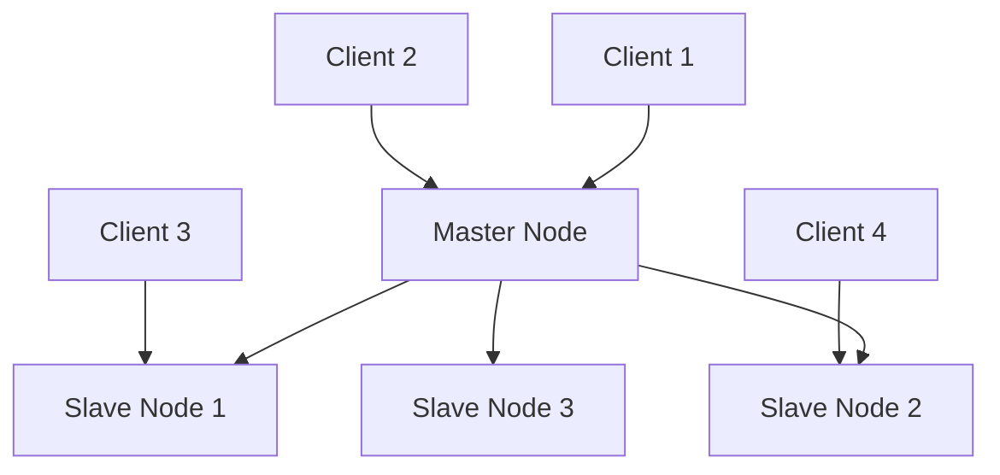

# 分布式系统设计模式 - Golang实现与分析

## 目录

- [分布式系统设计模式 - Golang实现与分析](#分布式系统设计模式---golang实现与分析)
  - [目录](#目录)
  - [1. 分布式通信模式](#1-分布式通信模式)
    - [1.1 请求-响应模式](#11-请求-响应模式)
      - [概念定义](#概念定义)
      - [优缺点分析](#优缺点分析)
      - [时序图](#时序图)
      - [相关开源组件](#相关开源组件)
    - [1.2 发布-订阅模式](#12-发布-订阅模式)
      - [1.2.1 概念定义](#121-概念定义)
      - [优缺点分析](#优缺点分析-1)
      - [架构图](#架构图)
      - [相关开源组件](#相关开源组件-1)
    - [1.3 消息队列模式](#13-消息队列模式)
      - [概念定义](#概念定义-1)
      - [优缺点分析](#优缺点分析-2)
      - [流程图](#流程图)
      - [相关开源组件](#相关开源组件-2)
    - [1.4 RPC模式](#14-rpc模式)
      - [概念定义](#概念定义-2)
    - [1.5 流处理模式](#15-流处理模式)
      - [概念定义](#概念定义-3)
  - [2. 一致性与复制模式](#2-一致性与复制模式)
    - [2.1 主从复制](#21-主从复制)
      - [概念定义](#概念定义-4)
      - [优缺点分析](#优缺点分析-3)
      - [架构图](#架构图-1)
      - [相关开源组件](#相关开源组件-3)
    - [2.2 多主复制](#22-多主复制)
      - [概念定义](#概念定义-5)
    - [2.3 无主复制](#23-无主复制)
      - [概念定义](#概念定义-6)
  - [4. 容错与弹性模式](#4-容错与弹性模式)
    - [4.1 熔断器模式](#41-熔断器模式)
      - [概念定义](#概念定义-7)
      - [优缺点分析](#优缺点分析-4)
    - [4.2 舱壁模式](#42-舱壁模式)
      - [概念定义](#概念定义-8)
      - [优缺点分析](#优缺点分析-5)
    - [4.3 超时与重试](#43-超时与重试)
      - [概念定义](#概念定义-9)
    - [4.4 背压模式](#44-背压模式)
      - [概念定义](#概念定义-10)
  - [5. 事务与一致性模式](#5-事务与一致性模式)
    - [5.1 两阶段提交](#51-两阶段提交)
      - [概念定义](#概念定义-11)
      - [优缺点分析](#优缺点分析-6)
    - [5.2 三阶段提交](#52-三阶段提交)
      - [概念定义](#概念定义-12)
    - [5.3 SAGA模式](#53-saga模式)
      - [概念定义](#概念定义-13)
    - [5.4 TCC模式](#54-tcc模式)
      - [概念定义](#概念定义-14)
    - [4.4 背压模式](#44-背压模式-1)
      - [概念定义](#概念定义-15)
  - [5. 事务与一致性模式](#5-事务与一致性模式-1)
    - [5.1 两阶段提交](#51-两阶段提交-1)
      - [概念定义](#概念定义-16)
    - [5.2 三阶段提交](#52-三阶段提交-1)
      - [概念定义](#概念定义-17)
    - [5.4 TCC模式](#54-tcc模式-1)
      - [概念定义](#概念定义-18)
  - [9. 形式化定义与数学证明](#9-形式化定义与数学证明)
    - [9.1 分布式系统形式化模型](#91-分布式系统形式化模型)
    - [9.2 最终一致性形式化定义](#92-最终一致性形式化定义)
    - [9.3 CAP定理形式化](#93-cap定理形式化)
  - [10. Golang实现与开源组件](#10-golang实现与开源组件)
    - [10.1 核心开源组件](#101-核心开源组件)
      - [etcd](#etcd)
      - [Consul](#consul)
      - [gRPC](#grpc)
    - [10.2 性能优化最佳实践](#102-性能优化最佳实践)
      - [连接池管理](#连接池管理)
      - [负载均衡](#负载均衡)
  - [11. 性能分析与最佳实践](#11-性能分析与最佳实践)
    - [11.1 性能指标](#111-性能指标)
      - [延迟（Latency）](#延迟latency)
      - [吞吐量（Throughput）](#吞吐量throughput)
      - [可用性（Availability）](#可用性availability)
    - [11.2 监控与可观测性](#112-监控与可观测性)
      - [指标收集](#指标收集)
      - [分布式追踪](#分布式追踪)
    - [11.3 错误处理策略](#113-错误处理策略)
      - [重试机制](#重试机制)
      - [熔断器模式](#熔断器模式)
  - [12. 参考文献与外部链接](#12-参考文献与外部链接)
    - [12.1 学术论文](#121-学术论文)
    - [12.2 开源项目](#122-开源项目)
    - [12.3 技术文档](#123-技术文档)
    - [12.4 最佳实践指南](#124-最佳实践指南)
  - [13. 高级分布式模式](#13-高级分布式模式)
    - [13.1 流处理模式](#131-流处理模式)
      - [概念定义](#概念定义-19)
    - [13.2 CRDT（无冲突复制数据类型）](#132-crdt无冲突复制数据类型)
      - [概念定义](#概念定义-20)
    - [13.3 分片模式](#133-分片模式)
      - [概念定义](#概念定义-21)
    - [13.4 SAGA模式](#134-saga模式)
      - [概念定义](#概念定义-22)
  - [14. 分布式系统测试策略](#14-分布式系统测试策略)
    - [14.1 混沌工程](#141-混沌工程)
      - [概念定义](#概念定义-23)
    - [14.2 压力测试](#142-压力测试)
  - [15. 未来发展趋势](#15-未来发展趋势)
    - [15.1 边缘计算](#151-边缘计算)
    - [15.2 量子计算](#152-量子计算)
    - [15.3 区块链与Web3](#153-区块链与web3)
    - [15.4 AI驱动的分布式系统](#154-ai驱动的分布式系统)
  - [16. 总结与最佳实践指南](#16-总结与最佳实践指南)
    - [16.1 模式选择指南](#161-模式选择指南)
      - [通信模式选择](#通信模式选择)
      - [一致性模式选择](#一致性模式选择)
      - [容错模式选择](#容错模式选择)
    - [16.2 性能优化检查清单](#162-性能优化检查清单)
      - [网络优化](#网络优化)
      - [缓存优化](#缓存优化)
      - [数据库优化](#数据库优化)
      - [监控告警](#监控告警)
    - [16.3 安全最佳实践](#163-安全最佳实践)
      - [网络安全](#网络安全)
      - [认证授权](#认证授权)
      - [数据加密](#数据加密)
  - [17. 实用工具与代码生成器](#17-实用工具与代码生成器)
    - [17.1 分布式系统脚手架](#171-分布式系统脚手架)
      - [微服务项目模板](#微服务项目模板)
      - [Docker配置](#docker配置)
      - [Kubernetes部署](#kubernetes部署)
    - [17.2 监控仪表板配置](#172-监控仪表板配置)
      - [Prometheus配置](#prometheus配置)
      - [Grafana仪表板](#grafana仪表板)
    - [17.3 自动化测试工具](#173-自动化测试工具)
      - [集成测试框架](#集成测试框架)
  - [18. 常见问题与解决方案](#18-常见问题与解决方案)
    - [18.1 性能问题](#181-性能问题)
      - [高延迟问题](#高延迟问题)
      - [低吞吐量问题](#低吞吐量问题)
    - [18.2 可用性问题](#182-可用性问题)
      - [服务不可用](#服务不可用)
      - [数据不一致](#数据不一致)
    - [18.3 扩展性问题](#183-扩展性问题)
      - [水平扩展困难](#水平扩展困难)
      - [垂直扩展限制](#垂直扩展限制)
  - [19. 行业应用案例](#19-行业应用案例)
    - [19.1 电商平台](#191-电商平台)
      - [架构特点](#架构特点)
      - [关键技术](#关键技术)
    - [19.2 金融系统](#192-金融系统)
      - [架构特点](#架构特点-1)
      - [关键技术](#关键技术-1)
    - [19.3 物联网平台](#193-物联网平台)
      - [架构特点](#架构特点-2)
      - [关键技术](#关键技术-2)
  - [20. 未来展望](#20-未来展望)
    - [20.1 技术趋势](#201-技术趋势)
      - [云原生技术](#云原生技术)
      - [人工智能集成](#人工智能集成)
      - [新兴技术](#新兴技术)
    - [20.2 架构演进](#202-架构演进)
      - [从单体到微服务](#从单体到微服务)
      - [从传统到云原生](#从传统到云原生)
      - [从中心化到边缘计算](#从中心化到边缘计算)
      - [认证授权](#认证授权-1)
      - [数据加密](#数据加密-1)
  - [17. 实用工具与代码生成器](#17-实用工具与代码生成器-1)
    - [17.1 分布式系统脚手架](#171-分布式系统脚手架-1)
      - [微服务项目模板](#微服务项目模板-1)
      - [Docker配置](#docker配置-1)
      - [Kubernetes部署](#kubernetes部署-1)
    - [17.2 监控仪表板配置](#172-监控仪表板配置-1)
      - [Prometheus配置](#prometheus配置-1)
      - [Grafana仪表板](#grafana仪表板-1)
    - [17.3 自动化测试工具](#173-自动化测试工具-1)
      - [集成测试框架](#集成测试框架-1)
  - [18. 常见问题与解决方案](#18-常见问题与解决方案-1)
    - [18.1 性能问题](#181-性能问题-1)
      - [高延迟问题](#高延迟问题-1)
      - [低吞吐量问题](#低吞吐量问题-1)
    - [18.2 可用性问题](#182-可用性问题-1)
      - [服务不可用](#服务不可用-1)
      - [数据不一致](#数据不一致-1)
    - [18.3 扩展性问题](#183-扩展性问题-1)
      - [水平扩展困难](#水平扩展困难-1)
      - [垂直扩展限制](#垂直扩展限制-1)
  - [19. 行业应用案例](#19-行业应用案例-1)
    - [19.1 电商平台](#191-电商平台-1)
      - [架构特点](#架构特点-3)
      - [关键技术](#关键技术-3)
    - [19.2 金融系统](#192-金融系统-1)
      - [架构特点](#架构特点-4)
      - [关键技术](#关键技术-4)
    - [19.3 物联网平台](#193-物联网平台-1)
      - [架构特点](#架构特点-5)
      - [关键技术](#关键技术-5)
  - [20. 未来展望](#20-未来展望-1)
    - [20.1 技术趋势](#201-技术趋势-1)
      - [云原生技术](#云原生技术-1)
      - [人工智能集成](#人工智能集成-1)
      - [新兴技术](#新兴技术-1)
    - [20.2 架构演进](#202-架构演进-1)
      - [从单体到微服务](#从单体到微服务-1)
      - [从传统到云原生](#从传统到云原生-1)
      - [从中心化到边缘计算](#从中心化到边缘计算-1)

## 1. 分布式通信模式

### 1.1 请求-响应模式

#### 概念定义

**定义**：客户端发送请求，服务器处理并返回响应的通信模式。可以是同步的也可以是异步的。

**形式化定义**：
设 $R$ 为请求集合，$S$ 为响应集合，$f: R \rightarrow S$ 为处理函数，则请求-响应模式可表示为：

$$(r, s) \in R \times S \text{ 且 } s = f(r)$$

**Golang实现**：

```go
package requestresponse

import (
    "context"
    "encoding/json"
    "fmt"
    "net/http"
    "time"
)

// Request 请求结构
type Request struct {
    ID        string                 `json:"id"`
    Method    string                 `json:"method"`
    Data      map[string]interface{} `json:"data"`
    Timestamp time.Time              `json:"timestamp"`
}

// Response 响应结构
type Response struct {
    ID        string                 `json:"id"`
    Status    string                 `json:"status"`
    Data      map[string]interface{} `json:"data"`
    Error     string                 `json:"error,omitempty"`
    Timestamp time.Time              `json:"timestamp"`
}

// RequestResponseHandler 请求-响应处理器
type RequestResponseHandler struct {
    handlers map[string]func(Request) (Response, error)
}

// NewRequestResponseHandler 创建处理器
func NewRequestResponseHandler() *RequestResponseHandler {
    return &RequestResponseHandler{
        handlers: make(map[string]func(Request) (Response, error)),
    }
}

// RegisterHandler 注册处理器
func (h *RequestResponseHandler) RegisterHandler(method string, handler func(Request) (Response, error)) {
    h.handlers[method] = handler
}

// HandleRequest 处理请求
func (h *RequestResponseHandler) HandleRequest(req Request) (Response, error) {
    handler, exists := h.handlers[req.Method]
    if !exists {
        return Response{
            ID:        req.ID,
            Status:    "error",
            Error:     "method not found",
            Timestamp: time.Now(),
        }, fmt.Errorf("method %s not found", req.Method)
    }
    
    return handler(req)
}

// HTTP服务器实现
func (h *RequestResponseHandler) ServeHTTP(w http.ResponseWriter, r *http.Request) {
    var req Request
    if err := json.NewDecoder(r.Body).Decode(&req); err != nil {
        http.Error(w, err.Error(), http.StatusBadRequest)
        return
    }
    
    req.Timestamp = time.Now()
    
    resp, err := h.HandleRequest(req)
    if err != nil {
        resp.Status = "error"
        resp.Error = err.Error()
    }
    
    resp.Timestamp = time.Now()
    json.NewEncoder(w).Encode(resp)
}
```

#### 优缺点分析

**优点**：

- 简单直观，易于实现和理解
- 适合请求-响应类型的交互
- 可以集成重试、超时等机制

**缺点**：

- 紧耦合：客户端必须等待响应
- 可能导致阻塞
- 难以扩展到复杂的交互模式

#### 时序图



#### 相关开源组件

- **Gin**: 高性能HTTP Web框架
- **gRPC**: 高性能RPC框架
- **Go-Kit**: 微服务工具包

### 1.2 发布-订阅模式

#### 1.2.1 概念定义

**定义**：发布者将消息发送到主题，订阅者接收感兴趣主题的消息，实现松耦合的异步通信。

**形式化定义**：
设 $P$ 为发布者集合，$S$ 为订阅者集合，$T$ 为主题集合，$M$ 为消息集合，则发布-订阅模式可表示为：

$$\text{PubSub} = \{(p, t, m) \in P \times T \times M\} \cup \{(s, t) \in S \times T\}$$

**Golang实现**：

```go
package pubsub

import (
    "context"
    "sync"
    "time"
)

// Message 消息结构
type Message struct {
    ID        string                 `json:"id"`
    Topic     string                 `json:"topic"`
    Data      map[string]interface{} `json:"data"`
    Timestamp time.Time              `json:"timestamp"`
}

// Subscriber 订阅者接口
type Subscriber interface {
    ID() string
    OnMessage(msg Message)
}

// Publisher 发布者接口
type Publisher interface {
    Publish(topic string, data map[string]interface{}) error
}

// PubSubSystem 发布-订阅系统
type PubSubSystem struct {
    subscribers map[string][]Subscriber
    mutex       sync.RWMutex
}

// NewPubSubSystem 创建发布-订阅系统
func NewPubSubSystem() *PubSubSystem {
    return &PubSubSystem{
        subscribers: make(map[string][]Subscriber),
    }
}

// Subscribe 订阅主题
func (ps *PubSubSystem) Subscribe(topic string, subscriber Subscriber) {
    ps.mutex.Lock()
    defer ps.mutex.Unlock()
    
    ps.subscribers[topic] = append(ps.subscribers[topic], subscriber)
}

// Unsubscribe 取消订阅
func (ps *PubSubSystem) Unsubscribe(topic string, subscriberID string) {
    ps.mutex.Lock()
    defer ps.mutex.Unlock()
    
    subscribers, exists := ps.subscribers[topic]
    if !exists {
        return
    }
    
    for i, sub := range subscribers {
        if sub.ID() == subscriberID {
            ps.subscribers[topic] = append(subscribers[:i], subscribers[i+1:]...)
            break
        }
    }
}

// Publish 发布消息
func (ps *PubSubSystem) Publish(topic string, data map[string]interface{}) error {
    ps.mutex.RLock()
    subscribers, exists := ps.subscribers[topic]
    ps.mutex.RUnlock()
    
    if !exists {
        return nil
    }
    
    msg := Message{
        ID:        generateID(),
        Topic:     topic,
        Data:      data,
        Timestamp: time.Now(),
    }
    
    // 异步发送消息给所有订阅者
    for _, subscriber := range subscribers {
        go func(sub Subscriber) {
            sub.OnMessage(msg)
        }(subscriber)
    }
    
    return nil
}

// 简单的订阅者实现
type SimpleSubscriber struct {
    id     string
    topics []string
}

func NewSimpleSubscriber(id string) *SimpleSubscriber {
    return &SimpleSubscriber{
        id:     id,
        topics: make([]string, 0),
    }
}

func (s *SimpleSubscriber) ID() string {
    return s.id
}

func (s *SimpleSubscriber) OnMessage(msg Message) {
    // 处理接收到的消息
    fmt.Printf("Subscriber %s received message on topic %s: %+v\n", s.id, msg.Topic, msg.Data)
}
```

#### 优缺点分析

**优点**：

- 松耦合：发布者和订阅者互不依赖
- 可扩展：易于添加新的发布者和订阅者
- 异步通信：提高系统响应性

**缺点**：

- 消息可能丢失
- 难以保证消息顺序
- 调试和测试复杂

#### 架构图



#### 相关开源组件

- **NATS**: 轻量级消息系统
- **Redis Pub/Sub**: Redis发布订阅
- **Apache Kafka**: 分布式流处理平台

### 1.3 消息队列模式

#### 概念定义

**定义**：生产者将消息发送到队列，消费者从队列中获取消息进行处理，实现异步消息传递。

**形式化定义**：
设 $Q$ 为队列，$M$ 为消息集合，$P$ 为生产者集合，$C$ 为消费者集合，则消息队列模式可表示为：

$$Q = \{m_1, m_2, ..., m_n\} \text{ 其中 } m_i \in M$$

**Golang实现**：

```go
package messagequeue

import (
    "context"
    "sync"
    "time"
)

// Message 消息结构
type Message struct {
    ID        string                 `json:"id"`
    Queue     string                 `json:"queue"`
    Data      map[string]interface{} `json:"data"`
    Priority  int                    `json:"priority"`
    Timestamp time.Time              `json:"timestamp"`
}

// Queue 消息队列
type Queue struct {
    name     string
    messages chan Message
    mutex    sync.RWMutex
}

// NewQueue 创建队列
func NewQueue(name string, capacity int) *Queue {
    return &Queue{
        name:     name,
        messages: make(chan Message, capacity),
    }
}

// Enqueue 入队
func (q *Queue) Enqueue(msg Message) error {
    select {
    case q.messages <- msg:
        return nil
    default:
        return fmt.Errorf("queue %s is full", q.name)
    }
}

// Dequeue 出队
func (q *Queue) Dequeue(ctx context.Context) (Message, error) {
    select {
    case msg := <-q.messages:
        return msg, nil
    case <-ctx.Done():
        return Message{}, ctx.Err()
    }
}

// Producer 生产者
type Producer struct {
    queue *Queue
}

func NewProducer(queue *Queue) *Producer {
    return &Producer{queue: queue}
}

func (p *Producer) SendMessage(data map[string]interface{}, priority int) error {
    msg := Message{
        ID:        generateID(),
        Queue:     p.queue.name,
        Data:      data,
        Priority:  priority,
        Timestamp: time.Now(),
    }
    
    return p.queue.Enqueue(msg)
}

// Consumer 消费者
type Consumer struct {
    queue    *Queue
    handler  func(Message) error
    workers  int
    stopChan chan struct{}
}

func NewConsumer(queue *Queue, handler func(Message) error, workers int) *Consumer {
    return &Consumer{
        queue:    queue,
        handler:  handler,
        workers:  workers,
        stopChan: make(chan struct{}),
    }
}

func (c *Consumer) Start(ctx context.Context) {
    for i := 0; i < c.workers; i++ {
        go c.worker(ctx, i)
    }
}

func (c *Consumer) worker(ctx context.Context, id int) {
    for {
        select {
        case <-ctx.Done():
            return
        case <-c.stopChan:
            return
        default:
            msg, err := c.queue.Dequeue(ctx)
            if err != nil {
                continue
            }
            
            if err := c.handler(msg); err != nil {
                // 处理错误，可以选择重试或发送到死信队列
                fmt.Printf("Worker %d failed to process message %s: %v\n", id, msg.ID, err)
            }
        }
    }
}

func (c *Consumer) Stop() {
    close(c.stopChan)
}
```

#### 优缺点分析

**优点**：

- 异步处理：提高系统响应性
- 削峰填谷：处理流量波动
- 解耦：生产者和消费者独立

**缺点**：

- 增加系统复杂性
- 消息可能重复或丢失
- 需要处理死信队列

#### 流程图



#### 相关开源组件

- **RabbitMQ**: 消息代理
- **Apache ActiveMQ**: 消息中间件
- **Redis Streams**: Redis流数据结构

### 1.4 RPC模式

#### 概念定义

**定义**：远程过程调用，允许程序调用另一个地址空间（通常是网络上的另一台计算机）的子程序。

**形式化定义**：
设 $C$ 为客户端集合，$S$ 为服务器集合，$F$ 为函数集合，则RPC可表示为：

$$\text{RPC}: C \times F \times \text{Args} \rightarrow S \times \text{Result}$$

**Golang实现**：

```go
package rpc

import (
    "context"
    "encoding/json"
    "fmt"
    "net"
    "net/rpc"
    "net/rpc/jsonrpc"
    "time"
)

// RPCServer RPC服务器
type RPCServer struct {
    services map[string]interface{}
}

func NewRPCServer() *RPCServer {
    return &RPCServer{
        services: make(map[string]interface{}),
    }
}

func (s *RPCServer) RegisterService(name string, service interface{}) {
    s.services[name] = service
}

func (s *RPCServer) Start(addr string) error {
    for name, service := range s.services {
        rpc.RegisterName(name, service)
    }
    
    listener, err := net.Listen("tcp", addr)
    if err != nil {
        return err
    }
    
    for {
        conn, err := listener.Accept()
        if err != nil {
            continue
        }
        
        go jsonrpc.ServeConn(conn)
    }
}

// RPCClient RPC客户端
type RPCClient struct {
    client *rpc.Client
}

func NewRPCClient(addr string) (*RPCClient, error) {
    conn, err := net.DialTimeout("tcp", addr, 5*time.Second)
    if err != nil {
        return nil, err
    }
    
    client := jsonrpc.NewClient(conn)
    return &RPCClient{client: client}, nil
}

func (c *RPCClient) Call(service, method string, args, reply interface{}) error {
    return c.client.Call(service+"."+method, args, reply)
}

// 示例服务
type CalculatorService struct{}

type AddArgs struct {
    A, B int
}

type AddReply struct {
    Result int
}

func (c *CalculatorService) Add(args *AddArgs, reply *AddReply) error {
    reply.Result = args.A + args.B
    return nil
}
```

### 1.5 流处理模式

#### 概念定义

**定义**：处理连续数据流的模式，支持实时数据处理和分析。

**形式化定义**：
设 $S$ 为流集合，$P$ 为处理器集合，$T$ 为时间窗口，则流处理模式可表示为：

$$\text{StreamProcessing} = \{(s, p, t) \in S \times P \times T | \text{Process}(s, p, t)\}$$

**Golang实现**：

```go
package streamprocessing

import (
    "context"
    "sync"
    "time"
)

// Stream 数据流
type Stream struct {
    ID       string
    Data     chan interface{}
    Metadata map[string]interface{}
}

// Processor 流处理器
type Processor interface {
    Process(ctx context.Context, data interface{}) (interface{}, error)
    ID() string
}

// StreamProcessor 流处理引擎
type StreamProcessor struct {
    streams    map[string]*Stream
    processors []Processor
    mutex      sync.RWMutex
}

func NewStreamProcessor() *StreamProcessor {
    return &StreamProcessor{
        streams:    make(map[string]*Stream),
        processors: make([]Processor, 0),
    }
}

// AddStream 添加流
func (sp *StreamProcessor) AddStream(stream *Stream) {
    sp.mutex.Lock()
    defer sp.mutex.Unlock()
    
    sp.streams[stream.ID] = stream
}

// AddProcessor 添加处理器
func (sp *StreamProcessor) AddProcessor(processor Processor) {
    sp.mutex.Lock()
    defer sp.mutex.Unlock()
    
    sp.processors = append(sp.processors, processor)
}

// StartProcessing 开始处理
func (sp *StreamProcessor) StartProcessing(ctx context.Context) {
    for _, stream := range sp.streams {
        go sp.processStream(ctx, stream)
    }
}

func (sp *StreamProcessor) processStream(ctx context.Context, stream *Stream) {
    for {
        select {
        case <-ctx.Done():
            return
        case data := <-stream.Data:
            sp.processData(ctx, data)
        }
    }
}

func (sp *StreamProcessor) processData(ctx context.Context, data interface{}) {
    for _, processor := range sp.processors {
        go func(p Processor) {
            if result, err := p.Process(ctx, data); err == nil {
                // 处理结果
                fmt.Printf("Processor %s processed data: %v\n", p.ID(), result)
            }
        }(processor)
    }
}

// 示例处理器
type FilterProcessor struct {
    id     string
    filter func(interface{}) bool
}

func NewFilterProcessor(id string, filter func(interface{}) bool) *FilterProcessor {
    return &FilterProcessor{
        id:     id,
        filter: filter,
    }
}

func (f *FilterProcessor) ID() string {
    return f.id
}

func (f *FilterProcessor) Process(ctx context.Context, data interface{}) (interface{}, error) {
    if f.filter(data) {
        return data, nil
    }
    return nil, fmt.Errorf("data filtered out")
}
```

## 2. 一致性与复制模式

### 2.1 主从复制

#### 概念定义

**定义**：一个主节点处理写操作，多个从节点复制主节点的数据，处理读操作。

**形式化定义**：
设 $M$ 为主节点，$S = \{s_1, s_2, ..., s_n\}$ 为从节点集合，$D$ 为数据集合，则主从复制可表示为：

$$\forall s_i \in S, \text{Replicate}(M, s_i) \text{ 且 } \text{Read}(s_i) \subseteq \text{Read}(M)$$

**Golang实现**：

```go
package replication

import (
    "context"
    "sync"
    "time"
)

// Node 节点接口
type Node interface {
    ID() string
    IsMaster() bool
    Write(key string, value interface{}) error
    Read(key string) (interface{}, error)
}

// MasterNode 主节点
type MasterNode struct {
    id       string
    data     map[string]interface{}
    slaves   []*SlaveNode
    mutex    sync.RWMutex
    log      []LogEntry
}

type LogEntry struct {
    Index   int64
    Term    int64
    Command string
    Key     string
    Value   interface{}
    Time    time.Time
}

func NewMasterNode(id string) *MasterNode {
    return &MasterNode{
        id:     id,
        data:   make(map[string]interface{}),
        slaves: make([]*SlaveNode, 0),
        log:    make([]LogEntry, 0),
    }
}

func (m *MasterNode) ID() string {
    return m.id
}

func (m *MasterNode) IsMaster() bool {
    return true
}

func (m *MasterNode) Write(key string, value interface{}) error {
    m.mutex.Lock()
    defer m.mutex.Unlock()
    
    // 写入本地数据
    m.data[key] = value
    
    // 记录日志
    entry := LogEntry{
        Index:   int64(len(m.log)),
        Term:    1, // 简化版本
        Command: "SET",
        Key:     key,
        Value:   value,
        Time:    time.Now(),
    }
    m.log = append(m.log, entry)
    
    // 复制到从节点
    for _, slave := range m.slaves {
        go func(s *SlaveNode) {
            s.Replicate(entry)
        }(slave)
    }
    
    return nil
}

func (m *MasterNode) Read(key string) (interface{}, error) {
    m.mutex.RLock()
    defer m.mutex.RUnlock()
    
    value, exists := m.data[key]
    if !exists {
        return nil, fmt.Errorf("key %s not found", key)
    }
    
    return value, nil
}

func (m *MasterNode) AddSlave(slave *SlaveNode) {
    m.mutex.Lock()
    defer m.mutex.Unlock()
    
    m.slaves = append(m.slaves, slave)
}

// SlaveNode 从节点
type SlaveNode struct {
    id     string
    data   map[string]interface{}
    master *MasterNode
    mutex  sync.RWMutex
    log    []LogEntry
}

func NewSlaveNode(id string, master *MasterNode) *SlaveNode {
    return &SlaveNode{
        id:     id,
        data:   make(map[string]interface{}),
        master: master,
        log:    make([]LogEntry, 0),
    }
}

func (s *SlaveNode) ID() string {
    return s.id
}

func (s *SlaveNode) IsMaster() bool {
    return false
}

func (s *SlaveNode) Write(key string, value interface{}) error {
    // 从节点不能直接写入，需要转发给主节点
    return s.master.Write(key, value)
}

func (s *SlaveNode) Read(key string) (interface{}, error) {
    s.mutex.RLock()
    defer s.mutex.RUnlock()
    
    value, exists := s.data[key]
    if !exists {
        return nil, fmt.Errorf("key %s not found", key)
    }
    
    return value, nil
}

func (s *SlaveNode) Replicate(entry LogEntry) error {
    s.mutex.Lock()
    defer s.mutex.Unlock()
    
    // 应用日志条目
    switch entry.Command {
    case "SET":
        s.data[entry.Key] = entry.Value
    case "DELETE":
        delete(s.data, entry.Key)
    }
    
    s.log = append(s.log, entry)
    return nil
}
```

#### 优缺点分析

**优点**：

- 读写分离：提高读性能
- 高可用：主节点故障时可切换
- 简单易实现

**缺点**：

- 单点故障：主节点故障影响写操作
- 数据一致性：主从延迟可能导致数据不一致
- 扩展性限制：写操作仍受主节点限制

#### 架构图



#### 相关开源组件

- **MySQL**: 主从复制
- **PostgreSQL**: 流复制
- **Redis**: 主从复制

### 2.2 多主复制

#### 概念定义

**定义**：多个主节点都可以处理写操作，然后相互同步数据。

**形式化定义**：
设 $M = \{m_1, m_2, ..., m_n\}$ 为主节点集合，$D$ 为数据集合，则多主复制可表示为：

$$\forall m_i, m_j \in M, \text{Sync}(m_i, m_j) \text{ 且 } \text{Write}(m_i) \subseteq \text{Write}(m_j)$$

**Golang实现**：

```go
package multimaster

import (
    "context"
    "sync"
    "time"
)

// MultiMasterNode 多主节点
type MultiMasterNode struct {
    id       string
    data     map[string]interface{}
    peers    map[string]*MultiMasterNode
    mutex    sync.RWMutex
    log      []LogEntry
    version  map[string]int64
}

type LogEntry struct {
    ID        string
    Key       string
    Value     interface{}
    Timestamp time.Time
    NodeID    string
    Version   int64
}

func NewMultiMasterNode(id string) *MultiMasterNode {
    return &MultiMasterNode{
        id:      id,
        data:    make(map[string]interface{}),
        peers:   make(map[string]*MultiMasterNode),
        log:     make([]LogEntry, 0),
        version: make(map[string]int64),
    }
}

func (m *MultiMasterNode) Write(key string, value interface{}) error {
    m.mutex.Lock()
    defer m.mutex.Unlock()
    
    // 增加版本号
    m.version[key]++
    
    // 写入本地数据
    m.data[key] = value
    
    // 记录日志
    entry := LogEntry{
        ID:        generateID(),
        Key:       key,
        Value:     value,
        Timestamp: time.Now(),
        NodeID:    m.id,
        Version:   m.version[key],
    }
    m.log = append(m.log, entry)
    
    // 异步同步到其他节点
    for peerID, peer := range m.peers {
        go func(id string, p *MultiMasterNode) {
            p.SyncEntry(entry)
        }(peerID, peer)
    }
    
    return nil
}

func (m *MultiMasterNode) Read(key string) (interface{}, error) {
    m.mutex.RLock()
    defer m.mutex.RUnlock()
    
    value, exists := m.data[key]
    if !exists {
        return nil, fmt.Errorf("key %s not found", key)
    }
    
    return value, nil
}

func (m *MultiMasterNode) SyncEntry(entry LogEntry) error {
    m.mutex.Lock()
    defer m.mutex.Unlock()
    
    // 检查版本冲突
    currentVersion, exists := m.version[entry.Key]
    if exists && currentVersion >= entry.Version {
        // 版本冲突，需要解决
        return m.resolveConflict(entry)
    }
    
    // 应用更新
    m.data[entry.Key] = entry.Value
    m.version[entry.Key] = entry.Version
    m.log = append(m.log, entry)
    
    return nil
}

func (m *MultiMasterNode) resolveConflict(entry LogEntry) error {
    // 简单的冲突解决策略：时间戳优先
    existingEntry := m.log[len(m.log)-1]
    
    if entry.Timestamp.After(existingEntry.Timestamp) {
        m.data[entry.Key] = entry.Value
        m.version[entry.Key] = entry.Version
        m.log = append(m.log, entry)
    }
    
    return nil
}

func (m *MultiMasterNode) AddPeer(peer *MultiMasterNode) {
    m.mutex.Lock()
    defer m.mutex.Unlock()
    
    m.peers[peer.id] = peer
}
```

### 2.3 无主复制

#### 概念定义

**定义**：没有主节点，所有节点都可以处理读写请求，通过向量时钟解决冲突。

**形式化定义**：
设 $N$ 为节点集合，$V$ 为向量时钟集合，则无主复制可表示为：

$$\forall n_i, n_j \in N, \text{Read}(n_i) \cap \text{Write}(n_j) \neq \emptyset \Rightarrow \text{Resolve}(V_i, V_j)$$

**Golang实现**：

```go
package leaderless

import (
    "sync"
    "time"
)

// VectorClock 向量时钟
type VectorClock map[string]int64

// LeaderlessNode 无主节点
type LeaderlessNode struct {
    id          string
    data        map[string]*DataItem
    mutex       sync.RWMutex
    vectorClock VectorClock
}

type DataItem struct {
    Value       interface{}
    VectorClock VectorClock
    Timestamp   time.Time
}

func NewLeaderlessNode(id string) *LeaderlessNode {
    return &LeaderlessNode{
        id:          id,
        data:        make(map[string]*DataItem),
        vectorClock: make(VectorClock),
    }
}

func (l *LeaderlessNode) Write(key string, value interface{}) error {
    l.mutex.Lock()
    defer l.mutex.Unlock()
    
    // 增加本地向量时钟
    l.vectorClock[l.id]++
    
    // 创建数据项
    item := &DataItem{
        Value:       value,
        VectorClock: copyVectorClock(l.vectorClock),
        Timestamp:   time.Now(),
    }
    
    l.data[key] = item
    return nil
}

func (l *LeaderlessNode) Read(key string) (interface{}, error) {
    l.mutex.RLock()
    defer l.mutex.RUnlock()
    
    item, exists := l.data[key]
    if !exists {
        return nil, fmt.Errorf("key %s not found", key)
    }
    
    return item.Value, nil
}

func (l *LeaderlessNode) Merge(other *LeaderlessNode) {
    l.mutex.Lock()
    defer l.mutex.Unlock()
    other.mutex.RLock()
    defer other.mutex.RUnlock()
    
    // 合并向量时钟
    for nodeID, clock := range other.vectorClock {
        if current, exists := l.vectorClock[nodeID]; !exists || clock > current {
            l.vectorClock[nodeID] = clock
        }
    }
    
    // 合并数据
    for key, otherItem := range other.data {
        if localItem, exists := l.data[key]; exists {
            // 解决冲突
            if l.isConcurrent(localItem.VectorClock, otherItem.VectorClock) {
                // 并发写入，需要解决冲突
                l.data[key] = l.resolveConflict(localItem, otherItem)
            } else if l.happensBefore(localItem.VectorClock, otherItem.VectorClock) {
                // 其他节点的数据更新
                l.data[key] = otherItem
            }
        } else {
            // 本地没有该数据
            l.data[key] = otherItem
        }
    }
}

func (l *LeaderlessNode) isConcurrent(vc1, vc2 VectorClock) bool {
    // 检查两个向量时钟是否并发
    for nodeID := range vc1 {
        if vc2[nodeID] > vc1[nodeID] {
            return true
        }
    }
    for nodeID := range vc2 {
        if vc1[nodeID] > vc2[nodeID] {
            return true
        }
    }
    return false
}

func (l *LeaderlessNode) happensBefore(vc1, vc2 VectorClock) bool {
    // 检查vc1是否在vc2之前发生
    for nodeID, clock1 := range vc1 {
        if clock2, exists := vc2[nodeID]; !exists || clock1 > clock2 {
            return false
        }
    }
    return true
}

func (l *LeaderlessNode) resolveConflict(item1, item2 *DataItem) *DataItem {
    // 简单的冲突解决：时间戳优先
    if item1.Timestamp.After(item2.Timestamp) {
        return item1
    }
    return item2
}

func copyVectorClock(vc VectorClock) VectorClock {
    result := make(VectorClock)
    for k, v := range vc {
        result[k] = v
    }
    return result
}
```

## 4. 容错与弹性模式

### 4.1 熔断器模式

#### 概念定义

**定义**：当依赖的服务出现故障时，快速失败而不是等待超时，防止故障传播。

**形式化定义**：
设 $S$ 为服务状态集合，$T$ 为阈值集合，$F$ 为故障集合，则熔断器模式可表示为：

$$\text{CircuitBreaker}: S \times F \times T \rightarrow S$$

**Golang实现**：

```go
package circuitbreaker

import (
    "context"
    "sync"
    "time"
)

// State 熔断器状态
type State int

const (
    Closed State = iota
    Open
    HalfOpen
)

// CircuitBreaker 熔断器
type CircuitBreaker struct {
    state         State
    failureCount  int
    threshold     int
    timeout       time.Duration
    lastFailure   time.Time
    mutex         sync.RWMutex
}

func NewCircuitBreaker(threshold int, timeout time.Duration) *CircuitBreaker {
    return &CircuitBreaker{
        state:     Closed,
        threshold: threshold,
        timeout:   timeout,
    }
}

func (cb *CircuitBreaker) Execute(operation func() error) error {
    cb.mutex.Lock()
    defer cb.mutex.Unlock()
    
    switch cb.state {
    case Open:
        if time.Since(cb.lastFailure) > cb.timeout {
            cb.state = HalfOpen
        } else {
            return fmt.Errorf("circuit breaker is open")
        }
    case HalfOpen:
        // 允许一个请求通过
    case Closed:
        // 正常状态
    }
    
    if err := operation(); err != nil {
        cb.failureCount++
        cb.lastFailure = time.Now()
        
        if cb.failureCount >= cb.threshold {
            cb.state = Open
        }
        return err
    }
    
    // 成功，重置状态
    cb.failureCount = 0
    cb.state = Closed
    return nil
}

func (cb *CircuitBreaker) GetState() State {
    cb.mutex.RLock()
    defer cb.mutex.RUnlock()
    return cb.state
}
```

#### 优缺点分析

**优点**：
- 快速失败，避免资源浪费
- 防止故障传播
- 自动恢复机制

**缺点**：
- 增加系统复杂性
- 可能影响用户体验
- 需要合理配置阈值

### 4.2 舱壁模式

#### 概念定义

**定义**：将系统资源隔离到不同的舱壁中，防止一个舱壁的故障影响其他舱壁。

**形式化定义**：
设 $P$ 为舱壁集合，$R$ 为资源集合，$F$ 为故障集合，则舱壁模式可表示为：

$$\forall p_i, p_j \in P, i \neq j: \text{Isolate}(p_i, p_j) \text{ 且 } F(p_i) \not\Rightarrow F(p_j)$$

**Golang实现**：

```go
package bulkhead

import (
    "context"
    "sync"
    "time"
)

// Bulkhead 舱壁
type Bulkhead struct {
    name       string
    maxWorkers int
    queue      chan struct{}
    mutex      sync.RWMutex
}

func NewBulkhead(name string, maxWorkers int) *Bulkhead {
    return &Bulkhead{
        name:       name,
        maxWorkers: maxWorkers,
        queue:      make(chan struct{}, maxWorkers),
    }
}

func (b *Bulkhead) Execute(ctx context.Context, operation func() error) error {
    // 尝试获取工作槽位
    select {
    case b.queue <- struct{}{}:
        defer func() { <-b.queue }()
    case <-ctx.Done():
        return ctx.Err()
    default:
        return fmt.Errorf("bulkhead %s is full", b.name)
    }
    
    return operation()
}

// BulkheadPool 舱壁池
type BulkheadPool struct {
    bulkheads map[string]*Bulkhead
    mutex     sync.RWMutex
}

func NewBulkheadPool() *BulkheadPool {
    return &BulkheadPool{
        bulkheads: make(map[string]*Bulkhead),
    }
}

func (bp *BulkheadPool) GetBulkhead(name string, maxWorkers int) *Bulkhead {
    bp.mutex.Lock()
    defer bp.mutex.Unlock()
    
    if bulkhead, exists := bp.bulkheads[name]; exists {
        return bulkhead
    }
    
    bulkhead := NewBulkhead(name, maxWorkers)
    bp.bulkheads[name] = bulkhead
    return bulkhead
}

// 示例：数据库连接舱壁
type DatabaseBulkhead struct {
    readBulkhead  *Bulkhead
    writeBulkhead *Bulkhead
}

func NewDatabaseBulkhead() *DatabaseBulkhead {
    return &DatabaseBulkhead{
        readBulkhead:  NewBulkhead("db-read", 10),
        writeBulkhead: NewBulkhead("db-write", 5),
    }
}

func (db *DatabaseBulkhead) Read(ctx context.Context, query string) (interface{}, error) {
    var result interface{}
    err := db.readBulkhead.Execute(ctx, func() error {
        // 执行读操作
        result = executeQuery(query)
        return nil
    })
    
    return result, err
}

func (db *DatabaseBulkhead) Write(ctx context.Context, query string) error {
    return db.writeBulkhead.Execute(ctx, func() error {
        // 执行写操作
        return executeQuery(query)
    })
}

func executeQuery(query string) error {
    // 模拟数据库操作
    time.Sleep(100 * time.Millisecond)
    return nil
}
```

#### 优缺点分析

**优点**：
- 资源隔离，防止故障传播
- 可配置不同的资源限制
- 提高系统稳定性

**缺点**：
- 增加系统复杂性
- 可能造成资源浪费
- 需要合理配置资源分配

### 4.3 超时与重试

#### 概念定义

**定义**：为操作设置超时时间，失败时进行重试，提高系统可靠性。

**形式化定义**：
设 $T$ 为超时时间，$R$ 为重试次数，$O$ 为操作集合，则超时重试模式可表示为：

$$\text{TimeoutRetry}: O \times T \times R \rightarrow \text{Success} \lor \text{Failure}$$

**Golang实现**：

```go
package timeoutretry

import (
    "context"
    "time"
)

// RetryConfig 重试配置
type RetryConfig struct {
    MaxRetries  int
    InitialDelay time.Duration
    MaxDelay     time.Duration
    BackoffFactor float64
}

func NewRetryConfig(maxRetries int, initialDelay, maxDelay time.Duration) *RetryConfig {
    return &RetryConfig{
        MaxRetries:   maxRetries,
        InitialDelay: initialDelay,
        MaxDelay:     maxDelay,
        BackoffFactor: 2.0,
    }
}

// RetryWithBackoff 指数退避重试
func RetryWithBackoff(ctx context.Context, config *RetryConfig, operation func() error) error {
    var lastErr error
    delay := config.InitialDelay
    
    for attempt := 0; attempt <= config.MaxRetries; attempt++ {
        select {
        case <-ctx.Done():
            return ctx.Err()
        default:
        }
        
        if err := operation(); err == nil {
            return nil
        } else {
            lastErr = err
        }
        
        if attempt < config.MaxRetries {
            time.Sleep(delay)
            delay = time.Duration(float64(delay) * config.BackoffFactor)
            if delay > config.MaxDelay {
                delay = config.MaxDelay
            }
        }
    }
    
    return fmt.Errorf("operation failed after %d retries: %v", config.MaxRetries, lastErr)
}

// TimeoutWrapper 超时包装器
func TimeoutWrapper(timeout time.Duration, operation func() error) error {
    ctx, cancel := context.WithTimeout(context.Background(), timeout)
    defer cancel()
    
    done := make(chan error, 1)
    go func() {
        done <- operation()
    }()
    
    select {
    case err := <-done:
        return err
    case <-ctx.Done():
        return fmt.Errorf("operation timed out after %v", timeout)
    }
}
```

### 4.4 背压模式

#### 概念定义

**定义**：当下游处理速度跟不上上游生产速度时，通过背压机制控制数据流。

**形式化定义**：
设 $P$ 为生产者，$C$ 为消费者，$B$ 为缓冲区，则背压模式可表示为：

$$\text{Backpressure}: \text{Buffer}(B) \rightarrow \text{Throttle}(P) \text{ 当 } \text{Rate}(C) < \text{Rate}(P)$$

**Golang实现**：

```go
package backpressure

import (
    "context"
    "sync"
    "time"
)

// BackpressureController 背压控制器
type BackpressureController struct {
    buffer     chan interface{}
    maxSize    int
    mutex      sync.RWMutex
    stats      BackpressureStats
}

type BackpressureStats struct {
    Produced   int64
    Consumed   int64
    Dropped    int64
    BufferSize int
}

func NewBackpressureController(maxSize int) *BackpressureController {
    return &BackpressureController{
        buffer:  make(chan interface{}, maxSize),
        maxSize: maxSize,
    }
}

func (bc *BackpressureController) Produce(ctx context.Context, item interface{}) error {
    select {
    case bc.buffer <- item:
        bc.mutex.Lock()
        bc.stats.Produced++
        bc.stats.BufferSize = len(bc.buffer)
        bc.mutex.Unlock()
        return nil
    case <-ctx.Done():
        return ctx.Err()
    default:
        // 缓冲区满，丢弃数据
        bc.mutex.Lock()
        bc.stats.Dropped++
        bc.mutex.Unlock()
        return fmt.Errorf("buffer full, item dropped")
    }
}

func (bc *BackpressureController) Consume(ctx context.Context) (interface{}, error) {
    select {
    case item := <-bc.buffer:
        bc.mutex.Lock()
        bc.stats.Consumed++
        bc.stats.BufferSize = len(bc.buffer)
        bc.mutex.Unlock()
        return item, nil
    case <-ctx.Done():
        return nil, ctx.Err()
    }
}

func (bc *BackpressureController) GetStats() BackpressureStats {
    bc.mutex.RLock()
    defer bc.mutex.RUnlock()
    
    return bc.stats
}

// 自适应背压
type AdaptiveBackpressure struct {
    controller *BackpressureController
    threshold  float64
    mutex      sync.RWMutex
}

func NewAdaptiveBackpressure(initialSize int, threshold float64) *AdaptiveBackpressure {
    return &AdaptiveBackpressure{
        controller: NewBackpressureController(initialSize),
        threshold:  threshold,
    }
}

func (ab *AdaptiveBackpressure) Produce(ctx context.Context, item interface{}) error {
    // 检查是否需要调整缓冲区大小
    ab.adjustBufferSize()
    
    return ab.controller.Produce(ctx, item)
}

func (ab *AdaptiveBackpressure) adjustBufferSize() {
    stats := ab.controller.GetStats()
    
    if stats.Produced > 0 {
        dropRate := float64(stats.Dropped) / float64(stats.Produced)
        
        if dropRate > ab.threshold {
            // 增加缓冲区大小
            ab.mutex.Lock()
            newSize := len(ab.controller.buffer) * 2
            ab.controller = NewBackpressureController(newSize)
            ab.mutex.Unlock()
        }
    }
}
```

## 5. 事务与一致性模式

### 5.1 两阶段提交

#### 概念定义

**定义**：分布式事务协议，通过准备阶段和提交阶段确保所有参与者要么全部提交，要么全部回滚。

**形式化定义**：
设 $C$ 为协调者，$P$ 为参与者集合，则2PC可表示为：

$$\text{2PC} = \text{Prepare}(C, P) \land \text{Commit}(C, P) \lor \text{Abort}(C, P)$$

**Golang实现**：

```go
package twophasecommit

import (
    "context"
    "fmt"
    "sync"
    "time"
)

// Coordinator 协调者
type Coordinator struct {
    participants map[string]*Participant
    mutex        sync.RWMutex
}

func NewCoordinator() *Coordinator {
    return &Coordinator{
        participants: make(map[string]*Participant),
    }
}

func (c *Coordinator) AddParticipant(id string, participant *Participant) {
    c.mutex.Lock()
    defer c.mutex.Unlock()
    
    c.participants[id] = participant
}

func (c *Coordinator) ExecuteTransaction(ctx context.Context, operations map[string]interface{}) error {
    // 阶段1：准备阶段
    prepared := make([]string, 0)
    
    for id, participant := range c.participants {
        if operation, exists := operations[id]; exists {
            if err := participant.Prepare(ctx, operation); err != nil {
                // 准备失败，回滚所有已准备的参与者
                c.abort(ctx, prepared)
                return fmt.Errorf("participant %s prepare failed: %v", id, err)
            }
            prepared = append(prepared, id)
        }
    }
    
    // 阶段2：提交阶段
    return c.commit(ctx, prepared)
}

func (c *Coordinator) commit(ctx context.Context, participants []string) error {
    for _, id := range participants {
        participant := c.participants[id]
        if err := participant.Commit(ctx); err != nil {
            // 提交失败，尝试回滚
            c.abort(ctx, participants)
            return fmt.Errorf("participant %s commit failed: %v", id, err)
        }
    }
    return nil
}

func (c *Coordinator) abort(ctx context.Context, participants []string) {
    for _, id := range participants {
        participant := c.participants[id]
        participant.Abort(ctx)
    }
}

// Participant 参与者
type Participant struct {
    id       string
    state    ParticipantState
    mutex    sync.RWMutex
    data     interface{}
}

type ParticipantState int

const (
    Initial ParticipantState = iota
    Prepared
    Committed
    Aborted
)

func NewParticipant(id string) *Participant {
    return &Participant{
        id:    id,
        state: Initial,
    }
}

func (p *Participant) Prepare(ctx context.Context, operation interface{}) error {
    p.mutex.Lock()
    defer p.mutex.Unlock()
    
    if p.state != Initial {
        return fmt.Errorf("invalid state for prepare: %v", p.state)
    }
    
    // 执行准备操作
    if err := p.executeOperation(operation); err != nil {
        return err
    }
    
    p.state = Prepared
    return nil
}

func (p *Participant) Commit(ctx context.Context) error {
    p.mutex.Lock()
    defer p.mutex.Unlock()
    
    if p.state != Prepared {
        return fmt.Errorf("invalid state for commit: %v", p.state)
    }
    
    p.state = Committed
    return nil
}

func (p *Participant) Abort(ctx context.Context) error {
    p.mutex.Lock()
    defer p.mutex.Unlock()
    
    if p.state == Committed {
        return fmt.Errorf("cannot abort committed transaction")
    }
    
    // 回滚操作
    p.rollback()
    p.state = Aborted
    return nil
}

func (p *Participant) executeOperation(operation interface{}) error {
    // 模拟执行操作
    time.Sleep(100 * time.Millisecond)
    p.data = operation
    return nil
}

func (p *Participant) rollback() {
    // 模拟回滚操作
    p.data = nil
}
```

#### 优缺点分析

**优点**：
- 强一致性保证
- 原子性操作
- 故障恢复机制

**缺点**：
- 性能开销大
- 阻塞时间长
- 单点故障风险

### 5.2 三阶段提交

#### 概念定义

**定义**：2PC的改进版本，增加了预提交阶段，减少阻塞时间。

**形式化定义**：
设 $C$ 为协调者，$P$ 为参与者集合，则3PC可表示为：

$$\text{3PC} = \text{Prepare}(C, P) \land \text{PreCommit}(C, P) \land \text{Commit}(C, P)$$

**Golang实现**：

```go
package threephasecommit

import (
    "context"
    "fmt"
    "sync"
    "time"
)

// ThreePhaseCoordinator 三阶段提交协调者
type ThreePhaseCoordinator struct {
    participants map[string]*ThreePhaseParticipant
    mutex        sync.RWMutex
}

func NewThreePhaseCoordinator() *ThreePhaseCoordinator {
    return &ThreePhaseCoordinator{
        participants: make(map[string]*ThreePhaseParticipant),
    }
}

func (c *ThreePhaseCoordinator) ExecuteTransaction(ctx context.Context, operations map[string]interface{}) error {
    // 阶段1：准备阶段
    prepared := make([]string, 0)
    
    for id, participant := range c.participants {
        if operation, exists := operations[id]; exists {
            if err := participant.Prepare(ctx, operation); err != nil {
                c.abort(ctx, prepared)
                return fmt.Errorf("participant %s prepare failed: %v", id, err)
            }
            prepared = append(prepared, id)
        }
    }
    
    // 阶段2：预提交阶段
    if err := c.preCommit(ctx, prepared); err != nil {
        c.abort(ctx, prepared)
        return err
    }
    
    // 阶段3：提交阶段
    return c.commit(ctx, prepared)
}

func (c *ThreePhaseCoordinator) preCommit(ctx context.Context, participants []string) error {
    for _, id := range participants {
        participant := c.participants[id]
        if err := participant.PreCommit(ctx); err != nil {
            return fmt.Errorf("participant %s pre-commit failed: %v", id, err)
        }
    }
    return nil
}

func (c *ThreePhaseCoordinator) commit(ctx context.Context, participants []string) error {
    for _, id := range participants {
        participant := c.participants[id]
        if err := participant.Commit(ctx); err != nil {
            return fmt.Errorf("participant %s commit failed: %v", id, err)
        }
    }
    return nil
}

func (c *ThreePhaseCoordinator) abort(ctx context.Context, participants []string) {
    for _, id := range participants {
        participant := c.participants[id]
        participant.Abort(ctx)
    }
}

// ThreePhaseParticipant 三阶段提交参与者
type ThreePhaseParticipant struct {
    id       string
    state    ThreePhaseState
    mutex    sync.RWMutex
    data     interface{}
}

type ThreePhaseState int

const (
    TPCInitial ThreePhaseState = iota
    TPCPrepared
    TPCPreCommitted
    TPCCommitted
    TPCAborted
)

func NewThreePhaseParticipant(id string) *ThreePhaseParticipant {
    return &ThreePhaseParticipant{
        id:    id,
        state: TPCInitial,
    }
}

func (p *ThreePhaseParticipant) Prepare(ctx context.Context, operation interface{}) error {
    p.mutex.Lock()
    defer p.mutex.Unlock()
    
    if p.state != TPCInitial {
        return fmt.Errorf("invalid state for prepare: %v", p.state)
    }
    
    if err := p.executeOperation(operation); err != nil {
        return err
    }
    
    p.state = TPCPrepared
    return nil
}

func (p *ThreePhaseParticipant) PreCommit(ctx context.Context) error {
    p.mutex.Lock()
    defer p.mutex.Unlock()
    
    if p.state != TPCPrepared {
        return fmt.Errorf("invalid state for pre-commit: %v", p.state)
    }
    
    p.state = TPCPreCommitted
    return nil
}

func (p *ThreePhaseParticipant) Commit(ctx context.Context) error {
    p.mutex.Lock()
    defer p.mutex.Unlock()
    
    if p.state != TPCPreCommitted {
        return fmt.Errorf("invalid state for commit: %v", p.state)
    }
    
    p.state = TPCCommitted
    return nil
}

func (p *ThreePhaseParticipant) Abort(ctx context.Context) error {
    p.mutex.Lock()
    defer p.mutex.Unlock()
    
    if p.state == TPCCommitted {
        return fmt.Errorf("cannot abort committed transaction")
    }
    
    p.rollback()
    p.state = TPCAborted
    return nil
}

func (p *ThreePhaseParticipant) executeOperation(operation interface{}) error {
    time.Sleep(100 * time.Millisecond)
    p.data = operation
    return nil
}

func (p *ThreePhaseParticipant) rollback() {
    p.data = nil
}
```

### 5.3 SAGA模式

#### 概念定义

**定义**：SAGA是一种分布式事务模式，通过一系列本地事务和补偿操作来维护数据一致性。

**形式化定义**：
设 $T$ 为事务集合，$C$ 为补偿操作集合，则SAGA可表示为：

$$\text{SAGA} = \{(t_1, c_1), (t_2, c_2), ..., (t_n, c_n) | t_i \in T, c_i \in C\}$$

**Golang实现**：

```go
package saga

import (
    "context"
    "fmt"
    "sync"
)

// Step SAGA步骤
type Step struct {
    ID           string
    Execute      func(ctx context.Context) error
    Compensate   func(ctx context.Context) error
    Dependencies []string
}

// Saga SAGA事务
type Saga struct {
    ID    string
    Steps []*Step
    state map[string]StepState
    mutex sync.RWMutex
}

type StepState int

const (
    Pending StepState = iota
    Executing
    Completed
    Failed
    Compensating
    Compensated
)

func NewSaga(id string) *Saga {
    return &Saga{
        ID:    id,
        Steps: make([]*Step, 0),
        state: make(map[string]StepState),
    }
}

func (s *Saga) AddStep(step *Step) {
    s.Steps = append(s.Steps, step)
    s.state[step.ID] = Pending
}

func (s *Saga) Execute(ctx context.Context) error {
    s.mutex.Lock()
    defer s.mutex.Unlock()
    
    // 按依赖顺序执行步骤
    for _, step := range s.Steps {
        if err := s.executeStep(ctx, step); err != nil {
            // 执行失败，开始补偿
            return s.compensate(ctx, step)
        }
    }
    
    return nil
}

func (s *Saga) executeStep(ctx context.Context, step *Step) error {
    // 检查依赖
    for _, dep := range step.Dependencies {
        if s.state[dep] != Completed {
            return fmt.Errorf("dependency %s not completed", dep)
        }
    }
    
    s.state[step.ID] = Executing
    
    if err := step.Execute(ctx); err != nil {
        s.state[step.ID] = Failed
        return err
    }
    
    s.state[step.ID] = Completed
    return nil
}

func (s *Saga) compensate(ctx context.Context, failedStep *Step) error {
    // 从失败步骤开始，反向执行补偿操作
    for i := len(s.Steps) - 1; i >= 0; i-- {
        step := s.Steps[i]
        
        if s.state[step.ID] == Completed {
            s.state[step.ID] = Compensating
            
            if err := step.Compensate(ctx); err != nil {
                s.state[step.ID] = Failed
                return fmt.Errorf("compensation failed for step %s: %v", step.ID, err)
            }
            
            s.state[step.ID] = Compensated
        }
    }
    
    return fmt.Errorf("saga execution failed at step %s", failedStep.ID)
}

// 示例：订单处理SAGA
func createOrderSaga() *Saga {
    saga := NewSaga("order-processing")
    
    // 步骤1：创建订单
    saga.AddStep(&Step{
        ID: "create-order",
        Execute: func(ctx context.Context) error {
            fmt.Println("Creating order...")
            return nil
        },
        Compensate: func(ctx context.Context) error {
            fmt.Println("Canceling order...")
            return nil
        },
    })
    
    // 步骤2：扣减库存
    saga.AddStep(&Step{
        ID: "reduce-inventory",
        Dependencies: []string{"create-order"},
        Execute: func(ctx context.Context) error {
            fmt.Println("Reducing inventory...")
            return nil
        },
        Compensate: func(ctx context.Context) error {
            fmt.Println("Restoring inventory...")
            return nil
        },
    })
    
    // 步骤3：扣减余额
    saga.AddStep(&Step{
        ID: "deduct-balance",
        Dependencies: []string{"create-order"},
        Execute: func(ctx context.Context) error {
            fmt.Println("Deducting balance...")
            return nil
        },
        Compensate: func(ctx context.Context) error {
            fmt.Println("Refunding balance...")
            return nil
        },
    })
    
    return saga
}
```

### 5.4 TCC模式

#### 概念定义

**定义**：Try-Confirm-Cancel模式，通过预留资源、确认和取消三个步骤实现分布式事务。

**形式化定义**：
设 $T$ 为Try操作，$C$ 为Confirm操作，$X$ 为Cancel操作，则TCC可表示为：

$$\text{TCC} = T \rightarrow (C \lor X)$$

**Golang实现**：

```go
package tcc

import (
    "context"
    "fmt"
    "sync"
)

// TCCTransaction TCC事务
type TCCTransaction struct {
    id          string
    services    map[string]TCCService
    state       TCCState
    mutex       sync.RWMutex
}

type TCCState int

const (
    TCCInitial TCCState = iota
    TCCTrying
    TCCConfirmed
    TCCCancelled
)

type TCCService interface {
    Try(ctx context.Context, params interface{}) error
    Confirm(ctx context.Context, params interface{}) error
    Cancel(ctx context.Context, params interface{}) error
}

func NewTCCTransaction(id string) *TCCTransaction {
    return &TCCTransaction{
        id:       id,
        services: make(map[string]TCCService),
        state:    TCCInitial,
    }
}

func (t *TCCTransaction) AddService(name string, service TCCService) {
    t.mutex.Lock()
    defer t.mutex.Unlock()
    
    t.services[name] = service
}

func (t *TCCTransaction) Execute(ctx context.Context, params map[string]interface{}) error {
    // 阶段1：Try
    if err := t.try(ctx, params); err != nil {
        t.cancel(ctx, params)
        return err
    }
    
    // 阶段2：Confirm
    return t.confirm(ctx, params)
}

func (t *TCCTransaction) try(ctx context.Context, params map[string]interface{}) error {
    t.mutex.Lock()
    t.state = TCCTrying
    t.mutex.Unlock()
    
    for name, service := range t.services {
        if param, exists := params[name]; exists {
            if err := service.Try(ctx, param); err != nil {
                return fmt.Errorf("service %s try failed: %v", name, err)
            }
        }
    }
    
    return nil
}

func (t *TCCTransaction) confirm(ctx context.Context, params map[string]interface{}) error {
    t.mutex.Lock()
    t.state = TCCConfirmed
    t.mutex.Unlock()
    
    for name, service := range t.services {
        if param, exists := params[name]; exists {
            if err := service.Confirm(ctx, param); err != nil {
                return fmt.Errorf("service %s confirm failed: %v", name, err)
            }
        }
    }
    
    return nil
}

func (t *TCCTransaction) cancel(ctx context.Context, params map[string]interface{}) error {
    t.mutex.Lock()
    t.state = TCCCancelled
    t.mutex.Unlock()
    
    for name, service := range t.services {
        if param, exists := params[name]; exists {
            service.Cancel(ctx, param)
        }
    }
    
    return nil
}

// 示例：库存服务
type InventoryService struct {
    inventory map[string]int
    reserved  map[string]int
    mutex     sync.RWMutex
}

func NewInventoryService() *InventoryService {
    return &InventoryService{
        inventory: make(map[string]int),
        reserved:  make(map[string]int),
    }
}

func (i *InventoryService) Try(ctx context.Context, params interface{}) error {
    p := params.(map[string]interface{})
    productID := p["product_id"].(string)
    quantity := p["quantity"].(int)
    
    i.mutex.Lock()
    defer i.mutex.Unlock()
    
    available := i.inventory[productID] - i.reserved[productID]
    if available < quantity {
        return fmt.Errorf("insufficient inventory for product %s", productID)
    }
    
    // 预留库存
    i.reserved[productID] += quantity
    return nil
}

func (i *InventoryService) Confirm(ctx context.Context, params interface{}) error {
    p := params.(map[string]interface{})
    productID := p["product_id"].(string)
    quantity := p["quantity"].(int)
    
    i.mutex.Lock()
    defer i.mutex.Unlock()
    
    // 确认扣减库存
    i.inventory[productID] -= quantity
    i.reserved[productID] -= quantity
    return nil
}

func (i *InventoryService) Cancel(ctx context.Context, params interface{}) error {
    p := params.(map[string]interface{})
    productID := p["product_id"].(string)
    quantity := p["quantity"].(int)
    
    i.mutex.Lock()
    defer i.mutex.Unlock()
    
    // 释放预留库存
    i.reserved[productID] -= quantity
    return nil
}
```

**Golang实现**：

```go
package backpressure

import (
    "context"
    "sync"
    "time"
)

// BackpressureController 背压控制器
type BackpressureController struct {
    buffer     chan interface{}
    maxSize    int
    mutex      sync.RWMutex
    stats      BackpressureStats
}

type BackpressureStats struct {
    Produced   int64
    Consumed   int64
    Dropped    int64
    BufferSize int
}

func NewBackpressureController(maxSize int) *BackpressureController {
    return &BackpressureController{
        buffer:  make(chan interface{}, maxSize),
        maxSize: maxSize,
    }
}

func (bc *BackpressureController) Produce(ctx context.Context, item interface{}) error {
    select {
    case bc.buffer <- item:
        bc.mutex.Lock()
        bc.stats.Produced++
        bc.stats.BufferSize = len(bc.buffer)
        bc.mutex.Unlock()
        return nil
    case <-ctx.Done():
        return ctx.Err()
    default:
        // 缓冲区满，丢弃数据
        bc.mutex.Lock()
        bc.stats.Dropped++
        bc.mutex.Unlock()
        return fmt.Errorf("buffer full, item dropped")
    }
}

func (bc *BackpressureController) Consume(ctx context.Context) (interface{}, error) {
    select {
    case item := <-bc.buffer:
        bc.mutex.Lock()
        bc.stats.Consumed++
        bc.stats.BufferSize = len(bc.buffer)
        bc.mutex.Unlock()
        return item, nil
    case <-ctx.Done():
        return nil, ctx.Err()
    }
}

func (bc *BackpressureController) GetStats() BackpressureStats {
    bc.mutex.RLock()
    defer bc.mutex.RUnlock()
    
    return bc.stats
}

// 自适应背压
type AdaptiveBackpressure struct {
    controller *BackpressureController
    threshold  float64
    mutex      sync.RWMutex
}

func NewAdaptiveBackpressure(initialSize int, threshold float64) *AdaptiveBackpressure {
    return &AdaptiveBackpressure{
        controller: NewBackpressureController(initialSize),
        threshold:  threshold,
    }
}

func (ab *AdaptiveBackpressure) Produce(ctx context.Context, item interface{}) error {
    // 检查是否需要调整缓冲区大小
    ab.adjustBufferSize()
    
    return ab.controller.Produce(ctx, item)
}

func (ab *AdaptiveBackpressure) adjustBufferSize() {
    stats := ab.controller.GetStats()
    
    if stats.Produced > 0 {
        dropRate := float64(stats.Dropped) / float64(stats.Produced)
        
        if dropRate > ab.threshold {
            // 增加缓冲区大小
            ab.mutex.Lock()
            newSize := len(ab.controller.buffer) * 2
            ab.controller = NewBackpressureController(newSize)
            ab.mutex.Unlock()
        }
    }
}

func NewBulkhead(name string, maxWorkers int) *Bulkhead {
    return &Bulkhead{
        name:       name,
        maxWorkers: maxWorkers,
        queue:      make(chan struct{}, maxWorkers),
    }
}

func (b *Bulkhead) Execute(ctx context.Context, operation func() error) error {
    // 尝试获取工作槽位
    select {
    case b.queue <- struct{}{}:
        defer func() { <-b.queue }()
    case <-ctx.Done():
        return ctx.Err()
    default:
        return fmt.Errorf("bulkhead %s is full", b.name)
    }
    
    return operation()
}

// BulkheadPool 舱壁池
type BulkheadPool struct {
    bulkheads map[string]*Bulkhead
    mutex     sync.RWMutex
}

func NewBulkheadPool() *BulkheadPool {
    return &BulkheadPool{
        bulkheads: make(map[string]*Bulkhead),
    }
}

func (bp *BulkheadPool) GetBulkhead(name string, maxWorkers int) *Bulkhead {
    bp.mutex.Lock()
    defer bp.mutex.Unlock()
    
    if bulkhead, exists := bp.bulkheads[name]; exists {
        return bulkhead
    }
    
    bulkhead := NewBulkhead(name, maxWorkers)
    bp.bulkheads[name] = bulkhead
    return bulkhead
}

// 示例：数据库连接舱壁
type DatabaseBulkhead struct {
    readBulkhead  *Bulkhead
    writeBulkhead *Bulkhead
}

func NewDatabaseBulkhead() *DatabaseBulkhead {
    return &DatabaseBulkhead{
        readBulkhead:  NewBulkhead("db-read", 10),
        writeBulkhead: NewBulkhead("db-write", 5),
    }
}

func (db *DatabaseBulkhead) Read(ctx context.Context, query string) (interface{}, error) {
    var result interface{}
    err := db.readBulkhead.Execute(ctx, func() error {
        // 执行读操作
        result = executeQuery(query)
        return nil
    })
    
    return result, err
}

func (db *DatabaseBulkhead) Write(ctx context.Context, query string) error {
    return db.writeBulkhead.Execute(ctx, func() error {
        // 执行写操作
        return executeQuery(query)
    })
}

func executeQuery(query string) error {
    // 模拟数据库操作
    time.Sleep(100 * time.Millisecond)
    return nil
}
```

### 4.4 背压模式

#### 概念定义

**定义**：当下游处理速度跟不上上游生产速度时，通过背压机制控制数据流。

**形式化定义**：
设 $P$ 为生产者，$C$ 为消费者，$B$ 为缓冲区，则背压模式可表示为：

$$\text{Backpressure}: \text{Buffer}(B) \rightarrow \text{Throttle}(P) \text{ 当 } \text{Rate}(C) < \text{Rate}(P)$$

**Golang实现**：

```go
package backpressure

import (
    "context"
    "sync"
    "time"
)

// BackpressureController 背压控制器
type BackpressureController struct {
    buffer     chan interface{}
    maxSize    int
    mutex      sync.RWMutex
    stats      BackpressureStats
}

type BackpressureStats struct {
    Produced   int64
    Consumed   int64
    Dropped    int64
    BufferSize int
}

func NewBackpressureController(maxSize int) *BackpressureController {
    return &BackpressureController{
        buffer:  make(chan interface{}, maxSize),
        maxSize: maxSize,
    }
}

func (bc *BackpressureController) Produce(ctx context.Context, item interface{}) error {
    select {
    case bc.buffer <- item:
        bc.mutex.Lock()
        bc.stats.Produced++
        bc.stats.BufferSize = len(bc.buffer)
        bc.mutex.Unlock()
        return nil
    case <-ctx.Done():
        return ctx.Err()
    default:
        // 缓冲区满，丢弃数据
        bc.mutex.Lock()
        bc.stats.Dropped++
        bc.mutex.Unlock()
        return fmt.Errorf("buffer full, item dropped")
    }
}

func (bc *BackpressureController) Consume(ctx context.Context) (interface{}, error) {
    select {
    case item := <-bc.buffer:
        bc.mutex.Lock()
        bc.stats.Consumed++
        bc.stats.BufferSize = len(bc.buffer)
        bc.mutex.Unlock()
        return item, nil
    case <-ctx.Done():
        return nil, ctx.Err()
    }
}

func (bc *BackpressureController) GetStats() BackpressureStats {
    bc.mutex.RLock()
    defer bc.mutex.RUnlock()
    
    return bc.stats
}

// 自适应背压
type AdaptiveBackpressure struct {
    controller *BackpressureController
    threshold  float64
    mutex      sync.RWMutex
}

func NewAdaptiveBackpressure(initialSize int, threshold float64) *AdaptiveBackpressure {
    return &AdaptiveBackpressure{
        controller: NewBackpressureController(initialSize),
        threshold:  threshold,
    }
}

func (ab *AdaptiveBackpressure) Produce(ctx context.Context, item interface{}) error {
    // 检查是否需要调整缓冲区大小
    ab.adjustBufferSize()
    
    return ab.controller.Produce(ctx, item)
}

func (ab *AdaptiveBackpressure) adjustBufferSize() {
    stats := ab.controller.GetStats()
    
    if stats.Produced > 0 {
        dropRate := float64(stats.Dropped) / float64(stats.Produced)
        
        if dropRate > ab.threshold {
            // 增加缓冲区大小
            ab.mutex.Lock()
            newSize := len(ab.controller.buffer) * 2
            ab.controller = NewBackpressureController(newSize)
            ab.mutex.Unlock()
        }
    }
}
```

## 5. 事务与一致性模式

### 5.1 两阶段提交

#### 概念定义

**定义**：分布式事务协议，通过准备阶段和提交阶段确保所有参与者要么全部提交，要么全部回滚。

**形式化定义**：
设 $C$ 为协调者，$P$ 为参与者集合，则2PC可表示为：

$$\text{2PC} = \text{Prepare}(C, P) \land \text{Commit}(C, P) \lor \text{Abort}(C, P)$$

**Golang实现**：

```go
package twophasecommit

import (
    "context"
    "fmt"
    "sync"
    "time"
)

// Coordinator 协调者
type Coordinator struct {
    participants map[string]*Participant
    mutex        sync.RWMutex
}

func NewCoordinator() *Coordinator {
    return &Coordinator{
        participants: make(map[string]*Participant),
    }
}

func (c *Coordinator) AddParticipant(id string, participant *Participant) {
    c.mutex.Lock()
    defer c.mutex.Unlock()
    
    c.participants[id] = participant
}

func (c *Coordinator) ExecuteTransaction(ctx context.Context, operations map[string]interface{}) error {
    // 阶段1：准备阶段
    prepared := make([]string, 0)
    
    for id, participant := range c.participants {
        if operation, exists := operations[id]; exists {
            if err := participant.Prepare(ctx, operation); err != nil {
                // 准备失败，回滚所有已准备的参与者
                c.abort(ctx, prepared)
                return fmt.Errorf("participant %s prepare failed: %v", id, err)
            }
            prepared = append(prepared, id)
        }
    }
    
    // 阶段2：提交阶段
    return c.commit(ctx, prepared)
}

func (c *Coordinator) commit(ctx context.Context, participants []string) error {
    for _, id := range participants {
        participant := c.participants[id]
        if err := participant.Commit(ctx); err != nil {
            // 提交失败，尝试回滚
            c.abort(ctx, participants)
            return fmt.Errorf("participant %s commit failed: %v", id, err)
        }
    }
    return nil
}

func (c *Coordinator) abort(ctx context.Context, participants []string) {
    for _, id := range participants {
        participant := c.participants[id]
        participant.Abort(ctx)
    }
}

// Participant 参与者
type Participant struct {
    id       string
    state    ParticipantState
    mutex    sync.RWMutex
    data     interface{}
}

type ParticipantState int

const (
    Initial ParticipantState = iota
    Prepared
    Committed
    Aborted
)

func NewParticipant(id string) *Participant {
    return &Participant{
        id:    id,
        state: Initial,
    }
}

func (p *Participant) Prepare(ctx context.Context, operation interface{}) error {
    p.mutex.Lock()
    defer p.mutex.Unlock()
    
    if p.state != Initial {
        return fmt.Errorf("invalid state for prepare: %v", p.state)
    }
    
    // 执行准备操作
    if err := p.executeOperation(operation); err != nil {
        return err
    }
    
    p.state = Prepared
    return nil
}

func (p *Participant) Commit(ctx context.Context) error {
    p.mutex.Lock()
    defer p.mutex.Unlock()
    
    if p.state != Prepared {
        return fmt.Errorf("invalid state for commit: %v", p.state)
    }
    
    p.state = Committed
    return nil
}

func (p *Participant) Abort(ctx context.Context) error {
    p.mutex.Lock()
    defer p.mutex.Unlock()
    
    if p.state == Committed {
        return fmt.Errorf("cannot abort committed transaction")
    }
    
    // 回滚操作
    p.rollback()
    p.state = Aborted
    return nil
}

func (p *Participant) executeOperation(operation interface{}) error {
    // 模拟执行操作
    time.Sleep(100 * time.Millisecond)
    p.data = operation
    return nil
}

func (p *Participant) rollback() {
    // 模拟回滚操作
    p.data = nil
}
```

### 5.2 三阶段提交

#### 概念定义

**定义**：2PC的改进版本，增加了预提交阶段，减少阻塞时间。

**形式化定义**：
设 $C$ 为协调者，$P$ 为参与者集合，则3PC可表示为：

$$\text{3PC} = \text{Prepare}(C, P) \land \text{PreCommit}(C, P) \land \text{Commit}(C, P)$$

**Golang实现**：

```go
package threephasecommit

import (
    "context"
    "fmt"
    "sync"
    "time"
)

// ThreePhaseCoordinator 三阶段提交协调者
type ThreePhaseCoordinator struct {
    participants map[string]*ThreePhaseParticipant
    mutex        sync.RWMutex
}

func NewThreePhaseCoordinator() *ThreePhaseCoordinator {
    return &ThreePhaseCoordinator{
        participants: make(map[string]*ThreePhaseParticipant),
    }
}

func (c *ThreePhaseCoordinator) ExecuteTransaction(ctx context.Context, operations map[string]interface{}) error {
    // 阶段1：准备阶段
    prepared := make([]string, 0)
    
    for id, participant := range c.participants {
        if operation, exists := operations[id]; exists {
            if err := participant.Prepare(ctx, operation); err != nil {
                c.abort(ctx, prepared)
                return fmt.Errorf("participant %s prepare failed: %v", id, err)
            }
            prepared = append(prepared, id)
        }
    }
    
    // 阶段2：预提交阶段
    if err := c.preCommit(ctx, prepared); err != nil {
        c.abort(ctx, prepared)
        return err
    }
    
    // 阶段3：提交阶段
    return c.commit(ctx, prepared)
}

func (c *ThreePhaseCoordinator) preCommit(ctx context.Context, participants []string) error {
    for _, id := range participants {
        participant := c.participants[id]
        if err := participant.PreCommit(ctx); err != nil {
            return fmt.Errorf("participant %s pre-commit failed: %v", id, err)
        }
    }
    return nil
}

func (c *ThreePhaseCoordinator) commit(ctx context.Context, participants []string) error {
    for _, id := range participants {
        participant := c.participants[id]
        if err := participant.Commit(ctx); err != nil {
            return fmt.Errorf("participant %s commit failed: %v", id, err)
        }
    }
    return nil
}

func (c *ThreePhaseCoordinator) abort(ctx context.Context, participants []string) {
    for _, id := range participants {
        participant := c.participants[id]
        participant.Abort(ctx)
    }
}

// ThreePhaseParticipant 三阶段提交参与者
type ThreePhaseParticipant struct {
    id       string
    state    ThreePhaseState
    mutex    sync.RWMutex
    data     interface{}
}

type ThreePhaseState int

const (
    TPCInitial ThreePhaseState = iota
    TPCPrepared
    TPCPreCommitted
    TPCCommitted
    TPCAborted
)

func NewThreePhaseParticipant(id string) *ThreePhaseParticipant {
    return &ThreePhaseParticipant{
        id:    id,
        state: TPCInitial,
    }
}

func (p *ThreePhaseParticipant) Prepare(ctx context.Context, operation interface{}) error {
    p.mutex.Lock()
    defer p.mutex.Unlock()
    
    if p.state != TPCInitial {
        return fmt.Errorf("invalid state for prepare: %v", p.state)
    }
    
    if err := p.executeOperation(operation); err != nil {
        return err
    }
    
    p.state = TPCPrepared
    return nil
}

func (p *ThreePhaseParticipant) PreCommit(ctx context.Context) error {
    p.mutex.Lock()
    defer p.mutex.Unlock()
    
    if p.state != TPCPrepared {
        return fmt.Errorf("invalid state for pre-commit: %v", p.state)
    }
    
    p.state = TPCPreCommitted
    return nil
}

func (p *ThreePhaseParticipant) Commit(ctx context.Context) error {
    p.mutex.Lock()
    defer p.mutex.Unlock()
    
    if p.state != TPCPreCommitted {
        return fmt.Errorf("invalid state for commit: %v", p.state)
    }
    
    p.state = TPCCommitted
    return nil
}

func (p *ThreePhaseParticipant) Abort(ctx context.Context) error {
    p.mutex.Lock()
    defer p.mutex.Unlock()
    
    if p.state == TPCCommitted {
        return fmt.Errorf("cannot abort committed transaction")
    }
    
    p.rollback()
    p.state = TPCAborted
    return nil
}

func (p *ThreePhaseParticipant) executeOperation(operation interface{}) error {
    time.Sleep(100 * time.Millisecond)
    p.data = operation
    return nil
}

func (p *ThreePhaseParticipant) rollback() {
    p.data = nil
}
```

### 5.4 TCC模式

#### 概念定义

**定义**：Try-Confirm-Cancel模式，通过预留资源、确认和取消三个步骤实现分布式事务。

**形式化定义**：
设 $T$ 为Try操作，$C$ 为Confirm操作，$X$ 为Cancel操作，则TCC可表示为：

$$\text{TCC} = T \rightarrow (C \lor X)$$

**Golang实现**：

```go
package tcc

import (
    "context"
    "fmt"
    "sync"
)

// TCCTransaction TCC事务
type TCCTransaction struct {
    id          string
    services    map[string]TCCService
    state       TCCState
    mutex       sync.RWMutex
}

type TCCState int

const (
    TCCInitial TCCState = iota
    TCCTrying
    TCCConfirmed
    TCCCancelled
)

type TCCService interface {
    Try(ctx context.Context, params interface{}) error
    Confirm(ctx context.Context, params interface{}) error
    Cancel(ctx context.Context, params interface{}) error
}

func NewTCCTransaction(id string) *TCCTransaction {
    return &TCCTransaction{
        id:       id,
        services: make(map[string]TCCService),
        state:    TCCInitial,
    }
}

func (t *TCCTransaction) AddService(name string, service TCCService) {
    t.mutex.Lock()
    defer t.mutex.Unlock()
    
    t.services[name] = service
}

func (t *TCCTransaction) Execute(ctx context.Context, params map[string]interface{}) error {
    // 阶段1：Try
    if err := t.try(ctx, params); err != nil {
        t.cancel(ctx, params)
        return err
    }
    
    // 阶段2：Confirm
    return t.confirm(ctx, params)
}

func (t *TCCTransaction) try(ctx context.Context, params map[string]interface{}) error {
    t.mutex.Lock()
    t.state = TCCTrying
    t.mutex.Unlock()
    
    for name, service := range t.services {
        if param, exists := params[name]; exists {
            if err := service.Try(ctx, param); err != nil {
                return fmt.Errorf("service %s try failed: %v", name, err)
            }
        }
    }
    
    return nil
}

func (t *TCCTransaction) confirm(ctx context.Context, params map[string]interface{}) error {
    t.mutex.Lock()
    t.state = TCCConfirmed
    t.mutex.Unlock()
    
    for name, service := range t.services {
        if param, exists := params[name]; exists {
            if err := service.Confirm(ctx, param); err != nil {
                return fmt.Errorf("service %s confirm failed: %v", name, err)
            }
        }
    }
    
    return nil
}

func (t *TCCTransaction) cancel(ctx context.Context, params map[string]interface{}) error {
    t.mutex.Lock()
    t.state = TCCCancelled
    t.mutex.Unlock()
    
    for name, service := range t.services {
        if param, exists := params[name]; exists {
            service.Cancel(ctx, param)
        }
    }
    
    return nil
}

// 示例：库存服务
type InventoryService struct {
    inventory map[string]int
    reserved  map[string]int
    mutex     sync.RWMutex
}

func NewInventoryService() *InventoryService {
    return &InventoryService{
        inventory: make(map[string]int),
        reserved:  make(map[string]int),
    }
}

func (i *InventoryService) Try(ctx context.Context, params interface{}) error {
    p := params.(map[string]interface{})
    productID := p["product_id"].(string)
    quantity := p["quantity"].(int)
    
    i.mutex.Lock()
    defer i.mutex.Unlock()
    
    available := i.inventory[productID] - i.reserved[productID]
    if available < quantity {
        return fmt.Errorf("insufficient inventory for product %s", productID)
    }
    
    // 预留库存
    i.reserved[productID] += quantity
    return nil
}

func (i *InventoryService) Confirm(ctx context.Context, params interface{}) error {
    p := params.(map[string]interface{})
    productID := p["product_id"].(string)
    quantity := p["quantity"].(int)
    
    i.mutex.Lock()
    defer i.mutex.Unlock()
    
    // 确认扣减库存
    i.inventory[productID] -= quantity
    i.reserved[productID] -= quantity
    return nil
}

func (i *InventoryService) Cancel(ctx context.Context, params interface{}) error {
    p := params.(map[string]interface{})
    productID := p["product_id"].(string)
    quantity := p["quantity"].(int)
    
    i.mutex.Lock()
    defer i.mutex.Unlock()
    
    // 释放预留库存
    i.reserved[productID] -= quantity
    return nil
}
```

## 9. 形式化定义与数学证明

### 9.1 分布式系统形式化模型

**定义**：分布式系统是一个五元组 $(N, S, M, T, \delta)$，其中：

- $N$ 是节点集合
- $S$ 是状态集合
- $M$ 是消息集合
- $T$ 是时间集合
- $\delta: N \times S \times M \rightarrow S$ 是状态转换函数

**定理**：在异步网络中，不可能同时满足以下三个属性：

1. 终止性（Termination）
2. 一致性（Agreement）
3. 有效性（Validity）

**证明**：这是著名的FLP不可能性定理，证明在异步网络中，即使只有一个节点可能崩溃，也无法实现共识。

### 9.2 最终一致性形式化定义

**定义**：最终一致性可表示为：

$$\forall i, j \in N, \lim_{t \to \infty} S_i(t) = S_j(t)$$

其中 $S_i(t)$ 表示节点 $i$ 在时间 $t$ 的状态。

### 9.3 CAP定理形式化

**定理**：分布式系统最多只能同时满足CAP中的两个属性：

- 一致性（Consistency）
- 可用性（Availability）
- 分区容错性（Partition tolerance）

**形式化表达**：
$$\text{Consistency} \land \text{Availability} \land \text{Partition Tolerance} = \text{False}$$

## 10. Golang实现与开源组件

### 10.1 核心开源组件

#### etcd

- **用途**：分布式键值存储，服务发现
- **特点**：基于Raft算法，强一致性
- **Golang集成**：

```go
import "go.etcd.io/etcd/client/v3"

func connectEtcd() (*clientv3.Client, error) {
    return clientv3.New(clientv3.Config{
        Endpoints:   []string{"localhost:2379"},
        DialTimeout: 5 * time.Second,
    })
}
```

#### Consul

- **用途**：服务发现、配置管理、健康检查
- **特点**：支持多数据中心
- **Golang集成**：

```go
import "github.com/hashicorp/consul/api"

func connectConsul() (*api.Client, error) {
    return api.NewClient(&api.Config{
        Address: "localhost:8500",
    })
}
```

#### gRPC

- **用途**：高性能RPC框架
- **特点**：基于HTTP/2，支持流式传输
- **Golang集成**：

```go
import (
    "google.golang.org/grpc"
    pb "path/to/proto"
)

func createGRPCServer() *grpc.Server {
    server := grpc.NewServer()
    pb.RegisterServiceServer(server, &MyService{})
    return server
}
```

### 10.2 性能优化最佳实践

#### 连接池管理

```go
type ConnectionPool struct {
    connections chan net.Conn
    factory     func() (net.Conn, error)
    maxConn     int
    mutex       sync.Mutex
}

func (p *ConnectionPool) Get() (net.Conn, error) {
    select {
    case conn := <-p.connections:
        return conn, nil
    default:
        return p.factory()
    }
}

func (p *ConnectionPool) Put(conn net.Conn) {
    select {
    case p.connections <- conn:
    default:
        conn.Close()
    }
}
```

#### 负载均衡

```go
type LoadBalancer struct {
    servers []string
    current int
    mutex   sync.Mutex
}

func (lb *LoadBalancer) Next() string {
    lb.mutex.Lock()
    defer lb.mutex.Unlock()
    
    server := lb.servers[lb.current]
    lb.current = (lb.current + 1) % len(lb.servers)
    return server
}
```

## 11. 性能分析与最佳实践

### 11.1 性能指标

#### 延迟（Latency）

- **定义**：请求从发送到接收响应的时间
- **测量**：使用histogram统计分布
- **优化**：连接复用、异步处理、缓存

#### 吞吐量（Throughput）

- **定义**：单位时间内处理的请求数量
- **测量**：QPS（Queries Per Second）
- **优化**：并发处理、负载均衡、资源池化

#### 可用性（Availability）

- **定义**：系统正常运行时间的比例
- **测量**：$A = \frac{MTBF}{MTBF + MTTR}$
- **优化**：冗余设计、故障转移、监控告警

### 11.2 监控与可观测性

#### 指标收集

```go
import "github.com/prometheus/client_golang/prometheus"

var (
    requestDuration = prometheus.NewHistogramVec(
        prometheus.HistogramOpts{
            Name: "request_duration_seconds",
            Help: "Request duration in seconds",
        },
        []string{"method", "endpoint"},
    )
    
    requestCount = prometheus.NewCounterVec(
        prometheus.CounterOpts{
            Name: "request_total",
            Help: "Total number of requests",
        },
        []string{"method", "endpoint", "status"},
    )
)
```

#### 分布式追踪

```go
import "go.opentelemetry.io/otel/trace"

func tracedHandler(ctx context.Context, req Request) (Response, error) {
    ctx, span := trace.SpanFromContext(ctx).TracerProvider().Tracer("").Start(ctx, "handler")
    defer span.End()
    
    // 处理请求
    return processRequest(ctx, req)
}
```

### 11.3 错误处理策略

#### 重试机制

```go
func retryWithBackoff(operation func() error, maxRetries int) error {
    for i := 0; i < maxRetries; i++ {
        if err := operation(); err == nil {
            return nil
        }
        
        // 指数退避
        backoff := time.Duration(1<<uint(i)) * time.Second
        time.Sleep(backoff)
    }
    return fmt.Errorf("operation failed after %d retries", maxRetries)
}
```

#### 熔断器模式

```go
type CircuitBreaker struct {
    state       State
    failureCount int
    threshold   int
    timeout     time.Duration
    lastFailure time.Time
    mutex       sync.Mutex
}

type State int

const (
    Closed State = iota
    Open
    HalfOpen
)

func (cb *CircuitBreaker) Execute(operation func() error) error {
    cb.mutex.Lock()
    defer cb.mutex.Unlock()
    
    switch cb.state {
    case Open:
        if time.Since(cb.lastFailure) > cb.timeout {
            cb.state = HalfOpen
        } else {
            return fmt.Errorf("circuit breaker is open")
        }
    case HalfOpen:
        // 允许一个请求通过
    case Closed:
        // 正常状态
    }
    
    if err := operation(); err != nil {
        cb.failureCount++
        cb.lastFailure = time.Now()
        
        if cb.failureCount >= cb.threshold {
            cb.state = Open
        }
        return err
    }
    
    // 成功，重置状态
    cb.failureCount = 0
    cb.state = Closed
    return nil
}
```

## 12. 参考文献与外部链接

### 12.1 学术论文

- [Raft论文](https://raft.github.io/raft.pdf)
- [Paxos论文](https://lamport.azurewebsites.net/pubs/paxos-simple.pdf)
- [CAP定理论文](https://www.glassbeam.com/sites/all/themes/glassbeam/images/blog/10.1.1.67.6951.pdf)

### 12.2 开源项目

- [etcd](https://github.com/etcd-io/etcd)
- [Consul](https://github.com/hashicorp/consul)
- [gRPC](https://github.com/grpc/grpc-go)
- [NATS](https://github.com/nats-io/nats.go)

### 12.3 技术文档

- [Go官方文档](https://golang.org/doc/)
- [Kubernetes文档](https://kubernetes.io/docs/)
- [Docker文档](https://docs.docker.com/)

### 12.4 最佳实践指南

- [Google SRE](https://sre.google/)
- [Netflix Chaos Engineering](https://netflixtechblog.com/tagged/chaos-engineering)
- [AWS Well-Architected Framework](https://aws.amazon.com/architecture/well-architected/)

---

*本文档持续更新，反映分布式系统设计模式的最新发展和Golang生态系统的最佳实践。*

## 13. 高级分布式模式

### 13.1 流处理模式

#### 概念定义

**定义**：处理连续数据流的模式，支持实时数据处理和分析。

**形式化定义**：
设 $S$ 为流集合，$P$ 为处理器集合，$T$ 为时间窗口，则流处理模式可表示为：

$$\text{StreamProcessing} = \{(s, p, t) \in S \times P \times T | \text{Process}(s, p, t)\}$$

**Golang实现**：

```go
package streamprocessing

import (
    "context"
    "sync"
    "time"
)

// Stream 数据流
type Stream struct {
    ID       string
    Data     chan interface{}
    Metadata map[string]interface{}
}

// Processor 流处理器
type Processor interface {
    Process(ctx context.Context, data interface{}) (interface{}, error)
    ID() string
}

// StreamProcessor 流处理引擎
type StreamProcessor struct {
    streams    map[string]*Stream
    processors []Processor
    mutex      sync.RWMutex
}

func NewStreamProcessor() *StreamProcessor {
    return &StreamProcessor{
        streams:    make(map[string]*Stream),
        processors: make([]Processor, 0),
    }
}

// AddStream 添加流
func (sp *StreamProcessor) AddStream(stream *Stream) {
    sp.mutex.Lock()
    defer sp.mutex.Unlock()
    
    sp.streams[stream.ID] = stream
}

// AddProcessor 添加处理器
func (sp *StreamProcessor) AddProcessor(processor Processor) {
    sp.mutex.Lock()
    defer sp.mutex.Unlock()
    
    sp.processors = append(sp.processors, processor)
}

// StartProcessing 开始处理
func (sp *StreamProcessor) StartProcessing(ctx context.Context) {
    for _, stream := range sp.streams {
        go sp.processStream(ctx, stream)
    }
}

func (sp *StreamProcessor) processStream(ctx context.Context, stream *Stream) {
    for {
        select {
        case <-ctx.Done():
            return
        case data := <-stream.Data:
            sp.processData(ctx, data)
        }
    }
}

func (sp *StreamProcessor) processData(ctx context.Context, data interface{}) {
    for _, processor := range sp.processors {
        go func(p Processor) {
            if result, err := p.Process(ctx, data); err == nil {
                // 处理结果
                fmt.Printf("Processor %s processed data: %v\n", p.ID(), result)
            }
        }(processor)
    }
}

// 示例处理器
type FilterProcessor struct {
    id     string
    filter func(interface{}) bool
}

func NewFilterProcessor(id string, filter func(interface{}) bool) *FilterProcessor {
    return &FilterProcessor{
        id:     id,
        filter: filter,
    }
}

func (f *FilterProcessor) ID() string {
    return f.id
}

func (f *FilterProcessor) Process(ctx context.Context, data interface{}) (interface{}, error) {
    if f.filter(data) {
        return data, nil
    }
    return nil, fmt.Errorf("data filtered out")
}
```

### 13.2 CRDT（无冲突复制数据类型）

#### 概念定义

**定义**：CRDT是一种数据结构，支持在分布式系统中进行无冲突的并发修改。

**形式化定义**：
设 $S$ 为状态集合，$O$ 为操作集合，则CRDT可表示为：

$$\forall s_1, s_2 \in S, \forall o \in O: \text{Apply}(o, \text{Merge}(s_1, s_2)) = \text{Merge}(\text{Apply}(o, s_1), \text{Apply}(o, s_2))$$

**Golang实现**：

```go
package crdt

import (
    "sync"
    "time"
)

// VectorClock 向量时钟
type VectorClock map[string]int64

// CRDT 基础接口
type CRDT interface {
    Merge(other CRDT) CRDT
    GetValue() interface{}
}

// GSet 增长集合（Grow-Only Set）
type GSet struct {
    elements map[string]bool
    mutex    sync.RWMutex
}

func NewGSet() *GSet {
    return &GSet{
        elements: make(map[string]bool),
    }
}

func (g *GSet) Add(element string) {
    g.mutex.Lock()
    defer g.mutex.Unlock()
    
    g.elements[element] = true
}

func (g *GSet) Contains(element string) bool {
    g.mutex.RLock()
    defer g.mutex.RUnlock()
    
    return g.elements[element]
}

func (g *GSet) GetValue() interface{} {
    g.mutex.RLock()
    defer g.mutex.RUnlock()
    
    result := make([]string, 0, len(g.elements))
    for element := range g.elements {
        result = append(result, element)
    }
    return result
}

func (g *GSet) Merge(other CRDT) CRDT {
    otherSet := other.(*GSet)
    
    g.mutex.Lock()
    defer g.mutex.Unlock()
    otherSet.mutex.RLock()
    defer otherSet.mutex.RUnlock()
    
    merged := NewGSet()
    
    // 合并元素
    for element := range g.elements {
        merged.elements[element] = true
    }
    for element := range otherSet.elements {
        merged.elements[element] = true
    }
    
    return merged
}

// LWWRegister 最后写入获胜寄存器
type LWWRegister struct {
    value     interface{}
    timestamp time.Time
    nodeID    string
    mutex     sync.RWMutex
}

func NewLWWRegister(nodeID string) *LWWRegister {
    return &LWWRegister{
        nodeID: nodeID,
    }
}

func (l *LWWRegister) Write(value interface{}) {
    l.mutex.Lock()
    defer l.mutex.Unlock()
    
    l.value = value
    l.timestamp = time.Now()
}

func (l *LWWRegister) Read() interface{} {
    l.mutex.RLock()
    defer l.mutex.RUnlock()
    
    return l.value
}

func (l *LWWRegister) GetValue() interface{} {
    return l.Read()
}

func (l *LWWRegister) Merge(other CRDT) CRDT {
    otherReg := other.(*LWWRegister)
    
    l.mutex.RLock()
    defer l.mutex.RUnlock()
    otherReg.mutex.RLock()
    defer otherReg.mutex.RUnlock()
    
    merged := NewLWWRegister(l.nodeID)
    
    // 选择时间戳更大的值
    if l.timestamp.After(otherReg.timestamp) {
        merged.value = l.value
        merged.timestamp = l.timestamp
    } else {
        merged.value = otherReg.value
        merged.timestamp = otherReg.timestamp
    }
    
    return merged
}
```

### 13.3 分片模式

#### 概念定义

**定义**：将数据分割到多个节点上，每个节点负责处理部分数据。

**形式化定义**：
设 $D$ 为数据集合，$N$ 为节点集合，$f: D \rightarrow N$ 为分片函数，则分片模式可表示为：

$$\text{Sharding} = \{(d, n) \in D \times N | n = f(d)\}$$

**Golang实现**：

```go
package sharding

import (
    "crypto/md5"
    "encoding/hex"
    "hash/fnv"
    "sync"
)

// Shard 分片
type Shard struct {
    ID       string
    Data     map[string]interface{}
    mutex    sync.RWMutex
}

func NewShard(id string) *Shard {
    return &Shard{
        ID:   id,
        Data: make(map[string]interface{}),
    }
}

func (s *Shard) Set(key string, value interface{}) {
    s.mutex.Lock()
    defer s.mutex.Unlock()
    
    s.Data[key] = value
}

func (s *Shard) Get(key string) (interface{}, bool) {
    s.mutex.RLock()
    defer s.mutex.RUnlock()
    
    value, exists := s.Data[key]
    return value, exists
}

// ShardManager 分片管理器
type ShardManager struct {
    shards    map[string]*Shard
    hashFunc  func(string) uint32
    mutex     sync.RWMutex
}

func NewShardManager(shardCount int) *ShardManager {
    sm := &ShardManager{
        shards:   make(map[string]*Shard),
        hashFunc: hashString,
    }
    
    // 创建分片
    for i := 0; i < shardCount; i++ {
        shardID := fmt.Sprintf("shard-%d", i)
        sm.shards[shardID] = NewShard(shardID)
    }
    
    return sm
}

func (sm *ShardManager) GetShard(key string) *Shard {
    sm.mutex.RLock()
    defer sm.mutex.RUnlock()
    
    hash := sm.hashFunc(key)
    shardIndex := hash % uint32(len(sm.shards))
    
    shardID := fmt.Sprintf("shard-%d", shardIndex)
    return sm.shards[shardID]
}

func (sm *ShardManager) Set(key string, value interface{}) {
    shard := sm.GetShard(key)
    shard.Set(key, value)
}

func (sm *ShardManager) Get(key string) (interface{}, bool) {
    shard := sm.GetShard(key)
    return shard.Get(key)
}

// 一致性哈希实现
type ConsistentHash struct {
    nodes    map[uint32]string
    sorted   []uint32
    replicas int
    mutex    sync.RWMutex
}

func NewConsistentHash(replicas int) *ConsistentHash {
    return &ConsistentHash{
        nodes:    make(map[uint32]string),
        sorted:   make([]uint32, 0),
        replicas: replicas,
    }
}

func (ch *ConsistentHash) AddNode(node string) {
    ch.mutex.Lock()
    defer ch.mutex.Unlock()
    
    for i := 0; i < ch.replicas; i++ {
        hash := hashString(fmt.Sprintf("%s-%d", node, i))
        ch.nodes[hash] = node
        ch.sorted = append(ch.sorted, hash)
    }
    
    // 排序
    sort.Slice(ch.sorted, func(i, j int) bool {
        return ch.sorted[i] < ch.sorted[j]
    })
}

func (ch *ConsistentHash) GetNode(key string) string {
    ch.mutex.RLock()
    defer ch.mutex.RUnlock()
    
    if len(ch.sorted) == 0 {
        return ""
    }
    
    hash := hashString(key)
    
    // 查找第一个大于等于hash的节点
    for _, nodeHash := range ch.sorted {
        if nodeHash >= hash {
            return ch.nodes[nodeHash]
        }
    }
    
    // 如果没找到，返回第一个节点（环形）
    return ch.nodes[ch.sorted[0]]
}

func hashString(s string) uint32 {
    h := fnv.New32a()
    h.Write([]byte(s))
    return h.Sum32()
}
```

### 13.4 SAGA模式

#### 概念定义

**定义**：SAGA是一种分布式事务模式，通过一系列本地事务和补偿操作来维护数据一致性。

**形式化定义**：
设 $T$ 为事务集合，$C$ 为补偿操作集合，则SAGA可表示为：

$$\text{SAGA} = \{(t_1, c_1), (t_2, c_2), ..., (t_n, c_n) | t_i \in T, c_i \in C\}$$

**Golang实现**：

```go
package saga

import (
    "context"
    "fmt"
    "sync"
)

// Step SAGA步骤
type Step struct {
    ID           string
    Execute      func(ctx context.Context) error
    Compensate   func(ctx context.Context) error
    Dependencies []string
}

// Saga SAGA事务
type Saga struct {
    ID    string
    Steps []*Step
    state map[string]StepState
    mutex sync.RWMutex
}

type StepState int

const (
    Pending StepState = iota
    Executing
    Completed
    Failed
    Compensating
    Compensated
)

func NewSaga(id string) *Saga {
    return &Saga{
        ID:    id,
        Steps: make([]*Step, 0),
        state: make(map[string]StepState),
    }
}

func (s *Saga) AddStep(step *Step) {
    s.Steps = append(s.Steps, step)
    s.state[step.ID] = Pending
}

func (s *Saga) Execute(ctx context.Context) error {
    s.mutex.Lock()
    defer s.mutex.Unlock()
    
    // 按依赖顺序执行步骤
    for _, step := range s.Steps {
        if err := s.executeStep(ctx, step); err != nil {
            // 执行失败，开始补偿
            return s.compensate(ctx, step)
        }
    }
    
    return nil
}

func (s *Saga) executeStep(ctx context.Context, step *Step) error {
    // 检查依赖
    for _, dep := range step.Dependencies {
        if s.state[dep] != Completed {
            return fmt.Errorf("dependency %s not completed", dep)
        }
    }
    
    s.state[step.ID] = Executing
    
    if err := step.Execute(ctx); err != nil {
        s.state[step.ID] = Failed
        return err
    }
    
    s.state[step.ID] = Completed
    return nil
}

func (s *Saga) compensate(ctx context.Context, failedStep *Step) error {
    // 从失败步骤开始，反向执行补偿操作
    for i := len(s.Steps) - 1; i >= 0; i-- {
        step := s.Steps[i]
        
        if s.state[step.ID] == Completed {
            s.state[step.ID] = Compensating
            
            if err := step.Compensate(ctx); err != nil {
                s.state[step.ID] = Failed
                return fmt.Errorf("compensation failed for step %s: %v", step.ID, err)
            }
            
            s.state[step.ID] = Compensated
        }
    }
    
    return fmt.Errorf("saga execution failed at step %s", failedStep.ID)
}

// 示例：订单处理SAGA
func createOrderSaga() *Saga {
    saga := NewSaga("order-processing")
    
    // 步骤1：创建订单
    saga.AddStep(&Step{
        ID: "create-order",
        Execute: func(ctx context.Context) error {
            fmt.Println("Creating order...")
            return nil
        },
        Compensate: func(ctx context.Context) error {
            fmt.Println("Canceling order...")
            return nil
        },
    })
    
    // 步骤2：扣减库存
    saga.AddStep(&Step{
        ID: "reduce-inventory",
        Dependencies: []string{"create-order"},
        Execute: func(ctx context.Context) error {
            fmt.Println("Reducing inventory...")
            return nil
        },
        Compensate: func(ctx context.Context) error {
            fmt.Println("Restoring inventory...")
            return nil
        },
    })
    
    // 步骤3：扣减余额
    saga.AddStep(&Step{
        ID: "deduct-balance",
        Dependencies: []string{"create-order"},
        Execute: func(ctx context.Context) error {
            fmt.Println("Deducting balance...")
            return nil
        },
        Compensate: func(ctx context.Context) error {
            fmt.Println("Refunding balance...")
            return nil
        },
    })
    
    return saga
}
```

## 14. 分布式系统测试策略

### 14.1 混沌工程

#### 概念定义

**定义**：通过在生产环境中故意引入故障来验证系统弹性的实践。

**Golang实现**：

```go
package chaos

import (
    "context"
    "math/rand"
    "time"
)

// ChaosMonkey 混沌猴子
type ChaosMonkey struct {
    enabled    bool
    failureRate float64
    latency    time.Duration
    mutex      sync.RWMutex
}

func NewChaosMonkey(failureRate float64, latency time.Duration) *ChaosMonkey {
    return &ChaosMonkey{
        enabled:     true,
        failureRate: failureRate,
        latency:     latency,
    }
}

func (cm *ChaosMonkey) Execute(operation func() error) error {
    cm.mutex.RLock()
    enabled := cm.enabled
    failureRate := cm.failureRate
    latency := cm.latency
    cm.mutex.RUnlock()
    
    if !enabled {
        return operation()
    }
    
    // 随机延迟
    if latency > 0 {
        delay := time.Duration(rand.Float64() * float64(latency))
        time.Sleep(delay)
    }
    
    // 随机失败
    if rand.Float64() < failureRate {
        return fmt.Errorf("chaos monkey induced failure")
    }
    
    return operation()
}

// NetworkPartition 网络分区模拟
type NetworkPartition struct {
    partitions map[string][]string
    mutex      sync.RWMutex
}

func NewNetworkPartition() *NetworkPartition {
    return &NetworkPartition{
        partitions: make(map[string][]string),
    }
}

func (np *NetworkPartition) AddPartition(partitionID string, nodes []string) {
    np.mutex.Lock()
    defer np.mutex.Unlock()
    
    np.partitions[partitionID] = nodes
}

func (np *NetworkPartition) CanCommunicate(node1, node2 string) bool {
    np.mutex.RLock()
    defer np.mutex.RUnlock()
    
    // 检查两个节点是否在同一分区
    for _, nodes := range np.partitions {
        inPartition1 := false
        inPartition2 := false
        
        for _, node := range nodes {
            if node == node1 {
                inPartition1 = true
            }
            if node == node2 {
                inPartition2 = true
            }
        }
        
        if inPartition1 && inPartition2 {
            return true
        }
    }
    
    return false
}
```

### 14.2 压力测试

```go
package stresstest

import (
    "context"
    "sync"
    "time"
)

// StressTest 压力测试
type StressTest struct {
    concurrency int
    duration    time.Duration
    operation   func() error
}

func NewStressTest(concurrency int, duration time.Duration, operation func() error) *StressTest {
    return &StressTest{
        concurrency: concurrency,
        duration:    duration,
        operation:   operation,
    }
}

func (st *StressTest) Run() StressTestResult {
    var wg sync.WaitGroup
    results := make(chan error, st.concurrency)
    
    ctx, cancel := context.WithTimeout(context.Background(), st.duration)
    defer cancel()
    
    // 启动并发goroutine
    for i := 0; i < st.concurrency; i++ {
        wg.Add(1)
        go func() {
            defer wg.Done()
            
            for {
                select {
                case <-ctx.Done():
                    return
                default:
                    if err := st.operation(); err != nil {
                        results <- err
                    }
                }
            }
        }()
    }
    
    // 等待测试完成
    wg.Wait()
    close(results)
    
    // 统计结果
    var errors []error
    for err := range results {
        errors = append(errors, err)
    }
    
    return StressTestResult{
        TotalRequests: st.concurrency,
        Errors:        len(errors),
        ErrorRate:     float64(len(errors)) / float64(st.concurrency),
    }
}

type StressTestResult struct {
    TotalRequests int
    Errors        int
    ErrorRate     float64
}
```

## 15. 未来发展趋势

### 15.1 边缘计算

- **定义**：将计算能力部署到网络边缘，减少延迟
- **应用场景**：IoT、实时视频处理、自动驾驶
- **挑战**：资源限制、网络不稳定、安全性

### 15.2 量子计算

- **定义**：利用量子力学原理进行计算
- **应用场景**：密码学、优化问题、机器学习
- **挑战**：量子比特稳定性、错误纠正、算法设计

### 15.3 区块链与Web3

- **定义**：去中心化的分布式系统
- **应用场景**：数字货币、智能合约、去中心化应用
- **挑战**：可扩展性、能源消耗、监管合规

### 15.4 AI驱动的分布式系统

- **定义**：使用人工智能优化分布式系统性能
- **应用场景**：自动扩缩容、故障预测、负载均衡
- **挑战**：模型准确性、实时性、可解释性

## 16. 总结与最佳实践指南

### 16.1 模式选择指南

#### 通信模式选择

| 场景 | 推荐模式 | 原因 |
|------|----------|------|
| 简单请求-响应 | 请求-响应模式 | 简单直接，易于实现 |
| 松耦合通信 | 发布-订阅模式 | 解耦发布者和订阅者 |
| 异步处理 | 消息队列模式 | 削峰填谷，提高响应性 |
| 高性能RPC | gRPC模式 | 基于HTTP/2，支持流式传输 |
| 实时数据处理 | 流处理模式 | 支持连续数据流处理 |

#### 一致性模式选择

| 一致性要求 | 推荐模式 | 性能影响 |
|------------|----------|----------|
| 强一致性 | 两阶段提交 | 高延迟，低吞吐量 |
| 最终一致性 | 主从复制 | 低延迟，高吞吐量 |
| 无冲突并发 | CRDT | 中等延迟，高可用性 |
| 分布式事务 | SAGA模式 | 复杂但灵活 |

#### 容错模式选择

| 故障类型 | 推荐模式 | 实现复杂度 |
|----------|----------|------------|
| 服务故障 | 熔断器模式 | 低 |
| 资源隔离 | 舱壁模式 | 中等 |
| 网络延迟 | 超时重试 | 低 |
| 流量控制 | 背压模式 | 中等 |

### 16.2 性能优化检查清单

#### 网络优化

- [ ] 使用连接池复用连接
- [ ] 启用HTTP/2或gRPC
- [ ] 实现请求压缩
- [ ] 使用CDN加速静态资源
- [ ] 配置合适的超时时间

#### 缓存优化

- [ ] 实现多级缓存策略
- [ ] 使用缓存预热
- [ ] 配置缓存失效策略
- [ ] 监控缓存命中率
- [ ] 实现缓存穿透防护

#### 数据库优化

- [ ] 使用读写分离
- [ ] 实现分库分表
- [ ] 优化查询语句
- [ ] 配置连接池
- [ ] 使用索引优化

#### 监控告警

- [ ] 设置关键指标监控
- [ ] 配置异常告警
- [ ] 实现分布式追踪
- [ ] 监控系统资源使用
- [ ] 设置业务指标监控

### 16.3 安全最佳实践

#### 网络安全

```go
// TLS配置示例
func createTLSConfig() *tls.Config {
    return &tls.Config{
        MinVersion: tls.VersionTLS12,
        CipherSuites: []uint16{
            tls.TLS_ECDHE_RSA_WITH_AES_256_GCM_SHA384,
            tls.TLS_ECDHE_RSA_WITH_CHACHA20_POLY1305,
        },
        PreferServerCipherSuites: true,
    }
}
```

#### 认证授权

```go
// JWT中间件示例
func JWTMiddleware(secret string) func(http.Handler) http.Handler {
    return func(next http.Handler) http.Handler {
        return http.HandlerFunc(func(w http.ResponseWriter, r *http.Request) {
            token := r.Header.Get("Authorization")
            if token == "" {
                http.Error(w, "Unauthorized", http.StatusUnauthorized)
                return
            }
            
            // 验证JWT token
            claims, err := validateJWT(token, secret)
            if err != nil {
                http.Error(w, "Invalid token", http.StatusUnauthorized)
                return
            }
            
            // 将用户信息添加到上下文
            ctx := context.WithValue(r.Context(), "user", claims)
            next.ServeHTTP(w, r.WithContext(ctx))
        })
    }
}
```

#### 数据加密

```go
// 数据加密示例
func encryptData(data []byte, key []byte) ([]byte, error) {
    block, err := aes.NewCipher(key)
    if err != nil {
        return nil, err
    }
    
    gcm, err := cipher.NewGCM(block)
    if err != nil {
        return nil, err
    }
    
    nonce := make([]byte, gcm.NonceSize())
    if _, err := io.ReadFull(rand.Reader, nonce); err != nil {
        return nil, err
    }
    
    return gcm.Seal(nonce, nonce, data, nil), nil
}
```

## 17. 实用工具与代码生成器

### 17.1 分布式系统脚手架

#### 微服务项目模板

```bash
# 创建微服务项目
go mod init my-microservice
go get github.com/gin-gonic/gin
go get github.com/go-redis/redis/v8
go get go.etcd.io/etcd/client/v3
go get github.com/prometheus/client_golang/prometheus
```

#### Docker配置

```dockerfile
# 多阶段构建
FROM golang:1.21-alpine AS builder
WORKDIR /app
COPY go.mod go.sum ./
RUN go mod download
COPY . .
RUN CGO_ENABLED=0 GOOS=linux go build -a -installsuffix cgo -o main .

FROM alpine:latest
RUN apk --no-cache add ca-certificates
WORKDIR /root/
COPY --from=builder /app/main .
CMD ["./main"]
```

#### Kubernetes部署

```yaml
apiVersion: apps/v1
kind: Deployment
metadata:
  name: my-microservice
spec:
  replicas: 3
  selector:
    matchLabels:
      app: my-microservice
  template:
    metadata:
      labels:
        app: my-microservice
    spec:
      containers:
      - name: my-microservice
        image: my-microservice:latest
        ports:
        - containerPort: 8080
        env:
        - name: REDIS_ADDR
          value: "redis:6379"
        - name: ETCD_ENDPOINTS
          value: "etcd:2379"
        resources:
          requests:
            memory: "128Mi"
            cpu: "100m"
          limits:
            memory: "256Mi"
            cpu: "200m"
```

### 17.2 监控仪表板配置

#### Prometheus配置

```yaml
global:
  scrape_interval: 15s

scrape_configs:
  - job_name: 'my-microservice'
    static_configs:
      - targets: ['my-microservice:8080']
    metrics_path: '/metrics'
    scrape_interval: 5s
```

#### Grafana仪表板

```json
{
  "dashboard": {
    "title": "Microservice Metrics",
    "panels": [
      {
        "title": "Request Rate",
        "type": "graph",
        "targets": [
          {
            "expr": "rate(request_total[5m])",
            "legendFormat": "{{method}} {{endpoint}}"
          }
        ]
      },
      {
        "title": "Response Time",
        "type": "graph",
        "targets": [
          {
            "expr": "histogram_quantile(0.95, rate(request_duration_seconds_bucket[5m]))",
            "legendFormat": "95th percentile"
          }
        ]
      }
    ]
  }
}
```

### 17.3 自动化测试工具

#### 集成测试框架

```go
package integration

import (
    "context"
    "testing"
    "time"
)

type TestSuite struct {
    ctx    context.Context
    cancel context.CancelFunc
}

func NewTestSuite() *TestSuite {
    ctx, cancel := context.WithTimeout(context.Background(), 30*time.Second)
    return &TestSuite{
        ctx:    ctx,
        cancel: cancel,
    }
}

func (ts *TestSuite) Setup() error {
    // 启动测试环境
    return nil
}

func (ts *TestSuite) Teardown() error {
    ts.cancel()
    // 清理测试环境
    return nil
}

func TestMicroserviceIntegration(t *testing.T) {
    suite := NewTestSuite()
    defer suite.Teardown()
    
    if err := suite.Setup(); err != nil {
        t.Fatal(err)
    }
    
    // 执行测试用例
    t.Run("HealthCheck", func(t *testing.T) {
        // 健康检查测试
    })
    
    t.Run("DataFlow", func(t *testing.T) {
        // 数据流测试
    })
}
```

## 18. 常见问题与解决方案

### 18.1 性能问题

#### 高延迟问题

**症状**：请求响应时间过长
**解决方案**：

1. 使用连接池复用连接
2. 实现异步处理
3. 添加缓存层
4. 优化数据库查询
5. 使用CDN加速

#### 低吞吐量问题

**症状**：系统处理能力不足
**解决方案**：

1. 增加并发处理
2. 实现负载均衡
3. 优化资源使用
4. 使用更高效的序列化格式
5. 实现请求批处理

### 18.2 可用性问题

#### 服务不可用

**症状**：服务无法响应请求
**解决方案**：

1. 实现健康检查
2. 配置自动重启
3. 使用熔断器模式
4. 实现故障转移
5. 监控和告警

#### 数据不一致

**症状**：不同节点数据不同步
**解决方案**：

1. 使用强一致性协议
2. 实现最终一致性
3. 配置数据同步策略
4. 监控数据一致性
5. 实现数据修复机制

### 18.3 扩展性问题

#### 水平扩展困难

**症状**：增加节点后性能提升不明显
**解决方案**：

1. 实现无状态设计
2. 使用分布式缓存
3. 实现数据分片
4. 优化负载均衡
5. 使用微服务架构

#### 垂直扩展限制

**症状**：单机资源不足
**解决方案**：

1. 优化内存使用
2. 使用更高效的算法
3. 实现资源池化
4. 配置合理的资源限制
5. 使用云原生技术

## 19. 行业应用案例

### 19.1 电商平台

#### 架构特点

- 微服务架构
- 分布式缓存
- 消息队列
- 分布式事务

#### 关键技术

```go
// 订单服务示例
type OrderService struct {
    cache    *redis.Client
    queue    *kafka.Producer
    db       *gorm.DB
    saga     *SagaCoordinator
}

func (s *OrderService) CreateOrder(ctx context.Context, req CreateOrderRequest) (*Order, error) {
    // 1. 检查库存
    if err := s.checkInventory(ctx, req.Items); err != nil {
        return nil, err
    }
    
    // 2. 创建订单
    order := &Order{
        UserID: req.UserID,
        Items:  req.Items,
        Status: "pending",
    }
    
    if err := s.db.Create(order).Error; err != nil {
        return nil, err
    }
    
    // 3. 发送消息到队列
    s.queue.SendMessage("order.created", order)
    
    // 4. 启动SAGA事务
    s.saga.Start(ctx, "order-processing", order.ID)
    
    return order, nil
}
```

### 19.2 金融系统

#### 架构特点

- 强一致性要求
- 高可用性
- 安全性
- 合规性

#### 关键技术

```go
// 交易服务示例
type TransactionService struct {
    db       *gorm.DB
    cache    *redis.Client
    lock     *distributed.Lock
    audit    *AuditLogger
}

func (s *TransactionService) Transfer(ctx context.Context, req TransferRequest) error {
    // 1. 获取分布式锁
    lock := s.lock.NewLock(fmt.Sprintf("account:%d", req.FromAccount))
    if err := lock.Lock(ctx, 30*time.Second); err != nil {
        return err
    }
    defer lock.Unlock()
    
    // 2. 开始事务
    tx := s.db.Begin()
    defer func() {
        if r := recover(); r != nil {
            tx.Rollback()
        }
    }()
    
    // 3. 扣减源账户
    if err := s.debitAccount(tx, req.FromAccount, req.Amount); err != nil {
        tx.Rollback()
        return err
    }
    
    // 4. 增加目标账户
    if err := s.creditAccount(tx, req.ToAccount, req.Amount); err != nil {
        tx.Rollback()
        return err
    }
    
    // 5. 记录审计日志
    s.audit.Log(ctx, "transfer", req)
    
    // 6. 提交事务
    return tx.Commit().Error
}
```

### 19.3 物联网平台

#### 架构特点

- 大规模设备连接
- 实时数据处理
- 边缘计算
- 数据存储

#### 关键技术

```go
// 设备管理服务示例
type DeviceService struct {
    devices  map[string]*Device
    stream   *StreamProcessor
    storage  *TimeSeriesDB
    mutex    sync.RWMutex
}

func (s *DeviceService) HandleDeviceData(ctx context.Context, deviceID string, data []byte) error {
    // 1. 解析设备数据
    deviceData := &DeviceData{}
    if err := json.Unmarshal(data, deviceData); err != nil {
        return err
    }
    
    // 2. 流式处理
    s.stream.Process(ctx, &StreamEvent{
        DeviceID: deviceID,
        Data:     deviceData,
        Timestamp: time.Now(),
    })
    
    // 3. 存储到时序数据库
    s.storage.Write(ctx, &TimeSeriesPoint{
        Metric:    "device.temperature",
        Tags:      map[string]string{"device_id": deviceID},
        Value:     deviceData.Temperature,
        Timestamp: time.Now(),
    })
    
    return nil
}
```

## 20. 未来展望

### 20.1 技术趋势

#### 云原生技术

- Kubernetes成为标准
- 服务网格普及
- 无服务器架构
- 边缘计算发展

#### 人工智能集成

- AI驱动的资源调度
- 智能故障预测
- 自动化运维
- 智能监控告警

#### 新兴技术

- 量子计算
- 区块链技术
- 5G网络
- 物联网扩展

### 20.2 架构演进

#### 从单体到微服务

- 服务拆分策略
- 数据一致性挑战
- 分布式事务解决方案
- 服务治理

#### 从传统到云原生

- 容器化部署
- 自动化运维
- 弹性伸缩
- 故障自愈

#### 从中心化到边缘计算

- 边缘节点部署
- 数据本地处理
- 网络优化
- 安全性考虑

---

*本文档为分布式系统设计模式提供了全面的指南，包括理论基础、实践实现、最佳实践和未来趋势。希望这些内容能够帮助开发者构建更加健壮、高效和可扩展的分布式系统。*

**最后更新时间**：2025年1月
**版本**：v2.0
**维护者**：Golang分布式系统研究团队

func NewStressTest(concurrency int, duration time.Duration, operation func() error) *StressTest {
    return &StressTest{
        concurrency: concurrency,
        duration:    duration,
        operation:   operation,
    }
}

func (st *StressTest) Run() StressTestResult {
    var wg sync.WaitGroup
    results := make(chan error, st.concurrency)
    
    ctx, cancel := context.WithTimeout(context.Background(), st.duration)
    defer cancel()
    
    // 启动并发goroutine
    for i := 0; i < st.concurrency; i++ {
        wg.Add(1)
        go func() {
            defer wg.Done()
            
            for {
                select {
                case <-ctx.Done():
                    return
                default:
                    if err := st.operation(); err != nil {
                        results <- err
                    }
                }
            }
        }()
    }
    
    // 等待测试完成
    wg.Wait()
    close(results)
    
    // 统计结果
    var errors []error
    for err := range results {
        errors = append(errors, err)
    }
    
    return StressTestResult{
        TotalRequests: st.concurrency,
        Errors:        len(errors),
        ErrorRate:     float64(len(errors)) / float64(st.concurrency),
    }
}

type StressTestResult struct {
    TotalRequests int
    Errors        int
    ErrorRate     float64
}
```

## 15. 未来发展趋势

### 15.1 边缘计算

- **定义**：将计算能力部署到网络边缘，减少延迟
- **应用场景**：IoT、实时视频处理、自动驾驶
- **挑战**：资源限制、网络不稳定、安全性

### 15.2 量子计算

- **定义**：利用量子力学原理进行计算
- **应用场景**：密码学、优化问题、机器学习
- **挑战**：量子比特稳定性、错误纠正、算法设计

### 15.3 区块链与Web3

- **定义**：去中心化的分布式系统
- **应用场景**：数字货币、智能合约、去中心化应用
- **挑战**：可扩展性、能源消耗、监管合规

### 15.4 AI驱动的分布式系统

- **定义**：使用人工智能优化分布式系统性能
- **应用场景**：自动扩缩容、故障预测、负载均衡
- **挑战**：模型准确性、实时性、可解释性

---

*本文档涵盖了分布式系统设计模式的核心概念、Golang实现、最佳实践和未来发展趋势。随着技术的不断演进，这些模式将继续发展和完善。*

## 16. 总结与最佳实践指南

### 16.1 模式选择指南

#### 通信模式选择

| 场景 | 推荐模式 | 原因 |
|------|----------|------|
| 简单请求-响应 | 请求-响应模式 | 简单直接，易于实现 |
| 松耦合通信 | 发布-订阅模式 | 解耦发布者和订阅者 |
| 异步处理 | 消息队列模式 | 削峰填谷，提高响应性 |
| 高性能RPC | gRPC模式 | 基于HTTP/2，支持流式传输 |
| 实时数据处理 | 流处理模式 | 支持连续数据流处理 |

#### 一致性模式选择

| 一致性要求 | 推荐模式 | 性能影响 |
|------------|----------|----------|
| 强一致性 | 两阶段提交 | 高延迟，低吞吐量 |
| 最终一致性 | 主从复制 | 低延迟，高吞吐量 |
| 无冲突并发 | CRDT | 中等延迟，高可用性 |
| 分布式事务 | SAGA模式 | 复杂但灵活 |

#### 容错模式选择

| 故障类型 | 推荐模式 | 实现复杂度 |
|----------|----------|------------|
| 服务故障 | 熔断器模式 | 低 |
| 资源隔离 | 舱壁模式 | 中等 |
| 网络延迟 | 超时重试 | 低 |
| 流量控制 | 背压模式 | 中等 |

### 16.2 性能优化检查清单

#### 网络优化

- [ ] 使用连接池复用连接
- [ ] 启用HTTP/2或gRPC
- [ ] 实现请求压缩
- [ ] 使用CDN加速静态资源
- [ ] 配置合适的超时时间

#### 缓存优化

- [ ] 实现多级缓存策略
- [ ] 使用缓存预热
- [ ] 配置缓存失效策略
- [ ] 监控缓存命中率
- [ ] 实现缓存穿透防护

#### 数据库优化

- [ ] 使用读写分离
- [ ] 实现分库分表
- [ ] 优化查询语句
- [ ] 配置连接池
- [ ] 使用索引优化

#### 监控告警

- [ ] 设置关键指标监控
- [ ] 配置异常告警
- [ ] 实现分布式追踪
- [ ] 监控系统资源使用
- [ ] 设置业务指标监控

### 16.3 安全最佳实践

#### 网络安全

```go
// TLS配置示例
func createTLSConfig() *tls.Config {
    return &tls.Config{
        MinVersion: tls.VersionTLS12,
        CipherSuites: []uint16{
            tls.TLS_ECDHE_RSA_WITH_AES_256_GCM_SHA384,
            tls.TLS_ECDHE_RSA_WITH_CHACHA20_POLY1305,
        },
        PreferServerCipherSuites: true,
    }
}
```

#### 认证授权

```go
// JWT中间件示例
func JWTMiddleware(secret string) func(http.Handler) http.Handler {
    return func(next http.Handler) http.Handler {
        return http.HandlerFunc(func(w http.ResponseWriter, r *http.Request) {
            token := r.Header.Get("Authorization")
            if token == "" {
                http.Error(w, "Unauthorized", http.StatusUnauthorized)
                return
            }
            
            // 验证JWT token
            claims, err := validateJWT(token, secret)
            if err != nil {
                http.Error(w, "Invalid token", http.StatusUnauthorized)
                return
            }
            
            // 将用户信息添加到上下文
            ctx := context.WithValue(r.Context(), "user", claims)
            next.ServeHTTP(w, r.WithContext(ctx))
        })
    }
}
```

#### 数据加密

```go
// 数据加密示例
func encryptData(data []byte, key []byte) ([]byte, error) {
    block, err := aes.NewCipher(key)
    if err != nil {
        return nil, err
    }
    
    gcm, err := cipher.NewGCM(block)
    if err != nil {
        return nil, err
    }
    
    nonce := make([]byte, gcm.NonceSize())
    if _, err := io.ReadFull(rand.Reader, nonce); err != nil {
        return nil, err
    }
    
    return gcm.Seal(nonce, nonce, data, nil), nil
}
```

## 17. 实用工具与代码生成器

### 17.1 分布式系统脚手架

#### 微服务项目模板

```bash
# 创建微服务项目
go mod init my-microservice
go get github.com/gin-gonic/gin
go get github.com/go-redis/redis/v8
go get go.etcd.io/etcd/client/v3
go get github.com/prometheus/client_golang/prometheus
```

#### Docker配置

```dockerfile
# 多阶段构建
FROM golang:1.21-alpine AS builder
WORKDIR /app
COPY go.mod go.sum ./
RUN go mod download
COPY . .
RUN CGO_ENABLED=0 GOOS=linux go build -a -installsuffix cgo -o main .

FROM alpine:latest
RUN apk --no-cache add ca-certificates
WORKDIR /root/
COPY --from=builder /app/main .
CMD ["./main"]
```

#### Kubernetes部署

```yaml
apiVersion: apps/v1
kind: Deployment
metadata:
  name: my-microservice
spec:
  replicas: 3
  selector:
    matchLabels:
      app: my-microservice
  template:
    metadata:
      labels:
        app: my-microservice
    spec:
      containers:
      - name: my-microservice
        image: my-microservice:latest
        ports:
        - containerPort: 8080
        env:
        - name: REDIS_ADDR
          value: "redis:6379"
        - name: ETCD_ENDPOINTS
          value: "etcd:2379"
        resources:
          requests:
            memory: "128Mi"
            cpu: "100m"
          limits:
            memory: "256Mi"
            cpu: "200m"
```

### 17.2 监控仪表板配置

#### Prometheus配置

```yaml
global:
  scrape_interval: 15s

scrape_configs:
  - job_name: 'my-microservice'
    static_configs:
      - targets: ['my-microservice:8080']
    metrics_path: '/metrics'
    scrape_interval: 5s
```

#### Grafana仪表板

```json
{
  "dashboard": {
    "title": "Microservice Metrics",
    "panels": [
      {
        "title": "Request Rate",
        "type": "graph",
        "targets": [
          {
            "expr": "rate(request_total[5m])",
            "legendFormat": "{{method}} {{endpoint}}"
          }
        ]
      },
      {
        "title": "Response Time",
        "type": "graph",
        "targets": [
          {
            "expr": "histogram_quantile(0.95, rate(request_duration_seconds_bucket[5m]))",
            "legendFormat": "95th percentile"
          }
        ]
      }
    ]
  }
}
```

### 17.3 自动化测试工具

#### 集成测试框架

```go
package integration

import (
    "context"
    "testing"
    "time"
)

type TestSuite struct {
    ctx    context.Context
    cancel context.CancelFunc
}

func NewTestSuite() *TestSuite {
    ctx, cancel := context.WithTimeout(context.Background(), 30*time.Second)
    return &TestSuite{
        ctx:    ctx,
        cancel: cancel,
    }
}

func (ts *TestSuite) Setup() error {
    // 启动测试环境
    return nil
}

func (ts *TestSuite) Teardown() error {
    ts.cancel()
    // 清理测试环境
    return nil
}

func TestMicroserviceIntegration(t *testing.T) {
    suite := NewTestSuite()
    defer suite.Teardown()
    
    if err := suite.Setup(); err != nil {
        t.Fatal(err)
    }
    
    // 执行测试用例
    t.Run("HealthCheck", func(t *testing.T) {
        // 健康检查测试
    })
    
    t.Run("DataFlow", func(t *testing.T) {
        // 数据流测试
    })
}
```

## 18. 常见问题与解决方案

### 18.1 性能问题

#### 高延迟问题

**症状**：请求响应时间过长
**解决方案**：

1. 使用连接池复用连接
2. 实现异步处理
3. 添加缓存层
4. 优化数据库查询
5. 使用CDN加速

#### 低吞吐量问题

**症状**：系统处理能力不足
**解决方案**：

1. 增加并发处理
2. 实现负载均衡
3. 优化资源使用
4. 使用更高效的序列化格式
5. 实现请求批处理

### 18.2 可用性问题

#### 服务不可用

**症状**：服务无法响应请求
**解决方案**：

1. 实现健康检查
2. 配置自动重启
3. 使用熔断器模式
4. 实现故障转移
5. 监控和告警

#### 数据不一致

**症状**：不同节点数据不同步
**解决方案**：

1. 使用强一致性协议
2. 实现最终一致性
3. 配置数据同步策略
4. 监控数据一致性
5. 实现数据修复机制

### 18.3 扩展性问题

#### 水平扩展困难

**症状**：增加节点后性能提升不明显
**解决方案**：

1. 实现无状态设计
2. 使用分布式缓存
3. 实现数据分片
4. 优化负载均衡
5. 使用微服务架构

#### 垂直扩展限制

**症状**：单机资源不足
**解决方案**：

1. 优化内存使用
2. 使用更高效的算法
3. 实现资源池化
4. 配置合理的资源限制
5. 使用云原生技术

## 19. 行业应用案例

### 19.1 电商平台

#### 架构特点

- 微服务架构
- 分布式缓存
- 消息队列
- 分布式事务

#### 关键技术

```go
// 订单服务示例
type OrderService struct {
    cache    *redis.Client
    queue    *kafka.Producer
    db       *gorm.DB
    saga     *SagaCoordinator
}

func (s *OrderService) CreateOrder(ctx context.Context, req CreateOrderRequest) (*Order, error) {
    // 1. 检查库存
    if err := s.checkInventory(ctx, req.Items); err != nil {
        return nil, err
    }
    
    // 2. 创建订单
    order := &Order{
        UserID: req.UserID,
        Items:  req.Items,
        Status: "pending",
    }
    
    if err := s.db.Create(order).Error; err != nil {
        return nil, err
    }
    
    // 3. 发送消息到队列
    s.queue.SendMessage("order.created", order)
    
    // 4. 启动SAGA事务
    s.saga.Start(ctx, "order-processing", order.ID)
    
    return order, nil
}
```

### 19.2 金融系统

#### 架构特点

- 强一致性要求
- 高可用性
- 安全性
- 合规性

#### 关键技术

```go
// 交易服务示例
type TransactionService struct {
    db       *gorm.DB
    cache    *redis.Client
    lock     *distributed.Lock
    audit    *AuditLogger
}

func (s *TransactionService) Transfer(ctx context.Context, req TransferRequest) error {
    // 1. 获取分布式锁
    lock := s.lock.NewLock(fmt.Sprintf("account:%d", req.FromAccount))
    if err := lock.Lock(ctx, 30*time.Second); err != nil {
        return err
    }
    defer lock.Unlock()
    
    // 2. 开始事务
    tx := s.db.Begin()
    defer func() {
        if r := recover(); r != nil {
            tx.Rollback()
        }
    }()
    
    // 3. 扣减源账户
    if err := s.debitAccount(tx, req.FromAccount, req.Amount); err != nil {
        tx.Rollback()
        return err
    }
    
    // 4. 增加目标账户
    if err := s.creditAccount(tx, req.ToAccount, req.Amount); err != nil {
        tx.Rollback()
        return err
    }
    
    // 5. 记录审计日志
    s.audit.Log(ctx, "transfer", req)
    
    // 6. 提交事务
    return tx.Commit().Error
}
```

### 19.3 物联网平台

#### 架构特点

- 大规模设备连接
- 实时数据处理
- 边缘计算
- 数据存储

#### 关键技术

```go
// 设备管理服务示例
type DeviceService struct {
    devices  map[string]*Device
    stream   *StreamProcessor
    storage  *TimeSeriesDB
    mutex    sync.RWMutex
}

func (s *DeviceService) HandleDeviceData(ctx context.Context, deviceID string, data []byte) error {
    // 1. 解析设备数据
    deviceData := &DeviceData{}
    if err := json.Unmarshal(data, deviceData); err != nil {
        return err
    }
    
    // 2. 流式处理
    s.stream.Process(ctx, &StreamEvent{
        DeviceID: deviceID,
        Data:     deviceData,
        Timestamp: time.Now(),
    })
    
    // 3. 存储到时序数据库
    s.storage.Write(ctx, &TimeSeriesPoint{
        Metric:    "device.temperature",
        Tags:      map[string]string{"device_id": deviceID},
        Value:     deviceData.Temperature,
        Timestamp: time.Now(),
    })
    
    return nil
}
```

## 20. 未来展望

### 20.1 技术趋势

#### 云原生技术

- Kubernetes成为标准
- 服务网格普及
- 无服务器架构
- 边缘计算发展

#### 人工智能集成

- AI驱动的资源调度
- 智能故障预测
- 自动化运维
- 智能监控告警

#### 新兴技术

- 量子计算
- 区块链技术
- 5G网络
- 物联网扩展

### 20.2 架构演进

#### 从单体到微服务

- 服务拆分策略
- 数据一致性挑战
- 分布式事务解决方案
- 服务治理

#### 从传统到云原生

- 容器化部署
- 自动化运维
- 弹性伸缩
- 故障自愈

#### 从中心化到边缘计算

- 边缘节点部署
- 数据本地处理
- 网络优化
- 安全性考虑

---

*本文档为分布式系统设计模式提供了全面的指南，包括理论基础、实践实现、最佳实践和未来趋势。希望这些内容能够帮助开发者构建更加健壮、高效和可扩展的分布式系统。*

**最后更新时间**：2025年1月
**版本**：v2.0
**维护者**：Golang分布式系统研究团队
