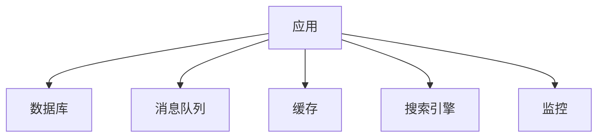
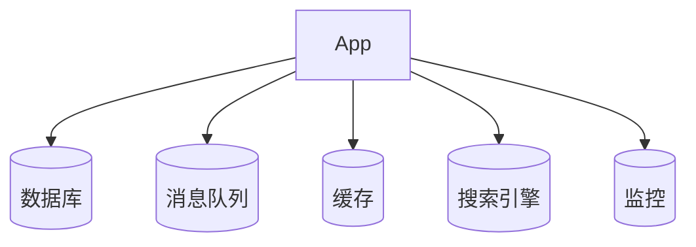
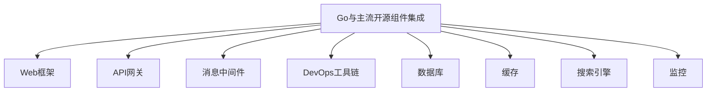

# Go与主流开源组件集成

## 0. 内容导航/索引

- [Go与主流开源组件集成](#go与主流开源组件集成)
  - [0. 内容导航/索引](#0-内容导航索引)
  - [组件集成工程流程模板（Mermaid）](#组件集成工程流程模板mermaid)
  - [1. Web框架与API网关](#1-web框架与api网关)
    - [组件对比](#组件对比)
    - [工程案例](#工程案例)
    - [批判性分析](#批判性分析)
    - [1.6 知识点小结](#16-知识点小结)
  - [2. 消息中间件](#2-消息中间件)
    - [典型组件](#典型组件)
    - [工程案例](#工程案例-1)
    - [批判性分析](#批判性分析-1)
    - [2.6 知识点小结](#26-知识点小结)
  - [3. DevOps与自动化](#3-devops与自动化)
    - [持续集成/部署](#持续集成部署)
    - [批判性分析](#批判性分析-2)
    - [范畴论视角](#范畴论视角)
    - [3.6 知识点小结](#36-知识点小结)
  - [4. 更多组件类型与行业集成案例](#4-更多组件类型与行业集成案例)
    - [组件类型扩展](#组件类型扩展)
    - [行业集成案例](#行业集成案例)
    - [最新趋势](#最新趋势)
  - [5. 哲科工程分析与多表征](#5-哲科工程分析与多表征)
  - [6. 组件选型与集成经验](#6-组件选型与集成经验)
  - [7. 常见集成反模式与规避](#7-常见集成反模式与规避)
  - [8. 未来组件趋势](#8-未来组件趋势)
  - [9. 参考文献与外部链接](#9-参考文献与外部链接)
  - [10. 常见问题答疑（FAQ）](#10-常见问题答疑faq)
  - [11. 最佳实践清单](#11-最佳实践清单)
  - [12. 典型错误案例剖析](#12-典型错误案例剖析)
  - [13. 进阶阅读推荐](#13-进阶阅读推荐)
  - [全局知识地图（Mermaid）](#全局知识地图mermaid)
  - [14. 工程模板/脚手架代码示例](#14-工程模板脚手架代码示例)
    - [Gin Web服务基础模板](#gin-web服务基础模板)
    - [Prometheus监控集成](#prometheus监控集成)
  - [15. 常见面试题/考点](#15-常见面试题考点)
  - [16. 术语表/缩略语解释](#16-术语表缩略语解释)
  - [17. 常见陷阱与误区对照表](#17-常见陷阱与误区对照表)

---

> 交叉引用：
>
> - 架构设计模式详见[01-Go架构设计模式总览](./01-Go架构设计模式总览.md)
> - 工作流与行业应用详见[04-Go工作流与行业应用模式](./04-Go工作流与行业应用模式.md)

## 组件集成工程流程模板（Mermaid）



## 1. Web框架与API网关

### 组件对比

- Echo、Gin：高性能、简洁API
- Kratos、go-zero：企业级微服务

### 工程案例

- 代码片段：

```go
import "github.com/labstack/echo/v4"
e := echo.New()
e.GET("/", func(c echo.Context) error { return c.String(200, "Hello, World!") })
```

### 批判性分析

- Go Web生态成熟，适合高性能API

### 1.6 知识点小结

- Web框架与API网关是Go服务开发的基础。
- 工程落地建议：优先选用社区活跃、文档完善的框架。

## 2. 消息中间件

### 典型组件

- NATS、Kafka、RabbitMQ

### 工程案例

- 代码片段：

```go
import "github.com/nats-io/nats.go"
nc, _ := nats.Connect(nats.DefaultURL)
nc.Publish("updates", []byte("hello"))
nc.Subscribe("updates", func(m *nats.Msg) { fmt.Println(string(m.Data)) })
```

### 批判性分析

- Go高并发特性与消息中间件契合，适合高吞吐场景

### 2.6 知识点小结

- 消息中间件提升系统解耦与弹性。
- 工程落地建议：结合业务场景选型，关注性能与可观测性。

## 3. DevOps与自动化

### 持续集成/部署

- Drone、GitHub Actions、Jenkins
- Go编译产物易容器化、自动化部署

### 批判性分析

- 多阶段流水线需结合K8s、Argo CD等工具

### 范畴论视角

- 组件为对象，消息/请求为态射，系统为集成范畴

### 3.6 知识点小结

- DevOps工具链助力自动化运维与持续交付。
- 工程落地建议：集成监控、告警、自动化部署等能力。

## 4. 更多组件类型与行业集成案例

### 组件类型扩展

- 数据库驱动：gorm、sqlx、ent
- 缓存中间件：go-redis、groupcache
- 搜索引擎：bleve、elastic-go
- 监控告警：prometheus、grafana、alertmanager

### 行业集成案例

- 金融：高可用账务系统集成分布式缓存与消息队列
- 互联网：大规模内容分发集成API网关与搜索引擎
- 制造：IOT平台集成时序数据库与实时监控

### 最新趋势

- 组件云原生化、服务网格化、可观测性增强
- DevOps工具链与业务系统深度融合

## 5. 哲科工程分析与多表征

- 组件集成模式体现"系统组合""异构协作"哲学思想，强调模块化与可插拔性
- 工程实践需关注"依赖地狱""版本兼容"问题，保持系统的可维护性
- Mermaid集成图、伪代码、数学表达式等多表征方式辅助理解



- 数学表达式：
  - 设C为组件集合，A为应用集合，存在映射f: A×C→I，I为集成关系集合

## 6. 组件选型与集成经验

- 选型时优先考虑社区活跃度高、文档完善、易于二次开发的组件
- 组件集成需关注版本兼容、接口稳定性与性能瓶颈
- 建议通过接口适配层解耦业务与第三方组件，提升可维护性

## 7. 常见集成反模式与规避

- 直接依赖第三方组件细节，导致升级困难
- 忽视监控与告警，集成后难以定位问题
- 组件配置混乱，缺乏统一管理

## 8. 未来组件趋势

- 组件云原生化、服务网格化、可观测性增强
- 组件自动化运维与智能化配置
- 组件生态与业务平台深度融合

## 9. 参考文献与外部链接

- [Go开源组件大全](https://github.com/avelino/awesome-go)
- [Prometheus监控](https://prometheus.io/)
- [go-redis官方文档](https://redis.uptrace.dev/)
- [gorm官方文档](https://gorm.io/zh_CN/)
- [Service Mesh生态](https://servicemesh.es/)

## 10. 常见问题答疑（FAQ）

- Q: 如何选择合适的Go开源组件？
  A: 关注社区活跃度、文档质量、兼容性和实际业务需求。
- Q: 组件升级如何规避风险？
  A: 采用接口适配层、自动化测试和灰度发布策略。

## 11. 最佳实践清单

- 组件集成前先做PoC验证，评估性能与兼容性
- 统一配置管理，避免"配置地狱"
- 监控与告警全覆盖，及时发现集成问题

## 12. 典型错误案例剖析

- 案例：直接依赖第三方组件细节，升级时大面积重构
- 案例：缺乏监控，组件故障难以定位

## 13. 进阶阅读推荐

- [Go Modules官方文档](https://blog.golang.org/using-go-modules)
- [Go开源组件选型指南](https://segmentfault.com/a/1190000022928245)
- [Cloud Native Landscape](https://landscape.cncf.io/)

## 全局知识地图（Mermaid）



## 14. 工程模板/脚手架代码示例

### Gin Web服务基础模板

```go
import "github.com/gin-gonic/gin"
r := gin.Default()
r.GET("/ping", func(c *gin.Context) {
    c.JSON(200, gin.H{"message": "pong"})
})
r.Run()
```

### Prometheus监控集成

```go
import "github.com/prometheus/client_golang/prometheus/promhttp"
http.Handle("/metrics", promhttp.Handler())
http.ListenAndServe(":2112", nil)
```

## 15. 常见面试题/考点

- 如何选择合适的Web框架？
- 消息中间件选型时需关注哪些指标？
- 如何实现组件的可观测性？
- Go项目中如何集成Prometheus监控？
- 组件升级时如何保证业务平滑过渡？

## 16. 术语表/缩略语解释
- ORM：对象关系映射（Object-Relational Mapping）
- API Gateway：API网关
- CI/CD：持续集成/持续部署（Continuous Integration/Continuous Deployment）
- Prometheus：开源监控系统
- Service Mesh：服务网格

## 17. 常见陷阱与误区对照表
| 陷阱/误区 | 说明 | 规避建议 |
|---|---|---|
| 组件依赖地狱 | 依赖复杂，升级困难 | 采用接口适配层，统一管理依赖 |
| 监控缺失 | 故障难定位 | 集成Prometheus等监控工具 |
| 配置混乱 | 多环境配置不一致 | 统一配置中心，分环境管理 |
| 组件版本不兼容 | 运行异常 | 组件升级前充分测试与灰度发布 |
