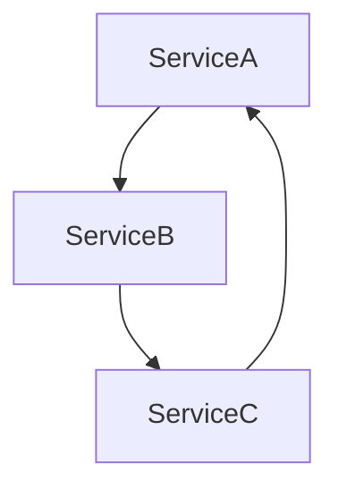

# Go架构模式形式化与证明

## 1. 形式化定义

- 用伪代码、流程图、UML、数学表达式描述关键模式

## 2. 组合性与可扩展性

- 设计模式可通过接口组合、装饰器、责任链等方式实现高可复用性
- 形式化表达：若A、B为模式对象，存在组合操作⊕，使得A⊕B仍为有效模式
- 可扩展性：对任意S，存在扩展E(S)，使得E(S) ⊇ S，且E(S)满足原有接口规范

## 3. 范畴论视角

- 对象：服务、模块、goroutine
- 态射：接口、channel、消息
- 组合：服务编排、模式复用

## 4. 工程意义

- 通过范畴论抽象，提升架构的可组合性、可扩展性、可证明性
- 典型例子：微服务编排=范畴组合，事件驱动=态射传递

## 5. 数学表达式

- 设S为服务集合，M为消息集合，存在组合操作⊕，使得S1⊕S2可通过消息M通信
- 可扩展性：对任意S，存在扩展E(S)，使得E(S) ⊇ S，且E(S)满足原有接口规范

## 6. 更多理论工具与工程案例

### 理论工具扩展

- 类型论、图论、自动机理论在架构模式中的应用
- 形式化验证工具：TLA+、Alloy、Coq等

### 工程案例

- 微服务组合的形式化建模与验证
- 并发模式的死锁/活性分析

### 最新趋势

- 架构自动化推理、形式化验证、智能合成
- 结合AI进行架构模式发现与优化

## 7. 哲科工程分析与多表征

- 形式化方法体现"可证明性""可推理性"哲学思想，强调系统的可靠性与可解释性
- 工程实践需关注"理论与实际脱节"问题，推动理论创新与工程落地结合
- Mermaid结构图、伪代码、数学表达式等多表征方式辅助理解

- 数学表达式：
  - 设M为模式集合，T为理论工具集合，存在映射f: M×T→V，V为验证结果集合

## 8. 形式化落地经验
- 推荐在关键业务流程、分布式一致性、并发安全等场景引入形式化建模与验证
- 结合TLA+、Alloy等工具进行协议、算法的建模与自动化检查
- 形式化方法需与工程实践结合，避免"纸上谈兵"

## 9. 常见理论与实践脱节问题
- 理论模型过于理想化，忽视实际系统的复杂性与不确定性
- 形式化验证流程繁琐，难以大规模推广
- 工程团队缺乏理论背景，难以理解和应用

## 10. 未来发展方向
- 形式化验证与自动化推理工具持续进化，门槛降低
- AI辅助架构建模与验证成为趋势
- 理论与工程深度融合，推动高可靠系统建设

## 11. 参考文献与外部链接
- [TLA+官方文档](https://lamport.azurewebsites.net/tla/tla.html)
- [Alloy Analyzer](https://alloytools.org/)
- [Coq形式化证明](https://coq.inria.fr/)
- [形式化方法综述](https://en.wikipedia.org/wiki/Formal_methods)
- [分布式系统一致性理论](https://jepsen.io/)

## 12. 常见问题答疑（FAQ）
- Q: 形式化方法在实际项目中如何落地？
  A: 关键业务、协议、算法等场景优先引入，结合自动化工具辅助建模与验证。
- Q: 工程团队如何提升形式化能力？
  A: 组织专题培训、引入专家辅导、推动理论与实践结合。

## 13. 最佳实践清单
- 关键流程、协议、算法优先建模与验证
- 工程与理论团队协作，推动知识转化
- 持续关注工具链与社区动态，及时引入新方法

## 14. 典型错误案例剖析
- 案例：理论模型与实际系统脱节，导致验证结果无效
- 案例：形式化流程繁琐，团队抵触，推广失败

## 15. 进阶阅读推荐
- [Formal Methods for the Informal Engineer](https://www.hillelwayne.com/post/formal-methods-presentation/)
- [Practical TLA+](https://learntla.com/)
- [Software Foundations (Coq)](https://softwarefoundations.cis.upenn.edu/)
